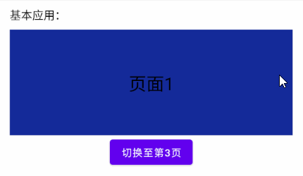

# 简介
ViewPager是一种多页面组合翻页显示控件，我们向ViewPager中填充多个Fragment后，用户可以使用滑动手势在Fragment之间切换。

本章示例代码详见以下链接：

- [🔗 示例工程：ViewPager](https://github.com/BI4VMR/Study-Android/tree/master/M03_UI/C04_CtrlExt/S02_ViewPager)

# 基本应用
我们首先创建TestFragment，其中包括一个文本框，用于显示构造实例时传入的名称标识，此处省略相关代码，详见示例程序。

ViewPager使用适配器模式组织页面，我们通常继承FragmentStatePagerAdapter并重写其中的一些方法。

"MyVPAdapter.java":

```java
public class MyVPAdapter extends FragmentStatePagerAdapter {

    // 数据源List
    private final List<TestFragment> pages;

    // 构造方法
    public MyVPAdapter(@NonNull FragmentManager fm, List<TestFragment> pages) {
        super(fm, BEHAVIOR_RESUME_ONLY_CURRENT_FRAGMENT);
        this.pages = pages;
    }

    // 获取页面数量
    @Override
    public int getCount() {
        return pages.size();
    }

    // 获取当前位置的Fragment
    @NonNull
    @Override
    public Fragment getItem(int position) {
        return pages.get(position);
    }
}
```

上述内容也可以使用Kotlin语言进行书写：

"MyVPAdapterKT.kt":

```kotlin
class MyVPAdapterKT(
    fm: FragmentManager,
    // 数据源List
    private val pages: List<TestFragmentKT>
) : FragmentStatePagerAdapter(fm, BEHAVIOR_RESUME_ONLY_CURRENT_FRAGMENT) {

    // 获取页面数量。
    override fun getCount(): Int {
        return pages.size
    }

    // 获取当前位置的Fragment。
    override fun getItem(position: Int): Fragment {
        return pages[position]
    }
}
```

我们在初始化MyVPAdapter时使用List存放Fragment实例；当系统加载ViewPager时，首先回调 `getCount()` 方法获取总的页面数量；然后回调 `getItem()` 方法加载当前显示的页面及需要预加载的页面。

然后我们在测试Activity的布局文件中放置ViewPager控件：

"testui_base.xml":

```xml
<FrameLayout xmlns:android="http://schemas.android.com/apk/res/android"
    android:layout_width="match_parent"
    android:layout_height="match_parent">

    <androidx.viewpager.widget.ViewPager
        android:id="@+id/viewpager"
        android:layout_width="match_parent"
        android:layout_height="150dp" />
</FrameLayout>
```

ViewPager的高度只能是"match_parent"或者确定的数值，如果设为"wrap_content"效果等同于"match_parent"。

我们在测试Activity中初始化10个TestFragment实例，并将它们通过适配器添加到ViewPager中。

"TestUIBase.java":

```java
// 创建测试页面
List<TestFragment> pages = new ArrayList<>();
for (int i = 1; i <= 10; i++) {
    pages.add(TestFragment.newInstance("页面" + i));
}

// 创建适配器实例
MyVPAdapter adapter = new MyVPAdapter(this, pages);
// 将适配器与ViewPager绑定
viewpager.setAdapter(adapter);
```

上述内容也可以使用Kotlin语言进行书写：

"TestUIBaseKT.kt":

```kotlin
// 创建测试页面
val pages: MutableList<TestFragmentKT> = mutableListOf()
for (i in 1..10) {
    pages.add(TestFragmentKT.newInstance("页面$i"))
}

// 创建适配器实例
val adapter = MyVPAdapterKT(supportFragmentManager, pages)
// 将适配器与ViewPager绑定
viewpager.adapter = adapter
```

此时运行示例程序，并查看界面外观：

<div align="center">



</div>

除了由用户触摸控制翻页之外，我们还可以调用ViewPager的 `setCurrentItem(int item, boolean smoothScroll)` 方法控制翻页，第一参数 `item` 为目标页面的索引；第二参数 `smoothScroll` 为是否需要播放过渡动画，设为"true"时与触控翻页类似，设为"false"时将瞬间切换至目标页面。

ViewPager还有一个 `setCurrentItem(int item)` 方法，内部调用了具有2个参数的同名方法，且 `smoothScroll` 参数为"true"，我们可以根据实际需要选择。

# 监听器
## OnPageChangeListener
OnPageChangeListener用于监听ViewPager的页面滑动事件，每当页面进行切换时其中的事件将被触发。

我们可以使用ViewPager的 `addOnPageChangeListener(ViewPager.OnPageChangeListener l)` 方法注册监听器，同一个ViewPager支持注册多个监听器。当我们不再需要某个监听器时，可以调用ViewPager的 `removeOnPageChangeListener(ViewPager.OnPageChangeListener l)` 方法注销监听器。

OnPageChangeListener拥有三个回调方法，它们的详情分别如下文内容所示：

🔷 `onPageScrollStateChanged(int state)`

当滑动状态改变时，该方法将被触发。

唯一参数 `state` 表示滑动状态，数值对应ViewPager的"SCROLL_STATE"系列常量：

- `SCROLL_STATE_IDLE` (0) : 表示滑动完毕，动画播放结束，目标页面已经完全显示。
- `SCROLL_STATE_DRAGGING` (1) : 表示用户用手指按住屏幕，当前正在进行拖拽。
- `SCROLL_STATE_SETTLING` (2) : 表示用户手指已离开屏幕，ViewPager向目标页面自动滑动，以使其完全显示。

🔷 `onPageSelected(int position)`

当用户滑动完毕最终选定某个页面时，该方法将被触发。

唯一参数 `position` 表示目标页面在ViewPager中的索引。

该事件仅在目标页面与先前显示的页面不同时触发，如果我们反复拖拽最后抬手时又回到了拖拽前显示的页面，则该事件并不会触发。

🔷 `onPageScrolled(int position, float positionOffset, int positionOffsetPixels)`

当页面正在切换时，该方法以较高频率被触发。

第一参数 `position` 表示当前正在滑动的页面索引。第二参数 `positionOffset` 表示当前页面滑动至目标位置的进度，取值范围为 `[0, 1)` ，数值越大则离目标位置越近。第三参数 `positionOffsetPixels` 表示当前页面滑过的像素数量，取值范围为 `[0, <ViewPager宽度>)` 。

<br />

当我们用手指按住屏幕并开始滑动时，将会触发一次 `onPageScrollStateChanged(SCROLL_STATE_DRAGGING)` 事件；当手指从屏幕上离开时，将会触发一次 `onPageScrollStateChanged(SCROLL_STATE_SETTLING)` 事件，并且触发 `onPageSelected()` 事件汇报目标页面索引，随后控件按照手势的滑动方向继续自动滑动，直至目标页面完全进入屏幕，最后触发一次 `onPageScrollStateChanged(SCROLL_STATE_IDLE)` 事件表示滑动终止。

当ViewPager的前一次操作进入自动滑动阶段时，我们可以再次触摸屏幕并手动滑动，此时 `onPageScrollStateChanged()` 事件序列将会变为 `DRAGGING（首次触摸滑动） -> SETTLING（手指离屏） -> DRAGGING（再次触摸滑动） -> SETTLING（手指离屏） -> IDLE（自动滑动结束）` 。

ViewPager除了可以由用户手动控制滑动，还可以通过 `setCurrentItem(int index, false)` 方法禁止动画直接显示目标页面，这种方式只会触发一次 `onPageSelected()` 事件汇报目标页面，以及一次 `onPageScrolled()` 事件，此时"index"值为目标页面，其余值均为"0"。

> 🚩 提示
>
> OnPageChangeListener是一个接口，我们必须实现前文提到的3个抽象方法；有时我们只关心部分事件，为了减少无用代码，可以使用SimpleOnPageChangeListener。
>
> SimpleOnPageChangeListener是OnPageChangeListener接口的实现类，提供3个抽象方法的空实现，我们可以继承SimpleOnPageChangeListener，并重写我们关心的方法。

# 限制连续滑动
正如相关章节 [🧭 OnPageChangeListener](#onpagechangelistener) 中的描述，用户可以在ViewPager仍在自动滑动状态时再次触摸屏幕手动滑动，这在短视频播放器、复杂转场动效等场景下可能导致诸多问题。

我们可以在ViewPager上层覆盖一层遮罩控件，当遮罩控件接收到触摸事件时，如果ViewPager仍在滑动状态，则消耗新到达的触摸事件，以实现每次触控只能翻一页的效果。

我们首先创建遮罩控件VPTouchMaskView，并实现触摸事件拦截逻辑。

"VPTouchMaskView.java":

```java
public class VPTouchMaskView extends View {

    // ViewPager滑动状态
    private boolean vpScrolling = false;

    @Override
    public boolean dispatchTouchEvent(MotionEvent event) {
        if (vpScrolling) {
            // ViewPager滑动未结束时，该View消耗新到达的触摸事件，不再分发给下层的ViewPager。
            return true;
        } else {
            return super.dispatchTouchEvent(event);
        }
    }

    // 更新ViewPager的滑动状态
    public void updateVPScrollState(int state) {
        // 当ViewPager滑动状态不为SCROLL_STATE_IDLE(0)时，说明滑动未终止。
        vpScrolling = (state != 0);
    }

    /* 此处省略部分代码... */
}
```

上述内容也可以使用Kotlin语言进行书写：

"VPTouchMaskViewKT.kt":

```kotlin
class VPTouchMaskViewKT : View {

    // ViewPager滑动状态
    private var vpScrolling: Boolean = false

    override fun dispatchTouchEvent(event: MotionEvent): Boolean {
        return if (vpScrolling) {
            // ViewPager滑动未结束时，该View消耗新到达的触摸事件，不再分发给下层的ViewPager。
            true
        } else {
            super.dispatchTouchEvent(event)
        }
    }

    // 更新ViewPager的滑动状态
    fun updateVP2ScrollState(state: Int) {
        // 当ViewPager滑动状态不为SCROLL_STATE_IDLE(0)时，说明滑动未终止。
        vpScrolling = (state != 0)
    }
}
```

然后在布局文件中将遮罩控件覆盖在ViewPager之上，并与ViewPager的尺寸保持一致。

"testui_swipe1page.xml":

```xml
<androidx.viewpager.widget.ViewPager
    android:id="@+id/viewpager"
    android:layout_width="match_parent"
    android:layout_height="150dp" />

<net.bi4vmr.study.swipe1page.VPTouchMaskView
    android:id="@+id/touchMaskView"
    android:layout_width="match_parent"
    android:layout_height="150dp" />
```

最后在测试Activity中注册ViewPager的OnPageChangeListener监听器，将滑动状态传递给VPTouchMaskView。

"TestUISwipe1Page.java":

```java
// 注册监听器：OnPageChangeListener
viewpager.addOnPageChangeListener(new ViewPager.SimpleOnPageChangeListener() {

    @Override
    public void onPageScrollStateChanged(int state) {
        touchMaskView.updateVPScrollState(state);
    }
});
```

上述内容也可以使用Kotlin语言进行书写：

"TestUISwipe1PageKT.kt":

```kotlin
// 注册监听器：OnPageChangeListener
viewpager.addOnPageChangeListener(object : ViewPager.SimpleOnPageChangeListener() {

    override fun onPageScrollStateChanged(state: Int) {
        touchMaskView.updateVPScrollState(state)
    }
})
```

# 页面的生命周期
ViewPager的 `setOffscreenPageLimit()` 方法用于控制预加载的页面数量，默认值为"1"，即预加载当前页面两侧的一个页面，使它们的生命周期达到"STARTED"；当我们将数值设为"N"时，ViewPager将会预加载可见页面两侧的N个页面；当我们将数值设为小于"1"的值时，等同于"1"，无法关闭预加载机制。

我们使用默认的预加载参数，然后再次运行示例程序，并查看控制台输出信息：

```text
05-10 22:41:15.763  2357  2357 I TestApp: 页面1 OnCreate.
05-10 22:41:15.764  2357  2357 I TestApp: 页面1 OnCreateView.
05-10 22:41:15.766  2357  2357 I TestApp: 页面1 OnStart.
05-10 22:41:15.767  2357  2357 I TestApp: 页面2 OnCreate.
05-10 22:41:15.767  2357  2357 I TestApp: 页面2 OnCreateView.
05-10 22:41:15.768  2357  2357 I TestApp: 页面2 OnStart.
05-10 22:41:15.768  2357  2357 I TestApp: 页面1 OnResume.
```

此时“页面1”完全可见，进入"RESUMED"状态，与它相邻的“页面2”被预加载，其生命周期到达"STARTED"状态。

随后我们将ViewPager滑动至第二个页面，再次查看控制台输出信息：

```text
05-10 22:47:05.656  2357  2357 I TestApp: 页面3 OnCreate.
05-10 22:47:05.657  2357  2357 I TestApp: 页面3 OnCreateView.
05-10 22:47:05.659  2357  2357 I TestApp: 页面3 OnStart.
05-10 22:47:05.659  2357  2357 I TestApp: 页面1 OnPause.
05-10 22:47:05.659  2357  2357 I TestApp: 页面2 OnResume.
```

此时“页面2”的生命周期到达"RESUMED"状态；与它相邻的“页面3”被预加载，其生命周期到达"STARTED"状态；“页面1”不可见，生命周期进入"PAUSED"状态。

ViewPager提供了两种内置Adapter用于容纳Fragment，它们的接口形式是相同的，但是页面缓存行为有所不同。

对于FragmentStatePagerAdapter，当页面移至预加载区域之外后，Adapter将会使用视图数据保持机制暂存数据，然后销毁整个Fragment实例；当用户再次滑动进入该页面时，Adapter将会创建新的Fragment实例并恢复数据。视图数据保持机制的相关细节可参考以下章节： [🧭 Activity - 视图数据保持](../01_通用组件/02_Activity.md#视图数据保持) 。

对于FragmentPagerAdapter，当页面移至预加载区域之外后，Adapter不会销毁整个Fragment实例，而是将其从视图中Detach，此时Fragment实例仍然驻留在内存中；当用户再次滑动进入该页面时，Adapter将会复用旧的Fragment实例重新创建视图。

如果我们需要显示大量的Fragment，应当使用FragmentStatePagerAdapter；如果我们只需要显示少量固定的页面，则可以选择FragmentPagerAdapter。
