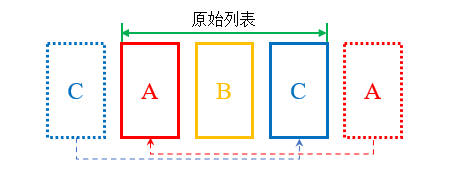

# 简介
ViewPager2是ViewPager的升级版本，与ViewPager相比，它新增了可配置的预加载、RTL支持、模拟拖拽等特性。ViewPager2基于RecyclerView实现，因此它也具有RecyclerView的所有特性。

ViewPager2是AndroidX中的组件，如果我们需要使用指定的版本，可以在Gradle配置文件中声明组件依赖：

```groovy
dependencies {
    implementation("androidx.viewpager2:viewpager2:1.0.0")
}
```

本章示例代码详见以下链接：

- [🔗 示例工程：ViewPager2](https://github.com/BI4VMR/Study-Android/tree/master/M03_UI/C04_CtrlExt/S03_ViewPager2)

# 基本应用
我们首先创建 `TestFragment` ，其中包括一个文本框，用于显示构造实例时传入的名称标识，此处省略相关代码，详见示例程序。

ViewPager2所使用的适配器是FragmentStateAdapter，我们创建它的子类MyVPAdapter并重写其中的一些方法。

"MyVPAdapter.java":

```java
public class MyVPAdapter extends FragmentStateAdapter {

    // 数据源List
    private final List<TestFragment> pages;

    // 构造方法
    public MyVPAdapter(FragmentActivity activity, List<TestFragment> pages) {
        super(activity);
        this.pages = pages;
    }

    // 创建Fragment实例。
    @NonNull
    @Override
    public Fragment createFragment(int position) {
        return pages.get(position);
    }

    // 获取页面数量。
    @Override
    public int getItemCount() {
        return pages.size();
    }
}
```

上述内容也可以使用Kotlin语言进行书写：

"MyVPAdapterKT.kt":

```kotlin
class MyVPAdapterKT(
    activity: FragmentActivity,
    // 数据源List
    private val pages: List<TestFragmentKT>
) : FragmentStateAdapter(activity) {

    companion object {
        private val TAG: String = MyVPAdapterKT::class.java.simpleName
    }

    // 获取页面数量。
    override fun getItemCount(): Int {
        Log.d(TAG, "GetItemCount. Count:[${pages.size}]")
        return pages.size
    }

    // 创建Fragment实例。
    override fun createFragment(position: Int): Fragment {
        Log.d(TAG, "CreateFragment. Position:[${pages.size}]")
        return pages[position]
    }
}
```

我们在初始化MyVPAdapter时使用List存放Fragment实例；当系统加载ViewPager2时，首先回调 `getItemCount()` 方法获取总的页面数量；然后回调 `createFragment()` 方法加载当前显示的页面及需要预加载的页面。

然后我们在测试Activity的布局文件中放置ViewPager2控件：

"testui_base.xml":

```xml
<FrameLayout xmlns:android="http://schemas.android.com/apk/res/android"
    android:layout_width="match_parent"
    android:layout_height="match_parent">

    <androidx.viewpager2.widget.ViewPager2
        android:id="@+id/viewpager2"
        android:layout_width="match_parent"
        android:layout_height="150dp" />
</FrameLayout>
```

ViewPager2的高度通常是"match_parent"或者确定的数值，如果设为"wrap_content"可能无法达到预期的效果。

我们在测试Activity中初始化10个TestFragment，将它们通过适配器添加到ViewPager2中。

"TestUIBase.java":

```java
// 创建测试页面
List<TestFragment> pages = new ArrayList<>();
for (int i = 0; i < 10; i++) {
    pages.add(TestFragment.newInstance("页面" + (i + 1)));
}

// 创建适配器实例
MyVPAdapter adapter = new MyVPAdapter(this, pages);
// 将适配器与ViewPager2绑定
viewPager2.setAdapter(adapter);
```

上述内容也可以使用Kotlin语言进行书写：

"TestUIBaseKT.kt":

```kotlin
// 创建测试页面
val pages: MutableList<TestFragmentKT> = mutableListOf()
for (i in 0 until 10) {
    pages.add(TestFragmentKT.newInstance("页面${i + 1}"))
}

// 创建适配器实例
val adapter = MyVPAdapterKT(this, pages)
// 将适配器与ViewPager2绑定
viewpager2.adapter = adapter
```

此时运行示例程序，并查看界面外观：

<div align="center">


</div>

除了由用户触摸控制翻页之外，我们还可以调用ViewPager2的 `setCurrentItem(int item, boolean smoothScroll)` 方法控制翻页，第一参数 `item` 为目标页面的索引；第二参数 `smoothScroll` 为是否需要播放过渡动画，设为"true"时与触控翻页类似，设为"false"时将瞬间切换至目标页面。

ViewPager2还有一个 `setCurrentItem(int item)` 方法，内部调用了具有2个参数的同名方法，且 `smoothScroll` 参数为"true"，我们可以根据实际需要选择。

# 外观定制
## 页面排列方向
ViewPager2默认将页面按水平方向排列，它提供了简单易用的方向变更API，以便我们调整页面排列方向。

以下属性与方法用于获取与设置ViewPager2的页面排列方向：

- XML - 设置页面排列方向 : `android:orientation="<vertical | horizontal>"`
- Java - 设置页面排列方向 : `void setOrientation(int orientation)`
- Java - 获取页面排列方向 : `int getOrientation()`

在Java中表示方向的数值及其含义如下文列表所示：

- ViewPager2.ORIENTATION_HORIZONTAL(0) : 在水平方向上排列。
- ViewPager2.ORIENTATION_VERTICAL(1) : 在垂直方向上排列。

<!-- TODO
## RTL支持
ViewPager2在水平方向上排列页面时，能够适应RTL布局，我们可以通过 `android:layoutDirection="<横向排列方式>"` 属性进行配置。该属性默认值为"ltr"，即从左到右排列；设置为"rtl"表示从右到左排列；设置为"inherit"表示继承父级容器的属性；设置为"locale"表示跟随系统语言。

布局方向属性对应的Java方法如下文所示：

```java
// 获取布局方向
viewPager2.getLayoutDirection();
// 设置布局方向
viewPager2.setLayoutDirection(View.LAYOUT_DIRECTION_*);
```

## 边缘阴影效果
当滑动至首尾页面的边缘时，ViewPager2与RecyclerView的行为是一致的，它会产生一个阴影效果提醒用户滑动至边界了。ViewPager2并没有提供方法控制阴影的开关，在XML中设置 `android:overScrollMode="never"` 属性是无效的，但我们可以获取ViewPager2内部的RecyclerView实例并设置相关属性。

```java
// 获取RecyclerView实例
View rv = viewPager2.getChildAt(0);
if (rv instanceof RecyclerView) {
    // 关闭边缘阴影效果
    rv.setOverScrollMode(View.OVER_SCROLL_NEVER);
}
```
-->

# 监听器
## OnPageChangeCallback
OnPageChangeCallback用于监听ViewPager2的页面滑动事件，每当页面进行切换时其中的事件将被触发。

我们可以使用ViewPager2的 `registerOnPageChangeCallback(ViewPager2.OnPageChangeCallback cb)` 方法注册监听器，同一个ViewPager2支持注册多个监听器。当我们不再需要某个监听器时，可以调用ViewPager的 `unregisterOnPageChangeCallback(ViewPager2.OnPageChangeCallback cb)` 方法注销监听器。

ViewPager2的页面滑动事件与ViewPager完全一致，此处省略具体描述，详见相关章节： [🧭 ViewPager - OnPageChangeListener](./02_ViewPager.md#onpagechangelistener) 。

ViewPager2的OnPageChangeCallback监听器不是抽象的，我们可以按需重写其中的方法，不必全部实现一遍。

# 限制连续滑动
ViewPager2的OnPageChangeCallback监听器与ViewPager的OnPageChangeListener监听器是类似的，因此我们也可以使用同样的方法限制连续滑动，此处省略具体描述，详见相关章节： [🧭 ViewPager - 限制连续滑动](./02_ViewPager.md#限制连续滑动) 。

# 循环滑动
## 简介
ViewPager2的页面是一个单向队列，当我们滑动至队列末尾时，无法继续滑动从队列首部重新加载页面。

我们可以通过一些方法调整页面的切换逻辑，模拟循环滑动效果，使用户感觉页面队列是无尽循环的，实现轮播图等需求。

## 实现方法一
我们可以在页面队列首部插入原始列表末尾页面的副本，并在页面队列尾部插入原始列表首个页面的副本；当用户滑动至页面队列两侧的副本页面时，调用 `setCurrentItem(int item, boolean smoothScroll)` 方法将页面切换至副本对应的原始页面。我们在执行页面切换时需要禁止过渡动画，使得用户无法察觉切换过程。

该方法的页面队列结构如下文图片所示：

<div align="center">



</div>

当用户从第二页（页面A）滑动至左侧的页面C（副本页面）后，我们通过无动画的 `setCurrentItem()` 方法瞬间切换至第四页（原始页面）。

类似的，当用户从第四页（页面C）滑动至右侧的页面A（副本页面）后，我们需要切换至第二页（原始页面），跳转到原始队列的头部，模拟循环队列。

我们首先通过以下代码片段构造前文所述的页面队列结构：

"TestUILoop1.java":

```java
// 创建测试页面1-3
List<TestFragment> fmList = new ArrayList<>();
for (int i = 1; i <= 3; i++) {
    fmList.add(TestFragment.newInstance("页面" + i));
}

List<TestFragment> pages = new ArrayList<>();
// 向列表首部添加最后一项
pages.add(TestFragment.newInstance("页面3"));
// 添加所有的列表项
pages.addAll(fmList);
// 向列表尾部添加第一项
pages.add(TestFragment.newInstance("页面1"));

// 更新数据
adapter.updatePages(pages);
// 数据更新完毕后，切换至原始列表中的第一页。
viewpager2.post(() -> {
    if (adapter.getItemCount() > 0) {
        viewpager2.setCurrentItem(1, false);
    }
});
```

上述内容也可以使用Kotlin语言进行书写：

"TestUILoop1KT.kt":

```kotlin
// 创建测试页面1-3
val fmList: MutableList<TestFragmentKT> = mutableListOf()
for (i in 1..3) {
    fmList.add(TestFragmentKT.newInstance("页面$i"))
}

val pages: MutableList<TestFragmentKT> = mutableListOf()
// 向列表首部添加最后一项
pages.add(TestFragmentKT.newInstance("页面3"))
// 添加所有的列表项
pages.addAll(fmList)
// 向列表尾部添加第一项
pages.add(TestFragmentKT.newInstance("页面1"))

// 更新数据
adapter.updatePages(pages)
// 数据更新完毕后，切换至原始列表中的第一页。
viewpager2.post {
    if (adapter.itemCount > 0) {
        viewpager2.setCurrentItem(1, false)
    }
}
```

在构造页面队列时，我们使用相同的参数创建了“页面1”与“页面3”的TestFragment实例，而不是直接使用原始列表 `fmList` 中已经存在的实例，这是因为RecyclerView存在复用机制，表项不可见时不会立刻被销毁；Fragment或View同一时刻只能与一个表项相关联，如果页面队列中多个表项指向相同的TestFragment实例，就容易产生冲突导致程序崩溃。

在适配器的 `updatePages()` 方法中，我们调用了 `notifyDataSetChanged()` 方法更新数据，由于该操作不会阻塞当前线程，后续切换至原始列表第一页的 `setCurrentItem()` 操作需要提交到ViewPager2事件队列中执行。此处省略具体描述，详见相关章节： [🧭 RecyclerView - 疑难解答 - 案例一](./01_RecyclerView.md#案例一) 。

接着我们需要在测试Activity注册ViewPager2的OnPageChangeCallback监听器，当滑动终止时，判断页面是否为边缘的副本页面，并切换至原始列表中的对应页面。

"TestUILoop1.java":

```java
@Override
public void onPageScrollStateChanged(int state) {
    // 滑动停止时进行判断
    if (state == 0) {
        // 当前页面索引
        int index = viewpager2.getCurrentItem();
        // 最大页面索引
        int maxIndex = adapter.getItemCount() - 1;
        if (index == 0) {
            /* 当前为首页（原始列表的最后一项） */
            // 滑动至原始列表的最后一项（即当前列表的倒数第二项）
            viewpager2.setCurrentItem(maxIndex - 1, false);
        } else if (index == maxIndex) {
            /* 当前为末页（原始列表的第一项） */
            // 滑动至原始列表的第一项（即当前列表的第二项）
            viewpager2.setCurrentItem(1, false);
        }
    }
}
```

上述内容也可以使用Kotlin语言进行书写：

"TestUILoop1KT.kt":

```kotlin
override fun onPageScrollStateChanged(state: Int) {
    // 滑动停止时进行判断
    if (state == 0) {
        // 当前页面索引
        val index = binding.viewpager2.currentItem
        // 最大页面索引
        val maxIndex = adapter.itemCount - 1
        if (index == 0) {
            /* 当前为首页（原始列表的最后一项） */
            // 滑动至原始列表的最后一项（即当前列表的倒数第二项）
            viewpager2.setCurrentItem(maxIndex - 1, false)
        } else if (index == maxIndex) {
            /* 当前为末页（原始列表的第一项） */
            // 滑动至原始列表的第一项（即当前列表的第二项）
            viewpager2.setCurrentItem(1, false)
        }
    }
}
```

此时运行示例程序，并查看界面外观：

<div align="center">


</div>

## 实现方法二
我们可以将适配器的页面数量设为一个很大的数值，当ViewPager2加载页面时，使用适配器索引与实际的页面数量进行取模运算，实现二者之间的映射，循环加载数据源列表对应的页面。

该方法的页面队列结构如下文图片所示：

<div align="center">

<!-- TODO

-->

</div>

我们首先通过以下代码片段实现前文所述的页面映射逻辑：

"MyVPAdapter.java":

```java
public class MyVPAdapter extends FragmentStateAdapter {

    // 数据源List
    private final List<String> datas = new ArrayList<>();

    // 更新数据项。
    public void updateDatas(@NonNull List<String> newDatas) {
        datas.clear();
        datas.addAll(newDatas);

        notifyDataSetChanged();
    }

    // 获取页面数量。
    @Override
    public int getItemCount() {
        // 返回一个很大的数值
        return Short.MAX_VALUE;
    }

    // 获取当前位置的Fragment。
    @NonNull
    @Override
    public Fragment createFragment(int position) {
        // 取模运算，将页面索引映射到实际的页面队列中。
        int index = position % datas.size();
        String name = datas.get(index);
        return TestFragment.newInstance(name);
    }

    /* 此处省略部分代码... */
}
```

上述内容也可以使用Kotlin语言进行书写：

"MyVPAdapterKT.kt":

```kotlin
class MyVPAdapterKT(activity: FragmentActivity) : FragmentStateAdapter(activity) {

    // 数据源List
    private val datas: MutableList<String> = mutableListOf()

    // 更新数据项。
    public fun updatePages(newDatas: List<String>) {
        datas.clear()
        datas.addAll(newDatas)

        notifyDataSetChanged()
    }

    // 获取页面数量。
    override fun getItemCount(): Int {
        // 返回一个很大的数值
        return Short.MAX_VALUE.toInt()
    }

    // 获取当前位置的Fragment。
    override fun createFragment(position: Int): Fragment {
        // 取模运算，将页面索引映射到实际的页面队列中。
        val index = position % datas.size
        val name = datas[index]
        return TestFragment.newInstance(name)
    }

    /* 此处省略部分代码... */
}
```

然后我们在测试Activity中创建测试数据，并通过适配器更新到ViewPager2中。

"TestUILoop2.java":

```java
// 创建测试页面1-3
List<String> nameList = new ArrayList<>();
for (int i = 1; i <= 3; i++) {
    nameList.add("页面" + i);
}

// 更新数据
adapter.updateDatas(nameList);
// 数据更新完毕后，切换至中间的一页。
viewpager2.post(() -> {
    if (adapter.getItemCount() > 0) {
        viewpager2.setCurrentItem(adapter.getItemCount() / 2, false);
    }
});
```

上述内容也可以使用Kotlin语言进行书写：

"TestUILoop2KT.kt":

```kotlin
// 创建测试页面1-3
val nameList: MutableList<String> = mutableListOf()
for (i in 1..3) {
    nameList.add("页面$i")
}

// 更新数据
adapter.updatePages(nameList)
// 数据更新完毕后，切换至中间的一页。
viewpager2.post {
    if (adapter.itemCount > 0) {
        viewpager2.setCurrentItem(adapter.itemCount / 2, false)
    }
}
```

为了实现两侧方向均可滑动，当数据更新完毕后，我们需要将当前页面切换至队列中间的位置。

与前文的“实现方法一”相比，该方法不需要修改页面队列结构以及瞬间切换页面，在某些场景下连续性更好，但是页面数量是有限的，在极端场景下会露出破绽，我们可以根据实际需要选择这两种方式。

<!-- TODO
# 预加载
ViewPager2可以预加载可见页面两侧的页面，以提升切换时画面的连续性。ViewPager2的 `setOffscreenPageLimit()` 方法用于控制预加载的页面数量，默认值为"-1"，即不进行预加载；当该数值设为"N"时，将会预加载可见页面两侧的N个页面，使它们的生命周期达到"Started"。

我们为Fragment的生命周期方法添加日志，然后使用默认预加载参数，运行程序并查看日志。

```text
2022-06-13 23:57:16.106 2553-2553/? I/myapp: 页面1-onCreate()
2022-06-13 23:57:16.106 2553-2553/? I/myapp: 页面1-onCreateView()
2022-06-13 23:57:16.110 2553-2553/? I/myapp: 页面1-onViewCreated()
2022-06-13 23:57:16.111 2553-2553/? I/myapp: 页面1-onViewStateRestored()
2022-06-13 23:57:16.111 2553-2553/? I/myapp: 页面1-onStart()
2022-06-13 23:57:16.112 2553-2553/? I/myapp: 页面1-onResume()
```

此时仅有“页面1”的生命周期到达"Resumed"，其它页面都没有被加载。

我们将ViewPager2滑动至第二个页面，再次查看日志。

```text
2022-06-13 23:57:28.181 2553-2553/? I/myapp: 页面2-onCreate()
2022-06-13 23:57:28.181 2553-2553/? I/myapp: 页面2-onCreateView()
2022-06-13 23:57:28.184 2553-2553/? I/myapp: 页面2-onViewCreated()
2022-06-13 23:57:28.185 2553-2553/? I/myapp: 页面2-onViewStateRestored()
2022-06-13 23:57:28.185 2553-2553/? I/myapp: 页面2-onStart()
2022-06-13 23:57:28.995 2553-2553/? I/myapp: 页面1-onPause()
2022-06-13 23:57:28.995 2553-2553/? I/myapp: 页面2-onResume()
```

此时可以发现仅“页面2”加载并可见，没有预加载右侧的“页面3”。

接着我们再将预加载页面数量设为"1"，重新运行程序并查看日志。

```text
2022-06-14 00:06:42.188 2644-2644/? I/myapp: 页面1-onCreate()
2022-06-14 00:06:42.189 2644-2644/? I/myapp: 页面1-onCreateView()
2022-06-14 00:06:42.192 2644-2644/? I/myapp: 页面1-onViewCreated()
2022-06-14 00:06:42.193 2644-2644/? I/myapp: 页面1-onViewStateRestored()
2022-06-14 00:06:42.193 2644-2644/? I/myapp: 页面1-onStart()
2022-06-14 00:06:42.194 2644-2644/? I/myapp: 页面1-onResume()
2022-06-14 00:06:42.198 2644-2644/? I/myapp: 页面2-onCreate()
2022-06-14 00:06:42.198 2644-2644/? I/myapp: 页面2-onCreateView()
2022-06-14 00:06:42.201 2644-2644/? I/myapp: 页面2-onViewCreated()
2022-06-14 00:06:42.201 2644-2644/? I/myapp: 页面2-onViewStateRestored()
2022-06-14 00:06:42.202 2644-2644/? I/myapp: 页面2-onStart()
```

此时“页面1”被完全加载至可见，与它相邻的“页面2”也被加载了，其生命周期到达"Started"。

我们将ViewPager2滑动至第二个页面，再次查看日志。

```text
2022-06-14 00:07:04.129 2644-2644/? I/myapp: 页面3-onCreate()
2022-06-14 00:07:04.129 2644-2644/? I/myapp: 页面3-onCreateView()
2022-06-14 00:07:04.132 2644-2644/? I/myapp: 页面3-onViewCreated()
2022-06-14 00:07:04.132 2644-2644/? I/myapp: 页面3-onViewStateRestored()
2022-06-14 00:07:04.133 2644-2644/? I/myapp: 页面3-onStart()
2022-06-14 00:07:04.611 2644-2644/? I/myapp: 页面1-onPause()
2022-06-14 00:07:04.611 2644-2644/? I/myapp: 页面2-onResume()
```

此时“页面2”的生命周期到达"Resumed"，“页面3”进行了预加载，其生命周期到达"Started"。

# 缓存与复用
由于ViewPager2基于RecyclerView实现，它也具有页面缓存与复用机制，如果我们使用不当，页面显示就可能会与预期不符。

当我们需要动态切换数据源时，如果在FragmentStateAdapter中只重写 `getItemCount()` 与 `createFragment()` 方法，先加载数据源FragmentListA，并从第一页翻至第二页；然后替换数据源为FragmentListB，再翻回第一页，就会发现第一页仍然是FragmentListA中的页面。

FragmentStateAdapter中有 `getItemId()` 方法，ViewPager2使用此方法的返回值作为Key缓存Fragment实例，默认实现中返回Fragment对应的Position，我们替换数据源并翻回第一页时，ViewPager2发现缓存中已有"ID=Position=0"的Fragment实例，就会直接进行复用，并不会执行 `createFragment()` 方法创建新的Fragment。

如果FragmentStateAdapter的数据集需要动态变更，我们一定要重写 `getItemId()` 和 `containsItem()` 方法，防止页面复用造成显示异常。

```java
public class MyVPAdapter extends FragmentStateAdapter {

    // 数据源List
    private final List<TestFragment> pages;
    // IDList
    private final List<Long> idList;

    /* 此处省略部分变量与方法... */

    // 系统回调：获取当前项的ID
    @Override
    public long getItemId(int position) {
        return idList.get(position);
    }

    // 系统回调：判断当前页面是否在数据源中
    @Override
    public boolean containsItem(long itemId) {
        return idList.contains(itemId);
    }
}
```

# 滑动控制
ViewPager2提供了滑动功能开关，我们将其关闭后控件不再接受用户输入事件。

```java
// 禁止用户滑动
ViewPager2.setUserInputEnabled(false);,
// 允许用户滑动
ViewPager2.setUserInputEnabled(true);
```

ViewPager2具有模拟拖拽功能，可以通过代码模拟用户滑动页面的过程，此功能即使用户输入被关闭也可以使用。

开始模拟拖拽前我们需要调用 `beginFakeDrag()` 方法，然后调用 `fakeDragBy(offsetPX)` 方法设置偏移量，参数的的单位是像素，数值为正表示向前一个页面滑动，数值为负表示向后一个页面滑动。滑动结束后，我们应当调用 `endFakeDrag()` 方法结束模拟拖拽状态。

```java
// 开始模拟拖拽
viewPager2.beginFakeDrag();
// 向后一个页面偏移1080像素
viewPager2.fakeDragBy(-1080);
// 终止模拟拖拽
viewPager2.endFakeDrag();
```

模拟拖拽方法执行后页面会瞬间偏移到相应的位置，没有过渡动画，如果需要页面缓慢移动的视觉效果，我们可以使用定时任务进行小步长的多次偏移。

-->
