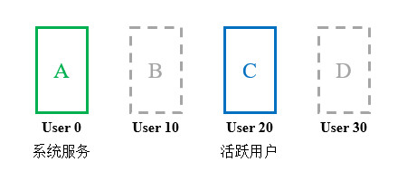

# 简介
自从Android 6.0开始，系统提供了多用户能力支持，以便多人共享同一个设备。每个用户都具有独立的数据存储区域与个性化设置，且用户数据受到加密保护，仅当用户解锁后才会解密。

本章的相关知识可以参考以下链接：

- [🔗 示例工程：用户管理](https://github.com/BI4VMR/Study-Android/tree/master/M04_System/C05_Ability/S08_User)

本章的示例工程详见以下链接：

- [🔗 AOSP开发文档：支持多用户](https://source.android.com/docs/devices/admin/multi-user)
- [🔗 AOSP开发文档：多用户应用](https://source.android.com/docs/devices/admin/multiuser-apps)

# 理论基础
## 用户模型
开启与关闭多用户特性时，系统的行为分别如下文内容所示：

🔷 单用户模型

系统未开启多用户支持，此时全局只有一个ID为"0"的用户，且不能创建或切换至新的用户。

🔷 多用户模型

系统已开启多用户支持，此时默认存在的是ID为"0"的用户，我们可以创建并切换至新的用户，切换完毕后旧用户的界面被隐藏、数据被锁定；新用户的数据被解锁，此后启动的进程将以新用户身份运行。

多用户模型的运行状态如下文图片所示：

<div align="center">



</div>

初始用户User 0不可被删除，且具有全局性的系统服务只会在User 0运行（例如：硬件驱动管理程序），因此User 0也被称为“系统用户”。当系统从User 0切换至其他用户后，这些系统服务仍会保持运行，其他用户需要通过跨用户API与User 0中的系统服务交互。

在手机等常见的平台上，User 0除了用于运行系统服务，也可以显示应用程序界面并被用户正常使用；在Android Automotive平台上，User 0被配置为Headless模式，此时User 0只能运行系统服务，不能被普通用户所使用，普通用户只能使用User 10、User 20等用户。

> ⚠️ 警告
>
> Android用户体系与Linux有较大的差异，同一时刻只能有一个用户处于前台，其他用户都将处于后台，后台用户具有以下限制条件：
>
> - 后台用户无法显示Activity与大部分类型的Window。在跨用户启动界面时，我们应当时刻与前台用户交互。
> - 后台用户资源被回收的优先级高于前台用户。在跨用户绑定服务时，我们不能以User 0作为客户端绑定其他用户的服务，因为User 0是常驻的，若目标用户转为后台，但服务仍然被User 0绑定，系统将无法回收服务资源。

若应用程序需要实现下文列表中的任意功能，则应当关注本章内容所涉及的相关知识并完成API适配：

- 访问加密存储区域中的文件：应用程序可能在用户存储区域解锁之前就被启动，因此读写数据前需要判断存储区域是否已被解锁，防止出现异常。
- 访问仅系统用户运行的服务：如果应用程序需要与User 0中的组件交互，必须使用专门的API。
- 对外提供服务：如果应用程序自身就是一个仅需要在User 0运行的组件，应当在进程启动时判断自身所处的用户环境，针对非User 0禁用某些功能，防止重复初始化造成异常或浪费系统资源。

## 标识符
下文内容将对多用户所涉及的一些标识符作出说明：

🔶 UserID

用户身份标识符，用于唯一标识每个用户。初始用户的ID是"0"，其他用户的ID默认以"10"为倍数递增例如："10"、"20"、"30"等。

🔶 AppID

应用程序标识符，用于唯一标识每个程序。该标识符从"10001"开始逐步递增。

当新的应用程序被安装时，PackageManagerService将为其分配一个AppID，并存储在 `/data/system/packages.xml` 文件中，直到应用程序被卸载后才会清除对应的记录。

🔶 UID

UserID和AppID的组合，用于唯一标识应用的进程，生成规则如下文公式所示：

$$
UID = (UserID * 100000) + (AppID \bmod 100000)
$$

假如某个应用程序的AppID为"10105"，当它被User 0启动后，对应的UID为： `0 + 10105 = 10105` ；当它被User 10启动后，对应的UID为： `1000000 + 10105 = 1010105` 。

我们可以在ADB Shell中使用 `ps` 命令查看某个包名应用对应的进程信息：

```text
ADB# ps -A | grep -i "launcher"
u0_a105       1077   357 13782612 170416 do_epoll_wait      0 S com.android.launcher3
u10_a105      6299   357 13743216 164916 do_freezer_trap    0 S com.android.launcher3
```

根据上述输出内容可知：

在User 0和User 10中各有一个 `com.android.launcher3` 进程，且该应用的AppID为"10105"（此处已省略开头的"10"）。

如果我们知道UID，则可以根据组合规则反向推导出UserID与AppID，三者之间的转换方法在UserHandle类中实现，详见下文代码块：

"UserHandle.java":

```java
// UserID的范围，用于分离UserID和AppID。
public static final int PER_USER_RANGE = 100000;

// 从UID中分离UserID
public static int getUserID(int uid) {
    if (MU_ENABLED) {
        return uid / PER_USER_RANGE;
    } else {
        return UserHandle.USER_SYSTEM;
    }
}

// 从UID中分离AppID
public static int getAppID(int uid) {
    return uid % PER_USER_RANGE;
}

// 组合UserID和AppID生成UID
public static int getUID(int userID, int appID) {
    if (MU_ENABLED) {
        return userID * PER_USER_RANGE + (appID % PER_USER_RANGE);
    } else {
        return appID;
    }
}
```

此处的 `MU_ENABLED` 是一个隐藏变量，用于指明当前系统是否开启了多用户支持，若不支持则固定返回数值"0"，以便提高性能。如果我们需要自行实现上述代码逻辑，可以将 `MU_ENABLED` 变量替换为UserManager的公开方法 `supportsMultipleUsers()` 。

# 相关API
## 用户身份


Android SDK中的UserHandle类用于表示用户，

用户在SDK中有两种表示方法，其一是"USER_"系列整形变量，另一种是UserHandle对象


UserHandle 可以是显式用户，也可以是以下特殊句柄之一：UserHandle.CURRENT 或 UserHandle.ALL。CURRENT 表示当前位于前台的用户。


UserHandle(int userID) 构造方法，创建当前ID对应的UserHandle对象
getUserHandleForUid（int uid） 静态方法，创建当前UID对应的UserHandle对象

activityManager#getCurrentUser() 静态方法，获取当前用户的UserID。

Process#myUserHandle() 静态方法，获取当前用户的UserHandle对象
Process#myUid() 静态方法，获取当前应用程序的UID


## 用户管理

使用新的 UserManager 系统服务查询用户及其句柄：
    UserManager.supportsMultipleUsers()
    UserManager.getUsers()
UserInfo getUserInfo(@UserIdInt int userId)
    UserManager.getUserSerialNumber(int userHandle) - 与用户句柄对应的不可再循环数字。
    UserManager.getUserHandle(int serialNumber)
    UserManager.getUserProfiles() - 返回用户本人个人资料和受管个人资料的集合（如有）。
注册即可借助 ContentObserver、PackageMonitor 和 BroadcastReceiver 上的新 API 监听特定或所有用户以及回调（可提供与回调发起用户相关的其他信息）。


## 跨用户交互

我们通常使用以下方法与其他组件进行交互：

- Context#startActivity(Intent i)
- Context#sendBroadcast(Intent i)
- Context#registerReceiver(BroadcastReceiver receiver, IntentFilter filter)
- Context#startService(Intent i)
- Context#bindService(Intent i, ServiceConnection cb, int flags)
- PackageManager#getPackageInfo(String packageName, PackageInfoFlags flags)

上述方法在多用户环境中被调用后，不会改变用户身份，例如：User 0中的应用程序A请求启动应用程序B的Service，此时应用程序B的进程也属于User 0，未涉及跨用户操作。


广播:

如果您想向所有用户发送广播，请使用 ALL。


服务:

- Context#bindServiceAsUser(Intent i, ServiceConnection cb, int flags)

bindservice 从传入的 Binder 调用中提取用户句柄：
        int userHandle = UserHandle.getCallingUserId() 

UserHandle.getCallingUserId() 

Binder
    public static final native int getCallingUid();


软件包管理:

PackageManager#getPackageInfoAsUser(@NonNull String packageName, int flags, @UserIdInt int userId)

PackageManager中的接口比较特殊，只接受数字形式的真实UserID，如果我们传入 `UserHandle.USER_ALL` `UserHandle.USER_CURRENT` 等数值，则无法执行成功。


# 权限

需要下列权限：

INTERACT_ACROSS_USERS (signature|system)
INTERACT_ACROSS_USERS_FULL (signature)


如需与您自己应用中的组件通信，请使用 (INTERACT_ACROSS_USERS)；如需与其他应用中的组件通信，请使用 (INTERACT_ACROSS_USERS_FULL)
您可能需要创建代理组件，这些代理组件先在用户的进程中运行，之后会访问以用户 0 身份运行的 singleUser 组件。


# 多个用户或资料中的服务

并非所有服务都需要在其他用户或工作资料中运行实例。如果您的系统服务只需要以用户 0 的身份运行，则在以其他用户的身份运行时应停用该服务的组件，以帮助节省资源。下例显示了如何在服务的入口点执行此操作：

// Add on all entry points such as boot_completed or other manifest-listed receivers and providers
if (!UserManager.isSystemUser()) {
    // Disable the service
    ComponentName targetServiceName = new ComponentName(this, TargetService.class);
    context.getPackageManager().setComponentEnabledSetting(
        targetServiceName, COMPONENT_ENABLED_STATE_DISABLED, 0);
}

该示例还可以使用 PackageManager.setApplicationEnabledSetting() 来停用整个应用。


# 多用户涉及的文件路径：
路径	系统路径（可选）	用途
/data/user/{userId}/{app.path}	/data/data	应用存储空间
/storage/emulated/{userId}	/sdcard	共享内部存储空间
/data/media/{userId}	无	用户媒体数据（例如，音乐和视频）
/data/system/users/{userId}	无	每个用户的系统配置/状态只能由系统应用访问


# 启用单例组件

如需将应用标识为单例，请将 android:singleUser="true" 添加至 Android 清单中的服务、接收器或提供程序。

系统仅在以用户 0 身份运行的进程中将相应组件实例化。任何用户若提出任何连接到相应提供程序或服务或者向相应接收器发送广播的请求，都会传送到以用户 0 身份运行的进程。如果相应组件是应用中的唯一组件，则只有一个应用实例会运行。

软件包中的 activity 仍将在每个用户各自的进程中启动，并且 UID 处于相应用户的 UID 范围内（例如 1010034）。


# 调试命令
## 语法
我们可以通过ADB Shell管理用户，以便进行调试与测试。

下文内容将介绍常用的用户管理命令：

🔶 查询用户列表

以下命令可以列出设备中的用户列表：

```text
ADB$ pm list users
```

🔶 创建用户

以下命令可以创建新的用户：

```text
ADB$ pm create-user <用户名称>
```

🔶 删除用户

以下命令可以删除已存在的用户：

```text
ADB$ pm remove-user <用户ID>
```

🔶 切换用户

以下命令可以从当前用户切换至指定的用户：

```text
ADB$ am switch-user <用户ID>
```

🔶 启动用户

以下命令可以使指定用户在后台运行，但暂不切换当前用户：

```text
ADB$ am start-user <用户ID>
```

🔶 获取前台用户的ID

以下命令可以获取当前前台用户的ID：

```text
ADB$ am get-current-user
```


<!-- TODO

# Shell 权限

注意：shell 命令下查看的都是userid 为0的路径。查看其它用户的目录权限受限 ：

# 通过uid获取包名，通过包名获取uid

通过包名获取UID

PackageManager mPm = getPackageManager();
try {
    ApplicationInfo applicationInfo = mPm.getApplicationInfo("com.tencent.mm", 0);
    int uid = applicationInfo.uid;
    Toast.makeText(MainActivity.this, "" + uid, Toast.LENGTH_SHORT).show();
}catch (Exception e){
    e.printStackTrace();
}


通过 UID 获取包名

String packagename = getPackageManager().getNameForUid(uid);


# sharedUserId

系统进程UID有三种：

android:sharedUserId=“android.uid.system”
android:sharedUserId=“android.uid.shared”
android:sharedUserId=“android.media”
我们这里取第一种来实验下，其他两种实现的方式都一样。
4.1 声明UID

首先我们需要在manifest中声明该应用的UID：

<?xml version="1.0" encoding="utf-8"?>
<manifest xmlns:android="http://schemas.android.com/apk/res/android"
    package="cn.izis.chessdeskrobot"
    android:sharedUserId="android.uid.system"
    >
...
</manifest>

安装在设备中的每一个apk文件，Android给每个APK进程分配一个单独的用户空间,其manifest中的userid就是对应一个Linux用户都会被分配到一个属于自己的统一的Linux用户ID，并且为它创建一个沙箱，以防止影响其他应用程序（或者其他应用程序影响它）。用户ID 在应用程序安装到设备中时被分配，并且在这个设备中保持它的永久性。
通过Shared User id,拥有同一个User id的多个APK可以配置成运行在同一个进程中.所以默认就是可以互相访问任意数据. 也可以配置成运行成不同的进程, 同时可以访问其他APK的数据目录下的数据库和文件.就像访问本程序的数据一样.


对于一个APK来说，如果要使用某个共享UID的话，必须做一下两部步：
1、相同的在Manifest节点中增加android:sharedUserId属性。
2、相同的在Android.mk中增加LOCAL_CERTIFICATE的定义。（既签名相同）

如果有看系统源码的同学，可以看到一些系统应用就是这样：
系统中所有使用android.uid.system作为共享UID的APK，都会首先在manifest节点中增加 android:sharedUserId=“android.uid.system”，然后在Android.mk中增加 LOCAL_CERTIFICATE := platform。可以参见Settings等

系统中所有使用android.uid.shared作为共享UID的APK，都会在manifest节点中增加 android:sharedUserId=“android.uid.shared”，然后在Android.mk中增加 LOCAL_CERTIFICATE := shared。可以参见Launcher等

系统中所有使用android.media作为共享UID的APK，都会在manifest节点中增加 android:sharedUserId=“android.media”，然后在Android.mk中增加LOCAL_CERTIFICATE := media。可以参见Gallery等。

关于签名：
build/target/product/security目录中有四组默认签名供Android.mk在编译APK使用：

1、testkey：普通APK，默认情况下使用。
2、platform：该APK完成一些系统的核心功能。经过对系统中存在的文件夹的访问测试，这种方式编译出来的APK所在进程的UID为system。
3、shared：该APK需要和home/contacts进程共享数据。
4、media：该APK是media/download系统中的一环。

-->
