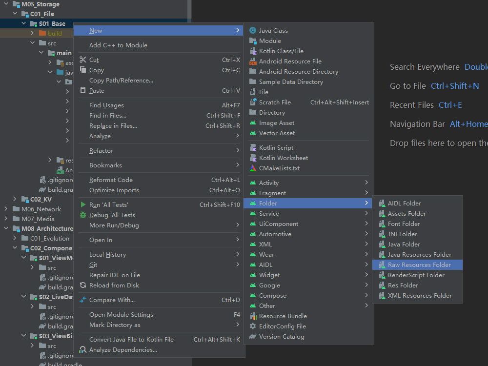

# 简介
文件是最基础的文本与二进制数据存储形式，本章将对Android系统的文件存储体系进行介绍。

本章示例工程详见以下链接：

[🔗 示例工程：文件存储](https://github.com/BI4VMR/Study-Android/tree/master/M05_Storage/C01_File/S01_Base)

# 理论基础
## 存储设备
早期的Android手机拥有内置存储芯片(Internal Storage)和外置存储卡(External Storage)两种存储区域，内置存储芯片用于存放系统固件与数据，只要设备正常工作就能够使用；外置存储卡用于存放用户数据，容量较大，但随时可能被用户移除。

自从Android 4.4开始，内置存储芯片被划分为系统分区与虚拟存储卡，即使用户没有插入物理的存储卡，也可以使用虚拟存储卡存放用户数据。虽然虚拟存储卡嵌入在设备内部，但它与物理存储卡一样被归类为外置存储(External Storage)设备。

## 目录结构
Android系统基于Linux内核，因此目录结构与Linux类似。主要目录的功能如下文列表所示：

🔷 `/system/`

存放系统相关组件。

其中常用的子目录信息如下文列表所示：

- `app` : 预置的应用程序APK文件。
- `lib` : 共享库文件。
- `fonts` : 预置的字体文件。
- `media` : 预置的铃音、提示音等。

🔷 `/data/app/`

存放用户安装的第三方应用程序APK文件。

🔷 `/data/data/`

存放应用程序的数据文件。

每个应用程序的数据分别存储在一个子目录中，目录名称为应用程序的包名。

在每个程序的数据目录中， `cache` 用于存放缓存文件； `databases` 用于存放SQLite文件； `files` 用于存放普通文件； `shared_prefs` 用于存放SharedPreferences文件。

应用程序读写此目录不需要申请任何权限，当程序被卸载时，其中的数据都会被清除。此目录在未Root时对用户不可见，因此通常不会被用户或外部程序更改，可以安全地操作。

🔷 `/data/user/`

存放各个用户的应用程序数据文件。

自从Android 4.2开始，Android系统新增了多用户功能，每个用户拥有独立的身份标识与存储区域。

系统会为默认用户"User0"生成 `/data/user/0/` 目录，在部分系统中该目录是 `/data/data/` 的软连接。当我们创建新的用户时，系统也会生成对应的数据目录，实现用户间的数据隔离。

🔷 `/storage/`

此目录用于挂载外部存储设备。

子目录 `/storage/emulated/0/` 表示默认用户的虚拟存储卡空间。如果我们插入外置存储卡，则会出现以分区UUID命名的目录，例如 `0E17-200E` 。

🔷 `/storage/emulated/<用户ID>/`

当用户被创建时，系统会在虚拟存储卡中生成一些公共目录，用于存放可共享的数据，例如"DCIM"（相机）、"Music"（音乐）、"Movies"（视频）等，所有应用程序均可读写这些目录。

🔷 `/storage/emulated/<用户ID或分区UUID>/Android/data/<包名>/`

此目录与 `/data/data/<包名>/` 类似，每个外部存储设备首次挂载时都会自动生成该结构，用于存放应用程序的私有数据。

这些目录可被用户通过文件管理器更改，如果位于物理存储卡上，还可能被随时卸载，因此我们进行读写操作前一定要先检查路径是否存在。

# 读取APK中的资源文件
## 简介
Android工程中拥有 `raw` 和 `assert` 两个目录，用于存放静态资源文件。这些目录是只读的，编译时子项会被原封不动地打包到APK文件中。

## "raw"目录
### 简介
该目录位于 `src` 目录下，通常用于存放不易分类的资源文件。

`raw` 目录中的文件没有容量限制，但它不能再拥有子目录。该目录中的文件会被映射到R文件中，我们可以通过资源ID直接访问。

在新建立的工程中， `raw` 目录是不存在的，我们可以在模块上点击鼠标右键，依次选择 `New - Folder - Raw Resources Folder` 进行创建。

<div align="center">



</div>

### 以输入流形式读取文件
目录创建完毕后，我们在其中放置一个 `test.txt` 文件，此时R文件将会生成对应的ID，变量名为不含后缀的文件名 `test` ；接着我们通过Resources类的 `openRawResource(int id)` 方法获取输入流，就可以对该文件进行读取操作了。

"TestUIAPKRaw.java":

```java
Resources resources = getApplicationContext().getResources();
InputStream stream = null;
try {
    // 传入资源ID，获取输入流。
    stream = resources.openRawResource(R.raw.test);
    // 从输入流读取文本。
    String content = IOUtil.readFile(stream);
    Log.i(TAG, "test.txt文件的内容为：" + content);
} catch (Exception e) {
    e.printStackTrace();
} finally {
    IOUtil.closeIOQuietly(stream);
}
```

上述内容也可以使用Kotlin语言书写：

"TestUIAPKRawKT.kt":

```kotlin
val resources: Resources = applicationContext.resources
var stream: InputStream? = null
try {
    // 传入资源ID，获取输入流。
    stream = resources.openRawResource(R.raw.test)
    // 从输入流读取文本。
    val content: String = IOUtil.readFile(stream)
    binding.tvLog.append("test.txt文件的内容为：\n$content")
    Log.i(TAG, "test.txt文件的内容为：$content")
} catch (e: Exception) {
    e.printStackTrace()
} finally {
    IOUtil.closeQuietly(stream)
}
```

IOUtil类的 `readFile()` 方法将输入流内容转换为字符串； `closeQuietly()` 方法用于关闭流释放资源，详见本章示例工程。

### 以URI形式读取文件
部分场景下我们需要使用URI加载文件，例如图片展示框或视频播放器，此时我们可以使用Android资源文件的通用表示方法构造URI指向 `raw` 目录中的文件。

"TestUIAPKRaw.java":

```java
// 拼接"raw"目录中图片文件的URI
String uri = ContentResolver.SCHEME_ANDROID_RESOURCE + "://" + getPackageName() + "/raw/pic";
Log.i(TAG, "pic.png文件的URI为：" + uri);

// 将图片加载至ImageView
binding.ivTest.setImageURI(Uri.parse(uri));
Log.i(TAG, "图片已加载至ImageView");
```

`raw` 目录的资源URI格式为： `android.resource://<包名>/raw/<文件名称>` ，这些文件在资源URI中不需要指明后缀，这与通过ID访问时是一致的。

此时运行示例程序，并查看控制台输出信息：

```text
01-06 00:00:59.687  4299  4299 I TestApp-TestUIAPKRaw: pic.png文件的URI为：android.resource://net.bi4vmr.study.storage.file.base/raw/pic
01-06 00:00:59.687  4299  4299 I TestApp-TestUIAPKRaw: 图片已加载至ImageView
```

## "assets"目录
`assets` 是 `src` 的同级目录，通常用于存放附加数据包、静态HTML网页等内容。

`assets` 目录可以拥有多层子目录结构，其中的文件没有容量限制，但我们不能直接对超过1MB的文件进行读取操作，否则系统会抛出异常。对于超过1MB的数据包等内容，我们可以先将其复制到程序的私有存储目录，再进行读取操作。

在新建立的工程中， `assets` 目录也不存在，我们可以在模块上点击鼠标右键，依次选择 `New - Folder - Assets Folder` 进行创建，菜单位置详见相关章节： [🧭 读取APK中的资源文件 - "raw"目录 - 简介](#raw目录) 。

我们首先创建 `assets` 文件夹，并创建一些子目录、存入 `default.yml` 等测试文件，

```text
assets
├── config
│   ├── config-1.json
│   ├── config-2.json
│   └── default.yml
└── picture
    └── pic.png
```

接着我们使用AssetManager类提供的方法访问 `assets` 目录。

"TestUIAPKAssets.java":

```java
// 获取AssetManager
AssetManager am = getApplicationContext().getAssets();
try {
    // 获取"config"目录下的子项
    String[] filenames = am.list("config");
    if (filenames == null) {
        binding.tvLog.append("\n遍历目录config失败！");
        Log.i(TAG, "遍历目录config失败！");
        return;
    }

    // 依次读取每个文件的内容
    for (String file : filenames) {
        InputStream is = am.open("config" + File.separator + file);
        String content = IOUtil.readFile(is);
        Log.i(TAG, "文件名称：" + file);
        Log.i(TAG, "文件内容：" + content);
    }
} catch (Exception e) {
    e.printStackTrace();
}
```

AssetManager实例可以通过Context类的 `getAssets()` 方法获取，随后我们可以使用该实例访问文件或遍历子目录。

> ⚠️ 警告
>
> AssetManager实例拥有 `close()` 方法，我们不应该主动调用它，该方法仅供系统内部使用。
>
> 每个进程的AssetManager实例是全局唯一的，如果我们将其关闭，则该进程后续无法再访问 `assets` 目录。

AssetManager实例的 `String[] list(String path)` 方法用于查询子目录内容，参数 `path` 为子目录的路径，返回结果为子项文件名数组；若目录为空或目标不存在，则数组内容为空。

AssetManager实例的 `InputStream open(String path)` 方法用于获取文件的输入流。

此时运行示例程序，并查看控制台输出信息：

```text
01-06 22:22:29.862  5352  5352 I TestApp-TestUIAPKAssets: 文件名称：config-1.json
01-06 22:22:29.863  5352  5352 I TestApp-TestUIAPKAssets: 文件内容：{"name": "预设配置-01","content": "Hello"}
01-06 22:22:29.864  5352  5352 I TestApp-TestUIAPKAssets: 文件名称：config-2.json
01-06 22:22:29.864  5352  5352 I TestApp-TestUIAPKAssets: 文件内容：{"name": "预设配置-02","content": "Hello"}
01-06 22:22:29.865  5352  5352 I TestApp-TestUIAPKAssets: 文件名称：default.yml
01-06 22:22:29.865  5352  5352 I TestApp-TestUIAPKAssets: 文件内容：info: "我能吞下玻璃而不伤身体。"
```

# 访问内置存储私有目录
Context类提供了 `getCacheDir()` 和 `getFilesDir()` 方法，以供开发者获取内置存储私有目录的路径。这两个方法都没有参数，返回值为File实例，通常指向 `/data/data/<包名>` 下的 `cache` 和 `files` 目录。

"TestUIPrivateInternal.java":

```java
// 获取缓存目录
File internalCacheDir = getCacheDir();
String cachePath = internalCacheDir.getAbsolutePath();
Log.i(TAG, "缓存目录: " + cachePath);

// 获取数据目录
File internalDataDir = getFilesDir();
String dataPath = internalDataDir.getAbsolutePath();
Log.i(TAG, "数据目录: " + dataPath);
```

缓存目录通常用于存放临时文件，例如在线音视频流的缓存。当用户进入应用程序设置页面并点击“清除缓存”按钮后，该目录中的数据将被清空。

数据目录通常用于存放需要长期保存的文件，例如用户数据、配置文件等。该目录中的数据只会在用户点击应用程序设置页面的“清除数据”按钮或程序被卸载时才会被清空，“清除缓存”操作并不会将其清空。

当我们访问内置存储区域的私有数据目录时，可以采用Java的方式，构造File对象并进行读写操作。除此之外，Context类还针对数据目录提供了两个便捷的方法，使我们可以直接获取到文件流，而无需关注路径前缀，它们的详细说明如下文所示。

🔶 `FileInputStream openFileInput(String name)`

功能简述：

打开指定文件的输入流。

打开内置存储区域私有数据目录中的文件。

参数列表：

- `name` : 文件名。

返回值：

FileInputStream实例。

异常情况：

- `FileNotFoundException` : 目标文件不存在。

🔶 `FileOutputStream openFileOutput(String name, int mode)`

功能简述：

打开指定文件的输入流。

打开内置存储区域私有数据目录中的文件。

参数列表：

- `name` : 目标文件名。
- `mode` : 写入模式。 `MODE_PRIVATE` 表示清空写入； `MODE_APPEND` 表示追加写入。

返回值：

FileOutputStream实例。

<br />

通过上述方法获取到文件流后，我们便可以进行读写操作了。此处省略流的相关操作，详见本章示例代码。

# 访问外置存储私有目录
Context类提供了 `getExternalCacheDir()` 和 `getExternalFilesDir(Environment type)`方法，以供开发者获取外置存储器上的私有目录路径。此处的参数 `type` 表示文件类型，例如传入 `Environment.DIRECTORY_MUSIC` 时系统会在 `files` 目录下创建子目录 `Music` 并将其作为返回值。文件类型的详细含义详见相关章节： [🧭 访问共享目录](#访问共享目录) ，对于私有存储区域，我们通常不使用这种分类方式，而是直接传入"null"获取根目录，再自行管理目录结构。

"TestUIPrivateExternal.java":

```java
// 获取虚拟存储卡上的缓存目录
File externalCacheDir = Context.getExternalCacheDir();

// 获取虚拟存储卡上的数据目录
File externalFileDir = Context.getExternalFilesDir(null);
```

由于外置存储设备可能有若干个，系统还提供了 `getExternalCacheDirs()` 和 `getExternalFilesDirs(Environment type)` 方法，返回值为String数组，对应系统中所有外部存储器上的路径，以供开发者按需访问。

```java
/*
 * 获取所有缓存、文件目录
 *
 * 包括所有外置存储设备的路径。
 */
File[] externalCacheDirs = getExternalCacheDirs();
File[] externalFilesDirs = getExternalFilesDirs(null);
```

对于外置存储器中的文件，我们需要采用Java访问文件的方式，构造File实例指向具体的文件路径，再进行输入或输出操作。

```java
// 构造File对象
File file = new File(externalFileDir, "ex.txt");
// 写入文件
FileOutputStream os = new FileOutputStream(file);
// 读取文件
FileInputStream is = new FileInputStream(file);
```

# 访问共享目录
系统会在每个外置存储设备的根目录下创建若干子目录，用于存放公共的媒体资源，例如音乐、照片和视频。

<div align="center">

|      目录       |     Environment常量名     | 文件类型 |      备注      |
| :-------------: | :-----------------------: | :------: | :------------: |
|     `Music`     |     `DIRECTORY_MUSIC`     |   音乐   |                |
|   `Pictures`    |   `DIRECTORY_PICTURES`    |   图片   |                |
|    `Movies`     |    `DIRECTORY_MOVIES`     |   电影   |                |
|   `Download`    |   `DIRECTORY_DOWNLOADS`   | 下载文件 |                |
|   `Documents`   |   `DIRECTORY_DOCUMENTS`   |   文档   | Android 11新增 |
|     `DCIM`      |     `DIRECTORY_DCIM`      |   照片   |                |
|     `Alarm`     |    `DIRECTORY_ALARMS`     | 闹钟铃音 |                |
|   `Ringtones`   |   `DIRECTORY_RINGTONES`   | 电话铃音 |                |
| `Notifications` | `DIRECTORY_NOTIFICATIONS` | 通知铃音 |                |
|   `PodCasts`    |   `DIRECTORY_PODCASTS`    |   播客   |                |
|  `Audiobooks`   |  `DIRECTORY_AUDIOBOOKS`   | 有声读物 | Android 11新增 |

</div>

对于Android 10以下的系统，应用程序需要申请"READ_EXTERNAL_STORAGE"和"WRITE_EXTERNAL_STORAGE"权限，才能实现读写外置存储器的操作，并且在得到这两个权限后，可以操作外置存储器上的任意路径。

自从Android 10开始，系统不再允许应用程序随意读写外置存储器。程序申请"READ_EXTERNAL_STORAGE"权限后，可以读写 `Download` 和 `Documents` 目录，无法读写其他路径。自从Android 11开始，`Download` 和 `Documents` 目录作为公共数据目录不再需要任何权限。

如果应用程序只需要读取共享目录数据，我们可以在Manifest文件中进行以下配置：

```xml
<uses-permission
    android:name="android.permission.READ_EXTERNAL_STORAGE"
    android:maxSdkVersion="29" />
<uses-permission
    android:name="android.permission.WRITE_EXTERNAL_STORAGE"
    android:maxSdkVersion="28" />
```

属性 `android:maxSdkVersion="29"` 申明了此标签仅在API Level小于等于29时生效，对于更高的Target版本则忽略此权限声明。

我们可以通过Environment类提供的方法获取共享目录的路径， `getExternalStorageDirectory()` 方法返回的是虚拟存储卡的根目录， `getExternalStoragePublicDirectory(Environment type)` 方法返回的是 `<虚拟存储卡>/Music` 等路径，其中Music、Movies、Pictures和Download目录必然存在，Documents目录在早期系统中不可用。

```java
// 获取共享目录的根路径
File shareDir = Environment.getExternalStorageDirectory();
// 获取指定类型的共享目录
File shareMusicDir = Environment.getExternalStoragePublicDirectory(Environment.DIRECTORY_MUSIC);
```

在Android 10及更高版本中，应用程序可以采用Java访问文件的方式在Documents和Download目录中进行读写操作，但对于其它目录则必须使用MediaStore操作，否则会产生"Operation not permitted"错误。

# 访问外置存储卡
对于物理存储卡，我们在访问之前，需要先调用 `Environment.getExternalStorageState()` 方法检测其是否可用，此方法有以下常见返回值：

- "MEDIA_MOUNTED"
设备就绪，此时可以进行访问。

- "MEDIA_REMOVED"
设备被已移除。

- "MEDIA_UNMOUNTED"
设备存在，但未挂载。

- "MEDIA_CHECKING"
设备检查中，新装入的存储卡需要先检查文件系统。

存储卡只有在"MEDIA_MOUNTED"状态下才可以被访问，无参方法 `getExternalStorageState()` 通常返回虚拟存储卡的状态，因此总是"MEDIA_MOUNTED"；为了检测物理存储卡，我们可以使用 `getExternalStorageState(String path)` 方法，"path"表示待测设备的路径。

# 版本变更
## 索引

<div align="center">

|       序号        |    版本    |       摘要       |
| :---------------: | :--------: | :--------------: |
| [变更一](#变更一) | Android 10 | 新增分区存储功能 |

</div>

## 变更一
### 摘要
自从Android 10开始，系统新增了分区存储功能。

### 详情
在Android 10之前的系统中，应用程序一旦获取"READ_EXTERNAL_STORAGE"和"WRITE_EXTERNAL_STORAGE"权限，就可以访问外置存储区域的任意目录，这些目录不受系统管理，用户卸载软件包之后将会残留大量垃圾文件。除此之外，应用程序之间没有隔离措施，任何程序都可以读取并修改其它程序的文件，存在安全隐患。

自从Android 10开始，开发团队引入了分区存储特性，每个应用程序只能读写自身的私有数据目录，不允许随意读写其它路径，因此"WRITE_EXTERNAL_STORAGE"权限已经没有意义了。我们若要读取其它应用程序的数据，需要申请"READ_EXTERNAL_STORAGE"权限，并通过MediaStore获取文件URI；若要在其它路径存取文件，则需要调用系统的Storage Access Framework，由用户手动进行确认。

### 兼容方案
在Android 10和Android 11中，如果系统识别到软件包Manifest文件的 `<application>` 标签中有以下属性，则不会为此应用程序启用分区存储。

```xml
android:requestLegacyExternalStorage="true"
```

在Android 12以及更高版本的系统中，如果应用程序确实有必要访问外置存储区域的所有目录，可以在Manifest文件中申明权限"MANAGE_EXTERNAL_STORAGE"，这是一个特殊权限，用户在系统权限管理界面明确授权。

```java
// 检查是否已经有权限
boolean isGranted = Environment.isExternalStorageManager();
// 若没有该权限，跳转至系统设置授权界面。
if (!isGranted) {
    Intent intent = new Intent(Settings.ACTION_MANAGE_ALL_FILES_ACCESS_PERMISSION);
    /*
     * 跳转新界面并获取结果
     *
     * 参数一：协定：启动新界面并获取返回结果。
     * 参数二：结果返回时要执行的操作。
     */
    registerForActivityResult(
            new ActivityResultContracts.StartActivityForResult(),
            result -> {
                if (result.getResultCode() == RESULT_OK) {
                    // 再次判断权限是否获取成功
                    if (Environment.isExternalStorageManager()) {
                        Toast.makeText(MainActivity.this, "权限申请成功！", Toast.LENGTH_SHORT).show();
                    } else {
                        Toast.makeText(MainActivity.this, "权限申请失败！", Toast.LENGTH_SHORT).show();
                    }
                }
            }
    ).launch(intent);
}
```
