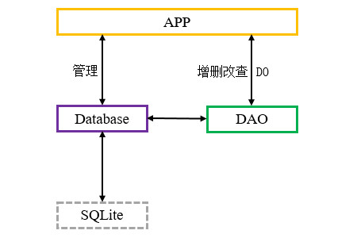

# 简介
Room是Jetpack提供的一个ORM框架，它对SQLite进行了封装，我们可以通过注解声明Database、DAO、DO(Entity)等元素，Gradle编译时将会自动生成部分实现代码，例如根据实体类创建二维表、将查询结果映射为实体类或集合，使我们不必反复书写模板代码。

Room中各元素的关系如下文图片所示：

<div align="center">



</div>

本章示例代码详见以下链接：

- [🔗 示例工程：Room](https://github.com/BI4VMR/Study-Android/tree/master/M05_Storage/C03_SQL/S02_Room)

# 基本应用
下文将以学生信息管理系统为例，演示Room框架的基本使用方法。

在使用Room之前，我们需要在Gradle配置文件中声明相关的组件依赖：

"build.gradle":

```groovy
dependencies {
    // Room核心
    implementation 'androidx.room:room-runtime:2.5.1'

    // Room注解处理器(Java)
    annotationProcessor 'androidx.room:room-compiler:2.5.1'
    // Room注解处理器(Kotlin-KAPT)
    kapt 'androidx.room:room-compiler:2.5.1'
    // Room注解处理器(Kotlin-KSP)
    ksp 'androidx.room:room-compiler:2.5.1'
}
```

上述内容也可以使用Kotlin语言书写：

"build.gradle.kts":

```groovy
dependencies {
    // Room核心
    implementation("androidx.room:room-runtime:2.5.1")

    // Room注解处理器(Java)
    annotationProcessor("androidx.room:room-compiler:2.5.1")
    // Room注解处理器(Kotlin-KAPT)
    kapt("androidx.room:room-compiler:2.5.1")
    // Room注解处理器(Kotlin-KSP)
    ksp("androidx.room:room-compiler:2.5.1")
}
```

"room-runtime"是Room的核心组件，"room-compiler"是Room的注解处理器，一个应用程序至少需要引入这些组件才能使用Room框架。上述的三条注解处理器声明语句不可同时添加，我们需要根据项目所使用的语言进行选择。

我们首先创建一个Student实体类，用于描述“学生”的属性，此处设置“ID、姓名、年龄”三个属性。为了建立实体类与二维表的关联，我们还需要在Student类的属性与方法上添加一些Room注解。

"Student.java":

```java
@Entity(tableName = "student_info")
public class Student {

    // ID（主键）
    @PrimaryKey
    @ColumnInfo(name = "student_id")
    private long id;

    // 姓名
    @ColumnInfo(name = "student_name")
    @NonNull
    private String name = "";

    // 年龄
    @ColumnInfo(name = "age")
    private int age;

    // 是否在UI中隐藏
    @Ignore
    private boolean hide;

    // 具有1个参数的构造方法
    @Ignore
    public Student(long id) {
        this.id = id;
    }

    // 具有3个参数的构造方法
    public Student(long id, String name, int age) {
        this.id = id;
        this.name = name;
        this.age = age;
    }

    /* 此处省略部分代码... */
}
```

上述内容也可以使用Kotlin语言书写：

"StudentKT.kt":

```kotlin
@Entity(tableName = "student_info")
data class StudentKT(

    // ID（主键）
    @PrimaryKey
    @ColumnInfo(name = "student_id")
    var id: Long,

    // 姓名
    @ColumnInfo(name = "student_name")
    var name: String,

    // 年龄
    @ColumnInfo(name = "age")
    var age: Int
) {

    // 具有1个参数的构造方法
    @Ignore
    constructor(id: Long) : this(id, "", 0)

    // 是否在UI中隐藏
    @Ignore
    var hide: Boolean = false
}
```

注解 `@Entity` 表示这是一个Room实体类，在编译期间，Room会以该类的属性作为字段，生成 `tableName` 所指定的二维表 `student_info` 。

注解 `@PrimaryKey` 表示 `id` 属性是二维表的主键。

注解 `@ColumnInfo` 用于设置属性在二维表中对应的字段名称。如果某个属性未被添加该注解，则字段名称与属性名称一致。

注解 `@Ignore` 可以被添加在属性与方法上，对于拥有该注解的属性，初始化数据库时Room不会在二维表中创建对应的字段；读取数据时Room也不会寻找对应的字段并进行赋值。对于拥有该注解的方法，它们不会参与Room编译。此处的 `hide` 属性只在UI中使用，不需要持久化，因此我们为其添加了 `@Ignore` 注解。

Room只能使用包含全部属性的构造方法，若扫描到其他构造方法，将会出现错误，此处我们通过 `@Ignore` 注解使只有 `id` 参数的构造方法被Room忽略，避免编译错误。

在Kotlin语言中，主要构造方法必须是包含全部属性的构造方法，因此我们将 `hide` 属性声明语句放置在类体中。如果该属性被声明在主要构造方法中，即使我们添加了 `@Ignore` 注解也会导致编译错误：

```kotlin
@Entity(tableName = "student_info")
data class StudentKT(
    @PrimaryKey
    @ColumnInfo(name = "student_id")
    var id: Long,

    @ColumnInfo(name = "student_name")
    var name: String,

    @ColumnInfo(name = "age")
    var age: Int,

    // 此处添加"@Ignore"注解是无效的，因为"hide"属性将成为主要构造方法的一个参数。
    @Ignore
    var hide: Boolean = false
)
```

接着，我们创建StudentDAO接口，提供对“学生信息表”进行增删改查的方法。

"StudentDAO.java":

```java
@Dao
public interface StudentDAO {

    // 查询所有学生信息。
    @Query("SELECT * FROM student_info")
    List<Student> getStudent();

    // 新增学生记录。
    @Insert
    void addStudent(Student student);

    // 更新学生记录。
    @Update
    void updateStudent(Student student);

    // 删除学生记录。
    @Delete
    void delStudent(Student student);
}
```

上述内容也可以使用Kotlin语言书写：

"StudentDAOKT.kt":

```kotlin
interface StudentDAOKT {

    // 查询所有学生信息。
    @Query("SELECT * FROM student_info")
    fun getStudent(): List<StudentKT>

    // 新增学生记录。
    @Insert
    fun addStudent(student: StudentKT)

    // 更新学生记录。
    @Update
    fun updateStudent(student: StudentKT)

    // 删除学生记录。
    @Delete
    fun delStudent(student: StudentKT)
}
```

注解 `@Dao` 表示这是一个Room数据访问实体类，其中的方法通过 `@Query` 等注解声明了各自的操作类型，分别对应“查询所有学生”、“新增学生记录”、“更新学生记录”、“删除学生记录”功能。我们并不需要实现这些方法，在编译期间，Room的注解处理器将会自动生成DAO接口的实现类，这正是ORM框架的主要功能之一，能够帮助我们简化开发流程。

最后，我们需要创建一个StudentDB抽象类，继承自RoomDatabase类，实现数据库的创建与配置逻辑。该类对于数据库调用者是唯一的访问点，我们通常将其设计为单例模式。

"StudentDB.java":

```java
@Database(entities = Student.class, version = 1)
public abstract class StudentDB extends RoomDatabase {

    private volatile static StudentDB instance = null;

    // 获取数据库实例的方法
    public static StudentDB getInstance(Context context) {
        if (instance == null) {
            synchronized (StudentDB.class) {
                if (instance == null) {
                    // 构造实例并进行配置
                    instance = Room.databaseBuilder(context.getApplicationContext(), StudentDB.class, "student")
                            // Room默认不允许在主线程执行操作，此配置允许在主线程操作，仅适用于调试。
                            .allowMainThreadQueries()
                            // 构建实例
                            .build();
                }
            }
        }
        return instance;
    }

    // 抽象方法，返回StudentDAO实例
    public abstract StudentDAO getStudentDAO();
}
```

上述内容也可以使用Kotlin语言书写：

"StudentDBKT.kt":

```kotlin
@Database(entities = [StudentKT::class], version = 1)
abstract class StudentDBKT : RoomDatabase() {

    companion object {
        @Volatile
        private var instance: StudentDBKT? = null

        // 获取数据库实例的方法
        @JvmStatic
        fun getInstance(context: Context): StudentDBKT {
            if (instance == null) {
                synchronized(StudentDBKT::class) {
                    if (instance == null) {
                        // 构造实例并进行配置
                        instance = Room.databaseBuilder(
                            context.applicationContext,
                            StudentDBKT::class.java,
                            "student"
                        )
                            // Room默认不允许在主线程执行操作，此配置允许在主线程操作，仅适用于调试。
                            .allowMainThreadQueries()
                            // 构建实例
                            .build();
                    }
                }
            }
            return instance!!
        }
    }

    // 抽象方法，返回StudentDAO实例。
    abstract fun getStudentDAO(): StudentDAOKT
}
```

注解 `@Database` 表示这是一个Room数据库，属性 `entities` 用于声明本数据库包含的所有实体类，当存在多个实体类时，使用逗号(",")分隔，例如： `entities = {A.class, B.class, ...}` 。属性 `version` 表示数据库的版本号，程序启动时用于判断数据库是否需要执行升级或降级操作。

在获取实例的 `getInstance()` 方法中，我们通过Room的 `Room.databaseBuilder(Context context, Class<T> cls, String name)` 方法初始化数据库，此处的三个参数依次为：上下文环境、当前抽象类的Class实例和数据库名称，该方法返回的Builder实例可以配置其他功能，最后我们调用Builder的 `build()` 方法创建StudentDB的实例。

Room默认禁止在主线程操作数据库；此处为了便于调试，我们添加配置项 `allowMainThreadQueries()` 解除该限制。

该类中还需要书写返回每个DAO实例的抽象方法，具体实现代码将在编译时自动生成。

至此，一个完整的学生信息管理系统数据库模块就编写完成了。我们可以在测试Activity中放置一些控件，并通过DAO调用增删改查方法。

"TestUIBase.java":

```java
// 获取学生数据库实例
StudentDB studentDB = StudentDB.getInstance(getApplicationContext());
// 获取学生信息表DAO实例
StudentDAO dao = studentDB.getStudentDAO();


/* 新增记录 */
// "etID"是一个输入框，先从中获取数据项ID。
long id = Long.parseLong(edittext.getText().toString());
String name = "田所浩二" + id;
// 插入记录
Student student = new Student(id, name, 24);
dao.addStudent(student);


/* 更新记录 */
// 获取待更新的数据项ID
long id = Integer.parseInt(edittext.getText().toString());
// 更新记录
Student s = new Student(id, "远野", 25);
dao.updateStudent(s);


/* 删除记录 */
// 获取待删除的数据项ID
long id = Integer.parseInt(edittext.getText().toString());
// 删除记录
Student student = new Student(id);
dao.delStudent(student);


/* 查询所有记录 */
List<Student> result = dao.getStudent();
```

上述内容也可以使用Kotlin语言书写：

"TestUIBaseKT.kt":

```kotlin
// 获取学生数据库实例
private val studentDB: StudentDBKT = StudentDBKT.getInstance(this)


/* 查询所有记录 */
val result: List<StudentKT> = studentDB.getStudentDAO().getStudent()


/* 新增记录 */
// 获取待操作的数据项ID
val id: Long = edittext.getText().toString().toLong()
val name = "田所浩二$id"
// 插入记录
val student = StudentKT(id, name, 24)
studentDB.getStudentDAO().addStudent(student)


/* 更新记录 */
// 获取待操作的数据项ID
val id: Long = edittext.getText().toString().toLong()
// 更新记录
val student = StudentKT(id, "远野", 25)
studentDB.getStudentDAO().updateStudent(student)


/* 删除记录 */
// 获取待操作的数据项ID
val id: Long = edittext.getText().toString().toLong()
// 删除记录
val student = StudentKT(id)
studentDB.getStudentDAO().delStudent(student)
```

此处省略了UI控件声明与异常处理等逻辑，详见本章示例代码。

# 疑难解答
## 索引

<div align="center">

|       序号        |                         摘要                         |
| :---------------: | :--------------------------------------------------: |
| [案例一](#案例一) | Android Debug Database工具无法查看Room数据库的内容。 |

</div>

## 案例一
### 问题描述
使用Android Debug Database工具调试Room框架生成的数据库时，Web查看到的内容为空。

### 问题分析
当API Level > 16时，Room框架的默认日志模式为WAL，这种模式不会将变更立即写入磁盘，因此Android Debug Database工具无法实时读取内容。

### 解决方案
在构建Database实例时，将日志模式设为"TRUNCATE"。

```java
Room.databaseBuilder(context.getApplicationContext(), StudentDB.class, "student")
    // 设置日志模式为"TRUNCATE"
    .setJournalMode(JournalMode.TRUNCATE)
    .build();
```
