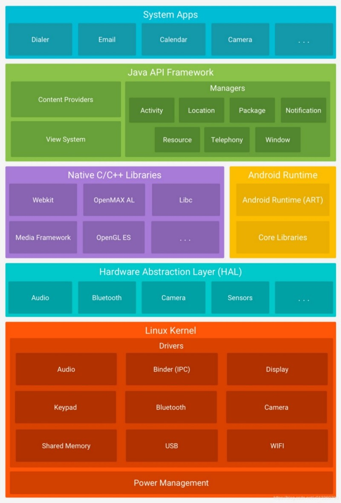

# 发展历程
Android是基于Linux的开源操作系统，由Google和开放手机联盟开发，主要用于移动设备，如智能手机和平板电脑。Android系统最初由Andy Rubin开发，主要用于数码相机。2005年8月Google将其收购。2007年11月，Google与84家硬件制造商、软件开发商及电信营运商组建开放手机联盟共同研发改良Android系统，随后Google以Apache开源许可证的授权方式，发布了Android的源代码。

开源后的Android系统逐渐扩展到平板电脑及其他领域中，例如：智能电视、智能手表和嵌入式设备等。2011年第一季度，Android系统在全球的市场份额首次超过塞班系统，成为全球用户数量最多的手机操作系统。

| 版本  |        代号        | API Level |  发布日期  |
| :---: | :----------------: | :-------: | :--------: |
|   1   |     Astro Boy      |     1     | 2008-09-23 |
|  2.3  |    Gingerbread     |     9     | 2010-12-06 |
|  4.0  | IceCream Sandwich  |    14     | 2011-10-18 |
|  4.4  |       KitKat       |    19     | 2013-10-31 |
|  5.0  |      Lollipop      |    21     | 2014-11-12 |
|  6.0  |    Marshmallow     |    23     | 2015-10-05 |
|  7.0  |       Nougat       |    24     | 2016-08-22 |
|  8.0  |        Oreo        |    26     | 2017-08-21 |
|  9.0  | Pistachio IceCream |    28     | 2018-08-06 |
|  10   |     Android Q      |    29     | 2019-06-05 |
|  11   |     Android R      |    30     | 2020-09-09 |
|  12   |     Android S      |    31     | 2021-10-05 |

# 系统架构
Android系统的体系结构如下文图片所示：

上述各个层次的详细介绍可参考下文内容：

🔷 Linux内核

Android系统使用Linux内核，内核中的模块为各种硬件提供驱动程序，例如屏幕、摄像头、电源管理芯片、蓝牙模块、WLAN模块等。

🔷 硬件抽象层

硬件抽象层(Hardware Abstraction Layer, HAL)对硬件驱动进行封装，向应用程序提供Java API，展现硬件设备的功能，使得应用程序开发者无需关注底层驱动。HAL包含多个模块，每个模块都为特定的硬件组件设计，例如相机或蓝牙模块。

🔷 原生C/C++库

Android核心组件和服务包含以C/C++编写的库，如果应用需要通过C/C++调用这些库，可以使用Android NDK。例如，我们可以通过Java OpenGL API访问OpenGL ES，在应用中绘制和操作2D、3D图形。

🔷 应用程序运行环境

在Android 5.0之前，应用程序运行在Dalvik虚拟机中，其拥有专用格式".dex"。应用程序安装时从Java代码编译成DEX代码，每次运行时候，都需要通过即时编译器(Just in Time, JIT)转换为机器码，应用运行速度缓慢。

自从Android 5.0之后，运行环境变更为Android Runtime(ART)，应用程序在安装时就被预先编译成机器码。这个过程称为预编译(Ahead of Time, AOT)，提高了应用运行速度。

🔷 系统应用

Android附带了一套常用应用程序，包含日历、电子邮件、短信、电话和互联网浏览器等。系统应用可以被用户日常使用，也可以被开发者直接调用，无需自己实现这些功能，例如：如果需要发送短信，可以调用系统短信应用向指定的接收者发送消息。

# 应用程序组件
Android应用程序通常包含以下四种组件：

🔶 Activity

活动(Activity)是用户与应用交互的接口，是各种控件与绘图的容器，一个程序通常包含若干Activity，例如邮件程序，可能含有收件箱、撰写邮件、附件管理器等界面。

🔶 Service

服务(Service)是一种无界面的后台组件，用于执行耗时操作或为其它程序提供支持。例如，当用户使用其他应用时，服务在后台播放音乐或下载文件，并不会干扰到前台用户操作。

🔶 Broadcast Receiver

广播接收器(Broadcast Receiver)用于侦听外部事件并做出响应。一些系统事件将会发起广播，例如：屏幕关闭、电池电量不足等；部分应用程序也可以发起广播。广播接收器常见的用途只是作为一个入口，旨在执行极少量的工作。

🔶 Content Provider

内容提供程序(Content Provider)用于管理应用程序的共享数据，我们可以将这些数据存储在文件系统、SQLite、数据库或其他持久化存储器中。其他应用可通过内容提供程序访问这些数据。
