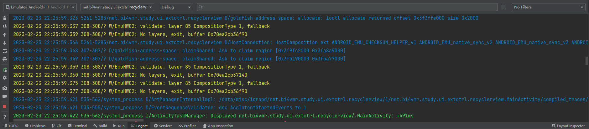

# 简介
Logcat是系统内置的日志信息工具，它提供了日志输出、实时查看、持久化记录等功能。

本章的示例工程详见以下链接：

- [🔗 示例工程：Logcat](https://github.com/BI4VMR/Study-Android/tree/master/M02_Tool/C01_Common/S03_Logcat)

# 查看日志
## ADB Shell
### 基本应用
我们可以在ADB Shell中执行 `logcat` 命令实时查看日志信息。

```text
ADB$ logcat
12-16 17:54:00.412  2018 19420 W InputReader: Device has associated, but no associated display id.
12-16 17:54:01.357  2018  2069 I ActivityTaskManager: START u0 {act=android.intent.action.MAIN cat=[android.intent.category.HOME] flg=0x10000100 cmp=com.android.launcher3/.Launcher (has extras)} from uid 0
12-16 17:54:00.412  2018 19420 W InputReader: Device has associated, but no associated display id.
12-16 17:54:04.411  1752  1881 W audio_hw_generic: Not supplying enough data to HAL, expected position 50888065 , only wrote 50697378
```

该命令不会自行终止运行，新的日志将不断地被输出到控制台上，直到我们按下 `Ctrl+C` 组合键。

上述内容为Logcat默认的输出格式，每列内容的含义分别为：日期、时间、进程ID、线程ID、日志级别、日志Tag、日志内容。

日志信息按重要程度从低到高被分为Verbose、Debug、Info、Warn、Error和Assert共6个级别，当我们添加筛选器后，将会筛选出当前级别及更高级别的信息，忽略比当前级别更低的信息。

我们可以通过 `logcat -v <格式名称>` 命令更改日志输出格式，每种格式名称及其内容详见下文表格：

<div align="center">

|   格式名称   |                      内容                       |
| :----------: | :---------------------------------------------: |
|   `brief`    |                    默认格式                     |
|    `time`    |     日期、时间、日志级别、日志Tag、进程ID。     |
| `threadtime` | 日期、时间、进程ID、线程ID、日志级别、日志Tag。 |
|    `tag`     |               日志级别、日志Tag。               |
|  `process`   |               日志级别、进程ID。                |
|    `long`    | 默认格式，但时间等信息与日志内容分为两行显示。  |
|    `raw`     |          只包含日志内容，无其他信息。           |

</div>

除了实时查看日志，我们还可以在命令中添加 `-f <输出文件路径>` 选项，将日志保存至文本文件，以便后续再次查看。

```text
# 将日志信息保存到"/sdcard/log.txt"文件中
ADB$ logcat -f /sdcard/log.txt
```

上述命令会将日志保存至Android设备，有时我们希望将日志直接保存至电脑，则可以使用以下命令：

```text
# 无需进入ADB Shell，直接将日志信息保存到当前目录的"log.txt"文件中。
[bi4vmr@Fedora ~]$ adb logcat > log.txt
```

在电脑的命令行中执行 `adb logcat` 也能查看日志，我们可以配合Shell的重定向功能将日志信息写入文件。

以上两种方法仅记录日志，不会将内容显示在屏幕上；如果我们既要实时查看日志，又要保存日志至文件，可以借助 `tee` 命令实现：

```text
# 实时查看并保存日志至Android设备
ADB$ logcat | tee /sdcard/log.txt

# 实时查看并保存日志至电脑
[bi4vmr@Fedora ~]$ adb logcat | tee log.txt
```

### 筛选关键日志
默认情况下Logcat将会输出所有组件的日志信息，我们可以配置一些筛选条件，以便检索感兴趣的内容。

🔷 筛选进程

我们可以在 `logcat` 命令中添加 `--pid=<PID>` 选项，使Logcat只输出指定进程的日志信息。

此处以Launcher为例，我们首先通过 `ps` 命令查找其进程ID，然后使用Logcat过滤相关日志信息。

```text
# 查看感兴趣的软件包PID
ADB$ ps -A | grep -iE "launcher"
u0_a21    3997   982 4749220 138188 0 0 S com.meizu.flyme.launcher

# 查看日志信息，且指定PID。
ADB$ logcat --pid=3997
```

🔷 筛选Tag与级别

我们可以在 `logcat` 命令中添加 `<Tag>:<日志级别>` 筛选器，使Logcat只输出指定Tag以及指定级别的日志信息。

筛选器中的Tag必须与日志Tag完全匹配，部分匹配的日志信息不会被输出；Tag填写为"*"时表示所有日志。

筛选器中的日志级别可以是"V"、"D"、"I"、"W"、"E"、"S"，"S"表示禁止输出该Tag对应的日志消息。

多个筛选器可以共存，为了避免非指定Tag的日志输出对使用者造成干扰，我们通常还会添加筛选器 `*:S` 以禁止其他日志。

```text
# 查看"TestApp"的Warn及更高级别日志，并且屏蔽其他消息。
ADB$ logcat TestApp:W *:S
```

🔷 筛选关键词

我们可以将Logcat与 `grep` 命令组合使用，检索日志中包含关键字的行。

```text
# 检索包含"Test-"或"myapp"的日志
ADB$ logcat | grep -iE "Test\-|myapp"
```

在ADB Shell中使用正则表达式时，横杠("-")等特殊符号之前需要添加转义字符。

在ADB Shell中使用 `grep` 命令时，默认不会开启关键词高亮，我们可以手动添加 `--color` 选项以便查看输出结果。

```text
# 检索包含"Test-"或"myapp"的日志
ADB$ logcat | grep --color -iE "Test\-|myapp"
```

### 日志缓冲区
Logcat会在内存中暂存部分历史日志，有时系统日志输出频率过快，我们便无法筛选出有效信息，此时需要调整缓冲区大小，使内存中暂存更多的日志信息。

```text
# 暂时设置缓冲区大小为8M
# 仅当前启动生效，系统重启后将还原为修改前的值。
ADB$ logcat -G 8M

# 永久设置缓冲区大小为8M（需要Root权限）
# 永久生效，但需要重启系统才会加载新配置，我们可以配合"logcat -G"命令避免重启。
ADB$ setprop persist.logd.size 8M

# 查询配置文件中的缓冲区大小
ADB$ getprop persist.logd.size 8M
```

对于无法取得Root权限的设备，我们可以更改“开发者选项”页面中的 `日志记录器缓冲区大小` 配置项实现配置持久化。

当我们需要实时筛选日志以便确认问题时，可能会被日志缓冲区中的历史内容所干扰，此时我们可以使用 `logcat -c` 命令清除缓冲区再筛选新的日志。

```text
# 级联命令：清空缓冲区再实时筛选日志。
ADB$ logcat -c; logcat | grep -iE "<关键字>"
```

## Android Studio
若设备可以通过USB或IP网络连接到电脑，我们可以通过Android Studio的Logcat面板查看日志信息。



## 日志文件
系统会将一段时间内的Logcat日志写入到文件中，以便开发者查看。通常日志目录的名称为 `/data/log/` 或 `/data/local/log` ，该路径在不同的系统中可能被修改，应当视具体情况而定。

Logcat日志文件通常采用Gzip格式压缩，无法直接阅读，并且日志目录中可能有其他模块的文件；当我们处于Linux环境时，可以使用以下命令组合删除无用文件并解压所有Gzip文件。

```text
# 将日志文件传输至PC
[bi4vmr@Fedora ~]# adb pull /data/log/

# 进入日志目录，解压缩日志文件。
[bi4vmr@Fedora ~]# cd log
[bi4vmr@Fedora log]# rm -rf !(logcat*); gzip -d *.gz;
```

为了避免不小心在其他目录执行该命令而误删文件，我们可以添加一些约束条件，例如：仅在当前目录名称为"log"时执行后续操作。

```text
[bi4vmr@Fedora log]# if [ $(basename $PWD) = 'log' ]; then rm -rf !(logcat*); gzip -d *.gz; fi;
```

除了Logcat日志记录外，以下目录还包括一些额外的日志信息，我们可以根据需要查看。

- `/data/system/dropbox/` : 应用程序崩溃日志。
- `/data/anr/` : 应用程序ANR日志。
- `/data/tombstones/` : 应用程序Native异常日志。

# 输出日志
我们可以在应用程序中输出日志到Logcat以便调试。

🔴 示例一：输出日志。

在本示例中，我们在应用程序中向Logcat输出消息。

在使用日志工具前，我们需要先导入 `android.util.Log` 包，然后调用Log类中的一系列静态方法输出日志；这些方法均具有两个参数，第一参数为日志Tag，便于我们检索信息，通常为组件名称；第二参数为消息内容字符串。

"TestUIBase.java":

```java
// 输出Verbose级别日志
Log.v(TAG, "Verbose Log.");
// 输出Debug级别日志
Log.d(TAG, "Debug Log.");
// 输出Info级别日志
Log.i(TAG, "Info Log.");
// 输出Warn级别日志
Log.w(TAG, "Warn Log.");
// 输出Error级别日志
Log.e(TAG, "Error Log.");
```

上述内容也可以使用Kotlin语言编写：

"TestUIBaseKT.kt":

```kotlin
// 输出Verbose级别日志
Log.v(TAG, "Verbose Log.")
// 输出Debug级别日志
Log.d(TAG, "Debug Log.")
// 输出Info级别日志
Log.i(TAG, "Info Log.")
// 输出Warn级别日志
Log.w(TAG, "Warn Log.")
// 输出Error级别日志
Log.e(TAG, "Error Log.")
```

此时运行示例程序，并查看控制台输出信息：

```text
15:51:43.827 17872 17872 V TestUIBase: Verbose Log.
15:51:43.827 17872 17872 D TestUIBase: Debug Log.
15:51:43.827 17872 17872 I TestUIBase: Info Log.
15:51:43.827 17872 17872 W TestUIBase: Warn Log.
15:51:43.827 17872 17872 E TestUIBase: Error Log.
```

日志输出方法还有一个包含Throwable参数的重载方法，可以将异常堆栈信息也使用指定的Tag输出，我们可以按需选用。

# Java日志兼容性
如果我们需要编写不包含Android组件依赖的纯Java组件，就无法使用Logcat工具输出日志了，此时只能使用Java的控制台输出指令。

Java中的标准信息输出语句 `System.out.print()` 在Logcat中Tag为"System.out"，而错误信息输出语句 `System.err.print()` 在Logcat中Tag为"System.err"，我们可以通过以下ADB命令筛选这两种日志内容：

```text
ADB$ logcat -c; logcat | grep -iE "System.out|System.err"
22:59:33.325 19296 19296 I System.out: 标准信息输出测试。
22:59:33.325 19296 19296 W System.err: 错误信息输出测试。
```

# Chatty机制
为了减轻I/O负载，从Android 8.0开始Logcat新增了Chatty机制。

如果应用程序短时间内连续输出3行或更多完全相同的日志，系统并不会原样输出所有内容，而是将中间的行全部折叠，替换为一行Tag为"chatty"的内容，其中的数字表明了被折叠的行数。

🟠 示例二：Chatty机制测试。

在本示例中，我们连续输出100行相同的日志，测试Chatty机制。

"TestUIBase.java":

```java
// 连续输出100行相同的日志
for (int i = 0; i < 100; i++) {
    Log.i(TAG, "Chatty机制测试内容。");
}
```

上述内容也可以使用Kotlin语言编写：

"TestUIBaseKT.kt":

```kotlin
for (i in 0 until 100) {
    Log.i(TAG, "Chatty机制测试内容。")
}
```

此时运行示例程序，并查看控制台输出信息：

```text
15:50:25.999 17621 17621 I TestApp-TestUIBase: Chatty机制测试内容。
15:50:26.001 17621 17621 I chatty  : uid=10182(net.bi4vmr.study.tool.common.logcat) identical 98 lines
15:50:26.001 17621 17621 I TestApp-TestUIBase: Chatty机制测试内容。
```

# 输出超长的行
Logcat的每条消息长度限制是4KB左右，超过长度限制的日志将被截断并丢弃。

经过测试，当一条日志的消息均为ASCII字符时，控制台最多能显示4047个字符；而消息均为中文时，最多能显示1350个字符。

我们可以自定义日志打印工具，将超长的文本分为多条日志输出，避免内容被截断。

🟡 示例三：分行输出超长日志。

在本示例中，我们对日志消息的字符数量进行判断，如果消息可能超出长度限制而被截断，则将其分为多行输出。

"TestUIBase.java":

```java
public static void myLog(String tag, String input){
    // 每行最大长度
    final int lineLength = 1000;

    // 如果无需换行，则原样打印。
    if (input.length() <= lineLength) {
        Log.i(tag, input);
        return;
    }

    // 计算切分后的行数（不含最后一行）
    int lines = input.length() / lineLength;
    // 循环打印每一行内容
    for (int i = 0; i <= lines; i++) {
        if (i != lines) {
            /* 打印完整的行 */
            String line = input.substring(i * lineLength, (i + 1) * lineLength);
            Log.i(tag, "Line:[" + (i + 1) + "] Text:[" + line + "]");
        } else {
            /* 打印最后一行 */
            String line = input.substring(i * lineLength);
            if (!line.isEmpty()) {
                Log.i(tag, "Line:[" + (i + 1) + "] Text:[" + line + "]");
            }
        }
    }
}
```

上述内容也可以使用Kotlin语言编写：

"TestUIBaseKT.kt":

```kotlin
fun myLog(tag: String, input: String){
    // 每行最大长度
    val lineLength = 1000

    if (input.length <= lineLength) {
        Log.i(tag, input)
        return
    }

    // 计算切分后的行数（不含最后一行）
    val lines: Int = input.length / lineLength
    // 循环打印每一行内容
    for (i in 0..lines) {
        if (i != lines) {
            /* 打印完整的行 */
            val line: String = input.substring(i * lineLength, (i + 1) * lineLength)
            Log.i(tag, "Line:[${i + 1}] Text:[$line]")
        } else {
            /* 打印最后一行 */
            val line: String = input.substring(i * lineLength)
            if (line.isNotEmpty()) {
                Log.i(tag, "Line:[${i + 1}] Text:[$line]")
            }
        }
    }
}
```
