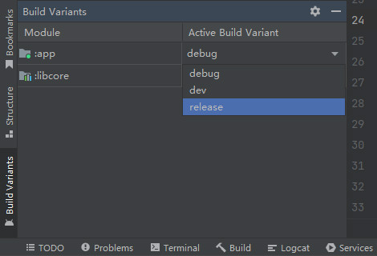

# 目录结构
目前Android官方指定的应用程序构建工具是Gradle，当我们使用Android Studio创建一个新的工程后，将会生成名为"app"的子模块，以及一些Gradle配置文件，它们的目录结构如下文代码块所示：

```text
NewProject
├── app
│   └── build.gradle
├── build.gradle
└── settings.gradle
```

工程根目录下的 `settings.gradle` 配置文件包含全局属性、子模块声明、仓库声明等信息。

"settings.gradle":

```groovy
// 构建工具的依赖配置
pluginManagement {
    // 声明Gradle插件仓库
    repositories {
        google()
        mavenCentral()
        gradlePluginPortal()
    }
}

// 所有模块的依赖配置
dependencyResolutionManagement {
    repositoriesMode.set(RepositoriesMode.FAIL_ON_PROJECT_REPOS)
    // 声明Maven组件仓库
    repositories {
        google()
        mavenCentral()
    }
}

/* 工程结构声明 */
// 主工程名称
rootProject.name = "RootProject"

// 子模块"app"
include ':app'
```

上述内容也可以使用Kotlin语言编写：

"settings.gradle.kts":

```kotlin
// 构建工具的依赖配置
pluginManagement {
    // 声明Gradle插件仓库
    repositories {
        google()
        mavenCentral()
        gradlePluginPortal()
    }
}

// 所有模块的依赖配置
dependencyResolutionManagement {
    repositoriesMode.set(RepositoriesMode.FAIL_ON_PROJECT_REPOS)
    // 声明Maven组件仓库
    repositories {
        google()
        mavenCentral()
    }
}

/* 工程结构声明 */
// 主工程名称
rootProject.name = "RootProject"

// 子模块"app"
include(":app")
```

上述配置文件中的 `pluginManagement {}` 与 `dependencyResolutionManagement {}` 小节用于配置Gradle插件与依赖组件仓库信息，详见相关章节： [🧭 Gradle - 仓库管理](../../../../04_软件技巧/06_软件开发/02_编译构建/02_Gradle/03_依赖管理.md#仓库配置) 。

该配置文件中的剩余部分用于配置项目结构，声明各个子模块，详见相关章节： [🧭 Gradle - 模块管理](../../../../04_软件技巧/06_软件开发/02_编译构建/02_Gradle/02_基础应用.md#模块管理) 。

工程根目录下的 `build.gradle` 配置文件包含Gradle插件声明。

"build.gradle":

```groovy
plugins {
    // 声明Gradle插件：Android应用程序
    id 'com.android.application' version '7.4.2' apply false
    // 声明Gradle插件：Android库
    id 'com.android.library' version '7.4.2' apply false
    // 声明Gradle插件：Android的Kotlin语言支持
    id 'org.jetbrains.kotlin.android' version '1.8.0' apply false
}
```

上述内容也可以使用Kotlin语言编写：

"build.gradle.kts":

```kotlin
plugins {
    id("com.android.application").version("7.4.2").apply(false)
    id("com.android.library").version("7.4.2").apply(false)
    id("org.jetbrains.kotlin.android").version("1.8.0").apply(false)
}
```

Android相关的插件都不是Gradle官方插件，因此我们在声明它们时必须指明版本。由于根工程无需放置Android源代码，此处添加了 `apply false` 属性，使插件不对根工程生效。

Android Gradle插件(Android Gradle Plugin, AGP)使Gradle具有生成Android产物的能力，其功能包括编译Java源码、打包资源文件、配置版本信息等。

AGP的版本需要与Gradle版本相匹配，相关信息可在Android Developer网站的 [🔗 AGP版本说明](https://developer.android.google.cn/studio/releases/gradle-plugin#updating-gradle) 页面中查询。

下文内容将对上述配置文件中出现的三个Gradle插件进行介绍：

🔷 `com.android.application`

该AGP的作用是生成Android应用程序，我们将使用该插件的模块简称为“APP模块”，它们的构建产物为APK文件，可以被安装到设备中并运行。

🔷 `com.android.library`

该AGP的作用是生成Android库组件，我们将使用该插件的模块简称为“LIB模块”，它们的构建产物为AAR文件，只能作为APP模块或其他LIB模块的依赖项，提供可复用的能力，无法直接被安装到设备中。

🔷 `org.jetbrains.kotlin.android`

该插件不属于AGP，它是由Jetbrains提供的，能够使APP或LIB模块支持Kotlin语言。

对于只使用Java语言的模块，我们不必为它们配置该插件。

<br />

"app"模块的 `build.gradle` 配置文件包含构建应用程序的具体配置。

"build.gradle":

```groovy
/* 当前模块启用的Gradle插件 */
plugins {
    id 'com.android.application'
    id 'org.jetbrains.kotlin.android'
}

/* Android相关配置 */
android {
    namespace 'net.bi4vmr.helloworld'
    compileSdk 33

    // 默认配置
    defaultConfig {
        applicationId "net.bi4vmr.helloworld"
        minSdk 26
        targetSdk 33
        versionCode 1
        versionName "1.0"

        testInstrumentationRunner "androidx.test.runner.AndroidJUnitRunner"
    }

    // 构建类型配置
    buildTypes {
        release {
            minifyEnabled false
            proguardFiles getDefaultProguardFile('proguard-android-optimize.txt'), 'proguard-rules.pro'
        }
    }

    // Java编译配置
    compileOptions {
        // 指定源码版本
        sourceCompatibility JavaVersion.VERSION_1_8
        // 指定编译生成的字节码版本
        targetCompatibility JavaVersion.VERSION_1_8
    }

    // Kotlin编译配置
    kotlinOptions {
        // 指定编译生成的字节码版本
        jvmTarget = '1.8'
    }
}

/* 依赖组件声明 */
dependencies {
    implementation 'androidx.core:core-ktx:1.7.0'
    implementation 'androidx.appcompat:appcompat:1.4.1'
}
```

上述内容也可以使用Kotlin语言编写：

"build.gradle.kts":

```kotlin
/* 当前模块启用的Gradle插件 */
plugins {
    id("com.android.application")
    id("org.jetbrains.kotlin.android")
}

/* Android相关配置 */
android {
    namespace = "net.bi4vmr.helloworld"
    compileSdk = 33

    // 默认配置
    defaultConfig {
        applicationId = "net.bi4vmr.helloworld"
        minSdk = 26
        targetSdk = 33
        versionCode = 1
        versionName = "1.0"

        testInstrumentationRunner = "androidx.test.runner.AndroidJUnitRunner"
    }

    // 构建类型配置
    buildTypes {
        getByName("release") {
            isMinifyEnabled = false
            proguardFiles(
                getDefaultProguardFile("proguard-android-optimize.txt"),
                "proguard-rules.pro"
            )
        }
    }

    // Java编译配置
    compileOptions {
        // 指定源码版本
        sourceCompatibility = JavaVersion.VERSION_1_8
        // 指定编译生成的字节码版本
        targetCompatibility = JavaVersion.VERSION_1_8
    }

    // Kotlin编译配置
    kotlinOptions {
        // 指定编译生成的字节码版本
        jvmTarget = "1.8"
    }
}

/* 依赖组件声明 */
dependencies {
    implementation("androidx.core:core-ktx:1.7.0")
    implementation("androidx.appcompat:appcompat:1.4.1")
}
```

该配置文件中的 `plugins {}` 小节用于声明当前模块启用的Gradle插件，此处声明了 `com.android.application` 插件，因此编译产物为APK文件。此处还声明了 `org.jetbrains.kotlin.android` 插件，因此我们可以在模块中编写Kotlin代码。

该配置文件中的 `android {}` 小节用于声明与Android有关的配置，包括包名、SDK版本、测试工具、混淆配置等，详见后文章节。

该配置文件中的 `dependencies {}` 小节用于声明当前模块所依赖的外部组件，详见相关章节： [🧭 Gradle - 依赖管理](../../../../04_软件技巧/07_编程工具/02_编译构建/02_Gradle/03_依赖管理.md) 。


# Build Types
## 简介
Build Types（构建类型）用于区分构建产物的用途，每个类型可以拥有不同的签名与调试参数等配置，以满足不同开发阶段的需求，例如：开发版本、测试版本、用户版本。

每个模块初始时拥有"debug"和"release"两个类型，其中"debug"类型面向开发者，默认允许进行调试、禁用代码混淆；"release"类型面向最终用户，默认不可进行调试、启用代码混淆。

## 基本应用
构建类型需要在当前模块 `build.gradle` 配置文件的 `android{}` 小节中声明，除了两个初始类型，我们还可以声明更多的类型，并配置每个类型的属性。

🔴 示例一：BuildTypes的基本应用。

在本示例中，我们修改两个默认类型的配置，并新增一个类型"dev"。

第一步，我们在当前模块 `build.gradle` 文件的 `android {}` 小节中添加配置语句，声明自定义构建类型。

"build.gradle":

```groovy
android {
    buildTypes {
        // 默认类型"release"
        release {
            // 配置属性：禁止Debug
            debuggable = false
        }

        // 默认类型"debug"
        debug {
            // 配置属性：允许Debug
            debuggable = true
        }

        // 自定义类型"dev"
        dev {
            // 配置属性：允许Debug
            debuggable = true
        }
    }
}
```

上述内容也可以使用Kotlin语言编写：

"build.gradle.kts":

```kotlin
android {
    buildTypes {
        // 默认类型"release"
        release {
            // 配置属性：禁止Debug
            isDebuggable = false
        }

        // 默认类型"debug"
        debug {
            // 配置属性：允许Debug
            isDebuggable = true
        }

        // 自定义类型"dev"
        create("dev") {
            // 配置属性：允许Debug
            isDebuggable = true
        }
    }
}
```

第二步，我们在Android Studio中执行一次Gradle Sync，即可在Build Variant面板中查看并选择新增的自定义类型，相关界面的样式如下文图片所示：

<div align="center">



</div>

Build Variant面板中展示了每个模块正在使用的构建类型，当我们通过"Build"菜单编译"app"模块后，可以在 `app/build/outputs/apk/debug/` 目录中找到对应的构建产物。

每当模块编译成功时，Gradle会在模块的 `build/outputs/apk/` 目录下生成一个与构建类型同名的目录，其中包括构建产物（APK或AAR文件）和构建信息（JSON格式的文件）。

```text
[root@Fedora RootProject]# tree ./app/build/outputs/apk/
./app/build/outputs/apk/
├── debug
│   ├── app-debug.apk
│   └── output-metadata.json
├── dev
│   ├── app-dev.apk
│   └── output-metadata.json
└── release
    ├── app-release.apk
    └── output-metadata.json
```

除了通过图形化工具执行编译之外，我们还可以通过命令行进行操作；上述三个构建类型对应的Gradle编译命令如下文代码块所示：

```text
# 编译"app"模块，指定构建类型为"release"。
[root@Fedora RootProject]# ./gradlew app:assembleRelease

# 编译"app"模块，指定构建类型为"debug"。
[root@Fedora RootProject]# ./gradlew app:assembleDebug

# 编译"app"模块，指定构建类型为"dev"。
[root@Fedora RootProject]# ./gradlew app:assembleDev


# 编译当前工程的所有模块与所有构建类型
[root@Fedora RootProject]# ./gradlew assemble
```

构建类型对应的Task名称采用驼峰命名法，"assemble"为固定前缀，随后为构建类型的名称。


# SigningConfigs
## 简介
SigningConfigs（签名配置）用于为APK签名，标识发布者的身份。我们可以在APP模块中创建多个签名配置，当Gradle编译产生APK后，将会根据配置自动选择对应的签名文件为APK签名，简化APP的发布流程。

## 基本应用
每个APP模块都有一个名为"debug"的默认签名配置，它使用的签名文件为 `<用户主目录>/.android/debug.keystore` ，我们可以在模块 `build.gradle` 文件的 `signingConfigs {}` 小节中覆盖默认配置，也可以在此处创建一些新的签名配置。

🟠 示例二：SigningConfigs的基本应用。

在本示例中，我们修改默认的签名配置，为其指定新的签名文件，并新增一个配置"AOSP"。

"build.gradle":

```groovy
android {
    signingConfigs {
        // 修改名为"debug"的默认配置
        debug {
            // 指明签名文件的路径
            storeFile file(rootDir.absolutePath + File.separator + "debug.keystore")
            // 存储库口令
            storePassword 'android'
            // 指定密钥名称
            keyAlias 'androiddebugkey'
            // 指定密钥口令
            keyPassword 'android'
        }

        // 创建名为"AOSP"的签名配置
        AOSP {
            storeFile file(rootDir.absolutePath + File.separator + "AOSPSystem.keystore")
            storePassword 'AOSPSystem'
            keyAlias 'AOSPSystem'
            keyPassword 'AOSPSystem'
        }
    }

    buildTypes {
        debug {
            // 应用名为"debug"的签名配置
            signingConfig signingConfigs.debug
        }

        release {
            // 应用名为"AOSP"的签名配置
            signingConfig signingConfigs.AOSP
        }
    }
}
```

上述内容也可以使用Kotlin语言编写：

"build.gradle.kts":

```kotlin
android {
    signingConfigs {
        // 修改名为"debug"的默认配置
        getByName("debug") {
            // 指明签名文件的路径
            storeFile = file("${rootDir.absolutePath}${File.separator}debug.keystore")
            // 存储库口令
            storePassword = "android"
            // 指定密钥名称
            keyAlias = "androiddebugkey"
            // 指定密钥口令
            keyPassword = "android"
        }

        // 创建名为"AOSP"的签名配置
        create("AOSP") {
            storeFile = file("${rootDir.absolutePath}${File.separator}AOSPSystem.keystore")
            storePassword = "AOSPSystem"
            keyAlias = "AOSPSystem"
            keyPassword = "AOSPSystem"
        }
    }

    buildTypes {
        debug {
            // 应用名为"debug"的签名配置
            signingConfig = signingConfigs.getByName("debug")
        }

        release {
            // 应用名为"AOSP"的签名配置
            signingConfig = signingConfigs.getByName("AOSP")
        }
    }
}
```

签名配置需要先声明后使用，因此 `signingConfigs {}` 小节必须放置在调用语句之前。

在上述代码中，我们修改了默认签名配置"debug"的签名文件，并声明了名为"AOSP"的新配置，最后将它们分别应用到"debug"和"release"两个BuildType中。如果我们不需要为多个BuildType设置不同的签名，也可以将应用签名的语句设置在 `defaultConfig {}` 小节中。

> ⚠️ 警告
>
> 名为"debug"的构建类型默认使用的签名配置也是"debug"，不受 `defaultConfig {}` 小节中 `signingConfig` 配置项的影响；如果我们要更改这种默认行为，必须像上述示例代码一样在 `buildTypes {}` 小节中显式声明构建类型"debug"所使用的签名配置。


# Kotlin相关配置
## 添加Kotlin支持
如果一个工程原本并未配置任何Kotlin相关组件，我们需要在Gradle配置文件中新增以下内容，使其支持Kotlin语言。

🟡 示例三：为模块添加Kotlin支持。

在本示例中，我们为不支持Kotlin的工程添加配置，使其支持Kotlin语言。

第一步，我们在工程根目录下的 `build.gradle` 文件中声明Android的Kotlin支持插件及其版本号。

"build.gradle":

```groovy
plugins {
    id 'com.android.application' version '7.4.2' apply false
    id 'com.android.library' version '7.4.2' apply false
    // 声明Android的Kotlin支持插件版本
    id 'org.jetbrains.kotlin.android' version '1.9.21' apply false
}
```

上述内容也可以使用Kotlin语言编写：

"build.gradle.kts":

```kotlin
plugins {
    id("com.android.application").version("7.4.2").apply(false)
    id("com.android.library").version("7.4.2").apply(false)
    // 声明Android的Kotlin支持插件版本
    id("org.jetbrains.kotlin.android").version("1.9.21").apply(false)
}
```

第二步，我们在需要支持Kotlin语言的模块的 `build.gradle` 文件中声明该插件。

"build.gradle":

```groovy
plugins {
    id 'com.android.application'
    // 添加Android的Kotlin支持插件
    id 'org.jetbrains.kotlin.android'
}
```

上述内容也可以使用Kotlin语言编写：

"build.gradle.kts":

```kotlin
plugins {
    id("com.android.application")
    // 添加Android的Kotlin支持插件
    id("org.jetbrains.kotlin.android")
}
```

第三步，我们需要统一Java与Kotlin源代码的编译目标版本。

由于Gradle默认的Java与Kotlin源代码编译目标版本不一致，会导致编译失败，我们需要在模块 `build.gradle` 文件的 `android {}` 小节中将二者编译目标版本设为同一版本。

"build.gradle":

```groovy
android {
    compileOptions {
        // 指定Java源码编译目标版本
        sourceCompatibility = JavaVersion.VERSION_11
        targetCompatibility = JavaVersion.VERSION_11
    }

    kotlinOptions {
        // 指定Kotlin源码编译目标版本
        jvmTarget = 11
    }
}
```

上述内容也可以使用Kotlin语言编写：

"build.gradle.kts":

```kotlin
android {
    compileOptions {
        // 指定Java源码编译目标版本
        sourceCompatibility = JavaVersion.VERSION_11
        targetCompatibility = JavaVersion.VERSION_11
    }

    kotlinOptions {
        // 指定Kotlin源码编译目标版本
        jvmTarget = "11"
    }
}
```

## 设置源代码目录名称
默认情况下Kotlin源代码与Java源代码混合放置在 `<模块根目录>/src/main/java/` 目录中，如果我们希望使用不同的目录分别管理两种源代码，可以在模块的 `build.gradle` 文件中新增配置项，为资源集合"main"新增一个 `kotlin` 目录。

"build.gradle":

```groovy
android {
    sourceSets {
        main {
            java {
                // 新增Kotlin源代码目录
                java.srcDirs += "src/main/kotlin"
            }
        }
    }
}
```

上述内容也可以使用Kotlin语言编写：

"build.gradle.kts":

```kotlin
android {
    sourceSets {
        getByName("main") {
            java {
                // 新增Kotlin源代码目录
                java.srcDir("src/main/kotlin")
            }
        }
    }
}
```


# 版本变更
## 索引

<div align="center">

|       序号        |    版本    |                         摘要                         |
| :---------------: | :--------: | :--------------------------------------------------: |
| [变更一](#变更一) | AGP v7.3.1 | 命名空间声明语句从Manifest文件移动至Gradle配置文件。 |

</div>

## 变更一
### 摘要
自从AGP v7.3.1开始，命名空间声明语句从Manifest文件移动至Gradle配置文件。

### 详情
在早期版本中，Manifest文件根标签含有命名空间声明语句 `package="<Package Name>"` ，它决定了Manifest文件的默认包名与R文件所在路径。

"AndroidManifest.xml":

```xml
<manifest xmlns:android="http://schemas.android.com/apk/res/android"
    package="net.bi4vmr.study">

    <!-- 此处省略其他配置... -->
</manifest>
```

自从AGP v7.3.1开始，命名空间声明语句从Manifest文件移动至Gradle配置文件，对应的方法为 `namespace()` 。

"build.gradle":

```groovy
android {
    namespace "net.bi4vmr.study"

    /* 此处省略其他代码... */
}
```

上述内容也可以使用Kotlin语言编写：

"build.gradle.kts":

```kotlin
android {
    namespace = "net.bi4vmr.study"

    /* 此处省略其他代码... */
}
```

### 兼容方案
较新版本的AGP仍然可以识别Manifest文件中的命名空间声明语句，可以保持现状。


# 疑难解答
## 索引

<div align="center">

|       序号        |                           摘要                            |
| :---------------: | :-------------------------------------------------------: |
| [案例一](#案例一) |  构建工程时出现错误：多个LIB模块的BuildConfig文件冲突。   |
| [案例二](#案例二) |    构建工程时出现错误：LIB模块的Java版本高于APP模块。     |
| [案例三](#案例三) |   构建工程时出现错误：某个依赖组件缺少 `*-r.txt` 文件。   |
| [案例四](#案例四) | Gradle Sync出现错误： `java.lang.NullPointerException` 。 |
| [案例四](#案例五) | Gradle Sync出现错误： `java.lang.NullPointerException` 。 |

</div>

## 案例一
### 问题描述
APP模块编译失败，错误信息为： `Type <包名>.BuildConfig is defined multiple times` 。

```text
> Task :app:mergeLibDexDebug FAILED
ERROR: RootProject/app/build/.transforms/655facb924193c287625cad02831b812/transformed/debug/<包名>/BuildConfig.dex: D8: Type <包名>.BuildConfig is defined multiple times: ...
com.android.builder.dexing.DexArchiveMergerException: Error while merging dex archives:
Learn how to resolve the issue at https://developer.android.com/studio/build/dependencies#duplicate_classes.
```

### 问题分析
APP模块依赖多个LIB模块，经排查我们发现其中两个LIB模块的命名空间相同。

命名空间决定了BuildConfig、R等自动生成代码的存放路径，因此当两个LIB模块被同一个APP模块依赖时，命名空间所指定的包下都有一个 `BuildConfig.java` 文件，就会产生冲突导致编译失败。

### 解决方案
如果LIB模块需要生成各自的BuildConfig文件，我们必须将两个模块的命名空间设为不同的值，避免产生冲突。

如果LIB模块不需要生成各自的BuildConfig文件，我们可以禁止LIB模块生成BuildConfig文件，详见相关章节： [🧭 BuildConfig](./02_进阶用法.md#buildconfig) 。

## 案例二
### 问题描述
APP模块编译失败，错误信息为： `Dependency '<依赖组件>' requires core library desugaring` 。

```text
Execution failed for task ':app:checkReleaseAarMetadata'.
> A failure occurred while executing com.android.build.gradle.internal.tasks.CheckAarMetadataWorkAction
    > An issue was found when checking AAR metadata:
        1.  Dependency '<依赖组件>' requires core library desugaring to be enabled for :app.
        See https://developer.android.com/studio/write/java8-support.html for more details.
```

### 问题分析
我们首先查看错误信息中提及的网页： [🔗 Java 8 Support](https://developer.android.com/studio/write/java8-support.html) ，可以得知问题原因如下：

APP模块指定使用Java 8编译，LIB模块使用Java 11编译，Java 11中新增的特性无法在Java 8中使用，因此导致编译失败。

### 解决方案
Android官方提供了名为“脱糖(Desugaring)”的兼容方案，我们可以在APP模块中开启该特性，使Gradle向产物中添加Java 8对Java 11的兼容代码，确保LIB模块中的功能可以正常运行。

"build.gradle":

```groovy
android {
    compileOptions {
        // 开启Desugaring功能
        coreLibraryDesugaringEnabled true
    }
}

dependencies {
    // 引入兼容模块(AGP 7.4及更高版本)
    coreLibraryDesugaring 'com.android.tools:desugar_jdk_libs:2.0.3'
    // 引入兼容模块(AGP 7.3)
    // coreLibraryDesugaring 'com.android.tools:desugar_jdk_libs:1.2.3'
    // 引入兼容模块(AGP 4至7.2)
    // coreLibraryDesugaring 'com.android.tools:desugar_jdk_libs:1.1.9'
}
```

上述内容也可以使用Kotlin语言编写：

"build.gradle.kts":

```kotlin
android {
    compileOptions {
        // 开启Desugaring功能
        isCoreLibraryDesugaringEnabled = true
    }
}

dependencies {
    // 引入兼容模块(AGP 7.4及更高版本)
    coreLibraryDesugaring("com.android.tools:desugar_jdk_libs:2.0.3")
    // 引入兼容模块(AGP 7.3)
    // coreLibraryDesugaring("com.android.tools:desugar_jdk_libs:1.2.3")
    // 引入兼容模块(AGP 4至7.2)
    // coreLibraryDesugaring("com.android.tools:desugar_jdk_libs:1.1.9")
}
```

## 案例三
### 问题描述
APP模块编译失败，错误信息为： `NoSuchFileException: *-r.txt` 。

```text
Execution failed for task ':app:dataBindingGenBaseClassesRelease'.
> java.nio.file.NoSuchFileException: /home/<用户名称>/.gradle/caches/transforms-3/588a8da163ac759a1b2fd83ea026b397/transformed/<依赖名称>-r.txt
```

### 问题分析
该问题的原因是我们删除了Gradle缓存目录 `<用户目录>/.gradle/caches/` 中的AAR缓存文件，已经启动的Gradle进程不会感知到这种变化，仍然认为AAR文件已经下载完毕，尝试加载相关文件，所以出现了错误。

### 解决方案
我们需要终止正在运行的Gradle进程，并删除Gradle进程的缓存文件，确保状态一致。例如：当前工程使用的Gradle版本为"8.5"，我们应当删除 `<用户目录>/.gradle/caches/8.5/` 目录并尝试再次编译。

对于Linux平台，我们可以执行以下命令删除缓存文件：

```text
# 终止所有与当前工程Gradle版本一致的Gradle进程
[root@Fedora RootProject]# ./gradlew --stop

# 终止所有Gradle进程
#
# 本方法将会终止所有版本的Gradle进程，适合在具有多个子工程的大型项目中使用。
#
# "grep -v 'gradle-clear.sh'"可以防止在脚本中运行时命令自身被终止，如果在命令行中运行，可以忽略该部分。
[root@Fedora ~]# ps -ef | grep 'gradle' | grep -v 'grep' | grep -v 'gradle-clear.sh' | awk '{print $2}' | xargs -I "{}" sh -c 'if test ! -z "{}";then kill "{}"; fi'

# 删除Gradle进程的缓存文件
[root@Fedora ~]# find ~/.gradle/caches -maxdepth 1 -name "[1-9].*" | xargs rm -rf
```

上述方法仅可用于本地调试，对于服务器环境，可能会导致其他Gradle编译任务中断；我们可以在启动编译任务的命令行中添加 `--no-daemon` 选项，不再复用Gradle后台进程。

```text
# 编译AAR或APK，且不复用Gradle后台进程。
[root@Fedora ~]# ./gradlew assembleRelease --no-daemon
```

我们也可以修改全局或工程的 `gradle.properties` 配置文件，将该选项作为持久化配置：

"gradle.properties":

```ini
# Disable gradle daemons
org.gradle.daemon=false
```

## 案例四
### 问题描述
APP模块编译失败，错误信息为： `D8: java.lang.NullPointerException` 。

```text
Task :app:mergeExtDexDebug FAILED

ERROR:/home/bi4vmr/.gradle/caches/modules-2/files-2.1/<模块名称>/<模块版本>/<文件Hash>/<文件名称>.jar: D8: java.lang.NullPointerException: Cannot invoke "String.length()" because "<parameter1>" is null
```

### 问题分析
APP模块引用了JAR包，该JAR包对应模块中包含JDK提供的MessageDigest工具，且模块配置文件指定编译目标版本为Java 8。

可能的原因是标准JVM与Android JVM实现有差异，因此Java 8版本的标准JVM中MessageDigest工具在Android JVM中不可用。

### 解决方案
我们将JAR包对应模块的编译版本修改为Java 11，重新编译生成新的JAR包，并在Android工程中引用，问题得以解决。

"build.gradle.kts":

```kotlin
java {
    sourceCompatibility = JavaVersion.VERSION_11
    targetCompatibility = JavaVersion.VERSION_11
}
```

## 案例五
### 问题描述
在Android Studio中执行Gradle Sync时，操作失败，错误信息为： `java.lang.NullPointerException` 。

### 问题分析
当我们使用 `gradlew` 命令编译工程时不会遇到此错误，仅当Android Studio执行Gradle Sync时会出现，因此可以确定问题与Android Studio有关。

### 解决方案
我们可以依次删除以下缓存文件，并尝试重新启动Android Studio再次执行Gradle Sync：

- 删除工程根目录下的 `.gradle` 缓存目录。
- 清理Android Studio的缓存文件（通过 `File - Invalidate Cache` 菜单）。
- 清理Android Studio的用户配置（Windows平台 : `%USERPROFILE%\AppData\Local\Google\<Android Studio版本号>\projects\<名称含有工程名字的目录>\` ；Linux平台 : `~/.cache/Google/<Android Studio版本号>/projects/<名称含有工程名字的目录>/` ）。
