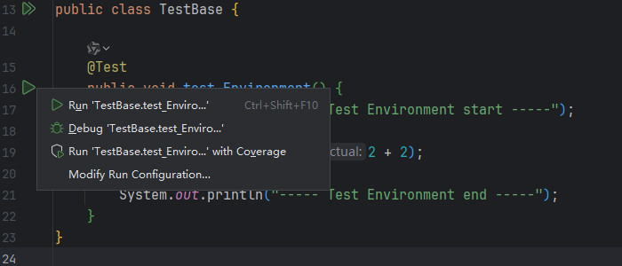
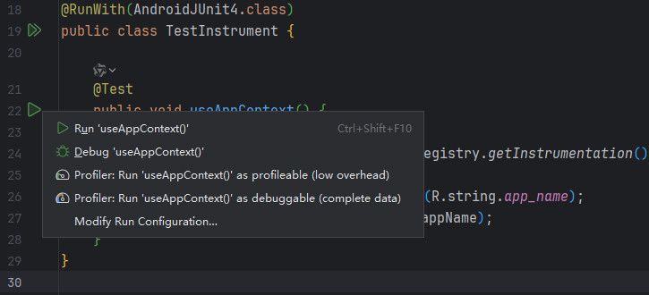

# 简介
本章内容概略地介绍了Android开发中的主要测试方式，帮助开发者快速搭建及使用Android测试环境。

本章的示例工程详见以下链接：

- [🔗 示例工程：Android测试工具](https://github.com/BI4VMR/Study-Android/tree/master/M02_Tool/C03_Test/S01_Base)


# 本地测试
## 简介
Android工程与标准的Maven Java工程结构类似，我们可以在 `<模块根目录>/src/test/java/` 等目录下放置测试代码，这种测试代码运行在PC端的JVM上，因此我们将其称为“本地测试”。它的优点是执行速度较快，无需Android设备或模拟器；缺点则是无法直接测试包含Android SDK接口调用的代码。

本地测试环境的搭建方式可参考相关章节： [🧭 JUnit - 基本应用](../../../../06_编程语言/03_Java/04_实用工具/04_测试工具/02_JUnit.md#基本应用) 。

> 🚩 提示
>
> Robolectric框架能够在PC端的JVM上模拟Android运行环境，对于不包含复杂UI交互的业务代码，我们可以选择该工具执行本地测试，详情可参考相关章节： [🧭 Robolectric - 简介](02_Robolectric.md#简介) 。

## 通过IDE运行测试
当我们编写代码时，可以通过Android Studio运行测试用例：

<div align="center">



</div>

点击测试类前的双箭头并在弹出菜单中选择 `Run ...` 选项，可以运行当前测试类中的所有测试用例；点击测试方法前的箭头并在菜单中选择 `Run ...` 选项，可以运行当前测试方法。

## 通过命令行运行测试
我们可以在命令行中执行测试用例并生成报告，这在CI/CD等环境中非常有用：

```text
# 执行所有模块的本地测试
[bi4vmr@Fedora Project]$ ./gradlew test

# 执行特定模块的本地测试
[bi4vmr@Fedora Project]$ ./gradlew <模块名称>:test

# 执行特定模块的本地测试，并显示详细日志。
[bi4vmr@Fedora Project]$ ./gradlew <模块名称>:test -i

# 执行特定模块的特定本地测试
[bi4vmr@Fedora Project]$ ./gradlew <模块名称>:test --tests "<测试类名称>"

# 执行特定模块的特定本地测试方法
[bi4vmr@Fedora Project]$ ./gradlew <模块名称>:test --tests "<测试类名称>.<测试方法名称>"


# 执行Debug Variant的本地测试
[bi4vmr@Fedora Project]$ ./gradlew testDebugUnitTest

# 执行Release Variant的本地测试
[bi4vmr@Fedora Project]$ ./gradlew testReleaseUnitTest

# 执行特定Variant的本地测试
[bi4vmr@Fedora Project]$ ./gradlew test<Variant名称>UnitTest
```

`test` 命令会依次执行所有Build Variant的本地测试，运行速度较慢，通常我们选择 `testDebugUnitTest` 命令执行Debug Variant的测试用例即可。


# 仪器化测试
## 简介
仪器化测试将会生成APK，需要在物理设备或模拟器中运行，因此能够测试包含Android SDK接口的代码。我们可以在 `<模块根目录>/src/androidTest/java/` 等目录下放置测试代码。

## 环境搭建
通过Android Studio创建的初始工程已经包含了仪器化测试环境，我们不必手动添加配置。

下文示例针对没有仪器化测试环境的工程，我们也可以由此了解与仪器化测试有关的必备配置项。

🔴 示例一：构建仪器化测试环境。

在本示例中，我们为工程添加仪器化测试支持。

第一步，我们在模块的Gradle配置文件中添加仪器化测试相关配置。

"build.gradle":

```groovy
android {
    defaultConfig {
        // 指定仪器化测试运行环境
        testInstrumentationRunner = 'androidx.test.runner.AndroidJUnitRunner'
    }
}

dependencies {
    /* 仪器化测试依赖项 */
    // JUnit4
    androidTestImplementation 'junit:junit:4.13.2'
    // AndroidX Test JUnit扩展
    androidTestImplementation 'androidx.test.ext:junit:1.2.1'
    // AndroidX Test Espresso运行环境
    androidTestImplementation  'androidx.test.espresso:espresso-core:3.6.1'
}
```

上述内容也可以使用Kotlin语言编写：

"build.gradle.kts":

```kotlin
android {
    defaultConfig {
        // 指定仪器化测试运行环境
        testInstrumentationRunner = "androidx.test.runner.AndroidJUnitRunner"
    }
}

dependencies {
    /* 仪器化测试依赖项 */
    // JUnit4
    androidTestImplementation("junit:junit:4.13.2")
    // AndroidX Test JUnit扩展
    androidTestImplementation("androidx.test.ext:junit:1.2.1")
    // AndroidX Test Espresso运行环境
    androidTestImplementation("androidx.test.espresso:espresso-core:3.6.1")
}
```

`androidTestImplementation` 只对仪器化测试生效，不会自动复用通过 `testImplementation` 声明的依赖项。

> 🚩 提示
>
> Android仪器化测试工具目前仅支持与JUnit4集成，请勿将其更改为JUnit5或其他测试框架，以免遇到兼容性问题。

第二步，我们在仪器化测试代码目录中创建测试类。

"TestInstrument.java":

```java
@RunWith(AndroidJUnit4.class)
public class TestInstrument {

    @Test
    public void useAppContext() {
        // 获取仪器化测试环境下的Context
        Context appContext = InstrumentationRegistry.getInstrumentation().getTargetContext();
        // 访问Android资源
        String appName = appContext.getString(R.string.app_name);
        Log.d("Test", "应用名称：" + appName);
    }
}
```

上述内容也可以使用Kotlin语言编写：

"TestInstrumentKT.kt":

```kotlin
@RunWith(AndroidJUnit4::class)
class TestInstrumentKT {

    @Test
    fun useAppContext() {
        // 获取仪器化测试环境下的Context
        val appContext = InstrumentationRegistry.getInstrumentation().targetContext
        // 访问Android资源
        val appName: String = appContext.getString(R.string.app_name)
        Log.d("Test", "应用名称：$appName")
    }
}
```

如果我们想要在测试代码中使用Application或Context，需要在测试类上添加 `@RunWith(AndroidJUnit4.class)` 注解，然后通过InstrumentationRegistry进行调用。

## 通过IDE运行测试
当我们编写代码时，可以通过Android Studio运行测试用例：

<div align="center">



</div>

点击测试类前的双箭头并在弹出菜单中选择 `Run ...` 选项，可以运行当前测试类中的所有测试用例；点击测试方法前的箭头并在菜单中选择 `Run ...` 选项，可以运行当前测试方法。

## 在命令行中运行
我们可以在命令行中执行测试用例并生成报告，这在CI/CD等环境中非常有用：

```text
# 执行所有模块的仪器化测试
[bi4vmr@Fedora Project]$ ./gradlew connectedAndroidTest

# 执行特定模块的仪器化测试
[bi4vmr@Fedora Project]$ ./gradlew <模块名称>:connectedAndroidTest
```


# 实用技巧
## 指定仪器化测试签名
在开发系统应用时，我们经常调用要求系统签名鉴权的API，默认情况下仪器化测试将使用Debug Variant的签名配置创建测试APK，因此我们为Debug Variant配置目标设备认可的签名即可。

"build.gradle.kts":

```kotlin
android {
    signingConfigs {
        create("AOSP") {
            storeFile = file("AOSP.keystore")
            storePassword = "AOSPSystem"
            keyAlias = "AOSPSystem"
            keyPassword = "AOSPSystem"
        }
    }

    buildTypes {
        getByName("debug") {
            signingConfig = signingConfigs.getByName("AOSP")
        }
    }

    // 指定仪器化测试所使用的Build Variant
    testBuildType = "debug"
}
```

`testBuildType = <Build Variant名称>` 配置项可以指定仪器化测试所使用的Build Variant，在本案例中，配置项的默认值即为 `debug` ，因此我们可以省略该配置项；如果我们希望使用其他Build Variant，则必须明确地进行配置。
