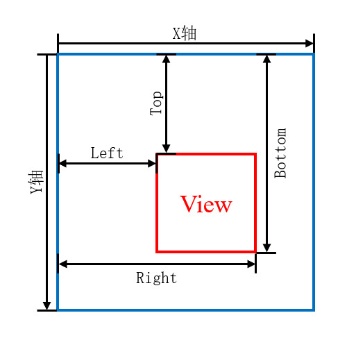

# 简介
控件是组成用户界面的基本元素，我们日常所使用的软件界面由各种控件组成，例如：按钮、文本框、图片展示框等。Android中的控件都继承自 `android.view.View` 类，View是对所有UI组件的抽象，它描述了UI组件的公共属性，例如：宽度与高度；它还拥有设置事件监听器的相关方法，例如：“点击事件”、“长按事件”等。

View是单体控件，包括按钮、文本框等，其内部无法容纳子控件；ViewGroup继承自View，它们能够拥有多个子控件并管理排列方式，包括布局管理器和列表展示类控件。ViewGroup支持嵌套使用，我们可以根据功能编写多个布局并将它们组合起来，实现灵活的界面设计。


# 布局文件
## 简介
布局文件用于描述一组控件的层级关系与初始状态，基于XML语法编写，统一放置在 `<模块根目录>/src/main/res/layout` 目录中。当程序运行时，系统将根据布局文件中的标签创建对应的View实例，并组合为树状结构，最终呈现出用户界面。

下文代码块展示了一个布局文件示例：

"testui_layout.xml":

```xml
<?xml version="1.0" encoding="utf-8"?>
<androidx.constraintlayout.widget.ConstraintLayout xmlns:android="http://schemas.android.com/apk/res/android"
    xmlns:app="http://schemas.android.com/apk/res-auto"
    xmlns:custom="http://schemas.android.com/apk/res-auto"
    xmlns:tools="http://schemas.android.com/tools"
    android:layout_width="match_parent"
    android:layout_height="match_parent"
    android:orientation="vertical"
    tools:ignore="HardcodedText">

    <TextView
        android:id="@+id/text"
        android:layout_width="wrap_content"
        android:layout_height="wrap_content"
        android:text="我能够吞下玻璃而不伤身。"
        app:layout_constraintStart_toStartOf="parent"
        app:layout_constraintTop_toTopOf="parent"
        tools:text="[测试文本]" />

    <ImageView
        android:id="@+id/image"
        android:layout_width="100dp"
        android:layout_height="100dp"
        android:layout_marginStart="50dp"
        android:src="@drawable/ic_funny_256"
        custom:layout_constraintStart_toStartOf="parent"
        custom:layout_constraintTop_toBottomOf="@id/text" />
</androidx.constraintlayout.widget.ConstraintLayout>
```

该布局的显示效果如下文图片所示：

<div align="center">


</div>

## 语法解析
TextView是文本框控件，ImageView是图片展示控件，它们的代码实现在 `android` 包中，因此标签 `<TextView>` 和 `<ImageView>` 可以省略包名，如果我们使用的控件不在 `android` 包中，则必须申明完整的路径，例如： `<androidx.constraintlayout.widget.ConstraintLayout>` 。

ConstraintLayout是一种布局管理器，TextView和ImageView可以作为它的子节点；TextView和ImageView是单体控件，不能拥有子节点。

每个控件都必须声明 `android:layout_width` 和 `android:layout_height` 属性，分别表示它们的宽度与高度。宽、高属性的有效值如下文内容所示：

🔷 `match_parent(-1)`

控件的宽或高参考父容器。

假设父容器的宽度为 `100dp` ，则本控件的宽度为 `100dp` ；父容器的宽度为 `500dp` ，则本控件的宽度也是 `500dp` ，以此类推。

🔷 `wrap_content(-2)`

控件的宽或高参考自身内容。

假设我们将尺寸为 `50x50` 的图片设置到ImageView中，则ImageView的尺寸为 `50x50` ；我们将尺寸为 `200x100` 的图片设置到ImageView中，则ImageView的尺寸也是 `200x100` ，以此类推。

🔷 `<固定值>`

控件的宽或高为固定数值，不受其父子元素的影响，常用的计量单位为 `dp`。

<br />

`android:id` 属性用于在当前XML文件中唯一标识某个控件， `@+id/<控件ID>` 表示注册新的ID，系统会在 `R` 文件中生成对应的记录，当布局文件被渲染为View实例后，我们可以在代码中通过 `findViewById(R.id.tvInfo)` 方法获取TextView实例，并调用其方法修改文本内容、字体颜色等。

`android:text` 是TextView的专有属性，用于设置此文本框的初始文本内容； `android:src` 则是ImageView的专有属性，表示此图片展示框默认加载 `@drawable/ic_funny_256` 图片。

以 `tools` 开头的属性是调试工具，编译产物并不会携带这些属性。例如 `tools:text` 表示文本框在Android Studio的布局预览窗口中显示“测试文本”，但程序运行时仍然以 `android:text` 属性设置的内容为准；`tools:ignore` 则用于指示Android Studio忽略某些语法检查规则，也不影响程序运行时的行为。

## 命名空间
在布局文件中，常用的命名空间如下文列表所示：

- Android： `xmlns:android="http://schemas.android.com/apk/res/android"`
- 当前工程： `xmlns:app="http://schemas.android.com/apk/res-auto"`
- 调试工具： `xmlns:tools="http://schemas.android.com/tools"`

对于第三方库引入的控件属性和工程中自定义的控件属性，我们可以统一使用 `app` 命名空间。

为了区分自定义控件与其他控件的属性，我们也可以自定义命名空间。例如上文示例中的 `custom:layout_constraintStart_toStartOf` ，该属性等同于 `app:layout_constraintStart_toStartOf` ，因为编译器只识别命名空间的URI，我们可以随意设置前缀，文件头部的 `xmlns:custom="http://schemas.android.com/apk/res-auto"` 语句指明了 `custom` 前缀也指向 `app` 的URI，此时二者是等价的。

> 🚩 提示
>
> 部分属性在 `android` 和 `app` 命名空间中都存在，通常Android SDK中的控件识别 `android` 命名空间的属性，而通过外部依赖引入的组件（例如：AndroidX、Material等）识别 `app` 命名空间的属性。
>
> 我们应当注意区分二者，避免混用，有些Android SDK中的控件不能识别 `app` 命名空间中的属性。

## 渲染布局
LayoutInflater用于解析布局文件并渲染生成View树结构，我们通过Activity的 `setContentView(int resId)` 方法初始化界面内容，本质上就是通过LayoutInflater将布局文件解析为View树，并附加到Activity的Window中。

我们可以通过以下方式获取LayoutInflater实例：

```java
// 通过Context获取LayoutInflater
LayoutInflater layoutInflater1 = context.getSystemService(LayoutInflater.class);

// 通过Context获取LayoutInflater（简化方法）
LayoutInflater layoutInflater2 = LayoutInflater.from(context);

// 通过Activity获取LayoutInflater
LayoutInflater layoutInflater3 = activity.getLayoutInflater();
```

方法二是方法一的简化封装，二者是等价的，方法三需要Activity实例，一般在Activity内部使用。

获取LayoutInflater实例之后，我们便可调用 `View inflate()` 系列方法解析布局文件，这些方法参数不同，解析成功后都会返回布局文件对应的View实例，解析失败时都会抛出 `InflateException` 异常。

较为常用的解析方法是 `inflate(int resource, @Nullable ViewGroup root, boolean attachToRoot)` ，第一参数 `resource` 即待解析的布局文件ID，第二参数 `root` 表示父容器，第三参数 `attachToRoot` 用于控制是否立即将View实例附加到父容器。

第二参数与第三参数具有以下几种组合：

🔷 `root` 非空， `attachToRoot` 为 `true` 。

将View实例自动附加到 `root` 中，这意味着该方法执行完毕后界面立刻显示新的内容，且此时布局根容器的 `layout_width` 和 `layout_height` 属性是有效的。

🔷 `root` 非空， `attachToRoot` 为 `false` 。

解析布局文件但不进行附加操作，此时界面上不会有任何变化。稍后我们需要调用父容器 `root` 的 `addView()` 方法，并传入 `inflate()` 方法返回的View实例，才能在界面上看到新的内容。

虽然新的View实例不会自动显示，但 `root` 已经被指定，此时布局根容器的 `layout_width` 和 `layout_height` 属性是有效的。

🔷 `root` 为空值。

解析布局文件，且没有父容器可供参考，此时布局根容器的 `layout_width` 和 `layout_height` 属性是无效的。

由于系统无法确定应当将View实例放置在何处，界面上不会显示新的内容， `attachToRoot` 参数是无意义的。稍后我们需要调用目标容器的 `addView()` 方法并传入解析得到的View实例，界面上才会显示新的内容。

<br />

对于较为常见的两个场景，LayoutInflater提供了快捷方法，当开发者指定父容器时自动附加，未指定父容器时不自动附加。

```java
public View inflate(int resource, @Nullable ViewGroup root) {
    return inflate(resource, root, root != null);
}
```

在Activity中， `setContentView(int resId)` 方法的逻辑是通过Activity获取LayoutInflater实例，然后以DecorView为 `root` 调用 `inflate()` 方法，因此我们仅需传入布局文件ID，界面上就会自动显示内容，并且布局根容器的属性能够生效。


# 常用方法
## 获取控件引用
布局文件仅能描述界面的初始样式，控件之间并未产生联系，文本框内容均为初始值，按钮被点击后也无任何功能。为了实现业务逻辑，我们需要在代码中获取控件的引用，并调用它们的方法设置事件监听器、动态修改文本内容或图片资源。

在前文示例布局中，有一个ID为 `text` 的TextView，我们可以通过Activity提供的 `findViewById()` 方法获取该控件的引用，并修改其属性。

"TestUIFunctionGetView.java":

```java
// 获取按钮控件的引用（控件不存在则为空值）
TextView tvTitle = findViewById(R.id.text);
// 设置文本颜色
if (tvTitle != null) {
    tvTitle.setTextColor(Color.GREEN);
}
```

上述内容也可以使用Kotlin语言编写：

"TestUIFunctionGetView.kt":

```kotlin
// 获取按钮控件的引用（控件不存在则为空值）
val tvTitle: TextView? = findViewById(R.id.text)
// 设置文本颜色
tvTitle?.setTextColor(Color.GREEN)
```

对于Activity， `findViewById()` 方法将检索先前通过 `setContentView()` 方法设置的View树，如果View树中没有该ID对应的控件，则返回空值，访问控件前我们应当判断引用是否为空值。

在大多数界面中，具有ID的控件是预先定义的，为了减少不必要的空值判断，Android 9新增了 `requireViewById()` 方法，若View树中没有指定ID对应的控件，则抛出 `IllegalArgumentException` 异常。

"TestUIFunctionGetView.java":

```java
TextView tvTitle1 = requireViewById(R.id.text);
tvTitle1.setTextColor(Color.GREEN);
```

上述内容也可以使用Kotlin语言编写：

"TestUIFunctionGetView.kt":

```kotlin
val tvTitle1: TextView = requireViewById(R.id.text)
tvTitle1.setTextColor(Color.GREEN)
```

AndroidX库中新增了ViewBinding工具，可以在编译期间为布局文件生成Binding类，以便我们通过 `binding.text` 直接访问TextView控件，无需进行空值判断。这是官方推荐的控件访问方式，关于 ViewBinding的知识详见相关章节： [🧭 ViewBinding](../../08_工程架构/02_架构组件/03_ViewBinding.md) 。

## 创建控件实例
部分控件将在用户进行特定操作之后出现，我们无法预先在布局文件中声明它们，此时可以通过代码创建控件实例，并添加至目标容器。

我们创建一个新的Activity用于演示，其布局文件中仅有一个FrameLayout作为容器。

"testui_function_createview.xml":

```xml
<FrameLayout xmlns:android="http://schemas.android.com/apk/res/android"
    android:id="@+id/container"
    android:layout_width="match_parent"
    android:layout_height="match_parent" />
```

我们在Activity中编写以下内容，向FrameLayout添加一个TextView。

"TestUIFunctionCreateView.java":

```java
// 创建TextView实例
TextView textview = new TextView(this);
// 设置文本内容
textview.setText("这是一个动态创建的TextView。");
// 设置文本颜色
textview.setTextColor(Color.RED);
// 设置背景颜色
textview.setBackgroundColor(Color.CYAN);

// 创建LayoutParams实例，指定宽高和外边距。
FrameLayout.LayoutParams lp = new FrameLayout.LayoutParams(FrameLayout.LayoutParams.WRAP_CONTENT, FrameLayout.LayoutParams.WRAP_CONTENT);
lp.setMarginStart(100);

// 将TextView添加到容器中
FrameLayout layout = requireViewById(R.id.container);
layout.addView(textview, lp);
```

上述内容也可以使用Kotlin语言编写：

"TestUIFunctionCreateView.kt":

```kotlin
// 创建TextView实例
val textview = TextView(this)
// 设置文本内容
textview.text = "这是一个动态创建的TextView。"
// 设置文本颜色
textview.setTextColor(Color.RED)
// 设置背景颜色
textview.setBackgroundColor(Color.CYAN)

// 创建LayoutParams实例，指定宽高和外边距。
val lp = FrameLayout.LayoutParams(FrameLayout.LayoutParams.WRAP_CONTENT, FrameLayout.LayoutParams.WRAP_CONTENT)
lp.marginStart = 100

// 将TextView添加到容器中
val layout: FrameLayout = requireViewById(R.id.container)
layout.addView(textview, lp)
```

TextView构造方法的必备条件是Context实例，Activity本身就是Context，我们可以通过 `TextView(this)` 创建关联到当前Activity的TextView实例，并调用它的方法设置文本内容与颜色。

我们还需要创建LayoutParams实例描述控件在容器中的布局属性，每个容器都有自己的属性类型，此处容器为FrameLayout，我们应当创建FrameLayout.LayoutParams实例。

最后我们调用FrameLayout容器的 `addView()` 方法，传入TextView实例和布局属性实例，此时控件就会显示在容器中，且与容器起始端的边距为100像素：

<div align="center">


</div>

ViewGroup提供了以下方法用于添加子View：

- `addView(View child)` : 布局属性为容器的默认值，序号为 `-1` 。
- `addView(View child, int width, int height)` : 布局属性中宽高由参数指定，其他部分为默认值，序号为 `-1` 。
- `addView(View child, int index)` : 布局属性为容器的默认值，序号由参数指定。
- `addView(View child, LayoutParams params)` : 布局属性由参数指定，序号为 `-1` 。
- `addView(View child, int index, LayoutParams params)` : 布局属性和序号均由参数指定。

我们可以在 `addView()` 时明确指定LayoutParams，也可以预先通过View的 `setLayoutParams()` 方法将LayoutParams写入View实例，并使用容器的 `addView(View child)` 方法添加该View，两种方式是等价的。如果我们没有配置LayoutParams，容器将会使用它的默认参数设置控件的宽高。

`index` 参数表示控件在容器中的序号，容器中已有的控件序号从 `0` 开始顺次递增，首个被添加的控件序号为 `0` ，第二个被添加的控件序号为 `1` ，以此类推。默认值 `-1` 表示将新增控件放置在所有现存控件末尾，若我们希望将控件放置在现存控件之间，可以指定一个序号，使得原控件后移让出位置。

## 坐标系统
在Android系统中，坐标系以屏幕左上角为原点，向右侧延伸时X轴数值增大，向底部延伸时Y轴数值增大。

控件在屏幕中的位置计算方法如下文图片所示：

<div align="center">



</div>

以下方法用于获取控件四边与坐标轴的距离：

- `int getLeft()` : 获取控件左侧的X轴坐标。
- `int getTop()` : 获取控件顶部的Y轴坐标。
- `int getRight()` : 获取控件右侧的X轴坐标。
- `int getBottom()` : 获取控件底部的Y轴坐标。

以下方法用于获取控件左上角顶点坐标：

- `float getTranslationX()` : 控件在X轴上的偏移量，如果我们没有对View进行变换操作，则为 `0` 。
- `float getTranslationY()` : 控件在Y轴上的偏移量，如果我们没有对View进行变换操作，则为 `0` 。
- `float getX()` : 控件经过变换后的X轴坐标，等同于 `getLeft() + getTranslationX()` 。
- `float getY()` : 控件经过变换后的Y轴坐标，等同于 `getTop() + getTranslationY()` 。

上述方法均用于获取控件与父容器的相对位置，有时我们需要获取控件在窗口、屏幕中的绝对位置，可以使用以下方法：

- `void getLocationInWindow(int[] outLocation)` : 获取控件在窗口中的左上角顶点坐标。
- `void getLocationOnScreen(int[] outLocation)` : 获取控件在屏幕中的左上角顶点坐标。

我们需要传入一个长度为2的数组，方法执行后数组第一元素为X坐标值，第二元素为Y坐标值。对于Activity中的控件，两个方法返回值一般是相同的，因为Activity的Window默认全屏显示；如果我们使用分屏或小窗模式，二者就会出现差异。

## 前景与背景
我们可以为控件设置前景与背景图像，前景图像将叠加在控件内容顶部，背景图像显示在控件内容底部，且自动拉伸与控件保持相同的尺寸，它们在某些场合非常实用。

以下属性与方法用于控制View的前景与背景：

- XML - `android:background="< 色值 | 颜色资源 | 图像资源 >"` : 设置控件背景内容。
- XML - `android:foreground="< 色值 | 颜色资源 | 图像资源 >"` : 设置控件前景内容。
- Java - `setForeground(Drawable drawable)` : 将指定的Drawable作为前景。
- Java - `setForegroundResource(@DrawableRes int resid)` : 将指定的资源文件解析为Drawable并作为前景，该方法不支持主题，详见相关章节： [🧭 疑难解答 - 案例一](#案例一) 。
- Java - `setForegroundColor(@ColorInt int color)` : 将指定的色值作为前景。
- Java - `setBackground(@ColorInt int color)` : 将指定的Drawable作为背景。

界面中有一个ImageView用于显示用户头像，我们利用上述属性为头像设置深色背景，并叠加圆环作为装饰。

```xml
<ImageView
    android:id="@+id/iv_fg_bg"
    android:layout_width="wrap_content"
    android:layout_height="wrap_content"
    android:background="#000"
    android:foreground="@drawable/shape_icon_fg"
    android:src="@drawable/ic_funny_256" />
```

此时运行示例程序，并查看界面外观：

<div align="center">


</div>


# 事件监听器
## 简介
监听器是一种回调接口，控件约定将在某些条件下调用接口中的方法，例如：控件被用户点击、控件被用户长按等。开发者可以注册监听器，预先设置这些情景下的动作，以便响应用户的交互动作。

## 点击事件
点击事件是最常用的交互动作，当手指触摸到控件并离开屏幕时，点击事件监听器将被触发，所有控件都支持该监听器。

点击监听器的使用方法如下文代码块所示：

"TestUIBase.java":

```java
// 获取按钮"btnTest"的实例
Button btnTest = findViewById(R.id.btnTest);
// 实现点击监听器并传递给"btnTest"
btnTest.setOnClickListener(new View.OnClickListener() {

    @Override
    public void onClick(View v) {
        Log.i(TAG, "按钮Test被点击了！");
    }
});
```

上述内容也可以使用Kotlin语言编写：

"TestUIBase.kt":

```kotlin
val btnTest: Button = findViewById(R.id.btnTest)
btnTest.setOnClickListener {
    Log.i(TAG, "按钮Test被点击了！")
}
```

我们通过按钮 `btnTest` 的 `setOnClickListener(@Nullable OnClickListener l)` 方法为其设置点击事件监听器，唯一参数 `l` 即监听器接口实现对象。每当该按钮被用户点击一次，监听器的 `onClick(View v)` 方法将被回调一次，我们可以在此处编写对应的业务逻辑。

## 长按事件
长按事件也是所有控件都支持的事件，一般用于触发上下文菜单等。在Android系统中，用户按住控件长达0.5秒则触发一次长按事件。

长按监听器的使用方法如下文代码块所示：

"TestUIEvent.java":

```java
btnClick.setOnLongClickListener(new View.OnLongClickListener() {

    // 该方法将在控件被按住0.5秒后被回调
    @Override
    public boolean onLongClick(View v) {
        // 长按触发后的业务逻辑
        Log.i(TAG, "按钮被长按了！");
        return true;
    }
});
```

上述内容也可以使用Kotlin语言编写：

"TestUIEventKT.kt":

```kotlin
btnClick.setOnLongClickListener(object : View.OnLongClickListener {

    // 该方法将在控件被按住0.5秒后被回调
    override fun onLongClick(v: View): Boolean {
        // 长按触发后的业务逻辑
        Log.i(TAG, "按钮被长按了！")
        return true
    }
})
```

长按事件回调方法 `onLongClick()` 需要返回值，返回 `true` 表示触控流程已经处理完毕，用户抬起手指时不会再触发点击事件回调方法；返回 `false` 表示触控流程没有处理完毕，用户抬手时仍会触发点击事件回调方法。对于绝大多数场景都应当返回 `true` 。


# 更新界面
图形界面由大量的控件组成，且控件之间存在复杂的状态依赖关系，若多个线程都能更新控件状态，需要引入极其复杂的同步机制，并且难以避免死锁、状态不一致等问题。绝大多数GUI系统都采用了单线程模型，通过队列组织更新请求，由单个UI线程依次处理请求实现界面更新，以及响应用户交互事件，确保线程安全。其他线程不能直接操作控件更新状态，必须将修改提交到UI线程的队列中，等待UI线程调度。

在Android系统中，应用程序的主线程通常就是UI线程，主线程的MessageQueue用于存放待处理的界面更新指令，主线程空闲时不断地检索队列中的指令，然后依次进行处理，确保界面更新的有序性。

根据上述背景知识，我们可以得出以下两个要点：

🔷 子线程不能直接操作控件

每当我们调用控件的相关方法时，ViewRootImpl的 `checkThread()` 方法会检查创建View的线程与请求更新的线程是否一致，如果两者不一致，则抛出以下异常：

```text
05:52:14.065 5317 5370 E AndroidRuntime: Process: net.bi4vmr.study, PID: 25317
05:52:14.065 5317 5370 E AndroidRuntime: android.view.ViewRootImpl$CalledFromWrongThreadException: Only the original thread that created a view hierarchy can touch its views.
05:52:14.065 5317 5370 E AndroidRuntime:        at android.view.ViewRootImpl.checkThread(ViewRootImpl.java:9526)
05:52:14.065 5317 5370 E AndroidRuntime:        at android.view.ViewRootImpl.invalidateChildInParent(ViewRootImpl.java:1931)
05:52:14.065 5317 5370 E AndroidRuntime:        at android.view.ViewGroup.invalidateChild(ViewGroup.java:6147)
05:52:14.065 5317 5370 E AndroidRuntime:        at android.view.View.invalidateInternal(View.java:18857)
05:52:14.065 5317 5370 E AndroidRuntime:        at android.view.View.invalidate(View.java:18817)
```

如果我们想要从子线程更新界面，应当通过Handler将相关指令提交到主线程的MessageQueue中，由主线程进行调用。

🔷 主线程不能执行耗时操作

主线程需要负责界面相关的任务调度，如果我们使用主线程执行耗时操作，应用程序就无法及时响应用户交互，通常表现为画面卡顿或用户点击后界面无响应，非常影响用户体验。

对于耗时较长的任务（例如：下载图片、统计数据等），我们应当开启子线程进行处理，并将结果与更新指令通过Handler提交到主线程的MessageQueue中。

<br />

关于Handler的知识详见相关章节： [🧭 Handler](../../04_系统组件/06_任务管理/02_Handler.md) ，目前我们仅需了解有关概念并实现界面更新即可。系统提供了一些快捷方法用于提交任务到主线程，它们都是对Handler的封装：

- Activity的 `runOnUiThread(Runnable action)` 方法。
- View的 `post(Runnable action)` 方法。
- View的 `post(Runnable action, long delayMillis)` 方法。

View的 `post()` 方法除了将任务提交到主线程，还具有额外功能：

在Activity等组件中，我们无法在 `onCreate()` 阶段获取控件的宽度和高度，因为控件属性可能包含 `match_parent` 等相对值，系统需要对每个控件进行测量之后才能绘制，这些操作在ActivityThread的 `handleResumeActivity()` 方法中执行，该方法被调用的阶段是 `onResume()` 。

我们通过 `post()` 方法提交的回调任务，将在布局测量全部完成之后再被执行，此时可以正常获取控件的宽度、高度等属性。


# 实用技巧
## 防止高频点击
部分操作被频繁触发时会增加系统负载，我们可以在UI层面限制按钮点击逻辑的触发频率，例如：1秒钟之内最多触发一次点击逻辑。

上述逻辑可以通过下文代码块实现：

"TestUISkills.java":

```java
// 记录按钮上次被点击的时间点
private long lastClickTS = 0L;

// 设置点击事件监听器
button.setOnClickListener(v -> {
    // 当前时间点
    long currentTS = SystemClock.uptimeMillis();
    if (currentTS - lastClickTS < 1000L) {
        // 如果当前时间与上次点击的时间差值小于1秒，则认为是连续点击，不执行业务操作。
        Log.w(TAG, "连续点击过于频繁，忽略！");
    } else {
        // 如果当前时间与上次点击的时间差值达到1秒，更新时间记录，并执行业务操作。
        lastClickTS = currentTS;
        // 业务操作：打印日志。
        Log.i(TAG, "点击间隔超过1秒，允许触发事件。");
    }
});
```

上述内容也可以使用Kotlin语言编写：

"TestUISkillsKT.kt":

```kotlin
// 记录按钮上次被点击的时间点
var lastClickTS = 0L

// 设置点击事件监听器
button.setOnClickListener {
    // 当前时间点
    val currentTS = SystemClock.uptimeMillis()
    if (currentTS - lastClickTS < 1000L) {
        // 如果当前时间与上次点击的时间差值小于1秒，则认为是连续点击，不执行业务操作。
        Log.w(TAG, "连续点击过于频繁，忽略！")
    } else {
        // 如果当前时间与上次点击的时间差值达到1秒，更新时间记录，并执行业务操作。
        lastClickTS = currentTS
        // 业务操作：打印日志。
        Log.i(TAG, "点击间隔超过1秒，允许触发事件。")
    }
}
```

每当按钮被点击时，我们将当前时间和上次触发的时间做比较，如果二者差值大于1秒，允许触发点击逻辑，否则忽略本次点击动作。

> ⚠️ 警告
>
> 不能使用 `System.currentTimeMillis()` 等方法获取当前时间。
>
> 部分设备没有RTC，无法保证系统时间准确，如果设备休眠再唤醒，系统时间可能会初始化为1970年1月1日，此时时间差值是负数，必然小于1秒，点击逻辑就再也无法触发了。
> 
> 此工具仅需判断两次点击的时间差值，不关心具体的时刻，因此我们使用线性递增的 `SystemClock.uptimeMillis()` 即可，避免受到系统时间跳变的影响。

## 连续点击触发事件
有些功能仅用于调试，我们不希望普通用户轻易触发，例如：连续点击7次“系统设置”界面中的“版本号”进入开发者模式。

上述逻辑可以通过下文代码块实现：

"TestUISkills.java":

```java
// 记录按钮被点击的时间点
private final long[] clickRecords = new long[10];

button.setOnClickListener(v -> {
    // 现有元素全部左移一位，舍弃最旧的一条记录。
    System.arraycopy(clickRecords, 1, clickRecords, 0, clickRecords.length - 1);
    // 将当前点击时间记录到数组末尾
    clickRecords[clickRecords.length - 1] = SystemClock.uptimeMillis();
    // 当前时间与最早一次的点击时间比较，如果差值小于5秒，则触发连点事件。
    if (SystemClock.uptimeMillis() - clickRecords[0] <= 5000L) {
        // 重置记录器
        Arrays.fill(clickRecords, 0L);

        // 业务操作：打印日志。
        Log.i(TAG, "5秒内已点击10次，允许触发事件。");
    }
});
```

上述内容也可以使用Kotlin语言编写：

"TestUISkillsKT.kt":

```kotlin
// 记录按钮被点击的时间点
val clickRecords = LongArray(10)

// 设置点击事件监听器
button.setOnClickListener {
    // 现有元素全部左移一位，舍弃最旧的一条记录。
    System.arraycopy(clickRecords, 1, clickRecords, 0, clickRecords.size - 1)
    // 将当前点击时间记录到数组末尾
    clickRecords[clickRecords.size - 1] = SystemClock.uptimeMillis()
    // 当前时间与最早一次的点击时间比较，如果差值小于5秒，则触发连点事件。
    if (SystemClock.uptimeMillis() - clickRecords[0] <= 5000L) {
        // 重置记录器
        clickRecords.fill(0L)

        // 业务操作：打印日志。
        Log.i(TAG, "5秒内已点击10次，允许触发事件。")
    }
}
```


# 疑难解答
## 索引

<div align="center">

|       序号        |                    摘要                     |
| :---------------: | :-----------------------------------------: |
| [案例一](#案例一) | 调用 `setBackgroundResource()` 方法无效果。 |

</div>

## 案例一
### 问题描述
当我们调用View的 `setBackgroundResource()` 方法更新背景资源时，实际无任何效果。

### 问题分析
在本案例中，我们切换主题后调用View的 `setBackgroundResource()` 方法，希望控件重新加载资源，由于AOSP原生主题机制通过主题属性切换资源，属性本身的ID是不变的，这导致 `setBackgroundResource()` 方法调用在第一个 `if` 语句就被Return了，后续逻辑均不会执行。

"frameworks/base/core/java/android/view/View.java":

```java
public void setBackgroundResource(@DrawableRes int resid) {
    if (resid != 0 && resid == mBackgroundResource) {
        return;
    }

    // 此处已省略部分代码...
}
```

### 解决方案
`setBackgroundResource()` 是SDK的内置方法，相关逻辑无法修改。

我们可以先根据资源ID获取当前环境下的最新Drawable对象，再调用View的 `setBackground()` 方法更新UI。
