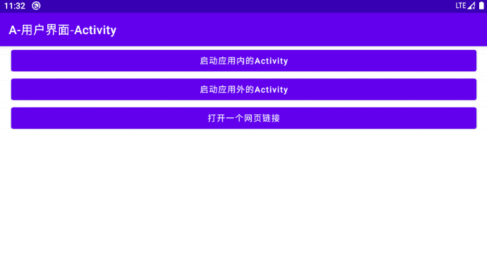
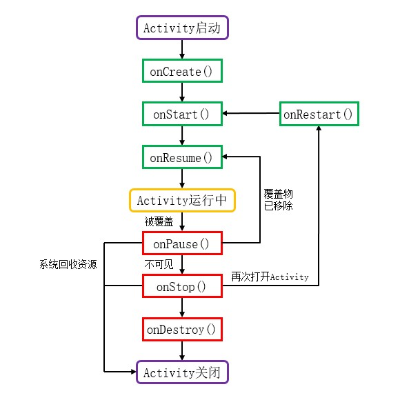
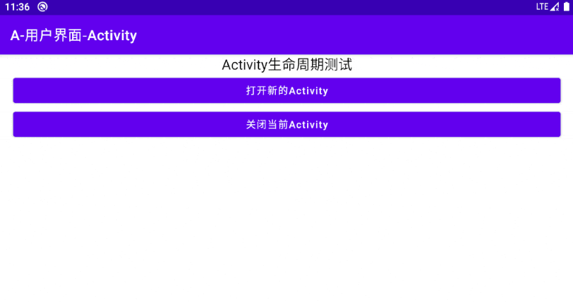
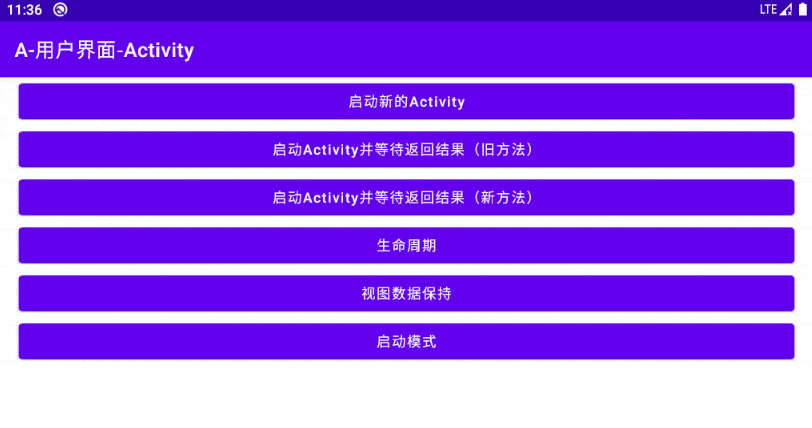
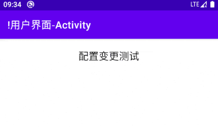
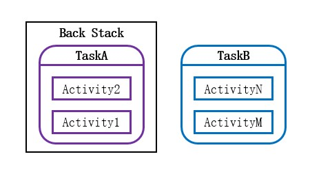
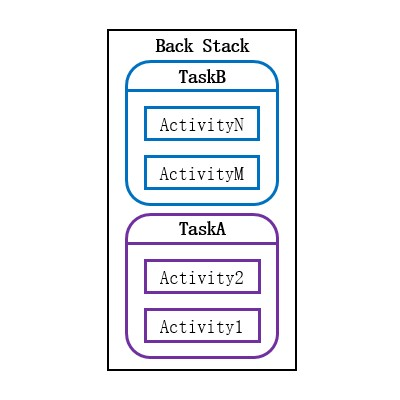
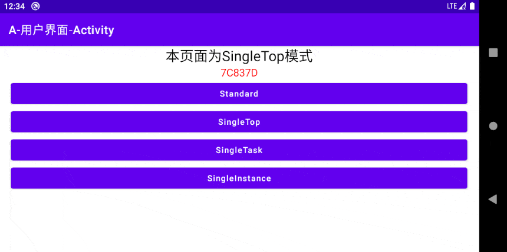
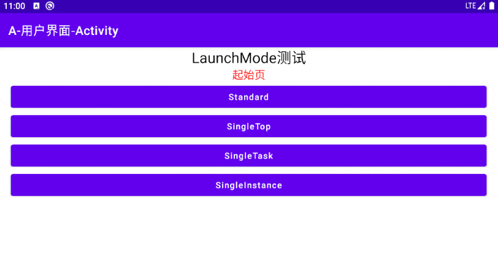
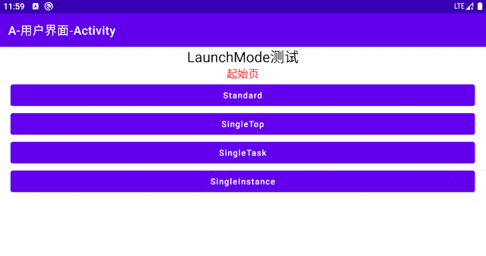

# 简介
Activity是Android应用程序的关键组件之一，用于承载各种控件以组成用户界面。Activity通常填满整个屏幕可视区域，但也可以作为窗口悬浮在其它Activity之上。

Activity作为一种系统组件，不仅能够被用户从Launcher图标启动，还可以通过Name、IntentFilter等方式被其它程序调用，例如我们可以从即时通信软件跳转至系统电话簿或电子邮件程序。一个应用程序可以不包含任何具有Launcher图标的Activity，此时它仅能够被外部组件调用，不能被用户主动启动。

# 基本应用
此处我们以Android Studio中新工程的模板代码为例，分析Activity的逻辑代码及配置项。

开发者自行创建的Activity类需要继承自SDK提供的Activity类，MainActivity继承自AppCompatActivity，此类属于 `androidx.appcompat.app` 包，"androidx"系列库是AOSP官方开发的扩展库，可以独立于SDK单独更新，获取较新的功能特性，因此官方更加推荐开发者使用这些库。

"MainActivity.java":

```java
public class MainActivity extends AppCompatActivity {

    @Override
    protected void onCreate(Bundle savedInstanceState) {
        super.onCreate(savedInstanceState);
        // 设置视图内容为布局文件"activity_main.xml"
        setContentView(R.layout.activity_main);
    }
}
```

上述内容也可以使用Kotlin语言编写：

"TestUIBase.kt":

```kotlin
class TestUIBase : AppCompatActivity() {

    override fun onCreate(savedInstanceState: Bundle?) {
        super.onCreate(savedInstanceState)
        // 设置视图内容为布局文件"activity_main.xml"
        setContentView(R.layout.activity_main)
    }
}
```

MainActivity重写了父类的 `onCreate()` 方法，这是Activity生命周期的第一个方法，负责初始化操作。

`setContentView(int layoutResID)` 方法的参数 `layoutResID` 是布局文件的ID，这里的参数值"R.layout.activity_main"对应 `res/layout/activity_main.xml` 文件，其中的内容为：

"activity_main.xml":

```xml
<?xml version="1.0" encoding="utf-8"?>
<androidx.constraintlayout.widget.ConstraintLayout xmlns:android="http://schemas.android.com/apk/res/android"
    xmlns:app="http://schemas.android.com/apk/res-auto"
    xmlns:tools="http://schemas.android.com/tools"
    android:layout_width="match_parent"
    android:layout_height="match_parent"
    tools:context=".MainActivity">

    <TextView
        android:layout_width="wrap_content"
        android:layout_height="wrap_content"
        android:text="Hello World!"
        app:layout_constraintBottom_toBottomOf="parent"
        app:layout_constraintLeft_toLeftOf="parent"
        app:layout_constraintRight_toRightOf="parent"
        app:layout_constraintTop_toTopOf="parent" />
</androidx.constraintlayout.widget.ConstraintLayout>
```

该布局文件描述了界面包含的控件以及控件的排布方式，根元素为“约束布局”，其中有一个文本框，四个约束条件使其在屏幕上居中。

当用户点击启动器中的图标后，MainActivity被启动，系统回调 `onCreate()` 方法，当执行至 `setContentView()` 方法时，系统解析布局文件，将控件按位置绘制到屏幕上，最终形成了我们所看到的用户界面。

一个应用程序通常包含多个Activity，每个Activity都要在Manifest文件中的 `<application>` 标签内进行注册。

"AndroidManifest.xml":

```xml
<manifest xmlns:android="http://schemas.android.com/apk/res/android"
    package="net.bi4vmr.study">

    <application ...>

        <activity android:name=".MainActivity">
            <intent-filter>
                <action android:name="android.intent.action.MAIN" />
                <category android:name="android.intent.category.LAUNCHER" />
            </intent-filter>
        </activity>

    </application>
</manifest>
```

上述代码片段是Android Studio生成的MainActivity的注册信息，其中IntentFilter配置表示该Activity需要在Launcher中生成图标，用户点击图标后程序启动并加载Activity。如果我们为多个Activity配置该IntentFilter，启动器内也会对应的生成多个图标。

我们必须为每个Activity声明 `android:name="<字符串>"` 属性，字符串为Activity的完全限定类名。 `<manifest>` 标签的"package"属性指定了默认的前缀，MainActivity位于 `net.bi4vmr.study` 包中，与默认前缀是一致的，此时"name"属性可以省略包名，用"."代替。如果某个Activity所在的包名与默认前缀不同，此时"name"属性必须填写完整的路径，例如我们有一个TestActivity位于 `com.demo.test` 包中，则"name"属性需要申明为"com.demo.test.TestActivity"。

# 启动新的Activity
## 简介
一个应用程序往往拥有多个Activity，例如主界面、设置界面、发行信息界面等，我们通常使用Intent完成Activity间的跳转功能。Intent译作“意图”，是Android系统的消息传递机制之一，我们通过Intent向系统表达某种意愿，例如希望开启某个Activity，系统会根据Intent的参数完成对应操作。

根据指向的目标，我们可以将Intent分为两种类型：

🔷 显式Intent

显式Intent明确指定了目标组件的名称，系统可以直接进行导航。

这种方式通常用于同一个应用程序内的界面跳转，或者我们明确知晓目标Activity名称及其所在包名的情况。

🔷 隐式Intent

隐式Intent并未指向目标组件的名称，而是指定Action等属性，系统会扫描设备上所有应用程序的Manifest文件，选择属性与Intent相匹配的组件并进行跳转。

当我们使用这种方式时，通常并不关心目标组件的具体实现，只关心其是否拥有我们所需的能力，例如打开网页或发送电子邮件。

## 使用显式Intent切换页面
### 打开应用内部的Activity
首先我们创建一个TestActivity作为跳转目标，并在Manifest文件中完成组件注册。该Activity拥有一个按钮，我们在它的 `onCreate()` 方法中注册点击事件，用户点击按钮后将Activity关闭。

"TestActivity.java":

```java
binding.btnClose.setOnClickListener(v -> {
    // 关闭当前Activity
    finish();
});
```

上述内容也可以使用Kotlin语言编写：

"TestActivity.kt":

```kotlin
binding.btnClose.setOnClickListener {
    // 关闭当前Activity
    finish()
}
```

然后我们在界面TestUIGotoPage上放置一个按钮，点击按钮后启动TestActivity。

"TestUIGotoPage.java":

```java
// 创建Intent实例
Intent intent = new Intent(getApplicationContext(), TestActivity.class);
// 启动TestActivity
startActivity(intent);
```

上述内容也可以使用Kotlin语言编写：

"TestUIGotoPage.kt":

```kotlin
// 创建Intent实例
Intent intent = new Intent(getApplicationContext(), TestActivity.class);
// 启动TestActivity
startActivity(intent);
```

Activity的 `startActivity()` 方法用于开启新的Activity，目标界面通过Intent指定。此处我们希望打开当前应用自身的组件TestActivity，构建Intent时传入了当前应用的Context与目标组件的Class。

此时运行示例程序，并点击TestUIGotoPage上的按钮，应用将会跳转至TestActivity；当我们点击TestActivity中的关闭按钮时，它的 `finish()` 方法被调用，TestActivity随即退出，回到了前一个Activity。

<div align="center">



</div>

### 打开应用外部的Activity
有时我们可能需要开启其他应用的某个Activity，例如：下载大文件之前，打开系统设置中的WIFI页面以便用户进行连接操作。

我们需要通过ComponentName指明目标组件的完全限定名称与其所在的软件包，然后通过Intent设置给操作系统完成跳转。

此处我们尝试从当前Activity跳转至AOSP原生组件“系统设置”主页。

对于当前应用外部的组件，我们需要使用ComponentName进行指明，它的构造方法第一参数为目标组件包名；第二参数为组件的完全限定名称。

"TestUIGotoPage.java":

```java
// 创建ComponentName实例，用于描述目标界面。
ComponentName cmpName = new ComponentName("com.android.settings", "com.android.settings.Settings");
// 创建Intent实例
Intent intent = new Intent();
intent.setComponent(cmpName);

// 外部组件可能并不存在，例如目标APP未安装、系统组件被ROM精简等情况，所以需要使用"try-catch"语句。
try {
    startActivity(intent);
} catch (ActivityNotFoundException e) {
    // 目标应用程序未安装、目标组件没有在其Manifest注册都会造成此错误。
    Log.w(TAG, "未找到目标组件！");
    Toast.makeText(this, "未找到目标组件！", Toast.LENGTH_SHORT).show();
    e.printStackTrace();
}
```

上述内容也可以使用Kotlin语言编写：

"TestUIGotoPage.kt":

```kotlin
// 创建ComponentName实例，用于描述目标界面。
val cmpName = ComponentName("com.android.settings", "com.android.settings.Settings")
// 创建Intent实例
val intent = Intent()
intent.component = cmpName

// 外部组件可能并不存在，例如目标APP未安装、系统组件被ROM精简等情况，所以需要使用"try-catch"语句。
try {
    // 启动默认浏览器
    startActivity(intent)
} catch (e: ActivityNotFoundException) {
    // 目标应用程序未安装、目标组件没有在其Manifest注册都会造成此错误。
    Log.w(TAG, "未找到目标组件！")
    Toast.makeText(this, "未找到目标组件！", Toast.LENGTH_SHORT).show()
    e.printStackTrace()
}
```

外部Activity组件可能并不存在，例如：目标APP未安装、系统组件被ROM剪裁等，此时 `startActivity()` 方法会导致ActivityNotFoundException异常，我们应当使用"try-catch"语句捕获并处理异常。

此时运行示例程序，并点击TestUIGotoPage上的按钮，如果设备上有AOSP的原生系统设置，就会跳转至设置应用的主页。

<div align="center">


</div>

## 使用隐式Intent切换页面
此处以当前应用程序跳转至指定网页为例，我们在布局文件中添加一个按钮，并在点击后打开指定的网页。

"TestUIGotoPage.java":

```java
// 构造URI，指定目标URL地址。
Uri uri = Uri.parse("https://cn.bing.com/");
// 创建Intent对象
Intent intent = new Intent(Intent.ACTION_VIEW, uri);

try {
    // 启动默认浏览器
    startActivity(intent);
} catch (ActivityNotFoundException e) {
    // 目标应用程序未安装、目标组件没有在其Manifest注册都会造成此错误。
    Log.w(TAG, "未找到目标组件！");
    Toast.makeText(this, "未找到目标组件", Toast.LENGTH_SHORT).show();
    e.printStackTrace();
}
```

上述内容也可以使用Kotlin语言编写：

"TestUIGotoPage.kt":

```kotlin
// 构造URI，指定目标URL地址。
val uri: Uri = Uri.parse("https://cn.bing.com/")
val intent = Intent(Intent.ACTION_VIEW, uri)

try {
    // 启动默认浏览器
    startActivity(intent)
} catch (e: ActivityNotFoundException) {
    // 目标应用程序未安装、目标组件没有在其Manifest注册都会造成此错误。
    Log.w(TAG, "未找到目标组件！")
    Toast.makeText(this, "未找到目标组件！", Toast.LENGTH_SHORT).show()
    e.printStackTrace()
}
```

此处Intent的构造函数具有两个参数，第一个参数是Action字符串，我们使用的常量 `ACTION_VIEW` 值是"android.intent.action.VIEW"，系统会根据第二个参数URI的类型，自动开启相应的程序。由于我们配置的URI是HTTPS协议，因此按钮被点击后系统会使用默认浏览器打开“必应”网站。

<div align="center">


</div>

## 传递初始参数
当我们打开新的Activity时，可能需要提供一些条件以供其完成初始化，例如：用户从订单列表进入订单详情页时，我们需要传递订单ID以便订单详情页加载对应的订单信息。

我们可以通过启动Activity的Intent对象传递初始参数，Intent内部拥有一个Bundle对象，能够以键值对的形式封装一系列数据。


"TestUIGotoPage.java":

```java
// 创建Intent实例
Intent intent = new Intent(getApplicationContext(), TestActivity.class);
// 传递初始化参数（可选功能）
intent.putExtra("PARAM_INIT", "测试文本");
// 启动TestActivity
startActivity(intent);
```

上述内容也可以使用Kotlin语言编写：

"TestUIGotoPage.kt":

```kotlin
// 创建Intent实例
val intent = Intent(applicationContext, TestActivity::class.java)
// 传递初始化参数（可选功能）
intent.putExtra("PARAM_INIT", "测试文本")
// 启动TestActivity
startActivity(intent)
```

我们可以使用Intent的"putExtra"系列方法逐个添加数据项，也可以使用 `putExtras()` 方法一次性添加所有已经封装进Bundle对象的数据项。

在TestActivity的 `onCreate()` 方法中，我们可以获取到启动该Activity的Intent，并调用"getExtra"系列方法取出参数。

"TestActivity.java":

```java
// 获取开启当前Activity的Intent实例
Intent intent = getIntent();
if (intent != null) {
    // 根据Key获取初始化参数的值
    String info = intent.getStringExtra("PARAM_INIT");
    if (info != null) {
        Log.i(TAG, "初始化参数内容：" + info);
    } else {
        Log.i(TAG, "初始化参数为空");
    }
}
```

上述内容也可以使用Kotlin语言编写：

"TestActivity.kt":

```kotlin
// 获取开启当前Activity的Intent实例
val intent: Intent? = intent
intent?.let {
    // 根据Key获取初始化参数的值
    val info: String? = it.getStringExtra("PARAM_INIT")
    if (info != null) {
        Log.i(TAG, "初始化参数内容：$info")
    } else {
        Log.i(TAG, "初始化参数为空")
    }
}
```

对于Intent实例与每个参数，我们都要注意空值判断，并设置适当的默认值，避免发生空指针异常。

## 获取回传信息
### 简介
用户从页面A开启一个表单类Activity后，可以填写一些信息；当表单页面被关闭时，我们需要回传信息给页面A，以便其执行后续操作。

### 旧API
早期SDK中提供的返回信息监听方法是Activity的 `onActivityResult()` 回调。我们启动新Activity时，需要使用 `startActivityForResult(Intent i, int requestCode)` 方法设置请求码，当新Activity关闭时，旧Activity的 `onActivityResult(int requestCode, int resultCode, Intent data)` 回调触发，参数分别为“请求码”、新Activity的“响应码”、数据内容。

此处我们创建两个Activity，TestUIGotoForResult作为基础界面，通过按钮启动ResultActivity并监听其返回的信息。

"TestUIGotoForResult.java":

```java
public class TestUIGotoForResult extends AppCompatActivity {

    private static final String TAG = "TestApp-" + TestUIGotoForResult.class.getSimpleName();

    private TestuiGotoforresultBinding binding;

    @Override
    protected void onCreate(Bundle savedInstanceState) {
        super.onCreate(savedInstanceState);
        binding = TestuiGotoforresultBinding.inflate(getLayoutInflater());
        setContentView(binding.getRoot());

        binding.btnStart.setOnClickListener(v -> {
            Intent intent = new Intent(getApplicationContext(), ResultActivity.class);
            // 启动页面，并设置请求码。
            startActivityForResult(intent, 100);
        });
    }

    @Override
    protected void onActivityResult(int requestCode, int resultCode, @Nullable Intent data) {
        super.onActivityResult(requestCode, resultCode, data);
        Log.i(TAG, "OnActivityResult. RequestCode:[" + requestCode + "] ResultCode:[" + resultCode + "]");
        binding.tvLog.append("OnActivityResult. RequestCode:[" + requestCode + "] ResultCode:[" + resultCode + "]\n");
        // 判断为何种请求
        if (requestCode == 100) {
            // 判断为何种结果
            if (resultCode == 999) {
                // 获取结果
                if (data != null) {
                    String s = data.getStringExtra("RESULT");
                    Log.i(TAG, "OnActivityResult. Data:[" + s + "]");
                    binding.tvLog.append("OnActivityResult. Data:[" + s + "]\n");
                }
            }
        }
    }
}
```

上述内容也可以使用Kotlin语言编写：

"TestUIGotoForResult.kt":

```kotlin
class TestUIGotoForResult : AppCompatActivity() {

    companion object {
        private val TAG: String = TestUIGotoForResult::class.java.simpleName
    }

    private val binding: TestuiGotoforresultBinding by lazy {
        TestuiGotoforresultBinding.inflate(layoutInflater)
    }

    override fun onCreate(savedInstanceState: Bundle?) {
        super.onCreate(savedInstanceState)
        setContentView(binding.root)

        binding.btnStart.setOnClickListener { 
            val intent = Intent(applicationContext, ResultActivity::class.java)
            // 启动页面，并设置请求码。
            startActivityForResult(intent, 100)
        }
    }

    override fun onActivityResult(requestCode: Int, resultCode: Int, data: Intent?) {
        super.onActivityResult(requestCode, resultCode, data)
        Log.i(TAG, "OnActivityResult. RequestCode:[$requestCode] ResultCode:[$resultCode]")
        binding.tvLog.append("OnActivityResult. RequestCode:[$requestCode] ResultCode:[$resultCode]\n")
        // 判断为何种请求
        if (requestCode == 100) {
            // 判断为何种结果
            if (resultCode == 999) {
                // 获取结果
                if (data != null) {
                    val s: String? = data.getStringExtra("RESULT")
                    Log.i(TAG, "OnActivityResult. Data:[$s]")
                    binding.tvLog.append("OnActivityResult. Data:[$s]\n")
                }
            }
        }
    }
}
```

在ResultActivity中，我们放置文本输入框和按钮，当按钮被点击后，将文本框内容作为返回信息并关闭Activity。

"ResultActivity.java":

```java
// 从EditText获取字符
String input = binding.etInfo.getText().toString();

// 封装返回数据
Intent intent = new Intent();
intent.putExtra("RESULT", input);

// 设置返回码和Intent实例
setResult(999, intent);
// 关闭当前Activity
finish();
```

上述内容也可以使用Kotlin语言编写：

"ResultActivity.kt":

```kotlin
// 从EditText获取字符
val input: String = binding.etInfo.text.toString()

// 封装返回数据
val intent = Intent()
intent.putExtra("RESULT", input)

// 设置返回码和Intent实例
setResult(999, intent)
// 关闭当前Activity
finish()
```

当我们跳转至ResultActivity并点击关闭按钮后，TestUIGotoForResult的 `onActivityResult()` 回调将被触发，请求码为"100"，响应码为"999"，Intent参数为ResultActivity回传的对象，可以用来获取我们需要的信息。

当Activity中存在Fragment时，各组件的 `onActivityResult()` 回调方法行为存在一些差异，我们需要注意。

<div align="center">

|                 序号                  | Fragment的 `onActivityResult()` |  Activity的 `onActivityResult()`   |
| :-----------------------------------: | :-----------------------------: | :--------------------------------: |
| Fragment的 `startActivityForResult()` |        正常接收回传信息         | 可以接收回调，但请求码与原先不同。 |
| Activity的 `startActivityForResult()` |        无法接收回传信息         |          正常接收回传信息          |

</div>

### 新API
前文所描述的方法耦合性较强，如果页面中存在多种跳转路径与结果类型， `onActivityResult()` 方法内部需要书写多层判断语句，不容易维护。

SDK中提供了ActivityResultContract API，用于更好的实现从其他页面获取回传信息的情况。该API可以为每条跳转路径各自注册回调事件，使得代码逻辑更为清晰。

我们创建一个新的测试Activity，并在其中注册ActivityResultLauncher，当界面上的按钮被按下时，调用ActivityResultLauncher实例的 `launch(intent)` 方法，开启新界面。

"TestUIGotoForResult2.java":

```java
public class TestUIGotoForResult2 extends AppCompatActivity {

    private static final String TAG = "TestApp-" + TestUIGotoForResult.class.getSimpleName();

    private TestuiGotoforresult2Binding binding;

    private final ActivityResultLauncher<Intent> activityLauncher = getActivityResultLauncher();

    @Override
    protected void onCreate(Bundle savedInstanceState) {
        super.onCreate(savedInstanceState);
        binding = TestuiGotoforresult2Binding.inflate(getLayoutInflater());
        setContentView(binding.getRoot());

        binding.btnStart.setOnClickListener(v -> {
            Intent intent = new Intent(this, ResultActivity.class);
            // 启动新的Activity
            activityLauncher.launch(intent);
        });
    }

    // 获取ActivityResultLauncher的方法
    private ActivityResultLauncher<Intent> getActivityResultLauncher() {
        return registerForActivityResult(new ActivityResultContracts.StartActivityForResult(),
                new ActivityResultCallback<ActivityResult>() {
                    @Override
                    public void onActivityResult(ActivityResult result) {
                        // 获取返回码
                        int resultCode = result.getResultCode();
                        Log.i(TAG, "OnActivityResult. ResultCode:[" + resultCode + "]");

                        // 获取结果
                        Intent data = result.getData();
                        if (data != null) {
                            String s = data.getStringExtra("RESULT");
                            Log.i(TAG, "OnActivityResult. Data:" + s);
                        }
                    }
                });
    }
}
```

上述内容也可以使用Kotlin语言编写：

"TestUIGotoForResult2.kt":

```kotlin
class TestUIGotoForResult2 : AppCompatActivity() {

    companion object {
        private val TAG: String = TestUIGotoForResult2::class.java.simpleName
    }

    private val binding: TestuiGotoforresult2Binding by lazy {
        TestuiGotoforresult2Binding.inflate(layoutInflater)
    }

    override fun onCreate(savedInstanceState: Bundle?) {
        super.onCreate(savedInstanceState)
        setContentView(binding.root)

        binding.btnStart.setOnClickListener { 
            val intent = Intent(this, ResultActivity::class.java)
            // 启动新的Activity
            getActivityResultLauncher().launch(intent)
        }
    }

    private fun getActivityResultLauncher(): ActivityResultLauncher<Intent> {
        return registerForActivityResult(ActivityResultContracts.StartActivityForResult()) {
            // 获取返回码
            val resultCode: Int = it.resultCode
            Log.i(TAG, "OnActivityResult. ResultCode:[$resultCode]")
            binding.tvLog.append("OnActivityResult. ResultCode:[$resultCode]\n")

            // 获取结果
            val data: Intent? = it.data
            if (data != null) {
                val s: String? = data.getStringExtra("RESULT")
                Log.i(TAG, "OnActivityResult. Data:[$s]")
                binding.tvLog.append("OnActivityResult. Data:[$s]\n")
            }
        }
    }
}
```

`registerForActivityResult()` 方法用于注册事件回调，第一参数为协定类型，它支持很多不同的功能，例如选择图片等，当我们需要获取 `onActivityResult()` 这种类型的回传信息时，只需传入系统内置的 `ActivityResultContracts.StartActivityForResult()` 实例即可；第二参数为结果的回调监听器，其回调方法各参数的含义与 `onActivityResult()` 类似，由于该回调与跳转动作一一对应，故不再需要请求码，我们只关心跳转目标回传的响应码即可。

## 启动链路
应用程序如果拥有公开的Activity，它们就可以被多种外部组件启动。我们有时需要获取启动当前Activity的组件信息，用于显示返回按钮帮助用户返回原应用程序；或者通过分析启动链路解决Activity被意外启动等问题。

我们可以使用Activity的 `URI getReferrer()` 方法获取相关信息，它的返回值表明了启动者的身份，下文列表列出了几种常见的情况：

- 当我们使用ADB命令 `am start` 启动Activity时，返回值为 `null`。
- 当我们点击Launcher图标启动Activity时，返回值为Launcher的URL，例如： `android-app://com.meizu.flyme.launcher` 。
- 当程序A通过 `startActivity()` 方法启动程序B的Activity时，返回值为程序A的URL，格式为： `android-app://<程序A的包名>` 。

# 生命周期
## 简介
当用户进入、挂起或退出应用程序时，Activity会在不同的生命周期之间转换，并触发相应的回调方法。我们可以在生命周期回调方法中设置各种状态下的行为，例如：当视频播放界面被挂起时，需要暂停视频播放；当用户回到该界面时，可以继续播放视频。在合适的生命周期内执行正确的操作，将提升应用程序的性能与稳定性。

Android系统使用返回栈(Back Stack)来管理Activity，新开启的Activity将会覆盖在旧的Activity上，当用户按下返回按钮或Activity自行调用 `finish()` 方法时，栈顶位置的Activity将会出栈，重新显示上一个Activity，此过程中各Activity的生命周期也会发生改变。

## 状态机
Activity共有四种状态机。

🔷 `Running`

Activity位于Task栈顶时的状态，此时界面在前台面向用户服务，通常资源不会被系统回收。

🔷 `Paused`

当Activity被其它非全屏UI组件覆盖时的状态，此时部分界面仍然可见，系统仅在资源非常紧张时才可能回收其资源。

🔷 `Stopped`

当Activity被覆盖且完全不可见时的状态，系统会为其保持视图状态，但资源不足时有较大概率被回收。

🔷 `Destroyed`

当Activity从Task出栈时就会进入销毁状态，意味着此组件不再被用户需要，系统会优先回收这部分资源。

## 回调方法
Activity类提供了七个生命周期回调方法，它们之间的关系如下文图片所示：

<div align="center">



</div>

Activity的生命周期回调方法描述详见下文内容：

🔶 `onCreate()`

系统在创建Activity实例时触发此回调方法。

该方法在Activity的整个生命周期中只会执行一次，我们应当在此完成基本的初始化逻辑，例如：加载界面布局、绑定视图和控件等。

🔶 `onStart()`

当Activity变为可见状态时，将会触发此方法。

该方法的执行时间非常短，我们不应该在此进行耗时操作。

🔶 `onResume()`

Activity进入完全可见状态时，将会触发此方法。

若Activity被其他组件覆盖，当它再次回到前台时此方法就会触发，此处可以用来执行更新页面显示内容的操作。

🔶 `onPause()`

Activity被其他组件覆盖而进入"Paused"状态时，将会触发此方法。

我们可以在此处释放部分系统资源，例如暂停动画等。

对于支持多窗口模式的应用程序，同时只有一个界面能够获得焦点，其它界面都处于"Paused"状态但仍然可见，此时就不应该随意释放资源了。

🔶 `onStop()`

Activity完全不可见时将会调用此方法，此处可以安全释放系统资源。

🔶 `onDestroy()`

Activity被销毁前会调用此方法，我们应当在此处释放所有资源。

🔶 `onRestart()`

Activity由不可见状态回到可见状态时，会先调用该方法再调用 `onStart()` 方法。

<br />

我们在创建Activity与Service等组件时，需要重写部分生命周期方法，并添加自己的业务逻辑。Android Studio自动生成的生命周期方法内通常都有对父类方法的 `super()` 调用，我们不能随意删除这些调用语句，否则会导致程序行为异常甚至崩溃。对于Activity和Service，其生命周期方法中的 `super()` 调用都不可删除。对于其他组件，我们可以查看其父类的源码，若父类的方法体为空，此时可以删除子类的 `super()` 调用；若父类的方法体不为空，则通常需要保留子类的 `super()` 调用，否则可能导致不可预料的异常。

对于 `onCreate()` 、 `onStart()` 和 `onResume()` 等回调方法，我们的业务逻辑应当在 `super()` 调用之后执行；而在 `onPause()` 、 `onStop()` 和 `onDestroy()` 等回调方法中，如果我们引用了与父类相关的某些变量，业务逻辑应当在 `super()` 调用之前执行，否则业务逻辑执行时可能因关联变量被提前销毁而出现错误。

## 典型场景
### 场景一
用户开启一个Activity，正常使用一段时间后，将其关闭。

<div align="center">



</div>

此过程中的生命周期状态迁移如下文代码块中的日志信息所示：

```text
# Activity启动
17:08:11.998 17120 17120 I TestUILifeCycle: OnCreate.
17:08:12.020 17120 17120 I TestUILifeCycle: OnStart.
17:08:12.022 17120 17120 I TestUILifeCycle: OnResume.
# "OnResume"方法执行完毕后，Activity可以与用户正常交互。

# 用户按下返回键或Activity内部调用"finish()"方法
17:08:14.539 17120 17120 I TestUILifeCycle: OnPause.
17:08:15.084 17120 17120 I TestUILifeCycle: OnStop.
17:08:15.085 17120 17120 I TestUILifeCycle: OnDestroy.
# "OnDestroy"方法执行完毕后，资源回收完成。
```

### 场景二
用户开启一个新的Activity将旧的Activity覆盖，操作完毕后关闭新的Activity，旧的Activity重新显示。

<div align="center">



</div>

用户按下Home键或切换至其他任务，一段时间后再回到此Activity，这种场景生命周期的变化与上述场景是一致的。

此过程中的生命周期状态迁移如下文代码块中的日志信息所示：

```text
# Activity启动
17:09:33.916 17120 17120 I TestUILifeCycle: OnCreate.
17:09:33.938 17120 17120 I TestUILifeCycle: OnStart.
17:09:33.939 17120 17120 I TestUILifeCycle: OnResume.

# 用户开启新的Activity将旧的Activity覆盖，或按下Home键退出当前Activity。
17:09:37.739 17120 17120 I TestUILifeCycle: OnPause.
17:09:38.337 17120 17120 I TestUILifeCycle: OnStop.

# 关闭新的Activity，或者从其他应用程序回到当前Activity。
17:09:40.595 17120 17120 I TestUILifeCycle: OnRestart.
17:09:40.595 17120 17120 I TestUILifeCycle: OnStart.
17:09:40.596 17120 17120 I TestUILifeCycle: OnResume.
```

### 场景三
其他应用程序的弹窗或非全屏Activity将当前Activity覆盖，使其不完全可见。

<div align="center">


</div>

此处我们以Flyme系统的Aicy识屏功能为例，长按屏幕后页面底部将弹出窗口，将Activity不完全遮盖；然后点击任意区域关闭弹窗，使Activity恢复完全可见。

此过程中的生命周期状态迁移如下文代码块中的日志信息所示：

```text
# 识屏窗口显示，Activity的"onPause()"方法被调用。
17:10:02.431 17120 17120 I TestUILifeCycle: OnPause.

# 识屏窗口关闭，Activity的"onResume()"方法被调用。
17:10:04.801 17120 17120 I TestUILifeCycle: OnResume.
```

# 视图数据保持
如果用户在ActivityA中输入了很多信息，又打开了ActivityB，此时系统资源不足，ActivityA实例被回收；当用户关闭ActivityB之后，系统将会重新创建ActivityA，但之前输入的数据就丢失了。

为了避免上文所述的情况，Activity提供了视图数据保持与恢复机制，如果Activity被意外关闭，我们可以将视图状态临时保存至系统中，等到重建视图时再进行读取。

> 🚩 提示
>
> 部分控件已经实现了数据保持功能，不需要我们再手动进行操作，只需要配置控件ID即可，例如：EditText、CheckBox等。

该机制仅适用于Activity被动关闭时，典型的场景包括内存不足、用户按下Home键、横竖屏切换、分屏切换，它并不是一种持久化存储策略，因此当Activity被用户主动关闭时不会生效。

> 🚩 提示
>
> 内存不足的情况可以通过开发者选项中的“不保留活动”功能进行模拟，当我们开启该选项时，一旦Activity进入后台，就会立刻被回收。

对于需要实现数据保持的Activity，我们应当重写 `onSaveInstanceState()` 方法，这是系统提供的回调方法，系统在回收Activity时将会触发该方法，我们可以将数据以键值对的方式暂存在Bundle对象中。当Activity重新创建时，我们可以在 `onCreate()` 或 `onRestoreInstanceState()` 方法中将数据读取出来。

`onCreate()` 方法是Activity的生命周期方法，它的参数Bundle可能为空，在此处读取数据前需要进行空值判断；而 `onRestoreInstanceState()` 方法仅在有数据需要恢复时才会触发，在此处读取数据不必进行空值判断。

此处我们在Activity上放置一个ToggleButton，尝试在界面重建时保存ToggleButton的状态，并在界面重建时进行恢复。

首先我们在Activity中重写 `onSaveInstanceState()` 与 `onRestoreInstanceState()` 方法，分别实现存入、取出数据的逻辑。Activity拥有两个同名的 `onSaveInstanceState()` 回调方法，此处我们选择拥有一个参数的方法。

"TestUIViewState.java":

```java
@Override
protected void onSaveInstanceState(@NonNull Bundle outState) {
    super.onSaveInstanceState(outState);
    Log.i(TAG, "OnSaveInstanceState.");

    // 从文本框中读取数据并保存至系统提供的Bundle对象
    boolean isChecked = binding.btnTest.isChecked();
    outState.putBoolean("STATE", isChecked);
    Log.i(TAG, "已写入数据：" + isChecked);
}

@Override
protected void onRestoreInstanceState(@NonNull Bundle savedInstanceState) {
    super.onRestoreInstanceState(savedInstanceState);
    Log.i(TAG, "OnRestoreInstanceState.");

    // 从Bundle对象读取先前保存的数据
    boolean isChecked = savedInstanceState.getBoolean("STATE");
    Log.i(TAG, "已读取数据：" + isChecked);
    // 重新设置给控件
    binding.btnTest.setChecked(isChecked);
}
```

上述内容也可以使用Kotlin语言编写：

"TestUIViewState.kt":

```kotlin
override fun onSaveInstanceState(outState: Bundle) {
    super.onSaveInstanceState(outState)
    Log.i(TAG, "OnSaveInstanceState.")

    // 从控件中读取数据并保存至系统提供的Bundle对象
    val isChecked: Boolean = binding.btnTest.isChecked
    outState.putBoolean("STATE", isChecked)
    Log.i(TAG, "已写入数据：$isChecked")
}

override fun onRestoreInstanceState(savedInstanceState: Bundle) {
    super.onRestoreInstanceState(savedInstanceState)
    Log.i(TAG, "OnRestoreInstanceState.")

    // 从Bundle对象读取先前保存的数据
    val isChecked: Boolean = savedInstanceState.getBoolean("STATE")
    Log.i(TAG, "已读取数据：$isChecked")
    // 重新设置给控件
    binding.btnTest.isChecked = isChecked
}
```

此时运行示例程序，并旋转屏幕方向，查看按钮状态与控制台输出信息：

```text
21:29:01.427 26777 26777 I TestUIViewState: OnPause.
21:29:01.429 26777 26777 I TestUIViewState: OnSaveInstanceState.
21:29:01.429 26777 26777 I TestUIViewState: 已写入数据：true
21:29:01.430 26777 26777 I TestUIViewState: OnStop.
21:29:01.431 26777 26777 I TestUIViewState: OnDestroy.
21:29:01.450 26777 26777 I TestUIViewState: OnCreate.
21:29:01.478 26777 26777 I TestUIViewState: OnStart.
21:29:01.480 26777 26777 I TestUIViewState: OnRestoreInstanceState.
21:29:01.480 26777 26777 I TestUIViewState: 已读取数据：true
21:29:01.482 26777 26777 I TestUIViewState: OnResume.
```

根据上述输出内容可知：

当手机屏幕方向发生改变时，Activity将会重建，ToggleButton的状态得以保持。存入数据的方法 `onSaveInstanceState()` 会在 `onPause()` 与 `onStop()` 之间被调用，而读出数据的方法 `OnRestoreInstanceState()` 会在 `onStart()` 与 `onResume()` 之间被调用。

# 处理配置变更
## 配置变更事件
当设备的环境发生变更时，系统将会销毁旧Activity，并使用新的配置重建Activity，以适应新的环境。

设备环境的配置项使用Configuration类表示，我们可以通过Context实例进行获取：

```java
Configuration config = Context.getResources().getConfiguration();
```

环境改变事件包括屏幕方向旋转、分辨率改变、系统语言改变、深色主题开启与关闭等，下文内容将对常用的事件进行介绍。

🔷 `orientation`

屏幕方向改变事件。

移动设备通常拥有重力传感器，当屏幕由竖屏转为横屏，或横屏转为竖屏时，将会触发此事件。

我们可以通过Configuration实例的同名属性获取屏幕方向。

🔷 `screenSize`

屏幕比例改变事件。

此事件表示屏幕的纵横比例发生了变化，通常与 `orientation` 事件同时触发。

我们可以通过Configuration实例的 `screenWidthDp` 与 `screenHeightDp` 属性获取屏幕的宽高数值。

🔷 `smallestScreenSize`

屏幕尺寸改变事件。

此事件表示屏幕的尺寸发生了变化，通常由分屏动作触发。

我们可以通过Configuration实例的 `smallestWidth` 属性获取最小边长，并改变列表的列数等，适配屏幕尺寸。

🔷 `screenLayout`

屏幕布局改变事件。

此事件通常与 `smallestScreenSize` 事件同时触发。

🔷 `uiMode`

界面模式改变事件。

该事件包括多个子状态，例如：桌面模式、车载模式、浅色主题、深色主题等。

🔷 `locale`

区域变更事件。

当用户切换了区域或语言时，该事件将会触发。

我们可以通过Configuration实例的 `getLocales()` 方法获取语言列表，并设置日期的显示格式，适配区域习惯。

🔷 `layoutDirection`

布局方向变更事件。

当布局方向在“从左至右(LTR)”与“从右至左(RTL)”之间切换时，将会触发此事件。

我们可以通过Configuration实例的 `getLayoutDirection()` 方法获取布局方向。

## 系统默认行为
此处以屏幕旋转事件为例，我们在横屏模式打开测试Activity，并将设备翻转至竖屏模式，然后观察Activity的生命周期变化，该示例可参考前文章节： [🧭 视图数据保持](#视图数据保持) 。

根据控制台输出内容我们可以得知，配置变更导致的Activity重建，将会调用视图数据保持方法，我们可以实现表单数据的存取，防止屏幕旋转后表单被清空。

## 自行处理事件
对于某些事件，我们也可以使用逻辑代码自行处理变更，而不使用系统的自动重建机制。例如：当主题发生改变时，我们可以手动调整控件的颜色，简化存取表单数据的代码以及禁止界面跳转，提升用户体验。

此处以浅色、深色模式为例，我们首先在Activity的Manifest配置项中添加 `android:configChanges="uiMode"` 属性，关闭系统的自动重建行为。

"AndroidManifest.xml":

```xml
<activity
    android:name=".config.TestUIConfig"
    android:configChanges="uiMode"
    android:exported="false" />
```

该属性的值可以有多个，以竖线("|")进行分隔，在此列表中的事件发生时，系统不再执行自动重建，而是触发Activity的 `void onConfigurationChanged(Configuration newConfig)` 回调方法，我们可以在此执行自己的业务逻辑。

我们在深色模式中将页面背景设为黑色、文本设为白色；浅色模式则相反。

"TestUIConfig.java":

```java
@Override
public void onConfigurationChanged(@NonNull Configuration newConfig) {
    super.onConfigurationChanged(newConfig);
    Log.i(TAG, "OnConfigurationChanged.");

    // 从标志位中分离出主题代码
    switch (newConfig.uiMode & Configuration.UI_MODE_NIGHT_MASK) {
        /* 浅色模式（默认） */
        case Configuration.UI_MODE_NIGHT_NO:
            Log.i(TAG, "OnConfigurationChanged. NightMode OFF.");
            binding.tvInfo.setTextColor(Color.BLACK);
            binding.root.setBackgroundColor(Color.WHITE);
            break;
        /* 深色模式 */
        case Configuration.UI_MODE_NIGHT_YES:
            Log.i(TAG, "OnConfigurationChanged. NightMode ON.");
            binding.tvInfo.setTextColor(Color.WHITE);
            binding.root.setBackgroundColor(Color.BLACK);
            break;
    }
}
```

上述内容也可以使用Kotlin语言编写：

"TestUIConfig.kt":

```kotlin
override fun onConfigurationChanged(newConfig: Configuration) {
    super.onConfigurationChanged(newConfig)
    Log.i(TAG, "OnConfigurationChanged.")

    // 从标志位中分离出主题代码
    when (newConfig.uiMode and Configuration.UI_MODE_NIGHT_MASK) {
        /* 浅色模式（默认） */
        Configuration.UI_MODE_NIGHT_NO -> {
            Log.i(TAG, "OnConfigurationChanged. NightMode OFF.")
            binding.tvInfo.setTextColor(Color.BLACK)
            binding.root.setBackgroundColor(Color.WHITE)
        }
        /* 深色模式 */
        Configuration.UI_MODE_NIGHT_YES -> {
            Log.i(TAG, "OnConfigurationChanged. NightMode ON.")
            binding.tvInfo.setTextColor(Color.WHITE)
            binding.root.setBackgroundColor(Color.BLACK)
        }
    }
}
```

此时运行示例程序，并切换主题，查看界面变化与控制台输出信息：

<div align="center">



</div>

```text
17:52:17.812 11960 11960 I TestUIConfig: OnConfigurationChanged.
17:52:17.812 11960 11960 I TestUIConfig: OnConfigurationChanged. NightMode ON.
17:52:17.812 11960 11960 I TestUIConfig: OnConfigurationChanged.
17:52:17.812 11960 11960 I TestUIConfig: OnConfigurationChanged. NightMode ON.
```

根据上述输出内容可知：

当主题改变时， `onConfigurationChanged()` 回调方法触发了，Activity没有重建。

除了上述示例中的场景，我们还可以在Application类中重写 `onConfigurationChanged()` 回调方法，统一处理所有配置变更事件。

# 任务管理
## 简介
我们可以点击短信APP内的邮箱链接转到邮件APP的撰写邮件Activity，此时观察最近任务视图，会发现只有短信APP的缩略图，并没有邮件APP，而且撰写邮件Activity显示在短信APP中。

> 🚩 提示
>
> 部分平台中配套的短信与邮件APP行为可能与上文不同，此处仅作为示例说明。

正如“最近任务”视图的名称所示，其中的内容既不是Activity，也不是APP，而是“任务(Task)”。系统通过Task将一系列有关联的Activity组合起来，实现合理的界面导航逻辑，以此提升用户体验。

## 术语
### Task
任务(Task)是一种栈结构，因此我们也将其称为“任务栈”，Activity实例被创建后将与某个Task关联并入栈。默认情况下，应用内启动的新Activity实例将覆盖在旧实例之上，当用户按下返回键时，将按先进后出的顺序逐个显示历史界面。栈内的Activity不能重新排序，但Activity实例可以自行调用 `finish()` 方法销毁自身，此时它就被移除了，返回时不会再显示这种界面。

当前正在显示的Task被称为前台Task，当我们按下Home键时，该Task就会转为后台Task，系统资源不足时会优先回收后台Task中的Activity。

当我们按下“最近任务”键时，Launcher或SystemUI将会显示一些近期任务的缩略图，以供用户选择需要继续操作的任务。在没有该按键的设备上，我们可以使用ADB发送指令模拟按键：

```text
# 以下两种方式选择一个即可

# 使用键名
adb shell input keyevent APP_SWITCH

# 使用键值
adb shell input keyevent 187
```

Manifest文件中的启动模式(LaunchMode)属性和代码中的"Intent.FLAG_ACTIVITY"系列标志位都可以控制Activity与Task的行为，但我们在代码中配置的Intent标志位具有更高的优先级，两者发生冲突时以Intent标志位为准。

### TaskAffinity
TaskAffinity译作“任务相关性”，用于对一系列有关联的Activity实例进行归类。对于应用内两个关联较小的Activity，我们应当配置不同的TaskAffinity进行区分，例如支付宝和支付宝小程序。

每个Activity都有TaskAffinity属性，Task首次创建时，Affinity值将被设为第一个入栈的Activity的TaskAffinity属性，后续系统创建其他Activity实例时，会将其放入Affinity值与TaskAffinity属性相匹配的Task中。

Activity的TaskAffinity属性默认值取自应用程序的包名，如果我们在 `<application>` 标签上配置 `android:taskAffinity="<字符串>"` 属性，则默认值变为此处配置的字符串；如果我们需要为某个Activity配置不同于默认值的TaskAffinity，也可以在 `<activity>` 标签上添加该属性。

TaskAffinity属性的值至少要含有一个点号(".")，否则APK编译时将会出现错误。

当Activity启动时，TaskAffinity属性不一定生效，这取决于Activity的启动模式与Intent标志位，详情请参考后文。

### 回退栈
回退栈用于记录用户的系列操作流程，其中可以包含多个Task，当用户点击返回键时，就会按照一定顺序回退至前级页面并在需要时切换Task。

当前系统中有两个Task正在运行，TaskB的ActivityN具有SingleTask属性，TaskA正在前台，用户依次开启Activity1与Activity2，此时回退栈的内容与TaskA栈是相同的。

<div align="center">



</div>

我们此时从TaskA的Activity2启动ActivityN，由于实例已经存在，系统将TaskB移动至前台，此时回退栈的内容为：

<div align="center">



</div>

如果我们连续按下返回键，Activity的出栈顺序为"ActivityN -> ActivityM -> Activity2 -> Activity1"。

当用户按下Home键或打开最近任务视图时，Task之间的关联就会被解除。用户重新选择Task之后，回退栈保持与此Task一致，如果连续按下返回键，当前Task清空后就会回到启动器，不会再回到之前的Task。

## 常用API
### ActivityManager
ActivityManager是系统提供的工具，可以获取Task、进程、内存等信息，此处我们只使用Task相关的功能。

我们可以在Activity的 `onCreate()` 阶段使用Context的 `getSystemService()` 方法获取ActivityManager实例，以便后续进行使用。

```java
// 获取ActivityManager实例
ActivityManager am = getSystemService(ActivityManager.class);
```

🔷 获取任务列表

我们可以使用ActivityManager的 `getRunningTasks(int num)` 方法获取最近任务信息，参数是希望系统返回的最大任务数量，返回值是 `List<ActivityManager.RunningTaskInfo>` ，RunningTaskInfo即Task状态对象，常用的属性见下文：

- "id"即Task的ID，系统新创建的TaskID值保持线性增长。
- "taskId"也是Task的ID，是Android 10新增的属性，此版本开始我们应当使用该属性，而不是"id"属性。
- "isRunning"是布尔值，是Android 10新增的属性，表示Task是否正在运行。“运行”是指Task是否被回收，而不是前台与后台。
- "topActivity"是ComponentName形式的对象，描述栈顶的Activity信息。

`getRunningTasks(int num)` 方法自从Android 5.0开始被标记为过时的方法，因为应用程序直接获取所有Task信息可能导致用户隐私泄漏。目前系统应用仍然可以使用该方法获取全部Task，但是第三方应用只能获取自身以及Launcher等少数程序的Task。

如果第三方应用仅需管理自身的Task信息，可以使用 `getAppTasks()` 方法进行操作；如果第三方应用需要管理全局的Task信息，则应当使用UsageStatsManager，此功能需要用户授权才能使用。

<!-- TODO 后续需要添加链接：UsageStatsManager  文档暂时没有编写。 -->

🔷 将后台任务移动至前台

ActivityManager的 `moveTaskToFront(int taskID, int flags)` 方法可以把后台Task移动到前台，参数"taskID"即目标Task的ID；参数"flags"是标志位，每个值的含义见下文：

🔺 `MOVE_TASK_WITH_HOME`

设置此标志位时，将使用目标Task替换回退栈内容，用户连续按下返回键将直接回到启动器；不设置此标志位时，目标Task将被移至回退栈栈顶，用户连续按下返回键可以跳转回旧的Task。

🔺 `MOVE_TASK_NO_USER_ACTION`

设置此标志位时，当前界面的 `onUserLeaveHint()` 回调不会触发；不设置此标志位时，当前界面的 `onUserLeaveHint()` 回调正常触发。

## 启动模式属性
### 简介
启动模式属性用于控制Activity实例的复用方式，以及Task的创建与显示行为。

我们可以在Manifest文件中为 `<activity>` 标签添加属性 `android:launchMode="<启动模式>"` 进行配置。

```xml
<application ...>

    <activity
        android:name=".TestActivity"
        android:exported="true"
        android:launchMode="standard" />
</application>
```

我们在示例应用中创建TestUILaunchMode作为起点，然后创建StandardActivity、SingleTopActivity、SingleTaskActivity和SingleInstanceActivity分别对应不同的启动模式，并且通过按钮实现页面间的相互启动，以便测试每种启动模式对应的行为。

### Standard
Standard是默认的启动模式，没有复用机制，且不关心TaskAffinity属性。

每当这种Activity被启动时，系统就会创建一个新的实例，并压入发出启动指令的Task；每当用户按下返回键时，当前Task栈顶的Activity就会弹出销毁，并重新显示前一个Activity。

我们从示例应用的起点页面TestUILaunchMode启动一次StandardActivity，然后再接续启动两次StandardActivity。

<div align="center">


</div>

我们可以观察到每次点击启动按钮，系统播放的动画效果都是Activity入场。

此时我们使用 `dumpsys` 命令查看Task信息：

```text
# 已经精简部分非关键信息
ACTIVITY MANAGER ACTIVITIES (dumpsys activity activities)
Display #0 (activities from top to bottom):
  Stack #4: type=standard mode=fullscreen
    Task id #10
    Running activities (most recent first):
      TaskRecord{df5f0a2 #10 A=net.bi4vmr.study U=0 StackId=4 sz=5}
        Run #4: ActivityRecord{612bbc u0 net.bi4vmr/.launchmode.StandardActivity t10}
        Run #3: ActivityRecord{4d6c78c u0 net.bi4vmr/.launchmode.StandardActivity t10}
        Run #2: ActivityRecord{db8e9cf u0 net.bi4vmr/.launchmode.StandardActivity t10}
        Run #1: ActivityRecord{5f97c59 u0 net.bi4vmr/.launchmode.TestUILaunchMode t10}
        Run #0: ActivityRecord{8f512c3 u0 net.bi4vmr/.MainActivity t10}

    mResumedActivity: ActivityRecord{612bbc u0 net.bi4vmr.study/.launchmode.StandardActivity t10}
    mLastPausedActivity: ActivityRecord{4d6c78c u0 net.bi4vmr.study/.launchmode.StandardActivity t10}
```

从Dump信息可知，TestUILaunchMode之上叠加了三个StandardActivity实例，从底部至顶部分别是"TestUILaunchMode -> StandardActivity(F8F11E) -> StandardActivity(E4651F) -> StandardActivity(46BF1E)"，这说明每次启动StandardActivity系统都创建了不同的实例。

接着我们点击两次返回键，观察页面的切换动画：

<div align="center">


</div>

此时使用 `dumpsys` 命令查看Task信息：

```text
# 已经精简部分非关键信息
ACTIVITY MANAGER ACTIVITIES (dumpsys activity activities)
Display #0 (activities from top to bottom):
  Stack #4: type=standard mode=fullscreen
    Task id #10
    Running activities (most recent first):
      TaskRecord{df5f0a2 #10 A=net.bi4vmr.study U=0 StackId=4 sz=3}
        Run #2: ActivityRecord{db8e9cf u0 net.bi4vmr.study/.launchmode.StandardActivity t10}
        Run #1: ActivityRecord{5f97c59 u0 net.bi4vmr.study/.launchmode.TestUILaunchMode t10}
        Run #0: ActivityRecord{8f512c3 u0 net.bi4vmr.study/.MainActivity t10}

    mResumedActivity: ActivityRecord{db8e9cf u0 net.bi4vmr.study/.launchmode.StandardActivity t10}
    mLastPausedActivity: ActivityRecord{4d6c78c u0 net.bi4vmr.study/.launchmode.StandardActivity t-1 f}
```

从Dump信息可知，第一次按返回键使StandardActivity(46BF1E)出栈，第二次按返回键使StandardActivity(E4651F)出栈，目前正在显示的Activity("mResumedActivity")是StandardActivity(F8F11E)。

### SingleTop
SingleTop是“栈顶复用”模式，不关心TaskAffinity属性。

当这种Activity被启动时，如果发出启动指令的Task栈顶已有该Activity实例，则系统不会再创建新实例，而是调用现有实例的 `onNewIntent()` 方法更新界面。如果发出启动指令的Task栈顶不是该Activity实例，则创建一个新的实例并压入Task。

我们在SingleTopActivity中重写 `onNewIntent()` 方法，在此处打印日志以便测试刷新界面的场景。

```java
protected void onNewIntent(Intent intent) {
    String cmpName = SingleTopActivity.class.getSimpleName();
    Log.i(TAG, cmpName + " OnNewIntent.");
}
```

我们从示例应用的起点页面TestUILaunchMode启动一次SingleTopActivity，然后再接续启动两次SingleTopActivity。

<div align="center">


</div>

我们可以观察到首次点击启动按钮时，系统播放了Activity入场动画，而后续点击启动按钮则没有任何页面切换动画效果。这说明第一次启动SingleTopActivity时生成了新的实例，而后续两次启动动作并没有生成新的实例，因为启动时刻Task栈顶已有SingleTopActivity实例存在了，可以进行复用。

通过观察控制台日志，我们可以发现第二、三次启动SingleTopActivity时，它的 `onNewIntent()` 方法确实触发了两次，而不是通过 `onCreate()` 方法重建新实例。

```text
14:43:30.974 7191 7191 I TestUILaunchMode: SingleTopActivity OnNewIntent.
14:43:32.177 7191 7191 I TestUILaunchMode: SingleTopActivity OnNewIntent.
```

此时使用 `dumpsys` 命令查看Task信息：

```text
# 已经精简部分非关键信息
ACTIVITY MANAGER ACTIVITIES (dumpsys activity activities)
Display #0 (activities from top to bottom):
  Stack #4: type=standard mode=fullscreen
    Task id #10
    Running activities (most recent first):
      TaskRecord{4a85c74 #10 A=net.bi4vmr.study U=0 StackId=4 sz=3}
        Run #2: ActivityRecord{69c1b3 u0 net.bi4vmr.study/.launchmode.SingleTopActivity t10}
        Run #1: ActivityRecord{4f4ed4c u0 net.bi4vmr.study/.launchmode.TestUILaunchMode t10}
        Run #0: ActivityRecord{854b390 u0 net.bi4vmr.study/.MainActivity t10}

    mResumedActivity: ActivityRecord{69c1b3 u0 net.bi4vmr.study/.launchmode.SingleTopActivity t10}
```

从Dump信息可知，操作后Task栈里仅有栈顶的一个SingleTopActivity实例，后两次启动操作都没有生成新的实例，这与前文动效与日志分析是相符的。

接下来，我们重新启动示例应用，模拟一下不能复用Activity的情况。

我们从示例应用的起点页面TestUILaunchMode启动一次SingleTopActivity，然后接续启动StandardActivity和SingleTopActivity。

<div align="center">



</div>

当SingleTopActivity(7C837D)被StandardActivity(052D42)覆盖时，我们再启动SingleTopActivity，因为当前栈顶是StandardActivity实例，不能进行复用，所以系统创建了新的实例SingleTopActivity(A98E9F)，并播放Activity入场的动画效果。

此时使用 `dumpsys` 命令查看Task信息：

```text
# 已经精简部分非关键信息
ACTIVITY MANAGER ACTIVITIES (dumpsys activity activities)
Display #0 (activities from top to bottom):
  Stack #4: type=standard mode=fullscreen
    Task id #10
    Running activities (most recent first):
      TaskRecord{df5f0a2 #10 A=net.bi4vmr.study U=0 StackId=4 sz=5}
        Run #4: ActivityRecord{6f743e3 u0 net.bi4vmr.study/.launchmode.SingleTopActivity t10}
        Run #3: ActivityRecord{1e0a62 u0 net.bi4vmr.study/.launchmode.StandardActivity t10}
        Run #2: ActivityRecord{8ccf332 u0 net.bi4vmr.study/.launchmode.SingleTopActivity t10}
        Run #1: ActivityRecord{5f97c59 u0 net.bi4vmr.study/.launchmode.TestUILaunchMode t10}
        Run #0: ActivityRecord{8f512c3 u0 net.bi4vmr.study/.MainActivity t10}

    mResumedActivity: ActivityRecord{6f743e3 u0 net.bi4vmr.study/.launchmode.SingleTopActivity t10}
    mLastPausedActivity: ActivityRecord{1e0a62 u0 net.bi4vmr.study/.launchmode.StandardActivity t10}
```

从Dump信息可知，TestUILaunchMode之上叠加了三个StandardActivity实例，从底部至顶部分别是"TestUILaunchMode -> SingleTopActivity(7C837D) -> StandardActivity(052D42) -> SingleTopActivity(A98E9F)"。

### SingleTask
SingleTask是“单一实例”模式，这种Activity在全局的所有Task中只会有一个实例，并且关心TaskAffinity属性。

当这种Activity被启动时，系统会在所有Task中寻找它的实例，若未找到实例，则进入创建流程；若找到实例，则把对应的Task移动至前台。Task被移至前台后，如果该Activity顶部被其他Activity覆盖，系统还会使这些Activity出栈并销毁，确保SingleTask模式的Activity位于栈顶。

我们从示例应用的起点页面TestUILaunchMode启动一次SingleTaskActivity，然后接续启动两次StandardActivity，最后再启动一次SingleTaskActivity。

<div align="center">


</div>

当两个StandardActivity覆盖在SingleTaskActivity之上时，系统又收到SingleTaskActivity的启动命令，此时SingleTaskActivity实例所在的Task正是当前Task，不必进行Task移动操作，所以系统没有播放Task间切换动效；随后SingleTaskActivity实例上方的两个StandardActivity依次出栈销毁，系统播放返回上一页的动画效果，最终显示SingleTaskActivity，并调用 `onNewIntent()` 方法更新界面。

此时使用 `dumpsys` 命令查看Task信息：

```text
# 已经精简部分非关键信息
ACTIVITY MANAGER ACTIVITIES (dumpsys activity activities)
Display #0 (activities from top to bottom):
  Stack #4: type=standard mode=fullscreen
    Task id #10
    Running activities (most recent first):
      TaskRecord{df5f0a2 #10 A=net.bi4vmr.study U=0 StackId=4 sz=3}
        Run #2: ActivityRecord{1a9db23 u0 net.bi4vmr.study/.launchmode.SingleTaskActivity t10}
        Run #1: ActivityRecord{6317b01 u0 net.bi4vmr.study/.launchmode.TestUILaunchMode t10}
        Run #0: ActivityRecord{8f512c3 u0 net.bi4vmr.study/.MainActivity t10}

    mResumedActivity: ActivityRecord{1a9db23 u0 net.bi4vmr.study/.launchmode.SingleTaskActivity t10}
```

从Dump信息可知，操作完成后，Task栈顶的Activity就是SingleTaskActivity，原先覆盖在其顶部的两个StandardActivity已经出栈销毁了。

接下来，我们分析一下SingleTaskActivity的创建流程。

当SingleTaskActivity实例首次创建时，系统会查看它的TaskAffinity属性，如果当前已有Affinity值等于Activity属性的Task，则将实例压入该Task；若没有Affinity值等于Activity属性的Task，则创建一个新的Task并将Activity实例压入该Task。

前文示例对应的正是Task已存在的情况，因为示例程序的所有Activity都没有配置TaskAffinity属性，默认值均为包名，SingleTaskActivity就会被放置在已有的Task中。接下来我们给SingleTaskActivity配置一个与示例程序包名不同的TaskAffinity值，并尝试启动它。

<div align="center">



</div>

我们可以观察到当SingleTaskActivity启动时，系统播放的是Task间跳转动画，说明该Activity已被放入新的Task中。

此时使用 `dumpsys` 命令查看Task信息：

```text
# 已经精简部分非关键信息
ACTIVITY MANAGER ACTIVITIES (dumpsys activity activities)
Display #0 (activities from top to bottom):
  Stack #73: type=standard mode=fullscreen
    Task id #75
    Running activities (most recent first):
      TaskRecord{d673710 #75 A=.affinity U=0 StackId=73 sz=1}
        Run #0: ActivityRecord{f886bac u0 net.bi4vmr.study/.launchmode.SingleTaskActivity t75}

    mResumedActivity: ActivityRecord{f886bac u0 net.bi4vmr.study/.launchmode.SingleTaskActivity t75}

  Stack #72: type=standard mode=fullscreen
    Task id #74
    Running activities (most recent first):
      TaskRecord{2714c0e #74 A=net.bi4vmr.study U=0 StackId=72 sz=2}
        Run #1: ActivityRecord{268a26f u0 net.bi4vmr.study/.launchmode.TestUILaunchMode t74}
        Run #0: ActivityRecord{80b14a u0 net.bi4vmr.study/.MainActivity t74}

    mLastPausedActivity: ActivityRecord{268a26f u0 net.bi4vmr.study/.launchmode.TestUILaunchMode t74}
```

从Dump信息可知，SingleTaskActivity被放置在Affinity值为".affinity"的Task中，它的TaskID是75，与其他Activity所在的Task(TaskID=74)并不相同。

### SingleInstance 
SingleInstance是“单任务单实例”模式，关心TaskAffinity属性。

SingleInstance与SingleTask的行为是类似的：实例已存在则进行复用、实例不存在则根据TaskAffinity创建新的Task与实例。SingleInstance模式的特点是Task具有独占性，其中只能放置SingleInstance模式Activity实例，不能再放置其他Activity实例；而SingleTask模式Activity所在的Task可以再放入其他Activity，正如前文示例中我们在SingleTask模式Activity之上叠加了两个Standard模式Activity。

我们从示例应用的起点页面TestUILaunchMode启动一次SingleInstanceActivity，再接续启动一次StandardActivity，并观察动画效果。

<div align="center">



</div>

我们可以观察到SingleInstanceActivity启动时，系统播放的动画效果是Task间切换，并且最近任务视图中显示了两个示例应用的缩略图。当我们启动StandardActivity时，系统又播放了Task间切换的动画效果。

此时使用 `dumpsys` 命令查看Task信息：

```text
# 已经精简部分非关键信息
ACTIVITY MANAGER ACTIVITIES (dumpsys activity activities)
Display #0 (activities from top to bottom):
  Stack #88: type=standard mode=fullscreen
    Task id #89
    Running activities (most recent first):
      TaskRecord{cb049f1 #89 A=net.bi4vmr.study U=0 StackId=88 sz=3}
        Run #2: ActivityRecord{a4faae4 u0 net.bi4vmr.study/.launchmode.StandardActivity t89}
        Run #1: ActivityRecord{477c8d8 u0 net.bi4vmr.study/.launchmode.TestUILaunchMode t89}
        Run #0: ActivityRecord{baaea92 u0 net.bi4vmr.study/.MainActivity t89}

    mResumedActivity: ActivityRecord{a4faae4 u0 net.bi4vmr.study/.launchmode.StandardActivity t89}

  Stack #89: type=standard mode=fullscreen
    Task id #90
    Running activities (most recent first):
      TaskRecord{1276457 #90 A=.affinity U=0 StackId=89 sz=1}
        Run #0: ActivityRecord{c0e67e4 u0 net.bi4vmr.study/.launchmode.SingleInstanceActivity t90}

    mLastPausedActivity: ActivityRecord{c0e67e4 u0 net.bi4vmr.study/.launchmode.SingleInstanceActivity t90}
```

从Dump信息可知，SingleInstanceActivity启动时，系统创建了新的Task，且Affinity值为SingleInstanceActivity的TaskAffinity属性值；当我们启动StandardActivity时，它的实例被添加到TestUILaunchMode所在的Task栈顶，SingleInstanceActivity所在的Task仍然只有一个Activity实例。

> ⚠️ 警告
>
> 我们应当为每个SingleInstance模式的Activity配置具有唯一性的TaskAffinity属性。
>
> 如果我们不配置TaskAffinity属性，系统就会创建多个Affinity值相同的Task，“最近任务”视图中只会显示这些Task的其中之一，可能会给用户带来困扰。

## "Intent.FLAG_ACTIVITY"系列标志位
### 简介
"Intent.FLAG_ACTIVITY"系列标志位用于控制Activity以及Task的创建与显示行为。

"FLAG_ACTIVITY"系列标志位是使用16进制表示的，部分标志位可以并存，我们可以通过或运算连接多个标志位。当我们向Intent中添加配置项时，可以通过 `setFlags()` 方法或 `addFlags()` 方法，前者会清除现有标志位并以当前传入的参数为准；后者会将参数追加到现有标志位中。

```java
// 创建Intent实例并指定启动目标
Intent intent = new Intent(this, TestActivity.class);
// 添加标志位
intent.setFlags(Intent.FLAG_ACTIVITY_CLEAR_TASK | Intent.FLAG_ACTIVITY_NEW_TASK);
// 启动目标组件
startActivity(intent);
```

### FLAG_ACTIVITY_SINGLE_TOP
等同于SingleTop启动模式。

### FLAG_ACTIVITY_CLEAR_TOP
当我们使用此标志位启动Activity时，如果目标Activity已经存在实例且Task已在前台，则会将其顶部覆盖的Activity出栈销毁，然后回调现有实例的 `onNewIntent()` 方法更新数据。

如果目标Activity已经存在实例但Task不在前台，此时则需要根据其他条件进行判定：

若目标Activity的启动模式是默认值且未添加 `FLAG_ACTIVITY_SINGLE_TOP` 标志位，则现有实例将被销毁并重新创建；若目标Activity的启动模式不是默认值或已添加 `FLAG_ACTIVITY_SINGLE_TOP` 标志位，那么首先将Task移至前台，然后将实例顶部覆盖的Activity出栈销毁，再回调实例的 `onNewIntent()` 方法更新数据。

### FLAG_ACTIVITY_NEW_TASK
当我们使用此标志位启动Activity时，系统首先判断目标Activity在所有Task中是否已有实例，若未找到，则创建Task以及Activity实例，然后进行跳转；若找到目标实例，则将该Task移动至前台，并触发 `onNewIntent()` 回调方法更新界面。该标志位的行为与SingleTask模式是类似的，区别是通过标志位将现有Activity实例及Task移至前台时，如果其被其他Activity覆盖着，系统并不会自动将它们出栈销毁，而是保持原状。

该标志位需要配合与默认值不同的TaskAffinity属性使用，才会创建新的Task，如果目标Activity的TaskAffinity属性与应用程序相同，系统只会将新的Activity实例放入现有Task顶端。

### FLAG_ACTIVITY_CLEAR_TASK
此标志位只能与 `FLAG_ACTIVITY_NEW_TASK` 同时使用，作用是清空目标Task中的现有Activity实例，使得目标Task中只有目标Activity一个实例。

### FLAG_ACTIVITY_NO_HISTORY
不保留目标Activity实例，只要其所在的Task转至后台，Activity实例就会立刻出栈销毁。

这种Activity在最近任务视图中，仍会显示退出之前的缩略图，当我们选中其所在的Task时，若此Activity不是Task的唯一Activity，则会显示前一个Activity；若此Activity是Task的唯一Activity，则会重建一个新的实例。

这种Activity销毁时不会返回操作结果给启动者，所以我们不应该用 `startActivityForResult()` 方式启动它们。

### 实际应用
🔴 从非Activity环境启动一个Activity

有时我们需要从非Activity的Context（例如：Service、Broadcast或Application）启动一个Activity，这种操作会导致系统抛出AndroidRuntimeException异常，因为AMS在默认配置下需要获取指令发起者所在的Task，但这些组件并没有Task相关的句柄，AMS不知道应该把新的Activity实例放置在哪个Task中。

此时我们可以添加 `FLAG_ACTIVITY_NEW_TASK` 标志位，使AMS根据目标Activity的TaskAffinity属性决定需要放置的Task，不必关心指令发起者所在的Task。

🟠 实现退出登录功能

应用程序的退出登录按钮通常在二级页面，用户一旦退出登录，就只能重新登录，不能通过返回键再回到应用内页面。

此时我们可以联用 `FLAG_ACTIVITY_NEW_TASK` 与 `FLAG_ACTIVITY_CLEAR_TASK` 标志位，清空当前Task，然后启动登录界面。

```java
Intent intent = new Intent(this, LoginActivity.class);
intent.addFlags(Intent.FLAG_ACTIVITY_CLEAR_TASK | Intent.FLAG_ACTIVITY_NEW_TASK);
startActivity(intent);
```

真正执行Activity跳转之前，我们还需要请求登出接口、清空用户Token或Session信息，此处省略相关操作。

# 疑难解答
## 索引

<div align="center">

|       序号        |                      摘要                      |
| :---------------: | :--------------------------------------------: |
| [案例一](#案例一) | 从启动器图标进入应用程序时，每次都显示启动页。 |

</div>

## 案例一
### 问题描述
从启动器图标进入应用程序时，每次都显示启动页。

部分应用程序的启动页会显示若干秒的Logo或广告，然后跳转至主界面并自行关闭启动页。在这种情况下，我们不能把启动页设置为SingleTask或SingleInstance模式，否则每次从启动器图标进入应用程序，都会显示启动页，并清除启动页顶部的其他Activity实例。

### 问题分析
启动页启动主界面并调用 `finish()` 方法自毁之后，Task中已经没有它的实例了，但当系统再次收到启动命令后，会在启动页曾经存在过的位置清除栈顶并重建实例，这显然与官方文档所描述的情况不符。

### 解决方案
因为上述特性的存在，我们不能给应用程序的启动页设置SingleTask或SingleInstance模式。当用户从启动器进入应用时，应该通过逻辑判断启动页是否有必要进行显示。
