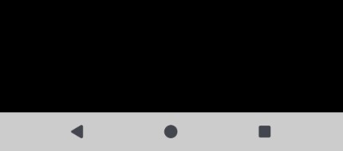
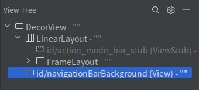

<!-- TODO -->
# 简介


# 沉浸式界面
## 旧版本
自行配置

修改状态栏的背景色：

window.statusBarColor = ContextCompat.getColor(this, R.color.purple_200)

修改导航栏的背景色：

window.navigationBarColor = ContextCompat.getColor(this, R.color.purple_200)

## Edge-to-Edge

该模式是系统推荐的方式

https://developer.android.com/develop/ui/views/layout/insets

此时应用程序的 Activity 内容将会延伸至状态栏和导航栏底部，并强制状态栏与导航栏透明、然后在导航栏区域添加一个对比度增强遮罩。

```java
@Override
protected void onCreate(Bundle savedInstanceState) {
    super.onCreate(savedInstanceState);

    // 启用 Edge-to-Edge 模式
    EdgeToEdge.enable(this);

    setContentView(R.layout.main_activity);
}
```

WindowCompat.enableEdgeToEdge(getWindow());


```kotlin
override fun onCreate(savedInstanceState: Bundle?) {
    super.onCreate(savedInstanceState)

    // 启用 Edge-to-Edge 模式
    enableEdgeToEdge()

    setContentView(R.layout.main_activity)
}
```

java的方法依赖 `androidx.activity:activity:1.8.0` ,kotlin 依赖 androidx.activity:activity-ktx:1.8.0，它们本质上是调用了WindowCompat.setDecorFitsSystemWindows(false)使应用内容可以绘制到状态栏导航栏底部， 并将状态栏与导航栏背景设为透明。


# 系统栏前景色

控制状态栏内容（例如时间、电池图标、通知图标）的外观：

val windowInsetsController = WindowCompat.getInsetsController(window, window.decorView)
windowInsetsController.isAppearanceLightStatusBars = true
//windowInsetsController.isAppearanceLightStatusBars = false

控制导航栏内容（例如返回、主页、最近应用按钮）的外观：

val windowInsetsController = WindowCompat.getInsetsController(window, window.decorView)
windowInsetsController.isAppearanceLightNavigationBars = true
//windowInsetsController.isAppearanceLightNavigationBars = false


# 版本变更
## 索引

<div align="center">

|       序号        |    版本    |             摘要             |
| :---------------: | :--------: | :--------------------------: |
| [变更一](#变更一) | Android 15 | 强制启用 Edge-to-Edge 模式。 |

</div>

## 变更一
### 摘要
自从 Android 15 开始，若应用程序的 TargetSDK ≥ 35 ，系统将强制启用 Edge-to-Edge 模式。

### 详情
Edge-to-Edge 模式使状态栏和导航栏背景变为透明，由于该版本无法关闭 Edge-to-Edge 模式，以下属性或方法已被弃用，即使我们设置它们也没有效果：

- XML 属性 : `android:statusBarColor` 。
- XML 属性 : `android:navigationBarColor` 。
- XML 属性 : `android:windowTranslucentStatus` 。
- XML 属性 : `android:windowTranslucentNavigation` 。
- Window Flag : `WindowManager.LayoutParams.FLAG_TRANSLUCENT_STATUS` 。
- Window Flag : `WindowManager.LayoutParams.FLAG_TRANSLUCENT_NAVIGATION` 。
- Window Flag : `WindowManager.LayoutParams.FLAG_DRAWS_SYSTEM_BAR_BACKGROUNDS` 。

### 兼容方案
应用程序应当通过 Insets 监听系统栏高度变化，并控制界面内容的显示位置。

若要模拟旧式带有颜色的状态栏与导航栏，我们可以通过 Insets 监听系统栏高度，添加一些同等高度的控件并设置颜色。


# 疑难解答
## 索引

<div align="center">

|       序号        |                      摘要                      |
| :---------------: | :--------------------------------------------: |
| [案例一](#案例一) | 启用 Edge-to-Edge 模式后，导航栏出现浅色遮罩。 |

</div>

## 案例一
### 问题描述
启用 Edge-to-Edge 模式后，导航栏出现浅色遮罩，设置 `android:navigationBarColor` 等属性也无法清除该遮罩层。

### 问题分析
在本案例中， Activity 背景为黑色，并且已启用 Edge-to-Edge 模式，导航栏出现白色的遮罩层：

<div align="center">



</div>

通过 Layout Inspector 分析页面组件树，我们观察到根布局被系统添加了一个名为 `navigationBarBackground` 的遮罩层。

<div align="center">



</div>

该特性是 API 29 中新增的，目的在于增强导航栏对比度，防止应用显示某些内容时用户难以辨认导航栏按钮。

### 解决方案
若希望应用程序在 Edge-to-Edge 模式下使导航栏完全透明，我们可以在主题中将 `enforceNavigationBarContrast` 属性设为 `false` ：

`themes.xml` :

```xml
<style name="Theme.Default" parent="Theme.MaterialComponents.DayNight.NoActionBar">
    <item name="android:enforceNavigationBarContrast">false</item>
</style>
```

此时应用该主题的 Activity 不会被系统添加遮罩层。

我们也可以在 Activity 的逻辑代码中动态设置 Window 属性屏蔽遮罩层：

```java
if (Build.VERSION.SDK_INT >= Build.VERSION_CODES.Q) {
    getWindow().setNavigationBarContrastEnforced(false);
}
```

上述内容也可以使用 Kotlin 语言编写：

```kotlin
if (Build.VERSION.SDK_INT >= Build.VERSION_CODES.Q) {
    window.isNavigationBarContrastEnforced = false
}
```
