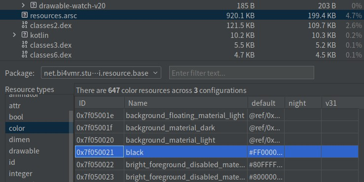

# 简介
Android工程中的资源(Resource)泛指一切非逻辑代码的静态内容，例如：字符串、布局描述文件、位图、矢量图等。

资源文件都被统一放置在模块的 `res` 目录中，由于资源的类型众多，为了便于管理，我们还需要进一步划分子目录。

下文代码块展示了常见的资源目录与文件：

```text
<模块根目录>
├── src
│   └── 源代码...
└── res
    ├── drawable
    ├── drawable-mdpi
    ├── drawable-hdpi
    ├── drawable-xdpi
    ├── layout
    └── values
        ├── colors.xml
        ├── strings.xml
        └── styles.xml
```

下文内容将对上述目录与文件进行说明：

🔷 `drawable`

该目录用于放置矢量图描述文件，包括Shape、Selector、 `.9.png` 格式的图片等。

🔷 `drawable-mdpi` 等

这些目录用于放置点阵图，目录名称中的后缀指明了像素密度，系统将会选择与屏幕最为匹配的图片并加载；因此我们需要根据目标设备尺寸制作对应的素材，避免图片尺寸过大导致内存占用较高，或图片尺寸过小导致被拉伸后变得模糊。

🔷 `layout` 

该目录用于放置布局描述文件。

🔷 `values`

该目录用于放置文本、颜色、样式等资源。

下文列表展示了一些约定俗成的资源文件名称：

- `arrays.xml` : 常量数组。
- `colors.xml` : 颜色。
- `dimens.xml` : 尺寸。
- `strings.xml` : 文本。
- `styles.xml` : 样式。
- `themes.xml` : 主题。

该目录中的资源在编译阶段会被整合到 `.arsc` 索引文件，不保留原始XML文件，因此我们可以在工程中创建多个具有不同名称的XML文件以便区分资源用途，例如：在 `colors.xml` 中放置应用主页的颜色资源、在 `colors_setting.xml` 中放置设置模块的颜色资源。

<br />

本章的相关知识详见以下链接：

- [🔗 Android官方文档 - 应用程序资源](https://developer.android.com/guide/topics/resources/providing-resources)
- [🔗 Android官方文档 - 资源类型概览](https://developer.android.com/guide/topics/resources/available-resources)

本章的示例工程详见以下链接：

- [🔗 示例工程：概述](https://github.com/BI4VMR/Study-Android/tree/master/M03_UI/C02_Resource/S01_Base)


# 尺寸计量单位
## DP
密度无关像素(Density Independent Pixel, DIP)也被称为DP，是Android中特有的尺寸单位，它能够根据屏幕的像素密度(PPI)自动进行缩放，使控件在不同屏幕上的尺寸尽可能地保持一致，以便适配多种设备。

DP与PX的转换公式为：

$$
PX值 = DP值 * \frac{ PPI }{ 160 }
$$

PPI是屏幕的物理属性，系统会根据PPI值计算缩放倍率，调整控件尺寸或选择合适的图像资源。 `160` 是一个基准倍率，如果屏幕的PPI恰好也为 `160` ，则 `1dp` 等于 `1px` ，此时系统不必进行缩放；如果屏幕的PPI为 `320` ，则 `1dp` 将被转换为 `2px` 。

🔴 示例一：比较DP与PX在不同屏幕上的显示效果。

在本示例中，我们在两款常见的设备上显示矩形，分别以DP与PX作为计量单位，并比较它们的显示效果。

下文表格列出了测试设备的屏幕参数：

<div align="center">

|  设备名称  |   分辨率    | 屏幕尺寸  |  PPI   | DP缩放倍率 |
| :--------: | :---------: | :-------: | :----: | :--------: |
| 笔记本电脑 | 1920 * 1080 | 13.8 英寸 | 159.63 |  约 1 倍   |
|    手机    | 1920 * 1080 |  6 英寸   | 367.15 | 约 2.3 倍  |

</div>

第一步，我们在界面上放置一个宽高为 `480px * 270px` 的矩形，显示效果如下文图片所示：

<div align="center">


</div>

笔记本电脑的屏幕分辨率与手机相同，且物理尺寸大约相差2倍，因此该控件在电脑上能够被用户看清，但在手机上显得较小，其中的文本难以辨认。

第二步，我们在界面上放置一个宽高为 `480dp * 270dp` 的矩形，显示效果如下文图片所示：

<div align="center">


</div>

根据PPI与缩放倍率的映射规则，该控件在手机上将被放大约2.3倍，实际尺寸约为 `1100px * 620px` ，与笔记本电脑屏幕上的控件尺寸接近，因此其中的文本不会变得难以辨认。

## SP
受缩放影响的密度无关像素(Scaled Density, SP)主要用于设置文本的尺寸，默认情况下 `1sp` 等同于 `1dp` 。用户可以在系统设置中调整文本的缩放倍率，此时最终的倍率为：

$$
SP缩放倍率 = DP缩放倍率 * 文本缩放倍率
$$

## 单位转换
当需要在不同的尺寸单位之间相互转换时，我们可以使用DisplayMetrics对象获取屏幕尺寸与缩放倍率等参数，再进行计算。

我们可以通过以下方式获取DisplayMetrics对象：

🔷 单显示器环境

这种方式可以获取主显示器的DisplayMetrics对象，并不依赖Context，适用于只有单个屏幕的工程。

```java
DisplayMetrics dm = Resources.getSystem().getDisplayMetrics()
```

🔷 多显示器环境

这种方式依赖当前界面组件的Context对象，因此能够支持多个屏幕。

```java
// 创建一个空的DisplayMetrics对象
DisplayMetrics dm = new DisplayMetrics();
// 使用当前Context所关联的显示器设置DisplayMetrics参数
context.getDisplay().getRealMetrics(dm);
```

<br />

下文示例展示了DisplayMetrics对象包含的详细信息：

🟠 示例二：获取设备屏幕的相关参数。

在本示例中，我们获取设备主显示器的DisplayMetrics对象，并查看相关参数。

"TestUIBase.java":

```java
DisplayMetrics dm = Resources.getSystem().getDisplayMetrics();
Log.i(TAG, "屏幕宽度：" + dm.widthPixels);
Log.i(TAG, "屏幕高度：" + dm.heightPixels);
Log.i(TAG, "像素密度：" + dm.densityDpi);
Log.i(TAG, "缩放倍率(DP)：" + dm.density);
Log.i(TAG, "缩放倍率(SP)：" + dm.scaledDensity);
```

上述内容也可以使用Kotlin语言编写：

"TestUIBase.kt":

```kotlin
val dm = Resources.getSystem().displayMetrics
Log.i(TAG, "屏幕宽度：${dm.widthPixels}")
Log.i(TAG, "屏幕高度：${dm.heightPixels}")
Log.i(TAG, "像素密度：${dm.densityDpi}")
Log.i(TAG, "缩放倍率(DP)：${dm.density}")
Log.i(TAG, "缩放倍率(SP)：${dm.scaledDensity}")
```

此时运行示例程序，并查看控制台输出信息：

```text
22:45:35.485 27731 27731 I TestApp: 屏幕宽度：1080
22:45:35.485 27731 27731 I TestApp: 屏幕高度：2160
22:45:35.485 27731 27731 I TestApp: 像素密度：480
22:45:35.485 27731 27731 I TestApp: 缩放倍率(DP)：3.0
22:45:35.485 27731 27731 I TestApp: 缩放倍率(SP)：3.0
```

---

在前文示例中，我们已经知悉设备屏幕的像素密度与缩放倍率，此时便可进行单位换算了。

🟡 示例三：DP、SP与PX之间的相互转换。

在本示例中，我们实现DP、SP与PX之间的转换方法。

"TestUIBase.java":

```java
// 将DP转换为PX
public static int dpToPX(float dpValue) {
    // "applyDimension()"方法用于将指定的非标准单位转换为像素
    float rawValue = TypedValue.applyDimension(TypedValue.COMPLEX_UNIT_DIP, dpValue, Resources.getSystem().getDisplayMetrics());
    // 物理像素不可能为小数，因此保留整数部分即可。
    return Math.round(rawValue);
}

// 将SP转换为PX
public static int spToPX(float spValue) {
    float rawValue = TypedValue.applyDimension(TypedValue.COMPLEX_UNIT_SP, spValue, Resources.getSystem().getDisplayMetrics());
    return Math.round(rawValue);
}

// 将PX转换为DP
public static int pxToDP(int pxValue) {
    // 获取缩放倍率
    float density = Resources.getSystem().getDisplayMetrics().density;
    return Math.round(pxValue / density);
}

// 将PX转换为SP
public static int pxToSP(int pxValue) {
    // 获取字体缩放倍率
    float density = Resources.getSystem().getDisplayMetrics().scaledDensity;
    return Math.round(pxValue / density);
}
```

上述内容也可以使用Kotlin语言编写：

"TestUIBase.kt":

```kotlin
// 将DP转换为PX
private fun dpToPX(dpValue: Float): Int {
    val dm: DisplayMetrics = Resources.getSystem().displayMetrics
    // "applyDimension()"方法用于将指定的单位转换为像素
    val rawValue: Float = TypedValue.applyDimension(TypedValue.COMPLEX_UNIT_DIP, dpValue, dm)
    // 物理像素不可能为小数，因此保留整数部分即可。
    return rawValue.roundToInt()
}

// 将SP转换为PX
private fun spToPX(spValue: Float): Int {
    val dm = Resources.getSystem().displayMetrics
    val rawValue = TypedValue.applyDimension(TypedValue.COMPLEX_UNIT_SP, spValue, dm)
    return rawValue.roundToInt()
}

// 将PX转换为DP
private fun pxToDP(pxValue: Int): Int {
    // 获取DP缩放倍率
    val density = Resources.getSystem().displayMetrics.density
    return (pxValue / density).roundToInt()
}

// 将PX转换为SP
private fun pxToSP(pxValue: Int): Int {
    // 获取SP缩放倍率
    val density = Resources.getSystem().displayMetrics.scaledDensity
    return (pxValue / density).roundToInt()
}
```

此时运行示例程序，并查看控制台输出信息：

```text
22:46:58.015 27731 27731 I TestApp: 100dp -> ?px: 300
22:46:58.015 27731 27731 I TestApp: 100sp -> ?px: 300
22:46:58.015 27731 27731 I TestApp: 300px -> ?dp: 100
22:46:58.015 27731 27731 I TestApp: 300px -> ?sp: 100
```

> 🚩 提示
>
> 上述代码中的DisplayMetrics对象均为主显示器，如果需要支持多显示器，我们可以新增Context参数并获取DisplayMetrics对象。


# 资源索引
每个资源都会生成对应的名称，例如以下资源 `color/common_text`

"colors.xml":

```xml
<color name="common_text">#000000</color>
```


为了便于人类阅读代码，在编码阶段，我们可以 通过资源名称在布局文件或逻辑代码中引用资源

```xml
<!-- 此处已省略部分属性... -->
<TextView
    android:textColor="@color/common_text" />
```

```kotlin
val colorValue = getColor(R.color.common_text)
textview.setTextColor(colorValue)
```


编译APK时，会为每个资源生成数字形式的全局静态ID，并记录在 `<命名空间>.R` 文件和 `.arsc` 索引文件中，程序运行时通过ID读取资源，因此我们编写的名字都会被替换为具体的数字ID。

<div align="center">



</div>

`@color/black` 和 `R.color.black` 是简化形式，省略了包名等定义，只包含类型/资源名称

我们可以通过以下方法查看资源详情

"TestUIIndexKT.kt":

```kotlin
// 获取完整名称
val fullName = resources.getResourceName(R.string.app_name)
// 获取资源名称
val name = resources.getResourceEntryName(R.string.app_name)
// 获取资源类型
val type = resources.getResourceTypeName(R.string.app_name)
// 获取资源所在包名
val pkgName = resources.getResourcePackageName(R.string.app_name)
```

```text
07:16:28.568  9921 9921 I TestApp: 完整名称：net.bi4vmr.study.ui.resource.base:string/app_name
07:16:28.568  9921 9921 I TestApp: 资源名称：app_name
07:16:28.568  9921 9921 I TestApp: 资源类型：string
07:16:28.568  9921 9921 I TestApp: 资源包名：net.bi4vmr.study.ui.resource.base
```

完整的资源名称为 `<包名>:<资源类型>/<资源名称>` ，当我们引用在当前工程中定义的资源时，我们可以省略包名；其他情况不能省略包名，例如我们想要获取Android SDK内置的资源，可以将包名写为 `android`， 例如： `@android:color/black`  或 `android.R.color.black` 表示获取SDK提供的 黑色 色值。


# 资源后缀

-night限定符

# ADB
查看物理/覆盖尺寸、密度
wm size [-d <DisplayID>]

设置覆盖尺寸/密度（临时覆盖，直到 reset 或恢复出厂/清除设置）
wm size 1080x2400 [-d <DisplayID>]

wm size reset  [-d <DisplayID>]

wm density [-d <DisplayID>]
wm density 420 [-d <DisplayID>]
wm density reset [-d <DisplayID>]


# 外部资源
## 访问其他软件包资源


## 访问APK文件资源

