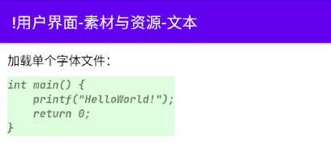

# 简介
本章介绍了文本与字体资源的管理与使用方法。

本章的示例工程详见以下链接：

- [🔗 示例工程：文本资源](https://github.com/BI4VMR/Study-Android/tree/master/M03_UI/C02_Resource/S02_Text)


# 理论基础
## 字体
字体(Font)定义了字符的形态，例如：楷体、宋体等。

一种字体可能包含两个特征：字重与样式，其中字重表示字符笔画的粗细；样式表示字体为正常或斜体。

字重的标准定义如下文表格所示：

<div align="center">

|  标准名称   |    别名     | 数值  |
| :---------: | :---------: | :---: |
|    Thin     |  Hairline   |  100  |
| Extra Light | Ultra Light |  200  |
|    Light    |      -      |  300  |
|   Regular   |   Normal    |  400  |
|   Medium    |      -      |  500  |
|  Semi Bold  |  Demi Bold  |  600  |
|    Bold     |      -      |  700  |
| Extra Bold  | Ultra Bold  |  800  |
|    Black    |    Heavy    |  900  |

</div>

在要求不高的场合，我们会将字重简单的分为“正常”与“粗体”两种，其中“正常”字重对应的数值为"400"；“加粗”字重对应的数值为"700"。

每个字重都可以有正常与斜体两种样式，一种字体也可能只包含部分字重与对应的斜体，如果我们指定加载不存在的字重，则系统会选择数值最接近的有效字体。+

常见的字体文件格式有 `.ttf` 、 `.ttc` 、 `.otf` 等，一种字体的字重与样式可能集成在单个文件中，也可能分为多个文件。


# 基本应用
下文示例展示了文本资源的基本用法：

🔴 示例一：定义并使用文本资源。

在本示例中，我们定义一个文本资源，并将其通过XML属性设置到TextView中。

第一步，我们在 `<模块根目录>/src/main/res/values/` 目录中创建一个字符串资源XML文件 `strings.xml` ，然后在其中添加一条名为"text_base"的文本资源。

"strings.xml":

```xml
<resources>
    <string name="text_base">这是一个文本资源。</string>
</resources>
```

第二步，我们在布局文件中引用该资源，将其设置到TextView的文本属性上。

"testui_base.xml":

```xml
<TextView
    android:layout_width="wrap_content"
    android:layout_height="wrap_content"
    android:text="@string/text_base" />
```

在ID引用语句 `@string/<资源名称>` 中， `@string` 表示这是一个字符串资源，其后跟随资源的名称。

当程序运行时，TextView的文本属性将会被替换为文本资源"text_base"的值。

🟠 示例二：在代码中使用文本资源。

在本示例中，我们通过逻辑代码获取前文“示例一”定义的文本资源"text_base"，并将内容设置到TextView中。

"TestUIBase.java":

```java
// 通过Resources实例获取字符串
String text = getResources().getString(R.string.text_base);
// 将字符串设置到控件上
textview.setText(text);
```

Context对象的 `getResources()` 方法将会返回Resources实例，该实例的 `String getString(int resID)` 方法唯一参数 `resID` 为字符串资源ID，返回值为对应资源的内容。

上述内容也可以使用Kotlin语言编写：

"TestUIBase.kt":

```kotlin
// 通过Resources实例获取字符串
val text: String = resources.getString(R.string.text_base)
// 将字符串设置到控件上
textview.text = text
```

Context对象还封装了 `String getString(int resID)` 方法，我们也可以调用该方法便捷地获取文本资源的内容。


# 复数
<!-- TODO
Plurals


```xml
<!-- 定义复数 -->
<plurals name="apple_info" translatable="false">
    <item quantity="zero">No apple!</item>
    <item quantity="one">One apple</item>
    <item quantity="two">Two apples</item>
    <item quantity="few">A few apples</item>
    <item quantity="many">Many apples</item>
    <item quantity="other">%d apples</item>
</plurals>
```

    如果设备语言是俄语（ru），count=3会匹配到few，结果为对应的俄语翻译。
    英语仅当数量为1时能够匹配到one，其他情况对应的zero、two等都不会生效，只会使用默认值other
-->


# 字符串模板
有些文本框包含可变的内容，它们需要在界面加载时从数据库或服务器中实时获取，例如：“学生XX的得分是YY”；对于此类文本资源，我们可以使用字符串模板进行定义，通过占位符替代可变的部分，当程序运行时再用实际内容取代占位符。

🟡 示例三：字符串模板的使用方法。

在本示例中，我们使用字符串模板定义一条文本资源，格式为“学生姓名：XX, 年龄：YY”，并在程序运行时填充实际内容。

第一步，我们在 `strings.xml` 文件中新增一条文本资源"text_template"，其中包含字符串( `%s` )和整数( `%d` )两个占位符。

"strings.xml":

```xml
<resources>
    <string name="text_template">学生姓名：[%s], 年龄：[%d]</string>
</resources>
```

第二步，我们在代码中通过Resources实例的 `String getString(int resID, Object... formatArgs)` 方法获取文本，并用实际内容替换占位符。

"TestUITemplate.java":

```java
// 根据占位符依次传入对应的内容
String text = getResources().getString(R.string.text_template, "李田所", 24);
// 将字符串设置到控件上
textview.setText(text);
```

该方法的可变参数 `formatArgs` 即为每个占位符所对应的实际内容。

上述内容也可以使用Kotlin语言编写：

"TestUITemplate.kt":

```kotlin
// 根据占位符依次传入对应的内容
val text: String = resources.getString(R.string.text_template, "李田所", 24)
// 将字符串设置到控件上
textview.text = text
```

Resources类的 `getString()` 方法基于Java的 `String.format()` 方法实现，所有可用的占位符可参考相关章节： [🧭 Java - 格式化输出](../../../../06_编程语言/03_Java/02_基本语法/03_控制台.md#格式化输出) 。


# 字体
## 基本应用
我们需要将字体文件放置在 `<模块根目录>/res/font` 目录中，Gradle会在R文件中生成对应的ID，我们便可通过ID引用字体资源。

如果我们需要改变文本类控件的默认文本样式，可以使用以下属性：

🔷 `android:textStyle="<normal | bold | italic>"`

设置字体样式。

粗体与斜体可以并存，以竖线("|")分隔即可。

🔷 `android:textFontWeight="<字重数值>"`

设置字重。

该属性是Android 9.0的新增API，较低的版本只支持正常、粗体两种字重，无法随意设置其他数值。

🔷 `android:fontFamily="@font/<字体资源ID>"`

设置字体。

<br />

下文示例展示了字体资源的基本用法：

🟢 示例四：为文本设置字体与字重等样式。

在本示例中，我们通过布局XML文件，将TextView的字体设置为JetBrainsMono、字重设置为"700"、样式设置为斜体。

"testui_font.xml":

```xml
<TextView
    android:id="@+id/tvFontFile"
    android:layout_width="wrap_content"
    android:layout_height="wrap_content"
    android:layout_marginStart="10dp"
    android:background="#2200FF00"
    android:fontFamily="@font/jetbrainsmono_regular"
    android:text="int main() {\n    printf(&quot;HelloWorld!&quot;);\n    return 0;\n}"
    android:textStyle="italic|bold" />
```

此时运行示例程序，并查看界面外观：

<div align="center">



</div>

🔵 示例五：在代码中使用字体资源。

在本示例中，我们通过逻辑代码获取前文“示例四”添加的字体资源 `jetbrainsmono_regular.ttf` ，并将该字体设置到TextView中。

"TestUIFont.java":

```java
// 获取字体对象（从"asset"目录加载）
Typeface typefaceFromAssert = Typeface.createFromAsset(getApplication().getAssets(), "fonts/jetbrainsmono_regular.ttf");

// 获取字体对象（从"res"目录加载）
Typeface typeface = getApplication().getResources().getFont(R.font.jetbrainsmono);
// 将字体设置到控件上
textview.setTypeface(typeface);
// 将字体与样式设置到控件上
textview.setTypeface(typeface, Typeface.BOLD_ITALIC);
```

Resources对象的 `getFont()` 方法可以加载 `<模块根目录>/res/font` 目录内的字体资源，包括单文件字体与XML配置文件；Typeface类的静态方法 `createFromAsset()` 可以加载 `<模块根目录>/asset` 目录中的字体文件，但这种方式无法加载XML配置文件。

上述内容也可以使用Kotlin语言编写：

"TestUIFont.kt":

```kotlin
// 获取字体对象（从"asset"目录加载）
val typefaceFromAssert: Typeface =
    Typeface.createFromAsset(application.assets, "fonts/jetbrainsmono_regular.ttf")

// 获取字体对象（从"res"目录加载）
val typeface: Typeface = application.resources.getFont(R.font.jetbrainsmono)
// 将字体设置到控件上
textview.typeface = typeface
// 将字体与样式设置到控件上
textview.setTypeface(typeface, Typeface.BOLD_ITALIC)
```

## 组合字体
对于包含多个文件的字体，我们需要通过XML配置文件指明每个字体文件所对应的字重与样式，然后便可像单文件字体一样通过属性或方法使用它。

🟣 示例六：定义并使用组合字体。

在本示例中，我们通过XML文件定义组合字体，并将该字体设置到TextView中。

第一步，我们准备JetBrainsMono系列字体作为测试资源，这款字体分为多个TTF文件，每个文件对应不同的字重与样式。我们需要按照资源文件的命名规则修改文件名称，然后将它们放置在 `<模块根目录>/res/font` 目录下：

```text
<模块根目录>/res/font
├── jetbrainsmono_bold.ttf
├── jetbrainsmono_bolditalic.ttf
├── jetbrainsmono_italic.ttf
├── jetbrainsmono_light.ttf
├── jetbrainsmono_lightitalic.ttf
├── jetbrainsmono_medium.ttf
├── jetbrainsmono_mediumitalic.ttf
└── jetbrainsmono_regular.ttf
```

第二步，我们在 `<模块根目录>/res/font` 目录中新建一个 `jetbrainsmono.xml` 配置文件，添加下文代码块中的内容：

"jetbrainsmono.xml":

```xml
<?xml version="1.0" encoding="utf-8"?>
<font-family xmlns:android="http://schemas.android.com/apk/res/android">

    <!-- 定义字体 -->
    <font
        android:font="@font/jetbrainsmono_light"
        android:fontStyle="normal"
        android:fontWeight="300" />

    <font
        android:font="@font/jetbrainsmono_lightitalic"
        android:fontStyle="italic"
        android:fontWeight="300" />

    <font
        android:font="@font/jetbrainsmono_regular"
        android:fontStyle="normal"
        android:fontWeight="400" />

    <font
        android:font="@font/jetbrainsmono_italic"
        android:fontStyle="italic"
        android:fontWeight="400" />

    <!-- 此处省略部分字体定义... -->
</font-family>
```

在上述配置中，根节点固定为 `<font-family/>` ，每个子节点 `<font/>` 表示一个字体配置，常用的属性如下文内容所示：

🔷 `android:font="@font/<字体资源ID>"`

指定该配置关联的字体文件。

🔷 `android:fontStyle="<normal | italic>"`

指定字体样式。

取值为"normal"表示正常字体，取值为"italic"表示斜体。

如果我们没有明确指明该属性，系统将从字体文件中识别该属性。

🔷 `android:fontWeight="<字重数值>"`

指定字重。

如果我们没有明确指明该属性，系统将从字体文件中识别该属性。

<br />

第三步，我们在TextView控件中引用字体XML文件，并设置字重与样式。

"testui_font.xml":

```xml
<TextView
    android:id="@+id/tvFontFiles"
    android:layout_width="wrap_content"
    android:layout_height="wrap_content"
    android:fontFamily="@font/jetbrainsmono"
    android:text="我能吞下玻璃而不伤身体。"
    android:textFontWeight="300" />
```


# 多语言支持
## 资源检索
我们可以在工程资源目录中创建若干语言的 `strings.xml` 配置文件，当程序运行时，系统将会根据用户设置的语言列表检索资源并进行加载。

我们首先在示例工程的模块中创建以下目录与文件，并在每个 `strings.xml` 中定义一个同名但内容不同的文本资源，以便测试系统默认的多语言支持能力。

```text
res
├── values
│   ├── colors.xml
│   ├── strings.xml
│   └── themes.xml
├── values-en
│   └── strings.xml
├── values-zh-rCN
│   └── strings.xml
└── values-zh-rTW
    └── strings.xml
```

每个 `strings.xml` 对应的语言如下文列表所示：

- `res/values/strings.xml` 是默认的文本资源文件，如果加载文本资源时未匹配到明细地区或语言，则会选择此处的资源。
- `res/values-en/strings.xml` 是“英语”的文本资源文件。
- `res/values-zh-rCN/strings.xml` 是“中文（中国大陆）”地区的文本资源文件。
- `res/values-zh-rTW/strings.xml` 是“中文（中国台湾）”地区的文本资源文件。

此时运行示例程序，并修改系统语言设置，查看示例程序获取到的文本资源：

我们将系统语言设置为“简体中文”，此时将会精确匹配到 `values-zh-rCN` 目录，并加载其中的文本资源。

我们将系统语言设置为“繁体中文（台湾）”，此时将会精确匹配到 `values-zh-rTW` 目录，并加载其中的文本资源。

我们将系统语言设置为“英语（美国）”，系统期望的资源目录名称为 `values-en-rUS` ；由于我们并未创建该目录，系统进一步尝试加载非特定地区的资源目录 `values-en` ，该目录是存在的，最终加载其中的文本资源。

我们将系统语言设置为“德语（德国）”，系统期望的资源目录名称为 `values-de-rDE` ；由于我们并未创建该目录，系统进一步尝试加载非特定地区的资源目录 `values-de` ，该目录也不存在，最终加载默认资源目录 `values` 中的文本资源。


<!-- TODO
## RTL布局
自从API版本17开始，Android支持RTL功能，能够根据语言配置自动适应用户的阅读习惯。一般来说，文本按照从左到右的顺序阅读，此时"start"属性等同于"left"，"end"属性等同于"right"；对于从右到左阅读的语言，"start"相当于"right"，"end"相当于"left"。


```xml
<application
    android:supportsRtl="true">
```

RTL布局和文本显示方向是不同的，可以自由组合，需要注意分辨。
-->


# 附录
## 语言与资源目录名称对照表
下文表格包含各种语言与资源目录名称的对应关系：

<div align="center">

|      语言名称      |  资源目录名称   |
| :----------------: | :-------------: |
|    中文（中国）    | `values-zh-rCN` |
|    中文（台湾）    | `values-zh-rTW` |
|    中文（香港）    | `values-zh-rHK` |
|        日文        | `values-ja-rJP` |
|        韩文        | `values-ko-rKR` |
|    英文（美国）    | `values-en-rUS` |
|    英文（英国）    | `values-en-rGB` |
|  英文（澳大利亚）  | `values-en-rAU` |
|   英文（加拿大）   | `values-en-rCA` |
|   英文（爱尔兰）   | `values-en-rIE` |
|    英文（印度）    | `values-en-rIN` |
|   英文（新加坡）   | `values-en-rNZ` |
|    英文（南非）    | `values-en-rZA` |
|   法文（比利时）   | `values-fr-rBE` |
|   法文（加拿大）   | `values-fr-rCA` |
|    法文（瑞士）    | `values-fr-rCH` |
|    法文（法国）    | `values-fr-rFR` |
|   德文（奥地利）   | `values-de-rAT` |
|    德文（瑞士）    | `values-de-rCH` |
|    德文（德国）    | `values-de-rDE` |
| 德文（列支敦士登） | `values-de-rLI` |
|        俄文        | `values-ru-rRU` |
|  阿拉伯文（埃及）  | `values-ar-rEG` |
| 阿拉伯文（以色列） | `values-ar-rIL` |
|     保加利亚文     | `values-bg-rBG` |
|    加泰罗尼亚文    | `values-ca-rES` |
|       捷克文       | `values-cs-rCZ` |
|       丹麦文       | `values-da-rDK` |
|       希腊文       | `values-el-rGR` |
| 西班牙文（西班牙） | `values-es-rES` |
|  西班牙文（美国）  | `values-es-rUS` |
|   芬兰文（芬兰）   | `values-fi-rFI` |
|      希伯来文      | `values-iw-rIL` |
|       印地文       | `values-hi-rIN` |
|     克罗里亚文     | `values-hr-rHR` |
|      匈牙利文      | `values-hu-rHU` |
|    印度尼西亚文    | `values-in-rID` |
|  意大利文（瑞士）  | `values-it-rCH` |
| 意大利文（意大利） | `values-it-rIT` |
|      立陶宛文      | `values-lt-rLT` |
|     拉脱维亚文     | `values-lv-rLV` |
|   挪威博克马尔文   | `values-nb-rNO` |
|  荷兰文（比利时）  | `values-nl-BE`  |
|   荷兰文（荷兰）   | `values-nl-rNL` |
|       波兰文       | `values-pl-rPL` |
|  葡萄牙文（巴西）  | `values-pt-rBR` |
| 葡萄牙文（葡萄牙） | `values-pt-rPT` |
|     罗马尼亚文     | `values-ro-rRO` |
|     斯洛伐克文     | `values-sk-rSK` |
|    斯洛文尼亚文    | `values-sl-rSI` |
|     塞尔维亚文     | `values-sr-rRS` |
|       瑞典文       | `values-sv-rSE` |
|        泰文        | `values-zh-rHK` |
|      塔加洛文      | `values-th-rTH` |
|      土耳其文      | `values–r-rTR`  |
|      乌克兰文      | `values-uk-rUA` |
|       越南文       | `values-vi-rVN` |

</div>
