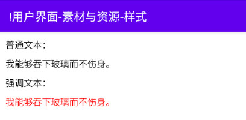
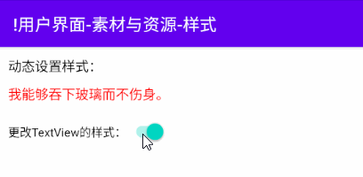
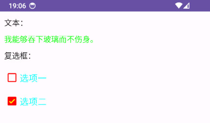
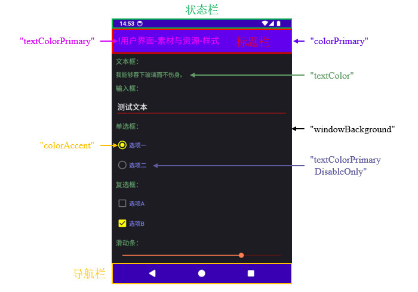

# 简介
样式(Style)是一组预先定义的属性，例如：文本字体、文本颜色、控件背景素材等；我们可以将样式应用在多个控件上，实现减少重复代码、统一管理的目标。

Android SDK的内置样式定义在 `<Android SDK路径>\platforms\<API版本>\data\res\values\styles.xml` 文件中，我们可以通过 `@android:style/<样式名称>` 语法引用它们。工程中自定义的样式通常放置在 `res/values/styles.xml` 文件中，我们可以通过 `@style/<样式名称>` 语法引用它们。

本章的示例工程详见以下链接：

- [🔗 示例工程：样式](https://github.com/BI4VMR/Study-Android/tree/master/M03_UI/C02_Resource/S05_Style)


# 基本应用
下文示例展示了样式的基本使用方法。

🔴 示例一：定义并使用样式。

在本示例中，我们定义一些样式，并将它们应用到控件上。

第一步，我们在当前模块的 `res/values/` 目录下创建 `styles.xml` 文件，并填入以下代码块所示的内容：

"styles.xml":

```xml
<resources>
    <!-- 定义样式：自定义文本 -->
    <style name="MyText" />

    <!-- 定义样式：普通文本 -->
    <style name="MyText.Normal">
        <item name="android:textColor">@color/black</item>
        <item name="android:textSize">16sp</item>
    </style>

    <!-- 定义样式：强调文本 -->
    <style name="MyText.Emphasize" parent="MyText.Normal">
        <!-- 定义颜色属性，覆盖普通文本中的值。 -->
        <item name="android:textColor">#FF0000</item>
    </style>
</resources>
```

在上述代码中，我们定义了普通文本 `MyText.Normal` 和强调文本 `MyText.Emphasize` 两个样式，其中普通文本颜色为黑色、字号为 `16sp` ；强调文本继承自普通文本，因此它的字号也是 `16sp` ，我们为强调文本指定了文本颜色为红色，该属性将会取代父样式中定义的黑色，因此最终强调文本颜色为红色、字号为 `16sp` 。

样式名称中的点( `.` )具有特殊含义，它表明了默认继承关系，在上述代码中， `MyText.Normal` 样式没有通过 `parent="<样式>"` 属性声明父样式，因此继承自 `MyText` 样式。当我们声明此类具有继承关系的样式时，即使父样式没有任何属性，也不能省略定义语句，否则会因为继承关系缺失导致编译失败。

第二步，我们创建一个测试Activity，并在其布局XML文件中放置两个TextView，分别应用第一步中声明的两个样式。

"testui_base.xml":

```xml
<!-- 此处省略部分代码... -->
<LinearLayout ...>
    <TextView
        style="@style/MyText.Normal"
        android:layout_width="wrap_content"
        android:layout_height="wrap_content"
        android:text="我能够吞下玻璃而不伤身。" />

    <TextView
        style="@style/MyText.Emphasize"
        android:layout_width="wrap_content"
        android:layout_height="wrap_content"
        android:text="我能够吞下玻璃而不伤身。" />
</LinearLayout>
```

我们可以通过 `style="@style/<样式名称>"` 属性为布局中的控件应用自定义样式。

此时运行示例程序，并查看界面外观：

<div align="center">



</div>

文本类控件提供了 `setTextAppearance()` 方法，我们可以调用该方法动态设置控件的样式。对于其他控件，Android并未提供设置样式的方法，我们只能直接修改控件属性。

🟠 示例二：在代码中使用样式资源。

在本示例中，我们在代码中为TextView控件设置样式。

我们在测试Activity中放置TextView与Switch控件，当Switch控件的状态为开启时，将TextView设置为强调文本样式；当Switch控件的状态为关闭时，将TextView设置为普通文本样式。

"TestUIBase.java":

```java
// 动态设置样式
switch.setOnCheckedChangeListener((buttonView, isChecked) -> {
    if (isChecked) {
        textview.setTextAppearance(R.style.MyText_Emphasize);
    } else {
        textview.setTextAppearance(R.style.MyText_Normal);
    }
});
```

在上述代码中，我们通过 `R.style.MyText_Normal` 访问资源文件中的样式资源，样式名称中的点( `.` )需要替换为下划线( `_` )。

此时运行示例程序，并查看界面外观：

<div align="center">



</div>


# 主题
## 简介
主题(Theme)与样式的语法相同，但作用范围有差异。样式通常用于描述界面元素（例如：View）的外观；而主题则用于描述界面整体（例如：Activity、Dialog）的外观。控件的最终样式遵循“局部优于全局”的原则，当我们没有为控件定义样式时，默认采用主题中的样式；当我们为控件定义了样式后，该样式将会取代主题中的样式。

Android SDK的内置主题定义在 `<Android SDK路径>\platforms\<API版本>\data\res\values\themes.xml` 文件中，我们可以通过 `@android:style/<主题名称>` 语法引用它们。工程中自定义的样式通常放置在 `res/values/themes.xml` 文件中，我们可以通过 `@style/<主题名称>` 语法引用它们。

下文列表展示了一些常用的内置主题：

- `Theme.AppCompat.DayNight` : `appcompat` 库中的主题，支持深色模式自动切换。
- `Theme.MaterialComponents.DayNight.DarkActionBar` : `material` 库中的主题，支持深色模式自动切换。该主题也是新建工程的默认主题。
- `Theme.MaterialComponents.DayNight.NoActionBar` : 与 `Theme.MaterialComponents.DayNight.DarkActionBar` 相比隐藏了ActionBar。
- `Theme.Material3.DayNight` : `material` 库中的主题。

`DayNight` 、 `NoActionBar` 等主题由基本主题扩展而来，除了上文列表例举的几种，其他主题通常也会提供，例如 `Theme.Material3.DayNight.NoActionBar` ，我们可以按需选择。

## 基本应用
下文示例展示了主题的基本使用方法。

🟡 示例三：定义并使用主题。

主题涉及到众多界面元素，因此我们通常不会从零开始定义主题，而是继承Android SDK或其他库中的现有主题，并声明我们期望修改的属性，覆盖父主题的属性值。

在本示例中，我们通过继承的方式定义一个主题。

第一步，我们在当前模块的 `res/values/` 目录下创建 `themes.xml` 文件，并填入以下代码块所示的内容：

"themes.xml":

```xml
<!-- 自定义主题 -->
<style name="Theme.Custom" parent="Theme.Material3.DayNight">
    <!-- 覆盖全局属性 -->
    <item name="windowActionBar">false</item>
    <item name="windowNoTitle">true</item>

    <!-- 覆盖各个控件的属性 -->
    <item name="android:textViewStyle">@style/Theme.Custom.TextView</item>
    <item name="checkboxStyle">@style/Theme.Custom.CheckBox</item>
</style>

<!-- 自定义TextView样式 -->
<style name="Theme.Custom.TextView">
    <item name="android:textColor">#00FF00</item>
    <item name="android:textSize">16sp</item>
</style>

<!-- 自定义CheckBox样式 -->
<style name="Theme.Custom.CheckBox" parent="Widget.Material3.CompoundButton.CheckBox">
    <item name="android:textColor">#00FFFF</item>
    <item name="android:textSize">18sp</item>
    <item name="buttonTint">#FF0000</item>
    <item name="buttonIconTint">#FFFF00</item>
</style>
```

该主题的名称为 `Theme.Custom` ，继承自Material库中的 `Theme.Material3.DayNight` 主题。我们可以根据需要编写 `<item/>` 小节覆盖父主题中的属性， `windowActionBar` 、 `windowNoTitle` 等属性用于设置窗口标题栏等模块的样式； `textViewStyle` 、 `checkboxStyle` 等属性用于设置控件的样式。

> 🚩 提示
>
> 我们需要注意属性命名空间与主题的对应关系。
>
> 在本示例中， `android:textViewStyle` 能够覆盖 `Material3` 主题的TextView样式，但 `android:checkboxStyle` 对 `Material3` 主题的CheckBox无效，我们需要使用 `checkboxStyle` 属性进行设置。

第二步，我们在工程的Manifest文件中配置主题，为测试Activity应用前文创建的主题。

"AndroidManifest.xml":

```xml
<!-- 应用主题：对所有组件生效 -->
<application ...
    android:theme="@android:style/Theme.DeviceDefault.DayNight">

    <!-- Activity：继承全局主题 -->
    <activity
        android:name=".ActivityA" />

    <!-- Activity：仅对当前组件生效 -->
    <activity
        android:name=".ActivityB"
        android:theme="@style/Theme.Custom" />
</application>
```

我们在 `<application/>` 标签中配置的主题为全局主题，将对所有Activity、Window、View组件生效；如果部分Activity需要配置与全局主题不同的主题，我们可以单独使用 `android:theme=` 属性进行配置，此时Activity使用特定的主题。在上述代码中，ActivityA没有指明主题，则继承全局主题 `Theme.DeviceDefault.DayNight` ；ActivityB指明了主题，则使用 `Theme.Custom` 。

此时运行示例程序，并查看界面外观：

<div align="center">



</div>

## 内置属性
内置主题提供了一些公共属性，我们在自定义主题时可以覆盖它们，快速地修改全局样式，创建不同风格的UI。

常用的主题属性与作用范围可参考下文图片：

<div align="center">



</div>

这些属性的详情

<!-- TODO -->


## 自定义属性
在前文“示例三”中，我们作为调用者，通过覆盖内置主题的属性，修改了父主题的外观。如果我们设计了一系列风格相似的主题，以供他人使用，我们也可以暴露一些属性，便于调用者继承后进行定制化开发。

主题属性与编程语言中的接口类似，调用者即可以通过属性覆盖父主题的样式，也可以读取属性的值并设置给其他控件（例如：读取主题颜色并作为文本颜色）。我们可以使用 `?android:attr/<属性名称>` 或 `?android:<属性名称>` 语法引用Android SDK中内置属性的值；使用 `?attr/<属性名称>` 或 `?<属性名称>` 语法引用当前工程或依赖库中属性的数值。

> ⚠️ 警告
>
> 主题属性是全局性的，一旦定义任意位置都可引用，因此我们应当在所有同系列的主题中为属性赋值，切勿遗漏。若当前主题没有为某个属性赋值，代码中又引用了该属性，就会导致UI效果与预期不符或者资源缺失异常。

🟢 示例四：定义并使用主题属性。

在本示例中，我们定义主题属性，并在界面中使用它们。

第一步，我们在任意资源XML文件中声明主题属性。

"attrs.xml":

```xml
<!-- 定义一个属性，名称为"titleColor"，类型为“颜色”。 -->
<attr name="titleColor" format="color" />
```

`<attr/>` 标签用于声明主题属性，目前只有两个配置项，其中 `name` 对应属性名称； `format` 表示属性的值类型，可选的值及其含义可参考相关章节： [🧭 自定义控件 - XML属性](../08_自定义控件/01_概述.md#xml属性) 。

第二步，我们定义一些主题，并为前一步中声明的 `titleColor` 属性赋值。

"themes_custom_attrs.xml":

```xml
<!-- 主题A -->
<style name="Theme.TypeA" parent="Theme.Material3.DayNight">
    <!-- 为"titleColor"属性赋值 -->
    <item name="titleColor">@color/black</item>
</style>

<!-- 主题B -->
<style name="Theme.TypeB" parent="Theme.Material3.DayNight">
    <!-- 为"titleColor"属性赋值 -->
    <item name="titleColor">#FFFF00</item>
</style>
```

第三步，将属性的值应用到控件上。

"testui_theme_attrs_custom.xml":

```xml
<TextView
    android:id="@+id/text1"
    android:layout_width="wrap_content"
    android:layout_height="wrap_content"
    android:layout_marginStart="10dp"
    android:text="我能够吞下玻璃而不伤身。"
    android:textColor="?titleColor" />
```

除了在布局文件中引用属性的值之外，我们也可以在代码中以编程方式进行引用。

"TestUIThemeAttrsCustom.java":

```java
TypedArray ta = getTheme().obtainStyledAttributes(new int[]{R.attr.titleColor});
int color = ta.getColor(0, Color.BLACK);
ta.recycle();

binding.text2.setTextColor(color);
```

上述内容也可以使用Kotlin语言编写：

"TestUIThemeAttrsCustomKT.kt":

```kotlin
val ta: TypedArray = theme.obtainStyledAttributes(intArrayOf(R.attr.titleColor))
// 此处的"defValue"永不生效，如果资源无法解析为颜色，将会抛出"UnsupportedOperationException"异常。
val color = ta.getColor(0, Color.BLACK)
ta.recycle()

binding.text2.setTextColor(color)
```

此处省略了异常处理语句，若当前主题没有对应的属性， `obtainStyledAttributes()` 方法将会抛出 `Resources.NotFoundException` 异常；若当前属性存在但无法解析为对应类型，则 `getColor()` 方法将会抛出 `UnsupportedOperationException` 异常。

## 深色模式

<!-- TODO
深色模式


深色主题最重要的两个主题属性如下：

?android:attr/textColorPrimary：一种通用型文字颜色。它在浅色主题下接近于黑色，在深色主题下接近于白色。它包含一个停用状态。
?attr/colorControlNormal：一种通用型图标颜色。它包含一个停用状态。

我们建议使用 Material Design 组件，因为通过它的颜色主题系统（例如主题属性 ?attr/colorSurface 和 ?attr/colorOnSurface）可以轻松获取合适的颜色。您可以在主题中自定义这些属性。

-->
