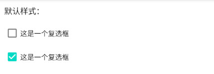

# 简介
CheckBox是一种复选框控件，具有“选中”与“未选中”两种状态。

本章示例代码详见以下链接：

- [🔗 示例工程：CheckBox](https://github.com/BI4VMR/Study-Android/tree/master/M03_UI/C03_CtrlBase/S06_CheckBox)

# 基本应用
CheckBox在布局文件中的典型配置如下文代码块所示：

"testui_base.xml":

```xml
<CheckBox
    android:layout_width="wrap_content"
    android:layout_height="wrap_content"
    android:layout_marginStart="10dp"
    android:text="这是一个复选框" />
```

此时运行示例程序，并查看界面外观：

<div align="center">



</div>

# 外观定制
## 基本样式
### 选中状态
以下属性与方法用于获取与设置CheckBox的选中状态：

- XML - 设置选中状态 : `android:checked="<true | false>"`
- Java - 设置选中状态 : `void setChecked()(boolean state)`
- Java - 获取选中状态 : `boolean isChecked()`

CheckBox的默认状态为“未选中”，对应的布尔值为"false"。

### 复选框颜色


复选框素材