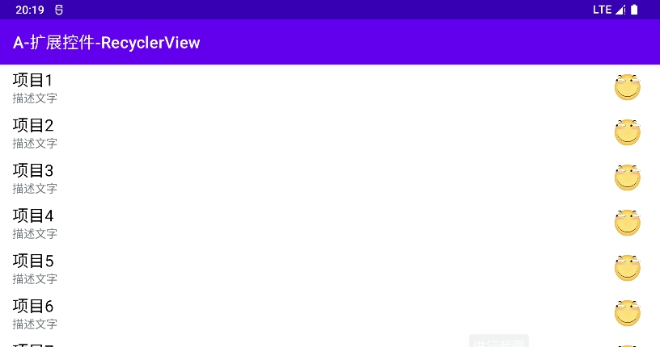
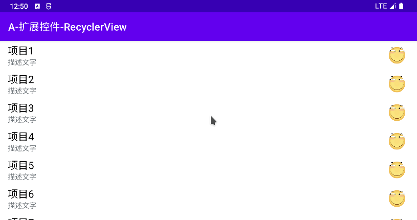
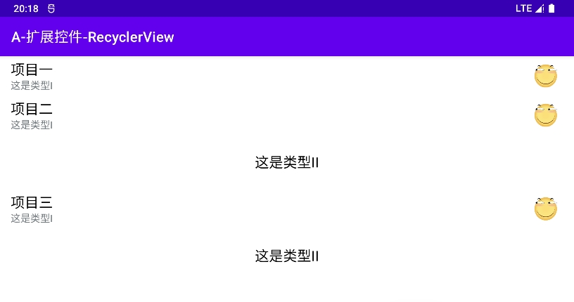
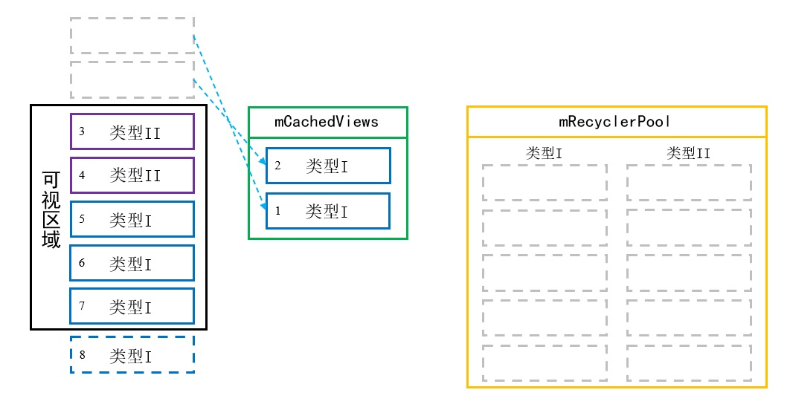
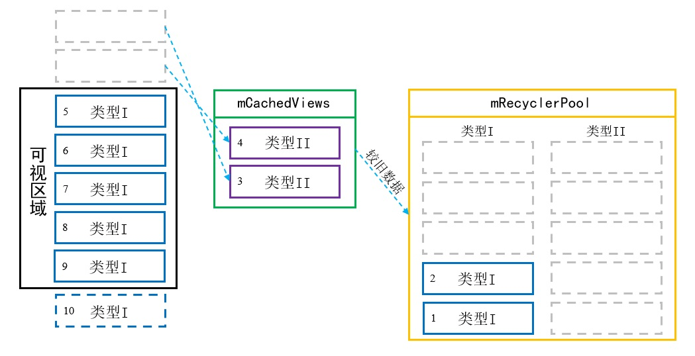
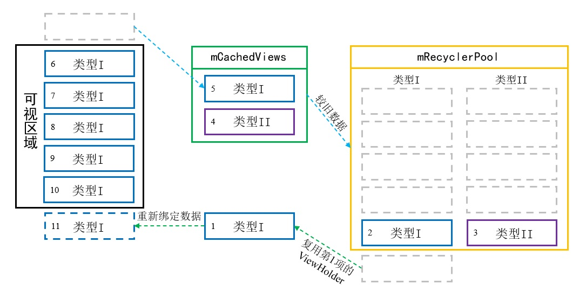

# 简介
RecyclerView是Google官方推出的新型控件，用于展示大量的列表数据，可以取代ListView和GridView。传统的ListView和GridView性能不佳，且扩展性较差，而RecyclerView采用了模块化设计，具有以下优点：

- 拥有多种布局管理器，表项的排列方式较为灵活。
- 内置多种动画效果，包括表项的添加、删除、交换位置等动画。
- 内置表项View的缓存与复用机制，性能较高。

RecyclerView已被作为基础组件包含在 `androidx.appcompat` 模块中，我们可以直接使用它。若需要单独指定版本，我们可以在项目的 `build.gradle` 配置文件中添加依赖声明语句：

"build.gradle":

```groovy
dependencies {
    implementation 'androidx.recyclerview:recyclerview:1.2.1'
}
```

上述内容也可以使用Kotlin语言编写：

"build.gradle.kts":

```groovy
dependencies {
    implementation("androidx.recyclerview:recyclerview:1.2.1")
}
```


# 基本应用
下文示例展示了RecyclerView的基本使用方法。

🔴 示例一：使用RecyclerView展示列表数据。

在本示例中，我们创建RecyclerView相关的类与布局文件，实现一个简单的列表。

第一步，我们创建布局文件 `list_item_simple.xml` ，描述每个表项的样式，本示例中的表项由一个TextView和一个ImageView组成。

"list_item_simple.xml":

```xml
<androidx.constraintlayout.widget.ConstraintLayout
    此处已省略部分代码... >

    <TextView
        android:id="@+id/tvTitle"
        此处已省略部分代码... />

    <ImageView
        android:id="@+id/ivIcon"
        此处已省略部分代码... />
</androidx.constraintlayout.widget.ConstraintLayout>
```

第二步，我们创建一个与表项元素匹配的实体类(View Object)，以便存放视图数据。

"SimpleVO.java":

```java
public class SimpleVO {

    // 对应表项的标题"tvTitle"
    private String title;

    /* 此处省略Get、Set与构造方法... */
}
```

上述内容也可以使用Kotlin语言编写：

"SimpleVOKT.kt":

```kotlin
data class SimpleVOKT(val title: String)
```

第三步，我们创建RecyclerView的适配器。

RecyclerView使用适配器模式管理视图与数据，我们需要创建一个适配器类，继承自RecyclerView.Adapter并重写父类的一些方法。

"MyAdapter.java":

```java
public class MyAdapter extends RecyclerView.Adapter<MyAdapter.MyViewHolder> {

    // 数据源
    private final List<SimpleVO> dataSource;

    // 构造方法
    public MyAdapter(List<SimpleVO> dataSource) {
        this.dataSource = dataSource;
    }

    // RecyclerView创建ViewHolder的回调方法
    @NonNull
    @Override
    public MyViewHolder onCreateViewHolder(@NonNull ViewGroup parent, int viewType) {
        LayoutInflater inflater = LayoutInflater.from(parent.getContext());

        /*
         * 将布局文件实例化为View对象。
         *
         * 此处的第三参数必须为"false"，因为控件将由ViewHolder控制Attach与Detach。
         */
        View view = inflater.inflate(R.layout.list_item_simple, parent, false);

        // 创建ViewHolder实例，并将View对象保存在其中。
        return new MyViewHolder(view);
    }

    // RecyclerView将数据与ViewHolder绑定的回调方法
    @Override
    public void onBindViewHolder(@NonNull MyViewHolder holder, int position) {
        holder.bindData();
    }

    // RecyclerView获取表项总数的回调方法
    @Override
    public int getItemCount() {
        return dataSource.size();
    }

    // 自定义ViewHolder类，内部保存了View实例，便于复用。
    public class MyViewHolder extends RecyclerView.ViewHolder {

        // 保存控件的引用，以便后续绑定数据。
        TextView tvTitle;
        ImageView ivIcon;

        // 初始化ViewHolder，获取各控件的引用，并保存在全局变量中，便于后续使用。
        public MyViewHolder(@NonNull View itemView) {
            super(itemView);
            tvTitle = itemView.findViewById(R.id.tvTitle);
            ivIcon = itemView.findViewById(R.id.ivIcon);
        }

        // 取出数据源集合中与当前表项位置对应的数据项，并更新View中的控件。
        public void bindData() {
            // 获取当前表项位置对应的数据项
            SimpleVO vo = dataSource.get(getAdapterPosition());
            // 将数据设置到视图中
            if (tvTitle != null) {
                tvTitle.setText(vo.getTitle());
            }
        }
    }
}
```

上述内容也可以使用Kotlin语言编写：

"SimpleVOKT.kt":

```kotlin
class MyAdapterKT(

    // 数据源
    private val mDataSource: MutableList<SimpleVOKT>
) : RecyclerView.Adapter<MyAdapterKT.MyViewHolder>() {

    // RecyclerView创建ViewHolder的回调方法
    override fun onCreateViewHolder(parent: ViewGroup, viewType: Int): MyViewHolder {
        val inflater: LayoutInflater = LayoutInflater.from(parent.context)

        /*
         * 将布局文件实例化为View对象。
         *
         * 此处的第三参数必须为"false"，因为控件将由ViewHolder控制Attach与Detach。
         */
        val itemView: View = inflater.inflate(R.layout.list_item_simple, parent, false)

        // 创建ViewHolder实例，并将View对象保存在其中。
        return MyViewHolder(itemView)
    }

    // RecyclerView将数据与ViewHolder绑定的回调方法
    override fun onBindViewHolder(holder: MyViewHolder, position: Int) {
        holder.bindData()
    }

    // RecyclerView获取表项总数的回调方法
    override fun getItemCount(): Int {
        return mDataSource.size
    }

    // 自定义ViewHolder类，内部保存了View实例，便于复用。
    inner class MyViewHolder(itemView: View) : RecyclerView.ViewHolder(itemView) {

        // 保存控件的引用，以便后续绑定数据。
        private var tvTitle: TextView? = null
        private var ivIcon: ImageView? = null

        // 初始化ViewHolder，获取各控件的引用，并保存在全局变量中，便于后续使用。
        init {
            tvTitle = itemView.findViewById(R.id.tvTitle)
            ivIcon = itemView.findViewById(R.id.ivIcon)
        }

        // 取出数据源集合中与当前表项位置对应的数据项，并更新View中的控件。
        fun bindData() {
            // 获取当前表项位置对应的数据项
            val vo: SimpleVOKT = mDataSource[adapterPosition]
            // 将数据设置到视图中
            tvTitle?.text = vo.title
        }
    }
}
```

适配器中的内部类MyViewHolder继承自RecyclerView.ViewHolder，用于保存View与控件的引用。RecyclerView在某些情况下可以利用已存在的ViewHolder实例及其中的View，不必重新创建View示例，以此达到复用的目的，提升性能。

我们创建的适配器必须重写三个方法，这些方法将在RecyclerView绘制表项时被回调，它们的作用如下文所示：

🔷 `int getItemCount()`

当RecyclerView绘制表项前，将会回调此方法。

我们通常使用List存放数据，所以本示例中返回的值是List的长度。

🔷 `void onCreateViewHolder(ViewGroup parent, int viewType)`

当RecyclerView创建新的ViewHolder时，将会回调此方法。

我们应当在此处创建表项对应的View，并封装进ViewHolder返回给RecyclerView。

第一参数 `parent` 是当前表项的视图容器，我们可以获取Context对象，并进一步获取LayoutInflater以便实例化View。第二参数 `viewType` 是表项类型，在本示例中仅有一种表项，我们可以忽略该参数。

🔷 `void onBindViewHolder(MyViewHolder holder, int position)`

当RecyclerView将View显示到屏幕上之前，将会回调此方法。

我们需要从数据源中根据位置索引找到对应的数据项，然后通过ViewHolder设置各个控件，实现View与数据的同步。

第一参数 `holder` 即ViewHolder对象，我们可以调用ViewHolder的 `bindData()` 方法，访问各个控件更新UI。第二参数 `position` 是表项在列表中的位置索引，由于列表与数据源有对应关系，我们也可以从数据源中取出数据项(View Object)，并更新ViewHolder中的控件。

第四步，我们将适配器与RecyclerView控件进行关联，并填充测试数据。

至此，表项的视图和数据已经在适配器中组装完毕，接下来我们在测试Activity中放置RecyclerView控件，并创建测试数据、加载适配器，一个基本的列表就编写完成了。

"testui_base.xml":

```xml
<FrameLayout
    此处已省略部分代码... >

    <androidx.recyclerview.widget.RecyclerView
        android:id="@+id/rvContent"
        android:layout_width="match_parent"
        android:layout_height="match_parent"
        tools:listitem="@layout/list_item_simple" />
</FrameLayout>
```

配置项 `tools:listitem="<布局ID>"` 的值可以是表项的布局文件，该属性将使RecyclerView在Android Studio的布局设计器中显示预览，便于开发者进行视觉设计。

"TestUIBase.java":

```java
// 制造测试数据
List<SimpleVO> datas = new ArrayList<>();
for (int i = 0; i < 20; i++) {
    datas.add(new SimpleVO("项目" + (i + 1)));
}

// 获取控件实例
RecyclerView recyclerView = findViewById(R.id.rvContent);
// 设置布局管理器
LinearLayoutManager linearLayoutManager = new LinearLayoutManager(this);
recyclerView.setLayoutManager(linearLayoutManager);
// 设置适配器
MyAdapter adapter = new MyAdapter(datas);
recyclerView.setAdapter(adapter);
```

上述内容也可以使用Kotlin语言编写：

"TestUIBaseKT.kt":

```kotlin
// 制造测试数据
val datas: MutableList<SimpleVOKT> = ArrayList()
for (i in 0..19) {
    datas.add(SimpleVOKT("项目" + (i + 1)))
}

// 获取控件实例
val recyclerView = findViewById<RecyclerView>(R.id.rvContent)
// 设置布局管理器
val linearLayoutManager = LinearLayoutManager(this)
recyclerView.layoutManager = linearLayoutManager
// 设置适配器
val adapter = MyAdapterKT(datas)
recyclerView.adapter = adapter
```

此处我们使用线性布局管理器，将表项以垂直列表的方式按顺序排列。

此时运行示例程序，并查看界面外观：

<div align="center">



</div>


# 外观定制
## 列表边缘滚动效果
当RecyclerView的内容滚动至边缘时，如果用户继续拖拽，控件将产生颜色效果提醒用户。

以下属性与方法用于获取与设置列表边缘滚动效果：

- XML - 设置列表边缘滚动效果 : `android:overScrollMode="< never | always | ifContentScrolls >"`
- Java - 设置列表边缘滚动效果 : `void setOverScrollMode(int overScrollMode)`
- Java - 获取列表边缘滚动效果 : `int getOverScrollMode()`

取值为 `always` 时总是显示阴影，这是默认值；取值为 `never` 时不显示阴影；取值为 `ifContentScrolls` 时，若边缘位置的子控件可滚动，则显示阴影，否则不显示。

## 滚动指示条
以下属性与方法用于获取与设置列表滚动条效果：

- XML - 设置需要显示的滚动条 : `android:scrollbars="< vertical | horizontal | none >"`
- Java - 设置是否显示垂直滚动条 : `void setVerticalScrollBarEnabled(boolean enable)`
- Java - 设置是否显示水平滚动条 : `void setHorizontalScrollBarEnabled(boolean enable)`
- Java - 获取是否显示垂直滚动条 : `boolean getVerticalScrollBarEnabled()`
- Java - 获取是否显示水平滚动条 : `boolean getHorizontalScrollBarEnabled()`


# 点击事件
RecyclerView本身没有实现表项的点击事件，这是因为RecyclerView可以支持多种布局复杂的表项，调用者可能希望为表项中不同的子控件设置各异的点击行为，由调用者自行控制事件更为灵活。

如果我们要为每个表项设置统一形式的点击监听器，可以在适配器中定义一个接口，调用者只需实现该接口，就能够接收事件回调。

🟠 示例二：为RecyclerView实现表项点击事件监听器。

在本示例中，我们为RecyclerView实现表项点击事件监听器。

第一步，我们在适配器中定义一个ItemClickListener接口，转发View的点击事件，为RecyclerView实现表项点击事件监听器。

"MyAdapter.java":

```java
public class MyAdapter extends RecyclerView.Adapter<MyAdapter.MyViewHolder> {

    /* 此处省略部分变量与方法... */

    // 数据源
    private final List<SimpleVO> dataSource;

    // 点击事件监听器的实现对象
    private ItemClickListener listener;

    /* 点击监听器 */
    public interface ItemClickListener {
        void onClick(int position, SimpleVO item);
    }

    // Set方法，调用者通过此处设置事件监听器实现。
    public void setItemClickListener(ItemClickListener listener) {
        this.listener = listener;
    }

    /* ViewHolder */
    class MyViewHolder extends RecyclerView.ViewHolder {

        /* 此处省略部分变量与方法... */

        public void bindData() {
            // 获取当前项的数据
            SimpleVO item = dataSource.get(getAdapterPosition());

            // 当根布局被点击时，触发监听器。
            itemView.setOnClickListener(v -> {
                if (listener != null) {
                    listener.onClick(getAdapterPosition(), item);
                }
            });
        }
    }
}
```

上述内容也可以使用Kotlin语言编写：

"MyAdapterKT.kt":

```java
class MyAdapterKT(

    // 数据源
    private val mDataSource: MutableList<SimpleVOKT>
) : RecyclerView.Adapter<MyAdapterKT.MyViewHolder>() {

    /* 此处省略部分变量与方法... */

    // 点击事件监听器的实现对象
    private var listener: ItemClickListener? = null

    /* 点击监听器 */
    fun interface ItemClickListener {
        fun onClick(index: Int, data: SimpleVOKT)
    }

    // Set方法，调用者通过此处设置事件监听器实现。
    fun setItemClickListener(listener: ItemClickListener?) {
        this.listener = listener
    }

    /* ViewHolder */
    inner class MyViewHolder(itemView: View) : RecyclerView.ViewHolder(itemView) {

        /* 此处省略部分变量与方法... */

        fun bindData() {
            // 获取当前表项位置对应的数据项
            val vo: SimpleVOKT = mDataSource[adapterPosition]

            // 当根布局被点击时，触发监听器。
            itemView.setOnClickListener {
                listener?.onClick(adapterPosition, vo)
            }
        }
    }
}
```

在ViewHolder的 `bindData()` 方法中，我们给表项的View设置了点击事件监听器，一旦其收到点击事件，就会通过ItemClickListener的 `onClick()` 方法，将事件转发给调用者。

> ⚠️ 警告
>
> 当前表项的位置必须使用ViewHolder的 `getAdapterPosition()` 方法即时获取，而不能使用 `onBindViewHolder()` 的 `position` 参数。
>
> 由于RecyclerView存在复用机制，表项在可视区域发生移位后，并不会触发 `onBindViewHolder()` 方法，因此如果我们向外通知 `onBindViewHolder()` 的 `position` 参数，监听者只能得到该表项移动之前的初始位置，与实际位置不符。

第二步，我们在测试Activity中实现ItemClickListener接口，以接收表项的点击事件回调。

"TestUIClickEvent.java":

```java
// 设置适配器
MyAdapter adapter = new MyAdapter(getApplicationContext(), datas);
recyclerView.setAdapter(adapter);
// 设置表项点击监听器
adapter.setItemClickListener((position, item) -> {
    // “表项点击”事件回调
    Toast.makeText(this, "表项" + (position + 1), Toast.LENGTH_SHORT)
            .show();
});
```

上述内容也可以使用Kotlin语言编写：

"TestUIClickEventKT.kt":

```kotlin
// 设置适配器
val adapter = MyAdapterKT(datas)
recyclerView.adapter = adapter
// 设置表项点击监听器
adapter.setItemClickListener { position: Int, _: SimpleVOKT ->
    // “表项点击”事件回调
    Toast.makeText(this, "表项" + (position + 1), Toast.LENGTH_SHORT)
        .show()
}
```

此时运行示例程序，并查看界面外观：

<div align="center">



</div>


# 加载多种表项
RecyclerView支持加载多种不同的表项，具有较高的灵活度。当RecyclerView绘制表项时，首先会调用适配器的 `getItemViewType(int position)` 方法，确定当前位置需要绘制的表项类型，然后再调用 `onCreateViewHolder(ViewGroup parent, int viewType)` 方法创建View实例，此处的第二参数 `viewType` 参数就是 `getItemViewType(int position)` 的返回值，我们需要根据该数值创建对应类型的View实例。

🟡 示例三：为RecyclerView添加多种类型的表项。

在本示例中，我们以前文“示例一”为基础，改造适配器，使其加载两种样式不同的表项。

第一步，我们创建一个接口，定义获取ViewType数值的抽象方法，要求所有的数据项实现该接口，以保持一致性。

"ListItem.java":

```java
public interface ListItem {

    // 获取当前表项的类型
    int getViewType();
}
```

上述内容也可以使用Kotlin语言编写：

"ListItemKT.kt":

```kotlin
interface ListItemKT {

    // 获取当前表项的类型
    fun getItemType(): Int
}
```

此处我们直接使用数字定义ViewType，在实际应用中，由于表项类型都是已知的，我们也可以将ViewType定义成枚举，避免不规范的传值。

第二步，我们对前文示例的布局与实体类进行修改，创建两种不同的表项。

我们首先定义第一种表项，布局文件名为 `list_item_type1.xml` ，其中拥有两个TextView控件，对应的实体类为Type1VO，ViewType值固定为 `1` 。

"Type1VO.java":

```java
public class Type1VO implements ListItem {

    private String title;
    private String info;

    /* 此处省略Get、Set与构造方法... */

    @Override
    public int getViewType() {
        return 1;
    }
}
```

上述内容也可以使用Kotlin语言编写：

"Type1VOKT.kt":

```kotlin
data class Type1VOKT(
    val title: String,
    val info: String = "-"
) : ListItemKT {

    override fun getItemType(): Int {
        return 1
    }
}
```

然后定义第二种表项，布局文件名为 `list_item_type2.xml` ，其中仅有一个居中的TextView控件，对应的实体类为Type2VO，ViewType值固定为 `2` 。

"Type2VO.java":

```java
public class Type2VO implements ListItem {

    private String info;

    /* 此处省略Get、Set与构造方法... */

    @Override
    public int getViewType() {
        return 2;
    }
}
```
上述内容也可以使用Kotlin语言编写：

"Type2VOKT.kt":

```kotlin
data class Type2VOKT(
    val info: String
) : ListItemKT {

    override fun getItemType(): Int {
        return 2
    }
}
```

第三步，我们对前文示例的适配器进行修改，重写 `getItemViewType()` 方法，并重新编写 `onCreateViewHolder()` 方法和 `onBindViewHolder()` 方法。

首先，我们将数据源列表的类型改为ListItem，并重写 `getItemViewType()` 方法，在此处调用ListItem中的方法获取表项类型。

"MyAdapter.java":

```java
public class MyAdapter extends RecyclerView.Adapter<RecyclerView.ViewHolder> {

    // 数据源
    private final List<ListItem> dataSource;

    // 获取当前位置的Item类型
    @Override
    public int getItemViewType(int position) {
        // 我们约定所有列表项都实现ListItem接口，因此可以调用其中的方法获取ViewType。
        return dataSource.get(position).getViewType();
    }
}
```

上述内容也可以使用Kotlin语言编写：

"MyAdapterKT.kt":

```kotlin
class MyAdapterKT(

    // 数据源
    private val mDataSource: MutableList<ListItemKT>
) : RecyclerView.Adapter<RecyclerView.ViewHolder>() {

    // 获取当前位置的Item类型
    override fun getItemViewType(position: Int): Int {
        // 我们约定所有列表项都实现ListItem接口，因此可以调用其中的方法获取ViewType。
        return mDataSource[position].getItemType()
    }
}
```

接下来，我们创建两种表项对应的ViewHolder，实现UI与数据的同步。

"MyAdapter.java":

```java
public class MyAdapter extends RecyclerView.Adapter<RecyclerView.ViewHolder> {

    // 第一种表项的ViewHolder
    class Type1VH extends RecyclerView.ViewHolder {

        TextView tvTitle;
        TextView tvInfo;

        public Type1VH(@NonNull View itemView) {
            super(itemView);
            tvTitle = itemView.findViewById(R.id.tvTitle);
            tvInfo = itemView.findViewById(R.id.tvInfo);
        }

        public void bindData() {
            Type1VO vo = (Type1VO) dataSource.get(getAdapterPosition());
            tvTitle.setText(vo.getTitle());
            tvInfo.setText(vo.getInfo());
        }
    }

    // 第二种表项的ViewHolder
    class Type2VH extends RecyclerView.ViewHolder {

        TextView tvInfo;

        public Type2VH(@NonNull View itemView) {
            super(itemView);
            tvInfo = itemView.findViewById(R.id.tvInfo);
        }

        public void bindData() {
            Type2VO vo = (Type2VO) dataSource.get(getAdapterPosition());
            tvInfo.setText(vo.getInfo());
        }
    }
}
```

上述内容也可以使用Kotlin语言编写：

"MyAdapterKT.kt":

```kotlin
class MyAdapterKT(
    private val mDataSource: MutableList<ListItemKT>
) : RecyclerView.Adapter<RecyclerView.ViewHolder>() {

    /**
     * 第一种表项的ViewHolder。
     */
    inner class Type1VH(itemView: View) : RecyclerView.ViewHolder(itemView) {

        private var tvTitle: TextView? = null
        private var tvInfo: TextView? = null

        init {
            tvTitle = itemView.findViewById(R.id.tvTitle)
            tvInfo = itemView.findViewById(R.id.ivIcon)
        }

        fun bindData() {
            val vo: Type1VOKT = mDataSource[adapterPosition] as Type1VOKT
            tvTitle?.text = vo.title
            tvInfo?.text = vo.info
        }
    }

    /**
     * 第二种表项的ViewHolder。
     */
    inner class Type2VH(itemView: View) : RecyclerView.ViewHolder(itemView) {

        private var tvInfo: TextView? = null

        init {
            tvInfo = itemView.findViewById(R.id.ivIcon)
        }

        fun bindData() {
            val vo: Type2VOKT = mDataSource[adapterPosition] as Type2VOKT
            tvInfo?.text = vo.info
        }
    }
}
```

最后，我们修改 `onCreateViewHolder()` 与 `onBindViewHolder()` 方法的实现。

"MyAdapter.java":

```java
public class MyAdapter extends RecyclerView.Adapter<RecyclerView.ViewHolder> {

    @NonNull
    @Override
    public RecyclerView.ViewHolder onCreateViewHolder(@NonNull ViewGroup parent, int viewType) {
        LayoutInflater inflater = LayoutInflater.from(parent.getContext());

        RecyclerView.ViewHolder vh;
        // 根据ViewType参数创建对应的视图实例与ViewHolder
        switch (viewType) {
            case 1: {
                View view = inflater.inflate(R.layout.list_item_type1, parent, false);
                vh = new Type1VH(view);
            }
            break;
            case 2: {
                View view = inflater.inflate(R.layout.list_item_type2, parent, false);
                vh = new Type2VH(view);
            }
            break;
            default:
                throw new IllegalArgumentException("Unknown view type [" + viewType + "]!");
        }

        return vh;
    }

    @Override
    public void onBindViewHolder(@NonNull RecyclerView.ViewHolder holder, int position) {
        if (holder instanceof Type1VH) {
            ((Type1VH) holder).bindData();
        } else if (holder instanceof Type2VH) {
            ((Type2VH) holder).bindData();
        } else {
            Log.w("Test", "Unknown ViewHolder!");
        }
    }
}
```

上述内容也可以使用Kotlin语言编写：

"MyAdapterKT.kt":

```kotlin
class MyAdapterKT(
    private val mDataSource: MutableList<ListItemKT>
) : RecyclerView.Adapter<RecyclerView.ViewHolder>() {

    override fun onCreateViewHolder(parent: ViewGroup, viewType: Int): RecyclerView.ViewHolder {
        val inflater: LayoutInflater = LayoutInflater.from(parent.context)

        val vh: RecyclerView.ViewHolder
        // 根据ViewType参数创建对应的视图实例与ViewHolder
        when (viewType) {
            1 -> {
                val view: View = inflater.inflate(R.layout.list_item_type1, parent, false)
                vh = Type1VH(view)
            }
            2 -> {
                val view: View = inflater.inflate(R.layout.list_item_type2, parent, false)
                vh = Type1VH(view)
            }
            else -> {
                throw IllegalArgumentException("Unknown view type [$viewType]!")
            }
        }
        return vh
    }

    override fun onBindViewHolder(holder: RecyclerView.ViewHolder, position: Int) {
        when (holder) {
            is Type1VH -> {
                holder.bindData()
            }
            is Type2VH -> {
                holder.bindData()
            }
            else -> {
                Log.w("Test", "Unknown ViewHolder!")
            }
        }
    }
}
```

在 `onCreateViewHolder()` 方法中，我们根据 `viewType` 参数的值，渲染对应的XML文件并创建ViewHolder；在 `onBindViewHolder()` 方法中，我们判断ViewHolder的实际类型，并调用对应的 `bindData()` 方法刷新数据。

第四步，我们在测试Activity中制造一些数据，并加载至RecyclerView中。

"TestUIViewType.java":

```java
// 制造测试数据
List<ListItem> datas = new ArrayList<>();
datas.add(new Type1VO("项目一", "这是类型I"));
datas.add(new Type1VO("项目二", "这是类型I"));
datas.add(new Type2VO("这是类型II"));
datas.add(new Type1VO("项目三", "这是类型I"));
datas.add(new Type2VO("这是类型II"));

// 获取控件实例
RecyclerView recyclerView = findViewById(R.id.rvContent);
// 设置布局管理器
LinearLayoutManager linearLayoutManager = new LinearLayoutManager(this);
recyclerView.setLayoutManager(linearLayoutManager);
// 设置适配器
MyAdapter adapter = new MyAdapter(datas);
recyclerView.setAdapter(adapter);
```

上述内容也可以使用Kotlin语言编写：

"TestUIViewTypeKT.kt":

```kotlin
// 制造测试数据
val datas: MutableList<ListItemKT> = ArrayList()
datas.add(Type1VOKT("项目一", "这是类型I"))
datas.add(Type1VOKT("项目二", "这是类型I"))
datas.add(Type2VOKT("这是类型II"))
datas.add(Type1VOKT("项目三", "这是类型I"))
datas.add(Type2VOKT("这是类型II"))
for (i in 1..5) {
    datas.add(Type1VOKT("项目$i"))
}

// 获取控件实例
val recyclerView = findViewById<RecyclerView>(R.id.rvContent)
// 设置布局管理器
val linearLayoutManager = LinearLayoutManager(this)
recyclerView.layoutManager = linearLayoutManager
// 设置适配器
val adapter = MyAdapterKT(datas)
recyclerView.adapter = adapter
```

此处我们向列表中添加5个项目，它们的类型依次是 `1, 1, 2, 1, 2` 。

此时运行示例程序，并查看界面外观：

<div align="center">



</div>


# 动态更新表项
## 简介
RecyclerView中的内容初始加载完成后，我们还可以动态地向列表中插入新的项或者删除某个已存在的项，此时需要使用RecyclerView的Adapter提供的 `notify` 系列方法，这些方法能够定向刷新受影响的表项，避免全表重新加载，提高系统性能；并且这些方法提供了默认动画效果，能够提升用户的视觉体验。

Adapter的 `notify` 系列方法将会触发RecyclerView的 `onBindViewHolder()` 回调方法进行界面更新，因此我们在调用这些方法之前应当首先更改数据源。

Adapter的 `notify` 系列方法只对已显示的表项有效，对于未显示的表项则没有效果，因为表项不可见时刷新界面没有意义，当表项变为可见时RecyclerView将会回调 `onBindViewHolder()` 方法刷新界面。

## 更新表项
Adapter的 `notifyItemChanged(int position)` 方法用于更新指定的表项，此方法使得位置为 `position` 的表项被重新绘制。

我们可以在Adapter中定义以下方法，以便调用者更新表项：

"MyAdapter.java":

```java
public void updateItem(int position, SimpleVO item) {
    // 更新数据源
    dataSource.set(position, item);
    // 通知RecyclerView指定表项被更改，刷新控件显示。
    notifyItemChanged(position);
}
```

上述内容也可以使用Kotlin语言编写：

"MyAdapterKT.kt":

```kotlin
fun updateItem(position: Int, data: SimpleVOKT) {
    // 更新数据源
    mDataSource[position] = data
    // 通知RecyclerView新的表项被插入，刷新控件显示。
    notifyItemChanged(position)
}
```

Adapter还提供了 `notifyItemRangeChanged(int position, int count)` 方法，它可以批量刷新自 `position` 开始的 `count` 个表项。

## 插入表项
Adapter的 `notifyItemInserted(int position)` 方法用于向 `position` 指定的位置插入新表项，若插入时该位置已存在表项，则将该表项及后继表项都向后移动一位。

我们可以在Adapter中定义以下方法，以便调用者插入表项：

"MyAdapter.java":

```java
public void addItem(int position, SimpleVO item) {
    // 更新数据源
    dataSource.add(position, data);
    // 通知RecyclerView新的表项被插入，刷新控件显示。
    notifyItemInserted(position);
}
```

上述内容也可以使用Kotlin语言编写：

"MyAdapterKT.kt":

```kotlin
fun addItem(position: Int, data: SimpleVOKT) {
    // 更新数据源
    mDataSource.add(position, data)
    // 通知RecyclerView新的表项被插入，刷新控件显示。
    notifyItemInserted(position)
}
```

Adapter还提供了 `notifyItemRangeInserted(int position, int count)` 方法，它表示从 `position` 开始插入 `count` 个表项。

## 移除表项
Adapter的 `notifyItemRemoved(int position)` 方法用于移除 `position` 位置的表项。

我们可以在Adapter中定义以下方法，以便调用者移除表项：

"MyAdapter.java":

```java
public void removeItem(int position) {
    // 更新数据源
    dataSource.remove(position);
    // 通知RecyclerView指定的表项被移除，刷新控件显示。
    notifyItemRemoved(position);
}
```

上述内容也可以使用Kotlin语言编写：

"MyAdapterKT.kt":

```kotlin
fun removeItem(position: Int) {
    // 更新数据源
    mDataSource.removeAt(position)
    // 通知RecyclerView指定的表项被移除，刷新控件显示。
    notifyItemRemoved(position)
}
```

Adapter还提供了 `notifyItemRangeRemoved(int position, int count)` 方法，它表示从 `position` 开始移除 `count` 个表项。

## 移动表项位置
Adapter的 `notifyItemMoved(int fromPosition, int toPosition)` 方法用于将表项从原位置移动到新位置。

"MyAdapter.java":

```java
public void moveItem(int srcPosition, int dstPosition) {
    // 如果源位置与目标位置相同，则无需移动。
    if (srcPosition == dstPosition) {
        return;
    }

    // 更新数据源
    Collections.swap(dataSource, srcPosition, dstPosition);
    //通知RecyclerView表项被移动，刷新控件显示。
    notifyItemMoved(srcPosition, dstPosition);
}
```

上述内容也可以使用Kotlin语言编写：

"MyAdapterKT.kt":

```kotlin
fun moveItem(srcPosition: Int, dstPosition: Int) {
    // 如果源位置与目标位置相同，则无需移动。
    if (srcPosition == dstPosition) {
        return
    }

    // 更新数据源
    Collections.swap(mDataSource, srcPosition, dstPosition)
    // 通知RecyclerView表项被移动，刷新控件显示。
    notifyItemMoved(srcPosition, dstPosition)
}
```

## 重新加载列表
如果数据源发生大范围变化，我们可以使用Adapter的 `notifyDataSetChanged()` 方法，刷新所有表项。此方法的性能最低，并且没有动画效果；代码中出现此方法时编译器将会产生警告，如果业务确实需要调用它，我们可以添加SuppressLint注解抑制警告。

"MyAdapter.java":

```java
@SuppressLint("NotifyDataSetChanged")
public void reloadItem(List<ItemBean> newDatas) {
    // 清空数据源
    dataSource.clear();
    // 重新填充数据源
    dataSource.addAll(newDatas);
    // 通知RecyclerView数据源改变
    notifyDataSetChanged();
}
```

上述内容也可以使用Kotlin语言编写：

"MyAdapterKT.kt":

```kotlin
@SuppressLint("NotifyDataSetChanged")
fun reloadItems(newDatas: List<SimpleVOKT>) {
    // 清空数据源
    mDataSource.clear()
    // 重新填充数据源
    mDataSource.addAll(newDatas)
    // 通知RecyclerView数据源改变
    notifyDataSetChanged()
}
```

## 局部刷新
虽然Adapter的 `notifyItemChanged(int position)` 方法能够更新表项，但它会使表项的所有子控件重新与数据项绑定，导致整个表项画面闪烁，降低用户体验。有时我们只需要精确地更新子控件的部分属性，此时可以使用局部刷新机制，解决画面闪烁的问题并提高性能。

RecyclerView的Adapter中有一个 `onBindViewHolder(ViewHolder holder, int position, List<Object> payloads)` 回调方法，第三参数 `payloads` 是一个不为空值的列表，如果该列表中存在元素，说明此时表项需要局部更新，我们可以将元素取出并据此更新子控件；如果该列表中没有元素，说明此时表项需要整体更新，我们可以调用具有两个参数的 `onBindViewHolder()` 方法。

Adapter的 `notifyItemChanged(int position, Object payload)` 方法用于触发局部更新，第一参数 `position` 表示目标表项位置，第二参数 `payload` 表示更新指令，它的数据类型没有限制，因此我们可以自由地定义更新规则。

🟢 示例四：为RecyclerView添加局部刷新能力。

在本示例中，我们对前文示例进行改造，使其支持局部刷新能力。

第一步，我们对ViewHolder进行修改，使其拥有单独更新每个控件属性的能力。

"MyAdapter.java":

```java
public static class MyViewHolder extends RecyclerView.ViewHolder {

    TextView tvTitle;
    TextView tvInfo;

    public MyViewHolder(@NonNull View itemView) {
        super(itemView);
        tvTitle = itemView.findViewById(R.id.tvTitle);
        tvInfo = itemView.findViewById(R.id.tvInfo);
    }

    public void bindData(ItemVO vo) {
        updateTitle(vo);
        updateInfo(vo);
    }

    public void updateTitle(ItemVO vo) {
        tvTitle.setText(vo.getTitle());
    }

    public void updateInfo(ItemVO vo) {
        tvInfo.setText(vo.getInfo());
    }
}
```

上述内容也可以使用Kotlin语言编写：

"MyAdapterKT.kt":

```kotlin
inner class MyViewHolder(itemView: View) : RecyclerView.ViewHolder(itemView) {

    private var tvTitle: TextView? = null
    private var tvInfo: TextView? = null

    init {
        tvTitle = itemView.findViewById(R.id.tvTitle)
        tvInfo = itemView.findViewById(R.id.tvInfo)
    }

    fun bindData(vo: ItemVOKT) {
        updateTitle(vo)
        updateInfo(vo)
    }

    fun updateTitle(vo: ItemVOKT) {
        tvTitle?.text = vo.title
    }

    fun updateInfo(vo: ItemVOKT) {
        tvInfo?.text = vo.info
    }
}
```

`updateTitle()` 方法和 `updateInfo()` 方法分别用于更新ViewHolder的标题文字与说明文字，原本的数据绑定方法 `bindData()` 则改为调用 `updateTitle()` 方法和 `updateInfo()` 方法。

第二步，我们定义一些常量与ViewHolder中的 `updateTitle()` 方法和 `updateInfo()` 方法对应。

"UpdateFlags.java":

```java
public class UpdateFlags {
    public static final int FLAG_TITLE = 0x01;
    public static final int FLAG_INFO = FLAG_TITLE << 1;
}
```

上述内容也可以使用Kotlin语言编写：

"UpdateFlagsKT.kt":

```kotlin
object UpdateFlagsKT {
    const val FLAG_TITLE = 0x01
    const val FLAG_INFO = FLAG_TITLE shl 1
}
```

每个数值的二进制位互不重叠，因此我们可以灵活地组合使用它们，表示需要更新的属性。

第三步，我们在Adapter中重写具有三个参数的 `onBindViewHolder()` 方法，实现局部更新逻辑。

"MyAdapter.java":

```java
@Override
public void onBindViewHolder(@NonNull MyViewHolder holder, int position, @NonNull List<Object> payloads) {
    // 如果Payload列表内容为空，则执行普通的 `onBindViewHolder()` 方法。
    if (payloads.isEmpty()) {
        onBindViewHolder(holder, position);
        return;
    }

    // 短时间内多次更新同一表项时，Payload列表中可能有多个项，可以根据需要选择其中的一项。
    Object data = payloads.get(payloads.size() - 1);
    // 如果Payload不能被解析为Flags，则忽略。
    if (!(data instanceof Integer)) {
        Log.d("TestApp", "Payload type is unknown.");
        return;
    }

    int flags = (Integer) data;
    Log.d("TestApp", "Payload flags:[" + flags + "]");
    ItemVO vo = dataSource.get(holder.getAdapterPosition());
    if ((flags & UpdateFlagsKT.FLAG_TITLE) != 0) {
        holder.updateTitle(vo);
    }
    if ((flags & UpdateFlagsKT.FLAG_INFO) != 0) {
        holder.updateInfo(vo);
    }
}
```

上述内容也可以使用Kotlin语言编写：

"MyAdapterKT.kt":

```kotlin
override fun onBindViewHolder(holder: MyViewHolder, position: Int, payloads: MutableList<Any>) {
    // 如果Payload列表内容为空，则执行普通的 `onBindViewHolder()` 方法。
    if (payloads.isEmpty()) {
        onBindViewHolder(holder, position)
        return
    }

    // 短时间内多次更新同一表项时，Payload列表中可能有多个项，可以根据需要选择其中的一项。
    val flags: Any = payloads.last()
    // 如果Payload不能被解析为Flags，则忽略。
    if (flags !is Int) {
        Log.d("TestApp", "Payload type is unknown.")
        return
    }

    Log.d("TestApp", "Payload flags:[$flags]")
    val vo: ItemVOKT = mDataSource[holder.adapterPosition]
    if (flags and UpdateFlagsKT.FLAG_TITLE != 0) {
        holder.updateTitle(vo)
    }
    if ((flags and UpdateFlagsKT.FLAG_INFO) != 0) {
        holder.updateInfo(vo)
    }
}
```

我们使用与运算判断外部传入的Payload值是否包含具体的属性标志位，如果标志位被置为 `1` 则调用ViewHolder中的对应方法刷新界面。

第四步，我们在Adapter中提供一个方法，将更新数据源与 `notifyItemChanged()` 调用逻辑封装在一起，便于调用者使用。

"MyAdapter.java":

```java
public void updateItem(int position, ItemVO data, int flags) {
    // 更新数据源
    dataSource.set(position, data);
    // 通知RecyclerView指定表项被更改，刷新控件显示。
    notifyItemChanged(position, flags);
}
```

上述内容也可以使用Kotlin语言编写：

"MyAdapterKT.kt":

```kotlin
fun updateItem(position: Int, data: ItemVOKT, flags: Int) {
    // 更新数据源
    mDataSource[position] = data
    // 通知RecyclerView指定表项被更改，刷新控件显示。
    notifyItemChanged(position, flags)
}
```

第五步，我们在测试Activity中制造一些初始数据加载至RecyclerView，并通过两个按钮触发局部更新逻辑。

"TestUIUpdateItem.java":

```java
// 改变第二项标题的按钮
btChange1.setOnClickListener(v -> {
    // 获取原表项
    ItemVO oldData = adapter.getDataSource().get(1);
    ItemVO newData = new ItemVO();
    // 修改标题
    newData.setTitle("这是新的标题");
    // 复制未改变变的属性
    newData.setInfo(oldData.getInfo());

    // 调用局部更新方法，指明需要更新标题。
    adapter.updateItem(1, newData, UpdateFlags.FLAG_TITLE);
});

// 改变第四项的按钮
btChange2.setOnClickListener(v -> {
    ItemVO newData = new ItemVO();
    newData.setTitle("这是新的标题");
    newData.setInfo("这是新的描述");

    // 调用局部更新方法，指明需要更新标题与描述。
    adapter.updateItem(3, newData, UpdateFlags.FLAG_TITLE | UpdateFlags.FLAG_INFO);
});
```

上述内容也可以使用Kotlin语言编写：

"TestUIUpdateItemKT.kt":

```kotlin
// 改变第二项标题的按钮
btChange1.setOnClickListener { _ ->
    // 获取原表项
    val oldItem = adapter.getDataSource()[1]
    val newItem = ItemVOKT()
    // 修改标题
    newItem.title = "这是新的标题"
    // 复制未改变变的属性
    newItem.info = oldItem.info

    // 调用局部更新方法，指明需要更新标题。
    adapter.updateItem(1, newItem, UpdateFlagsKT.FLAG_TITLE)
}

// 改变第四项的按钮
btChange2.setOnClickListener { _ ->
    val newItem = ItemVOKT()
    newItem.title = "这是新的标题"
    newItem.info = "这是新的描述"

    // 调用局部更新方法，指明需要更新标题与描述。
    adapter.updateItem(3, newItem, UpdateFlagsKT.FLAG_TITLE or UpdateFlagsKT.FLAG_INFO)
}
```

第一个按钮只更新表项的标题，因此我们复制原表项并修改标题，然后通过 `FLAG_TITLE` 标志位指明需要更新标题；第二个按钮同时更新了标题和说明文本，因此我们传入新的数据项，并使用或运算同时设置 `FLAG_TITLE` 与 `FLAG_INFO` 标志位。


# DiffUtil
## 简介
DiffUtil是RecyclerView提供的辅助工具，它可以对比新旧数据源的内容，记录它们之间的差异，并且自动调用适配器的 `notify` 系列方法，将列表更新至最新状态。

## 基本应用
若要使用DiffUtil，我们首先需要创建一个自定义类并继承DiffUtil.Callback，在该类中配置新旧表项的对比规则。

🔵 示例五：通过DiffUtil实现差异对比。

在本示例中，我们通过DiffUtil，实现自动差异对比与列表刷新功能。

第一步，我们创建DiffUtil.Callback的子类，实现其中的抽象方法。

"MyDiffCallback.java":

```java
public class MyDiffCallback extends DiffUtil.Callback {

    private final List<ItemVO> oldList;
    private final List<ItemVO> newList;

    public MyDiffCallback(List<ItemVO> oldList, List<ItemVO> newList) {
        this.oldList = oldList;
        this.newList = newList;
    }

    @Override
    public int getOldListSize() {
        return oldList.size();
    }

    @Override
    public int getNewListSize() {
        return newList.size();
    }

    @Override
    public boolean areItemsTheSame(int oldItemPosition, int newItemPosition) {
        // 此处只有一种表项类型，视图都可复用，直接返回 `true` 即可。
        return true;
    }

    @Override
    public boolean areContentsTheSame(int oldItemPosition, int newItemPosition) {
        ItemVO oldItem = oldList.get(oldItemPosition);
        ItemVO newItem = newList.get(newItemPosition);
        // 比较二者的内容是否相同
        return oldItem.equals(newItem);
    }
}
```

上述内容也可以使用Kotlin语言编写：

"MyDiffCallbackKT.kt":

```kotlin
class MyDiffCallbackKT(
    private val oldList: List<ItemVOKT>,
    private val newList: List<ItemVOKT>
) : DiffUtil.Callback() {

    override fun getOldListSize(): Int {
        return oldList.size
    }

    override fun getNewListSize(): Int {
        return newList.size
    }

    override fun areItemsTheSame(oldItemPosition: Int, newItemPosition: Int): Boolean {
        // 此处只有一种表项类型，视图都可复用，直接返回 `true` 即可。
        return true
    }

    override fun areContentsTheSame(oldItemPosition: Int, newItemPosition: Int): Boolean {
        // 比较二者的内容是否相同
        return oldList[oldItemPosition] == newList[newItemPosition]
    }
}
```

DiffUtil对比表项差异前，首先调用 `getOldListSize()` 方法与 `getNewListSize()` 方法，获取新旧数据源列表的长度。

DiffUtil对比表项差异时，首先调用 `areItemsTheSame()` 方法判断两个表项的类型是否相同，返回值为 `false` 时，表示两个表项类型不同，无法复用其视图；返回值为 `true` 表示两个表项相同，可以复用其视图。此处只有单一类型的表项，因此我们直接返回 `true` 即可。

如果两个表项类型相同，DiffUtil会继续调用 `areContentsTheSame()` 方法判断表项的属性是否发生变化，返回值为 `true` 时表示两个表项内容相同，不必刷新该条目；返回值为 `false` 表示两个表项内容不同，需要刷新该条目。通常我们只需比较影响界面显示的属性，忽略其他属性，这种做法可以略微提升性能。

第二步，我们在Adapter中封装差异比较与更新视图的方法。

我们需要通过DiffUtil的 `calculateDiff()` 方法执行差异计算操作，此方法的返回值是一个DiffUtil.DiffResult类型的实例，它的 `dispatchUpdatesTo()` 方法可以直接将变化应用到RecyclerView适配器，完成列表的刷新工作。

"MyAdapter.java":

```java
public void updateData(List<ItemVO> newDatas) {
    // 对比新旧列表的差异
    DiffUtil.DiffResult diffResult = DiffUtil.calculateDiff(new MyDiffCallback(dataSource, newDatas));
    // 更新数据源
    dataSource.clear();
    dataSource.addAll(newDatas);
    // 更新视图
    diffResult.dispatchUpdatesTo(this);
}
```

上述内容也可以使用Kotlin语言编写：

"MyAdapterKT.kt":

```kotlin
fun updateData(newDatas: List<ItemVOKT>) {
    // 对比新旧列表的差异
    val diffResult = DiffUtil.calculateDiff(MyDiffCallbackKT(mDataSource, newDatas))
    // 更新数据源
    mDataSource.clear()
    mDataSource.addAll(newDatas)
    // 更新视图
    diffResult.dispatchUpdatesTo(this)
}
```

在调用 `dispatchUpdatesTo()` 方法更新列表之前，我们应当先更新适配器的数据集，因为该方法本质上是通过 `notify` 系列方法更新界面的，而 `notify` 系列方法依赖最新的数据源绘制表项，如果操作顺序不当，可能会产生 `Inconsistency detected` 错误并导致程序崩溃。

`calculateDiff()` 方法默认会检测新旧列表的表项是否发生了移动，如果列表中已有表项的位置总是固定不变，或者新旧表项以相同的规则排序，我们可以调用 `calculateDiff(DiffUtil.Callback cb, boolean detectMoves)` 方法，并将第二参数 `detectMoves` 设为 `false` 关闭移动检测功能，提升计算速度。

## 局部刷新
在前文“示例五”中，我们只实现了DiffUtil.Callback的两个抽象方法，此时若检测到表项发生变化，DiffUtil会调用Adapter的 `notifyItemChanged(int position)` 方法刷新整个表项，这种方式性能较低，不适合用来构建具有复杂布局的列表。

DiffUtil.Callback的 `getChangePayload()` 方法用于实现局部刷新，当 `areContentsTheSame()` 方法返回 `false` 时，DiffUtil会在 `dispatchUpdatesTo()` 阶段回调 `Object getChangePayload(int oldItemPosition, int newItemPosition)` 方法，并将返回值作为 `payload` 参数传递给Adapter的 `notifyItemChanged(int position, Object payload)` 方法，我们可以在此处编写检测表项局部变化的逻辑代码，配合Adapter实现局部刷新功能。

🟣 示例六：通过DiffUtil实现局部刷新。

在本示例中，我们通过DiffUtil，实现表项的局部刷新。

第一步，我们在前文“示例五”的基础上进行扩展，为其添加局部刷新功能。

"MyDiffCallback.java":

```java
@Nullable
@Override
public Object getChangePayload(int oldItemPosition, int newItemPosition) {
    ItemVO oldItem = oldList.get(oldItemPosition);
    ItemVO newItem = newList.get(newItemPosition);

    int flags = 0;
    if (!oldItem.getTitle().equals(newItem.getTitle())) {
        flags |= UpdateFlags.FLAG_TITLE;
    }
    if (!oldItem.getInfo().equals(newItem.getInfo())) {
        flags |= UpdateFlags.FLAG_INFO;
    }

    return flags;
}
```

上述内容也可以使用Kotlin语言编写：

"MyDiffCallbackKT.kt":

```kotlin
override fun getChangePayload(oldItemPosition: Int, newItemPosition: Int): Any {
    val oldItem = oldList[oldItemPosition]
    val newItem = newList[newItemPosition]

    var flags = 0
    if (oldItem.title != newItem.title) {
        flags = flags or UpdateFlagsKT.FLAG_TITLE
    }
    if (oldItem.info != newItem.info) {
        flags = flags or UpdateFlagsKT.FLAG_INFO
    }

    return flags
}
```

第二步，我们修改Adapter的 `updateData()` 方法，适配局部刷新功能。

"MyAdapter.java":

```java
public void updateData(List<ItemVO> newDatas) {
    // 复制一份旧数据源以便 `getChangePayload()` 回调能够对比内容差异。
    List<ItemVO> oldDatas = new ArrayList<>(newDatas);
    // 对比新旧列表的差异
    DiffUtil.DiffResult diffResult = DiffUtil.calculateDiff(new MyDiffCallback(oldDatas, newDatas));
    // 更新数据源
    dataSource.clear();
    dataSource.addAll(newDatas);
    // 更新视图
    diffResult.dispatchUpdatesTo(this);
}
```

上述内容也可以使用Kotlin语言编写：

"MyAdapterKT.kt":

```kotlin
fun updateData(newDatas: List<ItemVOKT>) {
    // 复制一份旧数据源以便 `getChangePayload()` 回调能够对比内容差异。
    val oldDatas: List<ItemVOKT> = mDataSource.toList()
    // 对比新旧列表的差异
    val diffResult = DiffUtil.calculateDiff(MyDiffCallbackKT(oldDatas, newDatas))
    // 更新数据源
    mDataSource.clear()
    mDataSource.addAll(newDatas)
    // 更新视图
    diffResult.dispatchUpdatesTo(this)
}
```

`getChangePayload()` 方法与 `areItemsTheSame()` 和 `areContentsTheSame()` 方法不同，后两者在调用 `calculateDiff()` 的线程中执行，而 `getChangePayload()` 则在 `dispatchUpdatesTo()` 方法更新列表时由主线程执行，我们不能在此处放置耗时操作，并且要为DiffUtil.Callback复制一份旧的数据源，不可引用 `mDataSource` ，因为 `getChangePayload()` 方法在 `mDataSource` 更新之后执行，如果直接进行引用， `oldDatas` 和 `newDatas` 的内容完全一致，无法获取差异。

此时运行示例程序，并查看控制台输出信息与界面外观：

```text
10:10:19.353 23438 23438 I MyAdapter: OnBindViewHolder. Position:[0] PayloadsNum:[1]
10:10:19.353 23438 23438 I MyAdapter: Payload flags:[1]
10:10:19.355 23438 23438 I MyAdapter: OnBindViewHolder. Position:[1] PayloadsNum:[1]
10:10:19.355 23438 23438 I MyAdapter: Payload flags:[2]
10:10:19.356 23438 23438 I MyAdapter: OnBindViewHolder. Position:[3] PayloadsNum:[1]
10:10:19.356 23438 23438 I MyAdapter: Payload flags:[1]
```

根据上述输出内容可知：

当DiffUtil更新列表时，通过 `getChangePayload()` 方法获取了新旧表项的差异，并通过Payload通知Adapter进行局部刷新。

## 异步计算
在前文章节中，我们直接使用主线程调用DiffUtil的 `calculateDiff()` 方法计算差异，这在规模较小的列表中没有问题，但如果列表规模较大，计算过程可能会花费较长的时间，导致界面卡顿。为了解决此类问题，Google官方提供了AsyncListDiffer工具，它接管了数据源，开发者提交新的列表后将在子线程中计算差异，并在计算完毕后回到主线程更新界面。

AsyncListDiffer的常用方法如下文列表所示：

- `AsyncListDiffer(@NonNull RecyclerView.Adapter adapter, @NonNull DiffUtil.ItemCallback<T> diffCallback)` : 构造方法，第一参数 `adapter` 用于绑定Adapter；第二参数 `diffCallback` 用于设置差异对比规则，泛型 `T` 用于指明数据源列表元素的类型。
- `List<T> getCurrentList()` : 获取当前列表。
- `submitList(@Nullable List<T> newList)` : 提交新的列表。AsyncListDiffer不支持单独修改某个表项，因此无论是新增、修改还是删除表项都需要调用此方法，由DiffUtil自行判断新旧列表的差异。
- `submitList(@Nullable final List<T> newList, @Nullable final Runnable commitCallback)` : 提交新的列表，并在计算完毕并调用 `dispatchUpdatesTo()` 方法后执行 `commitCallback` 中的语句。

🟣 示例七：通过AsyncListDiffer实现异步差异计算。

在本示例中，我们对前文“示例六”进行改造，使用AsyncListDiffer替换原本的差异对比方案。

"MyAdapter.java":

```java
public class MyAdapter extends RecyclerView.Adapter<MyAdapter.MyViewHolder> {
    private final AsyncListDiffer<ItemVO> differ = new AsyncListDiffer<>(this, new DiffUtil.ItemCallback<>() {

        @Override
        public boolean areItemsTheSame(@NonNull ItemVO oldItem, @NonNull ItemVO newItem) {
            return oldItem.equals(newItem);
        }

        @Override
        public boolean areContentsTheSame(@NonNull ItemVO oldItem, @NonNull ItemVO newItem) {
            return oldItem.equals(newItem);
        }

        @NonNull
        @Override
        public Object getChangePayload(@NonNull ItemVO oldItem, @NonNull ItemVO newItem) {
            int flags = 0;
            if (!oldItem.getTitle().equals(newItem.getTitle())) {
                flags |= UpdateFlags.FLAG_TITLE;
            }
            if (!oldItem.getInfo().equals(newItem.getInfo())) {
                flags |= UpdateFlags.FLAG_INFO;
            }

            return flags;
        }
    });

    // 使用DiffUtil更新列表
    public void submitList(List<ItemVO> newDatas) {
        differ.submitList(newDatas);
    }
}
```

上述内容也可以使用Kotlin语言编写：

"MyAdapterKT.kt":

```kotlin
class MyAdapterKT : RecyclerView.Adapter<MyAdapterKT.MyViewHolder>() {

    private val differ: AsyncListDiffer<ItemVOKT> = AsyncListDiffer(this, object : DiffUtil.ItemCallback<ItemVOKT>() {

        override fun areItemsTheSame(oldItem: ItemVOKT, newItem: ItemVOKT): Boolean {
            return oldItem == newItem
        }

        override fun areContentsTheSame(oldItem: ItemVOKT, newItem: ItemVOKT): Boolean {
            return oldItem == newItem
        }

        override fun getChangePayload(oldItem: ItemVOKT, newItem: ItemVOKT): Any {
            var flags = 0
            if (oldItem.title != newItem.title) {
                flags = flags or UpdateFlagsKT.FLAG_TITLE
            }
            if (oldItem.info != newItem.info) {
                flags = flags or UpdateFlagsKT.FLAG_INFO
            }

            return flags
        }
    })

    override fun getItemCount(): Int {
        return differ.currentList.size
    }

    // 使用DiffUtil更新列表
    fun submitList(newDatas: List<ItemVOKT>) {
        differ.submitList(newDatas)
    }
}
```

由于AsyncListDiffer内置数据源，因此我们将Adapter中的全局变量 `dataSource` 移除了，所有获取数据源的语句需要替换成 `differ.getCurrentList()` ；所有修改数据源的语句需要替换成 `differ.submitList()` 。


# 缓存与复用机制
## 简介
对于ListView等控件，每个表项的View实例移出屏幕时被销毁，移入屏幕时再重新创建，这会消耗大量的性能。RecyclerView设计了多层缓存与复用机制，能够缓存部分移出屏幕的View实例，并在满足条件时进行复用，因此拥有较好的性能。

RecyclerView以ViewHolder为缓存单位，ViewHolder实例持有View实例与控件的引用，当系统尝试加载新的表项时，将会遇到下列情况：

🔷 最优情况

待加载的ViewHolder在缓存中，且数据有效，此时可以直接进行复用。

🔷 次优情况

待加载的ViewHolder在缓存中，但是数据无效，此时可以复用View但需要回调 `onBindViewHolder()` 方法重新绑定数据。

🔷 最坏情况

待加载的ViewHolder不在缓存中，需要创建新的ViewHolder并绑定数据。

## 缓存类型
RecyclerView的内部类Recycler负责管理缓存，Recycler所拥有的缓存按照优先级由高到低分别是：

🔶 `mAttachedScrap` 和 `mChangedScrap`

用于缓存可视区域中的表项，当我们调用 `notify` 系列方法时， `mAttachedScrap` 存放属性未发生改变的表项， `mChangedScrap` 存放属性发生变化的表项。

这两个缓存用于高效地渲染表项移位动画，列表状态稳定时不会被使用。

🔶 `mCachedViews`

用于缓存最近离开可视区域的表项，其中的ViewHolder保存了完整信息，包括View实例与数据，这种ViewHolder可以直接被复用。

所有ViewType都共用该缓存区域，默认容量为2，我们可以通过RecyclerView的 `setItemViewCacheSize()` 方法调整其容量。

🔶 `mViewCacheExtension`

Google官方预留给开发者实现自定义缓存逻辑的抽象类，如果列表头部有固定不变的View，可以通过这种缓存将其驻留在内存中。

🔶 `mRecyclerPool`

进入此缓存区域的ViewHolder将被标记为数据无效，但View实例得以保留，复用时需要重新绑定数据。

此缓存默认对于每种ViewType最多可存入5个ViewHolder；某些场景下多个RecyclerView还可以共用一个 `mRecyclerPool` ，从而减少内存占用。

若RecyclerView在加载表项时，从以上缓存区域中均未查找到可复用的ViewHolder，就需要重新创建ViewHolder并绑定数据，这种情况效率最低。

## 工作逻辑
此处以一个线性布局列表为例，演示RecyclerView的工作逻辑。此列表的表项有两种视图类型，其中第三、四项为“类型II”，其余表项均为“类型I”。RecyclerView将会预加载接近可视区域的表项，此处假设系统将会预加载1个不可见的表项。

初次加载列表时，由于没有任何缓存可被复用，系统需要调用适配器的 `onCreateViewHolder()` 方法，创建可见表项的ViewHolder实例；随后调用适配器的 `onBindViewHolder()` 方法，将该表项对应的数据设置到各个控件上。

<div align="center">


</div>

我们向下滑动列表，直到前两项完全消失。系统首先读缓存加载列表底部的表项，因为此时缓存仍然为空，需要创建新的ViewHolder并绑定数据。移出屏幕的两个表项按照先后顺序，进入 `mCachedViews` 缓存，保留ViewHolder与数据等信息。

<div align="center">



</div>

此时假如我们向上滑动列表回到顶部，RecyclerView可以直接复用 `mCachedViews` 中的两个项目，因为视图与数据均被缓存且有效，不必执行 `onCreateViewHolder()` 和 `onBindViewHolder()` 方法。

我们继续向下滑动列表直到第4项完全消失，由于 `mCachedViews` 容量已满，系统按照“先进先出”的规则，将较旧的项按ViewType缓存至 `mRecyclerPool` 中，并将它们的数据标记为无效。

<div align="center">



</div>

我们接着再向下滑动列表，直到第5项也完全消失，屏幕内最后一个可见的表项为第10项，此时系统将会预加载第11项，由于 `mRecyclerPool` 中有“类型I”的ViewHolder（第1项），系统将会复用第1项的ViewHolder，并为其绑定第11项对应的数据，将其放置在第11项的位置上。

<div align="center">



</div>

## 实际场景
### 简介
RecyclerView的缓存与复用机制如果使用不当，就会导致界面显示出现异常，因此开发者需要妥善处理相关逻辑。

### 同步加载
在RecyclerView适配器的 `onBindViewHolder()` 方法中，我们必须为输入参数的每种情况都进行处理，不能有遗漏。

🔷 故障场景

某个RecyclerView的列表项中有一个Switch控件，传入参数“开启”时需要将其设为开启，传入参数“关闭”时需要将其设为关闭。

如果采用以下写法，当我们大幅度上下滑动列表时，将导致本该设为关闭的Switch一直保持开启。

```java
@Override
public void onBindViewHolder(@NonNull RecyclerView.ViewHolder holder, int position) {
    // 获取当前表项对应的数据
    String status = dataSource.get(position).getStatus();
    // 根据数据，设置Switch的状态。
    if (status.equals("开启")) {
        holder.itemView.setChecked(true);
    }
}
```

🔷 故障分析

当我们向下滑动列表时，超出 `mCachedViews` 数量限制的ViewHolder被转移到 `mRecyclerPool` 中。此时再向上滑动，系统首先复用 `mCachedViews` 缓存中的数据，由于该缓存内容与原列表是对应的，并不会出现问题； `mCachedViews` 用完后则取出 `mRecyclerPool` 中的ViewHolder，并执行 `onBindViewHolder()` 方法绑定数据；假如当前表项的数据恰巧为“关闭”，我们只处理了数据为“开启”的情况，ViewHolder中的Switch仍为旧的状态，就会引起视图与数据不匹配。

🔷 故障排除

我们只需要对数据项的每种情况都进行判断与处理，就能够解决此问题。

```java
@Override
public void onBindViewHolder(@NonNull RecyclerView.ViewHolder holder, int position) {
    // 获取当前表项对应的数据
    String status = dataSource.get(position).getStatus();
    // 根据数据，设置Switch的状态。
    if (status.equals("开启")) {
        holder.itemView.setChecked(true);
    } else {
        holder.itemView.setChecked(false);
    }
}
```

### 异步加载
如果数据通过异步方式加载至RecyclerView，我们需要在结果返回时，判断该结果是否与当前屏幕正在显示的表项相匹配。

🔶 故障场景

某个RecyclerView的列表项中有一个ImageView控件，需要通过网络异步加载数据，我们直接在结果回调中将数据加载至指定表项的ImageView，此时滑动列表后图片加载可能会错位。

🔶 故障分析

当我们向下滑动列表后，表项的相对位置发生了改变，假如当前“表项3”位于列表顶部，滑动前位于顶部的表项发出的请求结果返回了，图片就会出现在“表项3”的ImageView中。

🔶 故障排除

我们可以在发出请求时给控件设置标识信息，例如给ImageView设置Tag属性；当请求结果返回时，检查标识是否与当前位置的控件相匹配，若不匹配则应该忽略结果。

```java
/* ImageView的代码片段 */
// 设置URL作为标识
holder.imageView.setTag(imageURL);

/* 接收请求结果的代码片段 */
@Override
public void handleMessage(Message msg) {
    super.handleMessage(msg);
    if (msg.what == MSG_IMAGE) {
        Bitmap bm = (Bitmap) msg.obj;
        if (bm != null) {
            // 判断当前ImageView的标识是否与结果相对应
            if (((String) imageView.getTag()).equals(imageURL)) {
                imageView.setBackground(new BitmapDrawable(bm));
            }
        }
    }
}
```


# 疑难解答
## 索引

<div align="center">

|       序号        |                     摘要                      |
| :---------------: | :-------------------------------------------: |
| [案例一](#案例一) |   更新数据源后，滚动列表至指定位置无效果。    |
| [案例二](#案例二) | 更新数据源时发生异常：IllegalStateException。 |
| [案例三](#案例三) |      设置需要显示滚动条后，实际未显示。       |

</div>

## 案例一
### 问题描述
当我们通过Adapter的 `notify` 系列方法更新数据后，如果立即调用 `scrollToPosition()` 等方法控制列表滚动至指定位置，可能并没有效果。

```java
// 通知RecyclerView数据源改变
adapter.notifyDataSetChanged();

// 控制列表滚动
recyclerView.scrollToPosition(10);
```

### 问题分析
`notifyDataSetChanged()` 等方法可能需要执行布局更新，但View的 `requestLayout()` 方法是异步执行的，因此 `scrollToPosition()` 等方法执行时，列表数据可能仍未更新完成，此时对应的表项并不存在，导致无法滚动成功。

### 解决方案
我们可以将数据更新的后续任务提交至RecyclerView的事件队列中，使数据更新动作执行完毕后再执行其他任务。

```java
// 通知RecyclerView数据源改变
adapter.notifyDataSetChanged();
// 将后续任务放入控件的事件队列中
recyclerView.post(() -> {
    // 控制列表滚动
    recyclerView.scrollToPosition(10);
});
```

如果有多个涉及到 `requestLayout()` 方法的操作需要依次执行，我们应当嵌套提交任务以保证顺序正确。

```java
// 第1个操作 ...
// 提交后续任务
recyclerView.post(() -> {
    // 第2个操作 ...
    // 提交后续任务
    recyclerView.post(() -> {
        // 其他操作 ...
    });
});
```

## 案例二
### 问题描述
通过Adapter的 `notify` 系列方法更新数据时，发生异常：IllegalStateException，导致应用程序崩溃。

### 问题分析
IllegalStateException异常有两种具体情况：

第一种情况的消息为 `Cannot call this method while RecyclerView is computing a layout or scrolling` ，含义为“不能在表项布局未完成或滚动过程中更新数据。

正如相关章节 [🧭 案例一](#案例一) 中的描述，Adapter的 `notify` 系列方法调用后不会阻塞当前作用域，因此连续调用 `notify` 系列方法时，前一个操作可能还没有执行完毕，此时就会遇到上述异常。

第二种情况的消息为 `Cannot call this method in a scroll callback` ，含义为“不能在列表滚动事件回调中更新数据”。

如果我们在列表滚动事件回调方法中调用了Adapter的 `notify` 系列方法，就会遇到上述异常。

```java
recyclerView.addOnScrollListener(new RecyclerView.OnScrollListener() {

    @Override
    public void onScrolled(@NonNull RecyclerView recyclerView, int dx, int dy) {
        // 更新数据源
        updateData();
        // 更新列表
        adapter.notifyDataSetChanged();
    }
});
```

### 解决方案
与相关章节 [🧭 案例一](#案例一) 中的解决方案类似，我们可以将多个任务提交至RecyclerView的事件队列中，以确保同步执行。

## 案例三
### 问题描述
当我们通过 `android:scrollbars="vertical"` 等方式设置RecyclerView需要显示滚动条后，实际运行时并未显示。

### 问题分析
我们为RecyclerView设置了 `android:overScrollMode="never"` 属性，该属性会使RecyclerView在初始化时跳过部分组件的绘制工作（包括滚动条），从而导致滚动条的相关属性全部失效，无法显示。

### 解决方案
我们可以调用RecyclerView的 `setWillNotDraw(boolean b)` 方法，传入 `false` 关闭绘图优化，确保滚动条被正确绘制。


<!-- 
`setHasStableIds(boolean hasStableIds)` 方法用于告知 `RecyclerView.Adapter` 其数据集中的每个 item 是否都有唯一且稳定的 ID。

**作用说明：**
- 如果你调用 `setHasStableIds(true)`，则需要重写 `getItemId(int position)` 方法，返回每个 item 的唯一标识（通常是数据库主键或唯一字段）。
- 这样做的好处是：当数据发生变化时，`RecyclerView` 能更智能地处理动画和状态恢复（如选中状态、展开状态等），因为它能通过 ID 跟踪 item，而不是仅靠位置。
- 如果为 `false`（默认），则 `RecyclerView` 只通过 item 的位置来识别 item，无法区分内容相同但位置变化的 item。

**典型用法：**
- 数据有唯一主键时建议设为 `true`，并实现 `getItemId`。
- 需要高效的动画和状态保持时建议开启。

**注意：**
- `setHasStableIds` 必须在 adapter 还未注册观察者（即未绑定到 RecyclerView）前调用，否则会抛异常。


画面不显示内容？

原因是忘记设置LayoutManager。
-->
