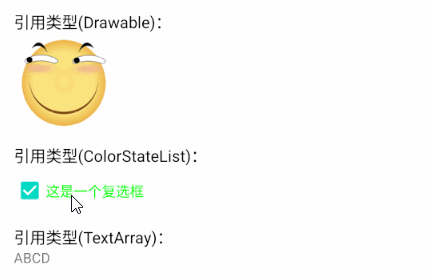

# 简介
Android SDK、Material Design以及第三方库提供了丰富的UI控件，但有时仍然无法满足特定的业务需求，此时我们可以制作自定义控件。

自定义控件有以下几种实现方式：

- 组合现有控件：将多个子控件组合为一个新的控件，封装子控件之间的联动逻辑，以便多处复用。
- 继承现有控件：继承现有的控件或布局，为其扩展新的功能。
- 自由定制控件：利用系统提供的图形能力，自由地编写绘图逻辑。

本章示例工程详见以下链接：

[🔗 示例工程：概述](https://github.com/BI4VMR/Study-Android/tree/master/M03_UI/C07_CtrlCustom/S01_Base)


# 基本应用
下文示例展示了自定义控件的基本使用方法：

🔴 示例一：通过组合现有控件的方式创建“名片”控件。

在本示例中，我们通过组合现有控件的方式，实现一个名片控件，展示自定义控件的制作方法。

第一步，我们创建一个布局文件并放置若干控件，用于描述“名片”的外观。

"business_card.xml":

```xml
<!-- 此处已省略部分属性... -->
<androidx.constraintlayout.widget.ConstraintLayout
    android:layout_width="wrap_content"
    android:layout_height="wrap_content"
    android:background="@drawable/shape_business_card_background">

    <ImageView
        android:id="@+id/ivAvatar"
        android:layout_width="64dp"
        android:layout_height="64dp" />

    <TextView
        android:id="@+id/tvName"
        android:layout_width="wrap_content"
        android:layout_height="wrap_content"
        tools:text="[名称]" />

    <TextView
        android:id="@+id/tvPhone"
        android:layout_width="wrap_content"
        android:layout_height="wrap_content"
        tools:text="[电话号码]" />
</androidx.constraintlayout.widget.ConstraintLayout>
```

在上述布局文件中，ImageView用于显示头像，两个TextView分别用于显示姓名和电话号码。

第二步，我们创建BusinessCard类，实现控件内部逻辑并加载上述布局文件。

"BusinessCard.java":

```java
public class BusinessCard extends FrameLayout {

    private ImageView ivAvatar;
    private TextView tvName;
    private TextView tvPhone;

    // 构造方法1
    public BusinessCard(@NonNull Context context) {
        super(context);
        // 将布局文件渲染生成View实例
        View view = LayoutInflater.from(context).inflate(R.layout.business_card, this, true);
        // 获取View实例中各个子元素的引用
        ivAvatar = view.findViewById(R.id.ivAvatar);
        tvName = view.findViewById(R.id.tvName);
        tvPhone = view.findViewById(R.id.tvPhone);
    }

    // 构造方法2
    public BusinessCard(@NonNull Context context, @Nullable AttributeSet attrs) {
        super(context, attrs);
        /* 初始化操作 ... */
    }

    // 构造方法3
    public BusinessCard(@NonNull Context context, @Nullable AttributeSet attrs, int defStyleAttr) {
        super(context, attrs, defStyleAttr);
        /* 初始化操作 ... */
    }

    // 构造方法4
    public BusinessCard(@NonNull Context context, @Nullable AttributeSet attrs, int defStyleAttr, int defStyleRes) {
        super(context, attrs, defStyleAttr, defStyleRes);
        /* 初始化操作 ... */
    }

    // 更新文本与图像资源
    public void updateInfo(String name, String phone, @DrawableRes int avatarResID) {
        tvName.setText(name);
        tvPhone.setText(phone);
        ivAvatar.setImageResource(avatarResID);
    }
}
```

上述内容也可以使用Kotlin语言编写：

"BusinessCardKT.kt":

```kotlin
class BusinessCardKT : FrameLayout {

    private val binding: BusinessCardBinding by lazy {
        // 将布局文件渲染生成View实例
        BusinessCardBinding.inflate(LayoutInflater.from(context), this, true)
    }

    // 构造方法1
    constructor(context: Context) : super(context)

    // 构造方法2
    constructor(context: Context, attrs: AttributeSet?) : super(context, attrs)

    // 构造方法3
    constructor(context: Context, attrs: AttributeSet?, defStyleAttr: Int) : super(context, attrs, defStyleAttr)

    // 构造方法4
    constructor(context: Context, attrs: AttributeSet?, defStyleAttr: Int, defStyleRes: Int) : super(
        context,
        attrs,
        defStyleAttr,
        defStyleRes
    )

    // 更新文本与图像资源
    fun updateInfo(name: String, phone: String, @DrawableRes avatarResID: Int) {
        with(binding) {
            tvName.text = name
            tvPhone.text = phone
            ivAvatar.setImageResource(avatarResID)
        }
    }
}
```

View拥有四个构造方法，当我们在代码中创建控件实例时，需要调用 `BusinessCard(Context context)` 构造方法，此处需要实现控件的初始化逻辑；当LayoutInflater解析布局文件生成控件实例时，将会调用 `BusinessCard(Context context, AttributeSet attrs)` 构造方法，第二参数 `attrs` 表示XML中的控件属性，此处需要实现控件的初始化逻辑，并解析XML属性。

具有一个参数与两个参数的构造方法是必选的，它们覆盖了动态创建View与通过XML声明View的场景。另外两个构造方法的参数 `defStyleAttr` 和 `defStyleRes` 与主题和样式有关，此处将其忽略，后文示例将详细介绍它们。

> ⚠️ 警告
>
> 当我们使用ViewBinding时，必须调用具有3个参数的 `inflate()` 方法以获取ViewBinding实例，并将 `attachToParent` 参数置为 `true` ；否则布局将不会关联到顶层容器，导致程序运行时控件显示为空白画面。

`updateInfo()` 方法即BusinessCard控件对外暴露的业务接口，我们将该方法参数传入的文本与图片资源分别设置到对应的控件中，实现动态更新UI的功能。

如果我们使用Kotlin语言编写控件，还可以利用默认参数将构造方法合并为一个，进一步简化代码：

"BusinessCardSimpleKT.kt":

```kotlin
class BusinessCardSimpleKT @JvmOverloads constructor(
    context: Context,
    attrs: AttributeSet? = null,
    defStyleAttr: Int = 0,
    defStyleRes: Int = 0
) : FrameLayout(context, attrs, defStyleAttr, defStyleRes) {

    init {
        // 在此处放置构造阶段的初始化逻辑...
    }

    // 此处已省略部分代码...
}
```

至此，自定义控件“名片”已经制作完毕了，接下来我们切换到控件调用者视角，创建控件实例并使用它。

第三步，我们调用具有一个参数的构造方法，创建名片控件实例，设置姓名、电话与头像，并将其添加到测试Activity的视图容器中。

"TestUIBase.java":

```java
// 构建BusinessCard实例
BusinessCard businessCard = new BusinessCard(this);
// 设置文本与图像
businessCard.updateInfo("田所浩二", "11451419198", R.drawable.ic_funny_256);
// 将其添加到布局中
binding.container.addView(businessCard);
```

上述内容也可以使用Kotlin语言编写：

"TestUIBaseKT.kt":

```kotlin
// 构建BusinessCard实例
val businessCard = BusinessCardKT(this)
// 设置文本与图像
businessCard.updateInfo("田所浩二", "11451419198", R.drawable.ic_funny_256)
// 将其添加到布局中
binding.container.addView(businessCard)
```

此时运行示例程序，并查看界面外观：

<div align="center">


</div>


# XML属性
## 基本应用
在前文“示例一”中，我们已经知晓了自定义控件的制作方法，但BusinessCard控件只能利用 `updateInfo()` 方法更新UI，无法解析XML属性。本节内容将介绍XML属性的定义与解析方法，为BusinessCard控件添加自定义XML属性支持。

🟠 示例二：为“名片”控件添加XML属性支持。

在本示例中，我们为BusinessCard控件添加自定义XML属性支持。

第一步，我们在 `<模块根目录>/src/main/res/values/` 目录中创建一个属性声明文件 `attrs_business_card.xml` ，并在其中声明一些属性。

"attrs_business_card.xml":

```xml
<?xml version="1.0" encoding="utf-8"?>
<resources>
    <declare-styleable name="BusinessCard2">
        <attr name="name" format="string" />
        <attr name="phone" format="string" />
        <attr name="avatar" format="reference" />
    </declare-styleable>
</resources>
```

每个 `<declare-styleable/>` 小节表示一个属性集合，它的名称应当与自定义控件的类名保持一致，以提高可读性。

每个 `<attr/>` 小节表示一条属性，配置项 `name` 表示名称；配置项 `format` 表示数据类型。此处的“姓名("name")”与“电话号码("phone")”属性接受文本类型数据，使用者可以传入字符串或文本资源ID；“头像("avatar")”属性接受资源引用类型数据，使用者可以传入图像或颜色资源ID。

第二步，我们对前文“示例一”中的BusinessCard控件进行修改，为其添加解析XML属性的相关代码。

"BusinessCard2.java":

```java
public class BusinessCard2 extends FrameLayout {

    private BusinessCardBinding binding;

    // 构造方法1
    public BusinessCard2(@NonNull Context context) {
        // 调用构造方法2，XML属性集合传入空值，避免重复书写“初始化视图”的逻辑。
        this(context, null);
    }

    // 构造方法2
    public BusinessCard2(@NonNull Context context, @Nullable AttributeSet attrs) {
        this(context, attrs, 0);
    }

    // 构造方法3
    public BusinessCard2(@NonNull Context context, @Nullable AttributeSet attrs, int defStyleAttr) {
        this(context, attrs, 0, 0);
    }

    // 构造方法4
    public BusinessCard2(@NonNull Context context, @Nullable AttributeSet attrs, int defStyleAttr, int defStyleRes) {
        super(context, attrs, defStyleAttr, defStyleRes);

        // 初始化视图
        initView();

        // 如果当前实例不是通过布局文件生成的，则不必解析XML属性。
        if (attrs == null) {
            return;
        }

        // 获取自定义属性数组
        TypedArray ta = context.obtainStyledAttributes(attrs, R.styleable.BusinessCard2, defStyleAttr, defStyleRes);
        // 获取属性，并设置到子控件上。
        if (ta.hasValue(R.styleable.BusinessCard2_name)) {
            String name = ta.getString(R.styleable.BusinessCard2_name);
            binding.tvName.setText(name);
        }
        if (ta.hasValue(R.styleable.BusinessCard2_phone)) {
            String phone = ta.getString(R.styleable.BusinessCard2_phone);
            binding.tvPhone.setText(phone);
        }
        if (ta.hasValue(R.styleable.BusinessCard2_avatar)) {
            Drawable avatar = ta.getDrawable(R.styleable.BusinessCard2_avatar);
            binding.ivAvatar.setImageDrawable(avatar);
        }

        // 释放TypedArray资源
        ta.recycle();
    }

    // 初始化视图
    private void initView() {
        binding = BusinessCardBinding.inflate(LayoutInflater.from(getContext()), this, true);
    }
}
```

上述内容也可以使用Kotlin语言编写：

"BusinessCard2KT.kt":

```kotlin
class BusinessCard2KT @JvmOverloads constructor(
    context: Context,
    attrs: AttributeSet? = null,
    defStyleAttr: Int = 0,
    defStyleRes: Int = 0
) : FrameLayout(context, attrs, defStyleAttr, defStyleRes) {

    companion object {
        private val TAG: String = "TestApp-${BusinessCard2KT::class.java.simpleName}"
    }

    private val binding: BusinessCardBinding by lazy {
        // 将布局文件渲染生成View实例
        BusinessCardBinding.inflate(LayoutInflater.from(context), this, true)
    }

    init {
        // 初始化视图
        // 此处留空，因为"binding"变量已经通过"lazy"函数延迟初始化。

        // 如果当前实例不是通过布局文件生成的，则不必解析XML属性。
        if (attrs != null) {
            // 获取自定义属性数组
            val ta: TypedArray =
                context.obtainStyledAttributes(attrs, R.styleable.BusinessCard2, defStyleAttr, defStyleRes)
            ta.use {
                if (ta.hasValue(R.styleable.BusinessCard2_name)) {
                    val name: String? = ta.getString(R.styleable.BusinessCard2_name)
                    binding.tvName.text = name
                }
                if (ta.hasValue(R.styleable.BusinessCard2_phone)) {
                    val phone: String? = ta.getString(R.styleable.BusinessCard2_phone)
                    binding.tvPhone.text = phone
                }
                if (ta.hasValue(R.styleable.BusinessCard2_avatar)) {
                    val avatar: Drawable? = ta.getDrawable(R.styleable.BusinessCard2_avatar)
                    binding.ivAvatar.setImageDrawable(avatar)
                }
            }
        }
    }
}
```

`attrs` 、 `defStyleAttr` 和 `defStyleRes` 参数只在LayoutInflater解析布局文件时才会被传递，我们通过代码创建控件实例时只会调用 `BusinessCard2(Context context)` 构造方法。我们可以使参数较少的构造方法调用参数较多的构造方法，并将多余的参数设为默认值，此时初始化逻辑只需要在参数最多的构造方法中统一编写，我们根据 `attrs` 是否为空值即可判断是否需要解析XML属性，不必为每个构造方法单独编写初始化逻辑。

XML属性参数 `attrs` 是AttributeSet类型，属性的值为原始文本或资源引用地址，不便于我们进一步使用，因此我们需要通过Context实例的 `obtainStyledAttributes()` 方法将AttributeSet转换为TypedArray。

TypedArray提供了数据类型转换和解资源引用的功能，此处我们首先通过 `hasValue(int index)` 方法判断控件调用者是否在布局文件中指定了对应的属性，若属性存在，则调用 `getString(int index)` 、 `getDrawable(int index)` 等方法将属性值转为对应类型，然后设置到子控件上。

至此，自定义控件“名片”已经支持了XML属性解析能力，接下来我们切换到控件调用者视角，创建控件实例并使用它。

第三步，我们在测试Activity的布局文件中添加“名片”控件，并使用前文定义的三个属性设置数据。

"testui_xmlattrs.xml":

```xml
<net.bi4vmr.study.xmlattrs.BusinessCard2
    android:layout_width="wrap_content"
    android:layout_height="wrap_content"
    app:avatar="@drawable/ic_funny_256"
    app:name="田所浩二"
    app:phone="11451419198" />
```

## 属性类型
### 基本数据
基本数据类型属性包括布尔型、整型、浮点型三种数据。

TypedArray提供了以下方法用于从XML解析基本数据类型属性的值：

- `boolean getBoolean(int index, boolean defValue)` : 将属性 `index` 的值解析为布尔值；若调用者未指定该属性或类型不匹配，则返回默认值 `defValue` 。
- `int getInt(int index, int defValue)` : 将属性 `index` 的值解析为整型值；若调用者未指定该属性或类型不匹配，则返回默认值 `defValue` 。
- `int getInteger(int index, int defValue)` : 将属性 `index` 的值解析为整型值；若调用者未指定该属性，则返回默认值 `defValue` ；若类型不匹配则抛出UnsupportedOperationException异常
- `float getFloat(int index, float defValue)` : 将属性 `index` 的值解析为浮点值；若调用者未指定该属性或类型不匹配，则返回默认值 `defValue` 。

如果我们使用Kotlin语言并引入了 `core-ktx` 组件，还可以调用TypedArray提供的一些扩展方法：

- `getBooleanOrThrow(index: Int): Boolean`
- `getIntOrThrow(index: Int): Int`
- `getIntegerOrThrow(index: Int): Int`
- `getFloatOrThrow(index: Int): Float`

它们与同前缀的Java方法功能类似，但要求控件调用者必须指定 `index` 对应的属性，否则抛出IllegalArgumentException异常。

🟡 示例三：基本数据类型属性的使用方法。

在本示例中，我们定义一些基本数据类型的XML属性，并在自定义View中解析它们。

第一步，我们在资源文件中编写以下内容，声明一些属性：

"attrs_type.xml":

```xml
<resources>
    <declare-styleable name="AttrTypes">
        <!-- 定义属性：基本数据类型 -->
        <attr name="booleanValue" format="boolean" />
        <attr name="integerValue" format="integer" />
        <attr name="floatValue" format="float" />
    </declare-styleable>
</resources>
```

名为 `booleanValue` 的属性值是布尔类型；名为 `integerValue` 的属性值是整型；名为 `floatValue` 的属性值是浮点型。

第二步，我们在自定义控件中编写逻辑代码，从控件的XML属性中解析属性值。

"AttrTestView.java":

```java
TypedArray ta = getContext().obtainStyledAttributes(attrs, R.styleable.AttrTypes);

// 获取布尔值
boolean booleanValue = ta.getBoolean(R.styleable.AttrTypes_booleanValue, false);
tvBooleanValue.setText(booleanValue + "");

// 获取整型值
int intValue = ta.getInt(R.styleable.AttrTypes_integerValue, 0);
tvIntegerValue.setText(intValue + "");

// 获取浮点值
float floatValue = ta.getFloat(R.styleable.AttrTypes_floatValue, 0.0F);
tvFloatValue.setText(floatValue + "");

ta.recycle();
```

上述内容也可以使用Kotlin语言编写：

"AttrTestViewKT.kt":

```kotlin
context.obtainStyledAttributes(attrs, R.styleable.AttrTypes).use {
    // 获取布尔值
    val booleanValue: Boolean = it.getBoolean(R.styleable.AttrTypes_booleanValue, false)
    tvBooleanValue.text = booleanValue.toString()

    // 获取整型值
    val intValue: Int = it.getInt(R.styleable.AttrTypes_integerValue, 0)
    tvIntegerValue.text = intValue.toString()

    // 获取浮点值
    val floatValue: Float = it.getFloat(R.styleable.AttrTypes_floatValue, 0.0F)
    tvFloatValue.text = floatValue.toString()
}
```

以 `getBoolean()` 方法为例，它会尝试将 `R.styleable.AttrTypes_booleanValue` 属性的值转换为布尔类型，如果调用者没有定义该属性，或属性值无法被识别为布尔类型，则返回默认值 `false` 。

第三步，我们切换到调用者视角，在布局文件中为AttrTestView指定属性与值。

"testui_xmlattrs.xml":

```xml
<net.bi4vmr.study.xmlattrs.AttrTestView
    android:layout_width="match_parent"
    android:layout_height="wrap_content"
    app:booleanValue="true"
    app:floatValue="0.05"
    app:integerValue="-1000" />
```

此时运行示例程序，AttrTestView应当显示了XML中所设置的值。

### 文本
文本类型包括无格式的普通字符串和包含格式的字符序列。

TypedArray提供了以下方法用于从XML解析文本类型属性的值：

- `String getString(int index)` : 将属性 `index` 的值解析为字符串；若调用者未指定该属性则返回空值；若属性为非字符串的引用类型，则返回资源路径。
- `CharSequence getText(int index)` : 将属性 `index` 的值解析为字符序列；若调用者未指定该属性则返回空值；若属性为非字符串的引用类型，则返回资源路径。

如果我们使用Kotlin语言并引入了 `core-ktx` 组件，还可以调用TypedArray提供的一些扩展方法：

- `getStringOrThrow(index: Int): String`
- `getTextOrThrow(index: Int): CharSequence`

它们与同前缀的Java方法功能类似，但要求控件调用者必须指定 `index` 对应的属性，否则抛出IllegalArgumentException异常。

🟢 示例四：文本类型属性的使用方法。

在本示例中，我们定义一些文本类型的XML属性，并在自定义View中解析它们。

第一步，我们在资源文件中编写以下内容，声明一些属性：

"attrs_type.xml":

```xml
<resources>
    <declare-styleable name="AttrTypes">
        <!-- 定义属性：文本类型 -->
        <attr name="textValue1" format="string" />
        <attr name="textValue2" format="string" />
    </declare-styleable>
</resources>
```

第二步，我们在自定义控件中编写逻辑代码，从控件的XML属性中解析属性值。

"AttrTestView.java":

```java
TypedArray ta = getContext().obtainStyledAttributes(attrs, R.styleable.AttrTypes);

// 获取文本（忽略格式）
String textValue1 = ta.getString(R.styleable.AttrTypes_textValue1);
tvTextValue1.setText(textValue1);

// 获取文本（解析格式）
CharSequence textValue2 = ta.getText(R.styleable.AttrTypes_textValue2);
tvTextValue2.setText(textValue2);

ta.recycle();
```

上述内容也可以使用Kotlin语言编写：

"AttrTestViewKT.kt":

```kotlin
context.obtainStyledAttributes(attrs, R.styleable.AttrTypes).use {
    // 获取文本（忽略格式）
    val textValue1: String? = it.getString(R.styleable.AttrTypes_textValue1)
    tvTextValue1.text = textValue1

    // 获取文本（解析格式）
    val textValue2: CharSequence? = it.getText(R.styleable.AttrTypes_textValue2)
    tvTextValue2.text = textValue2
}
```

`getString()` 方法将会返回字符串并忽略格式；而 `getText()` 方法将会返回带有格式的字符序列。

第三步，我们切换到调用者视角，在布局文件中为AttrTestView指定属性与值。

"testui_xmlattrs.xml":

```xml
<net.bi4vmr.study.xmlattrs.AttrTestView
    android:layout_width="match_parent"
    android:layout_height="wrap_content"
    app:textValue1="@string/text_with_format"
    app:textValue2="@string/text_with_format" />
```

此处的 `text_with_format` 内容为 `AB<b>CD</b>EF` ，中间两个字符带有加粗格式。

此时运行示例程序，并查看界面外观：

<div align="center">


</div>

### 尺寸
尺寸类型包括单位为 `dp` 、 `sp` 、 `px` 等的长度值。

TypedArray提供了以下方法用于从XML解析尺寸类型属性的值：

- `float getDimension(int index, float defValue)` : 将属性 `index` 的值解析为像素值；若调用者未指定该属性或类型不匹配，则返回默认值 `defValue` 。
- `int getDimensionPixelSize(int index, int defValue)` : 将属性 `index` 的值解析为像素值，如果有小数部分，则四舍五入到整数。若调用者未指定该属性或类型不匹配，则返回默认值 `defValue` 。
- `int getDimensionPixelOffset(int index, int defValue)` : 将属性 `index` 的值解析为像素值，如果有小数部分，则丢弃并截断到整数。若调用者未指定该属性或类型不匹配，则返回默认值 `defValue` 。

如果我们使用Kotlin语言并引入了 `core-ktx` 组件，还可以调用TypedArray提供的一些扩展方法：

- `getDimensionOrThrow(index: Int): Float`
- `getDimensionPixelSizeOrThrow(index: Int): Int`
- `getDimensionPixelOffset(index: Int): Int`

它们与同前缀的Java方法功能类似，但要求控件调用者必须指定 `index` 对应的属性，否则抛出IllegalArgumentException异常。

🔵 示例五：尺寸类型属性的使用方法。

在本示例中，我们定义一些尺寸类型的XML属性，并在自定义View中解析它们。

第一步，我们在资源文件中编写以下内容，声明一些属性：

"attrs_type.xml":

```xml
<resources>
    <declare-styleable name="AttrTypes">
        <!-- 定义属性：尺寸类型 -->
        <attr name="dimenValue" format="dimension" />
    </declare-styleable>
</resources>
```

第二步，我们在自定义控件中编写逻辑代码，从控件的XML属性中解析属性值。

"AttrTestView.java":

```java
TypedArray ta = getContext().obtainStyledAttributes(attrs, R.styleable.AttrTypes);

// 解析尺寸为像素值
Float dimenValue = ta.getDimension(R.styleable.AttrTypes_dimenValue, 1.0F);
tvDimenValue.setText(dimenValue + "");

ta.recycle();
```

上述内容也可以使用Kotlin语言编写：

"AttrTestViewKT.kt":

```kotlin
context.obtainStyledAttributes(attrs, R.styleable.AttrTypes).use {
    // 解析尺寸为像素值
    val dimenValue1: Float = it.getDimension(R.styleable.AttrTypes_dimenValue, 1.0F)
    tvDimenValue.text = dimenValue1.toString()
}
```

第三步，我们切换到调用者视角，在布局文件中为AttrTestView指定属性与值。

"testui_xmlattrs.xml":

```xml
<net.bi4vmr.study.xmlattrs.AttrTestView
    android:layout_width="match_parent"
    android:layout_height="wrap_content"
    app:dimenValue="100dp" />
```

此处我们设置的长度为 `100dp` ，`dimenValue1` 的值在缩放倍数为2的设备上应当为 `200` ，以此类推。

### 比例
有时我们不会明确地设置长度值，而是使用比例描述长度，例如：“当前控件的宽度为父控件的一半”等。

TypedArray提供了以下方法用于从XML解析尺寸类型属性的值：

- `float getFraction(int index, int base, int pbase, float defValue)` : 将属性 `index` 的比例解析为数值，如果属性为 `50%` 类似的格式，则返回 `base * 50%` ，如果属性为 `25%p` 类似的格式，则返回 `pbase * 25%` ；若调用者未指定该属性或类型不匹配，则返回默认值 `defValue` 。

🟣 示例六：比例类型属性的使用方法。

在本示例中，我们定义一些比例类型的XML属性，并在自定义View中解析它们。

第一步，我们在资源文件中编写以下内容，声明一些属性：

"attrs_type.xml":

```xml
<resources>
    <declare-styleable name="AttrTypes">
        <!-- 定义属性：比例类型 -->
        <attr name="fractionValue1" format="fraction" />
        <attr name="fractionValue2" format="fraction" />
    </declare-styleable>
</resources>
```

第二步，我们在自定义控件中编写逻辑代码，从控件的XML属性中解析属性值。

"AttrTestView.java":

```java
TypedArray ta = getContext().obtainStyledAttributes(attrs, R.styleable.AttrTypes);

// 解析比例
float fractionValue1 = ta.getFraction(R.styleable.AttrTypes_fractionValue1, 500, 1000, 1.0F);
tvFractionValue1.setText(fractionValue1 + "");

// 解析比例
float fractionValue2 = ta.getFraction(R.styleable.AttrTypes_fractionValue2, 500, 1000, 1.0F);
tvFractionValue2.setText(fractionValue2 + "");

ta.recycle();
```

上述内容也可以使用Kotlin语言编写：

"AttrTestViewKT.kt":

```kotlin
context.obtainStyledAttributes(attrs, R.styleable.AttrTypes).use {
    // 解析比例
    val fractionValue1: Float = it.getFraction(R.styleable.AttrTypes_fractionValue1, 500, 1000, 1.0f)
    tvFractionValue1.text = fractionValue1.toString()

    // 解析比例
    val fractionValue2: Float = it.getFraction(R.styleable.AttrTypes_fractionValue2, 500, 1000, 1.0f)
    tvFractionValue2.text = fractionValue2.toString()
}
```

第三步，我们切换到调用者视角，在布局文件中为AttrTestView指定属性与值。

"testui_xmlattrs.xml":

```xml
<net.bi4vmr.study.xmlattrs.AttrTestView
    android:layout_width="match_parent"
    android:layout_height="wrap_content"
    app:fractionValue1="50%"
    app:fractionValue2="50%p" />
```

此处我们指定 `fractionValue1` 属性的值为 `50%` ，因此代码中获取到的值应为 `50% * 500 = 250` ；而 `fractionValue2` 属性的值为 `50%p` ，代码中获取到的值应为 `50% * 1000 = 500` 。

在系统内置控件中，比例类型的属性通常用于设置尺寸，但它在程序中表现为一个浮点数值，因此当我们自定义控件时也可以用其表示其他含义。

### 颜色
颜色类型包括十六进制形式的色值或其他颜色资源的引用。

TypedArray提供了以下方法用于从XML解析颜色类型属性的值：

- `int getColor(int index, @ColorInt int defValue)` : 将属性 `index` 的值解析为整型色值；若调用者未指定该属性或类型不匹配，则返回默认值 `defValue` 。

如果我们使用Kotlin语言并引入了 `core-ktx` 组件，还可以调用TypedArray提供的一些扩展方法：

- `getColorOrThrow(index: Int): Int`

它们与同前缀的Java方法功能类似，但要求控件调用者必须指定 `index` 对应的属性，否则抛出IllegalArgumentException异常。

🟤 示例七：颜色类型属性的使用方法。

在本示例中，我们定义一些颜色类型的XML属性，并在自定义View中解析它们。

第一步，我们在资源文件中编写以下内容，声明一些属性：

"attrs_type.xml":

```xml
<resources>
    <declare-styleable name="AttrTypes">
        <!-- 定义属性：颜色类型 -->
        <attr name="colorValue" format="color" />
    </declare-styleable>
</resources>
```

第二步，我们在自定义控件中编写逻辑代码，从控件的XML属性中解析属性值。

"AttrTestView.java":

```java
TypedArray ta = getContext().obtainStyledAttributes(attrs, R.styleable.AttrTypes);

// 解析颜色属性的值为色值
@ColorInt
int colorValue = ta.getColor(R.styleable.AttrTypes_colorValue, Color.BLACK);
tvColorValue.setTextColor(colorValue);

ta.recycle();
```

上述内容也可以使用Kotlin语言编写：

"AttrTestViewKT.kt":

```kotlin
context.obtainStyledAttributes(attrs, R.styleable.AttrTypes).use {
    // 解析颜色属性的值为色值
    @ColorInt
    val colorValue: Int = it.getColor(R.styleable.AttrTypes_colorValue, Color.BLACK)
    tvColorValue.setTextColor(colorValue)
}
```

`getColor()` 方法会尝试将 `R.styleable.AttrTypes_colorValue` 属性的值转换为色值，如果调用者没有定义该属性，或属性值无法被识别为色值，则返回默认值 `Color.BLACK` 。

第三步，我们切换到调用者视角，在布局文件中为AttrTestView指定属性与值。

"testui_xmlattrs.xml":

```xml
<net.bi4vmr.study.xmlattrs.AttrTestView
    android:layout_width="match_parent"
    android:layout_height="wrap_content"
    app:colorValue="@color/purple_700" />
```

此时运行示例程序，AttrTestView中的 `tvColorValue` 文本颜色应当已被设置为 `purple_700` 。

### 枚举
枚举属性可以为属性的值赋予名称，提高配置文件的可读性，并且还约束了调用者的输入内容，防止传入无意义的值。

🔴 示例八：枚举类型属性的使用方法。

在本示例中，我们定义一些枚举类型的XML属性，并在自定义View中解析它们。

第一步，我们在资源文件中编写以下内容，声明一些属性：

"attrs_type.xml":

```xml
<resources>
    <declare-styleable name="AttrTypes">
        <!-- 定义属性：枚举类型 -->
        <attr name="enumValue" format="enum">
            <enum name="vertical" value="0" />
            <enum name="horizontal" value="1" />
        </attr>
    </declare-styleable>
</resources>
```

此处我们定义一个 `enumValue` 属性，用于配置控件的布局方向：取值 `vertical (0)` 表示按垂直方向排布内容；取值 `horizontal (2)` 表示按水平方向排布内容。

第二步，我们在自定义控件中编写逻辑代码，从控件的XML属性中解析属性值。

"AttrTestView.java":

```java
TypedArray ta = getContext().obtainStyledAttributes(attrs, R.styleable.AttrTypes);

// 获取枚举对应的整型值
int enumIndex = ta.getInt(R.styleable.AttrTypes_enumValue, 0);
tvEnumValue.setText(enumIndex + "");

ta.recycle();
```

上述内容也可以使用Kotlin语言编写：

"AttrTestViewKT.kt":

```kotlin
context.obtainStyledAttributes(attrs, R.styleable.AttrTypes).use {
    // 获取枚举对应的整型值
    val enumValue: Int = it.getInt(R.styleable.AttrTypes_enumValue, 0)
    tvEnumValue.text = enumValue.toString()
}
```

枚举属性在代码中的表现形式为整型数值，我们需要通过 `getInt()` 方法获取，值与调用者传入枚举的 `value` 属性一致。若代码中有含义相同的枚举类，我们还可以用此处获取到的数值进行转换，便于进一步使用。

第三步，我们切换到调用者视角，在布局文件中为AttrTestView指定属性与值。

"testui_xmlattrs.xml":

```xml
<net.bi4vmr.study.xmlattrs.AttrTestView
    android:layout_width="match_parent"
    android:layout_height="wrap_content"
    app:enumValue="horizontal" />
```

此时运行示例程序，由于 `horizontal` 的数值为 `1` ，AttrTestView应当显示 `enumValue` 的值也为 `1` 。

### 标志位
标志位属性的语法与枚举类似，但调用者可以同时选择其中的多个值，适用于控制一组功能的启用与禁用。

🟠 示例九：标志位属性的使用方法。

在本示例中，我们定义一些标志位类型的XML属性，并在自定义View中解析它们。

第一步，我们在资源文件中编写以下内容，声明一些属性：

"attrs_type.xml":

```xml
<resources>
    <declare-styleable name="AttrTypes">
        <!-- 定义属性：标志位类型 -->
        <attr name="flagValue" format="flags">
            <flag name="none" value="0" />
            <flag name="vertical" value="0x1" />
            <flag name="horizontal" value="2" />
        </attr>
    </declare-styleable>
</resources>
```

此处我们定义一个 `flagValue` 属性，用于配置控件需要显示哪些滚动条：取值 `vertical (1)` 表示显示垂直滚动条；取值 `horizontal (2)` 表示显示水平滚动条；取值 `vertical|horizontal (0x01 | 0x10 = 0x11)` 则表示两个方向的滚动条均显示。

第二步，我们在自定义控件中编写逻辑代码，从控件的XML属性中解析属性值。

"AttrTestView.java":

```java
TypedArray ta = getContext().obtainStyledAttributes(attrs, R.styleable.AttrTypes);

// 获取标志位组合对应的整型值
int flags = ta.getInt(R.styleable.AttrTypes_flagValue, 0);
tvFlagValue.setText(flags + "");

ta.recycle();
```

上述内容也可以使用Kotlin语言编写：

"AttrTestViewKT.kt":

```kotlin
context.obtainStyledAttributes(attrs, R.styleable.AttrTypes).use {
    // 获取标志位组合对应的整型值
    val flags: Int = it.getInt(R.styleable.AttrTypes_flagValue, 0)
    tvFlagValue.text = flags.toString()
}
```

获取标志位组合数值也需要使用 `getInt()` 方法，该方法将会返回调用者配置的所有标志位或运算结果，我们可以使用该值和每个功能特性对应的值分别进行与运算，进一步处理哪些功能需要开启、哪些功能需要关闭。

第三步，我们切换到调用者视角，在布局文件中为AttrTestView指定属性与值。

"testui_xmlattrs.xml":

```xml
<net.bi4vmr.study.xmlattrs.AttrTestView
    android:layout_width="match_parent"
    android:layout_height="wrap_content"
    app:flagValue="horizontal|vertical" />
```

此时运行示例程序，由于 `horizontal` 和 `vertical` 都被配置了，AttrTestView应当显示 `flagValue` 的值为 `3` ，对应二进制的 `11` 。

### 引用
除了前文所描述的属性类型之外，其他属性统一被归类为引用类型，常见的类型有：图像、颜色状态列表和文本数组。

对于引用类型，XML语法检查无法约束调用者传入的值，因此我们应当在程序文档中描述清楚此类属性支持的类型，并在代码中添加容错机制。

🟡 示例十：引用属性的使用方法。

在本示例中，我们定义一些引用类型的XML属性，并在自定义View中解析它们。

第一步，我们在资源文件中编写以下内容，声明一些属性：

"attrs_type.xml":

```xml
<resources>
    <declare-styleable name="AttrTypes">
        <!-- 定义属性：引用类型 -->
        <attr name="refValue1" format="reference" />
        <attr name="refValue2" format="reference" />
        <attr name="refValue3" format="reference" />
    </declare-styleable>
</resources>
```

第二步，我们在自定义控件中编写逻辑代码，从控件的XML属性中解析属性值。

"AttrTestView.java":

```java
TypedArray ta = getContext().obtainStyledAttributes(attrs, R.styleable.AttrTypes);

// 将资源解析为Drawable
Drawable drawable = ta.getDrawable(R.styleable.AttrTypes_refValue1);
ivRefType1.setImageDrawable(drawable);

// 将资源解析为ColorStateList
ColorStateList csl = ta.getColorStateList(R.styleable.AttrTypes_refValue2);
cbRefType2.setTextColor(csl);

// 将资源解析为CharSequence数组
CharSequence[] array = ta.getTextArray(R.styleable.AttrTypes_refValue3);
tvRefType3.setText(TextUtils.concat(array));

ta.recycle();
```

上述内容也可以使用Kotlin语言编写：

"AttrTestViewKT.kt":

```kotlin
context.obtainStyledAttributes(attrs, R.styleable.AttrTypes).use {
    // 将资源解析为Drawable
    val drawable: Drawable? = it.getDrawable(R.styleable.AttrTypes_refValue1)
    ivRefType1.setImageDrawable(drawable)

    // 将资源解析为ColorStateList
    val colorStateList: ColorStateList? = it.getColorStateList(R.styleable.AttrTypes_refValue2)
    cbRefType2.setTextColor(colorStateList)

    // 将资源解析为CharSequence数组
    val array: Array<CharSequence> = it.getTextArray(R.styleable.AttrTypes_refValue3)
    tvRefType3.text = array.joinToString()
}
```

属性 `refValue1` 用于接收图像资源，我们使用 `getDrawable()` 方法将其解析为Drawable对象；属性 `refValue2` 用于接收颜色状态列表，我们使用 `getColorStateList()` 方法将其解析为ColorStateList对象；属性 `refValue3` 用于接收文本数组，我们使用 `getTextArray()` 方法将其解析为CharSequence数组。

第三步，我们切换到调用者视角，在布局文件中为AttrTestView指定属性与值。

"testui_xmlattrs.xml":

```xml
<net.bi4vmr.study.xmlattrs.AttrTestView
    android:layout_width="match_parent"
    android:layout_height="wrap_content"
    app:refValue1="@drawable/ic_funny_256"
    app:refValue2="@color/color_state_list"
    app:refValue3="@array/text_array" />
```

此时运行示例程序，并查看界面外观：

<div align="center">



</div>

### 组合类型
TypedArray的部分方法能够解析多种类型的原始数据，例如 `getDrawable()` 方法能够自动识别并解析颜色、Drawable、Mipmap等资源。

🟢 示例十一：组合属性的使用方法。

在本示例中，我们定义一些支持多种类型的XML属性，并在自定义View中解析它们。

第一步，我们在资源文件中编写以下内容，声明一些属性：

"attrs_type.xml":

```xml
<resources>
    <declare-styleable name="AttrTypes">
        <!-- 定义属性：组合类型 -->
        <attr name="multiTypeValue" format="color|reference" />
    </declare-styleable>
</resources>
```

第二步，我们在自定义控件中编写逻辑代码，从控件的XML属性中解析属性值。

"AttrTestView.java":

```java
TypedArray ta = getContext().obtainStyledAttributes(attrs, R.styleable.AttrTypes);

// 将资源解析为Drawable
Drawable drawable = ta.getDrawable(R.styleable.AttrTypes_multiTypeValue);
ivMultiTypes.setImageDrawable(drawable);

ta.recycle();
```

上述内容也可以使用Kotlin语言编写：

"AttrTestViewKT.kt":

```kotlin
context.obtainStyledAttributes(attrs, R.styleable.AttrTypes).use {
    // 将资源解析为Drawable
    val drawable: Drawable? = it.getDrawable(R.styleable.AttrTypes_multiTypeValue)
    ivMultiTypes.setImageDrawable(drawable)
}
```

`getDrawable()` 方法能够自动解析多种属性值，如果属性值是颜色资源，则返回ColorDrawable；如果属性值是图像资源，则返回BitmapDrawable。

此时调用者可以设置 `app:multiTypeValue="@drawable/ic_funny_256"` 或 `app:multiTypeValue="#00FF00"` ，二者均能被正常解析。
