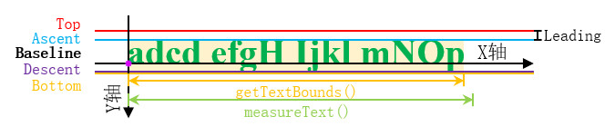

# 简介
`android.graphics` 包中提供了一些2D绘图工具，我们可以利用它们绘制自定义控件，实现定制化的需求。

常用的绘图工具如下文列表所示：

- Paint（画笔）：描述图形的颜色、粗细、描边、渐变等样式。
- Canvas（画布）：提供绘制点、线、矩形、圆形、文本等方法，绘制时需要结合 Paint 确定最终的图形外观。
- Bitmap（位图）：像素的集合，既可以作为 Canvas 的绑定对象用于存储绘制结果，也可以直接作为图像绘制到 Canvas 上。
- Path（路径）：描述一条或多条线段，可绘制折线、曲线，也可作为裁剪轮廓。
- Rect（矩形区域）：以整数坐标描述一块矩形区域，创建时需要依次指定左边界、上边界、右边界、下边界的坐标，并可通过 `centerX()` / `centerY()` 获取中心坐标。
- RectF（浮点矩形区域）：以浮点坐标描述矩形区域，功能与 Rect 相同。

其中 Paint 和 Canvas 是最基础的工具，绘制任何图形都需要用到它们。

本章的示例工程详见以下链接：

- [🔗 示例工程：绘图工具](https://github.com/BI4VMR/Study-Android/tree/master/M03_UI/C08_CtrlCustom/S03_Draw)


# 基本应用
在实际开发中，我们通常先创建一个与目标控件等尺寸的 Bitmap，再将其绑定到 Canvas 上作为绘制区域，完成绘制后将 Bitmap 显示到控件中。

自定义控件的 `onDraw(canvas: Canvas)` 方法用于绘制图形，我们可以使用 `canvas` 参数提供的画布进行绘图操作，为了演示方便，我们将图形绘制在与ImageView尺寸相等的Bitmap中，后文示例将省略创建Bitmap的过程。

🔴 示例一：在画布上绘制矩形与圆形。

在本示例中，我们在一个 ImageView 上绘制矩形与圆形。

"TestUIBase.java":

```java
binding.getRoot().post(() -> {
    // 创建画布
    int width = binding.ivDraft.getWidth();
    int height = binding.ivDraft.getHeight();
    Bitmap bmp = Bitmap.createBitmap(width, height, Bitmap.Config.ARGB_8888);
    Canvas canvas = new Canvas(bmp);

    // 创建画笔，颜色为绿色。
    Paint paint = new Paint();
    paint.setColor(Color.GREEN);

    // 将整个画布填充为黑色
    canvas.drawColor(Color.BLACK);
    // 以 `(100, 100)` 为顶点，绘制一个宽度为400像素、高度为100像素的矩形。
    canvas.drawRect(100, 100, 500, 200, paint);

    // 将画笔颜色改为青色
    paint.setColor(Color.CYAN);
    // 以 `(600, 150)` 为圆心，绘制一个半径为50像素的圆。
    canvas.drawCircle(600, 150, 50, paint);

    binding.ivDraft.setImageBitmap(bmp);
});
```

上述内容也可以使用Kotlin语言编写：

"TestUIBaseKT.kt":

```kotlin
binding.root.post {
    // 创建画布
    val width = binding.ivDraft.width
    val height = binding.ivDraft.height
    val bmp = Bitmap.createBitmap(width, height, Bitmap.Config.ARGB_8888)
    val canvas = Canvas(bmp)

    // 创建画笔，颜色为绿色。
    val paint = Paint()
    paint.color = Color.GREEN

    // 将整个画布填充为黑色
    canvas.drawColor(Color.BLACK)
    // 以 `(100, 100)` 为顶点，绘制一个宽度为400像素、高度为100像素的矩形。
    canvas.drawRect(100F, 100F, 500F, 200F, paint)

    // 将画笔颜色改为青色
    paint.color = Color.CYAN
    // 以 `(600, 150)` 为圆心，绘制一个半径为50像素的圆。
    canvas.drawCircle(600F, 150F, 50F, paint)

    binding.ivDraft.setImageBitmap(bmp)
}
```

在上述代码中，我们在 `binding.getRoot().post()` 方法的回调中执行绘制操作，这样可以确保在 View 完成布局后再获取其宽高，避免宽高为0的问题。


Canvas 的 `drawColor(int color)` 方法可以将整个画布填充为指定颜色，通常用于绘制背景。Canvas 的各绘图方法均以像素为单位，坐标原点为画布的左上角，X 轴正方向向右，Y 轴正方向向下。


# 点
Canvas 提供了以下方法用于绘制点：

🔶 `void drawPoint(float x, float y, Paint paint)`

在坐标 `(x, y)` 处绘制一个点。

点的大小由 Paint 的 `setStrokeWidth()` 方法控制，点的形状由 `setStrokeCap()` 方法控制，默认为正方形，设为 `Paint.Cap.ROUND` 后变为圆形。

🔶 `void drawPoints(float[] pts, Paint paint)`

批量绘制一组点，参数 `pts` 数组中每两个元素构成一组 `(x, y)` 坐标。

🔴 示例二：绘制单个点与批量点。

"TestUIPoint.java":

```java
// 创建画笔并设置样式：尺寸为5像素，颜色为红色。
Paint paint = new Paint();
paint.setStrokeWidth(10);
paint.setColor(Color.RED);

// 在画布 `(50, 50)` 的位置绘制一个点
canvas.drawPoint(50, 50, paint);
// 在画布 `(100, 100)` 的位置绘制一个点
canvas.drawPoint(100, 100, paint);


Paint p = new Paint();
p.setStrokeWidth(10);
p.setColor(Color.GREEN);

// 使用数组表示一批点，每两个元素为一组，分别表示点的X坐标与Y坐标。
float[] points = {50, 50, 100, 100, 50, 100, 100, 50};
canvas.drawPoints(points, p);
```

上述内容也可以使用Kotlin语言编写：

"TestUIPointKT.kt":

```kotlin
// 创建画笔并设置样式：尺寸为5像素，颜色为红色。
val paint = Paint()
paint.strokeWidth = 10F
paint.color = Color.RED

// 在画布 `(50, 50)` 的位置绘制一个点
canvas.drawPoint(50F, 50F, paint)
// 在画布 `(100, 100)` 的位置绘制一个点
canvas.drawPoint(100F, 100F, paint)

val p = Paint()
p.strokeWidth = 10F
p.color = Color.GREEN

// 使用数组表示一批点，每两个元素为一组，分别表示点的X坐标与Y坐标。
val points = floatArrayOf(50F, 50F, 100F, 100F, 50F, 100F, 100F, 50F)
canvas.drawPoints(points, p)
```


# 直线
Canvas 提供了以下方法用于绘制直线：

🔶 `void drawLine(float startX, float startY, float stopX, float stopY, Paint paint)`

从坐标 `(startX, startY)` 到 `(stopX, stopY)` 绘制一条线段。

🔶 `void drawLines(float[] pts, Paint paint)`

批量绘制一组线段，参数 `pts` 数组中每四个元素构成一条线段的起点与终点坐标。

线段的粗细由 Paint 的 `setStrokeWidth()` 方法设置，线段末端的形状由 `setStrokeCap()` 方法设置，可取以下值：

- `Paint.Cap.BUTT` ：无修饰，线段末端为平直边缘，不超出端点，这是默认值。
- `Paint.Cap.SQUARE` ：方形末端，线段会在端点两侧各延伸半个线宽，外观与 `BUTT` 类似但稍长。
- `Paint.Cap.ROUND` ：圆形末端，线段端点处绘制半圆，视觉上比 `BUTT` 稍长。

🔴 示例三：绘制线段，并展示不同线段末端样式。

"TestUILine.java":

```java
private void test_SingleLine() {
    // 创建与ImageView尺寸相同的Bitmap，将其作为画布。
    int width = binding.ivSingleLine.getWidth();
    int height = binding.ivSingleLine.getHeight();
    Bitmap bmp = Bitmap.createBitmap(width, height, Bitmap.Config.ARGB_8888);
    Canvas canvas = new Canvas(bmp);

    Paint p = new Paint();
    p.setStrokeWidth(10);
    p.setStrokeCap(Paint.Cap.ROUND);
    p.setColor(Color.GREEN);

    canvas.drawLine(50, 50, 100, 100, p);

    canvas.drawLine(50, 200, 400, 200, p);

    // 将绘制后的Bitmap设置到ImageView中。
    binding.ivSingleLine.setImageBitmap(bmp);
}

private void test_StrokeCap() {
    // 创建与ImageView尺寸相同的Bitmap，将其作为画布。
    int width = binding.ivStrokeCap.getWidth();
    int height = binding.ivStrokeCap.getHeight();
    Bitmap bmp = Bitmap.createBitmap(width, height, Bitmap.Config.ARGB_8888);
    Canvas canvas = new Canvas(bmp);

    Paint p = new Paint();
    p.setStrokeWidth(50);
    p.setColor(Color.CYAN);

    // 无
    p.setStrokeCap(Paint.Cap.BUTT);
    canvas.drawLine(50, 50, 50, 400, p);

    p.setStrokeCap(Paint.Cap.SQUARE);
    canvas.drawLine(150, 50, 150, 400, p);

    p.setStrokeCap(Paint.Cap.ROUND);
    canvas.drawLine(250, 50, 250, 400, p);

    // 将绘制后的Bitmap设置到ImageView中。
    binding.ivStrokeCap.setImageBitmap(bmp);
}
```

上述内容也可以使用Kotlin语言编写：

"TestUILineKT.kt":

```kotlin
private fun test_SingleLine() {
    // 创建与ImageView尺寸相同的Bitmap，将其作为画布。
    val width = binding.ivSingleLine.width
    val height = binding.ivSingleLine.height
    val bmp = Bitmap.createBitmap(width, height, Bitmap.Config.ARGB_8888)
    val canvas = Canvas(bmp)

    val p = Paint()
    p.strokeWidth = 10F
    p.strokeCap = Paint.Cap.ROUND
    p.color = Color.GREEN

    canvas.drawLine(50F, 50F, 100F, 100F, p)

    canvas.drawLine(50F, 200F, 400F, 200F, p)

    // 将绘制后的Bitmap设置到ImageView中。
    binding.ivSingleLine.setImageBitmap(bmp)
}

private fun test_StrokeCap() {
    // 创建与ImageView尺寸相同的Bitmap，将其作为画布。
    val width = binding.ivStrokeCap.width
    val height = binding.ivStrokeCap.height
    val bmp = Bitmap.createBitmap(width, height, Bitmap.Config.ARGB_8888)
    val canvas = Canvas(bmp)

    val p = Paint()
    p.strokeWidth = 50F
    p.color = Color.CYAN

    // 无
    p.strokeCap = Paint.Cap.BUTT
    canvas.drawLine(50F, 50F, 50F, 400F, p)

    p.strokeCap = Paint.Cap.SQUARE
    canvas.drawLine(150F, 50F, 150F, 400F, p)

    p.strokeCap = Paint.Cap.ROUND
    canvas.drawLine(250F, 50F, 250F, 400F, p)

    // 将绘制后的Bitmap设置到ImageView中。
    binding.ivStrokeCap.setImageBitmap(bmp)
}
```


# 基本形状
## 矩形
Canvas 提供了以下方法用于绘制矩形：

🔶 `void drawRect(Rect r, Paint paint)`

绘制 Rect 对象所描述的矩形。

等价写法：`void drawRect(float left, float top, float right, float bottom, Paint paint)` ，直接通过坐标参数指定矩形区域。

🔶 `void drawRoundRect(RectF rect, float rx, float ry, Paint paint)`

绘制圆角矩形，参数 `rx` 和 `ry` 分别为圆角在 X 轴与 Y 轴方向上的半径。

等价写法：`void drawRoundRect(float left, float top, float right, float bottom, float rx, float ry, Paint paint)` 。

🔶 `void drawDoubleRoundRect(RectF outer, float outerRx, float outerRy, RectF inner, float innerRx, float innerRy, Paint paint)`

绘制外层矩形减去内层矩形后剩余的区域，外层与内层均可设置独立的圆角半径。此方法为 Android 10（API 29）新增。

🔴 示例四：绘制矩形、圆角矩形与双矩形相减得到的形状。

"TestUIShape.java":

```java
private void test_Rectangle() {
    int width = binding.ivRectangle.getWidth();
    int height = binding.ivRectangle.getHeight();
    Bitmap bmp = Bitmap.createBitmap(width, height, Bitmap.Config.ARGB_8888);
    Canvas canvas = new Canvas(bmp);

    // 创建画笔
    Paint paint = new Paint();
    paint.setColor(Color.RED);

    // 创建Rect对象，描述矩形区域，左上角顶点为 `(50, 50)` ，右下角顶点为 `(250, 200)`。
    Rect rect = new Rect(50, 50, 250, 200);
    // 在画布上绘制Rect对象所描述的矩形
    canvas.drawRect(rect, paint);

    binding.ivRectangle.setImageBitmap(bmp);
}

private void test_RoundCornerRectangle() {
    int width = binding.ivRoundCornerRectangle.getWidth();
    int height = binding.ivRoundCornerRectangle.getHeight();
    Bitmap bmp = Bitmap.createBitmap(width, height, Bitmap.Config.ARGB_8888);
    Canvas canvas = new Canvas(bmp);

    Paint paint = new Paint();
    paint.setColor(Color.RED);

    // 创建RectF对象，描述矩形区域，左上角顶点为 `(50, 50)` ，右下角顶点为 `(250, 200)`。
    RectF rect = new RectF(50, 50, 250, 200);
    // 在画布上绘制Rect对象所描述的矩形，圆角半径为 `25.0F`。
    canvas.drawRoundRect(rect, 25.0F, 25.0F, paint);

    binding.ivRoundCornerRectangle.setImageBitmap(bmp);
}

private void test_DoubleRoundRectangle() {
    int width = binding.ivDoubleRoundRectangle.getWidth();
    int height = binding.ivDoubleRoundRectangle.getHeight();
    Bitmap bmp = Bitmap.createBitmap(width, height, Bitmap.Config.ARGB_8888);
    Canvas canvas = new Canvas(bmp);

    Paint paint = new Paint();
    paint.setColor(Color.RED);

    // 外层矩形
    RectF rectOut = new RectF(50, 50, 250, 200);
    // 内层矩形（应当比外层更小）
    RectF rectIn = new RectF(60, 60, 240, 190);
    // Android 10新增API：绘制外层矩形减去内层矩形剩余的区域
    if (Build.VERSION.SDK_INT >= Build.VERSION_CODES.Q) {
        canvas.drawDoubleRoundRect(rectOut, 25.0F, 25.0F, rectIn, 5.0F, 5.0F, paint);
    }

    binding.ivDoubleRoundRectangle.setImageBitmap(bmp);
}
```

上述内容也可以使用Kotlin语言编写：

"TestUIShapeKT.kt":

```kotlin
private fun test_Rectangle() {
    val width = binding.ivRectangle.width
    val height = binding.ivRectangle.height
    val bmp = Bitmap.createBitmap(width, height, Bitmap.Config.ARGB_8888)
    val canvas = Canvas(bmp)

    val paint = Paint()
    paint.color = Color.RED

    // 创建Rect对象，描述矩形区域，左上角顶点为 `(50, 50)` ，右下角顶点为 `(250, 200)`。
    val rect = Rect(50, 50, 250, 200)
    // 在画布上绘制Rect对象所描述的矩形
    canvas.drawRect(rect, paint)

    binding.ivRectangle.setImageBitmap(bmp)
}

private fun test_RoundCornerRectangle() {
    val width = binding.ivRoundCornerRectangle.width
    val height = binding.ivRoundCornerRectangle.height
    val bmp = Bitmap.createBitmap(width, height, Bitmap.Config.ARGB_8888)
    val canvas = Canvas(bmp)

    val paint = Paint()
    paint.color = Color.RED

    // 创建RectF对象，描述矩形区域，左上角顶点为 `(50, 50)` ，右下角顶点为 `(250, 200)`。
    val rect = RectF(50F, 50F, 250F, 200F)
    // 在画布上绘制矩形，圆角半径为 `25.0F`。
    canvas.drawRoundRect(rect, 25.0F, 25.0F, paint)

    binding.ivRoundCornerRectangle.setImageBitmap(bmp)
}

private fun test_DoubleRoundRectangle() {
    val width = binding.ivDoubleRoundRectangle.width
    val height = binding.ivDoubleRoundRectangle.height
    val bmp = Bitmap.createBitmap(width, height, Bitmap.Config.ARGB_8888)
    val canvas = Canvas(bmp)

    val paint = Paint()
    paint.color = Color.RED

    // 外层矩形
    val rectOut = RectF(50F, 50F, 250F, 200F)
    // 内层矩形（应当比外层更小）
    val rectIn = RectF(60F, 60F, 240F, 190F)
    // Android 10新增API：绘制外层矩形减去内层矩形剩余的区域
    if (Build.VERSION.SDK_INT >= Build.VERSION_CODES.Q) {
        canvas.drawDoubleRoundRect(rectOut, 25.0F, 25.0F, rectIn, 5.0F, 5.0F, paint)
    }

    binding.ivDoubleRoundRectangle.setImageBitmap(bmp)
}
```

## 圆形与椭圆
Canvas 提供了以下方法用于绘制圆形与椭圆：

🔶 `void drawCircle(float cx, float cy, float radius, Paint paint)`

以 `(cx, cy)` 为圆心、`radius` 为半径绘制圆形。

🔶 `void drawOval(RectF oval, Paint paint)`

绘制椭圆，参数 `oval` 为椭圆外切矩形。

等价写法：`void drawOval(float left, float top, float right, float bottom, Paint paint)` 。

🔴 示例五：绘制圆形与椭圆。

"TestUIShape.java":

```java
private void test_Circle() {
    int width = binding.ivCircle.getWidth();
    int height = binding.ivCircle.getHeight();
    Bitmap bmp = Bitmap.createBitmap(width, height, Bitmap.Config.ARGB_8888);
    Canvas canvas = new Canvas(bmp);

    Paint paint = new Paint();
    paint.setColor(Color.RED);

    // 以 `(150, 150)` 为圆心，绘制半径为75像素的圆形。
    canvas.drawCircle(150, 150, 75, paint);

    binding.ivCircle.setImageBitmap(bmp);
}

private void test_Oval() {
    int width = binding.ivOval.getWidth();
    int height = binding.ivOval.getHeight();
    Bitmap bmp = Bitmap.createBitmap(width, height, Bitmap.Config.ARGB_8888);
    Canvas canvas = new Canvas(bmp);

    Paint paint = new Paint();
    paint.setColor(Color.RED);

    // 创建RectF对象，描述椭圆区域的外切矩形。
    RectF rect = new RectF(50, 50, 250, 200);
    canvas.drawOval(rect, paint);

    binding.ivOval.setImageBitmap(bmp);
}
```

上述内容也可以使用Kotlin语言编写：

"TestUIShapeKT.kt":

```kotlin
private fun test_Circle() {
    val width = binding.ivCircle.width
    val height = binding.ivCircle.height
    val bmp = Bitmap.createBitmap(width, height, Bitmap.Config.ARGB_8888)
    val canvas = Canvas(bmp)

    val paint = Paint()
    paint.color = Color.RED

    // 以 `(150, 150)` 为圆心，绘制半径为75像素的圆形。
    canvas.drawCircle(150F, 150F, 75F, paint)

    binding.ivCircle.setImageBitmap(bmp)
}

private fun test_Oval() {
    val width = binding.ivOval.width
    val height = binding.ivOval.height
    val bmp = Bitmap.createBitmap(width, height, Bitmap.Config.ARGB_8888)
    val canvas = Canvas(bmp)

    val paint = Paint()
    paint.color = Color.RED

    // 创建RectF对象，描述椭圆区域的外切矩形。
    val rect = RectF(50F, 50F, 250F, 200F)
    canvas.drawOval(rect, paint)

    binding.ivOval.setImageBitmap(bmp)
}
```

## 圆弧
Canvas 提供了以下方法用于绘制圆弧：

🔶 `void drawArc(RectF oval, float startAngle, float sweepAngle, boolean useCenter, Paint paint)`

在 `oval` 描述的椭圆内绘制圆弧或扇形。

- `startAngle` ：弧线的起始角度，单位为度。角度以矩形水平中线的右端为起点（即时钟3点方向为0度），正值表示顺时针方向，负值表示逆时针方向。
- `sweepAngle` ：弧线扫过的角度，正值表示顺时针扫过，负值表示逆时针扫过。
- `useCenter` ：为 `true` 时，弧线两端会连接到椭圆圆心，形成扇形；为 `false` 时，仅绘制弧线本身，不连接圆心。

🔴 示例六：绘制不同角度与样式的圆弧。

"TestUIShape.java":

```java
private void test_Arc() {
    int width = binding.ivArc.getWidth();
    int height = binding.ivArc.getHeight();
    Bitmap bmp = Bitmap.createBitmap(width, height, Bitmap.Config.ARGB_8888);
    Canvas canvas = new Canvas(bmp);

    Paint paint = new Paint();
    paint.setColor(Color.RED);

    // 在RectF所指明的区域内绘制扇形，起始角度为0度（矩形水平中线右侧），扫过270度（顺时针方向）。
    RectF rect1 = new RectF(50, 50, 250, 200);
    canvas.drawArc(rect1, 0.0F, 270.0F, true, paint);

    // 在RectF所指明的区域内绘制扇形，起始角度为0度（矩形水平中线右侧），扫过-90度（逆时针方向）。
    RectF rect2 = new RectF(300, 50, 500, 200);
    canvas.drawArc(rect2, 0.0F, -90.0F, true, paint);

    // 在RectF所指明的区域内绘制扇形，起始角度为0度（矩形水平中线右侧），扫过-90度，图形不穿过中心点。
    RectF rect3 = new RectF(550, 50, 750, 200);
    canvas.drawArc(rect3, 0.0F, -90.0F, false, paint);

    binding.ivArc.setImageBitmap(bmp);
}
```

上述内容也可以使用Kotlin语言编写：

"TestUIShapeKT.kt":

```kotlin
private fun test_Arc() {
    val width = binding.ivArc.width
    val height = binding.ivArc.height
    val bmp = Bitmap.createBitmap(width, height, Bitmap.Config.ARGB_8888)
    val canvas = Canvas(bmp)

    val paint = Paint()
    paint.color = Color.RED

    // 在RectF所指明的区域内绘制扇形，起始角度为0度（矩形水平中线右侧），扫过270度（顺时针方向）。
    val rect1 = RectF(50F, 50F, 250F, 200F)
    canvas.drawArc(rect1, 0.0F, 270.0F, true, paint)

    // 在RectF所指明的区域内绘制扇形，起始角度为0度（矩形水平中线右侧），扫过-90度（逆时针方向）。
    val rect2 = RectF(300F, 50F, 500F, 200F)
    canvas.drawArc(rect2, 0.0F, -90.0F, true, paint)

    // 在RectF所指明的区域内绘制扇形，起始角度为0度（矩形水平中线右侧），扫过-90度，图形不穿过中心点。
    val rect3 = RectF(550F, 50F, 750F, 200F)
    canvas.drawArc(rect3, 0.0F, -90.0F, false, paint)

    binding.ivArc.setImageBitmap(bmp)
}
```

## 画笔样式
Paint 的 `setStyle()` 方法用于控制图形的绘制方式，可取以下值：

- `Paint.Style.FILL` ：填充模式，仅绘制图形内部区域，无描边，这是默认值。
- `Paint.Style.STROKE` ：描边模式，仅绘制图形轮廓，描边宽度由 `setStrokeWidth()` 方法设置。
- `Paint.Style.FILL_AND_STROKE` ：填充并描边，同时绘制图形内部与轮廓。

🔴 示例七：展示不同的画笔样式。

"TestUIShape.java":

```java
private void test_PaintStyle() {
    int width = binding.ivStyle.getWidth();
    int height = binding.ivStyle.getHeight();
    Bitmap bmp = Bitmap.createBitmap(width, height, Bitmap.Config.ARGB_8888);
    Canvas canvas = new Canvas(bmp);

    Paint paint = new Paint();
    paint.setColor(Color.RED);

    // 画笔样式：填充，默认值，表示仅绘制图形自身，无描边。
    paint.setStyle(Paint.Style.FILL);

    Rect rect1 = new Rect(50, 50, 250, 200);
    canvas.drawRect(rect1, paint);

    // 画笔样式：描边，表示仅绘制图形外边框，宽度由 `setStrokeWidth()` 方法设置。
    paint.setStyle(Paint.Style.STROKE);
    paint.setStrokeWidth(25.0F);

    Rect rect2 = new Rect(300, 50, 500, 200);
    canvas.drawRect(rect2, paint);

    // 画笔样式：填充与描边，表示绘制图形自身与外边框，边框宽度由 `setStrokeWidth()` 方法设置。
    paint.setStyle(Paint.Style.FILL_AND_STROKE);
    paint.setStrokeWidth(25.0F);

    Rect rect3 = new Rect(550, 50, 750, 200);
    canvas.drawRect(rect3, paint);

    binding.ivStyle.setImageBitmap(bmp);
}
```

上述内容也可以使用Kotlin语言编写：

"TestUIShapeKT.kt":

```kotlin
private fun test_PaintStyle() {
    val width = binding.ivStyle.width
    val height = binding.ivStyle.height
    val bmp = Bitmap.createBitmap(width, height, Bitmap.Config.ARGB_8888)
    val canvas = Canvas(bmp)

    val paint = Paint()
    paint.color = Color.RED

    // 画笔样式：填充，默认值，表示仅绘制图形自身，无描边。
    paint.style = Paint.Style.FILL

    val rect1 = Rect(50, 50, 250, 200)
    canvas.drawRect(rect1, paint)

    // 画笔样式：描边，表示仅绘制图形外边框，宽度由 `setStrokeWidth()` 方法设置。
    paint.style = Paint.Style.STROKE
    paint.strokeWidth = 25.0F

    val rect2 = Rect(300, 50, 500, 200)
    canvas.drawRect(rect2, paint)

    // 画笔样式：填充与描边，表示绘制图形自身与外边框，边框宽度由 `setStrokeWidth()` 方法设置。
    paint.style = Paint.Style.FILL_AND_STROKE
    paint.strokeWidth = 25.0F

    val rect3 = Rect(550, 50, 750, 200)
    canvas.drawRect(rect3, paint)

    binding.ivStyle.setImageBitmap(bmp)
}
```

## 线段转角样式
当使用 `Paint.Style.STROKE` 描边时，图形拐角处的样式由 Paint 的 `setStrokeJoin()` 方法控制，可取以下值：

- `Paint.Join.MITER` ：直角，拐角处为尖锐的直角，这是默认值。
- `Paint.Join.BEVEL` ：斜角，拐角处被斜切，形成平直的切面。
- `Paint.Join.ROUND` ：圆弧，拐角处绘制圆弧，使拐角变得平滑。

🔴 示例八：展示不同的线段转角样式。

"TestUIShape.java":

```java
private void test_StrokeCorner() {
    int width = binding.ivStrokeCorner.getWidth();
    int height = binding.ivStrokeCorner.getHeight();
    Bitmap bmp = Bitmap.createBitmap(width, height, Bitmap.Config.ARGB_8888);
    Canvas canvas = new Canvas(bmp);

    Paint paint = new Paint();
    paint.setColor(Color.RED);
    paint.setStyle(Paint.Style.STROKE);
    paint.setStrokeWidth(25);

    // 线段转角样式：直角，默认值。
    paint.setStrokeJoin(Paint.Join.MITER);

    Rect rect1 = new Rect(50, 50, 250, 200);
    canvas.drawRect(rect1, paint);

    // 线段转角样式：斜角
    paint.setStrokeJoin(Paint.Join.BEVEL);

    Rect rect2 = new Rect(300, 50, 500, 200);
    canvas.drawRect(rect2, paint);

    // 线段转角样式：圆弧
    paint.setStrokeJoin(Paint.Join.ROUND);

    Rect rect3 = new Rect(550, 50, 750, 200);
    canvas.drawRect(rect3, paint);

    binding.ivStrokeCorner.setImageBitmap(bmp);
}
```

上述内容也可以使用Kotlin语言编写：

"TestUIShapeKT.kt":

```kotlin
private fun test_StrokeCorner() {
    val width = binding.ivStrokeCorner.width
    val height = binding.ivStrokeCorner.height
    val bmp = Bitmap.createBitmap(width, height, Bitmap.Config.ARGB_8888)
    val canvas = Canvas(bmp)

    val paint = Paint()
    paint.color = Color.RED
    paint.style = Paint.Style.STROKE
    paint.strokeWidth = 25F

    // 线段转角样式：直角，默认值。
    paint.strokeJoin = Paint.Join.MITER

    val rect1 = Rect(50, 50, 250, 200)
    canvas.drawRect(rect1, paint)

    // 线段转角样式：斜角
    paint.strokeJoin = Paint.Join.BEVEL

    val rect2 = Rect(300, 50, 500, 200)
    canvas.drawRect(rect2, paint)

    // 线段转角样式：圆弧
    paint.strokeJoin = Paint.Join.ROUND

    val rect3 = Rect(550, 50, 750, 200)
    canvas.drawRect(rect3, paint)

    binding.ivStrokeCorner.setImageBitmap(bmp)
}
```


# 路径
Path 类可以描述一条由多段直线或曲线组成的路径，常用方法如下：

🔶 `void moveTo(float x, float y)`

将路径的当前绘制点（画笔位置）移动到 `(x, y)`，不绘制任何线段。

🔶 `void lineTo(float x, float y)`

从当前绘制点到 `(x, y)` 添加一段直线，并将绘制点更新为 `(x, y)` 。

路径的初始绘制点位于 `(0, 0)`，因此第一次调用 `lineTo()` 时相当于从原点出发。

🔶 `void close()`

从当前绘制点到路径起始点添加一段直线，将路径闭合。

Path 创建后需要通过 Canvas 的 `drawPath(Path path, Paint paint)` 方法将其绘制到画布上。此外，我们还可以为 Paint 设置 PathEffect 对路径的外观进行修饰，例如 `CornerPathEffect` 可以将路径中的尖锐拐角替换为圆弧，使路径显得更加平滑。

🔴 示例九：使用 Path 绘制折线。

"TestUIPath.java":

```java
private void test_Single() {
    int width = binding.ivLines.getWidth();
    int height = binding.ivLines.getHeight();
    Bitmap bmp = Bitmap.createBitmap(width, height, Bitmap.Config.ARGB_8888);
    Canvas canvas = new Canvas(bmp);

    // 创建画笔
    Paint paint = new Paint();
    paint.setColor(Color.BLACK);
    paint.setStyle(Paint.Style.STROKE);
    paint.setStrokeWidth(5);

    paint.setPathEffect(new CornerPathEffect(10));

    Path path = new Path();
    path.lineTo(100, 100);
    path.lineTo(150, 100);
    path.lineTo(200, 150);

    canvas.drawPath(path, paint);

    binding.ivLines.setImageBitmap(bmp);
}
```

上述内容也可以使用Kotlin语言编写：

"TestUIPathKT.kt":

```kotlin
private fun test_Single() {
    val width = binding.ivLines.width
    val height = binding.ivLines.height
    val bmp = Bitmap.createBitmap(width, height, Bitmap.Config.ARGB_8888)
    val canvas = Canvas(bmp)

    // 创建画笔
    val paint = Paint()
    paint.color = Color.BLACK
    paint.style = Paint.Style.STROKE
    paint.strokeWidth = 5F

    paint.pathEffect = CornerPathEffect(10F)

    val path = Path()
    path.lineTo(100F, 100F)
    path.lineTo(150F, 100F)
    path.lineTo(200F, 150F)

    canvas.drawPath(path, paint)

    binding.ivLines.setImageBitmap(bmp)
}
```


# 文本
Canvas 提供了以下方法用于绘制文本：

🔶 `void drawText(String text, float x, float y, Paint paint)`

在坐标 `(x, y)` 处绘制文本，其中 `y` 是文本基线（Baseline）的纵坐标，而非文本区域的顶部纵坐标。

文本的字号由 Paint 的 `setTextSize()` 方法设置，单位为像素。

## 垂直居中
直接调用 `drawText()` 时，由于 `y` 参数对应的是文本基线而非顶部，文本与参考矩形通常并不对齐。若要实现垂直居中，需要借助 `Paint.FontMetrics` 计算基线偏移量。


Paint: 画笔，控制颜色、描边、渐变效果等样式

Canvas:画布，可供绘制图形的区域，提供绘制矩形、绘制圆形等方法，需要结合Rect、Paint决定最终生成的图形。

Path: 描述一根或一组线段，可以绘制直线、曲线或作为剪裁轮廓裁切现有图层。

Rect ： 定义矩形区域，创建时需要指定在控件区域内的四个顶点，可以通过CenterX、CenterY获取中心点坐标。
RectF：Rect是基于Int类型的，RectF是Float类型，其他功能不变。

RectF.round 转为rect
RectF.roundOut 转为rect,left top向下去整，rb向上取整

Paint和Canvas是最基本的，至少需要它们才能画出图形。


# 文本


垂直居中

直接绘制时，我们会发现文本与矩形没有对齐，这是因为文本的参考坐标是基线(baseLine)，图形的参考坐标是左上角顶点，。


如果要实现垂直居中，我们需要将文本基线的y值从目标区域顶部偏移到目标矩形的相应位置。


paint的
FontMetrics 表示当前字体的最大绘制区域，与实际文字内容无关，只与paint 的字体和字号有关。


Rect rect1 = new Rect();
mPaint.getTextBounds(textStr,0,textStr.length(),rect1);
获取最小矩形，不包括行高、字符优化区域


measureText() 会在文本的左右两侧加上一些额外的宽度


宽度应当用paint.measureText(text)，高度应当用FontMetrics  bottom - top

下文图片展示了文本的测量参数：


FontMetrics 描述了当前字体在指定字号下的最大绘制区域，其中的字段含义如下图所示：

<div align="center">



</div>

- `top` ：文本区域顶部相对于基线的偏移量，值为负数。
- `ascent` ：字符上升部分（如大写字母顶部）相对于基线的偏移量，值为负数。
- `descent` ：字符下降部分（如字母"g"、"y"尾部）相对于基线的偏移量，值为正数。
- `bottom` ：文本区域底部相对于基线的偏移量，值为正数。
- `leading` ：行间距。

将基线设置在目标矩形高度中央的计算公式为：

```
baselineY = (rect.bottom + rect.top - fontMetrics.bottom - fontMetrics.top) / 2
```

## 水平居中
水平居中可通过将 Paint 的文本对齐方式设为 `Paint.Align.CENTER`，并将 `drawText()` 的 `x` 参数指定为目标区域的水平中心坐标来实现。

`Paint.Align` 的取值含义如下：

- `Paint.Align.LEFT` ：`x` 坐标对应文本的左端，这是默认值。
- `Paint.Align.CENTER` ：`x` 坐标对应文本的水平中心。
- `Paint.Align.RIGHT` ：`x` 坐标对应文本的右端。

🔴 示例十：演示文本的垂直居中与水平居中。

"TestUIText.java":

```java
private void test_NoCenter() {
    int width = binding.ivNoCenter.getWidth();
    int height = binding.ivNoCenter.getHeight();
    Bitmap bmp = Bitmap.createBitmap(width, height, Bitmap.Config.ARGB_8888);
    Canvas canvas = new Canvas(bmp);

    Paint paint = new Paint();
    paint.setColor(Color.BLACK);

    // 在 `(50, 50)` 的位置绘制文本
    paint.setStyle(Paint.Style.FILL);
    // 字号为25像素
    paint.setTextSize(25.0F);
    canvas.drawText("fgHIjklMNOpq", 50, 50, paint);

    // 在 `(50, 50)` 的位置绘制参考矩形
    RectF rect = new RectF(50, 50, 300, 150);
    paint.setStyle(Paint.Style.STROKE);
    canvas.drawRect(rect, paint);

    binding.ivNoCenter.setImageBitmap(bmp);
}

private void test_CenterV() {
    int width = binding.ivCenterV.getWidth();
    int height = binding.ivCenterV.getHeight();
    Bitmap bmp = Bitmap.createBitmap(width, height, Bitmap.Config.ARGB_8888);
    Canvas canvas = new Canvas(bmp);

    Paint paint = new Paint();
    paint.setColor(Color.BLACK);

    // 在 `(50, 50)` 的位置绘制参考矩形
    RectF rect = new RectF(50, 50, 300, 150);
    paint.setStyle(Paint.Style.STROKE);
    canvas.drawRect(rect, paint);

    // 绘制文本
    paint.setStyle(Paint.Style.FILL);
    // 设置字号
    paint.setTextSize(25.0F);
    // 测量当前字号时的文本行高
    Paint.FontMetrics fontMetrics = paint.getFontMetrics();

    // 计算文本基线在目标区域高度中心位置的偏移量
    float y = (rect.bottom + rect.top - fontMetrics.bottom - fontMetrics.top) / 2;
    canvas.drawText("fgHIjklMNOpq", 50, y, paint);

    binding.ivCenterV.setImageBitmap(bmp);
}

private void test_CenterH() {
    int width = binding.ivCenterH.getWidth();
    int height = binding.ivCenterH.getHeight();
    Bitmap bmp = Bitmap.createBitmap(width, height, Bitmap.Config.ARGB_8888);
    Canvas canvas = new Canvas(bmp);

    Paint paint = new Paint();
    paint.setColor(Color.BLACK);

    // 在 `(50, 50)` 的位置绘制参考矩形
    RectF rect = new RectF(50, 50, 300, 150);
    paint.setStyle(Paint.Style.STROKE);
    canvas.drawRect(rect, paint);

    // 绘制文本
    paint.setStyle(Paint.Style.FILL);
    // 设置字号
    paint.setTextSize(25.0F);
    // 设置绘制位置相对X坐标水平居中
    paint.setTextAlign(Paint.Align.CENTER);
    // 绘制时X坐标对齐到目标区域水平中心位置
    canvas.drawText("fgHIjklMNOpq", rect.centerX(), 50, paint);

    binding.ivCenterH.setImageBitmap(bmp);
}
```

上述内容也可以使用Kotlin语言编写：

"TestUITextKT.kt":

```kotlin
private fun test_NoCenter() {
    val width = binding.ivNoCenter.width
    val height = binding.ivNoCenter.height
    val bmp = Bitmap.createBitmap(width, height, Bitmap.Config.ARGB_8888)
    val canvas = Canvas(bmp)

    val paint = Paint()
    paint.color = Color.BLACK

    // 在 `(50, 50)` 的位置绘制文本
    paint.style = Paint.Style.FILL
    // 字号为25像素
    paint.textSize = 25.0F
    canvas.drawText("fgHIjklMNOpq", 50F, 50F, paint)

    // 在 `(50, 50)` 的位置绘制参考矩形
    val rect = RectF(50F, 50F, 300F, 150F)
    paint.style = Paint.Style.STROKE
    canvas.drawRect(rect, paint)

    binding.ivNoCenter.setImageBitmap(bmp)
}

private fun test_CenterV() {
    val width = binding.ivCenterV.width
    val height = binding.ivCenterV.height
    val bmp = Bitmap.createBitmap(width, height, Bitmap.Config.ARGB_8888)
    val canvas = Canvas(bmp)

    val paint = Paint()
    paint.color = Color.BLACK

    // 在 `(50, 50)` 的位置绘制参考矩形
    val rect = RectF(50F, 50F, 300F, 150F)
    paint.style = Paint.Style.STROKE
    canvas.drawRect(rect, paint)

    // 绘制文本
    paint.style = Paint.Style.FILL
    // 设置字号
    paint.textSize = 25.0F
    // 测量当前字号时的文本行高
    val fontMetrics = paint.fontMetrics

    // 计算文本基线在目标区域高度中心位置的偏移量
    val y = (rect.bottom + rect.top - fontMetrics.bottom - fontMetrics.top) / 2
    canvas.drawText("fgHIjklMNOpq", 50F, y, paint)

    binding.ivCenterV.setImageBitmap(bmp)
}

private fun test_CenterH() {
    val width = binding.ivCenterH.width
    val height = binding.ivCenterH.height
    val bmp = Bitmap.createBitmap(width, height, Bitmap.Config.ARGB_8888)
    val canvas = Canvas(bmp)

    val paint = Paint()
    paint.color = Color.BLACK

    // 在 `(50, 50)` 的位置绘制参考矩形
    val rect = RectF(50F, 50F, 300F, 150F)
    paint.style = Paint.Style.STROKE
    canvas.drawRect(rect, paint)

    // 绘制文本
    paint.style = Paint.Style.FILL
    // 设置字号
    paint.textSize = 25.0F
    // 设置绘制位置相对X坐标水平居中
    paint.textAlign = Paint.Align.CENTER
    // 绘制时X坐标对齐到目标区域水平中心位置
    canvas.drawText("fgHIjklMNOpq", rect.centerX(), 50F, paint)

    binding.ivCenterH.setImageBitmap(bmp)
}
```

> 🚩 提示
>
> 若需要测量某段文本的实际宽度，应当使用 `paint.measureText(text)` 方法，它会在文本两侧加上字符优化区域，使文本间距更美观。若需要获取文本的最小包围矩形（不含行距、字符优化区域），可以使用 `paint.getTextBounds(text, 0, text.length(), rect)` 方法。高度计算推荐使用 `FontMetrics` 的 `bottom - top` ，以确保覆盖所有字符。


# Shader
Shader 是 Paint 的着色器，可以为图形填充渐变色或位图。将 Shader 对象通过 `paint.setShader(shader)` 方法设置到 Paint 后，绘制的图形将使用 Shader 定义的填充效果替代纯色填充。

## 线性渐变
LinearGradient 沿两点之间的直线方向产生渐变效果，有以下两种构造方式：

🔶 `LinearGradient(float x0, float y0, float x1, float y1, int color0, int color1, Shader.TileMode tile)`

在从 `(x0, y0)` 到 `(x1, y1)` 的方向上，由 `color0` 渐变到 `color1`。

🔶 `LinearGradient(float x0, float y0, float x1, float y1, int[] colors, float[] positions, Shader.TileMode tile)`

在相同方向上指定多种颜色，`positions` 为每种颜色的相对位置，取值范围 [0, 1]，可以为 `null`（表示均匀分布）。

`TileMode` 参数用于指定当控件区域大于渐变区域时，超出部分的填充方式：

- `TileMode.CLAMP` ：边缘拉伸，超出渐变区域的部分使用渐变边界的颜色进行填充。
- `TileMode.REPEAT` ：重复，在水平和垂直方向上重复渐变图案，相邻图案之间无间隙。
- `TileMode.MIRROR` ：镜像重复，以镜像方式在水平和垂直方向上重复渐变图案，使相邻图案首尾衔接。

## 扫描渐变
SweepGradient 以指定圆心为中心，沿顺时针方向产生环绕一圈的渐变效果，有以下两种构造方式：

🔶 `SweepGradient(float cx, float cy, int color0, int color1)`

以 `(cx, cy)` 为圆心，由 `color0` 渐变到 `color1`，起始位置为水平中线右侧（即时钟3点方向），顺时针绘制。

🔶 `SweepGradient(float cx, float cy, int[] colors, float[] positions)`

指定多种颜色，`positions` 为每种颜色在整个扫描区域中的起始位置，取值范围 [0, 1]，首个元素应当为 `0`，可以为 `null`（表示均匀分布）。

🔴 示例十一：使用线性渐变与扫描渐变填充矩形。

"TestUIShader.java":

```java
private void test_Linear() {
    int width = binding.ivLinear.getWidth();
    int height = binding.ivLinear.getHeight();
    Bitmap bmp = Bitmap.createBitmap(width, height, Bitmap.Config.ARGB_8888);
    Canvas canvas = new Canvas(bmp);

    // 绘图区域
    RectF rect = new RectF(0, 0, width, height);

    // 创建线性渐变
    LinearGradient shader = new LinearGradient(0, 0, width, height,
            new int[]{0xFFFF0000, 0xFF00FF00, 0xFF0000FF},
            null, LinearGradient.TileMode.CLAMP);

    // 创建画笔
    Paint paint = new Paint();
    // 将渐变应用到画笔上
    paint.setShader(shader);
    // 绘制图形
    canvas.drawRect(rect, paint);

    binding.ivLinear.setImageBitmap(bmp);
}

private void test_Sweep() {
    int width = binding.ivSweep.getWidth();
    int height = binding.ivSweep.getHeight();
    Bitmap bmp = Bitmap.createBitmap(width, height, Bitmap.Config.ARGB_8888);
    Canvas canvas = new Canvas(bmp);

    // 绘图区域
    RectF rect = new RectF(0, 0, width, height);

    // 创建扇形渐变
    SweepGradient gradient = new SweepGradient(rect.centerX(), rect.centerY(), Color.RED, Color.YELLOW);

    // 创建画笔
    Paint paint = new Paint();
    // 将渐变应用到画笔上
    paint.setShader(gradient);
    // 绘制图形
    canvas.drawRect(rect, paint);

    binding.ivSweep.setImageBitmap(bmp);
}
```

上述内容也可以使用Kotlin语言编写：

"TestUIShaderKT.kt":

```kotlin
private fun test_Linear() {
    val width = binding.ivLinear.width
    val height = binding.ivLinear.height
    val bmp = Bitmap.createBitmap(width, height, Bitmap.Config.ARGB_8888)
    val canvas = Canvas(bmp)

    // 绘图区域
    val rect = RectF(0F, 0F, width.toFloat(), height.toFloat())

    // 创建线性渐变
    val shader = LinearGradient(
        0F, 0F, width.toFloat(), height.toFloat(),
        intArrayOf(0xFFFF0000.toInt(), 0xFF00FF00.toInt(), 0xFF0000FF.toInt()),
        null, LinearGradient.TileMode.CLAMP
    )

    // 创建画笔
    val paint = Paint()
    // 将渐变应用到画笔上
    paint.shader = shader
    // 绘制图形
    canvas.drawRect(rect, paint)

    binding.ivLinear.setImageBitmap(bmp)
}

private fun test_Sweep() {
    val width = binding.ivSweep.width
    val height = binding.ivSweep.height
    val bmp = Bitmap.createBitmap(width, height, Bitmap.Config.ARGB_8888)
    val canvas = Canvas(bmp)

    // 绘图区域
    val rect = RectF(0F, 0F, width.toFloat(), height.toFloat())

    // 创建扇形渐变
    val gradient = SweepGradient(rect.centerX(), rect.centerY(), Color.RED, Color.YELLOW)

    // 创建画笔
    val paint = Paint()
    // 将渐变应用到画笔上
    paint.shader = gradient
    // 绘制图形
    canvas.drawRect(rect, paint)

    binding.ivSweep.setImageBitmap(bmp)
}
```

