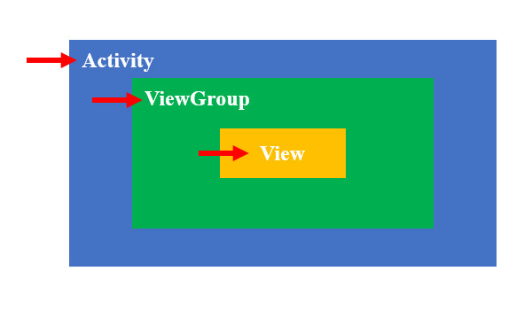
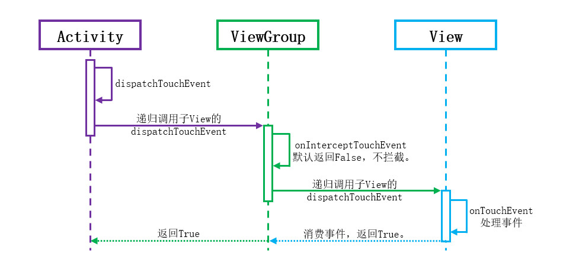

# 简介
系统内置的文本框、按钮、列表等控件提供了点击、滑动翻页等事件处理策略，我们通过注册监听器足够覆盖
对于大多数简单的交互场景，但在部分复杂场景下，需要自行处理底层的UI交互事件，例如实现绘图板，滑动控件嵌套等，本章将介绍相关知识。

本章的示例工程详见以下链接：

- [🔗 示例工程：触控交互](https://github.com/BI4VMR/Study-Android/tree/master/M03_UI/C08_CtrlCustom/S04_Interaction)


# 交互事件
在Android系统中，MotionEvent类用于描述用户与界面交互时产生的事件，例如：手指接触屏幕、手指在屏幕上滑动、鼠标单击等。


我们可以注册touch监听器接收这些事件，并输出日志查看事件详情。

```text
# 手指接触按钮
09:57:37.942 13250 13250 I View OnTouch: MotionEvent { action=ACTION_DOWN, actionButton=0, id[0]=0, x[0]=271.97656, y[0]=66.94629, toolType[0]=TOOL_TYPE_FINGER, buttonState=0, classification=NONE, metaState=0, flags=0x0, edgeFlags=0x0, pointerCount=1, historySize=0, eventTime=402008248, downTime=402008248, deviceId=12, source=0x5002, displayId=0, eventId=561566306 }

# 手指离开屏幕
09:57:38.410 13250 13250 I View OnTouch: MotionEvent { action=ACTION_UP, actionButton=0, id[0]=0, x[0]=466.9619, y[0]=383.9463, toolType[0]=TOOL_TYPE_FINGER, buttonState=0, classification=NONE, metaState=0, flags=0x0, edgeFlags=0x0, pointerCount=1, historySize=0, eventTime=402008720, downTime=402008248, deviceId=12, source=0x5002, displayId=0, eventId=1000501306 }
```

MotionEvent实例的 `int getAction()` 方法用于获取事件类型，常见的事件类型如下文列表所示：

- `ACTION_DOWN (0)` : 手指开始接触屏幕时触发一次该事件，它是一次触控交互的起点。
- `ACTION_UP (1)` : 手指离开屏幕时触发一次该事件，它是一次触控交互的终点。
- `ACTION_MOVE (2)` : 手指在屏幕上滑动时，将会反复触发该事件，其中包含手指在屏幕上的最新坐标。
- `ACTION_CANCEL (3)` : 其他事件被上层容器拦截时，触发一次该事件，通知当前控件应当取消后续操作。
- `ACTION_OUTSIDE (4)` : 手指触摸控件外部区域时触发一次该事件。控件默认不会接收该事件，我们需要在Window中配置 `FLAG_WATCH_OUTSIDE_TOUCH` 启用该功能，点击弹窗外部关闭弹窗就是通过该事件触发的。

一次触控交互包含多个事件，我们将其称为事件序列，常见的事件序列如下文：

单击

手指落下(ACTION_DOWN)  －> 离开(ACTION_UP)

滑动

手指落下(ACTION_DOWN) －> 多次移动(ACTION_MOVE) －> 多次移动(ACTION_MOVE) －> ... －> 离开(ACTION_UP)


除了事件类型，MotionEvent实例还提供了一些额外的信息：

- `float getX()` : 获取事件触发位置相对所属控件的X轴坐标。
- `float getY()` : 获取事件触发位置相对所属控件的Y轴坐标。
- `float getRawX()` : 获取事件触发位置相对整个屏幕的X轴坐标。
- `float getRawY()` : 获取事件触发位置相对整个屏幕的Y轴坐标。
- `long getEventTime()` : 获取当前事件发生时刻的时间戳。
- `long getDownTime()` : 获取当前事件序列中 `ACTION_DOWN` 事件的时间戳。


# 交互流程
递归下发（从外向内寻找处理者）、逐层响应（内层处理者消耗事件则结束，未消耗事件则逐步请求外层）。

<div align="center">



</div>

事件处理流程主要涉及以下方法：

🔷 `boolean dispatchTouchEvent(Event ev)`

该方法是事件处理流程的入口，用于控制事件分发逻辑。该方法是activity、Viewgroup、view共有的，为递归调用，Activity收到后调用Viewgroup的dispatchTouchEvent，viewgroup继续调用view的dispatchTouchEvent

ViewGroup收到触摸事件后，通常会递归调用触摸位置的子View的dispatchTouchEvent，交给子VIew处理，View作为末端，会调用其onTouchEvent方法处理事件，然后返回true消费事件，该返回值回传给ViewGroup、系统，处理流程结束。

true时,dispatchTouchEvent自己消费事件，不走onInterceptTouchEvent/onTouchEvent,同时也没有返回上层
false时,dispatchTouchEvent不分发事件，直接返回上层容器，让上层容器自己处理，同时也不走onInterceptTouchEvent/onTouchEvent
super.dispatchTouchEvent(ev) 才会分发事件,递归调用子控件的dispatchTouchEvent方法，寻找处理者。


🔷 `boolean onInterceptTouchEvent(Event ev)`

该方法是ViewGroup的专有方法，用于控制是否需要拦截事件

返回值为 `true` 表示拦截事件，接着回调自身的onTouchEvent方法

返回值为 `false` 表示不拦截事件，继续调用子View的dispatchTouchEvent方法，将事件传递给子View处理。

ViewGroup的默认逻辑为只拦截“鼠标拖动滚动条”事件，其他场景都不拦截事件，全部透传给子View处理。


🔷 `boolean onTouchEvent(Event ev)`

真正响应事件的地方，检查有没有touchelistener、点击回调、长按回调等，并进行调用。

返回值： `true` 表示消费事件，此时事件不会向上层传递， `false` 表示未消费事件，事件向上层继续传递。


<br />

我们通过最为常见的场景了解上述方法的作用：创建一个Activity，并在根布局中放置一个按钮，然后重写Activity、根布局、按钮的事件处理方法，添加日志输出语句，运行示例程序后点击按钮并观察控制台消息：

```text
10:38:17.406  8927  8927 I Activity: DispatchTouchEvent. Type:[0]
10:38:17.406  8927  8927 I ViewGroup: DispatchTouchEvent. Type:[0]
10:38:17.406  8927  8927 I ViewGroup: OnInterceptTouchEvent. Type:[0]
10:38:17.406  8927  8927 I ViewGroup: OnInterceptTouchEvent end, return:[false]
10:38:17.406  8927  8927 I View    : DispatchTouchEvent. Type:[0]
10:38:17.406  8927  8927 I View    : OnTouchEvent. Type:[0]
10:38:17.407  8927  8927 I View    : OnTouchEvent end, return:[true]
10:38:17.407  8927  8927 I View    : DispatchTouchEvent end, return:[true]
10:38:17.407  8927  8927 I ViewGroup: DispatchTouchEvent end, return:[true]
10:38:17.407  8927  8927 I Activity: DispatchTouchEvent end, return:[true]

# 此处已省略部分输出内容...

10:38:17.488  8927  8927 I View: 按钮被点击了！
```

根据上述输出内容，我们将各组件之间的交互排列在时间线上：

<div align="center">



</div>

1. 当手指接触到屏幕时， `ACTION_DOWN` 事件首先从Framework传递到Activity，Activity的 `dispatchTouchEvent()` 方法开始执行，该方法继续调用布局根容器的 `dispatchTouchEvent()` 方法，请求布局根容器处理该事件。
2. 布局根容器的 `dispatchTouchEvent()` 方法开始执行，首先调用自身的 `OnInterceptTouchEvent()` 方法检查是否需要拦截事件，默认策略为不拦截。接下来，根容器倒序遍历子View集合，查找触摸位置最顶层的子View（此处即按钮），然后调用它的 `dispatchTouchEvent()` 方法，请求子View处理该事件。
3. 按钮的 `dispatchTouchEvent()` 方法开始执行，该方法继续调用 `onTouchEvent()` 处理事件。 `onTouchEvent()` 方法将会回调开发者设置的点击事件监听器，并返回 `true` 消费事件，表明事件处理已经结束。
4. 按钮的 `onTouchEvent()` 方法返回值逐步传递给根容器、Activity，整个流程结束。

此时我们可以整理三种界面组件的默认行为：


Activity: 顶级容器，下发给DecorView,DecorView下发给contentView,此时就是我们通过layout设置的根容器，并且事件由子View消耗；如果子View未处理返回false，调用自己的 onTouchEvent。


ViewGroup: 上层ViewGroup下发点击事件，调用ViewGroup的dispatchTouchEvent方法， dispatchTouchEvent内部调用 onInterceptTouchEvent方法，如果未拦截，继续调用 子View的dispatchTouchEvent方法。如果此时被拦截，事件不必下发给子元素，调用自己的 onTouchEvent。


View: 上层ViewGroup下发点击事件，调用View的dispatchTouchEvent方法，View不能拥有子元素，因此没什么可分发的，继续调用自身的 `onTouchEvent` 方法

onTouchEvent返回true，表示处理完毕，流程结束；onTouchEvent返回false，表示事件未处理完，请求外层ViewGroup处理。


在传递过程中，一般可以自定义的部分是两个，下发时可以根据需要拦截部分事件，例如：VP禁止滑动；末端控件可以返回false不处理，此时事件将会回调上层容器的ViewGroup

事件序列，一组事件的down在某个控件onTouchEvent被消费，即返回true， 那么ACTION_MOVE和ACTION_UP就会从上往下（通过dispatchTouchEvent）做事件分发往下传，就只会传到这个控件，不会继续往下传，如果ACTION_DOWN事件是在dispatchTouchEvent消费，那么事件到此为止停止传递，如果ACTION_DOWN事件是在onTouchEvent消费的，那么会把ACTION_MOVE或ACTION_UP事件传给该控件的onTouchEvent处理并结束传递。

