# 简介
本节内容详细介绍了 Jetpack Compose 中的各种布局容器。

本章的示例工程详见以下链接：

- [🔗 示例工程：布局](https://github.com/BI4VMR/Study-Android/tree/master/M03_UI/C10_Compose/S02_Layout)


# 全局属性
## 尺寸约束
### 默认规则
在 Compose 中，我们可以通过 Modifier 属性配置组件的尺寸约束。

当我们未指定任何约束条件时，控件的尺寸与其内容相同，类似 View 中的 `LayoutParams.WRAP_CONTENT` 。

🔴 示例一：默认尺寸约束。

在本示例中，我们为 Text 控件添加灰色背景，观察文本内容与背景区域的关系。

`TestUIBase.kt` :

```kotlin
Text(
    text = "我能吞下玻璃而不伤身体。",
    modifier = Modifier.background(Color.Gray)
)
```

此时运行示例程序，并查看界面外观：

<div align="center">

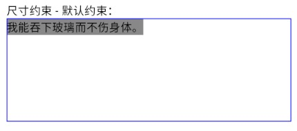

</div>

### 固定宽高
以下属性可用于设置组件的宽度与高度：

- `size(size: Dp)` : 将控件的宽度与高度都设为 `size` 指定的值。
- `size(width: Dp, height: Dp)` : 分别指定控件的宽度与高度。
- `width(width: Dp)` : 指定控件的宽度。
- `height(height: Dp)` : 指定控件的高度。

🟠 示例二：固定尺寸约束。

在本示例中，我们为 Text 控件设置固定宽度。

`TestUIBase.kt` :

```kotlin
Text(
    text = "我能吞下玻璃而不伤身体。",
    modifier = Modifier
        // 固定宽度：50 dp
        .width(50.dp)
        .background(Color.Gray)
)
```

此时运行示例程序，并查看界面外观：

<div align="center">

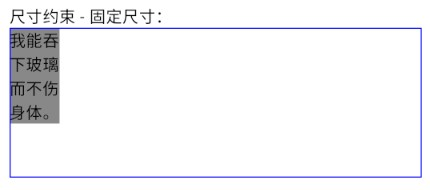

</div>

此时组件的宽度固定为 `50 dp` ，高度未被约束，因此文本在到达宽度限制后换行显示。

### 比例约束
以下属性可使子元素的宽度或高度与父容器保持固定比例：

- `fillMaxWidth(fraction: Float)` : 子元素宽度为 `< 父容器宽度 × fraction >` 。
- `fillMaxHeight(fraction: Float)` : 子元素高度为 `< 父容器高度 × fraction >` 。
- `fillMaxSize(fraction: Float)` : 子元素宽高均与父容器保持 `fraction` 倍数关系 。

以上方法中 `fraction` 的默认值为 `1.0F` ，此时子元素的宽或高与父容器保持一致，类似 View 中的 `LayoutParams.MATCH_PARENT` 。

🟡 示例三：比例约束。

在本示例中，我们使 Text 控件的宽高与父容器保持一致。

`TestUIBase.kt` :

```kotlin
Text(
    text = "我能吞下玻璃而不伤身体。",
    modifier = Modifier
        // 当前元素的宽高都跟随父容器
        .fillMaxSize()
        .background(Color.Gray)
)
```

此时运行示例程序，并查看界面外观：

<div align="center">

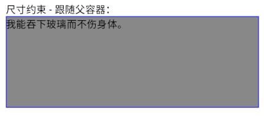

</div>

---

`fillMax` 系列方法根据父容器比例设置宽高，因此在同一个容器中，所有子元素的 `fraction` 之和应小于或等于 1 。

一种常见的错误用法是：容器内多个子元素都设置了 `fillMaxWidth(1.0F)` ，此时首个子元素将占据父容器的所有空间，其他子元素均被挤出容器可见范围，我们无法看到这些子元素。

### 最小宽高
我们可以通过 `defaultMinSize(minWidth: Dp = Dp.Unspecified, minHeight: Dp = Dp.Unspecified)` 方法指定组件的最小宽度或高度，当内容的尺寸小于预设值时，确保组件尺寸至少为预设的值。

当参数值为 `Dp.Unspecified` 时，表示本方向不作限制，此时遵循默认规则以内容尺寸为准。

🟢 示例四：最小尺寸。

在本示例中，我们为 Text 控件设置最小尺寸约束。

`TestUIBase.kt` :

```kotlin
Text(
    text = "Hello!",
    modifier = Modifier
        // 最小宽高为 120 dp ，当内容尺寸小于 120 dp 时，仍会占用 120 dp 的空间。
        .defaultMinSize(120.dp, 120.dp)
        .background(Color.Gray)
)
```

此时运行示例程序，并查看界面外观：

<div align="center">

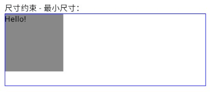

</div>

### 最大尺寸
有时我们需要约束组件的最大尺寸，此时可以使用以下方法：

```kotlin
fun Modifier.sizeIn(
    minWidth: Dp = Dp.Unspecified,
    minHeight: Dp = Dp.Unspecified,
    maxWidth: Dp = Dp.Unspecified,
    maxHeight: Dp = Dp.Unspecified,
)
```

该方法的 `minWidth` 和 `minHeight` 参数作用与 `defaultMinSize()` 相同，可以约束组件的最小尺寸； `maxWidth` 和 `maxHeight` 则用于约束控件的最大尺寸。

🔵 示例五：最大尺寸。

在本示例中，我们为 Text 控件设置最大尺寸约束。

`TestUIBase.kt` :

```kotlin
Text(
    text = "我能吞下玻璃而不伤身体。",
    modifier = Modifier
        // 最大宽度为 50 dp ，最大高度为未指定。
        .sizeIn(maxWidth = 50.dp, maxHeight = Dp.Unspecified)
        .background(Color.Gray)
)
```

此时运行示例程序，并查看界面外观：

<div align="center">

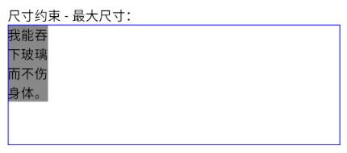

</div>

## 边距
### 基本应用
我们可以通过以下方法为组件的内容添加边距：

- `padding(all: Dp)` : 将四个方向的边距都设为 `all` 。
- `padding(horizontal: Dp = 0.dp, vertical: Dp = 0.dp)` : 分别设置水平或垂直方向的边距。
- `padding(start: Dp = 0.dp, top: Dp = 0.dp, end: Dp = 0.dp, bottom: Dp = 0.dp)` : 分别设置四个方向的边距。

🟣 示例六：边距。

在本示例中，我们为 Text 控件设置边距属性。

`TestUIBase.kt` :

```kotlin
Text(
    text = "我能吞下玻璃而不伤身体。The quick brown fox jumps over the lazy dog.",
    modifier = Modifier
        .padding(50.dp)
        .background(Color.Gray)
)
```

此时运行示例程序，并查看界面外观：

<div align="center">

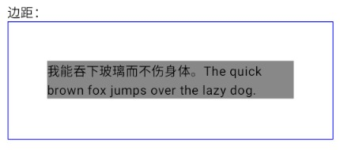

</div>

此时文本内容四周都增加了 `50 dp` 的边距。

### 配置顺序
Modifier 的语句顺序将会影响最终效果，较晚出现的语句将继承先前语句的条件。

🟤 示例七：配置顺序。

在本示例中，我们为 Text 控件设置边距与背景。

`TestUIBase.kt` :

```kotlin
Text(
    text = "我能吞下玻璃而不伤身体。",
    modifier = Modifier
        .background(Color.Gray)
        .padding(25.dp)
        .background(Color.Cyan)
)
```

此时运行示例程序，并查看界面外观：

<div align="center">

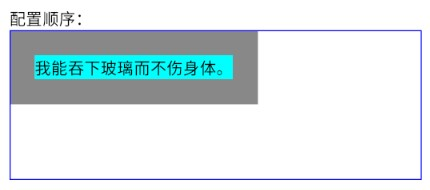

</div>

此处的 `background(Color.Gray)` 语句前没有其他语句，因此绘制范围与控件尺寸相同；而 `background(Color.Cyan)` 语句前是 `padding(25.dp)` 语句，因此该背景在“内边距为 `25 dp` ” 的范围内绘制。

---

我们应当合理规划各语句的顺序，完成布局与样式配置，下文列表是推荐的配置顺序：

1. 本组件在父容器中的对齐规则。（ `align()` 等）
2. 尺寸相关约束规则。
3. 模拟外边距。
4. 背景、剪裁、阴影等样式。
5. 交互事件、动画等动态内容。

Compose 中未提供 View 的 Margin 属性，若要实现相似的效果，我们可以将 `padding()` 配置到目标组件 Modifier 的尺寸约束之后、样式之前，或目标组件父容器 Modifier 的尾部。

## 可选属性
有时我们需要根据某些条件控制是否添加属性，可以使用 `then()` 方法。

🔴 示例八：可选属性。

在本示例中，我们定义 Tab 组件，根据 `allowClick` 参数控制是否启用预设的点击事件。

`TestUIBase.kt` :

```kotlin
@Composable
fun Tab(
    title: String,
    modifier: Modifier = Modifier,
    allowClick: Boolean = true
) {
    val context = LocalContext.current
    // 组件的根布局，继承外部传入的 Modifier 。
    Column(
        modifier = modifier
            .background(Color.Magenta.copy(0.3F), RoundedCornerShape(16.dp))
            // 可选属性，根据 `allowClick` 决定是否添加点击事件。
            .then(
                if (allowClick) Modifier.clickable {
                    Toast.makeText(context, title, Toast.LENGTH_SHORT).show()
                }
                else Modifier
            )
            .padding(8.dp)
    ) {
        Text(title)
    }
}
```

`then()` 方法用于将另一个 Modifier 实例的属性融合到当前 Modifier 。在上文代码中，如果 Tab 组件的调用者指明 `allowClick` 参数为 `true` ，则 `Modifier.clickable()` 语句定义的点击事件将合并至调用者传入的 Modifier 中；如果调用者指明 `allowClick` 参数为 `false` ，则合并没有任何属性的 Modifier 实例，未改变调用者传入的原始 Modifier 。


# Column 和 Row
## 简介
Column 将子元素依次垂直排列； Row 将子元素依次水平排列，它们是 Compose 中的基础布局组件，能够实现常见的用户界面框架。

## 基本应用
下文示例展示了 Column 和 Row 的基本使用方法。

🟠 示例九： Column 和 Row 的基本应用。

在本示例中，我们声明 Column 和 Row 容器并放置一些文本框，观察它们的排列规则。

第一步，编写示例程序，并观察 Column 的排列规则。

`TestUIBase.kt` :

```kotlin
Column {
    // 子元素 A
    Text(
        text = "A",
        modifier = Modifier
            .size(50.dp)
            .background(Color.Cyan)
    )
    // 子元素 B
    Text(
        text = "B",
        modifier = Modifier
            .width(100.dp)
            .height(50.dp)
            .background(Color.Red)
    )
    // 子元素 C
    Text(
        text = "C",
        modifier = Modifier
            .width(50.dp)
            .height(75.dp)
            .background(Color.Yellow)
    )
}
```

此时运行示例程序，并查看界面外观：

<div align="center">

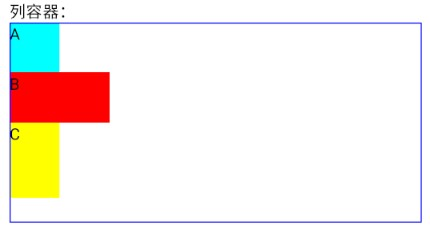

</div>

第二步，在前一步的基础上，将 Column 替换为 Row ，并观察排列规则。

<div align="center">

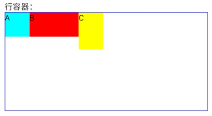

</div>

---

> 🚩 提示
>
> Jetpack Compose 是一个响应式框架，数据变化时只会刷新受影响的组件，与 View 相比组件嵌套不会显著影响性能，因此我们可以利用 Column 和 Row 嵌套组合实现复杂的界面设计。

## 对齐方式
在 Column 和 Row 中，主要布局方向的排列规则被称为 Arrangement ，次要布局方向的对齐方式被称为 Alignment 。以 Row 为例，水平方向为主轴，因此 `horizontalArrangement` 属性用于控制水平方向的对齐方式； `verticalAlignment` 属性则控制垂直方向的对齐方式。

🟡 示例十： Row 的对齐方式。

在本示例中，我们为 Row 设置对齐方式，观察子元素的排列规则。

`TestUIBase.kt` :

```kotlin
Row(
    // 主要轴对齐方式
    horizontalArrangement = Arrangement.End,
    // 次要轴对齐方式
    verticalAlignment = Alignment.CenterVertically,
    modifier = Modifier.fillMaxSize()
) {
    Text(
        text = "A",
        modifier = Modifier
            .size(50.dp)
            .background(Color.Cyan)
    )
    Text(
        text = "B",
        modifier = Modifier
            .width(100.dp)
            .height(50.dp)
            // 局部设置辅助轴对齐方式，覆盖容器全局设置。
            .align(Alignment.Bottom)
            .background(Color.Red)
    )
    Text(
        text = "C",
        modifier = Modifier
            .width(50.dp)
            .height(75.dp)
            .background(Color.Yellow)
    )
}
```

此时运行示例程序，并查看界面外观：

<div align="center">

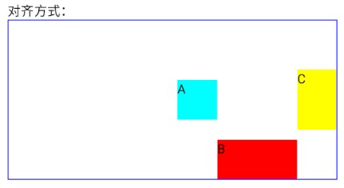

</div>

主要轴被设为与容器末端对齐，因此子元素 C 的末端紧贴父容器末端；次要轴被设为垂直居中，因此所有元素的中点与父容器的垂直中心线对齐。

我们在子元素 B 的 Modifier 中配置了 `align(Alignment.Bottom)` 语句，这将覆盖全局的 `verticalAlignment` 属性，因此该元素不再对齐到垂直中心线，而是与父容器底部对齐。


## 比例布局
我们可以在 Column 或 Row 子元素的 Modifier 中添加 `weight(v: Float)` 属性，控制各子元素在父容器中占据控件的比例。
weight属性控制当前控件在父容器中所占比例

c1 weight 0.8F
c2 weight 0.2F

此时c1占据父容器0.8的宽或高 c2占据父容器0.2的宽或高


特殊用法

c1 不设置
c2 weight 1F

先测量没有设置 weight 的组件，再把剩余空间分配给它
此时表示占据所有剩余控件，c1遵循默认规则，尺寸与内容相等，c2 占据剩余的所有空间。


# Box
## 简介
Box 将所有子元素重叠放置，较晚声明的元素覆盖在较早声明的元素上层，与 View 中的 FrameLayout 类似。

## 基本应用
下文示例展示了 Box 的基本使用方法。

🔴 示例一： Box 的基本应用。

在本示例中，我们声明 Box 容器并放置一些文本框，观察它们的排列规则。

`TestUIBase.kt` :

```kotlin
Box(modifier = Modifier.fillMaxSize()) {
    // 子元素 A
    Text(
        text = "A",
        modifier = Modifier
            .size(150.dp)
            .background(Color.Blue)
    )
    // 子元素 B
    Text(
        text = "B",
        modifier = Modifier
            .size(100.dp)
            .background(Color.Cyan)
    )
    // 子元素 C
    Text(
        text = "C",
        modifier = Modifier
            .size(50.dp)
            .background(Color.Green)
    )
}
```

此时运行示例程序，并查看界面外观：

<div align="center">

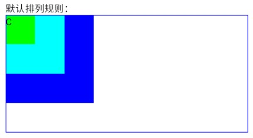

</div>

## 对齐方式
Box 默认将子元素对齐到左上角，我们可以通过 `contentAlignment` 属性更改全局对齐方式。

🔴 示例一： Box 的对齐方式。

在本示例中，我们为 Box 设置对齐方式，观察子元素的排列规则。

`TestUIBase.kt` :

```kotlin
Box(
    // 全局规则：所有子元素都居中对齐。
    contentAlignment = Alignment.Center,
    modifier = Modifier.fillMaxSize()
) {
    // 子元素 A
    Text(
        text = "A",
        modifier = Modifier
            .size(150.dp)
            .background(Color.Blue)
    )
    // 子元素 B
    Text(
        text = "B",
        modifier = Modifier
            .size(100.dp)
            .background(Color.Cyan)
    )
    // 子元素 C
    Text(
        text = "C",
        modifier = Modifier
            .size(50.dp)
            // 局部规则：对齐到父容器的右下角。
            .align(Alignment.BottomEnd)
            .background(Color.Green)
    )
}
```

此时运行示例程序，并查看界面外观：

<div align="center">


</div>

子元素可以通过 `align(Alignment.BottomEnd)` 等语句配置独立的对齐方式，局部配置的优先级高于全局配置，将会覆盖 `contentAlignment` 属性。


# Scaffold

页面脚手架，用于组装topBar/bottombar/fab等组件，实现符合material设计的页面。


    LazyColumn 与 LazyRow：高性能长列表实现。

    LazyVerticalGrid：网格布局。

    关键点：item 与 items 的 DSL 语法、key 的重要性。

约束布局 (ConstraintLayout)

    在 Compose 中引入 ConstraintLayout 的场景。

    使用 createRefs() 与 constrainAs 建立约束。

