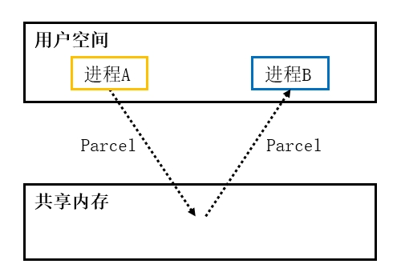

# 概述
Parcelable是一种序列化接口，一个类实现该接口后，其派生的对象就可以被序列化传输。

Parcelable是Android SDK提供的序列化工具，它与JDK中的Serializable接口功能类似，但Parcelable基于内存实现的，不需要使用IO流，效率比Serializable更高。

<div align="center">



</div>

由于该方案通过内存共享数据，为了避免数据丢失，我们不应该将其用于持久化场景，只能用于数据传输场景，例如：Intent参数传递、进程间通信、网络通信等。

Parcelable支持以下数据类型：

🔷 基本数据类型

包括基本类型、基本类型的包装类、基本类型数组。

🔷 字符串

包括String、String数组、String列表。

🔷 Parcelable

包括单个Parcelable对象和Parcelable列表。

🔷 Serializable

仅支持单个Serializable对象，不支持Serializable列表。

🔷 Bundle

包括单个Bundle对象、Bundle列表。

🔷 Binder

包括单个IBinder实例、IBinder列表。

# 基本应用
此处以书本实体类Book为例，我们设置3个属性描述书本的信息，分别是：“ID、名称、类型”，然后为Book类实现Parcelable接口。

Book.java:

```java
public class Book implements Parcelable {

    // ID
    private int id;
    // 名称
    private String name;
    // 分类
    private List<String> type;

    // Parcel构造器静态变量
    public static final Creator<Book> CREATOR = new Creator<Book>() {
        @Override
        public Book createFromParcel(Parcel in) {
            return new Book(in);
        }

        @Override
        public Book[] newArray(int size) {
            return new Book[size];
        }
    };

    // Parcel构造方法
    protected Book(Parcel in) {
        id = in.readInt();
        name = in.readString();
        type = in.createStringArrayList();
    }

    /**
     * Name        : 内容描述
     * <p>
     * Description : 描述被打包数据的类型，"0"表示普通Bean对象。
     */
    @Override
    public int describeContents() {
        return 0;
    }

    /**
     * Name        : 向Parcel容器写入数据
     * <p>
     * Description : 将属性写入Parcel容器进行打包。
     */
    @Override
    public void writeToParcel(Parcel dest, int flags) {
        dest.writeInt(id);
        dest.writeString(name);
        dest.writeStringList(type);
    }

    /* 此处省略Get、Set与构造方法... */
}
```

其中 `writeToParcel()` 方法实现了将Book属性写入Parcel容器的功能， `Creator` 静态变量实现了从Parcel容器创建Book对象的功能，此时Book对象就可以被序列化传输了。

上述方法使用Android Studio的代码生成功能即可自动完成，可适用于接收端仅读取一次数据的场景（例如通过Intent传递给Activity）。如果接收端需要多次读取Parcel容器中的数据（例如AIDL），我们还需要实现 `readFromParcel(Parcel src)` 方法，此方法不是接口中明确定义的方法，但名称与参数列表形式不能随意更改，否则调用者无法自动识别该方法。

```java
/**
 * Name        : readFromParcel()
 * <p>
 * Description : 从Parcel容器中读取各属性的数据。
 */
public void readFromParcel(Parcel src) {
    // 读取基本数据类型的数据
    id = src.readInt();
    name = src.readString();
    // 读取引用数据类型的数据
    src.readStringList(type);
}
```

接下来我们在Activity中创建Book实例，将其封装在Intent中，实例化传输给DstActivity，作为它的初始化参数。

DemoBaseUI.java:

```java
// 创建Book对象
List<String> type = new ArrayList<>();
type.add("Android");
type.add("Java");
type.add("Kotlin");
Book book = new Book(1, "第一行代码", type);

// 点击按钮时触发操作
btGoTo.setOnClickListener(v -> {
    // 将Book对象打包并传递给DstActivity
    Intent intent = new Intent(this, DstActivity.class);
    intent.putExtra("BOOK_INFO", book);
    startActivity(intent);
});
```

在DstActivity中，我们通过Intent的 `getParcelableExtra()` 方法取出Book实例，并将其信息显示在控制台上。

DstActivity.java:

```java
@Override
protected void onCreate(Bundle savedInstanceState) {

    /* 此处省略部分代码... */

    // 获取Intent中的数据
    Intent intent = getIntent();
    if (intent != null) {
        Book book = intent.getParcelableExtra("BOOK_INFO");
        if (book != null) {
            // 将接收到的Book信息设置在TextView中
            tvInfo.setText(book.toString());
        }
    }
}
```

运行示例程序，点击按钮"btGoTo"启动DstActivity，并查看Logcat输出：

```text
2023-03-08 17:31:25.635 6239-6239/? I/myapp: Book{id=1, name='第一行代码', type=[Android, Java, Kotlin]}
```

上述日志表明DstActivity从Parcel容器中读取到了数据，并且成功地反序列化为Book对象。


# 简化


https://developer.android.com/kotlin/parcelize


plugins {
    id 'kotlin-parcelize'
}


plugins {
    id("kotlin-parcelize")
}

import kotlinx.parcelize.Parcelize

@Parcelize
class User(val firstName: String, val lastName: String, val age: Int): Parcelable


# 问题

参数不一致
注意read和write方法中每个参数是否一一对应

12:04:21.928 32620-32646 System.err                 W  java.lang.IllegalStateException
12:04:21.928 32620-32646 System.err                 W  	at android.os.Parcel.readException(Parcel.java:2021)
12:04:21.928 32620-32646 System.err                 W  	at android.os.Parcel.readException(Parcel.java:1959)