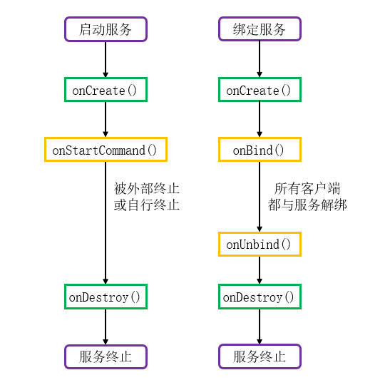

# 简介
截止至本节内容，我们已经知晓了启动服务与绑定服务的实现方法，本节内容将对两种服务的生命周期进行详细的探讨。

本章的示例工程详见以下链接：

- [🔗 示例工程：生命周期](https://github.com/BI4VMR/Study-Android/tree/master/M04_System/C02_Service/S03_Lifecycle)


# 回调方法
Service的生命周期状态转换过程如下文图片所示：

<div align="center">



</div>

Service的生命周期回调方法详见下文内容：

🔷 `onCreate()`

外部组件首次启动或绑定服务时，该方法被触发，我们可以在此处进行初始化操作。

当服务已经在运行时，外部组件再次启动或绑定服务不会重复触发此方法。

🔷 `onStartCommand()`

当外部组件通过 `startService()` 方法请求启动Service时，该方法被触发。

🔷 `onBind()`

当外部组件通过 `bindService()` 方法请求绑定Service时，该方法被触发。

此方法通过返回值对外提供Binder实例，以便调用者与Service之间进行通信。由于这是一个抽象方法，所有Service都必须将其实现，如果Service确实不需要与调用者通信，我们可以将返回值设为空值。

🔷 `onUnbind()`

当所有与Service绑定的外部组件都解除绑定关系后，该方法被触发。

🔷 `onRebind()`

如果我们在 `onUnbind()` 方法中返回 `true` ，且Service已经被所有外部组件解绑；当Service再次被外部组件绑定时将会触发此方法。

如果我们在 `onUnbind()` 方法中返回 `false` ，且Service已经被所有外部组件解绑；当Service再次被外部组件绑定时不会触发此方法。

🔷 `onDestroy()`

当Service使用完毕（没有未结束的任务且没有任何绑定关系）可被回收或因系统资源不足而被强制回收时，该方法被触发。

我们应当在此处对Service所关联的资源进行清理，例如：终止后台任务、注销广播接收器等。


# 实际场景
## 启动服务
一个Service被外部组件通过 `startService()` 方法请求启动时，首先 `onCreate()` 方法被回调，然后 `onStartCommand()` 方法被回调。

在Service运行过程中，若再次被请求启动，系统只会回调 `onStartCommand()` 方法，且执行次数与被请求启动的次数一致。

系统只会创建一个Service实例，并且该实例一直在后台运行，直到外部组件调用 `stopService()` 将其终止，或其自身任务完成主动调用 `stopSelf()` 方法。

我们运行一次示例程序，向测试服务发送若干绑定、解绑命令，并查看控制台输出信息：

```text
# 首次请求启动服务
09:19:57.034  1955  1955 I TestUILifeCycle: --- 启动服务 ---
09:19:57.069  1955  1955 I TestService: OnCreate.
09:19:57.102  1955  1955 I TestService: OnStartCommand.


# 再次请求启动服务
09:20:01.635  1955  1955 I TestUILifeCycle: --- 启动服务 ---
09:20:01.670  1955  1955 I TestService: OnStartCommand.


# 终止服务
09:20:05.354  1955  1955 I TestUILifeCycle: --- 停止服务 ---
09:20:05.381  1955  1955 I TestService: OnDestroy.
```

## 绑定服务
一个Service被外部组件通过 `bindService()` 方法请求绑定时，首先 `onCreate()` 方法被回调，然后 `onBind()` 方法被回调。不同的组件可以绑定到同一个Service，但 `onBind()` 方法是否再次触发取决于 `bindService()` 所传入的Intent属性。

如果多个Intent的Action和Type属性完全相同，它们将被视作相同的请求者，系统只会在首个请求到达时回调一次 `onBind()` 方法，后续请求到达时，系统直接返回先前 `onBind()` 方法已经创建的Binder实例。“相同请求者”的判断条件不包括包名与Bundle数据。

当所有外部组件都调用 `unbindService()` 方法与Service解除绑定关系后，系统将会回调 `onUnbind()` 方法，然后再回调 `onDestroy()` 方法终止Service。

我们运行一次示例程序，使用具有不同Type的Intent绑定、解绑测试服务，并查看控制台输出信息：

```text
# 组件A请求绑定Service
10:22:56.450  2721  2721 I TestUILifeCycle: --- 绑定服务（请求A） ---
10:22:56.480  2721  2721 I TestService: OnCreate.
10:22:56.480  2721  2721 I TestService: OnBind.
10:22:56.520  2721  2721 I TestUILifeCycle: OnServiceConnected. Name:[A] Binder:[1315785]


# 组件B请求绑定Service
10:23:00.551  2721  2721 I TestUILifeCycle: --- 绑定服务（请求B） ---
10:23:00.585  2721  2721 I TestService: OnBind.
10:23:00.621  2721  2721 I TestUILifeCycle: OnServiceConnected. Name:[B] Binder:[208459226]


# 组件B请求解绑Service
10:23:04.444  2721  2721 I TestUILifeCycle: --- 解绑服务（请求B） ---
10:23:04.481  2721  2721 I TestService: OnUnbind.


# 组件A请求解绑Service
10:23:08.871  2721  2721 I TestUILifeCycle: --- 解绑服务（请求A） ---
10:23:08.902  2721  2721 I TestService: OnUnbind.
10:23:08.904  2721  2721 I TestService: OnDestroy.
```

根据上述输出内容可知：

- 首次收到绑定请求时， `onCreate()` 回调方法触发，后续并未再次触发。
- 使用具有不同Type的Intent请求绑定测试服务时，`onBind()` 回调方法都触发了，因此系统返回了不同的Binder实例。
- 当外部组件A和B都与测试服务解绑后， `onDestroy()` 回调方法即被触发，Service实例被系统回收。

## 混合服务
如果Service先被请求启动，再被请求绑定， `onCreate()` 方法只会执行一次，然后依次执行 `onStartCommand()` 和 `onBind()` 方法。

如果所有绑定者都与服务解绑，系统将会调用 `onUnbind()` 方法，但不会终止服务，除非外部组件调用 `stopService()` 或服务自身调用 `stopSelf()` 方法。
