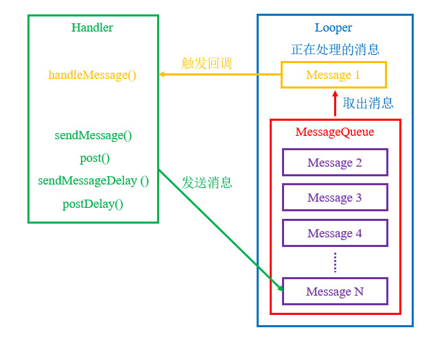

# 简介
Handler是Android中的一种消息队列，能够对多个任务进行排序，并按照顺序依次处理每个任务。Handler是Android Framework处理事件序列的常用工具，也是Android UI体系的基础工具。

Handler所涉及的组件及工作原理可参考下文图片：

<div align="center">



</div>

下文列表将对Handler中的各个组件进行详细说明：

- `Message` : 消息，包括类型标识符、参数、回调方法等。
- `MessageQueue` : 消息队列，用于管理尚未被处理的消息，所有的消息将按照它们预计被处理的时刻排序。
- `Looper` : 调度器，当消息队列中有消息时负责处理消息，无消息时则阻塞并等待新的消息。每个线程拥有唯一的Looper对象，这意味着如果某个消息处理耗时过长，将会导致其他消息被延后处理。
- `Handler` : 该类是我们发送与接收消息的访问点。

与绝大多数操作系统相同，为了避免多线程更新UI导致状态不一致、死锁等问题，Android也采用了单线程UI模型。各个组件通过Handler将更新指令发送到UI线程的消息队列中，Looper不断地从队列中检索待处理的指令，然后依次进行处理，确保指令的有序性。

每当我们发起UI更新请求时，ViewRootImpl的 `checkThread()` 方法会检查创建View的线程与请求更新的线程是否一致，如果两者不一致，将会抛出以下异常：

```text
05:52:14.065 25317 25370 E AndroidRuntime: Process: net.bi4vmr.study.system.concurrent.handler, PID: 25317
05:52:14.065 25317 25370 E AndroidRuntime: android.view.ViewRootImpl$CalledFromWrongThreadException: Only the original thread that created a view hierarchy can touch its views.
05:52:14.065 25317 25370 E AndroidRuntime:        at android.view.ViewRootImpl.checkThread(ViewRootImpl.java:9526)
05:52:14.065 25317 25370 E AndroidRuntime:        at android.view.ViewRootImpl.invalidateChildInParent(ViewRootImpl.java:1931)
05:52:14.065 25317 25370 E AndroidRuntime:        at android.view.ViewGroup.invalidateChild(ViewGroup.java:6147)
05:52:14.065 25317 25370 E AndroidRuntime:        at android.view.View.invalidateInternal(View.java:18857)
05:52:14.065 25317 25370 E AndroidRuntime:        at android.view.View.invalidate(View.java:18817)
05:52:14.065 25317 25370 E AndroidRuntime:        at android.view.View.invalidate(View.java:18799)
05:52:14.065 25317 25370 E AndroidRuntime:        at net.bi4vmr.study.base.TestUIBase$onCreate$1.invoke(TestUIBaseKT.kt:62)
05:52:14.065 25317 25370 E AndroidRuntime:        at kotlin.concurrent.ThreadsKt$thread$thread$1.run(Thread.kt:30)
```

应用程序的主线程通常就是创建View的线程，因此我们需要在主线程中进行UI更新操作；对于耗时较长的任务（例如：下载图片、统计数据等），我们应当开启子线程进行处理，并将结果通过Handler从子线程发送至主线程，才能成功地更新UI并避免前文的异常。

本章的示例工程详见以下链接：

- [🔗 示例工程：Handler](https://github.com/BI4VMR/Study-Android/tree/master/M04_System/C06_Concurrent/S02_Handler)

# 基本应用
下文示例展示了Handler的基本使用方法。

🔴 示例一：Handler的基本应用。

在本示例中，我们通过Handler处理自定义消息，实现更新UI的功能。

第一步，我们在测试Activity中声明一个Handler对象 `mHandler` ，并重写它的 `handleMessage()` 方法，实现自定义消息处理逻辑。

"TestUIBase.java":

```java
// 声明常量表示不同的消息
private final int MSG_TEST_01 = 0x01;
private final int MSG_TEST_02 = 0x02;

// 创建Handler对象，使用主线程的事件循环。
private final Handler mHandler = new Handler(Looper.getMainLooper()) {

    // 回调方法：当有新消息需要处理时被触发
    @Override
    public void handleMessage(@NonNull Message msg) {
        int code = msg.what;
        switch (code) {
            case MSG_TEST_01:
                Log.d(TAG, "HandleMessage 1.");
                // 在此处编写收到1号消息后需要执行的逻辑...
                tvLog.append("HandleMessage 1.");
                break;
            case MSG_TEST_02:
                Log.d(TAG, "HandleMessage 2. Arg1:[" + msg.arg1 + "] Arg2:[" + msg.arg2 + "]");
                // 在此处编写收到2号消息后需要执行的逻辑...
                tvLog.append("HandleMessage 2. Arg1:[" + msg.arg1 + "] Arg2:[" + msg.arg2 + "]");
        }
    }
};
```

在上述代码中，Handler的构造方法唯一参数为 `Looper.getMainLooper()` ，表示将该Handler关联到主线程。

`handleMessage(Message msg)` 是一个回调方法，当Looper开始处理MessageQueue首部的Message时，该方法将被触发，唯一参数 `msg` 即正被处理的Message。

Handler通过数字编号区分不同的Message，我们通常将序号定义为常量或枚举，以便规范地引用，明确消息的用途。

由于此处的Handler与主线程相关联，我们可以在 `handleMessage()` 方法中进行更新UI的操作。此处的 `tvLog` 是一个TextView，Handler收到消息后会将文本更新到TextView中。

上述内容也可以使用Kotlin语言编写：

"TestUIBase.kt":

```kotlin
companion object {
    // 声明常量表示不同的消息
    private const val MSG_TEST_01: Int = 0x01
    private const val MSG_TEST_02: Int = 0x02
}

// 创建Handler对象，使用主线程的事件循环。
private val mHandler: Handler = object : Handler(Looper.getMainLooper()) {

    // 回调方法：当有新消息需要处理时被触发
    override fun handleMessage(msg: Message) {
        // 根据"what"属性区分消息
        val code: Int = msg.what
        when (code) {
            0x01 -> {
                Log.d(TAG, "HandleMessage 1.")
                // 在此处编写收到1号消息后需要执行的逻辑...
                tvLog.append("HandleMessage 1.")
            }
            0x02 -> {
                Log.d(TAG, "HandleMessage 2. Arg1:[${msg.arg1}] Arg2:[${msg.arg2}]")
                // 在此处编写收到1号消息后需要执行的逻辑...
                tvLog.append("HandleMessage 2. Arg1:[${msg.arg1}] Arg2:[${msg.arg2}]")
            }
        }
    }
}
```

第二步，我们通过 `mHandler` 向MessageQueue发送一条“消息1”。

"TestUIBase.java":

```java
Log.i(TAG, "--- 向队列中发送消息1 ---");

mHandler.sendEmptyMessage(MSG_TEST_01);
```

Handler对象的 `sendEmptyMessage(int what)` 方法用于向MessageQueue发送内容为空的Message，唯一参数 `what` 指明了Message的数字编号，这种Message不包含任何参数，仅用于触发Handler对象的 `handleMessage()` 回调方法。

上述内容也可以使用Kotlin语言编写：

"TestUIBase.kt":

```kotlin
Log.i(TAG, "--- 向队列中发送消息1 ---")

mHandler.sendEmptyMessage(MSG_TEST_01)
```

此时运行示例程序，并查看控制台输出信息与界面外观：

```text
20:58:42.638 18979 18979 I TestUIBase: --- 向队列中发送消息1 ---
20:58:42.676 18979 18979 D TestUIBase: HandleMessage 1.
```

🟠 示例二：发送携带额外数据的消息。

在前文“示例一”中，Handler对象已经实现了处理“消息2”的逻辑，能够将消息携带的两个参数输出到控制台与界面上。

在本示例中，我们通过Handler发送“消息2”，并设置两个参数。

"TestUIBase.java":

```java
Log.i(TAG, "--- 向队列中发送消息2 ---")

// 从系统申请一个Message对象
Message msg = Message.obtain();
msg.what = MSG_TEST_01;
// 设置参数
msg.arg1 = 114514;
msg.arg2 = 1919810;
// 发送消息
mHandler.sendMessage(msg);
```

在上述代码中，我们使用Message的静态方法 `obtain()` 获取Message对象，然后设置参数并通过Handler的 `sendMessage()` 方法发送Message。

Message对象被使用完毕后，系统不会立刻将其回收，而是放置在缓存池中，缓存池的容量上限为50；当我们调用 `obtain()` 方法时，系统会从缓存池中取出已缓存的Message对象。因此我们推荐使用 `obtain()` 方法获取Message对象，而不是手动创建Message对象。

Message对象的 `arg1` 与 `arg2` 属性是两个"int"型变量，它们可以携带一些简单的参数，以便 `handleMessage()` 回调方法处理这种Message时根据参数作出对应的操作。

上述内容也可以使用Kotlin语言编写：

"TestUIBase.kt":

```kotlin
Log.i(TAG, "--- 向队列中发送消息2 ---");

// 从系统申请一个Message对象
val msg: Message = Message.obtain()
msg.what = MSG_TEST_02
// 设置参数
msg.arg1 = 114514
msg.arg2 = 1919810
// 发送消息
mHandler.sendMessage(msg)
```

此时运行示例程序，并查看控制台输出信息与界面外观：

```text
20:55:06.048 18979 18979 I TestUIBase: --- 向队列中发送消息2 ---
20:55:06.105 18979 18979 D TestUIBase: HandleMessage 2. Arg1:[114514] Arg2:[1919810]
```

除了 `arg1` 与 `arg2` 属性之外，Message还提供了一些其他类型的容器，它们所需的资源依次递增：

- `Object obj` 属性：该属性可以携带单个Object数据；它的访问修饰符为"public"，我们可以直接读写。
- `Bundle data` 属性：该属性可以携带一组Bundle数据；我们需要使用 `setData()` 和 `getData()` 方法读写。

# 发送延时消息
有时我们希望发送Message后经过一段时间再被处理，此时可以使用延时机制。

Message的 `when` 属性指定了期望被处理的时刻，当我们向MessageQueue中发送Message时， `when` 属性的值为“开机到当前时刻的时长 + 延时时长”；MessageQueue会根据Message的 `when` 属性，从小到大依次排列所有消息。

🟡 示例三：发送延时消息。

在本示例中，我们通过Handler发送一些需要被延时处理的消息。

"TestUIBase.java":

```java
Log.i(TAG, "--- 向队列中发送消息（延时执行） ---");

// 向队列发送消息1，延时4秒后执行。
mHandler.sendEmptyMessageDelayed(MSG_TEST_01, 4000L);

// 向队列发送消息2，延时8秒后执行。
Message msg = Message.obtain();
msg.what = MSG_TEST_02;
msg.arg1 = -100;
mHandler.sendMessageDelayed(msg, 8000L);
```

在上述代码中，我们使用Handler的 `sendMessageDelayed()` 和 `sendEmptyMessageDelayed()` 方法向消息队列中发送了两条消息，并通过第二参数设置延时时间，单位为毫秒。

上述内容也可以使用Kotlin语言编写：

"TestUIBase.kt":

```kotlin
Log.i(TAG, "--- 向队列中发送消息（延时执行） ---")

// 向队列发送消息1，延时4秒后执行。
mHandler.sendEmptyMessageDelayed(MSG_TEST_01, 4000L)

// 向队列发送消息2，延时8秒后执行。
val msg: Message = Message.obtain()
msg.what = MSG_TEST_02
msg.arg1 = -100
mHandler.sendMessageDelayed(msg, 8000L)
```

此时运行示例程序，并查看控制台输出信息与界面外观：

```text
23:07:09.125 11167 11167 I TestUIBase: --- 向队列中发送消息（延时执行） ---
23:07:13.193 11167 11167 D TestUIBase: HandleMessage 1.
23:07:17.192 11167 11167 D TestUIBase: HandleMessage 2. Arg1:[-100] Arg2:[0]
```

根据上述输出内容可知：

在消息被发送后的第4秒，“消息1”被处理了；在消息被发送后的第8秒，“消息2”被处理了。

# 提交回调方法
在前文示例中，我们通过重写Handler的 `handleMessage()` 方法定义消息以及对应的操作，这种方式适用于封装被多处调用的、较为复杂的代码语句；有时我们只需通过Handler绑定的线程单次调用某些代码语句，此时我们可以向MessageQueue提交回调方法以简化操作。

提交回调方法这一操作实际上也是向MessageQueue中发送Message，Looper处理这种Message时不会触发Handler对象的 `handleMessage()` 方法，而是直接执行Runnable的 `run()` 方法。

🟢 示例四：提交回调方法。

在本示例中，我们通过Handler提交一些回调方法。

"TestUIBase.java":

```java
Log.i(TAG, "--- 向队列中提交回调方法 ---");

// 向队列提交回调方法，立刻执行。
mHandler.post(new Runnable() {

    @Override
    public void run() {
        Log.i(TAG, "HandleCallback A");
    }
});

// 向队列提交回调方法，延时4秒后执行。
mHandler.postDelayed(() -> {
    Log.i(TAG, "HandleCallback B");
}, 4000L);
```

在上述代码中，我们使用Handler对象的 `post(Runnable r)` 方法提交需要立刻执行的回调方法，唯一参数 `r` 是Runnable接口的实现类，我们应当将待执行的语句放置在 `run()` 方法内。

Handler对象的 `postDelayed(Runnable r, long delayMillis)` 方法用于向消息队列中提交需要被延时执行的回调方法，第二参数 `delayMillis` 指定了延时时长。

上述内容也可以使用Kotlin语言编写：

"TestUIBase.kt":

```kotlin
Log.i(TAG, "--- 向队列中提交回调方法 ---")

// 向队列提交回调方法，立刻执行。
mHandler.post(object : Runnable {

    override fun run() {
        Log.i(TAG, "HandleCallback A")
    }
})

// 向队列提交回调方法，延时4秒后执行。
mHandler.postDelayed({
    Log.i(TAG, "HandleCallback B")
}, 4000L)
```

此时运行示例程序，并查看控制台输出信息与界面外观：

```text
22:13:23.115  2956  2956 I TestUIBase: --- 向队列中提交回调方法 ---
22:13:23.208  2956  2956 I TestUIBase: HandleCallback A
22:13:27.185  2956  2956 I TestUIBase: HandleCallback B
```

根据上述输出内容可知：

在两个回调方法被提交后，回调方法A立刻被执行；经过4秒后，回调方法B被执行。

# 移除队列中的消息
在以下场景中，我们需要移除MessageQueue中尚未被处理的Message：

- 业务逻辑所需：MessageQueue中的Message由用户预约某些业务而发起，一段时间后用户希望取消预约这些业务。在此场景中，我们可以移除业务对应的Message，实现取消预约功能。
- 避免内存泄漏：MessageQueue中部分需要延时执行的Message持有了Activity或View的引用，当Activity被关闭之后，Message仍未被处理，此时Activity就无法被系统回收，造成了暂时的内存泄漏；直到Message延时结束并被处理完毕时，Activity的引用才会被释放。在此场景中，当Activity被关闭时，我们应当同步清空MessageQueue。

> 🚩 提示
>
> 我们只能移除MessageQueue中尚未被处理的Message，如果Message正在被Looper处理，移除指令对它们是无效的。

下文示例展示了移除Message的方法。

🔵 示例五：移除指定的消息。

在本示例中，我们通过Handler发送一些需要延时处理的消息，然后再移除其中的部分消息。

"TestUIBase.java":

```java
// 向队列发送消息
Log.i(TAG, "--- 向队列中发送消息（延时执行） ---");
mHandler.sendEmptyMessageDelayed(MSG_TEST_01, 4000L);
mHandler.sendEmptyMessageDelayed(MSG_TEST_02, 8000L);

// 移除所有编号为1的消息
Log.i(TAG, "--- 移除队列中尚未执行的消息1 ---");
mHandler.removeMessages(MSG_TEST_01);
```

Handler对象的 `removeMessages(int what)` 方法用于移除指定的消息，此处我们移除了所有的“消息1”。

上述内容也可以使用Kotlin语言编写：

"TestUIBase.kt":

```kotlin
// 向队列发送消息
Log.i(TAG, "--- 向队列中发送消息（延时执行） ---")
mHandler.sendEmptyMessageDelayed(MSG_TEST_01, 4000L)
mHandler.sendEmptyMessageDelayed(MSG_TEST_02, 8000L)

// 移除所有编号为1的消息
Log.i(TAG, "--- 移除队列中尚未执行的消息1 ---")
mHandler.removeMessages(MSG_TEST_01)
```

此时运行示例程序，并查看控制台输出信息与界面外观：

```text
00:02:33.448 11167 11167 I TestUIBase: --- 向队列中发送消息（延时执行） ---
00:02:35.377 11167 11167 I TestUIBase: --- 移除队列中尚未执行的消息1 ---
00:02:37.462 11167 11167 D TestUIBase: HandleMessage 2. Arg1:[0] Arg2:[0]
```

根据上述输出内容可知：

当我们调用 `removeMessages(MSG_TEST_01)` 方法后，队列中的“消息1”被清除了，Handler对象的 `handleMessage()` 回调方法没有被触发；队列中的“消息2”则不受影响，预定时刻到达后被处理并输出了日志信息。

Handler还提供了一些移除MessageQueue中回调方法的方法：

- `removeCallbacks(Runnable r)` ：移除Runnable对象所关联的Message。
- `removeCallbacks(Runnable r, Object token)` ：移除Runnable对象和 `token` 所关联的Message。我们可以使用Handler的 `postDelayed(Runnable r, Object token, long delayMillis)` 方法提交回调方法，并通过 `token` 标记该Message；当我们需要移除Message时，再传入 `token` 筛选指定的Message。
- `removeCallbacksAndMessages(Object token)` ：移除 `token` 所关联的Message，包括普通的Message和回调方法的Message。如果 `token` 为空值，将会清空MessageQueue，我们通常会在界面退出时调用该方法以防止内存泄漏。

# 更新UI的快捷方法
当我们需要更新UI时，除了创建绑定主线程的Handler对象并提交回调方法之外，还可以使用以下快捷方法：

- Activity的 `runOnUiThread(Runnable action)` 方法。
- View的 `post(Runnable action)` 方法。
- View的 `post(Runnable action, long delayMillis)` 方法。

上述方法均为SDK对UI线程Handler的封装，第一参数 `action` 的 `run()` 方法即需要在主线程执行的更新操作；其中View的两个方法能够确保更新操作在布局测量、绘制完成之后再被执行，因此我们能够在此处获取到View的宽高等属性。

# 创建子线程Handler
有时我们需要通过消息队列处理一系列事件序列，这些事件都与UI无关，此时我们便可以使用子线程的Handler。

🔵 示例六：创建并使用子线程的Handler。

在本示例中，我们创建子线程的Handler对象，并向其中发送一些消息。

"TestUIBase.java":

```java
// 子线程的Handler
private Handler mSubHandler = null;

{
    // 在子线程中初始化Handler
    new Thread(() -> {
        // 创建本线程的Looper对象
        Looper.prepare();
        // 使用当前线程的Looper创建Handler对象
        Looper looper = Looper.myLooper();
        if (looper != null) {
            mSubHandler = new Handler(looper);
        }
        // 开始事件循环
        Looper.loop();
    }).start();
}


// 向队列提交回调方法，立刻执行。
mSubHandler.post(() -> Log.i(TAG, "HandleCallback A"));
// 向队列提交回调方法，延时4秒后执行。
mSubHandler.postDelayed(() -> Log.i(TAG, "HandleCallback B"), 4000L);
```

在上述代码中，我们创建了一个子线程，首先调用 `Looper.prepare()` 方法为当前线程创建Looper对象；然后创建Handler对象，在其构造方法中通过 `Looper.myLooper()` 方法获取当前线程的Looper对象；最后调用 `Looper.loop()` 方法使Looper开始循环处理事件。

当我们创建子线程的Handler时，必须按照顺序调用Looper的 `prepare()` 和 `loop()` 方法，否则会出现异常；当我们创建主线程的Handler时，则可以直接调用 `Looper.getMainLooper()` ，这是因为当应用程序启动时，ActivityThread已经执行过 `prepare()` 和 `loop()` 方法了。

上述内容也可以使用Kotlin语言编写：

"TestUIBase.kt":

```kotlin
// 子线程的Handler
private lateinit var mSubHandler: Handler

init {
    // 在子线程中初始化Handler
    thread {
        // 创建本线程的Looper对象
        Looper.prepare()
        // 使用当前线程的Looper创建Handler对象
        Looper.myLooper()?.let {
            mSubHandler = Handler(it)
        }
        // 开始事件循环
        Looper.loop()
    }
}


// 向队列提交回调方法，立刻执行。
mSubHandler.post { Log.i(TAG, "HandleCallback A") }
// 向队列提交回调方法，延时4秒后执行。
mSubHandler.postDelayed({ Log.i(TAG, "HandleCallback B") }, 4000L)
```

此时运行示例程序，并查看控制台输出信息与界面外观：

```text
22:23:11.040  6795  6867 I TestUIBase: HandleCallback A
22:23:15.045  6795  6867 I TestUIBase: HandleCallback B
```

上述代码只是为了演示在非UI线程中创建Handler的方法，在实际应用中，我们不必书写该逻辑，可以使用SDK提供的HandlerThread工具。
