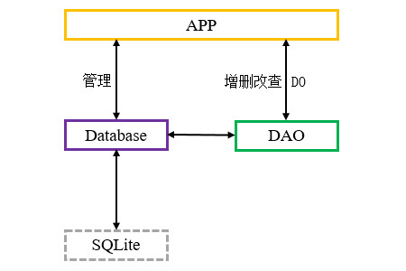

# 简介
Room是Jetpack提供的一个ORM框架，它对SQLite API进行了封装，我们可以通过注解声明Database、DAO、DO(Entity)等元素，Gradle在编译过程中将会自动生成部分代码，例如：根据实体类创建二维表、将查询结果映射为实体类或集合，我们不再需要反复编写数据转换等模板代码。

Room中各元素的关系如下文图片所示：

<div align="center">



</div>

本章的示例工程详见以下链接：

- [🔗 示例工程：Room](https://github.com/BI4VMR/Study-Android/tree/master/M05_Storage/C03_SQL/S02_Room)


# 基本应用
下文示例展示了Room的基本使用方法：

🔴 示例一：使用Room实现学生信息管理系统。

在本示例中，我们使用Room框架，实现一个简单的学生信息管理系统。

第一步，我们为当前模块引入Room的依赖组件：

"build.gradle":

```groovy
dependencies {
    // Room核心
    implementation 'androidx.room:room-runtime:2.5.1'

    // Room注解处理器(Java)
    annotationProcessor 'androidx.room:room-compiler:2.5.1'
    // Room注解处理器(Kotlin-KAPT)
    kapt 'androidx.room:room-compiler:2.5.1'
    // Room注解处理器(Kotlin-KSP)
    ksp 'androidx.room:room-compiler:2.5.1'
}
```

上述内容也可以使用Kotlin语言编写：

"build.gradle.kts":

```kotlin
dependencies {
    // Room核心
    implementation("androidx.room:room-runtime:2.5.1")

    // Room注解处理器(Java)
    annotationProcessor("androidx.room:room-compiler:2.5.1")
    // Room注解处理器(Kotlin-KAPT)
    kapt("androidx.room:room-compiler:2.5.1")
    // Room注解处理器(Kotlin-KSP)
    ksp("androidx.room:room-compiler:2.5.1")
}
```

`room-runtime` 是Room的核心组件， `room-compiler` 是Room的注解处理器，一个应用程序至少需要引入这些组件才能使用Room框架。上述的三条注解处理器声明语句不可同时声明，我们需要根据项目所使用的语言进行选择。

第二步，我们创建一个Student实体类，用于描述“学生”的属性，此处设置“ID、姓名、年龄”三个属性。

"Student.java":

```java
@Entity(tableName = "student_info")
public class Student {

    // ID（主键）
    @PrimaryKey
    @ColumnInfo(name = "student_id")
    private long id;

    // 姓名
    @ColumnInfo(name = "student_name")
    private String name;

    // 年龄
    private int age;

    // 构造方法
    public Student(long id, String name, int age) {
        this.id = id;
        this.name = name;
        this.age = age;
    }

    /* 此处省略部分代码... */
}
```

上述内容也可以使用Kotlin语言编写：

"StudentKT.kt":

```kotlin
@Entity(tableName = "student_info")
data class StudentKT(

    // ID（主键）
    @PrimaryKey
    @ColumnInfo(name = "student_id")
    var id: Long,

    // 姓名
    @ColumnInfo(name = "student_name")
    var name: String?,

    // 年龄
    var age: Int
)
```

为了建立实体类与二维表的关联，我们需要在Student类的属性与方法上添加一些Room注解。

注解 `@Entity` 表示这是一个Room实体类，在编译期间，Room会以该类的属性作为字段，生成 `tableName` 属性所指定的二维表 `student_info` 。

注解 `@PrimaryKey` 表示 `id` 属性是二维表的主键；注解 `@ColumnInfo` 用于设置属性在二维表中对应的字段名称。如果某个属性未被添加该注解，则字段名称与属性名称保持一致。

第二步，我们创建StudentDAO接口，提供对“学生信息表”进行增删改查的方法。

"StudentDAO.java":

```java
@Dao
public interface StudentDAO {

    // 查询所有学生信息
    @Query("SELECT * FROM student_info")
    List<Student> getStudents();

    // 新增学生记录
    @Insert
    void addStudent(Student student);

    // 更新学生记录
    @Update
    void updateStudent(Student student);

    // 删除学生记录
    @Delete
    void delStudent(Student student);
}
```

上述内容也可以使用Kotlin语言编写：

"StudentDAOKT.kt":

```kotlin
interface StudentDAOKT {

    // 查询所有学生信息
    @Query("SELECT * FROM student_info")
    fun getStudents(): List<StudentKT>

    // 新增学生记录
    @Insert
    fun addStudent(student: StudentKT)

    // 更新学生记录
    @Update
    fun updateStudent(student: StudentKT)

    // 删除学生记录
    @Delete
    fun delStudent(student: StudentKT)
}
```

注解 `@Dao` 表示这是一个Room数据访问实体类，其中的抽象方法通过 `@Query` 等注解声明了各自的操作类型，分别对应“查询所有学生”、“新增学生记录”、“更新学生记录”、“删除学生记录”功能。我们并不需要实现这些方法，在编译期间，Room的注解处理器将会自动生成DAO接口的实现类，这正是ORM框架的主要功能之一，能够帮助我们简化开发流程。

第三步，我们创建一个StudentDB抽象类，继承自RoomDatabase类，实现数据库的创建与配置功能。

"StudentDB.java":

```java
@Database(entities = Student.class, version = 1)
public abstract class StudentDB extends RoomDatabase {

    private volatile static StudentDB instance = null;

    // 获取数据库实例的方法
    public static StudentDB getInstance(Context context) {
        if (instance == null) {
            synchronized (StudentDB.class) {
                if (instance == null) {
                    // 构造实例并进行配置
                    instance = Room.databaseBuilder(context.getApplicationContext(), StudentDB.class, "student.db")
                            // Room默认不允许在主线程执行操作，此配置允许在主线程操作，仅适用于调试。
                            .allowMainThreadQueries()
                            // 构建实例
                            .build();
                }
            }
        }
        return instance;
    }

    // 抽象方法，返回StudentDAO实例
    public abstract StudentDAO getStudentDAO();
}
```

上述内容也可以使用Kotlin语言编写：

"StudentDBKT.kt":

```kotlin
@Database(entities = [StudentKT::class], version = 1)
abstract class StudentDBKT : RoomDatabase() {

    companion object {
        @Volatile
        private var instance: StudentDBKT? = null

        // 获取数据库实例的方法
        @JvmStatic
        fun getInstance(context: Context): StudentDBKT {
            if (instance == null) {
                synchronized(StudentDBKT::class) {
                    if (instance == null) {
                        // 构造实例并进行配置
                        instance = Room.databaseBuilder(
                            context.applicationContext,
                            StudentDBKT::class.java,
                            "student.db"
                        )
                            // Room默认不允许在主线程执行操作，此配置允许在主线程操作，仅适用于调试。
                            .allowMainThreadQueries()
                            // 构建实例
                            .build();
                    }
                }
            }
            return instance!!
        }
    }

    // 抽象方法，返回StudentDAO实例。
    abstract fun getStudentDAO(): StudentDAOKT
}
```

该类对于数据库调用者是唯一的访问点，因此我们通常将其设计为单例模式。

注解 `@Database` 表示这是一个Room数据库，属性 `entities` 用于声明本数据库包含的所有实体类，当存在多个实体类时，使用逗号( `,` )分隔，例如： `entities = {A.class, B.class, ...}` 。属性 `version` 表示数据库的版本号，程序启动时用于判断数据库是否需要执行升级或降级操作。

在获取实例的 `getInstance()` 方法中，我们通过Room的 `Room.databaseBuilder(Context context, Class<T> cls, String name)` 方法初始化数据库，此处的三个参数依次为：上下文环境、当前抽象类的Class实例和数据库名称，该方法返回的Builder实例可以配置其他功能，最后我们调用Builder的 `build()` 方法创建StudentDB的实例。

Room默认禁止在主线程操作数据库；此处为了便于调试，我们添加配置项 `allowMainThreadQueries()` 解除该限制。

该类中还需要声明返回每个DAO实例的抽象方法，具体实现代码将在编译时自动生成。

至此，一个完整的学生信息管理系统数据库模块就编写完成了。

第四步，我们切换到调用者视角，在测试Activity中放置一些控件，并通过DAO类的实例调用增删改查等方法。

"TestUIBase.java":

```java
// 获取学生数据库实例
StudentDB studentDB = StudentDB.getInstance(getApplicationContext());
// 获取学生信息表DAO实例
StudentDAO dao = studentDB.getStudentDAO();


/* 插入记录 */
// "edittext"是一个输入框，先从中获取数据项ID。
long id = Long.parseLong(edittext.getText().toString());
String name = "田所浩二";

// 插入记录
Student student = new Student(id, name, 24);
dao.addStudent(student);


/* 更新记录 */
// 获取待更新的数据项ID
long id = Integer.parseInt(edittext.getText().toString());

// 更新记录
Student s = new Student(id, "远野", 25);
dao.updateStudent(s);


/* 删除记录 */
// 获取待删除的数据项ID
long id = Integer.parseInt(edittext.getText().toString());

// 删除记录（指定ID即可）
Student student = new Student(id, null, 0);
dao.delStudent(student);


/* 查询所有记录 */
List<Student> result = dao.getStudents();
```

上述内容也可以使用Kotlin语言编写：

"TestUIBaseKT.kt":

```kotlin
// 获取学生数据库实例
private val studentDB: StudentDBKT = StudentDBKT.getInstance(this)


/* 插入记录 */
// 获取待操作的数据项ID
val id: Long = edittext.text.toString().toLong()
val name = "田所浩二"

// 插入记录
val student = StudentKT(id, name, 24)
studentDB.getStudentDAO().addStudent(student)


/* 更新记录 */
// 获取待操作的数据项ID
val id: Long = edittext.text.toString().toLong()

// 更新记录
val student = StudentKT(id, "远野", 25)
studentDB.getStudentDAO().updateStudent(student)


/* 删除记录 */
// 获取待操作的数据项ID
val id: Long = edittext.text.toString().toLong()

// 删除记录
val student = StudentKT(id, null, 0)
studentDB.getStudentDAO().delStudent(student)


/* 查询所有记录 */
val result: List<StudentKT> = studentDB.getStudentDAO().getStudents()
```

此处省略了UI控件声明与异常处理等逻辑，详见本章示例工程。


# 进阶技巧
## 数据库
### 指定数据库文件路径
`Room.databaseBuilder(Context context, Class<T> cls, String name)` 方法的第三参数 `name` 表示数据库文件名称，默认情况下，系统会在 `/data/data/<应用程序包名>/databases/` 目录中创建同名数据库文件。

如果我们希望将数据库文件存放至其他目录，可以在 `name` 参数处传入完整的路径；程序启动时，若该参数的值以 `/` 开头，就会被视为绝对路径。例如：当我们传入 `/sdcard/StudentManager/student.db` 时，系统将会尝试在SD卡根目录下创建 `StudentManager` 目录以及 `student.db` 文件。

### 导出调试信息
`@Database` 注解的 `exportSchema = <true | false>` 属性用于控制是否显示调试信息，该功能仅用于调试，对编译产物没有影响。

当Room的注解被处理时，Gradle可以将二维表结构等信息以JSON格式输出到工程目录中，便于开发者查看与分析。

该属性的默认值为 `true` ，但默认配置中并未指明输出路径，因此不会生成JSON文件。如果我们希望查看JSON文件，需要在Gradle配置文件的 `android {}` 小节中添加配置语句以指明路径。

"build.gradle":

```groovy
defaultConfig {
    javaCompileOptions {
        // Java项目
        annotationProcessorOptions {
            arguments += ["room.schemaLocation": "$projectDir/RoomSchema"]
        }

        // Kotlin项目(KAPT)
        kapt {
            arguments { arg("room.schemaLocation", "$projectDir/RoomSchema") }
        }

        // Kotlin项目(KSP)
        ksp {
            arg("room.schemaLocation", "$projectDir/RoomSchema")
        }
    }
}
```

上述内容也可以使用Kotlin语言编写：

"build.gradle.kts":

```kotlin
defaultConfig {
    javaCompileOptions {
        // Java项目
        annotationProcessorOptions {
            arguments["room.schemaLocation"] = "$projectDir/RoomSchema"
        }

        // Kotlin项目(KAPT)
        kapt {
            arguments { arg("room.schemaLocation", "$projectDir/RoomSchema") }
        }

        // Kotlin项目(KSP)
        ksp {
            arg("room.schemaLocation", "$projectDir/RoomSchema")
        }
    }
}
```

在上述配置文件中，我们将调试信息的输出目录指定为 `<当前模块根目录>/RoomSchema/` ，成功地执行一次编译任务后，工程中就会出现对应的文件。

### 查看SQL语句
有时Room生成的代码行为与预期不符，为了便于调试，我们可以在Builder中添加 `setQueryCallback(QueryCallback journalMode, Executor executor)` 方法，监听Room实际执行的SQL语句。

```java
Room.databaseBuilder(context, StudentDB.class, "student-skills.db")
    // 设置SQL语句回调，便于调试。
    .setQueryCallback(new QueryCallback() {
        @Override
        public void onQuery(@NonNull String sqlQuery, @NonNull List<?> bindArgs) {
            Log.d("StudentDB", "SQL:[" + sqlQuery + "] | " + bindArgs);
        }
    }, Executors.newSingleThreadExecutor())
```

上述内容也可以使用Kotlin语言编写：

```kotlin
Room.databaseBuilder(context, StudentDBKT::class.java, "student-skills.db")
    // 设置SQL语句回调，便于调试。
    .setQueryCallback(object : QueryCallback {
        override fun onQuery(sqlQuery: String, bindArgs: List<Any?>) {
            Log.d("StudentDBKT", "SQL:[$sqlQuery] | $bindArgs")
        }
    }, Executors.newSingleThreadExecutor())
```

回调方法 `onQuery()` 的第一参数 `sqlQuery` 是原始SQL语句，第二参数 `bindArgs` 是参数列表，如果原始SQL语句中含有占位符 `?` ，则参数列表非空，且元素与占位符一一对应。

### 允许在主线程访问数据库
默认情况下，Room禁止在主线程访问数据库，因为I/O等耗时操作可能会导致应用程序出现ANR。

当我们进行一些简单的功能验证时，可以在Builder中添加 `allowMainThreadQueries()` 配置项，以允许在主线程中直接访问数据库。

### 配置日志模式
SQLite支持以下两种日志模式：

- `TRUNCATE` : 这是SQLite的默认日志模式，SQLite向存储器写入数据时会阻塞其他读写操作。
- `WRITE_AHEAD_LOGGING` : 预写日志模式，将变更先写入缓存文件，空闲时入库。这种方式允许在写入的同时读取数据，但由于读取操作需要访问缓存文件，所以读取效率略低。

当API Level > 16时，Room框架默认使用 `WRITE_AHEAD_LOGGING` 模式，我们可以在Builder中添加 `setJournalMode(JournalMode journalMode)` 方法更改默认模式。

## 实体类
### 定义实体类
`@Entity` 注解用于定义实体类，必选属性 `tableName = <表名>` 用于声明该实体类对应的二维表名称。

实体类中的每个全局变量都会被自动映射到二维表中，且字段名称与变量名称完全一致；如果我们希望修改属性所对应的字段名称，可以添加 `@ColumnInfo` 注解并指明 `name = <字段名称>` 属性。Room将会使用与变量名称对应的 `get` 与 `set` 方法访问属性，因此实体类必须符合Java Bean规范。

`@PrimaryKey` 注解用于声明某个属性为二维表的主键，Room要求每张表至少有一个主键。

"Student.java":

```java
@Entity(tableName = "student_info")
public class Student {

    // ID（主键）
    @PrimaryKey
    @ColumnInfo(name = "student_id")
    private long id;

    // 姓名
    @ColumnInfo(name = "student_name")
    private String name = "";

    // 年龄
    private int age;

    // 构造方法
    public Student(long id, String name, int age) {
        this.id = id;
        this.name = name;
        this.age = age;
    }

    /* 此处省略部分代码... */
}
```

上述内容也可以使用Kotlin语言编写：

"StudentKT.kt":

```kotlin
@Entity(tableName = "student_info")
data class StudentKT(

    // ID（主键）
    @PrimaryKey
    @ColumnInfo(name = "student_id")
    var id: Long,

    // 姓名
    @ColumnInfo(name = "student_name")
    var name: String,

    // 年龄
    var age: Int
)
```

在上述示例代码中， `id` 属性与 `name` 属性通过注解设置了字段名称，它们在二维表中对应的字段名称分别为 `student_id` 和 `student_name` ； `age` 属性没有指明列名，因此在二维表中对应的字段名称为 `age` ，与变量同名。

### 字段是否可空
当实体类使用Java语言编写时，基本数据类型变量对应的二维表字段不可为空，并且我们不能将其修改为可空。引用数据类型变量对应的二维表字段默认可以为空；如果我们希望使某个字段不可为空，需要在对应的属性上添加 `androidx.annotation` 包中的 `@NonNull` 注解。

当实体类使用Kotlin语言编写时，变量数据类型是否可空将会映射到对应的二维表字段，例如变量 `var name: String` 在二维表中是非空字段，而变量 `var address: String?` 在二维表中是可空字段。

### 忽略属性与方法
如果某些属性不需要与二维表相互关联，我们可以添加 `@Ignore` 注解，它们不会在表中生成字段，查询记录时也不会被自动赋值。

"Student.java":

```java
@Entity(tableName = "student_info")
public class Student {

    // ID（主键）
    @PrimaryKey
    @ColumnInfo(name = "student_id")
    private long id;

    // 姓名
    @ColumnInfo(name = "student_name")
    @NonNull
    private String name = "";

    // 年龄
    @ColumnInfo(name = "age")
    private int age;

    // 是否在UI中隐藏
    @Ignore
    private boolean hide;

    // 具有1个参数的构造方法
    @Ignore
    public Student(long id) {
        this.id = id;
    }

    // 具有3个参数的构造方法
    public Student(long id, String name, int age) {
        this.id = id;
        this.name = name;
        this.age = age;
    }

    /* 此处省略部分代码... */
}
```

上述内容也可以使用Kotlin语言编写：

"StudentKT.kt":

```kotlin
@Entity(tableName = "student_info")
data class StudentKT(

    // ID（主键）
    @PrimaryKey
    @ColumnInfo(name = "student_id")
    var id: Long,

    // 姓名
    @ColumnInfo(name = "student_name")
    var name: String,

    // 年龄
    @ColumnInfo(name = "age")
    var age: Int
) {
    // 具有1个参数的构造方法
    @Ignore
    constructor(id: Long) : this(id, "", 0)

    // 是否在UI中隐藏
    @Ignore
    var hide: Boolean = false
}
```

在上述示例代码中， `hide` 属性只在UI中使用，不需要持久化，因此我们为其添加了 `@Ignore` 注解。

Room只能使用包含全部属性的构造方法，若扫描到其他构造方法，将会出现错误，此处我们通过 `@Ignore` 注解使构造方法 `Student(long id)` 被Room忽略，避免编译错误。

在Kotlin语言中，我们必须将 `hide` 属性声明语句放置在类体中，不可放置在主要构造方法中，这是因为Kotlin的主要构造方法必须是包含全部属性的构造方法，其中的属性即使被添加了 `@Ignore` 注解也是无效的。

```kotlin
@Entity(tableName = "student_info")
data class StudentKT(
    /* 此处省略部分代码... */

    // 此处添加"@Ignore"注解是无效的，因为"hide"属性将成为主要构造方法的一个参数。
    @Ignore
    var hide: Boolean = false
)
```

### 自增主键
`@PrimaryKey` 注解的 `autoGenerate = <true | false>` 属性用于控制插入记录时主键是否自增，该属性的默认值为 `false` ，仅当主键为整数类型时，我们可以将其设为 `true` 。

当实体类使用Java语言编写时，插入新记录遵循以下规则：

- 传入数值 `0` ，触发自增，新记录的主键为 $当前最大主键数值 + 1$ 。
- 传入大于 `0` 的数值，如果该数值未被占用，新记录的主键即为该数值；如果该数值已被占用，则产生异常。
- 传入小于 `0` 的数值，如果该数值未被占用，新记录的主键即为该数值；如果该数值已被占用，则产生异常。虽然负数不在自增ID的范围内，但与主键数据类型是匹配的，新记录可以插入成功。

当实体类使用Kotlin语言编写时，若主键为非空整数，其行为与Java语言是一致的。若主键为可空整数，传入空值也可以触发自增。

在新建数据实体时，其ID属性是未知的，逻辑上可以使用空值表示，例如： `var id: Long? = null` ；但我们并不推荐这样做，因为根据主键的定义，ID必然是一个非空的值，使用可空ID会导致代码可读性降低，并在查询时引入多余的空值判断逻辑。

为了便于使用自增ID插入记录，我们可以提供一个将ID属性置为 `0` 的次要构造方法。

```kotlin
@Entity(tableName = "student_info")
data class Student(

    // ID（自增主键）
    @PrimaryKey(autoGenerate = true)
    var id: Long,

    // 姓名
    var name: String,

    // 年龄
    var age: Int
) {
    // 次要构造方法，插入自增记录时使用。
    @Ignore
    constructor(name: String, age: Int) : this(0, name, age)
}
```

### 数据类型映射

<div align="center">

| Java数据类型 | SQLite数据类型 |
| :----------: | :------------: |
|    `byte`    |   `INTEGER`    |
|   `short`    |   `INTEGER`    |
|    `int`     |   `INTEGER`    |
|    `long`    |   `INTEGER`    |
|  `boolean`   |   `INTEGER`    |
|   `float`    |     `REAL`     |
|   `double`   |     `REAL`     |
|    `char`    |     `TEXT`     |
|   `String`   |     `TEXT`     |
|   `short`    |   `INTEGER`    |
|   `byte[]`   |     `BLOB`     |

</div>

`boolean` 也是整数， 0（false）和 1（true）。


## DAO类
### 定义DAO类
`@Dao` 注解用于定义数据访问类，可以被放置在抽象类或接口上。在程序编译阶段，注解处理器将会根据其他注解信息自动生成抽象方法的具体实现。

以下是一个简单的DAO接口示例，其中包含对于学生信息表进行新增、删除、查询的抽象方法。

"StudentDAO.java":

```java
@Dao
public interface StudentDAO {

    // 新增学生记录。
    @Insert
    void addStudent(Student student);

    // 删除学生记录。
    @Delete
    void delStudent(Student student);

    // 查询所有学生信息。
    @Query("SELECT * FROM student_info")
    List<Student> getStudent();
}
```

上述内容也可以使用Kotlin语言编写：

"StudentDAOKT.kt":

```kotlin
interface StudentDAOKT {

    // 新增学生记录。
    @Insert
    fun addStudent(student: StudentKT)

    // 删除学生记录。
    @Delete
    fun delStudent(student: StudentKT)
    
    // 查询所有学生信息。
    @Query("SELECT * FROM student_info")
    fun getStudent(): List<StudentKT>
}
```

在上述代码中，Room注解能够生成全部符合需求的数据访问方法，因此我们将StudentDAO定义为接口；若需要在DAO类中添加自定义方法，我们也可以将接口变更为抽象类。

### 定义插入方法
`@Insert` 注解用于声明向二维表中插入记录的抽象方法，参数类型必须是通过 `@Entity` 注解注册的实体类。

插入方法可以拥有多个参数，以便使用者向表中批量插入记录，所有受支持的形式如下文示例代码所示：

"StudentDAO.java":

```java
// 插入单个实体
@Insert
long insertStudent(Student student);

// 插入多个实体（可变参数）
@Insert
long[] insertStudents(Student... students);

// 插入多个实体（集合）
@Insert
List<Long> insertStudents(List<Student> students);

// 插入多个实体（混合参数）
@Insert
void insertStudents(Student monitor, List<Student> students);
```

上述内容也可以使用Kotlin语言编写：

"StudentDAOKT.kt":

```kotlin
// 插入单个实体
@Insert
fun insertStudent(student: StudentKT): Long

// 插入多个实体（可变参数）
@Insert
fun insertStudents(vararg students: StudentKT): Array<Long>

// 插入多个实体（集合）
@Insert
fun insertStudents(students: List<StudentKT>): List<Long>

// 插入多个实体（混合参数）
@Insert
fun insertStudents(monitor: StudentKT, students: List<StudentKT>)
```

插入操作将会返回新记录在二维表中的RowID，如果参数为单个实体，则返回值类型为 `long` ；如果参数为多个实体，则返回值类型可以为 `long[]` 或 `List<Long>` ；如果我们并不关心RowID，也可以将返回值类型设置为 `void` 。

> ⚠️ 警告
>
> SQLite中的RowID不一定等同于主键，我们在使用该数值前需要注意鉴别，此处省略具体描述，详见相关章节： [🧭 SQLite - "RowID"字段](../../../../04_软件技巧/04_数据存储/03_关系型数据库/01_SQLite/02_基础应用.md#rowid字段) 。

> 🚩 提示
>
> 由 `@Insert` 等Room注解生成的插入、修改与删除方法支持事务，我们无需担心操作多条数据时被其他线程干扰。


# 事务支持
## 事务注解
Room提供了 `@Transaction` 注解，我们可以将其添加到DAO类的方法上，该注解等价于 `beginTransaction()` 等方法的组合调用，能够使目标方法以事务的方式运行。

🟠 示例二：使用 `@Transaction` 注解实现事务。

在本示例中，我们对前文章节 [🧭 SQLite - 事务支持](./01_SQLite.md#基本应用-1) 中的“示例六”进行修改，使用Room提供的 `@Transaction` 注解，实现借书功能。

"StudentDAO.java":

```java
@Dao
public abstract class StudentDAO {

    @Query("SELECT * FROM student_info WHERE student_id = :id")
    abstract Student getStudent(long id);

    @Update
    abstract void updateStudent(Student student);

    @Transaction
    void borrowBook() {
        // 将1号学生的书本数量加1
        Student studentA = getStudent(1);
        if (studentA != null) {
            studentA.setBookCount(studentA.getBookCount() + 1);
            updateStudent(studentA);
        }

        // 将2号学生的书本数量减1
        Student studentB = getStudent(2);
        if (studentB != null) {
            studentB.setBookCount(studentB.getBookCount() - 1);
            updateStudent(studentB);
        }
    }
}
```

上述内容也可以使用Kotlin语言编写：

"StudentDAOKT.kt":

```kotlin
@Dao
abstract class StudentDAOKT {

    @Query("SELECT * FROM student_info WHERE student_id = :id")
    abstract fun getStudent(id: Long): StudentKT?

    @Update
    abstract fun updateStudent(student: StudentKT)

    @Transaction
    open fun borrowBook() {
        // 将1号学生的书本数量加1
        getStudent(1)?.let {
            it.bookCount += 1
            updateStudent(it)
        }

        // 将2号学生的书本数量减1
        getStudent(2)?.let {
            it.bookCount -= 1
            updateStudent(it)
        }
    }
}
```

`@Transaction` 注解只能配置在DAO类的方法上，在其他类中配置没有任何作用。

## 快捷方法
部分业务逻辑较为复杂，不适合放置在DAO中，此时我们无法使用 `@Transaction` 注解简化事务代码。在这种场景中，Room提供了 `RoomDatabase.runInTransaction()` 扩展方法，该方法等价于 `beginTransaction()` 等方法的组合调用，参数为事务操作语句，遇到异常时会忽略异常并执行回滚。

🟡 示例三：使用 `runInTransaction()` 方法实现事务。

在本示例中，我们对前文章节 [🧭 SQLite - 事务支持](./01_SQLite.md#基本应用-1) 中的“示例六”进行修改，使用Room提供的 `runInTransaction()` 扩展方法，实现借书功能。

"TestUITransactionKT.kt":

```kotlin
studentDB.runInTransaction {
    val dao = studentDB.getStudentDAO()
    // 将1号学生的书本数量加1
    dao.getStudent(1)?.let {
        it.bookCount += 1
        dao.updateStudent(it)
    }

    // 将2号学生的书本数量减1
    dao.getStudent(2)?.let {
        it.bookCount -= 1
        dao.updateStudent(it)
    }
}
```

## 协程支持
在前文章节 [🧭 SQLite - 事务支持 - 协程支持](./01_SQLite.md#协程支持) 中，我们已经了解到SQLite事务在协程中必须锁定工作线程；Room提供了 `RoomDatabase.withTransaction()` 扩展函数，实现事务与线程锁定，使我们不必再手动控制协程与线程。

🟢 示例四：使用 `withTransaction()` 方法实现事务。

在本示例中，我们对前文章节 [🧭 SQLite - 事务支持](./01_SQLite.md#基本应用-1) 中的“示例六”进行修改，使用Room提供的 `withTransaction()` 扩展方法，在协程中实现借书功能。

"TestUITransactionKT.kt":

```kotlin
suspend fun transactionInCoroutine() {
    studentDB.withTransaction {
        val dao = studentDB.getStudentDAO()
        // 将1号学生的书本数量加1
        dao.getStudent(1)?.let {
            it.bookCount += 1
            dao.updateStudent(it)
        }

        // 将2号学生的书本数量减1
        dao.getStudent(2)?.let {
            it.bookCount -= 1
            dao.updateStudent(it)
        }
    }
}

// 调用包含事务的挂起函数
runBlocking {
    transactionInCoroutine()
}
```

`withTransaction {}` 函数遇到异常时，会抛出异常并使事务回滚，如果我们希望判断事务的执行结果，可以将其放置在 `try` 块中，未捕获异常表示事务执行成功，捕获到异常表示事务执行失败。


# 版本迁移
Room对SQLite API进行了封装，我们无需在SQLiteOpenHelper类的 `onUpgrade()` 方法中编写各个版本的判断与升级逻辑，应当转而使用Migration类。

Migration类的构造方法为 `Migration(int startVersion, int endVersion)` ，第一参数 `startVersion` 表示旧的版本号；第三参数 `endVersion` 表示新的版本号，因此我们可以继承Migration类并创建一个或多个子类，在每个子类中分别实现两个版本间的升降级逻辑。

🟠 示例二：编写Migration类进行版本迁移。

在本示例中，我们以前文“示例一”为基础，将学生信息表的整型字段年龄 `age` 变更为字符型字段出生日期 `birthday` ，并将数据结构升级至版本 `2` 。

第一步，我们创建MigrationV1ToV2类，继承自Migration类。

"MigrationV1ToV2.java":

```java
public class MigrationV1ToV2 extends Migration {

    public MigrationV1ToV2() {
        super(1, 2);
    }

    @Override
    public void migrate(@NonNull SupportSQLiteDatabase db) {
        migrateV1ToV2(db);
    }
}
```

上述内容也可以使用Kotlin语言编写：

"MigrationV1ToV2KT.kt":

```kotlin
class MigrationV1ToV2KT : Migration(1, 2) {

    override fun migrate(db: SupportSQLiteDatabase) {
        migrateV1ToV2(db);
    }
}
```

Migration类的回调方法 `migrate()` 将在版本迁移时被触发，我们需要在此处编写迁移逻辑，详见前文章节： [🧭 SQLite - 版本迁移](./01_SQLite.md#版本迁移) 。

此时只有 `1` 和 `2` 两个版本号，本程序不必支持降级安装，因此我们只需要创建一个MigrationV1ToV2类即可，实现从“版本1”到“版本2”的迁移逻辑。

第二步，我们需要在Room的Builder中调用 `addMigrations(Migration... migrations)` 方法注册MigrationV1ToV2。

"StudentDB.java":

```java
Room.databaseBuilder(context.getApplicationContext(), StudentDB.class, "student.db")
    // 添加版本迁移工具
    .addMigrations(new MigrationV1ToV2())
    // 构建实例
    .build();
```

上述内容也可以使用Kotlin语言编写：

"StudentDBKT.kt":

```kotlin
Room.databaseBuilder(context.applicationContext, StudentDBKT::class.java, "student.db")
    // 添加版本迁移工具
    .addMigrations(MigrationV1ToV2KT())
    // 构建实例
    .build()
```

`addMigrations()` 方法的参数数量是可变的，如果有多个Migration的子类，我们需要将它们分别进行注册。

当数据库加载时，如果程序中的版本号与本地数据库不一致，Room将会尝试调用已注册的Migration类完成迁移。例如：从“版本1”升级至“版本2”时，Room会调用前文示例中的MigrationV1ToV2类。

跨版本升级时，Room将会首先尝试调用版本号相匹配的Migration类；若没有找到该类，则会依次调用中途过渡版本的所有Migration类。例如：从“版本1”升级至“版本3”时，Room会尝试调用旧版本号为 `1` 且新版本号为 `3` 的Migration类；若不存在该类，则首先调用旧版本号为 `1` 且新版本号为 `2` 的Migration类，再调用旧版本号为 `2` 且新版本号为 `3` 的Migration类。

若某两个版本缺少对应的Migration类，默认情况下Room会抛出异常： `IllegalStateException: A migration from <X> to <Y> is necessary.` ，但用户数据得以保留。如果我们在Room的Builder中调用了 `fallbackToDestructiveMigration()` 方法，缺少Migration类时会直接清空旧的数据，以当前版本的数据库结构重新初始化。

迁移过程将在首个数据库查询调用执行时被触发，并以该调用的线程按顺序执行所有 `migrate()` 方法，直到迁移完成后，该线程才会执行调用者请求的查询并返回结果。如果我们希望程序启动后即刻开始迁移，减少用户后续查询的等待时长，可以在初始化阶段调用任意查询方法。


# 疑难解答
## 索引

<div align="center">

|       序号        |                         摘要                         |
| :---------------: | :--------------------------------------------------: |
| [案例一](#案例一) | Android Debug Database工具无法查看Room数据库的内容。 |
| [案例二](#案例二) |     升级数据库后出现IllegalStateException错误。      |
| [案例三](#案例三) |          SQL语句调试回调与代码执行顺序不一致。           |
| [案例四](#案例四) |          SQL模糊查询语句无法匹配任何记录。           |

</div>

## 案例一
### 问题描述
使用Android Debug Database工具调试Room框架生成的数据库时，Web能够查看到表结构，但内容为空。

### 问题分析
当API Level > 16时，Room框架的默认日志模式为WAL，这种模式不会将变更立即写入磁盘，因此Android Debug Database工具无法实时读取内容。

### 解决方案
在构建Database实例时，将日志模式设为"TRUNCATE"。

```java
Room.databaseBuilder(context.getApplicationContext(), StudentDB.class, "student")
    // 设置日志模式为"TRUNCATE"
    .setJournalMode(JournalMode.TRUNCATE)
    .build();
```

## 案例二
### 问题描述
通过Migration升级数据库后，出现IllegalStateException错误，详细信息如下文代码块所示：

```text
java.lang.IllegalStateException: Migration didn't properly handle: student_info(net.bi4vmr.study.upgrade.Student).
 Expected:
TableInfo{name='student_info', columns={birthday=Column{name='birthday', type='TEXT', affinity='2', notNull=true, primaryKeyPosition=0, defaultValue='undefined'}, flags=Column{name='flags', type='INTEGER', affinity='3', notNull=true, primaryKeyPosition=0, defaultValue='undefined'}, student_id=Column{name='student_id', type='INTEGER', affinity='3', notNull=true, primaryKeyPosition=1, defaultValue='undefined'}, student_name=Column{name='student_name', type='TEXT', affinity='2', notNull=true, primaryKeyPosition=0, defaultValue='undefined'}}, foreignKeys=[], indices=[]}

 Found:
TableInfo{name='student_info', columns={student_id=Column{name='student_id', type='INTEGER', affinity='3', notNull=true, primaryKeyPosition=1, defaultValue='undefined'}, student_name=Column{name='student_name', type='TEXT', affinity='2', notNull=true, primaryKeyPosition=0, defaultValue='undefined'}, birthday=Column{name='birthday', type='TEXT', affinity='2', notNull=true, primaryKeyPosition=0, defaultValue='undefined'}, flag=Column{name='flag', type='INTEGER', affinity='3', notNull=false, primaryKeyPosition=0, defaultValue='undefined'}}, foreignKeys=[], indices=[]}
```

### 问题分析
仔细观察 `Expected` 与 `Found` 块中的每个字段，我们可以发现期望字段名称为 `flags` ；而Migration升级后的字段名称为 `flag` ，两者不一致。

### 解决方案
日志中的 `Expected` 部分是根据Entity生成的，因此我们需要检查Migration和Entity是否匹配，确保二者一致。

在本案例中，我们为Entity的新增属性 `flags` 添加 `@ColumnInfo` 注解，确保它能正确地映射到Migration中新增的 `flag` 字段。

```kotlin
@Entity(tableName = "student_info")
data class Student(

    @ColumnInfo(name = "flag")
    var flags: Int

    // 此处已省略部分代码...
)
```

## 案例三
### 问题描述
SQL回调与实际顺序不一致

这是正常的，因为SQL打印线程是独立的线程，与实际代码执行线程不一致，不能以SQL回调时刻判定代码的执行时刻。


```text
19:55:34.226 28768-28804 Bookkeeper-DatabaseModule  D  SQL:[TRANSACTION SUCCESSFUL] | 
19:55:34.226 28768-28804 Bookkeeper-DatabaseModule  D  SQL:[END TRANSACTION] | 
19:55:34.227 28768-28804 Bookkeeper-DatabaseModule  D  SQL:[BEGIN EXCLUSIVE TRANSACTION] | 
19:55:34.227 28768-28804 Bookkeeper-DatabaseModule  D  SQL:[INSERT OR ABORT INTO `category_info` (`category_id`,`category_name`,`type`,`statistics_flag`,`hide_flag`,`display_order`,`icon_path`,`icon_hash`,`create_time`,`update_time`,`parent_id`,`user_id`) VALUES (?,?,?,?,?,?,?,?,?,?,?,?)] | C39F6924287748C88F1E1AD412F8C384, 车辆维保, 2, 1, 0, 4, out_traffic_car.png, , 1754826934183, 1754826934183, 95F258612B4C42DEA3BC59E56AC0F204, 212352513B6F4D02A2665F75BECD6AA8
19:55:34.227 28768-28796 Bookkeeper-DataManager     D  InitUserData. return User(id=212352513B6F4D02A2665F75BECD6AA8, name=用户_212352, nickName=用户_212352, customizeSignature=-, avatarFilePath=-, lastSyncTime=0)
19:55:34.227 28768-28804 Bookkeeper-DatabaseModule  D  SQL:[TRANSACTION SUCCESSFUL] | 
19:55:34.227 28768-28796 Bookkeeper-SPHelper        D  SaveLoginUserID. ID:[212352513B6F4D02A2665F75BECD6AA8]
19:55:34.230 28768-28804 Bookkeeper-DatabaseModule  D  SQL:[END TRANSACTION] | 
19:55:34.231 28768-28804 Bookkeeper-DatabaseModule  D  SQL:[BEGIN EXCLUSIVE TRANSACTION] | 
19:55:34.231 28720-28807 Bookkeeper-LoginActivity   D  onSuccess. User(id=212352513B6F4D02A2665F75BECD6AA8, name=用户_212352, nickName=用户_212352, customizeSignature=-, avatarFilePath=-, lastSyncTime=0)
19:55:34.231 28768-28804 Bookkeeper-DatabaseModule  D  SQL:[INSERT OR ABORT INTO `category_info` (`category_id`,`category_name`,`type`,`statistics_flag`,`hide_flag`,`display_order`,`icon_path`,`icon_hash`,`create_time`,`update_time`,`parent_id`,`user_id`) VALUES (?,?,?,?,?,?,?,?,?,?,?,?)] | C39F6924287748C88F1E1AD412F8C384, 车辆维保, 2, 1, 0, 4, out_traffic_car.png, , 1754826934183, 1754826934183, 95F258612B4C42DEA3BC59E56AC0F204, 212352513B6F4D02A2665F75BECD6AA8
19:55:34.231 28768-28804 Bookkeeper-DatabaseModule  D  SQL:[TRANSACTION SUCCESSFUL] | 
```


### 问题分析


### 解决方案


## 案例四
### 问题描述
SQL模糊查询语句 `LIKE '%<关键词>%'` 无法匹配任何记录。

### 问题分析
在DAO接口中，我们需要将方法的 `name` 参数拼接到SQL语句中，因此使用了加号( `+` )：

```kotlin
@Query("SELECT * FROM student_info WHERE student_name LIKE '%' + :name + '%'")
fun searchStudent(name: String): List<Student>
```

SQLite不支持使用加号拼接SQL语句，上述语句相当于 `LIKE '% + <变量的值> + %'` ，因此无法匹配到记录。

### 解决方案
在SQLite中，拼接SQL语句需要使用双竖线( `||` )符号：

```kotlin
@Query("SELECT * FROM student_info WHERE student_name LIKE '%' || :name || '%'")
fun searchStudent(name: String): List<Student>
```
