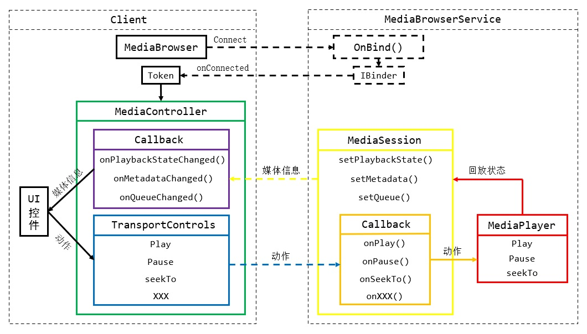

# 简介
MediaSession是一个系统级的媒体信息通告与播放控制框架，音视频程序可以将播放状态、播放列表等信息发送至MediaSession，使得系统组件能够展示这些信息，并发出播放控制指令。

MediaSession从Android 5.0开始提供，它不是媒体程序的必备组件，但它可以实现系统级的媒体信息共享与控制，支持多种不同的客户端（例如：蓝牙控制、锁屏音乐控制、息屏显示），这使得开发者不必为每种客户端单独编写适配代码。

MediaSession的体系结构如下文图片所示：

<div align="center">



</div>

MediaBrowserService本质上是一个远程服务，客户端通过MediaBrowser向Service发起连接请求，成功绑定Service后即可获得MediaSession的配对令牌，然后通过令牌创建MediaController对象，开始跨进程通信。

客户端通过MediaController向MediaSession发送指令，例如播放、暂停等，MediaSession服务则将命令传递给真正实现播放动作的组件（例如MediaPlayer）；当播放信息改变时，MediaSession将会触发客户端注册的Callback，以便客户端更新界面内容。

本章示例代码详见以下链接：

- [🔗 示例工程：MediaSession](https://github.com/BI4VMR/Study-Android/tree/master/M07_Media/C01_Common/S01_MediaSession)

# 基本应用
## 简介
MediaSession有两种实现，位于 `android.media` 包中的类不支持Android 5.0以下的系统，位于 `android.support.v4` 包中的类可以兼容较多的系统版本，类名比起前者增加了"Compat"后缀，例如：MediaBrowserCompat、MediaSessionCompat，这些类能够兼容Android 5.0以下的系统。

MediaBrowserService也有两种实现，若需要兼容Android 5.0以下的系统，我们可以使用 `androidx.media` 包中的MediaBrowserServiceCompat类。

## 构建服务端
我们需要创建一个自定义类，并继承自MediaBrowserService类，然后在 `onCreate()` 回调方法中创建MediaSession、设置媒体控制器回调并激活会话。

"MusicService.java":

```java
public class MusicService extends MediaBrowserService {

    private static final String TAG = "TestApp-" + MusicService.class.getSimpleName();

    private MediaSession mediaSession;

    @Override
    public void onCreate() {
        super.onCreate();
        Log.d(TAG, "OnCreate.");
        // 创建MediaSession实例，第二参数为媒体Tag，用于标识服务的身份。
        mediaSession = new MediaSession(this, "MusicService");
        // 设置MediaController的回调方法，处理媒体控制指令。
        mediaSession.setCallback(new MyControllerCallback());
        // 激活会话，表明当前服务已经就绪，可以接受控制。
        mediaSession.setActive(true);

        /*
         * 获取会话令牌，并将令牌绑定到此服务。
         *
         * 设置令牌后，客户端的ConnectionCallback将被调用，发送令牌给客户端。
         */
        MediaSession.Token token = mediaSession.getSessionToken();
        setSessionToken(token);

        // 设置初始的媒体信息与播放状态
        MediaMetadata metadata = new MediaMetadata.Builder()
                .putString(MediaMetadata.METADATA_KEY_TITLE, "歌曲标题...")
                .putString(MediaMetadata.METADATA_KEY_ALBUM, "专辑信息...")
                .build();
        mediaSession.setMetadata(metadata);
        PlaybackState state = new PlaybackState.Builder()
                .setState(PlaybackState.STATE_PLAYING, 1000L, 1.0F)
                .build();
        mediaSession.setPlaybackState(state);
    }

    @Override
    public void onDestroy() {
        super.onDestroy();
        Log.i(TAG, "OnDestroy.");
        // 服务销毁时释放资源
        if (mediaSession != null) {
            mediaSession.release();
        }
    }

    @Nullable
    @Override
    public BrowserRoot onGetRoot(@NonNull String clientPackageName, int clientUid, @Nullable Bundle rootHints) {
        // 暂不使用
        return new BrowserRoot("MEDIA_ROOT", null);
    }

    @Override
    public void onLoadChildren(@NonNull String parentId, @NonNull Result<List<MediaBrowser.MediaItem>> result) {
        // 暂不使用
    }

    /*
     * MediaController的回调类，处理客户端发送的指令。
     */
    private class MyControllerCallback extends MediaSession.Callback {

        // 播放指令
        @Override
        public void onPlay() {
            // 向实际控制播放的组件发出指令，此处省略相关代码。
        }

        // 暂停指令
        @Override
        public void onPause() {
            // 向实际控制播放的组件发出指令，此处省略相关代码。
        }
    }
}
```

在回调方法 `onCreate()` 中，我们首先通过MediaSession类的 `MediaSession(Context context, String tag)` 构造方法创建实例，它的第一参数 `context` 是应用程序的上下文环境；第二参数 `tag` 用于标识服务的身份，系统侧可能同时存在多个应用的媒体会话，因此该字符串应当能够唯一标识当前程序。

随后我们调用MediaSession实例的 `setCallback(MediaSession.Callback cb)` 方法注册服务端回调，该回调将在客户端发出控制指令后被触发，我们应当将这些回调指令传递给播放器组件。

MediaBrowserService类中的 `onGetRoot()` 和 `onLoadChildren()` 回调方法是用来实现媒体信息查询的，通常我们不需要实现该功能，此处均返回默认值。

上述逻辑代码编写完毕后，我们还要在Manifest文件中注册服务，并设置Intent过滤器。

"AndroidManifest.xml":

```xml
<service
    android:name=".base.MusicService"
    android:exported="true">

    <intent-filter>
        <action android:name="android.media.browse.MediaBrowserService" />
    </intent-filter>
</service>
```

此时一个最小化的服务端已经构建完毕，一旦服务端使用 `setSessionToken()` 方法设置令牌，客户端就会收到连接成功回调，并可以使用令牌发起播控指令。

为了防止服务端运行一段时间后被系统终止并回收，我们还需要将服务与前台通知绑定，此处省略相关代码。

## 构建客户端
客户端通过MediaBrowser实例连接至MediaBrowserService，一旦连接成功，就会触发连接回调中的 `onConnected()` 方法，此时便可以获取令牌并创建MediaController实例，再通过TransportControls向服务端发出播控指令。MediaController的回调实现则可以接收媒体数据与播放状态变更事件，以便更新UI。

"TestUIBase.java":

```java
public class TestUIBase extends AppCompatActivity {

    private static final String TAG = "TestApp-" + TestUIBase.class.getSimpleName();

    private final static String SERVICE_PKG = "net.bi4vmr.study.media.common.mediasession";
    private final static String SERVICE_NAME = "net.bi4vmr.study.base.MusicService";

    private TestuiBaseBinding binding;

    private MediaBrowser mediaBrowser;
    private MediaController mediaController;

    private boolean serviceReady = false;

    @SuppressLint("SetTextI18n")
    @Override
    protected void onCreate(Bundle savedInstanceState) {
        super.onCreate(savedInstanceState);
        binding = TestuiBaseBinding.inflate(LayoutInflater.from(this));
        setContentView(binding.getRoot());

        binding.btnConnect.setOnClickListener(v -> testConnect());
        binding.btnDisconnect.setOnClickListener(v -> testDisconnect());
        binding.btnPlay.setOnClickListener(v -> testPlay());
        binding.btnPrev.setOnClickListener(v -> testPrev());
        binding.btnNext.setOnClickListener(v -> testNext());
    }

    // 连接服务
    private void testConnect() {
        if (!serviceReady) {
            // 创建MediaBrowser实例，连接服务端。
            mediaBrowser = new MediaBrowser(this,
                    new ComponentName(SERVICE_PKG, SERVICE_NAME),
                    new MyConnectionCallback(),
                    null);
            // 连接MediaSession服务
            mediaBrowser.connect();
        }
    }

    // 断开服务
    private void testDisconnect() {
        if (serviceReady) {
            mediaBrowser.disconnect();
            serviceReady = false;
        }
    }

    // 播放/暂停
    private void testPlay() {
        PlaybackState state = mediaController.getPlaybackState();
        if (state != null) {
            int stateIndex = state.getState();
            // 如果当前是播放状态，则发出暂停指令；反之亦然。
            if (stateIndex == PlaybackState.STATE_PLAYING) {
                mediaController.getTransportControls().pause();
            } else if (stateIndex == PlaybackState.STATE_PAUSED) {
                mediaController.getTransportControls().play();
            }
        }
    }

    // 上一曲
    private void testPrev() {
        mediaController.getTransportControls().skipToPrevious();
    }

    // 下一曲
    private void testNext() {
        mediaController.getTransportControls().skipToNext();
    }

    // 将Session中的媒体信息更新至UI
    @SuppressLint("SetTextI18n")
    private void updateMediaInfoUI(MediaMetadata metadata) {
        if (metadata == null) {
            return;
        }

        // 取出“标题”属性
        String title = metadata.getString(MediaMetadata.METADATA_KEY_TITLE);
        // 取出“专辑”属性
        String album = metadata.getString(MediaMetadata.METADATA_KEY_ALBUM);
        // 更新界面
        binding.tvLog.append("标题：" + title + "\n专辑：" + album + "\n");
        Log.i(TAG, "标题：" + title + "\n专辑：" + album);
    }

    // 将Session中的播放状态更新至UI
    @SuppressLint("SetTextI18n")
    private void updatePlayStateUI(PlaybackState state) {
        if (state == null) {
            return;
        }

        // 更新界面
        binding.tvLog.append("播放状态: " + state.getState() + "\n");
        Log.i(TAG, "播放状态: " + state.getState());
    }

    /*
     * MediaSession服务连接回调
     */
    private class MyConnectionCallback extends MediaBrowser.ConnectionCallback {

        @Override
        public void onConnected() {
            Log.i(TAG, "MyConnectionCallback-OnConnected.");

            // 获取配对令牌
            MediaSession.Token token = mediaBrowser.getSessionToken();
            // 通过令牌创建媒体控制器
            mediaController = new MediaController(getApplicationContext(), token);

            // 服务连接完毕后，主动获取媒体信息与播放状态，同步UI显示。
            updateMediaInfoUI(mediaController.getMetadata());
            updatePlayStateUI(mediaController.getPlaybackState());

            // 注册媒体控制器回调，处理后续媒体信息与播放状态变更事件。
            mediaController.registerCallback(new MyMediaControllerCallback());

            serviceReady = true;
        }

        @Override
        public void onConnectionFailed() {
            Log.i(TAG, "MyConnectionCallback-OnConnectionFailed.");

            serviceReady = false;
        }
    }

    /*
     * 媒体控制器的回调接口实现类
     */
    private class MyMediaControllerCallback extends MediaController.Callback {

        // 媒体元数据改变回调
        @Override
        public void onMetadataChanged(@Nullable MediaMetadata metadata) {
            // 媒体元数据发生变更（标题，艺术家等），将其更新到界面上。
            updateMediaInfoUI(metadata);
        }

        // 回放状态改变回调
        @Override
        public void onPlaybackStateChanged(@Nullable PlaybackState state) {
            // 播放状态发生变更，将其更新到界面上。
            updatePlayStateUI(state);
        }
    }
}
```

我们通过MediaController的 `getTransportControls()` 方法获取TransportControls实例后，便可对媒体播放进行控制，其中的方法与服务端的MediaSession.Callback是对应的，例如：客户端调用一次 `play()` 方法，则服务端MediaSession.Callback实现中的 `onPlay()` 回调方法将会触发一次。

# 播放状态
PlaybackState类用于描述媒体的播放状态，当服务端收到指令后，不仅要使播放组件执行相应动作，还需要构造PlaybackState实例，通过MediaSession的 `setPlaybackState()` 方法将播放状态通告给客户端，随后所有客户端控制器Callback中的 `onPlaybackStateChanged()` 回调方法将被触发，使得它们能够更新界面内容。

```java
// 构造PlaybackState实例
PlaybackState playbackState = new PlaybackState.Builder()
// 设置播放状态
.setState(PlaybackState.STATE_PLAYING, 0, 1.0F)
.build();
// 将播放状态反馈给客户端
mediaSession.setPlaybackState(playbackState);
```

PlaybackState实例需要通过构造器模式创建，主要的方法为 `setState(int state, long position, float playbackSpeed)` ，第一参数 `state` 表示播放状态，具体数值为PlaybackState类中的"STATE_X"系列常量；第二参数 `position` 表示播放进度，单位为毫秒；第三参数 `playbackSpeed` 表示播放速度，1倍为原速，负数为倒放。

PlaybackState类中的播放状态常量及含义可参见下文表格：

<div align="center">

|          STATE          |      含义      |
| :---------------------: | :------------: |
|      `STATE_NONE`       | 无曲目可供播放 |
|     `STATE_PLAYING`     |    正在播放    |
|     `STATE_PAUSED`      |     已暂停     |
|     `STATE_STOPPED`     |   已播放完毕   |
| `STATE_FAST_FORWARDING` |    快进播放    |
|    `STATE_REWINDING`    |    快退播放    |
|    `STATE_BUFFERING`    |    正在缓冲    |
|      `STATE_ERROR`      |    播放错误    |

</div>

`STATE_NONE` 一般用于初始化状态，此时用户未打开任何媒体资源。 `STATE_BUFFERING` 表示播放远程资源时，加载速度低于回放速度，缓冲完毕后将会恢复播放。 `STATE_ERROR` 表示播放错误，通告此状态时，我们应当同时调用PlaybackState构造器的 `setErrorMessage()` 方法，设置具体的错误信息。

PlaybackState构造器还有一个 `setState(int state, long position, float playbackSpeed, long updateTime)` 方法，第四参数 `updateTime` 表示播放状态更新时间，客户端可以根据此时间计算出媒体的播放进度，避免定时通告进度导致性能浪费。具有三个参数的 `setState()` 方法实际上会调用具有四个参数的 `setState()` 方法，并将 `updateTime` 设置为“系统启动至今经过的时刻”。

假设开机120秒后，服务端收到播放指令，从10秒位置开始以正常速度播放一首歌曲，再经过10秒时间，有一个客户端需要查询播放进度，它可以使用以下代码计算播放进度：

```java
PlaybackState state = mediaController.getPlaybackState();
// 一倍速播放的进度
long normalOffset = SystemClock.elapsedRealtime() - state.getLastPositionUpdateTime();
// 真实倍率播放的进度
long realOffset = normalTime * state.getPlaybackSpeed();
// 起始位置
long startPosition = state.getPosition();
// 当前进度
long currentPosition = startPosition + realOffset;
```

客户端首先获取当前“系统启动至今经过的时刻”，值为130秒，并减去服务端开始播放时“系统启动至今经过的时刻”，得到了以一倍速播放的进度（10秒）；然后将数值与播放速率相乘，得到真实的播放进度；最后将开始播放的位置加上真实进度，得到当前所在进度。

# 媒体信息
MediaMetadata类用于描述媒体的元数据，服务端切换到新的媒体后，应当根据媒体信息构造该实例，并通过MediaSession的 `setMetadata()` 方法通告客户端，所有客户端控制器MediaController.Callback回调实现中的 `onMetadataChanged()` 方法将被触发，使得它们能够更新界面所显示的媒体信息。

```java
// 构造MediaMetadata实例
MediaMetadataCompat metadata = new MediaMetadataCompat.Builder()
        // 设置标题
        .putString(MediaMetadataCompat.METADATA_KEY_TITLE, "Title")
        // 设置艺术家
        .putString(MediaMetadataCompat.METADATA_KEY_ARTIST, "Artist")
        // 设置封面
        .putBitmap(MediaMetadataCompat.METADATA_KEY_ART, Bitmap)
        .build();
// 将媒体元数据反馈给客户端
mediaSession.setMetadata(metadata);
```

MediaMetadata的配置项通过"put"系列方法进行设置，第一参数是MediaMetadata类中的"METADATA_KEY"系列常量，表示字段名称；第二参数是有效数据。MediaMetadata支持的数据类型有String、Long、Bitmap，我们可以任意选择，但每个字段都有约定俗称的类型，常用的字段及数据类型可参考下文表格：

<div align="center">

|       METADATA_KEY       |  含义   | 数据类型 |
| :----------------------: | :-----: | :------: |
|   `METADATA_KEY_TITLE`   |  标题   |  String  |
|  `METADATA_KEY_ARTIST`   | 艺术家  |  String  |
|   `METADATA_KEY_ALBUM`   |  专辑   |  String  |
| `METADATA_KEY_DURATION`  |  时长   |   Long   |
|    `METADATA_KEY_ART`    |  图片   |  Bitmap  |
|  `METADATA_KEY_ART_URI`  | 图片URI |  String  |
| `METADATA_KEY_MEDIA_URI` | 媒体URI |  String  |

</div>

`METADATA_KEY_ART` 字段用于传递专辑图片的Bitmap数据，若图片体积较大，我们则可以使用 `METADATA_KEY_ART_URI` 字段传递图片的URI，让客户端自行获取并显示图片。

# 权限控制
MediaBrowserService中的 `onGetRoot()` 回调方法用于对客户端进行鉴权，此方法内不应执行耗时操作，完成鉴权之后应当快速返回结果。

`onGetRoot()` 方法参数的含义详见下文表格：

- `clientPackageName` : 客户端包名。
- `clientUid` : 客户端的UID。
- `rootHints` : 额外的信息。

`onGetRoot()` 方法如果返回空值，客户端发起连接时连接回调的 `onConnectionFailed()` 方法将被触发，可以实现完全拒绝连接的效果，客户端既不能获取媒体信息，又不能发出控制指令。

```java
@Nullable
@Override
public BrowserRoot onGetRoot(@NonNull String clientPackageName, int clientUid, @Nullable Bundle rootHints) {
    // 根据客户端包名和UID鉴权
    if (clientPackageName.equals("com.example.deny")) {
        // 禁止包名为"com.example.deny"的客户端连接。
        return null;
    } else if (clientPackageName.equals("com.example.denylist")) {
        // 禁止包名为"com.example.denylist"的客户端浏览媒体列表。
        // 返回BrowserRoot对象，"EMPTY_ROOT"表示禁止浏览媒体列表。
        return new BrowserRoot("EMPTY_ROOT", null);
    } else {
        // 返回BrowserRoot对象，"MEDIA_ROOT"表示允许浏览媒体列表。
        return new BrowserRoot("MEDIA_ROOT", null);
    }
}
```

MediaSession可以对客户端开放媒体列表，如果我们不希望某些客户端查看媒体列表，可以在创建BrowserRoot对象时，传入一个与正常状态不同的"RootID"；此时客户端能够正常连接到服务端，并获取在播媒体信息、发出控制指令，但不能浏览媒体列表，具体实现参见后文章节。

# 媒体信息库
MediaSession可以开放一个具有树状结构的媒体信息库，以供客户端查询所有可播放的媒体信息。

MediaBrowserService中的 `onLoadChildren()` 回调方法用于向客户端返回媒体列表，虽然此方法是抽象方法，必须被子类实现，但是该功能在媒体程序中是可选的，通常我们只会实现上一曲、下一曲等功能，并不会通过MediaSession指定歌曲进行播放，此时将方法体留空即可。

`onLoadChildren()` 方法参数的含义详见下文表格：

- `parentId` : 客户端查询的节点ID。
- `result` : 结果列表，我们可以调用该实例的 `sendResult()` 方法将数据反馈给查询者。

```java
@Override
public void onLoadChildren(@NonNull String parentId, @NonNull Result<List<MediaBrowser.MediaItem>> result) {
    // 设置新结果前，将"result"变量从当前线程分离，否则会出错。
    result.detach();
    
    // 如果客户端查询的MediaID是"EMPTY_ROOT"，则返回空值。
    if (parentId.equals("EMPTY_ROOT")) {
        result.sendResult(null);
    } else if (parentId.equals("MEDIA_ROOT")) {
        // 构建MediaDescription
        MediaDescription discription = new MediaDescription.Builder()
                .setMediaId("Media-01")
                .setTitle("媒体01")
                .build();
        // 构建MediaItem
        int flagPlayable = MediaBrowser.MediaItem.FLAG_PLAYABLE;
        MediaBrowser.MediaItem mediaItem = new MediaBrowser.MediaItem(discription, flagPlayable);

        // 构建结果列表并将结果发送给客户端
        List<MediaBrowser.MediaItem> datas = new ArrayList<>();
        datas.add(mediaItem);
        result.sendResult(datas);
    }
}
```

在我们发送媒体列表前，需要先调用 `result.detach()` 方法分离结果集，再调用 `result.sendResult(List<MediaBrowser.MediaItem> datas)` 方法，否则会出现错误。

媒体查询结果集合中的元素用MediaBrowser.MediaItem类表示，创建MediaItem实例需要两个参数，第一个是MediaDescription对象，用于描述媒体信息；第二个是节点类型，取值为 `FLAG_PLAYABLE` 时表示本节点是媒体节点，可以直接播放；取值为 `FLAG_BROWSABLE` 表示本节点是目录节点。

客户端成功建立连接后，可以执行 `mediaBrowser.getRoot()` 方法获取根MediaID，此ID就是服务端的 `onGetRoot()` 方法所返回的值，然后我们可以通过此ID进一步查询媒体信息。

```java
// 必须在成功连接状态下获取ID
if (mediaBrowser.isConnected()){
    return;
}

// 获取根媒体ID
String rootID = mediaBrowser.getRoot();
// 取消订阅媒体信息库
mediaBrowser.unsubscribe(rootID);
// 订阅媒体信息库，并设置回调。
mediaBrowser.subscribe(rootID, new MediaBrowser.SubscriptionCallback() {
    @Override
    public void onChildrenLoaded(@NonNull String parentId, @NonNull List<MediaBrowser.MediaItem> children) {
        // 遍历所有子节点
        for (MediaBrowser.MediaItem item : children) {
            Log.d("TAG","item:" + item.getMediaId());
        }
    }
});
```

MediaBrowser的 `subscribe()` 方法用于查询指定节点的信息，第一个参数为节点的ID，首次查询应当使用"RootID"；第二个参数为结果回调，因为服务端准备列表可能是耗时操作，因此结果将在回调中返回。

客户端执行 `subscribe()` 方法后，服务端的 `onLoadChildren()` 方法被调用，当服务端调用 `result.sendResult()` 方法时，客户端的回调方法 `onChildrenLoaded()` 就会被调用，此时可以读取媒体信息列表。

由于某些版本的系统中存在Bug，执行 `subscribe()` 方法前最好先执行一次 `unsubscribe()` 方法，否则可能会导致执行订阅操作后立刻触发回调方法。
