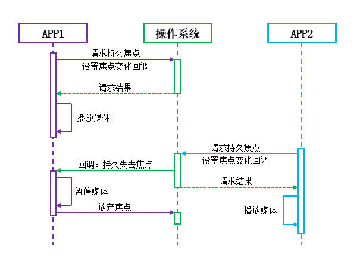
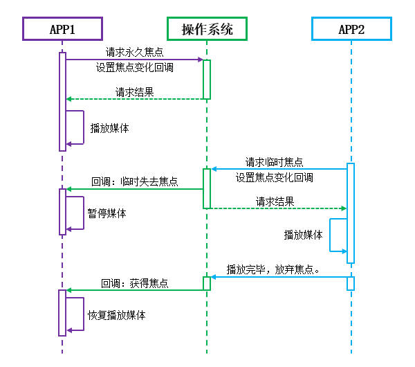

# 简介
一台设备可以同时运行多个媒体应用，如果多个进程同时播放音乐，且这些音频流以相同的音量混合在一起播送，就会导致用户听不清任何一个音源，体验较差。

为了防止多音源同步播放产生混乱，Android系统通过“音频焦点”机制进行音源间协调，任意时刻只有一个程序能够获取音频焦点，此时该程序可以正常播放音频，其它程序失去音频焦点时，要么降低音量，要么停止播放。

本章示例代码详见以下链接：

- [🔗 示例工程：AudioFocus](https://github.com/BI4VMR/Study-Android/tree/master/M07_Media/C03_Audio/S01_AudioFocus)

# 基本应用
应用程序准备播放媒体前需要先请求音频焦点，对于歌曲、广播等持续时间长的媒体，应当申请持久音频焦点；对于导航语音、提示音等持续时间短的媒体，应当申请临时音频焦点，播放完成后尽快将其释放。

我们在请求音频焦点之前需要构建AudioAttributes实例，描述当前程序即将播放的音频类型；系统会根据此类型决定是否为当前程序授予焦点，各个音频类型的优先级由Framework决定，与应用程序本身无关。

"TestUIBase.java":

```java
AudioAttributes attributes = new AudioAttributes.Builder()
        // 设置音频用途
        .setUsage(AudioAttributes.USAGE_MEDIA)
        // 设置媒体内容
        .setContentType(AudioAttributes.CONTENT_TYPE_MUSIC)
        .build();
```

然后我们创建一个音频焦点改变事件监听器OnAudioFocusChangeListener的实现类，该接口只有一个回调方法 `onAudioFocusChange(int focusChange)` ，用于监听当前程序的焦点状态；当前程序请求焦点成功后，若其他程序再请求焦点，系统会通过该回调方法通知当前程序“失去焦点”、“重新获取焦点”等事件，以便当前程序做出响应。

"TestUIBase.java":

```java
/* “音频焦点改变”事件监听器 */
class AudioFocusListener implements AudioManager.OnAudioFocusChangeListener {

    @Override
    public void onAudioFocusChange(int focusChange) {
        switch (focusChange) {
            case AudioManager.AUDIOFOCUS_GAIN:
                Log.i(TAG, "重新获得持久音频焦点");
                break;
            case AudioManager.AUDIOFOCUS_LOSS:
                Log.i(TAG, "持久失去音频焦点");
                break;
            case AudioManager.AUDIOFOCUS_LOSS_TRANSIENT:
                Log.i(TAG, "暂时失去音频焦点");
                break;
            case AudioManager.AUDIOFOCUS_LOSS_TRANSIENT_CAN_DUCK:
                Log.i(TAG, "暂时失去音频焦点，且本程序应当降低音量播放。");
                break;
        }
    }
}
```

该回调方法中 `focusChange` 参数的具体含义可参考下文内容：

🔷 `AUDIOFOCUS_GAIN(1)`

当前程序重新获得音频焦点。

当前程序首先请求到持久音频焦点，随后其它程序又请求临时焦点，使用完毕后将其释放，当前程序就会收到该事件，此处应当恢复先前的媒体播放。

🔷 `AUDIOFOCUS_LOSS(-1)`

当前程序持久失去音频焦点。

其它程序成功请求持久焦点后，当前程序就会收到该事件。由于其它程序可能长时间播放媒体，此时当前程序应当暂停播放并记录进度，直到用户通过UI点击等方式对本程序发出“继续播放”指令时，再恢复播放。

🔷 `AUDIOFOCUS_LOSS_TRANSIENT(-2)`

当前程序暂时失去音频焦点。

其它程序成功请求临时焦点后，当前程序就会收到该事件。由于其它程序的意图为短时间播放媒体，此时当前程序应当先暂停播放，后续收到 `AUDIOFOCUS_GAIN` 事件时自行恢复播放。

🔷 `AUDIOFOCUS_LOSS_TRANSIENT_CAN_DUCK(-3)`

当前程序暂时失去音频焦点（允许降低音量继续播放）。

其它程序成功请求允许降低音量的临时音频焦点后，当前程序就会收到该事件。

Android 8.0及更高版本的系统，能够自动降低本程序的媒体音量，开发者不需要额外操作；Android 8.0以下版本的系统，需要开发者自行实现降低音量的功能。

<br />

AudioAttributes与OnAudioFocusChangeListener准备就绪之后，我们需要创建AudioFocusRequest实例并组合这些请求参数。AudioFocusRequest类基于构造器模式， `Builder(int focusGain)` 方法的参数 `focusGain` 为当前程序希望请求的音频焦点类型，取值为AudioManager中的常量，每个值的含义详见下文。

🔶 `AUDIOFOCUS_GAIN(1)`

请求持续获得音频焦点，并且在此期间其它程序应当停止放音。

此类请求通常用于播放歌曲、视频等持续时间较长的场景。

🔶 `AUDIOFOCUS_GAIN_TRANSIENT(2)`

请求暂时获得音频焦点，并且在此期间其它程序应当暂停放音，直到本程序释放焦点后再恢复放音。

此类请求通常用于播放通知音效、触控音效等场景。

🔶 `AUDIOFOCUS_GAIN_TRANSIENT_MAY_DUCK(3)`

请求暂时获得音频焦点，并且在此期间其它程序应当降低音量继续放音，直到本程序释放焦点后再恢复音量。

此类请求通常用于导航软件，在播放语音提示期间降低音乐的音量，以便用户听清提示内容，语音播报完毕后再恢复音乐的音量。

🔶 `AUDIOFOCUS_GAIN_TRANSIENT_EXCLUSIVE(4)`

请求暂时获得音频焦点，并且在此期间其它程序应当完全静音，包括系统应用。

此类请求通常用于语音识别录音的场景。

<br />

> 🚩 提示
>
> 此处 `Builder(int focusGain)` 的参数值与前文 `onAudioFocusChange(int focusChange)` 回调方法参数值有所重叠，但它们的场景与含义不同，我们应当注意区分，避免混淆。
>
> `Builder(int focusGain)` 的参数表示当前程序希望请求的音频焦点类型；而 `onAudioFocusChange(int focusChange)` 回调方法的参数表示当前程序请求成功后，其他程序再次请求焦点的事件。

AudioFocusRequest构造器的常用配置项有 `setAudioAttributes()` 和 `setOnAudioFocusChangeListener()` ， `setAudioAttributes()` 可以传入前文创建的AudioAttributes实例，若未设置，默认值是Usage属性为 `USAGE_MEDIA` 的AudioAttributes实例。

"TestUIBase.java":

```java
// 构建请求实例，请求获得持久音频焦点。
AudioFocusRequest request = new AudioFocusRequest.Builder(AudioManager.AUDIOFOCUS_GAIN)
        // 设置音频属性，是可选参数，默认值为Usage为USAGE_MEDIA的实例。
        .setAudioAttributes(attributes)
        // 设置音频焦点改变监听器
        .setOnAudioFocusChangeListener(new AudioFocusListener())
        .build();
```

此时我们可以通过AudioManager的 `requestAudioFocus()` 方法请求音频焦点，传入前文构建的AudioFocusRequest实例。

"TestUIBase.java":

```java
// 获取AudioManager实例
AudioManager manager = (AudioManager) getApplicationContext().getSystemService(AUDIO_SERVICE);

// 使用AudioManager请求音频焦点
int result = manager.requestAudioFocus(request);
// 根据返回值执行进一步操作
switch (result) {
    case AudioManager.AUDIOFOCUS_REQUEST_GRANTED:
        Log.i(TAG, "持久音频焦点请求成功");
        break;
    case AudioManager.AUDIOFOCUS_REQUEST_FAILED:
        Log.i(TAG, "持久音频焦点请求失败");
        break;
    case AudioManager.AUDIOFOCUS_REQUEST_DELAYED:
        Log.i(TAG, "持久音频焦点请求失败（延迟）");
        break;
}
```

🔷 `AUDIOFOCUS_REQUEST_GRANTED(1)`

音频焦点请求成功。

此时我们的程序可以开始播放媒体。

🔷 `AUDIOFOCUS_REQUEST_FAILED(0)`

音频焦点请求失败。

此时我们的程序不应当播放媒体。

这种情况常见于“正在通话”等高优先级程序正在放音。

🔷 `AUDIOFOCUS_REQUEST_DELAYED(2)`

音频焦点请求失败（暂时）。

该值是Android 8.0中新增的方法表示当前时刻系统不能给当前程序授予焦点，但是稍后可以授予。此时我们的程序不应当播放媒体，可以放弃本次放音操作，或者稍后重新尝试请求焦点。

这种情况常见于TTS正在播报时，我们的程序恰好申请了音频焦点。

如果AudioFocusRequest请求包含 `setAcceptsDelayedFocusGain(false)` 配置项，则系统只会返回 `AUDIOFOCUS_REQUEST_FAILED` ，不会返回该值。

<br />

当媒体播放完毕时，我们可以调用AudioManager的 `abandonAudioFocusRequest()` 方法放弃音频焦点，此方法有两个作用，一是不再接收音频焦点改变的事件回调；二是允许其他程序抢占焦点。相同优先级的程序之间可以互相抢占焦点，但低优先级程序无法抢占高优先级程序的焦点，因此媒体播放结束后我们应当及时调用 `abandonAudioFocusRequest()` 释放焦点，以便其他程序能够正确地请求焦点。

# 音频策略
音频焦点仅用于协调各应用程序的播放行为，具体的播放行为由程序自身实现，失去焦点的程序可能按照规范暂停或降低音量播放，也可能无视规则继续大声播放。我们应当遵循音频焦点的管理规范，以免给用户带来较差的体验。

下文列表描述了一些值得推荐的处理方式：

- 应用程序在播放媒体之前，应当请求音频焦点，若系统拒绝授予焦点则不要播放。
- 应用程序失去音频焦点时，应当暂停播放或降低音量。
- 应用程序播放完毕后应及时释放音频焦点，确保其它程序能够正确地识别到音频空闲状态。

下文将以两个媒体应用程序与系统的交互为例，介绍常用的音频交互策略。

首先我们分析两个需要持久播放音频的程序之间的交互过程：

<div align="center">



</div>

APP1首先启动，向系统请求持久音频焦点，系统授予焦点，因此APP1开始正常播放媒体。

APP2启动后，意图长时间播放音乐，因此向系统请求持久音频焦点；系统向APP1发送回调事件“持久失去焦点”，APP1停止媒体播放，并且释放焦点。系统授予了APP2持久音频焦点，因此APP2开始播放音乐。

然后我们再分析一个短时间播放媒体的应用程序抢占长时间播放媒体的应用程序焦点的交互过程：

<div align="center">



</div>

APP1首先启动，向系统请求持久音频焦点，系统授予焦点，因此APP1开始正常播放媒体。

APP2启动后，意图长时间播放音乐，因此向系统请求临时音频焦点；系统向APP1发送回调事件“临时失去焦点”，APP1暂停媒体播放。系统授予了APP2临时音频焦点，因此APP2开始短暂的播放媒体。

当APP2播放完毕后，释放了音频焦点，随后操作系统向APP1发送回调事件“重新获得焦点”，APP1此时恢复媒体播放。

# 故障排除技巧
如果音频焦点工作与预期不符，我们可以通过日志分析各应用程序的音频焦点交互过程，以便排查故障原因。在AOSP中，MediaFocusControl和AudioManager将会在焦点变化时输出日志，我们可以进入ADB Shell，查看Logcat输出并进行过滤。

此处以“网易云音乐”APP为例，我们使其播放音乐，然后操作示例程序抢占焦点，分析日志中的有效信息。我们在ADB Shell中输入以下命令，清除旧日志并开始实时查看新日志： `logcat -c; logcat | grep -iE "MediaFocusControl:|AudioManager:|CloudMusic"` 。

首先模拟其他应用请求持久音频焦点的场景：

```text
# 打开云音乐点击播放按钮，云音乐(com.netease.cloudmusic)请求持久音频焦点(req=1)
# "uid/pid"表示请求进程的用户ID与进程ID
# "clientId"表示请求焦点的对象
# "callingPack"表示请求进程所在软件包的名称
# "req"表示该进程请求的焦点类型，数值对应"AudioFocusRequest.Builder()"所填写的参数
03-25 23:58:27.867  1388  2088 I MediaFocusControl: requestAudioFocus() from uid/pid 10131/18641 clientId=android.media.AudioManager@16fd273com.netease.cloudmusic.module.player@6bed9d7 callingPack=com.netease.cloudmusic req=1 flags=0x0 sdk=29

# 云音乐请求焦点成功，开始播放音乐。
03-25 23:58:28.002 17386 17881 D CloudMusicNativePlayer: Player Play!
03-25 23:58:28.002 17386 17881 D CloudMusicNativePlayer: Player Play finish!


# 示例应用(net.bi4vmr.study)请求持久音频焦点(req=1)
03-25 23:58:45.529  1388 10504 I MediaFocusControl: requestAudioFocus() from uid/pid 10359/15032 clientId=android.media.AudioManager@44bee83net.bi4vmr.study.MainActivity$AudioFocusListener@3a442c callingPack=net.bi4vmr.study req=1 flags=0x0 sdk=32
# 系统的AudioManager向云音乐回调“持久失去焦点”事件(-1)
03-25 23:58:45.529 18641 18641 D AudioManager: dispatching onAudioFocusChange(-1) to android.media.AudioManager@16fd273com.netease.cloudmusic.module.player@6bed9d7
# 云音乐收到事件后暂停媒体播放
03-25 23:58:45.629 17386 17881 D CloudMusicNativePlayer: call func:AudioPlayer_pause
03-25 23:58:45.629 17386 17881 D CloudMusicNativePlayer: Player Pause!

# 示例应用释放焦点
03-25 23:58:48.885  1388  2088 I MediaFocusControl: abandonAudioFocus() from uid/pid 10359/15032 clientId=android.media.AudioManager@44bee83net.bi4vmr.study.MainActivity$AudioFocusListener@3a442c
```

然后模拟其他应用请求临时音频焦点的场景：

```text
# 打开云音乐点击播放按钮，云音乐(com.netease.cloudmusic)请求持久音频焦点(req=1)
03-25 23:59:12.015  1388  2984 I MediaFocusControl: requestAudioFocus() from uid/pid 10131/18641 clientId=android.media.AudioManager@16fd273com.netease.cloudmusic.module.player@6bed9d7 callingPack=com.netease.cloudmusic req=1 flags=0x0 sdk=29

# 云音乐请求焦点成功，开始播放音乐。
03-25 23:59:13.000 17386 17881 D CloudMusicNativePlayer: Player Play!
03-25 23:59:13.005 17386 17881 D CloudMusicNativePlayer: Player Play finish!

# 示例应用(net.bi4vmr.study)请求持久音频焦点(req=2)
03-25 23:59:15.171  1388  2984 I MediaFocusControl: requestAudioFocus() from uid/pid 10359/15032 clientId=android.media.AudioManager@44bee83net.bi4vmr.study.MainActivity$AudioFocusListener@31d7718 callingPack=net.bi4vmr.study.media.audio.audiofocus req=2 flags=0x0 sdk=32
# 系统的AudioManager向云音乐回调“临时失去焦点”事件(-2)
03-25 23:59:15.172 18641 18641 D AudioManager: dispatching onAudioFocusChange(-2) to android.media.AudioManager@16fd273com.netease.cloudmusic.module.player@6bed9d7
# 云音乐收到事件后暂停媒体播放
03-25 23:59:15.865 17386 17881 D CloudMusicNativePlayer: call func:AudioPlayer_pause
03-25 23:59:15.866 17386 17881 D CloudMusicNativePlayer: Player Pause!

# 示例应用(net.bi4vmr.study)释放焦点
03-25 23:59:17.467  1388  2984 I MediaFocusControl: abandonAudioFocus() from uid/pid 10359/15032 clientId=android.media.AudioManager@44bee83net.bi4vmr.study.MainActivity$AudioFocusListener@31d7718
# 系统的AudioManager向云音乐回调“重新获得焦点”事件(1)
03-25 23:59:17.468 18641 18641 D AudioManager: dispatching onAudioFocusChange(1) to android.media.AudioManager@16fd273com.netease.cloudmusic.module.player@6bed9d7
# 云音乐恢复音乐播放动作。
03-25 23:59:17.612 17386 17881 D CloudMusicNativePlayer: Player Play!
03-25 23:59:17.612 17386 17881 D CloudMusicNativePlayer: Player Play finish!
```

# 版本变更
## 索引

<div align="center">

|       序号        |   版本    |                                  摘要                                  |
| :---------------: | :-------: | :--------------------------------------------------------------------: |
| [变更一](#变更一) | Android 8 |                        系统新增自动降低音量功能                        |
| [变更二](#变更二) | Android 9 | 程序持久失去焦点后，如果抢占者释放焦点，原程序将不再收到焦点恢复事件。 |

</div>

## 变更一
### 摘要
自从Android 8开始，系统新增自动降低音量功能。

### 详情
如果某个程序使用 `AUDIOFOCUS_GAIN_TRANSIENT_MAY_DUCK` 参数请求临时音频焦点，系统会自动为其他程序降低音量，不必再由各个程序自行实现降低音量的功能。

如果我们不希望自己的程序被降低音量，可以在构建AudioFocusRequest实例时添加配置 `setWillPauseWhenDucked(true)` ，禁止系统自动降低音量的行为，后续在 `onAudioFocusChange()` 回调方法触发时自行实现处理逻辑。

```java
/* AudioFocusRequest的代码片段 */
request = new AudioFocusRequest.Builder(AudioManager.AUDIOFOCUS_GAIN)
        .setWillPauseWhenDucked(true)
        .build();


/* OnAudioFocusChangeListener的代码片段 */
@Override
public void onAudioFocusChange(int focusChange) {
    switch (focusChange) {
        case AudioManager.AUDIOFOCUS_LOSS_TRANSIENT_CAN_DUCK:
            /* 自行实现暂停播放等逻辑 */
            break;
    }
}
```

## 变更二
### 摘要
自从Android 9开始，程序持久失去焦点后，如果抢占者释放焦点，原程序将不再收到焦点恢复事件。

### 详情
对于Android 9之前的版本，如果程序A已经获取持久焦点并播放媒体，此时程序B再请求持久焦点，一段时间后释放焦点，程序A的 `onAudioFocusChange()` 方法会被调用， `focusChange` 参数的值为 `AUDIOFOCUS_GAIN` 。

在上述场景中，程序B请求持久焦点，理应长时间播放媒体，当程序B释放焦点后程序A突然恢复播放，这会使用户感到困惑。

自从Android 9开始，如果一个程序持久失去音频焦点，后续将不会再收到任何焦点改变事件，这意味着仅当用户对该程序明确地发出播放指令时，它才会继续播放动作。

### 兼容方案
如果应用程序需要运行在Android 9之前的设备中，我们可以在持久失去焦点时，主动调用一次 `abandonAudioFocusRequest()` 方法，防止后续再收到“重新获得焦点”的事件回调。

```java
@Override
public void onAudioFocusChange(int focusChange) {
    switch (focusChange) {

        /* 此处省略其他情况... */

        case AudioManager.AUDIOFOCUS_LOSS:
            if (Build.VERSION.SDK_INT < Build.VERSION_CODES.P) {
                // 主动放弃焦点，避免后续其他应用放弃焦点时再次接收到回调。
                audioManager.abandonAudioFocusRequest(request);
            }
            break;
    }
}
```
