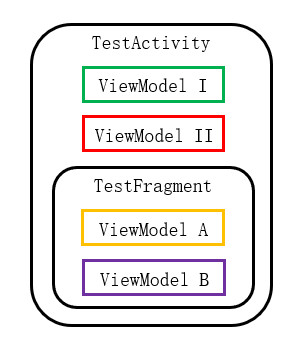
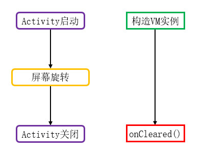

# 简介
ViewModel是Jetpack提供的架构组件，可供开发者创建MVVM架构的应用程序。

在采用MVVM架构的应用程序中，Activity不再直接持有数据，而是观察ViewModel中的可观察变量；当这些变量的值发生改变时，可观察对象将会通知Activity刷新界面。

本章的示例工程详见以下链接：

- [🔗 示例工程：ViewModel](https://github.com/BI4VMR/Study-Android/tree/master/M08_Architecture/C02_Component/S01_ViewModel)

# 基本应用
下文示例展示了ViewModel的基本使用方法。

🔴 示例一：ViewModel的基本应用。

在本示例中，我们使用ViewModel实现界面与数据分离。

第一步，我们创建MyViewModel类，继承自ViewModel类，并在它的构造方法中生成一个随机数，作为每个VM对象的唯一标识。

"MyViewModel.java":

```java
public class MyViewModel extends ViewModel {

    /* 此处省略部分变量与方法... */

    // 实例ID
    public final String id;
    // 共享数据
    private int num = 0;

    public MyViewModel() {
        // 生成随机ID，标识当前实例。
        id = genRandomID();
        Log.i(TAG, "VM created. ID:[" + id + "]");
    }

    // 读取共享数据
    public int getNum() {
        return num;
    }

    // 写入共享数据
    public void setNum(int num) {
        this.num = num;
    }
}
```

上述内容也可以使用Kotlin语言编写：

"MyViewModel.kt":

```kotlin
class MyViewModel : ViewModel() {

    /* 此处省略部分变量与方法... */

    companion object {
        val TAG: String = "TestApp-${MyViewModel::class.java.simpleName}"
    }

    // 实例ID
    var id: String
    // 共享数据
    private var num: Int = 0

    init {
        // 生成随机ID，标识当前实例。
        id = genRandomID()
        Log.i(TAG, "VM created. ID:[$id]")
    }

    // 读取共享数据
    fun getNum(): Int {
        return num
    }

    // 写入共享数据
    fun setNum(num: Int) {
        this.num = num
    }
}
```

在上述代码中，我们声明了变量 `num` ，并添加对应的"get"与"set"方法，以便测试数据共享功能。

第二步，我们在测试Activity的 `onCreate()` 方法中获取该ViewModel实例，并调用 `setNum()` 方法更新变量 `num` 的值。

"TestUIBase.java":

```java
// 获取当前Activity的MyViewModel实例
MyViewModel vm = new ViewModelProvider(this).get(MyViewModel.class);
Log.i(TAG, "Get VM in Activity. ID:[" + vm.id + "]");

// 向VM实例写入数据
vm.setNum(1000);

// 初始化Fragment
getSupportFragmentManager()
        .beginTransaction()
        .add(R.id.container, TestFragment.newInstance())
        .addToBackStack(null)
        .commit();
```

上述内容也可以使用Kotlin语言编写：

"TestUIBase.kt":

```kotlin
// 获取当前Activity的MyViewModel实例
val vm: MyViewModel = ViewModelProvider(this)[MyViewModel::class.java]
Log.i(TAG, "Get VM in Activity. ID:[${vm.id}]")

// 向VM实例写入数据
vm.setNum(1000)

// 初始化Fragment
supportFragmentManager.beginTransaction()
    .add(R.id.container, TestFragment.newInstance())
    .addToBackStack(null)
    .commit()
```

在上述代码中，我们通过ViewModelProvider的 `get()` 方法获取ViewModel实例。ViewModelProvider的构造方法参数是ViewModelStoreOwner接口实现类，这些类拥有管理ViewModel实例的能力； `get()` 方法的参数是我们指定的ViewModel类。此处我们获取了一个MyViewModel实例，该实例存储在Activity中。

该Activity中包含一个TestFragment，我们在Fragment的 `onCreate()` 方法中尝试获取Activity持有的MyViewModel实例。

"TestFragment.java":

```java
// 获取宿主Activity的MyViewModel实例
MyViewModel vm = new ViewModelProvider(requireActivity()).get(MyViewModel.class);
Log.i(TAG, "Get VM in parent Activity. ID: " + vm.id);

// 从VM实例读取数据
int data = vm.getNum();
Log.i(TAG, "Get data in Activity's VM: " + data);
```

上述内容也可以使用Kotlin语言编写：

"TestFragment.kt":

```kotlin
// 获取宿主Activity的MyViewModel实例
val vm: MyViewModel = ViewModelProvider(requireActivity())[MyViewModel::class.java]
Log.i(TAG, "Get VM in parent Activity. ID:[${vm.id}]")

// 从VM实例读取数据
val data: Int = vm.getNum()
Log.i(TAG, "Get data in Activity's VM. Value:[$data]")
```

此时运行示例程序，并查看控制台输出信息：

```text
23:41:10.222 12409 12409 I MyViewModel: VM created. ID:[551A4E]
23:41:10.222 12409 12409 I TestUIBase: Get VM in Activity. ID:[551A4E]
23:41:10.222 12409 12409 I TestUIBase: Set data to Activity's VM. Value:[1000]
23:41:10.224 12409 12409 I TestFragment: Get VM in parent Activity. ID:[551A4E]
23:41:10.224 12409 12409 I TestFragment: Get data in Activity's VM. Value:[1000]
```

根据上述输出内容可知：

Activity与其中的Fragment都获取到了同一个MyViewModel实例（ID为"551A4E"），并且Activity设置变量 `num` 的值后，Fragment能够读取该值，实现了数据的共享。

# VM实例的存储与复用
我们通常使用 `new ViewModelProvider(ViewModelStoreOwner owner).get(Class<T> vmClass)` 这种方式获取ViewModel实例，其中ViewModelStoreOwner是一个接口，它的实现类具有管理ViewModel实例的能力，SDK中默认的ViewModel容器有Activity和Fragment，我们也可以根据需要自行实现新的容器。

ViewModel实例在容器中以键值对的形式存储，键名为该ViewModel对应的Class。当我们调用 `get()` 方法获取ViewModel实例时，如果当前容器中没有该ViewModel的实例，就会创建一个新的实例并返回；如果当前容器中已有该ViewModel的实例，则会直接返回现有实例。

<div align="center">



</div>

正如前文章节 [🧭 基本应用](#基本应用) 所示，我们在Fragment中可以通过 `requireActivity()` 得到宿主Activity实例，然后将其作为ViewModelStoreOwner获取宿主Activity中的MyViewModel实例，此时就能够方便地实现数据共享与事件传递。

# 生命周期
## 简介
ViewModel的生命周期较为简单，详情如下文图片所示：

<div align="center">



</div>

当我们在容器中首次获取ViewModel实例（通常是Activity或Fragment被创建的时刻）时，ViewModel的构造方法将被系统调用，此处我们可以进行初始化操作。

当ViewModel实例所在容器被销毁之前，它的生命周期回调方法 `onCleared()` 将会触发，此处我们应当释放ViewModel中使用的资源。

我们可以使用ViewModel代替 `onSaveInstanceState()` 机制，在屏幕方向改变等场景保存与恢复视图数据。界面组件与ViewModel在同一个进程中，因此不需要跨进程传输数据，相比 `onSaveInstanceState()` 机制更加简单高效。

> ⚠️ 警告
>
> ViewModel只是界面数据的管理工具，生命周期比界面更长，因此我们不能在其中保存任何界面实例（例如Activity、Fragment或View），否则界面实例可能无法被JVM回收而导致内存泄漏。

## 典型场景
我们在测试Activity中放置一个FragmentContainerView，然后通过按钮添加或移除TestFragment实例，并观察控制台输出内容。

"TestFragment.java":

```java
@Override
public void onCreate(@Nullable Bundle savedInstanceState) {
    super.onCreate(savedInstanceState);
    Log.i(TAG, "OnCreate.");

    // 获取当前Fragment的ViewModel2实例
    MyViewModel2 vmInFragment = new ViewModelProvider(this).get(MyViewModel2.class);
    Log.i(TAG, "Get VM in Fragment. ID:[" + vmInFragment.id + "]");
}
```

上述内容也可以使用Kotlin语言编写：

"TestFragment.kt":

```kotlin
override fun onCreate(savedInstanceState: Bundle?) {
    super.onCreate(savedInstanceState)
    Log.i(TAG, "OnCreate.")

    // 获取当前Fragment的ViewModel2实例
    val vmInFragment: MyViewModel2KT = ViewModelProvider(this)[MyViewModel2KT::class.java]
    Log.i(TAG, "Get VM in Fragment. ID:[${vmInFragment.id}]")
}
```

此时运行示例程序，点击按钮添加TestFragment实例，并查看控制台输出信息：

```text
19:23:50.018 24527 24527 I TestFragment: OnCreate.
19:23:50.018 24527 24527 I MyViewModel2: VM created. ID:[6E846A]
19:23:50.018 24527 24527 I TestFragment: Get VM in Fragment. ID:[6E846A]
```

根据上述输出内容可知：

TestFragment实例首先被创建，当运行至 `new ViewModelProvider(this).get(MyViewModel2.class)` 语句时，TestFragment容器中没有MyViewModel2实例，因此系统调用MyViewModel2的构造方法创建了一个实例(ID为"6E846A")。

随后我们改变设备屏幕方向，再次查看控制台输出信息：

```text
19:23:50.110  24527  24527 I TestFragment: OnDestroy.
19:23:50.254  24527  24527 I TestFragment: OnCreate.
19:23:50.268  24527  24527 I TestFragment: Get VM in Fragment. ID:[6E846A]
```

根据上述输出内容可知：

TestFragment实例因屏幕方向改变而销毁重建，此时获取到的MyViewModel2实例ID为6E846A，与首次创建的MyViewModel2实例相同，因此其中的数据得以被保留。

最后我们点击按钮移除TestFragment实例，并查看控制台输出信息：

```text
19:23:50.510  24527  24527 I MyViewModel2: OnCleared. ID:[6E846A]
19:23:50.510  24527  24527 I TestFragment: OnDestroy.
```

根据上述输出内容可知：

TestFragment被系统回收之前，其中存储的MyViewModel2实例先被回收了，相关资源得以释放。

# AndroidViewModel
有时我们需要通过Context初始化外部组件，但ViewModel只能使用无参构造方法，无法设置任何初始参数，此时不妨使用AndroidViewModel。

AndroidViewModel的构造方法参数 `application` 为应用程序的Application实例，我们可以从中获取到Context实例。

"AndroidVM.java":

```java
public class AndroidVM extends AndroidViewModel {

    private static final String TAG = "TestApp-" + AndroidVM.class.getSimpleName();

    public AndroidVM(@NonNull Application application) {
        super(application);

        // 获取应用级的Context对象
        Context context = application.getApplicationContext();
        Log.i(TAG, "Get APPContext: " + context.toString());
    }
}
```

上述内容也可以使用Kotlin语言编写：

"AndroidVM.kt":

```kotlin
class AndroidVMKT(application: Application) : AndroidViewModel(application) {

    companion object {
        val TAG: String = "TestApp-${AndroidVMKT::class.java.simpleName}"
    }

    init {
        // 获取应用级的Context对象
        val context: Context = application.applicationContext
        Log.i(TAG, "Get APPContext: $context")
    }
}
```
