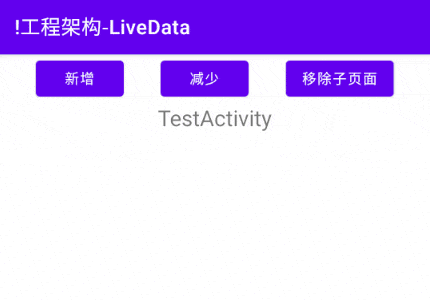
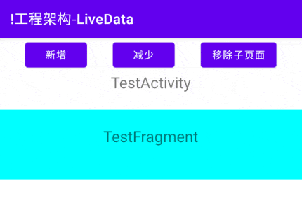

# 简介
LiveData是一种可被观察的数据容器，外部组件可以通过注册回调成为观察者；每当容器内的数据发生改变时，LiveData将会通知所有观察者数据变更事件。

LiveData与其他观察者模式工具相比，新增了生命周期感知功能，它只会通告事件给状态为活跃的观察者，如果观察者的生命周期进入非活跃状态，它们的回调会被自动注销，开发者不必手动执行注销，使用更加便捷。

本章示例代码详见以下链接：

- [🔗 示例工程：LiveData](https://github.com/BI4VMR/Study-Android/tree/master/M08_Architecture/C02_Component/S02_LiveData)

# 基本应用
我们首先创建一个ViewModel类，用来承载LiveData。

"MyViewModel.java":

```java
public class MyViewModel extends ViewModel {

    // 基本类型数值
    private int num = 0;

    // 可变LiveData，其中的数值可以被修改。
    private final MutableLiveData<Integer> numberData = new MutableLiveData<>();
    // 不可变LiveData，仅可被外部观察。
    public final LiveData<Integer> roNumberData = numberData;

    // 数值增加
    public void plus() {
        // 改变数值
        num += 10;
        // 通知观察者数值发生变化
        numberData.setValue(num);
    }

    // 数值减少
    public void minus() {
        // 改变数值
        num -= 10;
        // 通知观察者数值发生变化
        numberData.setValue(num);
    }
}
```

在上述示例代码中，我们声明了基本类型的变量 `num` ，并提供对应的数值增加方法 `plus()` 和数值减少方法 `minus()` ，用于修改该变量的值。

我们还声明了两个LiveData变量以供外部观察 `num` 数值的变化，它们的泛型为Integer，与基本类型变量 `num` 相对应。其中私有变量 `numberData` 的类型为MutableLiveData，它的值可以被改变；而公开变量 `roNumberData` 的类型为LiveData，它的值只能被外部观察但不可被修改，我们在变量名前添加"Read Only"的缩写，以便与 `numberData` 作区分。

在增减数值的两个方法中，每当 `num` 的值被改变时，我们都调用MutableLiveData的 `setValue()` 方法将最新数值通告给观察者。

接着我们在测试Activity中获取MyViewModel实例，并观察公开LiveData变量 `roNumberData` ，当它的值发生变化时，将最新数值显示到界面上。

"TestUIBase.java":

```java
protected void onCreate(Bundle savedInstanceState) {
    super.onCreate(savedInstanceState);
    setContentView(R.layout.testui_base);

    /* 此处省略部分变量与方法... */

    // 获取当前Activity的MyViewModel实例
    MyViewModel vm = new ViewModelProvider(this).get(MyViewModel.class);

    // 注册按钮监听器
    btnPlus.setOnClickListener(v -> vm.plus());
    btnMinus.setOnClickListener(v -> vm.minus());

    // 读取LiveData的初始值
    Log.i("myapp", "LiveData初始值：" + vm.roNumberData.getValue());

    // 调用LiveData的"observe()"方法，注册本Fragment为该LiveData的观察者。
    vm.roNumberData.observe(this, new Observer<Integer>() {
        @Override
        public void onChanged(Integer integer) {
            Log.i(TAG, "LiveData数值改变：" + integer);
            // 观察到数值改变时，将其更新到控件上。
            tvContent.setText("Num:" + integer);
        }
    });
}
```

此时运行示例程序，点击增减按钮改变数值，并观察界面变化：

<div align="center">



</div>

每当我们点击按钮触发ViewModel中的数值增减操作时， `numberData` 就会向所有观察者发送事件通知；Activity初始化时将自身注册为 `roNumberData` 的观察者，因此能够收到事件通知（回调方法 `onChanged()` 触发），此时即可刷新界面显示。

# 更新数据
LiveData是不可变的，且并未提供修改容器中存储的值的相关方法，它只能被外部组件观察；而MutableLiveData扩展自LiveData类，提供了 `setValue()` 与 `postValue()` 方法，它们能够更新容器内部存储的值。

我们通常会为一项数据创建可变、不可变两个LiveData变量，并将不可变变量的引用指向可变变量；ViewModel内部访问可变变量实现修改数据值，对外只暴露不可变变量。这种设计的考量如下：外部组件更新LiveData时，通常伴随着ViewModel中的其他逻辑，例如前文示例中的 `plus()` 和 `minus()` 方法，我们可以在此插入日志记录等操作，以便观察LiveData何时被更新。如果我们直接对外暴露MutableLiveData变量，任何组件都可以修改该变量的值，并且不会留下日志记录，降低了可维护性。

当我们需要更新MutableLiveData的值时，如果在主线程执行，可以使用同步方法 `setValue()` 。在前文示例中，数值增加方法 `plus()` 由Activity中的按钮触发，因此我们使用 `setValue()` 方法成功地更新了 `numberData` 的值。如果更新操作不在主线程中执行，我们必须使用 `postValue()` 方法进行操作，否则会导致异常："IllegalStateException: Cannot invoke setValue on a background thread"。

LiveData的观察者必须在主线程中调用 `observe()` 等方法注册回调，当数据发生变更时，回调方法 `onChanged()` 也会在主线程执行，因此我们可以直接书写界面更新逻辑，而不必手动切换至主线程。

LiveData默认没有去重机制，这意味着它不比较新数据与当前数据是否一致，只要收到更新请求就会通知所有观察者。

# 共享数据
ViewModel与LiveData配合可以实现多组件间的数据共享，由ViewModel的前置知识可知，多个组件能够获取到相同的ViewModel实例，如果它们都观察某个LiveData，就能够实现数据的统一分发。

以前文示例为基础，我们在测试Activity中添加一个Fragment，并获取Activity的ViewModel实例，也观察 `roNumberData` 变量。

"TestFragment.java":

```java
public View onCreateView(LayoutInflater inflater, ViewGroup container, Bundle savedInstanceState) {
    View view = inflater.inflate(R.layout.fragment_test, container, false);
    TextView tvContent = view.findViewById(R.id.tvContent);

    // 获取宿主Activity的MyViewModel实例
    MyViewModel activityVM = new ViewModelProvider(requireActivity()).get(MyViewModel.class);
    // 调用LiveData的"observe()"方法，注册本Fragment为该LiveData的观察者。
    activityVM.roNumberData.observe(getViewLifecycleOwner(), new Observer<Integer>() {
        @Override
        public void onChanged(Integer integer) {
            Log.i("myapp", "LiveData数值改变：" + integer);
            // 观察到数值改变时，将其更新到控件上。
            tvContent.setText("Num:" + integer);
        }
    });
    return view;
}
```

此时运行示例程序，点击增减按钮改变数值，并观察界面变化：

<div align="center">



</div>

每次点击按钮后，Activity与Fragment中的文本内容都被同步更新，这表明共享数据成功。

# 生命周期感知
LiveData具有生命周期感知功能，只会将数据变更事件发送给生命周期为活跃的观察者。这种特性提高了性能与安全性，当注册为观察者的页面被关闭时，将会自动注销回调，避免数据更新时调用到已被销毁的控件，导致空指针等异常。

当我们注册观察者时， `observe()` 方法的第一个参数 `lifecycleOwner` 指定了该回调需要绑定的生命周期；在Activity中，我们通常传入"this"，当Activity活跃时可以接受数据更新，而Activity销毁时将会自动注销回调。

在Fragment中，我们可以传入Activity、Fragment或Fragment的LifecycleOwner三种实例，传入Activity则表明绑定宿主Activity的生命周期；Fragment的 `getViewLifecycleOwner()` 方法对应Fragment中View的生命周期，Fragment与其View的生命周期有时并不一致，例如：当我们使用新Fragment替换旧Fragment并启用回退栈时，旧Fragment只会销毁View，而不会销毁整个实例。

大部分情况下我们在Fragment中使用 `getViewLifecycleOwner()` 方法即可，因为LiveData通常都是用来更新界面的，应当将其与View绑定。

# 数据倒灌
在前文示例中，当我们首次进入测试Activity时，变量 `num` 的初始值为"0"，但Activity没有收到回调并更新界面。这是因为我们使用无参构造方法创建了LiveData实例，此时其中封装的Integer变量是初始状态，观察者注册时不会立刻收到回调。

LiveData的有参构造可以为其中存储的变量设置一个初始值，参数的类型与泛型一致：

"MyViewModel.java":

```java
private int num = 0;

// 使用"num"的值作为初始值构造LiveData实例
private final MutableLiveData<Integer> numberData = new MutableLiveData<>(num);
```

此时我们再运行示例程序，进入测试Activity，文本框控件将会显示LiveData的初始值"0"。

上述结果表明，每当我们注册观察者时，如果LiveData中存储的变量不是初始状态，则会立刻触发一次 `onChanged()` 回调方法，这种特性被称为“数据倒灌”。

有时我们并不希望产生数据倒灌，因为界面重新加载时可能收到过时的数据。我们可以根据情况添加标志位，判断是否需要接受倒灌的数据；或者使用不会发生数据倒灌的 [🔗 UnPeekLiveData](https://github.com/KunMinX/UnPeek-LiveData) 等工具替换LiveData。

# 数据转换
## 映射LiveData
部分数据之间存在一定的关联，例如学生的“年龄”可以由当前年份与“出生年份”相减得出。JetPack中的Transformations类提供了一些工具以便我们处理此类数据，我们可以将相关逻辑封装在ViewModel中，而不必写在界面组件中，进一步实现数据与界面的解耦。

我们在前文示例中新增一个LiveData变量 `squaredData` ，使用Transformations的 `map()` 方法与 `numberData` 联动，一旦 `numberData` 数值改变，就将其值的平方更新到 `squaredData` 中。

"TestUITransform.java":

```java
public class MyViewModel extends ViewModel {

    /* 此处省略部分变量与方法... */

    private int num = 0;
    public final MutableLiveData<Integer> numberData = new MutableLiveData<>(num);

    // 自"numberData"转换而来的LiveData，每当"numberData"改变时，它的值自动变为"numberData"的平方值。
    public final LiveData<Integer> squaredData = Transformations.map(numberData, new Function<Integer, Integer>() {
        @Override
        public Integer apply(Integer input) {
            // 计算平方根并返回结果
            return squared(input);
        }
    });

    // 计算平方值
    private int squared(int raw) {
        return raw * raw;
    }
}
```

静态方法 `LiveData<Y> map(LiveData<X> source, Function<X, Y> mapFunction)` 的参数 `source` 是原始LiveData变量；参数 `mapFunction` 是数据映射规则，泛型 `X` 与原始LiveData的值一致；泛型 `Y` 与转换后LiveData的值一致。

当原始LiveData的值发生改变时，回调方法 `apply()` 触发，原始LiveData的值通过 `input` 参数传入，经过处理后的结果通过返回值传递给转换后的LiveData。

我们在测试Activity中分别设置两个LiveData的观察回调，并输出日志、更新界面，此处省略相关内容，详见本章示例代码。

运行示例程序并点击“新增数值”按钮，观察日志输出。

```text
# 第一次点击新增按钮
2023-05-25 16:02:31.661 8287-8287/? I/myapp: Number LiveData数值改变：10
2023-05-25 16:02:31.665 8287-8287/? I/myapp: Squared LiveData数值改变：100

# 第二次点击新增按钮
2023-05-25 16:02:33.530 8287-8287/? I/myapp: Number LiveData数值改变：20
2023-05-25 16:02:33.531 8287-8287/? I/myapp: Squared LiveData数值改变：400
```

从上述日志可以观察到，当我们首次点击按钮时， `numberData` 的值变为"10"， `squaredData` 的 `apply()` 回调方法被触发，经过计算得到数值"100"并通知了观察者。

上述示例中的数据映射方法 `squared()` 返回基本类型数据，可以直接用于更新数据，此时我们使用 `map()` 方法即可。对于部分场景，数据映射方法返回LiveData类型数据，并且每次调用都是新的实例，无法被界面观察，此时需要使用Transformations提供的 `switchMap()` 方法；它的用法与 `map()` 方法类似，区别在于 `apply()` 回调方法返回值类型为LiveData，一旦建立关联后，每当源LiveData的值改变，Transformations生成的LiveData值也会改变，便于界面进行观察。

## 聚合LiveData
MediatorLiveData用于侦听多个LiveData的数据变化，当任意一个侦听目标中的数据发生变化时，都会触发回调方法，我们可以在此进行数据处理操作，例如：统计数据之和。

我们在前文示例中新增一个 `mediatorData` 变量，每当原始数值或平方数值任意一个LiveData发生改变时，都将它们累加到 `mediatorData` 自身。

"TestUITransform.java":

```java
public class MyViewModel extends ViewModel {

    /* 此处省略部分变量与方法... */

    // 聚合LiveData，当上文的两个LiveData其中之一数值改变时，都将他们的数值叠加到自身。
    public final MediatorLiveData<Integer> mediatorData = new MediatorLiveData<>();

    {
        // 设置初始值为0
        mediatorData.setValue(0);
        // 注册事件源，每当"numberData"的值改变时触发。
        mediatorData.addSource(numberData, new Observer<Integer>() {
            @Override
            public void onChanged(Integer integer) {
                // 此处为了演示方便已经初始化MediatorLiveData，实际使用时需要添加空值判断逻辑。
                assert mediatorData.getValue() != null;
                int current = mediatorData.getValue();
                // 当前数值加上"numberData"的数值。
                mediatorData.setValue(current + integer);
            }
        });

        // 注册事件源，每当"squaredData"的值改变时触发。
        mediatorData.addSource(squaredData, new Observer<Integer>() {
            @Override
            public void onChanged(Integer integer) {
                assert mediatorData.getValue() != null;
                int current = mediatorData.getValue();
                // 当前数值加上"squaredData"的数值。
                mediatorData.setValue(current + integer);
            }
        });
    }
}
```

我们在测试Activity中注册 `mediatorData` 的观察者后，运行示例程序并点击“增加数值”按钮，观察日志输出。

```text
# 第一次点击增加数值按钮
2023-05-25 16:33:59.909 8568-8568/? I/myapp: Number LiveData数值改变：10
2023-05-25 16:33:59.909 8568-8568/? I/myapp: Squared LiveData数值改变：100
2023-05-25 16:33:59.909 8568-8568/? I/myapp: Mediator LiveData数值改变：100
2023-05-25 16:33:59.909 8568-8568/? I/myapp: Mediator LiveData数值改变：110

# 第二次点击增加数值按钮
2023-05-25 16:34:03.077 8568-8568/? I/myapp: Number LiveData数值改变：20
2023-05-25 16:34:03.078 8568-8568/? I/myapp: Squared LiveData数值改变：400
2023-05-25 16:34:03.078 8568-8568/? I/myapp: Mediator LiveData数值改变：510
2023-05-25 16:34:03.079 8568-8568/? I/myapp: Mediator LiveData数值改变：530
```

从上述日志信息可以发现，首次点击增加数值按钮时，MediatorLiveData首先收到了平方数值改变事件，从"0"变为"100"；然后收到了原始数值改变事件，最终变为"110"。
