# 影像设备
## 旁轴相机
早期照相机多为固定式装置，具有庞大的体积与重量，难以随身携带。旁轴相机(Rangefinder Camera)是最先出现的便携式照相机，使得现场纪实摄影成为可能。

1913年，德国工程师Oskar Barnack设计了Ur-Leica照相机，他将纵向过片的35毫米电影胶片改为横向过片，此时单幅画面对应的胶片尺寸为 `36mm x 24mm` ，实现了更大的感光面积。该规格作为底片的标准尺寸之一，从模拟信号时代沿用至数字信号时代。

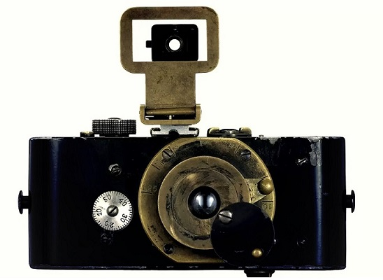

旁轴相机的特点是取景与拍摄分别使用独立光路，其结构如下文图片所示：

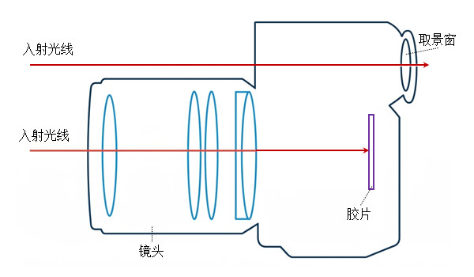

光学取景器(Optical View Finder, OVF)是安装在设备顶部的模块，独立于镜头接收光线。在实际拍摄前，用户需要从取景窗观察被摄物体在画面中的状态，以便预览画面并进行调整。当用户按下拍摄按钮后，快门开启，从镜头入射的光线到达胶片完成曝光，完成图像采集。

由于取景模块与拍摄模块相对独立，当用户在镜头侧进行变焦、对焦等操作后，取景器中的画面与实际拍摄效果存在差异。

## 单反相机
20世纪中期，为了解决旁轴相机取景画面与实际拍摄效果不一致的问题，人们发明了单反相机(Single Lens Reflex Camera, SLRC)，这种相机内置反光板与五棱镜，镜头既可用于实际拍摄，又可用于取景预览。

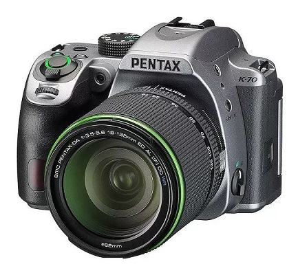

单反相机的结构如下文图片所示：

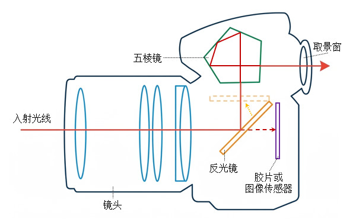

在取景预览阶段，反光板呈45度位置，镜头接收到的水平光线被反射为垂直方向进入五棱镜；入射光线在五棱镜中经过多次反射，上下、左右颠倒的画面被还原为正常画面，以便用户从取景器中进行观察。

在实际拍摄阶段，反光板将向上抬起，不再遮挡快门；此时快门同步开启，光线照射到胶片或图像传感器上，完成图像采集。

单反相机的取景与拍摄具有统一光路，用户在镜头侧进行变焦、对焦等操作时，画面将会同步反馈到取景器中，与实际拍摄效果相近，因此逐步取代了旁轴相机。与此同时，复杂的机械结构使单反相机体积与重量较大、难以实现高速连拍，并且反光板位置切换会产生震动，容易影响长焦镜头的拍摄效果。

## 无反相机
进入21世纪后，随着电子技术的飞速发展，图像传感器与液晶显示器成功实现小型化与低功耗，人们进一步简化了单反结构，制造出无反相机(Mirrorless Interchangeable-lens Camera, MILC)。“无反”是指“无反光板与五棱镜”，有时也被称为“单电（单镜头电子取景照相机）”或“微单（紧凑型数字相机）”。

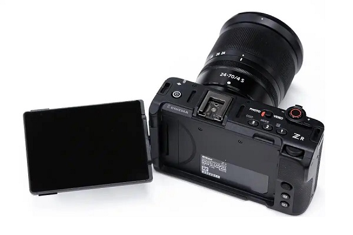

无反结构不再支持以胶片作为记录介质，入射光线通过镜头后直接汇聚在图像传感器上，传感器输出的电信号经过处理器调整，最终将画面显示在屏幕上以供用户取景预览：

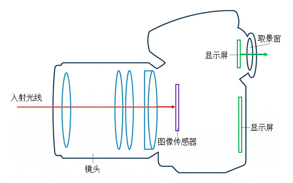

无反相机实现了小型化与轻量化，且具有强大的图形处理能力，除了镜头侧的变焦、对焦等操作，曝光设置、白平衡设置等效果也能实时显示在屏幕上，实现“所见即所得”，对用户更加友好。

无反相机的电子取景器(Electronic View Finder, EVF)也是一块微型屏幕，并未直接从镜头折射光线。虽然我们可以直接通过显示屏取景，但是环境光线过强时，显示屏上的画面难以辨认，此时可以将取景器抵近眼部进行观察，减少环境光线的干扰。部分无反相机为了减小体积或降低成本，已经取消了取景器。

目前无反相机逐步淘汰了单反相机，但部分低端设备没有机械快门，其传感器也不支持全局快门，因此拍摄高速移动的物体时画面容易产生果冻效应。

除了影视行业之外，无反结构也被广泛应用于其他领域：

- 智能手机：手机是我们生活中的必备工具，微型摄像模组使随时随地拍摄成为可能。由于手机空间有限，光学模组性能难以提升，人们尝试通过计算摄影等方式优化成像效果。
- 安防监控：摄像模组只用于录像，可以精简快门等机械结构，其可靠性为 `7 * 24` 小时连续记录提供了保障。
- 工业视觉：工业相机专为特定的场景优化，可以拥有较高的帧率或分辨率，能够用于检测产品是否存在瑕疵。

# 图像传感器
## 简介
光电效应(Photoelectric Effect)是指光线照射物体时，使物体发射电子的物理现象，该现象由海因里希・赫兹于1887年首次发现，并由阿尔伯特・爱因斯坦于1905年通过实验验证。人们将多个能够产生光电效应的半导体单元封装为阵列，制造出能够采集影像的图像传感器(Image Sensor)。

图像传感器的工作过程如下文列表所示：

1. 复位：所有光电二极管中的电荷量被调整至同一水平，与基准电压对齐。
2. 曝光：各个光电二极管持续接收光子，在此期间不断地累积亮度信息。
3. 读出：驱动电路测量每隔个光电二极管在曝光期间累积的电荷量，将其转换为电压信号，以供后级电路存储或显示。

常见的图像传感器分为CCD(Charged Couple Device)和CMOS(Complementary Metal-Oxide-Semiconductor)两种技术类型，二者存在诸多相似之处，它们的结构如下文图片所示：

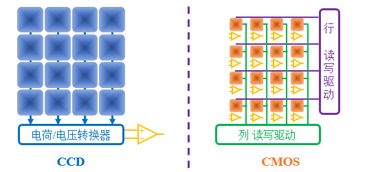

CCD的每个像素都是光电二极管，放大器、A/D转换器在外围电路中，读出阶段靠近输出端的整列电荷统一经过放大器与A/D转换器处理，输出为电压信号，以此类推，当所有列均被读出后，数据采集完毕。主流的CCD制造厂商有：索尼、安森美、松下。

CMOS的成像过程与CCD相同，但每个像素都集成了光电二极管、放大器、A/D转换器、寄存器等组件，在像素内部即可完成光信号到电信号的转换，直接向后级电路输出电压信号。主流的CMOS制造厂商有：索尼、三星、豪威、格科微、思特威、安森美。

CCD是最早被广泛应用的图像传感器，但其具有造价高昂、功耗高、体积大（依赖外围电路）、读出速度较慢（共享A/D转换器等模块，需要串行处理。）等缺点；随着CMOS制造工艺的逐渐成熟，目前CCD在民用领域已被CMOS取代。由于CCD的所有像素共享放大器等模块，受到随机噪声的影响比CMOS更小，并且容易实现全局快门，成像一致性更好，目前在天文、工业等领域仍有广泛应用。

## 采集灰度图像
以CMOS传感器为例，下文图片展示了图像数字化的过程：

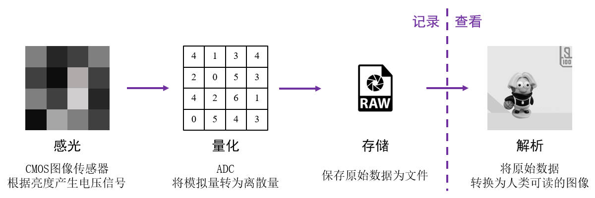

灰度图像的采集过程如下文列表所示：

1. 感光：光电二极管受到光线照射后将产生不同的电压信号，电压值即代表该像素的亮度。
2. 量化：光电二极管的电压经过A/D转换器测量后被转换为数字信号。
3. 存储：所有像素的亮度值被记录在文件中，以供我们后续查看时还原为图像。
4. 解析：设备读取文件中的数据，将数值矩阵转换为亮度矩阵，显示为人类可以识别的画面。

## 采集彩色图像
光电二极管只能检测亮度信息，为了获取颜色信息，我们可以在二极管前部安装单色滤镜；以红色滤镜为例，仅有红光能够通过滤镜照射二极管，其他颜色的光均被滤镜吸收或折射，此时该二极管即可得到红光的亮度信息。当我们收集到同一幅画面的三原色亮度分量时，就可以合成彩色图像。

下文图片展示了单色滤镜的工作原理：

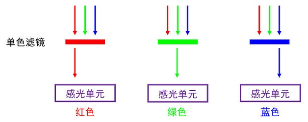

每个光电二极管只能配置单色滤镜，为了获得该像素的三原色亮度信息，我们很容易想到一种解决方案：通过棱镜将入射光线分为三份，并安装三色滤镜和三个图像传感器，分别记录红、绿、蓝光的亮度信息。这种方案能够采集最为精确的彩色图像，但具有成本高、体积大的缺点，仅有部分录像机产品采用此类结构，现今已非常罕见。

当前正被广泛应用的解决方案为：将三色滤镜交错排列，每个像素只记录一种颜色信息，另外两种颜色信息需要根据相邻像素进行推算。这种滤镜被称为色彩滤波阵列(Color Filter Array, CFA)，常见的排列方式如下文图片所示：

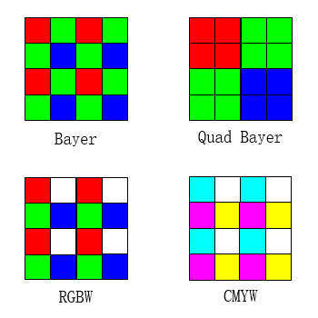

下文内容将对常见的滤镜进行介绍：

🔷 Mono

未安装滤镜，此时传感器仅能采集灰度图像。

滤镜不仅能够滤除无关光线，也会消耗自身颜色的部分光线，降低传感器在弱光环境下的灵敏度。在部分场合（例如：驾驶员状态检测、工业视觉、天文观测等），我们无需识别色彩信息，此时灰度图像传感器更为实用。

部分照相机也采用了无滤镜设计，例如：徕卡M11 Monochrom，艺术家可以利用它们创作具有高对比度的摄影作品。

🔷 Bayer

1974年，Kodak公司的工程师Bryce Bayer首先提出利用单传感器采集彩色图像的滤镜排列方式，因此人们将该排列方式及后续的衍生方式统称为“拜尔滤镜”。

拜尔滤镜的最小单元包括一个红色像素、一个蓝色像素和两个绿色像素，由于人眼对绿色更为敏感，两个绿色像素可以提供更高的采样精度。

🔷 Quad Bayer

2018年，Sony公司发布IMX586传感器，首次使用Quad Bayer排列方式，这种方式以较小的体积实现了更好的暗光成像效果，通常用于手机等微型设备。

Quad Bayer的工作模式如下文图片所示：

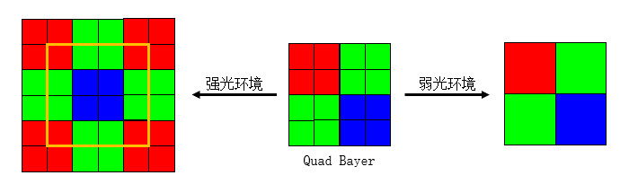

当环境光照充足时，传感器使用上图中的橙色区域采集图像，通过Remosaic算法可以得到类似Bayer排列的亮度信息矩阵。

当环境光照不足时，传感器将四个像素作为单个像素使用；此时输出图像的总像素数量降低，但单个像素的精度得到了提升。

 

以CMOS传感器为例，下文图片展示了彩色图像数字化的过程：

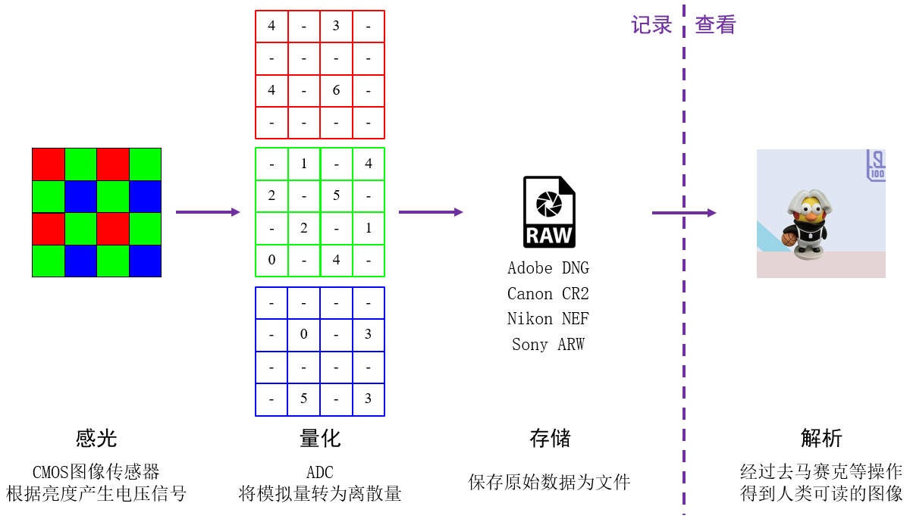

彩色图像的采集过程与灰度传感器类似，每个像素记录自身颜色的亮度数据，所有像素组成的数据矩阵被保存在RAW文件中。

“RAW文件”是所有传感器原始数据的统称，实际上每个厂家所采用的数据格式并不相同，当我们查看RAW文件时，需要通过对应的软件对原始数据进行解码，才能生成人类可识别的图像。

## 技术参数
### 物理尺寸

1、传感器尺寸：图像传感器的尺寸越大，则成像系统的尺寸越大，捕获的光子越多，感光性能越好，信噪比越低。

像素数量并不是越高越好，面积同等的情况下，如果提升像素数量，每个光电二极管的尺寸就会减小，感光能力降低。

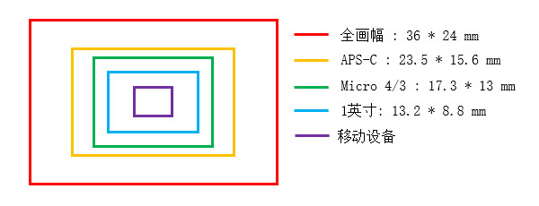

下文内容介绍了常见的传感器尺寸：

🔶 全画幅

全画幅(Full Frame)是常见的

与35mm胶卷一样，作为基准倍率。

红色为全画幅
尺寸 36mm×24mm

🔶 APS-C

先进摄影系统C型(Advanced Photo System type-C，缩写：APS-C），是一种数码相机所使用的感光组件（传感器）规格之一。

1996年多家厂商联合推出的胶片规格，相对35mm胶片等比缩小0.65倍，成本更低，数码时代被沿用。
先进摄影系统是在数字相机普及之前，针对未来数字化时代“基本相机”制定的感光组件规格，有H型、C型、P型三种画面比例，C型的感光组件大小和传统底片画面宽长比例一样，为3∶2，大约是25.1毫米×16.7毫米，但实际各家厂商的相机尺寸大小略有不同。 

于此同时还有H形和P形，单数码时代只有C型规格被用于制造传感器

绿色为索尼尼康宾得APS-C画幅
尺寸 23.5mm×15.6mm

黄色为佳能APS-C画幅尺寸 22.3mm×14.9mm

蓝色为奥巴松下M43画幅
尺寸 17.3mm×13mm

橙色为1英寸画幅尺寸 13.2mm×8.8mm

### 制造工艺
图像传感器的制造工艺如下文图片所示：

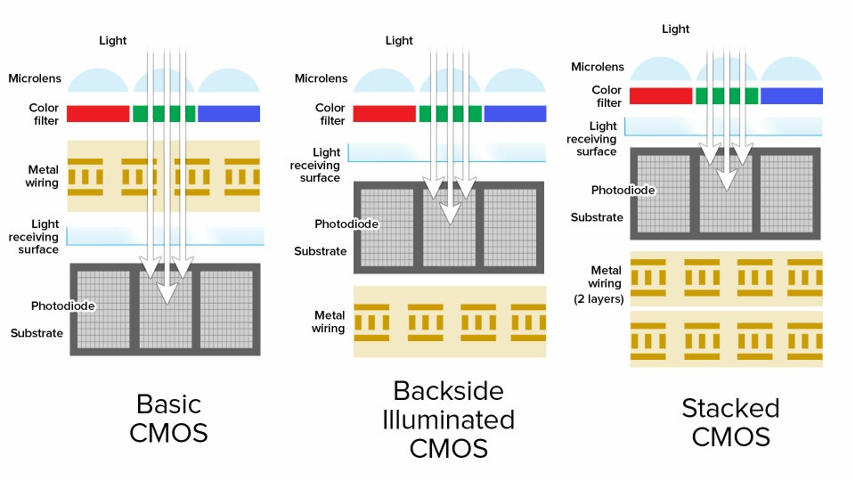

🔷 前照式

前照式是最早的传感器结构，金属导电层在光电二极管前端，光线需要经过导电层的开孔才能进入传感器，金属导电层会折射吸收一部分光线，导致成像效果劣化。

🔷 背照式

背照式 随着工艺进步，感光层只保留了感光元件的部分逻辑电路，这样使光线更加直接的进入感光元件层，减少了光线损失，比如光线反射等。

背照式结构是更符合人们直觉的设计，但其具有工艺复杂、成本较高、良品率低的特点，因此它比前照式设计出现更晚，目前是主流。

🔷 堆栈式

堆栈式传感器采用了与NAND存储器类似的3D堆叠工艺，可以在面积不变的情况下放置更多组件，附带的好处是增加了传感器结构的集成度，省出了更多的空间用于增加感光面积。容易实现全局快门，但成本较高，目前仅有高端设备采用。

# 快门系统
## 物理结构
快门用于控制曝光程度，曝光阶段，快门开启时间短，胶片或传感器接收到的光线少，画面较暗，快门时间长，光线多，画面较亮。

这个词汇有三层意思：

1、焦平面快门。相机的快门主要有两种：

一种叫镜间快门，它是设计安装在镜头中间的，所以叫做镜间快门

，它一般是由3-5片钢片组成，象过去的120相机基本都是这类。

另一种叫焦平面快门，它安装的位置就在胶卷（CCD）前面，这个位置基本就是聚焦的平面附近，所以叫焦平面快门，这是和镜间快门以资区别。

2、纵走焦平面快门，焦平面快门运动的方向有两种：左右和上下，早期的焦平面快门

是涂胶的绸布制成，所以又叫帘布快门，因为帘布要卷起来使用，这时是用左右各有一个轴来卷它，因此运动方向是左右（横向），后来不用帘布了，用钢片制成，当时又叫钢片快门。

我们知道，135胶卷的幅面为36*24mm，横向是36mm，纵向为24mm,为了提高快门速度

，纵向的距离短，这时钢片快门就设计成上下运动，这时我们称呼它叫纵走焦平面快门。

3、电子操（作）控（制）这个层面我就不用解释了，那就是快门的运动是受电子的元件来控制的。

什么叫电子操控纵走焦平面快门大概的意思就是这样。机械快门
顾名思义就是以机械能控制的快门。

    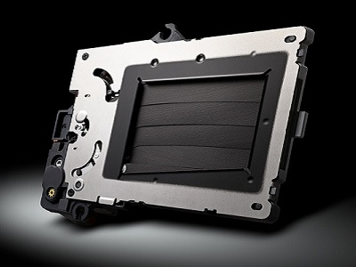
    &nbsp;&nbsp;&nbsp;&nbsp;
    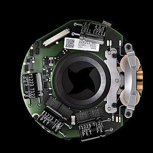

镜间快门
对于全画幅以上尺寸的传感器
因为画幅很大，胶片很大，你要作为一个焦平面快门，它的面积就太大了。成本高是一方面，另一方面就是影响快门速度。那么大一张门，你要把它打开再合上，你想想是不是需要点时间呢，所以在过去胶片画幅还没做到全画幅这么小的时候，我们大部分的相机的快门都不是焦平面快门， 是什么快门呢？镜间快门。

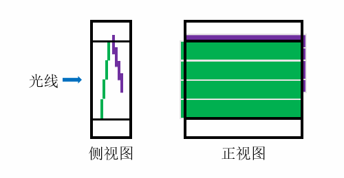

统称为机械快门，数码相机可能没有物理快门结构，它们涉及到传感器的数据采样方式，后文章节将会讨论此内容。

前帘/后联

防止曝光不均匀。

## 采样方式
对于图像传感器，
Global Shutter（全局快门）与Rolling Shutter（卷帘快门）对应全局曝光和卷帘曝光模式。卷帘快门逐行曝光的方式，全局快门是全部像素同时曝光，所以全局快门能够拍运动的物体而不产生形变，因为全局快门在每一个像素上添加了一个存储单元

因为前文提到的开口率问题，CMOS每个像素相比CCD已经集成了很多其他部件，用于感光的面积更小，无法再添加遮光屏蔽层存储信号。

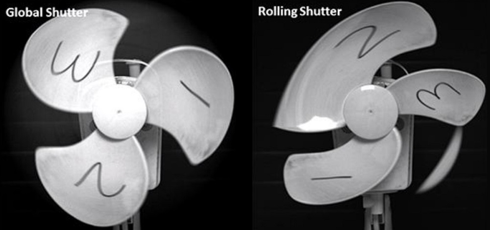

下文图片展示了全局快门与卷帘快门记录数据的动态过程。

    
    &nbsp;&nbsp;&nbsp;&nbsp;
    

和机械式焦平面快门一样，卷帘快门对高速运动的物体会产生明显的变形。而且因为其扫描速度比机械式焦平面快门慢，变形会更加明显。例如如果数据的读出速度是每秒20帧，那么图像顶部和底部的曝光先后差异将多达50毫秒。

全局快门一次性读出所有像素的数据，因此可以移除物理快门结构；

像素越高的传感器读出时间更长，更不容易实现全局快门，因此目前大部分设备还是使用卷帘快门，需要配合机械快门规避果冻效应

无反结构需要实时取景，取景阶段快门是开启的，拍摄前需要关闭，再次开启进行曝光，曝光结束后再进行关闭，因此区分前帘和后联

机械快门关闭造成震动可能会对长焦镜头造成影响，因此出现了电子前帘技术，

# 镜头系统

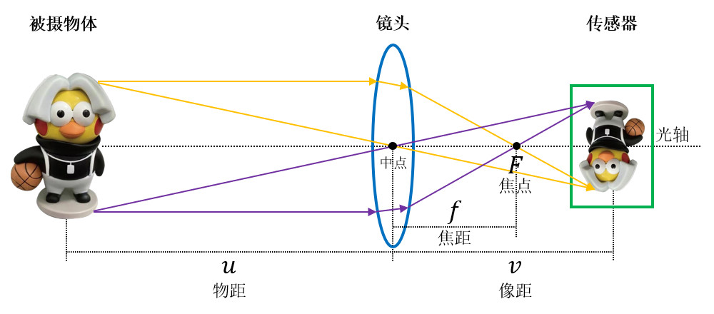

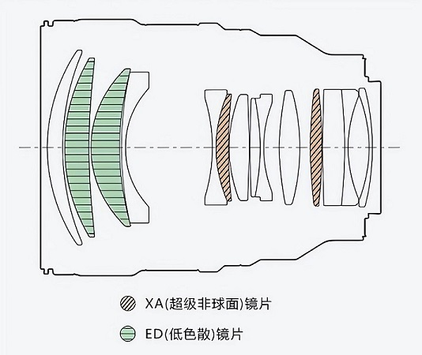

## 焦距

物距( $u$ )

物距：物体到透镜光心的距离，一般用u表示。
像距：像到透镜光心之间的距离，一般用v表。

物距(u)、像距(v)和焦距(f)三者关系满足高斯公式 :

## 对焦

## 变焦

## 光圈

