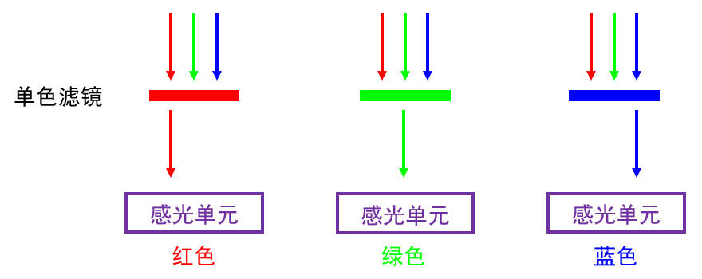
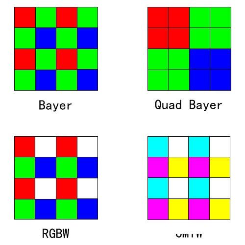
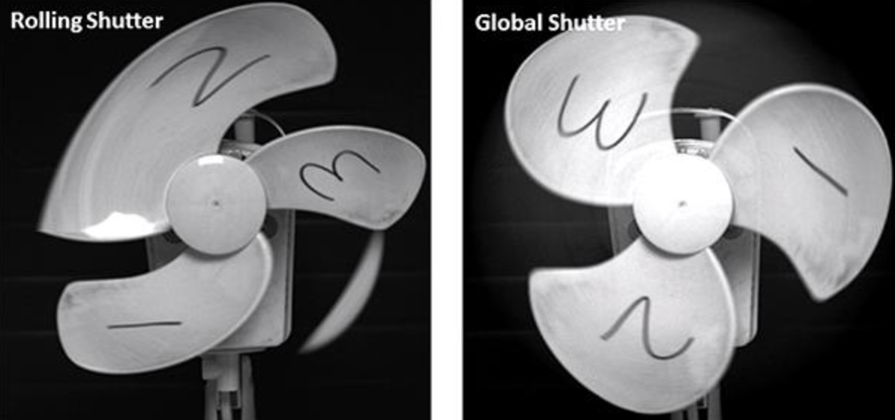

# 照相机结构
<!-- TODO -->

进入数码时代后，尤其是近20几年，随着电子技术进步，取景方式发生了本质变化——光线不再靠反光镜反射，而是直接照射在CCD（或CMOS）传感器上，把外界影像传输到相机背面的液晶屏上，这样的方式称之为电子取景。无反的定义——没有反光镜进行反射，直接在液晶屏上取景。这种无需反射光线取景相机，简称为无反。

单电：原来，早期研发无反相机的厂商有奥林巴斯、松下、索尼等。最先是奥林巴斯和松下共同研发出来第一款采用电子取景（或称屏幕实时取景）的数码相机。为了和单反相机（单镜头反光式取景）区別，就取名为“单镜头电子取景照相机”—— 简称单电（无反光板、电子取最器、可换镜头）。

微单：后来索尼也推出了这样的单电相机，并大规模进军无反相机领域。于是，索尼在中国大陆地区注册了“微单”这个商标，成了索尼的专利词汇。因此，“微单＂这个词，特指索尼的单电相机（或无反相机），其他厂商不得使用。

综上，取景方式是划分相机类型的主要方式，按这种方式划分有两类相机：单反相机和无反相机。无反相机的发展变演出多种俗称，也就有了微单、单电这些叫法。当然，在早期，和单反同时代，还有一种双镜头反射相机——双反相机，以及一种光轴侧旁平行取景相机——旁轴相机。这二者在主流市场已经很少了，大多是当古董收藏或情怀玩具。

# 成像原理

    CCD：画质优但功耗高、成本高，逐渐被CMOS取代。

    CCD采用整行读取，一致性好，目前适用于天文等科研领域，功率大，甚至需要冷冻设备降温，因此民用领域逐渐被CMOS取代。

    CMOS：性价比高、速度快、功耗低，已成为主流技术（如索尼IMX系列）。

### 简介
光电效应(Photoelectric Effect)是指光线照射物体时，使物体发射出电子的物理现象，该现象由海因里希・赫兹于1887年首次发现，并由阿尔伯特・爱因斯坦于1905年通过实验验证。人们将多个能够产生光电效应的半导体单元封装在一起，组成了图像传感器(Image Sensor)。

常见的图像传感器分为CCD和CMOS两种类型
这两种技术之间存在许多相似之处，但一个主要区别是每个传感器读取在给定像素处累积的信号的方式。

CMOS图像传感器的工作原理：每一个 CMOS 像素都包括感光二极管(Photodiode)、浮动式扩散层(Floating diffusion layer)、传输电极门 (Transfer gate)、起放大作用的MOSFET、起像素选择开关作用的M0SFET.在 CMOS 的曝光阶段，感光二极管完成光电转换，产生信号电荷，曝光结束后，传输电极门打开，信号电荷被传送到浮动式扩散层，由起放大作用的MOSFET电极门来拾取，电荷信号转换为电压信号。所以这样的 CMOS 也就完成了光电转换、电荷电压转换、模拟数字转换的三大作用，通过它我们就能把光信号转化为电信号，最终得到数字信号被计算机读取，这样，我们就已经拥有了记录光线明暗的能力，但这还不够，因为我们需要色彩。现代彩色CMOS 的原理也很简单，直接在黑白图像传感器的基础上增加色彩滤波阵列(CFA)，从而实现从黑白到彩色的成像。很著名的一种设计就是Bayer CFA（拜耳色彩滤波阵列）。一个很有趣的事就是，我们用来记录光影的 CMOS, 和我们用来输出光影的显示器，原理也刚好是向相反的，CMOS 把光转化为电信号最后以数字格式记录，显示器把解码的数字格式从电信号重新转化为光。光电之间的转换也就构成了我们人类数字影像的基础。
在这里插入图片描述
当前主流的CMOS厂商有：索尼、三星、豪威、格科微、思特威、安森美等公司。

1、传感器尺寸：图像传感器的尺寸越大，则成像系统的尺寸越大，捕获的光子越多，感光性能越好，信噪比越低。目前CMOS图像传感器的常见尺寸有1、2/3、1/2、1/3、1/4英寸等。
2、像素总数和有效像素数：像素总数是指所有像素的总和，像素总数是衡量CMOS图像传感器的主要技术指标之一。CMOS图像传感器的总体像素中被用来进行有效的光电转换并输出图像信号的像素为有效像素。显而易见，有效像素总数隶属于像素总数集合。有效像素数目直接决定了CMOS图像传感器的能力。
3、动态范围：动态范围由CMOS图像传感器的信号处理能力和噪声决定，反映了CMOS图像传感器的工作范围。其数值是输出端的信号峰值电压与均方根噪声电压之比，通常用DB表示。
4、分辨率：对景物中明暗细节的分辨能力。
5、像元尺寸也就是像素的大小：是指芯片像元阵列上的每个像素的实际物理尺寸，通常的尺寸包括14um、10um、9um、7um、6.45um、3.75um、3.0um、2.0um、1.75um、1.4um、1.2um、1.0um等，像元尺寸从某种程度上反映了芯片的对光的响应能力，像元尺寸越大，能够接收到的光子数量越多，在同样的光照条件和曝光时间内产生的电荷数量越多。对于弱光成像而言，像元尺寸是芯片灵敏度的一种表征。
6、灵敏度：灵敏度是芯片的重要参数之一，它具有两种物理意义。一种是光器件的光电转换能力，与响应率的意义相同。即芯片的灵敏度指在一定的光谱范围内，单位曝光量的输出信号电压（电流），单位可以为纳安/勒克斯nA/Lux、伏/瓦（V/W）、伏/勒克斯（V/Lux）、伏/流明（V/lm）。另一种是指器件所能传感的对地辐射功率（或照度），与探测率的意义相同，单位可用瓦（w）或勒克斯（Lux）表示。
7、坏点数，由于受到制造工艺的限制，对于有几百万像素点的传感器而言，所有的像元都是好的情况几乎不可能，坏点数是指芯片中坏点（不能有效成像的像元或相应不一致性大于参数允许的范围的像元）的数量，坏点数是衡量芯片质量的重要参数。
8、光谱效应，指芯片对于不同光波长光线的响应能力。
技术发展趋势，体积小型化及高像素化仍是业界积极研发的目标。因为像素尺寸小则图像产品的分辨率越高、清晰度越好、体积越小，其应用面更广泛。
9、CRA角度：从镜头的传感器一侧，可以聚焦到像素上的光线的最大角度被定义为主光角（CRA），镜头轴心线附近接近零度，与轴心线的距离越大，角度也随之增大。CRA与像素在传感器的位置是相关的。如果lens的CRA小于sensor的CRA，一定会有偏色现象。
10、动态范围：测量了图像传感器在同一张照片中同时捕获光明和黑暗物体的能力，通常定义为最亮信号与最暗信号比值的对数。
11、IR cut（滤除红外光）
如果没有，图像就会明显偏红，这种色差是没法用软件来调整的。
12、快门
Global Shutter（全局快门）与Rolling Shutter（卷帘快门）对应全局曝光和卷帘曝光模式。卷帘快门逐行曝光的方式，全局快门是全部像素同时曝光，所以全局快门能够拍运动的物体而不产生形变，因为全局快门在每一个像素上添加了一个存储单元

13、像素技术
FSI：前照式, 光是从前面的金属控制线之间进入，然后再聚焦在光电检测器上。
BSI：背照式，光线无需穿过金属互连层,优势大，比较有前景。
BSI在低照条件下的成像亮度和清晰度都比FSI有更大的优势。
传统的CMOS图像传感器是前照式结构的，自上而下分别是透镜层、滤色片层、线路层、感光元件层。采取这个结构时，光线到达感光元件层时必须经过线路层的开口，这里易造成光线损失。
而背照式把感光元件层换到线路层的上面，感光层只保留了感光元件的部分逻辑电路，这样使光线更加直接的进入感光元件层，减少了光线损失，比如光线反射等。因此在同一单位时间内，单像素能获取的光能量更大，对画质有明显的提升。不过该结构的芯片生产工艺难度加大，良率下降，成本相对高一点。
堆栈式（stack）：堆栈式是在背照式上的一种改良，是将所有的线路层挪到感光元件的底层，使开口面积得以最大化，同时缩小了芯片的整体面积。对产品小型化有帮助。另外，感光元件周边的逻辑电路移到底部之后，理论上看逻辑电路对感光元件产生的效果影响就更小，电路噪声抑制得以优化，整体效果应该更优。业内的朋友应该了解相同像素的堆栈式芯片的物理尺寸是比背照式芯片的要小的。但堆栈式的生产工艺更大，良率更低，成本更高。索尼的IMX214（堆栈式）和IMX135（背照式）或许很能说明上述问题。

### 灰度图像

Mono：100% 透传，它不能分辨色彩。Mono 配置的弱光灵敏度最高，仅用于对颜色无识别要求的场合，如驾驶员状态检测等。
徕卡M11 Monochrom

### 彩色图像

我们知道，图像传感器将光线转化成电流，光线越亮，电流的数值就越大；光线越暗，电流的数值就越小。但是，图像传感器有一个很严重的缺陷：它只能感受光的强弱，无法感受光的波长。由于光的颜色由波长决定，所以图像传播器无法记录颜色，也就是说，它只能拍黑白照片，这肯定是不能接受的。

一种解决方案是照相机内置三个图像传感器，分别记录红、绿、蓝三种颜色，然后再将这三个值合并。这种方法能产生最准确的颜色信息，但是成本太高，无法投入实用。

1974年，柯达公司的工程师Bryce Bayer提出了一个全新方案，只用一块图像传感器，在图像传感器前面，设置一层彩色滤光片阵列（Color Filter Array，CFA），他并没有在每个pixel上放三个颜色的滤镜，而是有间隔的在每个pixel上放置单一颜色的滤镜。 这样以来，每个通道能得到一个部分值空缺的图片，这些空缺的值可以通过各种插值手段进行填充。

从最开始的那张图可以看出，上述的bayer阵列是2×2的四个格子重复形成的，这四个格子有1个R，1个B，2个G，这是因为人眼视觉对于绿色比较敏感的缘故。

每个像素只能感应一种颜色的光，但是我对外输出的时候，需要知道这个像素的rgb值，我就只能通过周围像素去计算，这个计算和转换是靠ISP去完成的。进从而得出我这个像素的RGB的值，这样我每个像素虽然只感应了一种光，但是每个像素经过处理后传输到外面后就是有RGB的信息了。这些原始的感光数据成为RAW data。

RAW是传感器原始数据的统称，实际上各个厂家采用的格式并不相同，每种RAW数据必须使用对应的算法解码才能形成人类可识别的图像。

# 曝光要素

## 光圈

## 快门

## 感光度

# 果冻效应

和机械式焦平面快门一样，卷帘快门对高速运动的物体会产生明显的变形。而且因为其扫描速度比机械式焦平面快门慢，变形会更加明显。例如如果数据的读出速度是每秒20帧，那么图像顶部和底部的曝光先后差异将多达50毫秒。
