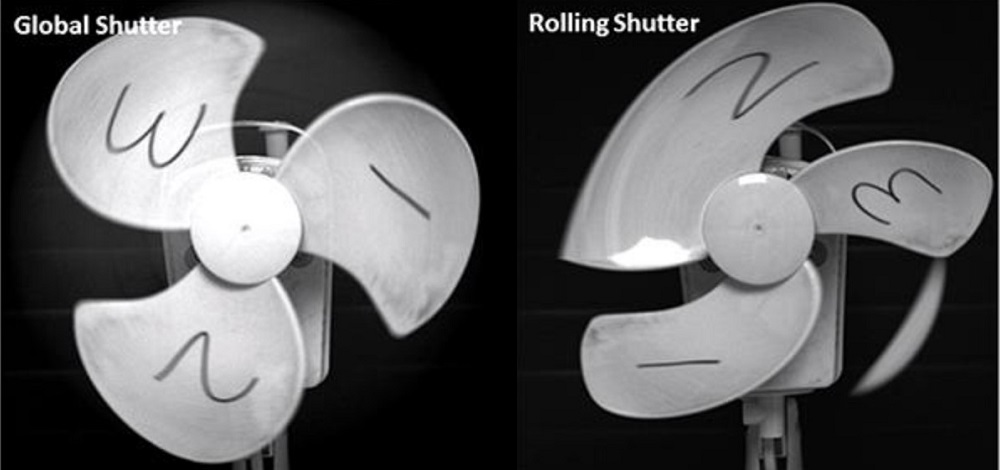

# 影像设备结构
## 旁轴相机
旁轴相机(Rangefinder Camera)是较早出现的照相机类型，当时的照相机大型皮腔相机，这种结构不便携，随着胶卷的发明，旁轴相机出现了，使得相机的便携性更好

旁轴相机的特点是拍摄和取景分别是独立的光路，其结构如下文图片所示：

旁轴是历史最悠久的相机类型之一。早期相机结构庞大，而旁轴相机的出现使摄影变得轻便。20世纪初，徕卡（Leica）推出的 35mm 旁轴相机彻底改变了摄影界，让街拍和纪实摄影成为可能。

取景器通常是固定镜头、不可更换，而拍摄镜头可调整、可更换，因此取景器看到的画面与实际拍摄效果存在差异、对焦精度不高。

## 单反相机
为了解决旁轴相机的问题，20世纪中期，人们发明了
单反相机(Single Lens Reflex Camera, SLRC)，这种相机的特定是内置五棱镜与反光板，并且只有单个用于成像的镜头。

取景时反光板呈45度，镜头接收到的光线被反射90度后进入五棱镜，五棱镜能够将镜头得到的上下、左右颠倒的画面还原为正向的画面，便于用户从取景器进行观察。

拍摄阶段，反光板将会抬起，光线直接照射到底片或者图像传感器上，完成图像采集。

单反相机具有统一的光路，用户对镜头的变焦、对焦操作都会反应到取景器中，解决了旁轴相机画面不一致的问题。
但是，复杂的光学结构使得单反相机体积、重量更大，便携性有所降低。并且拍摄阶段反光板动作会产生震动，对于长曝光场景可能会产生不良影响。

## 无反相机
21世纪初，电子技术飞速发展，图像传感器与显示器性能得到了提升，于是出现了无反相机（Mirrorless Interchangeable-lens Camera, MILC），这种相机取消了反光板与五棱镜，入射光线直接照射到图像传感器上，经过处理器转换为数字型号后，可以在屏幕上实时显示。

无反相机也被称为“单镜头电子取景照相机”或“微单”

这种相机将光学取景器替换为电子取景器（），电子取景器本质上也是一块微型显示屏，外部光线过亮时，屏幕难以看清，用户可以将眼睛靠近取景器观察。

无反相机具有强大的图形处理能力，显示屏与取景器输出的画面不仅包含对焦、变焦、而且曝光设置、白平衡等设置效果也能实时反馈给用户，实现所见即所得，对于用户更加友好。

取消了反光板与五棱镜，机身实现了小型化与轻量化，相比单反更加便携，但

无反相机的缺点是续航时间短，因为传感器实时采集图像并在屏幕上显示。并且低端设备既没有机械快门，传感器也不支持全局快门，因此拍摄高速移动的物体时果冻效应。

随着电子技术的发展，无反结构微型化，广泛应用在照相机之外的领域：

智能手机 智能手机是无反结构应用最广、最深化的领域。手机空间寸土寸金，根本无法容纳单反那样的反光镜和五棱镜。 计算摄影

安防监控 无反结构便于在传感器前加装滤镜切换装置（ICR），在光线暗时切换至红外模式，这是传统光学取景相机难以高效完成的。

工业视觉 在流水线上，工业相机以每秒几百帧的速度检测产品瑕疵，无反结构保证了设备的高速响应和长寿命。

# 图像传感器
## 简介
光电效应(Photoelectric Effect)是指光线照射物体时，使物体发射电子的物理现象，该现象由海因里希・赫兹于1887年首次发现，并由阿尔伯特・爱因斯坦于1905年通过实验验证。人们将多个能够产生光电效应的半导体单元封装为阵列，制造出能够采集影像的图像传感器(Image Sensor)。

图像传感器的工作过程如下文列表所示：

1. 复位：所有光电二极管中的电荷量被调整至同一水平，与基准电压对齐。
2. 曝光：各个光电二极管持续接收光子，亮度信息在此期间不断地累积。
3. 读出：驱动电路测量每隔个光电二极管在曝光期间累积的电荷量，并将其转换为电压信号，以供后级电路存储或显示。

常见的图像传感器分为CCD(Charged Couple Device)和CMOS(Complementary Metal-Oxide-Semiconductor)两种技术类型，二者存在诸多相似之处，它们的结构如下文图片所示：

CCD的每个像素都是光电二极管，放大器、A/D转换器在外围电路中，读出时靠近输出端的整列电荷统一经过放大器与A/D转换器处理，输出为电压信号，以此类推，当所有列均被读出后，数据采集完毕。主流的CCD制造厂商有：索尼、安森美、松下。

CMOS的成像过程与CCD相同，但每个像素都集成了光电二极管、放大器、A/D转换器、缓存等组件，在像素内部即可完成光信号到电信号的转换，直接向后级电路输出电压信号。主流的CMOS制造厂商有：索尼、三星、豪威、格科微、思特威、安森美。

CCD是最早被广泛应用的图像传感器，但其具有造价高昂、功耗高、体积大（依赖外围电路）、读出速度较慢（共享A/D转换器等模块，需要串行处理。）等缺点；随着CMOS制造工艺的逐渐成熟，目前CCD在民用领域已被CMOS取代。由于CCD的所有像素共享放大器等模块，受到随机噪声的影响比CMOS更小，并且容易实现全局快门，成像一致性更好，目前在天文、工业等领域仍有广泛应用。

## 采集灰度图像
以CMOS传感器为例，下文图片展示了图像数字化的过程：

图像传感器采集灰度图像的过程如下文列表所示：

1. 感光：
2. 量化：
3. 存储：
4. 解析：

光电二极管受到光线照射后将产生亮度信号，该信号依次经过放大器、

接着ADC将电压信号转换为数字信号，后级电路便可以将数字信号记录在文件中。

## 采集彩色图像
在前文章节中，我们已经了解图像传感器采集灰度图像的过程，

下文图片

一种解决方案是照相机内置三个图像传感器，分别记录红、绿、蓝三种颜色，然后再将这三个值合并。这种方法能产生最准确的颜色信息，但是成本太高，体积太大，仅有部分录像机尝试过，很快就被淘汰了。

人们将滤镜分布排列，每个像素只记录一种颜色，其他颜色信息根据相邻像素记录的数值进行猜测。

下文图片展示了一些常见的CFA排列方式：

下文图片展示了一些常见的CFA排列方式：

- Mono : 灰度，传感器直接接受所有光线，无CFA，它不能分辨色彩。彩色滤光片不仅会过滤其他色彩的光纤，也会导致自身色彩对应的光线被过滤一部分，降低弱光灵敏度。因此在某些无需分辨颜色的场合（例如：驾驶员状态检测、工业机器人等），无CFA的传感器更为实用。部分照相机也采用了无CFA，可以为艺术家提供更高对比度的灰度图像创作，例如：徕卡M11 Monochrom。

- Bayer :
1974年，柯达公司的工程师Bryce Bayer提出了一个全新方案，只用一块图像传感器，在图像传感器前面，设置一层彩色滤光片阵列（Color Filter Array，CFA），他并没有在每个pixel上放三个颜色的滤镜，而是有间隔的在每个pixel上放置单一颜色的滤镜。 这样以来，每个通道能得到一个部分值空缺的图片，这些空缺的值可以通过各种插值手段进行填充。

从最开始的那张图可以看出，上述的bayer阵列是2×2的四个格子重复形成的，这四个格子有1个R，1个B，2个G，这是因为人眼视觉对于绿色比较敏感的缘故。

以CMOS传感器为例，下文图片展示了彩色图像数字化的过程：

每个像素只能感应一种颜色的光，但是我对外输出的时候，需要知道这个像素的rgb值，我就只能通过周围像素去计算，这个计算和转换是靠ISP去完成的。进从而得出我这个像素的RGB的值，这样我每个像素虽然只感应了一种光，但是每个像素经过处理后传输到外面后就是有RGB的信息了。这些原始的感光数据成为RAW data。

RAW是传感器原始数据的统称，实际上各个厂家采用的格式并不相同，每种RAW数据必须使用对应的算法解码才能形成人类可识别的图像。

## 技术参数
### 物理尺寸

1、传感器尺寸：图像传感器的尺寸越大，则成像系统的尺寸越大，捕获的光子越多，感光性能越好，信噪比越低。目前CMOS图像传感器的常见尺寸有1、2/3、1/2、1/3、1/4英寸等。
2、像素总数和有效像素数：像素总数是指所有像素的总和，像素总数是衡量CMOS图像传感器的主要技术指标之一。CMOS图像传感器的总体像素中被用来进行有效的光电转换并输出图像信号的像素为有效像素。显而易见，有效像素总数隶属于像素总数集合。有效像素数目直接决定了CMOS图像传感器的能力。

红色为全画幅
尺寸 36mm×24mm

与35mm胶卷一样，作为基准倍率。

绿色为索尼尼康宾得APS-C画幅
尺寸 23.5mm×15.6mm

1.5x

黄色为佳能APS-C画幅尺寸 22.3mm×14.9mm

1.6x

蓝色为奥巴松下M43画幅
尺寸 17.3mm×13mm

2x

橙色为1英寸画幅尺寸 13.2mm×8.8mm

### 制造工艺
FSI：前照式, 光是从前面的金属控制线之间进入，然后再聚焦在光电检测器上。
BSI：背照式 Back-illuminated，光线无需穿过金属互连层,优势大，比较有前景。
BSI在低照条件下的成像亮度和清晰度都比FSI有更大的优势。
传统的CMOS图像传感器是前照式结构的，自上而下分别是透镜层、滤色片层、线路层、感光元件层。采取这个结构时，光线到达感光元件层时必须经过线路层的开口，这里易造成光线损失。
而背照式把感光元件层换到线路层的上面，感光层只保留了感光元件的部分逻辑电路，这样使光线更加直接的进入感光元件层，减少了光线损失，比如光线反射等。因此在同一单位时间内，单像素能获取的光能量更大，对画质有明显的提升。不过该结构的芯片生产工艺难度加大，良率下降，成本相对高一点。
堆栈式（stack）：堆栈式是在背照式上的一种改良，是将所有的线路层挪到感光元件的底层，使开口面积得以最大化，同时缩小了芯片的整体面积。对产品小型化有帮助。另外，感光元件周边的逻辑电路移到底部之后，理论上看逻辑电路对感光元件产生的效果影响就更小，电路噪声抑制得以优化，整体效果应该更优。业内的朋友应该了解相同像素的堆栈式芯片的物理尺寸是比背照式芯片的要小的。但堆栈式的生产工艺更大，良率更低，成本更高。索尼的IMX214（堆栈式）和IMX135（背照式）或许很能说明上述问题。

<!-- 

 -->

### 像素数量

像素数量并不是越高越好，面积同等的情况下，如果提升像素数量，每个光电二极管的尺寸就会减小，感光能力降低。

# 镜头系统

## 焦距

物距( $u$ )

物距：物体到透镜光心的距离，一般用u表示。
像距：像到透镜光心之间的距离，一般用v表。

物距(u)、像距(v)和焦距(f)三者关系满足高斯公式 :

## 对焦

## 变焦

# 快门系统

## 物理结构
全称应该是电子操控纵走焦平面快门

这个词汇有三层意思：

1、焦平面快门。相机的快门主要有两种：

一种叫镜间快门，它是设计安装在镜头中间的，所以叫做镜间快门

，它一般是由3-5片钢片组成，象过去的120相机基本都是这类。

另一种叫焦平面快门，它安装的位置就在胶卷（CCD）前面，这个位置基本就是聚焦的平面附近，所以叫焦平面快门，这是和镜间快门以资区别。

2、纵走焦平面快门，焦平面快门运动的方向有两种：左右和上下，早期的焦平面快门

是涂胶的绸布制成，所以又叫帘布快门，因为帘布要卷起来使用，这时是用左右各有一个轴来卷它，因此运动方向是左右（横向），后来不用帘布了，用钢片制成，当时又叫钢片快门。

我们知道，135胶卷的幅面为36*24mm，横向是36mm，纵向为24mm,为了提高快门速度

，纵向的距离短，这时钢片快门就设计成上下运动，这时我们称呼它叫纵走焦平面快门。

3、电子操（作）控（制）这个层面我就不用解释了，那就是快门的运动是受电子的元件来控制的。

什么叫电子操控纵走焦平面快门大概的意思就是这样。机械快门
顾名思义就是以机械能控制的快门。

镜间快门
对于全画幅以上尺寸的传感器
因为画幅很大，胶片很大，你要作为一个焦平面快门，它的面积就太大了。成本高是一方面，另一方面就是影响快门速度。那么大一张门，你要把它打开再合上，你想想是不是需要点时间呢，所以在过去胶片画幅还没做到全画幅这么小的时候，我们大部分的相机的快门都不是焦平面快门， 是什么快门呢？镜间快门。

统称为机械快门，新式相机没有物理快门结构，它们涉及到传感器的数据采样方式，后文章节将会讨论此内容。

## 采样方式
Global Shutter（全局快门）与Rolling Shutter（卷帘快门）对应全局曝光和卷帘曝光模式。卷帘快门逐行曝光的方式，全局快门是全部像素同时曝光，所以全局快门能够拍运动的物体而不产生形变，因为全局快门在每一个像素上添加了一个存储单元

过去，CMOS传感器一次只能启动和停止一行像素的曝光，这被称为卷帘快门。随着时间的推移，这种情况发生了变化，现在市场上有许多全局快门CMOS传感器可用。CMOS传感器为每个像素 列使用较小的ADC（下图红框），从而提供比CCD高的帧速率。多年来，CMOS传感器经历了重大改进，使大多数现代CMOS传感器在图像质量，图像速度和总体价值方面均与CCD相同或更高。CCD的特点有：1. 全局快门和卷帘快门，2. 非常低的噪音，3. 很高的动态范围，4. 很高的帧频，5. No smearing 

    
    &nbsp;&nbsp;&nbsp;&nbsp;
    

和机械式焦平面快门一样，卷帘快门对高速运动的物体会产生明显的变形。而且因为其扫描速度比机械式焦平面快门慢，变形会更加明显。例如如果数据的读出速度是每秒20帧，那么图像顶部和底部的曝光先后差异将多达50毫秒。

像素越高的传感器读出时间更长，更不容易实现全局快门，因此目前大部分设备还是需要通过机械快门规避果冻效应
