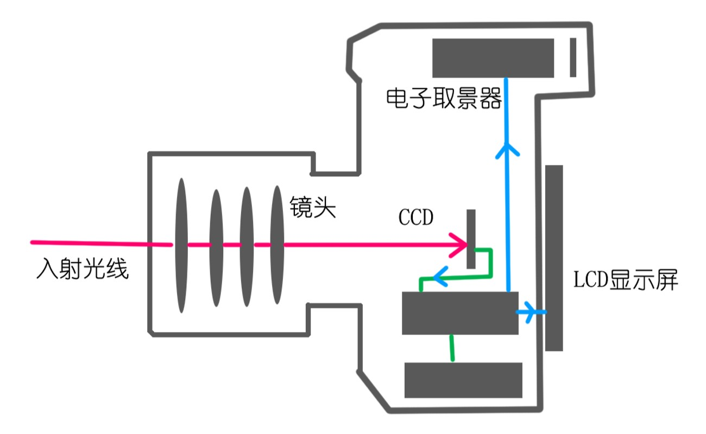
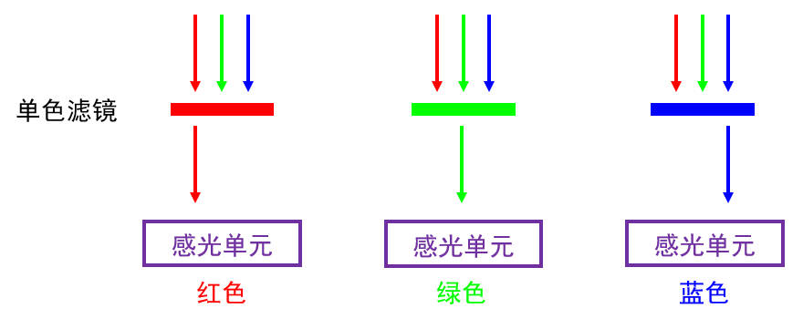
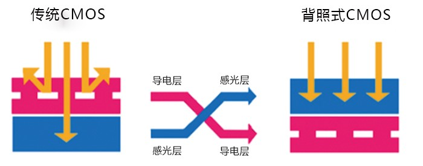
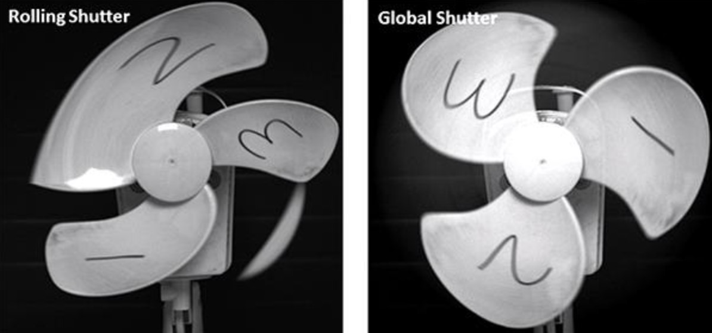

# 照相机结构
<!-- TODO -->

进入数码时代后，尤其是近20几年，随着电子技术进步，取景方式发生了本质变化——光线不再靠反光镜反射，而是直接照射在CCD（或CMOS）传感器上，把外界影像传输到相机背面的液晶屏上，这样的方式称之为电子取景。无反的定义——没有反光镜进行反射，直接在液晶屏上取景。这种无需反射光线取景相机，简称为无反。

单电：原来，早期研发无反相机的厂商有奥林巴斯、松下、索尼等。最先是奥林巴斯和松下共同研发出来第一款采用电子取景（或称屏幕实时取景）的数码相机。为了和单反相机（单镜头反光式取景）区別，就取名为“单镜头电子取景照相机”—— 简称单电（无反光板、电子取最器、可换镜头）。

微单：后来索尼也推出了这样的单电相机，并大规模进军无反相机领域。于是，索尼在中国大陆地区注册了“微单”这个商标，成了索尼的专利词汇。因此，“微单＂这个词，特指索尼的单电相机（或无反相机），其他厂商不得使用。

综上，取景方式是划分相机类型的主要方式，按这种方式划分有两类相机：单反相机和无反相机。无反相机的发展变演出多种俗称，也就有了微单、单电这些叫法。当然，在早期，和单反同时代，还有一种双镜头反射相机——双反相机，以及一种光轴侧旁平行取景相机——旁轴相机。这二者在主流市场已经很少了，大多是当古董收藏或情怀玩具。

# 图像传感器
## 简介
光电效应(Photoelectric Effect)是指光线照射物体时，使物体发射出电子的物理现象，该现象由海因里希・赫兹于1887年首次发现，并由阿尔伯特・爱因斯坦于1905年通过实验验证。人们将多个能够产生光电效应的半导体单元封装在一起，组成了图像传感器(Image Sensor)。

图像传感器采集影像的过程如下文列表所示：

1. 复位：所有光电二极管中的电荷量被调整至同一水平，与基准电压对齐。
2. 曝光：光电二极管持续接收光子，亮度在曝光时长内不断地积分。
3. 读出：驱动电路测量光电二极管在曝光时长内累积的电荷量，将其转换为电压，以供后级电路存储或显示。

常见的图像传感器分为CCD(Charged Couple Device)和CMOS(Complementary Metal-Oxide-Semiconductor)两种技术类型，二者存在许多相似之处，它们的结构如下文图片所示：

CCD的每个像素都是一个光电二极管，放大器、A/D转换器在外围电路中，读出阶段整行电荷统一经过放大器与A/D转换器，当所有行均被读出后，数据采集完毕。主流的CCD制造厂商有：索尼、安森美、松下。

CMOS的成像过程与CCD相同，但每个像素都集成了光电二极管、放大器、A/D转换器、缓存等组件，在像素内部即可完成光信号到电信号的转换，直接向后级电路输出电信号。主流的CMOS制造厂商有：索尼、三星、豪威、格科微、思特威、安森美。

CCD是最早被广泛应用的图像传感器，但其具有成本高、功耗高、体积较大（依赖外围电路）、读出速度较慢（共享A/D转换器等模块，需要串行处理。）等缺点；随着CMOS制造工艺的逐渐成熟，目前CCD在民用领域已被CMOS取代。由于CCD的所有像素共享放大器、A/D转换器等模块，受到随机噪声的影响比CMOS更小，并且天然支持全局快门，画面一致性更好，在天文、工业等领域仍比CMOS具有一定的优势。

## 采集灰度图像
以CMOS传感器为例，下文图片展示了图像数字化的过程：

图像传感器采集灰度图像的过程如下文列表所示：

1. 感光：
2. 量化：
3. 存储：
4. 解析：

光电二极管受到光线照射后将产生亮度信号，该信号依次经过放大器、

接着ADC将电压信号转换为数字信号，后级电路便可以将数字信号记录在文件中。

## 采集彩色图像
在前文章节中，我们已经知悉图像传感器采集灰度图像的过程，

一种解决方案是照相机内置三个图像传感器，分别记录红、绿、蓝三种颜色，然后再将这三个值合并。这种方法能产生最准确的颜色信息，但是成本太高，无法投入实用。

下文图片展示了一些常见的CFA排列方式：

下文图片展示了一些常见的CFA排列方式：

- Mono : 灰度，传感器直接接受所有光线，无CFA，它不能分辨色彩。彩色滤光片不仅会过滤其他色彩的光纤，也会导致自身色彩对应的光线被过滤一部分，降低弱光灵敏度。因此在某些无需分辨颜色的场合（例如：驾驶员状态检测、工业机器人等），无CFA的传感器更为实用。部分照相机也采用了无CFA，可以为艺术家提供更高对比度的灰度图像创作，例如：徕卡M11 Monochrom。

- Bayer :
1974年，柯达公司的工程师Bryce Bayer提出了一个全新方案，只用一块图像传感器，在图像传感器前面，设置一层彩色滤光片阵列（Color Filter Array，CFA），他并没有在每个pixel上放三个颜色的滤镜，而是有间隔的在每个pixel上放置单一颜色的滤镜。 这样以来，每个通道能得到一个部分值空缺的图片，这些空缺的值可以通过各种插值手段进行填充。

从最开始的那张图可以看出，上述的bayer阵列是2×2的四个格子重复形成的，这四个格子有1个R，1个B，2个G，这是因为人眼视觉对于绿色比较敏感的缘故。

以CMOS传感器为例，下文图片展示了彩色图像数字化的过程：

每个像素只能感应一种颜色的光，但是我对外输出的时候，需要知道这个像素的rgb值，我就只能通过周围像素去计算，这个计算和转换是靠ISP去完成的。进从而得出我这个像素的RGB的值，这样我每个像素虽然只感应了一种光，但是每个像素经过处理后传输到外面后就是有RGB的信息了。这些原始的感光数据成为RAW data。

RAW是传感器原始数据的统称，实际上各个厂家采用的格式并不相同，每种RAW数据必须使用对应的算法解码才能形成人类可识别的图像。

## 传感器尺寸

1、传感器尺寸：图像传感器的尺寸越大，则成像系统的尺寸越大，捕获的光子越多，感光性能越好，信噪比越低。目前CMOS图像传感器的常见尺寸有1、2/3、1/2、1/3、1/4英寸等。
2、像素总数和有效像素数：像素总数是指所有像素的总和，像素总数是衡量CMOS图像传感器的主要技术指标之一。CMOS图像传感器的总体像素中被用来进行有效的光电转换并输出图像信号的像素为有效像素。显而易见，有效像素总数隶属于像素总数集合。有效像素数目直接决定了CMOS图像传感器的能力。

## 传感器类型
FSI：前照式, 光是从前面的金属控制线之间进入，然后再聚焦在光电检测器上。
BSI：背照式 Back-illuminated，光线无需穿过金属互连层,优势大，比较有前景。
BSI在低照条件下的成像亮度和清晰度都比FSI有更大的优势。
传统的CMOS图像传感器是前照式结构的，自上而下分别是透镜层、滤色片层、线路层、感光元件层。采取这个结构时，光线到达感光元件层时必须经过线路层的开口，这里易造成光线损失。
而背照式把感光元件层换到线路层的上面，感光层只保留了感光元件的部分逻辑电路，这样使光线更加直接的进入感光元件层，减少了光线损失，比如光线反射等。因此在同一单位时间内，单像素能获取的光能量更大，对画质有明显的提升。不过该结构的芯片生产工艺难度加大，良率下降，成本相对高一点。
堆栈式（stack）：堆栈式是在背照式上的一种改良，是将所有的线路层挪到感光元件的底层，使开口面积得以最大化，同时缩小了芯片的整体面积。对产品小型化有帮助。另外，感光元件周边的逻辑电路移到底部之后，理论上看逻辑电路对感光元件产生的效果影响就更小，电路噪声抑制得以优化，整体效果应该更优。业内的朋友应该了解相同像素的堆栈式芯片的物理尺寸是比背照式芯片的要小的。但堆栈式的生产工艺更大，良率更低，成本更高。索尼的IMX214（堆栈式）和IMX135（背照式）或许很能说明上述问题。

# 快门系统
## 传感器读出方式
Global Shutter（全局快门）与Rolling Shutter（卷帘快门）对应全局曝光和卷帘曝光模式。卷帘快门逐行曝光的方式，全局快门是全部像素同时曝光，所以全局快门能够拍运动的物体而不产生形变，因为全局快门在每一个像素上添加了一个存储单元

过去，CMOS传感器一次只能启动和停止一行像素的曝光，这被称为卷帘快门。随着时间的推移，这种情况发生了变化，现在市场上有许多全局快门CMOS传感器可用。CMOS传感器为每个像素 列使用较小的ADC（下图红框），从而提供比CCD高的帧速率。多年来，CMOS传感器经历了重大改进，使大多数现代CMOS传感器在图像质量，图像速度和总体价值方面均与CCD相同或更高。CCD的特点有：1. 全局快门和卷帘快门，2. 非常低的噪音，3. 很高的动态范围，4. 很高的帧频，5. No smearing 

    
    &nbsp;&nbsp;&nbsp;&nbsp;
    

和机械式焦平面快门一样，卷帘快门对高速运动的物体会产生明显的变形。而且因为其扫描速度比机械式焦平面快门慢，变形会更加明显。例如如果数据的读出速度是每秒20帧，那么图像顶部和底部的曝光先后差异将多达50毫秒。

## 物理结构
全称应该是电子操控纵走焦平面快门

这个词汇有三层意思：

1、焦平面快门。相机的快门主要有两种：

一种叫镜间快门，它是设计安装在镜头中间的，所以叫做镜间快门

，它一般是由3-5片钢片组成，象过去的120相机基本都是这类。

另一种叫焦平面快门，它安装的位置就在胶卷（CCD）前面，这个位置基本就是聚焦的平面附近，所以叫焦平面快门，这是和镜间快门以资区别。

2、纵走焦平面快门，焦平面快门运动的方向有两种：左右和上下，早期的焦平面快门

是涂胶的绸布制成，所以又叫帘布快门，因为帘布要卷起来使用，这时是用左右各有一个轴来卷它，因此运动方向是左右（横向），后来不用帘布了，用钢片制成，当时又叫钢片快门。

我们知道，135胶卷的幅面为36*24mm，横向是36mm，纵向为24mm,为了提高快门速度

，纵向的距离短，这时钢片快门就设计成上下运动，这时我们称呼它叫纵走焦平面快门。

3、电子操（作）控（制）这个层面我就不用解释了，那就是快门的运动是受电子的元件来控制的。

什么叫电子操控纵走焦平面快门大概的意思就是这样。机械快门
顾名思义就是以机械能控制的快门。

## 镜间快门
<!--  -->

# 镜头系统

# 曝光要素

## 光圈

## 快门速度

## 感光度

