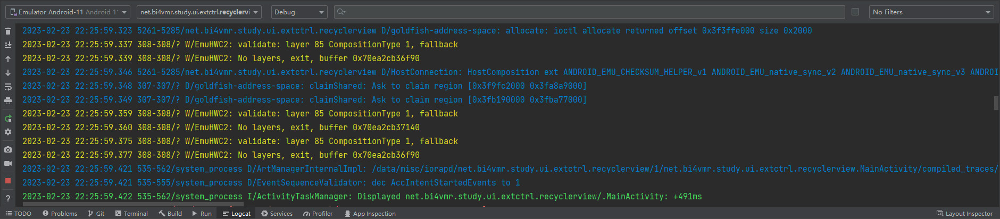

# 简介
Logcat是系统内置的日志信息工具，可以查看系统输出的日志信息。

# 查看日志
我们可以在Android Studio中查看虚拟机或实体机输出的日志信息：



日志信息按重要程度从低到高分为Verbose、Debug、Info、Warn、Error和Assert，当我们选择某个级别时，将会筛选出本级别及以上的信息。

# 输出日志
我们可以在应用程序的Java代码中输出日志以便进行调试。使用日志时，需要先导入android.util.Log包，然后调用Log类中的静态方法输出日志。日志的基本格式分为两部分，第一部分为标签(Tag)，便于检索信息；第二部分为消息的内容。

```java
// 输出Verbose级别日志
Log.v("Test", "Verbose");
//输出Debug级别日志
Log.d("Test", "Debug");
//输出Info级别日志
Log.i("Test", "Info");
//输出Warn级别日志
Log.w("Test", "Warn");
//输出Error级别日志
Log.e("Test", "Error");
```
