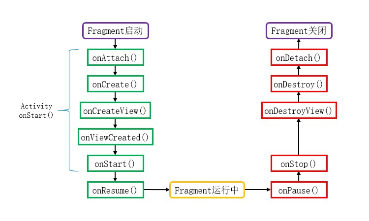
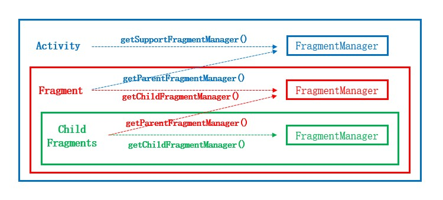

# 概述
Fragment是一种视图组件，它拥有自己的生命周期，我们可以将复杂的Activity功能拆分为多个Fragment，进行模块化管理，避免单一Activity的代码过于臃肿，提高代码复用程度。

Fragment不能单独存在，需要依附于Activity或者其它Fragment。当Activity的生命周期达到STARTED状态及以上时，我们可以动态地添加、替换或移除其中的Fragment，使得页面展示更为灵活。

# 基本应用
## 创建Fragment
Fragment与Activity类似，我们可以使用XML文件描述其布局，并在逻辑代码中进行加载与控制。

此处我们创建一个简单的布局，其中有一个居中放置的文本框。

fragment_test.xml:

```xml
<?xml version="1.0" encoding="utf-8"?>
<LinearLayout xmlns:android="http://schemas.android.com/apk/res/android"
    android:layout_width="match_parent"
    android:layout_height="match_parent"
    android:background="#0FF"
    android:gravity="center">

    <TextView
        android:id="@+id/tvContent"
        android:layout_width="wrap_content"
        android:layout_height="wrap_content"
        android:textSize="20sp" />
</LinearLayout>
```

然后编写TestFragment类，在生命周期方法 `onCreateView()` 中将XML渲染为视图实例，并设置文本框的内容。

TestFragment.java:

```java
public class TestFragment extends Fragment {

    @Override
    public View onCreateView(LayoutInflater inflater, ViewGroup container, Bundle savedInstanceState) {
        // 将XML渲染为View实例
        View view = inflater.inflate(R.layout.fragment_test, container, false);
        // 初始化View中的控件
        TextView tv = view.findViewById(R.id.tvContent);
        tv.setText("TestFragment");
        // 返回View实例
        return view;
    }
}
```

用户自行编写的Fragment应继承系统提供的Fragment类，SDK中存在"android.app.Fragment"和"androidx.fragment.app.Fragment"两个包，"android"包中的Fragment类已经被弃用，我们应该使用"androidx"包中的类。

我们在Fragment中重写了 `onCreateView()` 方法，通过LayoutInflater将布局文件渲染成View对象，并将此对象返回给系统。此处的 `inflate()` 方法第三个参数必须为"false"，因为系统创建View之后会自动将其添加到容器"container"中，如果此处填写"true"，将会导致View对象被重复添加而抛出IllegalStateException。

## 使用Fragment
我们可以将Fragment嵌入到其它布局文件的指定位置，也可以使用逻辑代码动态地将Fragment添加到Activity中。

> ⚠️ 警告
>
> 我们只能在具有Fragment管理能力的Activity中使用Fragment，这种Activity都是FragmentActivity的子类，例如AppCompatActivity。
> 
> 如果我们在不支持Fragment的Activity中使用Fragment，则加载XML时会出现UnsupportedOperationException。

### 静态引用Fragment
在布局XML文件中，我们可以使用 `<fragment>` 标签静态加载Fragment到固定的位置。对于较新的版本，官方推荐使用 `<FragmentContainerView>` 作为Fragment容器。

```xml
<!-- 静态加载Fragment -->
<androidx.fragment.app.FragmentContainerView
    android:id="@+id/container1"
    android:name="net.bi4vmr.study.demo01.TestFragment"
    android:layout_width="match_parent"
    android:layout_height="100dp"
    tools:layout="@layout/fragment_test" />
```

静态加载的Fragment必须设置ID属性，否则程序运行过程中会出现IllegalStateException。`android:name` 属性指明了本容器需要嵌入的Fragment类，需要填写完整的包名。`tools:layout` 属性需填入布局文件的ID，可以在Android Studio的布局预览界面显示目标Fragment，辅助开发者进行布局设计，对程序运行无影响。

Fragment布局文件根元素的宽高属性不能传递给引用者，因此引用Fragment的容器需要明确设置宽高数值或使用"match_parent"，若设置为"wrap_content"等同于"0dp"。

### 动态添加Fragment
我们可以在逻辑代码中动态添加、移除Fragment，这给程序界面设计带来了灵活性。为了嵌入Fragment，我们需要在布局文件中预先准备一个容器，容器类型可以是FragmentContainerView或FrameLayout等，目前官方推荐使用FragmentContainerView。

```xml
<!-- 动态加载Fragment -->
<androidx.fragment.app.FragmentContainerView
    android:id="@+id/container2"
    android:layout_width="match_parent"
    android:layout_height="100dp"
    android:layout_marginTop="10dp" />
```

在Activity中，我们首先需要获取FragmentManager对象，然后操纵Fragment事务，向容器"container2"中添加TestFragment。

```java
// 获取FragmentManager实例
FragmentManager manager = getSupportFragmentManager();
// 获取Fragment事务实例
FragmentTransaction transaction = manager.beginTransaction();
// 添加Fragment
transaction.add(R.id.container2, new TestFragment());
// 提交事务
transaction.commit();
```

FragmentTransaction的 `add()` 方法用于向容器中添加Fragment，第一个参数为目标容器的ID，第二个参数为Fragment实例。

FragmentTransaction的 `commit()` 方法用于提交Fragment事务到主进程，Fragment操作默认是在队列中执行的，这意味着 `commit()` 动作可能不会立刻得到调度。

此时运行示例程序，查看加载了TestFragment的界面：

<div align="center">

**添加图片添加图片添加图片添加图片添加图片添加图片**

</div>

此时静态加载与动态加载的Fragment均呈现在屏幕上。

# 初始参数传递
如果Fragment需要一些初始化信息，我们不能通过构造方法直接传参，因为当屏幕方向改变或类似原因导致Fragment重建时，系统只会调用默认构造方法，然后执行 `onAttach()` 、 `onCreate()` 等生命周期方法，先前通过含参构造方法传入的参数则会丢失。

正确的传参方法是将数据存入Bundle对象，并使用Fragment的 `setArguments()` 方法传参，Fragment的默认构造方法应当留空，并且我们不应当再定义其他含参构造方法。

```java
public class TestFragment extends Fragment {

    private static final String PARAM_TEXTINFO = "TEXTINFO";
    private String textInfo;

    // 创建Fragment实例的方法，在此处理初始化参数。
    public static TestFragment newInstance(String textInfo) {
        TestFragment fragment = new TestFragment();
        // 将外部参数封装至Bundle
        Bundle args = new Bundle();
        args.putString(PARAM_TEXTINFO, textInfo);
        // 向Fragment传入Bundle
        fragment.setArguments(args);
        return fragment;
    }

    @Override
    public void onAttach(@NonNull Context context) {
        super.onAttach(context);
        // 从Fragment中获取Bundle对象
        Bundle args = getArguments();
        if (args != null) {
            // 从Bundle中取出参数
            textInfo = args.getString(PARAM_TEXTINFO);
        }
    }

    @SuppressLint("SetTextI18n")
    @Override
    public View onCreateView(LayoutInflater inflater, ViewGroup container, Bundle savedInstanceState) {
        View view = inflater.inflate(R.layout.fragment_test, container, false);
        TextView tv = view.findViewById(R.id.tvContent);
        tv.setText(textInfo);
        return view;
    }
}
```

上述示例代码中，我们通过 `newInstance()` 方法将参数封装进Bundle，并通过 `setArguments()` 方法保存参数，在Fragment的生命周期方法 `onAttach()` 中，我们使用 `getArguments()` 将Bundle取出，保存至全局变量中以便后续使用。

当我们需要使用TestFragment时，就可以调用 `newInstance()` 方法新建实例。

```java
// 使用"newInstance()"方法创建Fragment实例
TestFragment fragment = TestFragment.newInstance("初始参数");
```

当这种方式创建的TestFragment实例被添加到界面上时，其内部能够获取到我们传入的初始化参数，文本框内容将会显示为“初始参数”。

# 生命周期
## 简介
scccccccccccccccccccccccccccccccc


## 状态机
<!-- Activity共有四种状态机。 -->
<!-- 
🔷 `Running`
<br />
Activity位于Task栈顶时的状态，此时界面在前台面向用户服务，通常资源不会被系统回收。

🔷 `Paused`
<br />
当Activity被其它非全屏UI组件覆盖时的状态，此时部分界面仍然可见，系统仅在资源非常紧张时才可能回收其资源。

🔷 `Stopped`
<br />
当Activity被覆盖且完全不可见时的状态，系统会为其保持视图状态，但资源不足时有较大概率被回收。

🔷 `Destroyed`
<br />
当Activity从Task出栈时就会进入销毁状态，意味着此组件不再被用户需要，系统会优先回收这部分资源。 -->

## 回调方法
Activity类提供了七个生命周期回调方法，它们之间的关系如下图所示：

<div align="center">



</div>

🔶 `void onAttach(Context context)`
<br />
当Fragment和Activity相关联时调用。

🔶 `void onCreate(Bundle savedInstanceState)`
<br />
Fragment被创建时调用。

🔶 `View onCreateView(LayoutInflater inflater, ViewGroup container, Bundle savedInstanceState)`
<br />
创建Fragment的布局。

🔶 `void onViewCreated(View view, Bundle savedInstanceState)`
<br />
当Activity完成onCreate()时调用。

🔶 `void onStart()`
<br />
当Fragment可见时调用。

🔶 `void onResume()`
<br />
当Fragment可见且可交互时调用。

🔶 `void onPause()`
<br />
当Fragment不可交互但可见时调用。

🔶 `void onStop()`
<br />
当Fragment不可见时调用。

🔶 `void onDestroyView()`
<br />
当Fragment的UI从视图结构中移除时调用。

🔶 `void onDestroy()`
<br />
销毁Fragment时调用。

🔶 `void onDetach()`
<br />
当Fragment和Activity解除关联时调用。

# 管理Fragment
## FragmentManager
FragmentManager类负责对页面中的Fragment执行管理操作，例如添加、移除或替换，以及维护Fragment的回退栈。

Activity与Fragment都有自己的FragmentManager，我们可以在各组件中使用合适的方法获取FragmentManager实例。

<div align="center">



</div>

在FragmentActivity及其子类中，我们可以通过 `getSupportFragmentManager()` 方法获取Activity级别的FragmentManager，以便管理页面上的Fragment。

在Fragment中，我们可以通过 `getChildFragmentManager()` 方法获取当前Fragment级别的FragmentManager。Fragment需要嵌入在Activity或另一个Fragment中使用，我们可以通过 `getParentFragmentManager()` 方法获取其父级的FragmentManager。

FragmentManager拥有以下常用方法，用于获取当前界面中的Fragment实例：

🔷 `Fragment findFragmentById(int id)`
<br />
根据控件ID查找Fragment实例，未找到时将返回空值。

此方法通常用于获取布局文件中静态引入的Fragment。

🔷 `Fragment findFragmentByTag(String tag)`
<br />
根据Tag查找Fragment实例，未找到时将返回空值。

Tag是我们为Fragment设置的属性，用于给特定类型的Fragment做标记，以便通过此方法获取这种实例。多个Fragment实例可能拥有相同的Tag，该方法将会优先返回较新的Fragment实例。

🔷 `List<Fragment> getFragments()`
<br />
获取当前页面中的所有Fragment实例，没有实例时将返回空列表。

## FragmentTransaction
<!-- FragmentManager的新增、删除、替换操作需要通过FragmentTransaction实现，FragmentTransaction中可以记录多个操作，

`add()` 系列方法

此类方法会将Fragment实例添加到目标容器中，

add(int containerViewId, Fragment fragment, String tag)：将一个Fragment实例添加到Activity的最上层 。

remove(Fragment fragment)：将一个Fragment实例从Activity的Fragment队列中删除。

replace(int containerViewId, Fragment fragment)：替换containerViewId中的Fragment实例。注意，它首先把containerViewId中所有Fagment删除，然后再add进去当前的Fragment 实例。

hide(Fragment fragment)：隐藏当前的Fragment，仅仅是设为不可见，并不会销毁。

show(Fragment fragment)：显示之前隐藏的Fragment。

detach(Fragment fragment)：会将view从UI中移除，和remove()不同，此时Fragment的状态依然由FragmentManager维护。

attach(Fragment fragment)：重建view视图，附加到UI上并显示。

commit()：提交一个事务。 -->

## 回退栈
<!-- TODO -->

Fragment的回退栈与Activity的回退栈有相似之处，但操作对象不同。Activity的回退栈中记录的是Activity实例，每次出栈的操作对象也是单个Activity；而Fragment回退栈中记录的是Fragment事务，这意味着每次操作的对象可能是多个Fragment。

### 入栈操作
当我们希望一个FragmentTransaction操作被回退栈记录时，可以在事务提交前调用 `void addToBackStack(String name)` 方法，以便后续进行逆向操作。

该方法的参数"name"是事务执行后状态的别名，后续出栈时可以通过该别名进行定位，快速回退到该事务状态。如果我们只需要依次逐级回退，此参数可以传入"null"。

> ⚠️ 警告
>
> 空字符串("")是一个有效的别名，它与空值("null")的含义不同，虽然这两个值在Dump命令输出格式中看起来是一样的。

每个事务中的操作都是一个整体，因此我们只能为事务设置唯一的别名。如果我们在一次事务中多次调用该方法，以最后设置的别名为准。

此处我们使用下文的示例代码构造测试用例，演示回退栈的相关方法。

```java
// 初始化FragmentManager
FragmentManager fragmentManager = getSupportFragmentManager();
// 构造测试数据
fragmentManager.beginTransaction()
        .add(R.id.container, TestFragment.newInstance(genRandomID()))
        .addToBackStack(null)
        .commit();
fragmentManager.beginTransaction()
        .add(R.id.container, TestFragment.newInstance(genRandomID()))
        .addToBackStack("StateA")
        .commit();
fragmentManager.beginTransaction()
        .add(R.id.container, TestFragment.newInstance(genRandomID()))
        .add(R.id.container, TestFragment.newInstance(genRandomID()))
        .addToBackStack("StateB")
        .commit();
fragmentManager.beginTransaction()
        .add(R.id.container, TestFragment.newInstance(genRandomID()))
        .addToBackStack("StateB")
        .commit();
fragmentManager.beginTransaction()
        .add(R.id.container, TestFragment.newInstance(genRandomID()))
        .add(R.id.container, TestFragment.newInstance(genRandomID()))
        .addToBackStack("StateA")
        .commit();
```

当程序运行后，我们可以使用ADB命令 `dumpsys activity fragment` 查看当前的返回栈状态：

```text
Back Stack:
  #0: BackStackEntry{12b6a80 #0}
    Operations:
      Op #0: ADD TestFragment{e1e3b49} (94bfe441-dacb-4f26-8669-97bb31476050 id=0x7f08008c)
  #1: BackStackEntry{8ef88b9 #1 StateA}
    Operations:
      Op #0: ADD TestFragment{168958b} (483c898d-bf21-4d72-b3cc-fda5cf9f106d id=0x7f08008c)
  #2: BackStackEntry{1bbc4fe #2 StateB}
    Operations:
      Op #0: ADD TestFragment{892ae7c} (7aec11b5-01c7-42d2-a8e6-88765f412a4e id=0x7f08008c)
      Op #1: ADD TestFragment{b7e7202} (a5916cb0-224a-4b9a-9217-1fba899fee3e id=0x7f08008c)
  #3: BackStackEntry{d6c745f #3 StateB}
    Operations:
      Op #0: ADD TestFragment{1ecdbd} (d4d72a5c-4092-4886-ac68-c67613728c8a id=0x7f08008c)
  #4: BackStackEntry{31caeac #4 StateA}
    Operations:
      Op #0: ADD TestFragment{dd83b11} (9503288d-0375-430c-95e1-d9131c157e14 id=0x7f08008c)
      Op #1: ADD TestFragment{8a6f726} (176dc82a-4a47-4039-b15f-e304a92acd48 id=0x7f08008c)
```

## 出栈方法
当我们需要在代码中控制页面返回时，可以使用以下方法：

🔷 `void popBackStack()`
<br />
该方法使当前栈顶的事务反转。

该方法不是同步方法，只会将操作加入FragmentManager队列中等待执行。

在前文示例中，我们连续调用两次该方法，然后使用ADB命令 `dumpsys activity fragment` 查看回退栈状态：

```text
Back Stack:
  #0: BackStackEntry{12b6a80 #0}
    mName=null mIndex=0 mCommitted=true
    Operations:
      Op #0: ADD TestFragment{e1e3b49} (94bfe441-dacb-4f26-8669-97bb31476050 id=0x7f08008c)
  #1: BackStackEntry{8ef88b9 #1 StateA}
    mName=StateA mIndex=1 mCommitted=true
    Operations:
      Op #0: ADD TestFragment{168958b} (483c898d-bf21-4d72-b3cc-fda5cf9f106d id=0x7f08008c)
  #2: BackStackEntry{1bbc4fe #2 StateB}
    mName=StateB mIndex=2 mCommitted=true
    Operations:
      Op #0: ADD TestFragment{892ae7c} (7aec11b5-01c7-42d2-a8e6-88765f412a4e id=0x7f08008c)
      Op #1: ADD TestFragment{b7e7202} (a5916cb0-224a-4b9a-9217-1fba899fee3e id=0x7f08008c)
```

第一次回退使4号事务反转，其中的两个Fragment都被系统从容器中移除了；第二次回退使3号事务反转，最后栈中剩下0、1、2号事务。

🔷 `void popBackStack(String name, int flags)`
<br />
该方法使指定别名事务及其顶部的事务反转。

参数"name"表示事务状态的别名；参数"flags"可取值为"0"和"1"，且两个值互斥，其中"1"等同于FragmentManager的常量"POP_BACK_STACK_INCLUSIVE"。

当"name"为"null"时，如果标志位为"0"，则使当前栈顶的事务反转，相当于无参的 `popBackStack()` 方法；如果标志位为"1"，则使栈内的所有事务反转，清空所有Fragment。

当"name"不为"null"时，从栈顶至栈底查找别名与"name"相同的事务状态；未找到同名状态则终止操作，若找到同名状态则将该状态顶部的所有事务反转，然后终止操作，不再继续向下查找。标志位决定是否包括"name"指定的事务本身，设为"0"时不反转该事务；设为"1"时将该事务与其顶部的其他事务一并反转。

在前文示例的初始状态，如果我们调用 `popBackStack("StateA", 0)` 方法，则页面不会发生变化，因为StateA已经在栈顶了，标志位含义为“不包括StateA”。

如果我们调用一次 `popBackStack("StateA", 1)` 方法，则4号事务被反转，最顶部的两个Fragment出栈销毁。此时返回栈的状态如下文所示：

```text
Back Stack:
  #0: BackStackEntry{12b6a80 #0}
    Operations:
      Op #0: ADD TestFragment{e1e3b49} (94bfe441-dacb-4f26-8669-97bb31476050 id=0x7f08008c)
  #1: BackStackEntry{8ef88b9 #1 StateA}
    Operations:
      Op #0: ADD TestFragment{168958b} (483c898d-bf21-4d72-b3cc-fda5cf9f106d id=0x7f08008c)
  #2: BackStackEntry{1bbc4fe #2 StateB}
    Operations:
      Op #0: ADD TestFragment{892ae7c} (7aec11b5-01c7-42d2-a8e6-88765f412a4e id=0x7f08008c)
      Op #1: ADD TestFragment{b7e7202} (a5916cb0-224a-4b9a-9217-1fba899fee3e id=0x7f08008c)
  #3: BackStackEntry{d6c745f #3 StateB}
    Operations:
      Op #0: ADD TestFragment{1ecdbd} (d4d72a5c-4092-4886-ac68-c67613728c8a id=0x7f08008c)
```

此时我们再调用一次 `popBackStack("StateA", 1)` 方法，则1、2、3号事务均被反转，栈中只剩下0号事务。

重新加载测试用例后，我们调用一次 `popBackStack("StateB", 1)` 方法，会发现2、3、4号事务都被反转了，这说明连续的同名事务会被一次性全部反转，而前文示例则说明不连续的同名事务不会被一次性反转，每次调用只会匹配靠近栈顶的一条。

# 获取并使用Context
我们有时需要在Fragment中初始化Service、显示Dialog、弹出Toast消息等，因此Fragment提供了若干方法以便我们获取Context。

🔷 `getActivity()`
<br />
获取当前Fragment所关联的Activity，若关联已解除，则返回空值。

🔷 `getContext()`
<br />
获取当前Fragment所关联的Context，若关联已解除，则返回空值。

🔷 `requireActivity()`
<br />
获取当前Fragment所关联的Activity，若关联已解除，则抛出异常。

🔷 `requireContext()`
<br />
获取当前Fragment所关联的Context，若关联已解除，则抛出异常。

Fragment本身不是Context，它需要依附于Activity或其他Context。通常情况下Fragment的父容器是Activity，此时两种方法是相同的；如果父容器不是Activity，我们只能使用名称含有"Context"的方法。

当Context不存在时，"get"方法将返回空值，而"require"方法将抛出异常。"get"方法适用于可选操作，没有Context时可以忽略本次操作；"require"方法适用于必选操作，没有Context时抛出异常暴露问题，以便开发者进行后续处理。我们应当根据业务类型进行选择，不应该无视实际需要使用"get"方法与空值判断掩盖问题。

当我们在异步回调中使用上述方法时，一定要注意空值的判断与异常处理。

对于Service、Toast等不依赖Theme的对象，我们可以在Fragment的 `void onAttach(Context context)` 生命周期中提前创建；对于Dialog等依赖Theme的对象，我们可以在Fragment的 `onCreate()` 等方法中使用 `requireActivity()` 提前创建，这些时刻Context必然是存在的，当异步方法返回时可以直接显示Dialog或Toast。对于必须在异步方法中使用Context的场景，我们可以使用 `getContext()` 方法并进行空值判断，若无Context对象则不再继续操作。

下文将以实际场景展示获取Context的正确方法。

我们在一个可被关闭的Fragment中执行联网获取数据的操作，当结果返回时显示Toast告知用户。

以下是一种错误示范：

```java
@Override
public View onCreateView(LayoutInflater inflater, ViewGroup container, Bundle savedInstanceState) {

    /* 省略部分代码 */

    Handler handler = new Handler(Looper.getMainLooper());
    // 延时5秒执行，模拟耗时操作。
    handler.postDelayed(() -> {
        // 获取Context
        Context ctx = requireContext();
        // 显示Toast
        Toast.makeText(ctx, "Test", Toast.LENGTH_SHORT)
                .show();
    }, 5000L);

    return view;
}
```

上述示例代码中，当Fragment显示5秒后回调方法被执行，若此时Fragment已经被用户关闭（从Activity中分离）， `requireContext()` 方法就会导致异常："IllegalStateException: Fragment not attached to a context."，现象为应用程序突然无故关闭。

对于上述情况，我们应当在 `onCreateView()` 方法中提前初始化Toast，此时Context是存在的，不会出现异常。当回调方法触发时，再调用 `show()` 方法显示Toast即可。

```java
@Override
public View onCreateView(LayoutInflater inflater, ViewGroup container, Bundle savedInstanceState) {

    /* 省略部分代码 */

    // 获取Context
    Context ctx = requireContext();
    // 初始化Toast，但先不进行显示。
    Toast toast = Toast.makeText(ctx, "Test", Toast.LENGTH_SHORT);

    Handler handler = new Handler(Looper.getMainLooper());
    // 延时5秒执行，模拟耗时操作。
    handler.postDelayed(() -> {
        // 异步方法触发，显示Toast。
        toast.show();
    }, 5000L);

    return view;
}
```

# 疑难解答
## 索引

<div align="center">

|       序号        |                                       摘要                                        |
| :---------------: | :-------------------------------------------------------------------------------: |
| [案例一](#案例一) | 当我们使用 `requireContext()` 时，应用程序闪退，并抛出IllegalStateException异常。 |

</div>

## 案例一
### 问题描述
当我们使用 `requireContext()` 时，应用程序闪退，并抛出IllegalStateException异常。

虽然 `requireContext()` 方法的返回值必不为空，但这是有条件的，条件不满足时程序仍然会出现异常。

### 问题分析
详见相关章节： [🧭 获取并使用Context](#获取并使用Context) 。

### 解决方案
详见相关章节： [🧭 获取并使用Context](#获取并使用Context) 。
