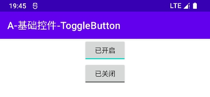

# 概述
ToggleButton是一个自锁按钮，它拥有两种状态：“选中”和“未选中”，用户点击按钮后不会立即弹起，而是保持选中状态，直到再次被点击才会转换为未选中状态。

# 基本应用
ToggleButton在XML文件中的典型配置如下：

```xml
<ToggleButton
    android:id="@+id/button"
    android:layout_width="wrap_content"
    android:layout_height="wrap_content"
    android:textOff="已关闭"
    android:textOn="已开启" />
```

显示效果：

<div align="center">



</div>

# 常用属性
🔷 `android:textOn="[文本]"`
<br />
设置按钮在选中状态的文字，默认为"ON"。

🔷 `android:textOff="[文本]"`
<br />
设置按钮在未选中状态的文字，默认为"OFF"。

🔷 `android:checked="[true|false]"`
<br />
设置按钮的初始状态，默认为“未选中”。

# 常用方法
🔶 `boolean isChecked()`
<br />
获取当前按钮的选中状态。

🔶 `void setChecked(boolean state)`
<br />
设置按钮的选中状态。

🔶 `void toggle()`
<br />
反转当前选中状态。

# 监听器
## OnCheckedChangeListener
ToggleButton的状态发生改变时，将会触发监听器OnCheckedChangeListener，此监听器仅有一个回调方法，参数含义见下文的代码片段。

```java
ToggleButton button = findViewById(R.id.button);
button.setOnCheckedChangeListener(new CompoundButton.OnCheckedChangeListener() {

    /**
     * “选中状态改变”回调方法
     *
     * 当按钮的选中事件发生改变时，此回调被触发。
     *
     * @param buttonView 事件源。
     * @param isChecked 布尔值，表示按钮当前的选中状态。
     */
    @Override
    public void onCheckedChanged(CompoundButton buttonView, boolean isChecked) {
        Log.d("Test", "按钮当前的选中状态：" + isChecked);
    }
});
```
