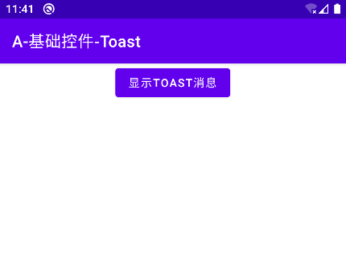

# 概述
Toast是一种提示信息展示组件，它会以浮动文字的方式出现在屏幕底部，若干秒后自行消失。我们通常使用Toast向用户展示网络未连接、操作成功、操作失败等状态信息。

# 基本应用
Toast类提供了静态方法 `makeText()` 用于构造实例，我们构造实例后再调用 `show()` 方法即可显示提示信息。

此处我们通过点击按钮触发操作，创建并显示一条Toast信息。

```java
Button bt01 = findViewById(R.id.btShow);
bt01.setOnClickListener(v -> {
    // 构造Toast实例
    Toast.makeText(getApplicationContext(), "Text", Toast.LENGTH_SHORT)
            // 显示Toast
            .show();
});
```

`makeText()` 方法的第一个参数是Context实例；第二个参数是要显示的内容，可以传入字符串或资源ID；第三个参数是显示持续时间，取Toast.LENGTH_SHORT时为2秒，取Toast.LENGTH_LONG时为3.5秒，不能填入其它数值。

显示效果：

<div align="center">


</div>

# 自定义样式
系统默认的Toast只能显示文本信息，我们可以对Toast进行自定义设置，修改它的弹出位置与布局。

```java
// 创建Toast实例
Toast toast = Toast.makeText(getApplicationContext(), "My Toast", Toast.LENGTH_LONG);
// 设置Toast相对于屏幕边缘的位置与偏移量
toast.setGravity(Gravity.TOP, 0, 275);

// 获取Toast的布局实例
LinearLayout layout = (LinearLayout) toast.getView();
// 创建ImageView实例
ImageView iv = new ImageView(getApplicationContext());
iv.setImageResource(R.drawable.ic_launcher_foreground);
iv.setBackgroundResource(R.drawable.ic_launcher_background);
// 将ImageView添加到Toast布局中
layout.addView(iv);
// 显示Toast
toast.show();
```

显示效果：

<div align="center">



</div>

# 版本变更
## [Android 11]禁止自定义Toast
自从Android 11开始，官方不再允许开发者更改Toast的位置与样式，只能显示简单的提示信息。

如果我们需要自定义提示信息，应当使用其他控件实现。
