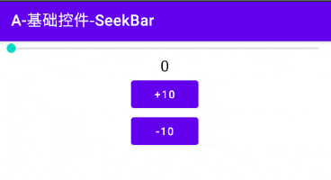

# 简介
SeekBar继承自ProgressBar，它不仅可以指示进度，还拥有一个拖拽柄，用户拖拽该手柄可以设置进度。

# 基本应用
我们首先在Activity的布局文件中放置一个SeekBar控件，并将其最大进度设为"100"。

```xml
<SeekBar
    android:id="@+id/seekbar"
    android:layout_width="match_parent"
    android:layout_height="wrap_content"
    android:max="100" />
```

然后在Activity的 `onCreate()` 方法中注册两个按钮，点击时分别增加或减少SeekBar的进度。

```java
// 点击此按钮进度+10
btIncrease.setOnClickListener(v -> {
    int p = seekBar.getProgress();
    seekBar.setProgress(p + 10);
});

// 点击此按钮进度-10
btDecrease.setOnClickListener(v -> {
    int p = seekBar.getProgress();
    seekBar.setProgress(p - 10);
});
```

我们可以通过SeekBar的 `getProgress()` 方法获取当前进度，并调用 `setProgress()` 方法设置新的进度。

此时我们运行程序，查看显示效果：

<div align="center">



</div>

# 外观定制
## 拖拽手柄
属性 `android:thumb` 用于设置拖拽手柄的样式，SeekBar本身无法调整素材的尺寸。使用Shape XML绘图时，我们可以使用 `<size>` 标签控制尺寸；使用图片素材时，我们可以通过代码调整素材尺寸。

属性 `android:thumbOffset` 用于设置手柄在进度条末端时的偏移量，如果手柄在进度条末端无法完整显示，可以利用此属性进行微调。

<div align="center">


</div>

该属性默认值是手柄宽度的一半，手柄中线与进度条末端重叠；当该值为"0"时，手柄完全在进度条内侧；当该值等于手柄宽度时，手柄完全在进度条外侧。

当我们使用透明图片作为拖拽手柄时，图片边界会有一圈白底，为了实现完全透明的效果，还需要添加属性 `android:splitTrack="false"` 。

当我们按住拖拽手柄时，其周围会产生一圈阴影效果，如果不需要此效果，可以将SeekBar的背景属性设为空，即添加属性： `android:background="@null"` 。

## 进度条
属性 `android:progressDrawable` 用于设置进度条的样式，我们通常使用LayerList绘制背景、第一进度与第二进度的样式，并在此处引用。

```xml
<layer-list xmlns:android="http://schemas.android.com/apk/res/android">
    <!-- 进度条背景 -->
    <item android:id="@android:id/background">
        <shape>
            <solid android:color="#BBB" />
        </shape>
    </item>

    <!-- 第二进度 -->
    <item android:id="@android:id/secondaryProgress">
        <clip>
            <shape>
                <solid android:color="#4B4" />
            </shape>
        </clip>
    </item>

    <!-- 进度 -->
    <item android:id="@android:id/progress">
        <clip>
            <shape>
                <solid android:color="#46F" />
            </shape>
        </clip>
    </item>
</layer-list>
```

属性 `android:maxHeight` 和 `android:minHeight` 用于指定进度条的最大高度与最小高度（注意：不是整个控件的高度），一般我们将这两个属性设为同一个数值即可。

<div align="center">


</div>

# 监听器
## OnSeekBarChangeListener
OnSeekBarChangeListener用于监听SeekBar的进度改变事件，是最常用的监听器。

```java
// 设置OnSeekBarChangeListener监听器
seekBar.setOnSeekBarChangeListener(new SeekBar.OnSeekBarChangeListener() {
    @Override
    public void onProgressChanged(SeekBar seekBar, int progress, boolean fromUser) {
        Log.i("myapp", "onProgressChanged-progress:" + progress + " fromUser:" + fromUser);
    }

    @Override
    public void onStartTrackingTouch(SeekBar seekBar) {
        Log.i("myapp", "onStartTrackingTouch");
    }

    @Override
    public void onStopTrackingTouch(SeekBar seekBar) {
        Log.i("myapp", "onStopTrackingTouch");
    }
});
```

`onProgressChanged(SeekBar seekBar, int progress, boolean fromUser)` 方法在进度发生改变时被回调，无论原因是用户拖动手柄，还是代码中调用了 `setProgress()` 方法。参数"progress"表示事件发生时的新进度；参数"fromUser"表示触发原因，"true"表示由用户拖拽手柄触发，"false"表示由代码触发。

`onStartTrackingTouch(SeekBar seekBar)` 方法在用户按住手柄，开始拖拽时被回调。

`onStopTrackingTouch(SeekBar seekBar)` 方法在用户释放手柄，结束拖拽时被回调。
