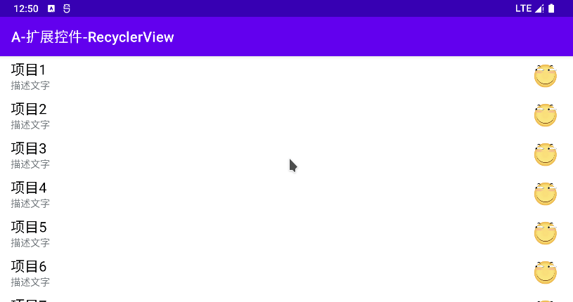
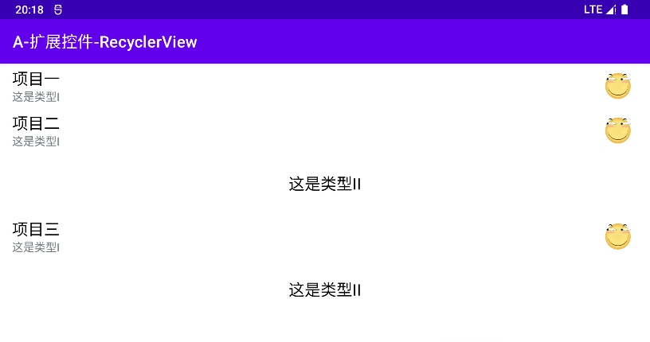
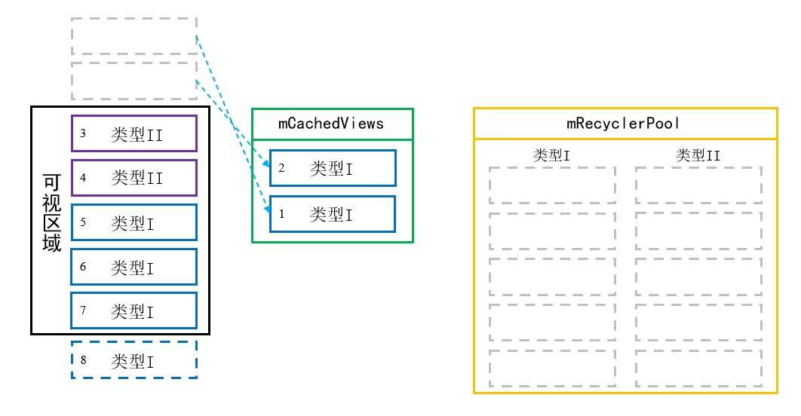
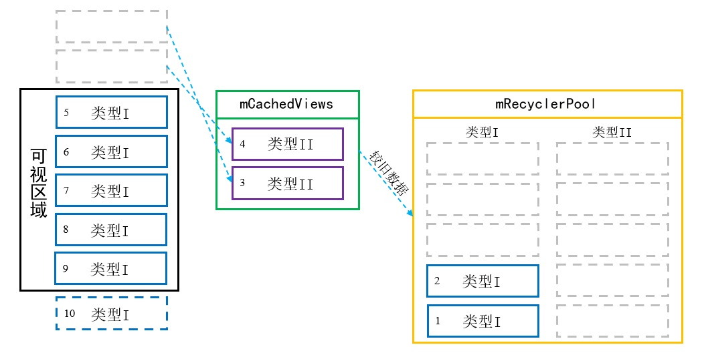

# 简介
RecyclerView是Google官方推出的控件，用于展示大量的列表数据，可以取代ListView和GridView。传统的ListView和GridView性能不佳，且扩展性较差，而RecyclerView基于模块化设计，具有以下优点：

- 拥有多种布局管理器，子元素的排列方式较为灵活。
- 自带视图缓存与复用机制，性能较高。
- 自带动画效果，并且可以方便地添加自定义动画。

RecyclerView已包含在"androidx.appcompat"依赖中，我们可以直接使用。若需要单独指定版本，我们可以在项目的"build.gradle"文件中添加配置：

```groovy
dependencies {
    implementation 'androidx.recyclerview:recyclerview:1.2.1'
}
```

# 基本应用
我们首先创建布局文件"list_item_simple.xml"，此文件用于描述每个列表项的样式，布局中有一个TextView和一个ImageView。

list_item_simple.xml:

```xml
<?xml version="1.0" encoding="utf-8"?>
<androidx.constraintlayout.widget.ConstraintLayout xmlns:android="http://schemas.android.com/apk/res/android"
    xmlns:app="http://schemas.android.com/apk/res-auto"
    xmlns:tools="http://schemas.android.com/tools"
    android:layout_width="match_parent"
    android:layout_height="100dp">

    <TextView
        android:id="@+id/tvTitle"
        android:layout_width="wrap_content"
        android:layout_height="wrap_content"
        android:layout_marginStart="15dp"
        android:textColor="@android:color/black"
        android:textSize="20sp"
        app:layout_constraintBottom_toBottomOf="parent"
        app:layout_constraintStart_toStartOf="parent"
        app:layout_constraintTop_toTopOf="parent"
        tools:text="[标题]" />

    <ImageView
        android:id="@+id/ivIcon"
        android:layout_width="50dp"
        android:layout_height="50dp"
        android:layout_marginEnd="15dp"
        android:src="@drawable/ic_funny_256"
        app:layout_constraintBottom_toBottomOf="parent"
        app:layout_constraintEnd_toEndOf="parent"
        app:layout_constraintTop_toTopOf="parent" />
</androidx.constraintlayout.widget.ConstraintLayout>
```

接着创建一个与列表项视图相匹配的实体类(View Object)，以便存放视图数据。

SimpleVO.java:

```java
public class SimpleVO {

    // 对应表项的标题"tvTitle"
    private String title;

    /* 此处省略Get、Set与构造方法... */
}
```

RecyclerView使用适配器模式管理视图与数据，我们需要创建一个适配器类，继承RecyclerView.Adapter并重写父类的一些方法。

MyAdapter.java:

```java
public class MyAdapter extends RecyclerView.Adapter<MyAdapter.MyViewHolder> {

    // 上下文环境
    private final Context mContext;
    // 数据源
    private final List<SimpleVO> dataSource;

    // 构造方法
    public MyAdapter(Context context, List<SimpleVO> dataSource) {
        this.mContext = context.getApplicationContext();
        this.dataSource = dataSource;
    }

    // 创建ViewHolder
    @NonNull
    @Override
    public MyViewHolder onCreateViewHolder(@NonNull ViewGroup parent, int viewType) {
        // 将布局文件实例化为View对象
        View view = LayoutInflater.from(mContext)
                // 此方法的第三参数必须为"false"，因为控件将会在需要时自行Attach到视图。
                .inflate(R.layout.list_item_simple, parent, false);
        // 创建ViewHolder实例，并将View对象保存在其中。
        return new MyViewHolder(view);
    }

    // 将数据与ViewHolder绑定
    @Override
    public void onBindViewHolder(@NonNull MyViewHolder holder, int position) {
        holder.bindData();
    }

    // 获取表项的总数量
    @Override
    public int getItemCount() {
        return dataSource.size();
    }

    // ViewHolder类，保存View实例，用于快速复用视图。
    class MyViewHolder extends RecyclerView.ViewHolder {

        /* 保存控件的引用，以便后续绑定数据。 */
        TextView tvTitle;
        ImageView ivIcon;

        // 构造方法，初始化ViewHolder，获取各控件的引用，并保存在全局变量中，便于后续使用。
        public MyViewHolder(@NonNull View itemView) {
            super(itemView);
            tvTitle = itemView.findViewById(R.id.tvTitle);
            ivIcon = itemView.findViewById(R.id.ivIcon);
        }

        // 将数据源中的VO属性与View中的控件绑定。
        public void bindData() {
            // 获取当前项的数据
            SimpleVO vo = dataSource.get(getAdapterPosition());
            // 将数据设置到控件中
            tvTitle.setText(vo.getTitle());
        }
    }
}
```

适配器中的内部类MyViewHolder继承自RecyclerView.ViewHolder，用于保存View与控件的引用。RecyclerView在某些情况下可以利用已存在的ViewHolder实例，不必重新创建ViewHolder，以此达到复用的目的，提升性能。

我们创建的适配器必须重写三个方法，这些方法将在RecyclerView绘制表项时被调用，它们的作用如下文所示：

🔷 `int getItemCount()`

该方法用于告知RecyclerView总共有几个表项需要绘制，我们通常使用List存放数据，所以此处返回的值是List的长度。

🔷 `onCreateViewHolder(ViewGroup parent, int viewType)`

当RecyclerView创建ViewHolder时，将会调用此方法。

参数"parent"是该表项的视图容器。参数"viewType"是表项类型，此处仅有一种表项，我们可以忽略该参数。

我们应当在此处创建表项的View实例，并将其封装进ViewHolder对象返回给RecyclerView。

🔷 `onBindViewHolder(MyViewHolder holder, int position)`

当RecyclerView将表项数据与ViewHolder实例绑定时，将会调用此方法。

参数"holder"即ViewHolder对象，我们可以使用"holder.tvTitle"这种方式给View中的控件设置属性。参数"position"是表项在列表中的位置索引，我们需要根据此索引在数据源List中找到对应的数据对象(VO)，并为各个控件设置属性，实现界面与数据的绑定。

此处我们并不使用"holder.tvTitle"这种方式绑定数据，而是调用ViewHolder的 `bindData()` 方法完成数据绑定工作，相关逻辑在ViewHolder内部实现。当列表中拥有多种类型的ViewType时，视图绑定的逻辑由各类型的ViewHolder实现，而不是全部写在 `onBindViewHolder()` 方法中，这样能够提高代码的可读性。

至此，表项的视图样式和数据已经在适配器中组装完毕，接下来我们在测试Activity中放置RecyclerView控件，并创建测试数据、加载适配器，一个基本的列表就实现完成了。

activity_demo_base.xml:

```xml
<FrameLayout xmlns:android="http://schemas.android.com/apk/res/android"
    xmlns:tools="http://schemas.android.com/tools"
    android:layout_width="match_parent"
    android:layout_height="match_parent">

    <androidx.recyclerview.widget.RecyclerView
        android:id="@+id/rvContent"
        android:layout_width="match_parent"
        android:layout_height="match_parent"
        tools:listitem="@layout/list_item_simple" />
</FrameLayout>
```

配置项 `tools:listitem` 的值为布局文件ID，此属性使控件在Android Studio的布局设计器中显示为实际样式，便于开发者进行视觉设计。

DemoBaseUI.java:

```java
public class DemoBaseUI extends AppCompatActivity {

    @Override
    protected void onCreate(Bundle savedInstanceState) {
        super.onCreate(savedInstanceState);
        setContentView(R.layout.activity_demo_base);

        // 制造测试数据
        List<SimpleVO> datas = new ArrayList<>();
        for (int i = 0; i < 20; i++) {
            datas.add(new SimpleVO("项目" + (i + 1)));
        }

        // 获取控件实例
        RecyclerView recyclerView = findViewById(R.id.rvContent);
        // 设置布局管理器
        LinearLayoutManager linearLayoutManager = new LinearLayoutManager(this);
        recyclerView.setLayoutManager(linearLayoutManager);
        // 设置适配器
        MyAdapter adapter = new MyAdapter(getApplicationContext(), datas);
        recyclerView.setAdapter(adapter);
    }
}
```

此处我们使用线性布局管理器，将表项以列表的方式排列。

运行示例程序后，RecyclerView的显示效果如下图所示：

<div align="center">


</div>

# 外观定制
## 基本样式
🔷 `android:overScrollMode="[never|always|ifContentScrolls]"`

该属性用于设置RecyclerView滚动至边缘时，继续拖拽产生的阴影效果。

取值为"never"时不显示阴影；取值为"always"时总是显示阴影，这是默认值；取值为"ifContentScrolls"时，若边缘位置的子控件可滚动，则显示阴影，否则不显示。

## 滚动条
### 基本应用
🔷 `android:scrollbars="[vertical|horizontal|none]"`

该属性用于设置当表项数量超出一屏时，是否显示滚动条，默认值为"none"，即不显示滚动条。

### 滚动条属性不生效
如果我们设置了 `android:overScrollMode="never"` 属性，RecyclerView在初始化时将会跳过部分组件的绘制工作，包括滚动条；这会导致滚动条的相关属性全部失效，无法显示。

此时我们可以调用RecyclerView的 `setWillNotDraw(boolean b)` 方法，传入"false"关闭绘图优化，确保滚动条被正确绘制。

# 点击事件
RecyclerView控件本身没有实现表项的点击事件，因为RecyclerView较为灵活，使用者可以根据需要为每个表项设置不同的监听器，或者为表项中的某个子控件设置监听器。

如果我们要为每个表项设置统一形式的点击监听器，可以在适配器中定义一个接口，调用者只需实现该接口，就能够接收事件回调。

我们在适配器中定义一个ItemClickListener接口，外部组件将接口实现传入Adapter，当表项的View收到点击事件时，我们就触发接口中的方法，通知外部组件表项被点击了。

MyAdapter.java:

```java
public class MyAdapter extends RecyclerView.Adapter<MyAdapter.MyViewHolder> {

    /* 此处省略部分变量与方法... */

    // 数据源
    private final List<SimpleVO> dataSource;

    // 点击事件监听器的实现对象
    private ItemClickListener listener;

    /* 点击监听器 */
    public interface ItemClickListener {
        void onClick(int position, SimpleVO item);
    }

    // Set方法，调用者通过此处设置事件监听器实现。
    public void setItemClickListener(ItemClickListener listener) {
        this.listener = listener;
    }

    /* ViewHolder类，用于表项的复用。 */
    class MyViewHolder extends RecyclerView.ViewHolder {

        /* 此处省略部分变量与方法... */

        public void bindData() {
            // 获取当前项的数据
            SimpleVO item = dataSource.get(getAdapterPosition());

            // 设置View的点击事件
            itemView.setOnClickListener(v -> {
                // 如果外部设置了点击事件监听器，则通知它事件触发。
                if (listener != null) {
                    listener.onClick(getAdapterPosition(), item);
                }
            });
        }
    }
}
```

在ViewHolder的 `bindData()` 方法中，我们给表项的View设置了点击事件监听器，一旦其收到点击事件，就会通过ItemClickListener的 `onClick()` 方法，将事件转发给外部组件。

> ⚠️ 警告
>
> 当前表项的位置必须使用ViewHolder的 `getAdapterPosition()` 方法即时获取，而不能使用 `onBindViewHolder()` 的"position"参数。
>
> 由于RecyclerView存在复用机制，表项在可视区域发生移位后，并不会触发 `onBindViewHolder()` 方法，因此如果我们向外通知 `onBindViewHolder()` 的"position"参数，监听者只能得到该表项移动之前的初始位置，与实际位置不符。

当我们使用此Adapter时，需要实现ItemClickListener接口，以接收表项点击的事件回调。

DemoClickEventUI.java:

```java
// 设置适配器
MyAdapter adapter = new MyAdapter(getApplicationContext(), datas);
recyclerView.setAdapter(adapter);
// 设置表项点击监听器
adapter.setItemClickListener((position, item) -> {
    // “表项点击”事件回调
    Toast.makeText(this, "表项" + (position + 1), Toast.LENGTH_SHORT)
            .show();
});
```

当我们运行示例程序后，效果如下图所示：

<div align="center">



</div>

# 加载多种表项
RecyclerView支持加载多种不同的表项，具有较高的灵活度。当RecyclerView绘制表项时，首先调用适配器的 `getItemViewType(int position)` 方法，确定当前位置需要绘制的表项类型，然后再调用 `onCreateViewHolder(ViewGroup parent, int viewType)` 方法创建View实例，此处"viewType"参数就是 `getItemViewType(int position)` 的返回值，我们需要根据此数值创建对应的View实例。

我们以前文示例为基础，改造适配器，使其加载两种样式不同的表项。

首先创建一个接口ListItem，定义获取ViewType值的方法，所有表项均需要实现此接口，以保持一致性。

```java
public interface ListItem {
    // 获取ViewType类型属性
    int getViewType();
}
```

此处为了简便，我们直接使用数字定义ViewType，实际应用中也可以将ViewType定义成枚举，避免使用时出现错误。

我们对前文的布局进行修改，首先定义第一种表项，布局文件为"list_item_type1.xml"，放置两个TextView控件。

再定义第一种表项对应的实体类Type1VO，其ViewType值固定为"1"。

Type1VO.java:

```java
public class Type1VO implements ListItem {

    private String title;
    private String info;

    /* 此处省略Get、Set与构造方法... */

    @Override
    public int getViewType() {
        return 1;
    }
}
```

然后创建布局文件"list_item_type2.xml"描述第二种表项，其中仅有一个居中的文本框。

再定义第二种表项对应的实体类Type2VO，其ViewType值固定为"2"。

Type2VO.java:

```java
public class Type2VO implements ListItem {

    private String info;

    /* 此处省略Get、Set与构造方法... */

    @Override
    public int getViewType() {
        return 2;
    }
}
```

接着修改适配器，重写 `getItemViewType()` 方法，并重新编写 `onCreateViewHolder()` 方法和 `onBindViewHolder()` 方法。

MyAdapter.java:

```java
public class MyAdapter extends RecyclerView.Adapter<RecyclerView.ViewHolder> {

    // 上下文环境
    private final Context mContext;
    // 数据源
    private final List<SimpleVO> dataSource;

    public MyAdapter(Context context, List<SimpleVO> dataSource) {
        this.mContext = context;
        this.dataSource = dataSource;
    }

    /* 创建ViewHolder */
    @NonNull
    @Override
    public RecyclerView.ViewHolder onCreateViewHolder(@NonNull ViewGroup parent, int viewType) {
        LayoutInflater inflater = LayoutInflater.from(mContext);
        RecyclerView.ViewHolder vh;
        switch (viewType) {
            case 1: {
                View view = inflater.inflate(R.layout.list_item_type1, parent, false);
                vh = new Type1VH(view);
            }
            break;
            case 2: {
                View view = inflater.inflate(R.layout.list_item_type2, parent, false);
                vh = new Type2VH(view);
            }
            break;
            default:
                throw new IllegalArgumentException();
        }

        return vh;
    }

    /* 将数据与ViewHolder绑定 */
    @Override
    public void onBindViewHolder(@NonNull RecyclerView.ViewHolder holder, int position) {
        // 获取该位置的Item类型
        int viewType = getItemViewType(position);
        // 根据Item类型绑定数据到视图上
        switch (viewType) {
            case 1: {
                Type1VH vh = (Type1VH) holder;
                vh.bindData();
            }
            break;
            case 2: {
                Type2VH vh = (Type2VH) holder;
                vh.bindData();
            }
            break;
            default:
                throw new IllegalArgumentException();
        }
    }

    /* 获取表项的总数量 */
    @Override
    public int getItemCount() {
        return dataSource.size();
    }

    /* 获取当前位置的Item类型 */
    @Override
    public int getItemViewType(int position) {
        // 我们约定所有列表项都实现ListItem接口，因此可以调用其中的方法获取ViewType。
        return dataSource.get(position).getViewType();
    }

    /* 第一种表项的ViewHolder */
    class Type1VH extends RecyclerView.ViewHolder {

        TextView tvTitle;
        TextView tvInfo;

        public Type1VH(@NonNull View itemView) {
            super(itemView);
            tvTitle = itemView.findViewById(R.id.tvTitle);
            tvInfo = itemView.findViewById(R.id.tvInfo);
        }

        public void bindData() {
            Type1VO vo = (Type1VO) dataSource.get(getAdapterPosition());
            tvTitle.setText(vo.getTitle());
            tvInfo.setText(vo.getInfo());
        }
    }

    /* 第二种表项的ViewHolder */
    class Type2VH extends RecyclerView.ViewHolder {

        TextView tvInfo;

        public Type2VH(@NonNull View itemView) {
            super(itemView);
            tvInfo = itemView.findViewById(R.id.tvInfo);
        }

        public void bindData() {
            Type2VO vo = (Type2VO) dataSource.get(getAdapterPosition());
            tvInfo.setText(vo.getInfo());
        }
    }
}
```

我们在 `getItemViewType()` 方法中，根据位置索引获取表项的类型，并返回ViewType数值；在 `onCreateViewHolder()` 方法中，根据"viewType"参数的值，渲染对应的XML文件并创建ViewHolder；在 `onBindViewHolder()` 方法中，我们主动调用Adapter的 `getItemViewType()` 方法，取出对应的数据实体对象，将数据绑定到控件上。

最后我们在测试Activity中制造一些数据，并加载至RecyclerView中。

DemoViewTypeUI.java:

```java
// 制造测试数据
List<ListItem> datas = new ArrayList<>();
datas.add(new Type1VO("项目一", "这是类型I"));
datas.add(new Type1VO("项目二", "这是类型I"));
datas.add(new Type2VO("这是类型II"));
datas.add(new Type1VO("项目三", "这是类型I"));
datas.add(new Type2VO("这是类型II"));

// 获取控件实例
RecyclerView recyclerView = findViewById(R.id.rvContent);
// 设置布局管理器
LinearLayoutManager linearLayoutManager = new LinearLayoutManager(this);
recyclerView.setLayoutManager(linearLayoutManager);
// 设置适配器
MyAdapter adapter = new MyAdapter(getApplicationContext(), datas);
recyclerView.setAdapter(adapter);
```

此处我们向列表中添加5个项目，它们的类型依次是"1, 1, 2, 1, 2"，显示效果如下图所示：

<div align="center">



</div>

# 动态修改表项
RecyclerView中的内容初始加载完成后，我们还可以动态地向列表中插入新的项或者删除某个已存在的项，此时需要使用RecyclerView适配器提供的"notify()"系列方法，这些方法能够定向刷新受影响的表项，实现提高系统性能的目的，并且带有默认的动画效果，能够提升用户视觉体验。

适配器的"notify()"系列方法只对视图中的表项生效，并且绘制新的表项时依赖数据源的正确性，所以我们在刷新列表之前应当首先更改数据源。

## 更新指定表项
适配器的 `notifyItemChanged(int position)` 方法用于更新指定位置的表项，此方法使得位置为"position"的表项被重新绘制。

```java
public void updateItem(int position, ItemBean item) {
    // 更新数据源
    dataSource.remove(position);
    dataSource.add(position, item);
    // 通知RecyclerView指定表项被更改，刷新控件显示。
    notifyItemChanged(position);
}
```

适配器还提供了 `notifyItemRangeChanged(int position, int count)` 方法，可以批量刷新自"position"开始的"count"个表项。

## 插入表项
适配器的 `notifyItemInserted(int position)` 方法用于向指定位置插入新的表项，若执行操作前"position"所在位置及后继位置已存在表项，则将这些表项都向后移动一位。

```java
public void addItem(int position, ItemBean item) {
    // 更新数据源
    dataSource.add(position, item);
    // 通知RecyclerView新的表项被插入，刷新控件显示。
    notifyItemInserted(position);
}
```

适配器还提供了 `notifyItemRangeInserted(int position, int count)` 方法用于批量插入新的表项，从"position"开始插入"count"个表项。

## 移除表项
移除指定位置的表项时需要使用 `notifyItemRemoved(int position)` 方法，操作与插入表项类似。

适配器还提供了 `notifyItemRangeRemoved(int position, int count)` 方法用于批量移除表项，从"position"开始移除"count"个表项。

## 移动表项位置
将表项从原位置移动到新位置时，可以使用 `notifyItemMoved(int fromPosition, int toPosition)` 方法。

```java
public void moveItem(int srcPosition, int dstPosition) {
    // 如果源位置与目标位置相同，直接退出当前方法。
    if (srcPosition == dstPosition) {
        return;
    }

    // 更新数据源
    Collections.swap(dataSource, srcPosition, dstPosition);
    //通知RecyclerView表项被移动，刷新控件显示。
    notifyItemMoved(srcPosition, dstPosition);
}
```

## 重新加载列表
如果整个数据源发生大范围的变化，我们可以使用 `notifyDataSetChanged()` 方法，刷新所有表项。此方法的性能最低，并且没有动画效果；代码中出现此方法时编辑器将会产生警告，如果我们确实需要调用它，可以添加SuppressLint注解抑制警告。

```java
@SuppressLint("NotifyDataSetChanged")
public void reloadItem(List<ItemBean> newDatas) {
    // 清空数据源
    dataSource.clear();
    // 重新填充数据源
    dataSource.addAll(newDatas);
    // 通知RecyclerView数据源改变
    notifyDataSetChanged();
}
```

# 局部刷新
如果列表项拥有较为复杂的布局，且某些控件状态会频繁改变，此时我们可以通过局部刷新的方式，精确更新指定的控件，避免频繁重绘整个表项视图带来的性能开销与画面闪烁。

RecyclerView的适配器中有一个方法： `onBindViewHolder(ViewHolder holder, int position, List<Object> payloads)` ，其中的参数"payloads"是一个不为空的列表，如果该列表中存在元素，说明此时需要进行局部更新，我们可以将元素取出并据此更新控件；如果该列表中没有元素，说明此时不必进行局部更新，我们可以调用普通的 `onBindViewHolder()` 方法。

此功能的基本用法如下文代码片段所示：

```java
// 重写带有"payloads"参数的"onBindViewHolder()"方法
@Override
public void onBindViewHolder(@NonNull RecyclerView.ViewHolder holder, int position, @NonNull List<Object> payloads) {
    // 如果载荷List内容为空，则执行普通的"onBindViewHolder()"方法。
    if (payloads.isEmpty()) {
        onBindViewHolder(holder, position);
    } else {
        // 短时间内多次更新同一表项时，"payloads"中可能有多个项，可以根据需要选择最新或最旧的一项。
        Object data = payloads.get(0);
        // 此处放置具体的局部更新逻辑，可以根据ViewType、载荷实际类型等条件进行判断。
    }
}
```

当我们需要局部更新时，可以先更新数据源，再调用适配器的 `notifyItemChanged(int position, Object payload)` 方法，将产生变化的数据传递给适配器，适配器将会回调带有"payloads"参数的 `onBindViewHolder()` 方法，执行前文代码的相关逻辑，将数据更新到对应的控件中。

我们可以将相关逻辑封装在Adapter中，以便外部进行调用：

```java
public void updateItem(int position, SimpleVO item) {
    // 更新数据源
    dataSource.remove(position);
    dataSource.add(position, item);
    // 通知RecyclerView指定表项被更改，刷新控件显示。
    notifyItemChanged(position, item);
}
```

# DiffUtil
## 简介
如果RecyclerView中的内容经常发生局部变化（例如下拉刷新等功能），此时不建议使用 `notifyDataSetChanged()` 方法更新视图，这种方式效率较低，并且没有过渡动画效果。

DiffUtil是RecyclerView提供的辅助工具，它可以对比新旧数据源的内容，记录它们之间的差异，并且自动调用适配器的 `notify()` 系列方法，将列表更新至最新的状态。

## 基本应用
若要使用DiffUtil，我们首先需要创建一个自定义类并继承DiffUtil.Callback，在此类中配置新旧表项的对比规则。

```java
public class MyDiffCallback extends DiffUtil.Callback {

    private final List<ItemVO> oldList;
    private final List<ItemVO> newList;

    public MyDiffCallback(List<ItemVO> oldList, List<ItemVO> newList) {
        this.oldList = oldList;
        this.newList = newList;
    }

    // 获取新数据源的大小
    @Override
    public int getOldListSize() {
        return oldList.size();
    }

    // 获取新数据源的大小
    @Override
    public int getNewListSize() {
        return newList.size();
    }

    // 判断参数所指定的两个位置对应表项是否相同。
    @Override
    public boolean areItemsTheSame(int oldItemPosition, int newItemPosition) {
        ItemVO oldItem = oldList.get(oldItemPosition);
        ItemVO newItem = newList.get(newItemPosition);
        // 若Item具有相同的ID，则认为它们是相同的。
        return oldItem.getId() == newItem.getId();
    }

    // 判断参数所指定的两个位置对应表项的内容是否相同。
    @Override
    public boolean areContentsTheSame(int oldItemPosition, int newItemPosition) {
        ItemVO oldItem = oldList.get(oldItemPosition);
        ItemVO newItem = newList.get(newItemPosition);

        boolean isTitleSame = oldItem.getTitle().equals(newItem.getTitle());
        boolean isInfoSame = oldItem.getInfo().equals(newItem.getInfo());
        return isTitleSame & isInfoSame;
    }
}
```

DiffUtil对比表项差异前，首先调用 `getOldListSize()` 方法与 `getNewListSize()` 方法，获取新旧数据源列表的长度。

DiffUtil对比表项差异时，首先调用 `areItemsTheSame()` 方法判断两个表项是否相同，返回值为"false"时，表示两个表项不同；返回值为"true"表示两个表项相同，随后会调用 `areContentsTheSame()` 方法判断表项的属性是否发生变化。如果表项拥有ID或类似的唯一性属性，此处可以比较ID是否相同。

当表项相同时，DiffUtil使用 `areContentsTheSame()` 方法判断新旧表项的各项属性是否发生变化，返回值为"true"时表示两个表项内容相同，不必刷新该条目；返回值为"false"表示两个Item内容不同，需要刷新该条目。我们只需要比较影响界面显示的属性即可，不必比较所有的属性，这样可以略微提升性能。

比较规则设置完毕后，我们通过DiffUtil的 `calculateDiff()` 方法执行差异计算操作，此方法的返回值是一个DiffUtil.DiffResult类型的对象，它的 `dispatchUpdatesTo()` 方法可以直接将变化应用到RecyclerView适配器，完成界面的刷新工作。我们通常将这些操作封装到RecyclerView的适配器中，外部调用时仅需传入新的数据源，不必关心内部的细节。

```java
public void updateData(List<ItemVO> newDatas) {
    // 对比新旧列表的差异
    DiffUtil.DiffResult diffResult = DiffUtil.calculateDiff(new MyDiffCallback(dataSource, newDatas));
    // 更新数据源
    dataSource.clear();
    dataSource.addAll(newDatas);
    // 切换至主线程，更新视图。
    diffResult.dispatchUpdatesTo(this);
}
```

值得注意的是，调用 `dispatchUpdatesTo()` 之前，我们需要更新适配器的数据集，因为该方法会调用"notify()"系列方法更新界面，而"notify()"系列方法依赖最新的数据源绘制表项，如果操作顺序不当，可能会产生"Inconsistency detected"错误并导致主进程崩溃。

`calculateDiff()` 方法默认会检测新旧列表的表项是否发生了移动，如果列表中已有表项的位置总是固定不变，或者新旧表项以相同的规则排序，我们可以调用 `calculateDiff(DiffUtil.Callback cb, boolean detectMoves)` 方法，将第二个参数设为"false"关闭移动检测功能，提升计算速度。

如果列表数据量较大，DiffUtil的计算过程可能会持续较长时间，此时我们应当将计算操作放置在子线程中，得到结果后在主线程中调用 `dispatchUpdatesTo()` 更新视图。

## 局部更新
DiffUtil的Callback中拥有 `getChangePayload()` 方法，如果我们不实现它，DiffUtil检测到表项相同但数据发生变化时，只会刷新整个表项。我们实现此方法后，DiffUtil可以计算出发生变化的属性，通过返回值传递给适配器，实现表项的局部刷新。

```java
public Object getChangePayload(int oldItemPosition, int newItemPosition) {
    ItemVO oldItem = oldList.get(oldItemPosition);
    ItemVO newItem = newList.get(newItemPosition);

    boolean isTitleSame = oldItem.getTitle().equals(newItem.getTitle());
    boolean isInfoSame = oldItem.getInfo().equals(newItem.getInfo());

    // 根据局部刷新逻辑传递发生变化的部分
    ItemVO payload = new ItemVO();
    if (!isTitleSame) {
        payload.setTitle(newItem.getTitle());
    }
    if (!isInfoSame) {
        payload.setInfo(newItem.getInfo());
    }
    return payload;
}
```

此方法的返回值是任意类型对象Object，我们需要根据适配器中 `onBindViewHolder()` 方法的规则，返回相应的数据结构。在前文示例中，适配器接收到"payLoad"参数后，将不为空的字段刷新到表项控件上，因此这里我们构造了一个属性全部为空的对象，并为发生变化的属性赋值。

# 缓存与复用机制
## 简介
对于ListView等控件，每个表项的View实例移出屏幕时被销毁，移入屏幕时再重新创建，这会消耗大量的性能。RecyclerView设计了多层缓存与复用机制，能够缓存部分移出屏幕的View实例，并在满足条件时进行复用，因此拥有较好的性能。

RecyclerView以ViewHolder为缓存单位，ViewHolder实例持有View实例与控件的引用，当系统尝试加载新的表项时，将会遇到下列情况：

🔷 最优情况

待加载的ViewHolder在缓存中，且数据有效，可以直接进行复用。

🔷 次优情况

待加载的ViewHolder在缓存中，但是数据无效，可以复用ViewHolder但需要重新绑定数据。

🔷 最坏情况

待加载的ViewHolder不在缓存中，需要创建新的ViewHolder并绑定数据。

## 缓存类型
RecyclerView通过内部类"Recycler"管理缓存，"Recycler"所拥有的缓存按照优先级由高到低分别是：

🔶 "mAttachedScrap"和"mChangedScrap"

缓存可视区域中的列表项，当我们调用"notify()"系列方法时，"mAttachedScrap"存放属性未发生改变的表项，"mChangedScrap"存放属性发生变化的表项。

这两个缓存用于高效的渲染表项改变动画，列表状态稳定时则不会被使用。

🔶 "mCachedViews"

用于缓存最近离开可视区域的列表项，其中的ViewHolder保存了完整信息，包括View实例与数据，这种ViewHolder可以直接被复用。

该缓存并不关心表项的ViewType，默认大小为2，可以通过RecyclerView的 `setItemViewCacheSize()` 方法调整容量。

🔶 "mViewCacheExtension"

Google官方预留给开发者实现自定义缓存逻辑的抽象类，如果列表头部有固定不变的View，可以使用此类将其持久缓存。

🔶 "mRecyclerPool"

进入此缓存的ViewHolder数据将被标记为无效，View实例得以保留，复用时需要重新绑定数据。

此缓存默认对于每种ViewType最多可存入5个ViewHolder，某些场景下多个RecyclerView可以共用一个"mRecyclerPool"，从而减少内存占用。

若RecyclerView在绘制表项时，从以上缓存中均未查找到可复用的ViewHolder，就需要重新创建ViewHolder并绑定数据，这种情况效率最低。

## 工作逻辑
此处以一个线性布局列表为例，演示RecyclerView的工作逻辑。此列表的表项有两种视图类型，其中第三、四项为“类型II”，其余表项均为“类型I”。RecyclerView将会预加载接近可视区域的表项，此处假设系统将会预加载1个不可见的表项。

初次加载列表时，由于没有任何缓存可被复用，系统需要调用适配器的 `onCreateViewHolder()` 方法，创建可见表项的ViewHolder实例；随后调用适配器的 `onBindViewHolder()` 方法，将该表项对应的数据设置到各个控件上。

<div align="center">


</div>

我们向下滑动列表，直到前两项完全消失。系统首先读缓存加载列表底部的表项，因为此时缓存仍然为空，需要创建新的ViewHolder并绑定数据。移出屏幕的两个表项按照先后顺序，进入"mCachedViews"缓存，保留ViewHolder与数据等信息。

<div align="center">



</div>

此时假如我们向上滑动列表回到顶部，RecyclerView可以直接复用"mCachedViews"中的两个项目，因为视图与数据均被缓存，不必执行 `onCreateViewHolder()` 和 `onBindViewHolder()` 方法。

我们继续向下滑动列表直到第4项完全消失，由于"mCachedViews"容量已满，系统按照“先进先出”的规则，将较旧的项按ViewType缓存至"mRecyclerPool"中，并将它们的数据标记为不可用。

<div align="center">



</div>

我们接着再向下滑动列表，直到第5项也完全消失，屏幕内最后一个可见的表项为第10项，此时系统将会预加载第11项，由于"mRecyclerPool"中有“类型I”的ViewHolder（第1项），系统将会复用第1项的ViewHolder，并为其绑定第11项对应的数据，将其放置在第11项的位置上。

<div align="center">


</div>

## 视图与数据的一致性
RecyclerView的缓存机制如果使用不当，就会导致界面显示出现异常，因此需要开发者妥善处理。

### 同步加载
在RecyclerView适配器的 `onBindViewHolder()` 方法中，我们必须为输入参数的每种情况都进行处理，不能有遗漏。

🔷 故障场景

某个RecyclerView的列表项中有一个Switch控件，传入参数“开启”时需要将其设为开启，传入参数“关闭”时需要将其设为关闭。

如果采用以下写法，当我们大幅度上下滑动列表时，将导致本该设为关闭的Switch一直保持开启。

```java
@Override
public void onBindViewHolder(@NonNull RecyclerView.ViewHolder holder, int position) {
    // 获取当前表项对应的数据
    String status = dataSource.get(position).getStatus();
    // 根据数据，设置Switch的状态。
    if (status.equals("开启")) {
        holder.itemView.setChecked(true);
    }
}
```

🔷 故障分析

当我们向下滑动列表时，超出"mCachedViews"数量限制的ViewHolder被转移到"mRecyclerPool"中。此时再向上滑动，系统首先复用"mCachedViews"缓存中的数据，由于该缓存内容与原列表是对应的，并不会出现问题；"mCachedViews"用完后则取出"mRecyclerPool"中的ViewHolder，并执行 `onBindViewHolder()` 方法绑定数据；假如当前表项的数据恰巧为“关闭”，我们只处理了数据为“开启”的情况，ViewHolder中的Switch仍为旧的状态，就会引起视图与数据不匹配。

🔷 故障排除

我们只需要对数据项的每种情况都进行判断与处理，就能够解决此问题。

```java
@Override
public void onBindViewHolder(@NonNull RecyclerView.ViewHolder holder, int position) {
    // 获取当前表项对应的数据
    String status = dataSource.get(position).getStatus();
    // 根据数据，设置Switch的状态。
    if (status.equals("开启")) {
        holder.itemView.setChecked(true);
    } else {
        holder.itemView.setChecked(false);
    }
}
```

### 异步加载
如果数据通过异步方式加载至RecyclerView，我们需要在结果返回时，判断该结果是否与当前屏幕正在显示的表项相匹配。

🔶 故障场景

某个RecyclerView的列表项中有一个ImageView控件，需要通过网络异步加载数据，我们直接在结果回调中将数据加载至指定表项的ImageView，此时滑动列表后图片加载可能会错位。

🔶 故障分析

当我们向下滑动列表后，表项的相对位置发生了改变，假如当前表项3位于列表顶部，滑动前位于顶部的表项发出的请求结果返回了，图片就会出现在表项3的ImageView中。

🔶 故障排除

我们可以在发出请求时给控件设置标识信息，例如给ImageView设置Tag属性；当请求结果返回时，检查标识是否与当前位置的控件相匹配，若不匹配则应该忽略结果。

```java
/* ImageView的代码片段 */
// 设置URL作为标识
holder.imageView.setTag(imageURL);

/* 接收请求结果的代码片段 */
@Override
public void handleMessage(Message msg) {
    super.handleMessage(msg);
    if (msg.what == MSG_IMAGE) {
        Bitmap bm = (Bitmap) msg.obj;
        if (bm != null) {
            // 判断当前ImageView的标识是否与结果相对应
            if (((String) imageView.getTag()).equals(imageURL)) {
                imageView.setBackground(new BitmapDrawable(bm));
            }
        }
    }
}
```
