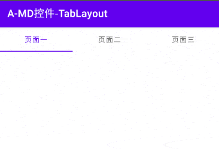

# 简介
TabLayout是Android Material Design库提供的页面切换指示控件，当用户点击某个标签后，此标签底部将会出现指示线，表明当前标签被选中，可以作为导航栏使用。

# 基本应用
我们首先在Activity的布局中放置一个TabLayout组件：

```xml
<com.google.android.material.tabs.TabLayout
    android:id="@+id/viewTab"
    android:layout_width="match_parent"
    android:layout_height="wrap_content" />
```

然后在Activity的 `onCreate()` 方法中创建标签项Tab，并添加至TabLayout：

```java
TabLayout tabLayout = findViewById(R.id.viewTab);

// 创建Tab
TabLayout.Tab tab1 = tabLayout.newTab()
        .setText("页面一");
TabLayout.Tab tab2 = tabLayout.newTab()
        .setText("页面二");
TabLayout.Tab tab3 = tabLayout.newTab()
        .setText("页面三");

// 将Tab按顺序添加至TabLayout中
tabLayout.addTab(tab1);
tabLayout.addTab(tab2);
tabLayout.addTab(tab3);
```

运行程序，并查看显示效果：

<div align="center">



</div>

# 外观定制
## 基本样式
🔷 `app:tabTextAppearance=[样式ID]`

设置Tab中文字的样式。

可以在Style中声明字号与颜色等属性，并在此引用。

🔷 `app:tabTextColor="[颜色]"`

设置Tab中的文字颜色。

配置此属性后系统默认的 `app:tabSelectedTextColor` 属性将会失效，选中Tab的文字颜色也会变成此处设置的值。

🔷 `app:tabSelectedTextColor="[颜色]"`

设置当前选中Tab的文字颜色。

🔷 `app:tabRippleColor="[颜色]"`

设置点击Tab时产生的涟漪效果颜色。

如果我们希望移除该效果，可以将此属性设置为"@null"。

🔷 `app:tabMode="[fixed|scrollable|auto]"`

设置TabLayout的布局模式。

取值为"fixed"时所有Tab平分TabLayout的宽度，这是默认值。取值为"scrollable"时，如果总宽度超过TabLayout，则可以横向滚动。取值为"auto"时根据Tab总宽度自动选择布局模式。

🔷 `app:tabGravity="[center|start|fill]"`

设置Tab的对齐方式。

取值为"center"时居中排列，取值为"start"时从容器起始端开始排列，取值为"fill"时，尝试平分父容器的宽度。

## 指示线
我们可以通过以下属性配置指示线的外观。

🔷 `app:tabIndicator="[图形资源ID]"`

设置指示线的样式。

🔷 `app:tabIndicatorColor="[颜色]"`

设置指示线的颜色。

🔷 `app:tabIndicatorHeight="[长度]"`

设置指示线的高度。

如果我们希望不显示指示线，可以将此属性设为"0dp"。

🔷 `app:tabIndicatorFullWidth="[true|false]"`

设置指示线宽度是否充满整个Tab。

取值为"true"时，指示线与Tab等宽；取值为"false"时，指示线与Tab中的文字等宽。

🔷 `app:tabIndicatorGravity="[top|bottom|center|stretch]"`

设置指示线在垂直方向的位置。

取值为"top"表示位于Tab顶部；取值为"bottom"表示位于Tab底部，是默认值；取值为"center"表示位于Tab中间；取值为"stretch"表示将指示线高度拉伸至整个Tab。

🔷 `app:tabIndicatorAnimationMode="[linear|elastic|fade]"`

设置指示线动画类型。

"linear"表示线性移动，是默认值；"elastic"表示拉伸移动；"fade"表示从旧位置逐渐消失，再逐渐出现在新位置。

🔷 `app:tabIndicatorAnimationDuration="[时间(ms)]"`

设置指示线切换动画的持续时间，单位为毫秒。

## 分隔线
有时我们希望在每个Tab之间添加竖线等元素作为分隔符，此处以一条简单的线段为例。

首先新建一个Shape文件描述线段的颜色与宽度：

divide_line.xml:

```xml
<shape xmlns:android="http://schemas.android.com/apk/res/android">
    <solid android:color="#0F0" />
    <size android:width="1dp" />
</shape>
```

然后我们在代码中获取TabLayout的布局管理器，并设置Divider即可。

```java
// 获取TabLayout的容器实例
LinearLayout linearLayout = (LinearLayout) tabLayout.getChildAt(0);
// 开启分隔符
linearLayout.setShowDividers(LinearLayout.SHOW_DIVIDER_MIDDLE);
// 设置分隔符图形素材
linearLayout.setDividerDrawable(ContextCompat.getDrawable(this, R.drawable.divide_line));
// 设置内边距
linearLayout.setDividerPadding(25);
```

## 工具提示
TabLayout的默认Tab具有长按事件，被长按时会弹出悬浮文字：

<div align="center">


</div>

若我们希望移除该工具提示，可以遍历控件内的Tab，并设置相关属性：

```java
// 关闭工具提示
for (int i = 0; i < tabLayout.getTabCount(); i++) {
    TabLayout.Tab tab = tabLayout.getTabAt(i);
    if (tab != null) {
        // 禁用长按事件
        tab.view.setLongClickable(false);
        // 针对API 26及以上系统还需要清空TooltipText
        if (Build.VERSION.SDK_INT >= Build.VERSION_CODES.O) {
            // 可以设置为"null"，也可以设置为空字符串""。
            tab.view.setTooltipText(null);
        }
    }
}
```

> ⚠️ 警告
>
> 某些情况会使得以上方法失效，例如Tab是通过TabLayoutMediator自动生成的，并且在TabSelectedListener中使用SpannableString改变了文本的样式。
>
> 当我们既要修改文本属性，又要移除工具提示Toast时，我们可以通过Tab的 `setCustomView()` 方法，传入自定义TextView实例，而不使用TabLayout自身的 `newTab()` 方法构建标签。因为仅有默认的Tab具有工具提示Toast，自定义的Tab并没有此特性。

# 监听器
## Tab选择监听器
我们可以使用TabLayout的 `addOnTabSelectedListener()` 方法设置Tab选择监听器，以监听各Tab的选中状态。此监听器支持多实例，因此某个组件不再监听事件时应当调用 `removeOnTabSelectedListener()` 方法移除监听器。

```java
// Tab选择监听器
tabLayout.addOnTabSelectedListener(new TabLayout.OnTabSelectedListener() {
    @Override
    public void onTabSelected(TabLayout.Tab tab) {
        Log.d("myapp", "onTabSelected():" + tab.getText());
    }
    @Override
    public void onTabUnselected(TabLayout.Tab tab) {
        Log.d("myapp", "onTabUnselected():" + tab.getText());
    }
    @Override
    public void onTabReselected(TabLayout.Tab tab) {
        Log.d("myapp", "onTabReselected():" + tab.getText());
    }
});
```

此监听器的三个回调方法参数均为发生事件的Tab， `onTabSelected()` 方法在Tab被选中时触发； `onTabUnselected()` 方法在Tab被取消选中时触发；当某个Tab已经在选中状态时，用户再次点击它， `onTabReselected()` 方法将会触发。
