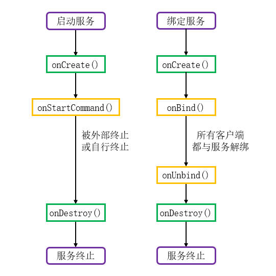

# 简介
Service的生命周期状态转换过程如下图所示：

# 生命周期方法
Service的生命周期方法描述详见下文：

🔷 `onCreate()`
 
首次启动或绑定服务时，系统会调用此方法，此处可以进行初始化操作。如果服务未被终止，再次启动或绑定服务则不会重复触发此方法。

🔷 `onStartCommand()`
 
当其它组件请求启动服务时，此方法将被调用。

🔷 `onBind()`
 
当其它组件绑定该服务时， `onBind()` 方法将会触发。此方法通过返回值对外提供一个Binder实例，以便调用者与服务之间进行通信。由于此方法是一个抽象方法，所有Service都必须将其实现，如果某个服务确实不需要与调用者通信，可以将返回值设为"null"。

🔷 `onUnbind()`
 
当所有绑定服务的组件都解除绑定后，此方法被触发。

🔷 `onRebind()`
 
如果 `onUnbind()` 返回"true"，且服务已经被所有组件解绑，再次被绑定时将会执行此方法。如果 `onUnbind()` 返回"false"，且服务已经被所有组件解绑，再次被绑定时不会调用任何生命周期方法。

🔷 `onDestroy()`
 
当服务已使用完毕或被系统强制清理时，将会触发该方法。此方法用于对本服务关联的资源进行清理，例如广播接收器等。

# 实际场景
## 被启动的服务
一个Service被外部组件通过 `startService()` 方法启动，首先 `onCreate()` 方法被调用，然后 `onStartCommand()` 方法被调用。

服务运行过程中，再次被启动时，只会执行 `onStartCommand()` 方法，且执行次数与 `startService()` 一致。

系统只会创建一个Service实例，并且该实例一直在后台运行，直到外部组件调用 `stopService()` 将其终止，或其自身任务完成主动调用 `stopSelf()` 方法。

## 被绑定的服务
一个Service被外部组件通过 `bindService()` 方法绑定，首先 `onCreate()` 方法被调用，然后 `onBind()` 方法被调用。不同的组件可以绑定到同一个Service，但 `onBind()` 方法是否再次触发取决于 `bindService()` 所传入的Intent属性，详见相关章节： [🧭 绑定服务 - Binder实例](./04-绑定服务.md#binder实例) 。

当所有组件都调用 `unbindService()` 方法解绑后，系统将会调用 `onUnbind()` 方法，并且调用 `onDestroy()` 方法终止服务。

## 被启动并绑定的服务
如果服务先被启动，再被绑定， `onCreate()` 方法只会执行一次，然后依次执行 `onStartCommand()` 和 `onBind()` 方法。如果所有绑定者都与服务解绑，系统将会调用 `onUnbind()` 方法，但不会终止服务，除非外部组件调用 `stopService()` 或服务自身调用 `stopSelf()` 方法。
