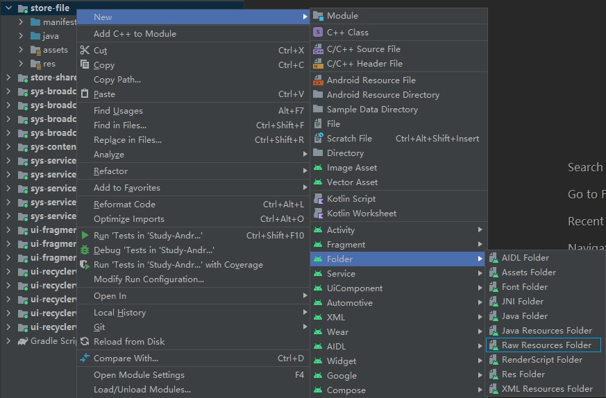

# 基本概念
## 存储设备
早期的Android手机拥有内置存储芯片(Internal Storage)和外置存储卡(External Storage)两种存储区域，内置存储芯片用于存放系统固件与数据，只要设备正常工作就能够使用；外置存储卡用于存放用户数据，容量较大，但可能被用户移除。

自从Android 4.4开始，内置存储芯片被划分为系统分区与虚拟存储卡，即使用户没有插入物理的存储卡，也可以使用虚拟存储卡存放用户数据。虽然虚拟存储卡在设备内部，但它与物理存储卡一样属于外置存储(External Storage)设备。

## 目录结构
Android系统基于Linux内核，因此目录结构与Linux类似，其中主要目录的功能分别为：

🔷 `/system`

用于存放系统组件。子目录"app"存放内置应用；子目录"fonts"存放系统界面所使用的字体；子目录"lib"存放共享库文件；子目录"media"目录存放内置铃音、提示音等资源。

🔷 `/data`

用于存放数据文件。其中的部分文件需要Root权限才能访问。

🔷 `/data/app`

用于存放用户安装的第三方APK文件。

🔷 `/data/data/<包名>`

用于存放每个应用程序的数据，子目录"cache"表示缓存文件；"databases"表示SQLite文件；"files"表示普通文件；"shared_prefs"表示SharedPreferences数据。

应用程序读写此目录不需要申请任何权限，当程序被卸载时，其中的数据都会被清除。此目录内容在未Root时对用户不可见，因此也不会被用户更改，可以安全地操作。

🔷 `/data/user/<用户序号>`

自从Android 4.2开始，系统开始支持多用户功能，每个用户拥有独立的身份标识与存储区域。

系统会为默认用户生成"/data/user/0"目录，部分操作系统的"/data/data"实际上是此目录的软连接，因此应用数据的存放路径在不同系统上有差异，视系统具体实现而定。

🔷 `/storage`

此目录用于挂载外部存储设备，子目录"emulated/0"表示默认用户的虚拟存储卡空间，如果插入外置存储卡，则会出现以分区UUID命名的目录，例如"0E17-200E"。

🔷 `/storage/emulated/0`

系统初始化时会为虚拟存储卡空间创建一些公共目录，用于存放共享数据，例如"DCIM"（相机）、"Music"（音乐）、"Movies"（视频）等，所有应用程序均可读写这些目录。

🔷 `/storage/emulated/0/Android/data/<包名>`

此目录与"/data/data/&lt;包名&gt;"类似，存放每个应用程序的私有数据，读写无需权限，卸载后会被清除。此目录内容可被用户通过文件管理器更改，如果在物理存储卡上还可能被卸载，因此读写前一定要检查文件是否存在。

# 读取APK中的资源文件
Android项目拥有"raw"和"assert"两个目录，用于存放静态资源文件。这两个目录是只读的，编译时会被原封不动地打包到APK文件中。

## "raw"目录
"raw"位于"src"目录下，不能再拥有子目录，其中的文件会被映射到R文件中，可以通过资源ID直接访问。"raw"目录中的文件没有容量限制，通常用于存放不易分类的资源文件。

此目录默认没有被Android Studio创建，我们可以在项目目录上点击右键，选择 `New - Folder - Raw Resources Folder` 进行创建。

<div align="center">



</div>

我们在"raw"文件夹中放置一个"test.txt"，随后R文件的"raw"小节内将会生成对应的ID，变量名即不含后缀的文件名。接着我们通过资源ID获取输入流，然后通过InputStream对该文件进行读取操作。

```java
InputStream is = getResources().openRawResource(R.raw.test);
String content = IOUtil.getInstance().readFile(is);
Log.d("myapp", "test.txt: " + content);
```

IOUtil的 `readFile()` 方法将输入流内容转换为字符串，最后关闭输入流，方法体此处省略，详见示例代码。

运行上述代码片段后，查看控制台输出：

```text
2023-03-09 15:57:02.066 8783-8783/net.bi4vmr.study D/myapp: test.txt: Hello World!
```

## "assets"目录
"assets"是"src"的同级目录，此目录可以拥有目录结构，需要使用AssetManager类通过路径访问。"assets"目录通常用于存放附加数据包、静态HTML网页等内容，其中的文件没有容量限制，但我们不能对超过1MB的文件进行读取操作，否则系统会抛出异常。对于容量较大的数据包等内容，我们可以将其先复制到程序的私有存储目录，再进行读取操作。

此目录默认没有被Android Studio创建，我们可以在项目目录上点击右键，选择 `New - Folder - Assets Folder` 进行创建。

我们在"assets"文件夹下创建"config"目录，并存入"default.yml"等文件，可以调用以下方法访问文件。

```java
// 获取AssetManager对象
AssetManager am = getApplicationContext().getAssets();
// 获取"assets/config"目录下的所有文件名称
String[] files = am.list("config");
// 打开"assets/config/default.yml"文件
InputStream is = am.open("config/default.yml");
// 关闭AssetManager
am.close();
```

# 访问内置存储私有目录
Context类提供了 `getCacheDir()` 和 `getFilesDir()` 方法，以供开发者获取内置存储私有目录的路径。这两个方法没有传入参数，返回值为File对象，指向应用程序在内部存储区域的私有目录，通常对应"/data/data/&lt;包名&gt;"下的"cache"和"files"目录，无需申请任何权限。

我们访问内置存储区域的私有数据时，可以采用Java访问文件的方式，通过路径构造File对象并进行读写操作；除此之外，Context类提供了两个读写方法，使我们无需关注内部存储的路径，可以直接获取文件的输入、输出流。

```java
// 获取缓存目录
File internalCacheDir = Context.getCacheDir();
// 获取文件目录
File internalFileDir = Context.getFilesDir();

// 文件读写
/*
 * 打开文件输出流
 *
 * 参数一：文件名，打开"/data/data/<包名>/files/"目录中的对应文件，若文件不存在将自动创建。
 * 参数二：写入模式，"MODE_PRIVATE"表示清空写入；"MODE_PRIVATE"表示追加写入。
 * 返回值：FileOutputStream实例
 */
FileOutputStream os = Context.openFileOutput("in.txt", MODE_PRIVATE);

/*
 * 打开文件输入流
 * 参数一：文件名，打开"/data/data/<包名>/files/"目录中的对应文件，若文件不存在返回值为Null。
 * 返回值：FileInputStream实例
 */
FileInputStream is = Context.openFileInput("in.txt");
```

# 访问外置存储私有目录
Context类提供了 `getExternalCacheDir()` 和 `getExternalFilesDir(Environment type)`方法，以供开发者获取外置存储私有目录的路径。参数"type"表示文件类型，例如传入"Environment.DIRECTORY_MUSIC"时系统会在"files"目录下创建"Music"子目录并将其作为返回值。上述方法的返回值通常指向虚拟存储卡上的应用私有数据目录，无需申请任何权限。

```java
// 获取缓存目录
File externalCacheDir = Context.getExternalCacheDir();
/*
 * 获取文件目录
 *
 * 参数：文件类型。
 *      传入空值或空字符串时表示"files"目录本身。
 *      传入"Environment.DIRECTORY_MUSIC"等常量值，将返回类似"<包名>/files/Music"的对应目录。
 *      传入自定义的字符串，系统将返回同名目录，目录不存在时将自动创建。
 * 返回值：默认返回虚拟存储卡中的路径，如果未找到任何可用路径，则会返回"Null"。
 */
File externalFileDir = Context.getExternalFilesDir(null);
```

由于外置存储设备可能有若干个，系统还提供了 `getExternalCacheDirs()` 和 `getExternalFilesDirs(Environment type)` 方法，返回值为String数组，对应系统中所有外部存储器上的路径，以供开发者按需访问。

```java
/*
 * 获取所有缓存、文件目录
 *
 * 参数与"getExternalCacheDir()"、"getExternalFilesDir()"类似，返回值为数组，包括所有外置存储设备的路径。
 */
File[] externalCacheDirs = getExternalCacheDirs();
File[] externalFilesDirs = getExternalFilesDirs(null);
```

对于外置存储中的文件，需要采用Java访问文件的方式，构造File对象指向上述方法获取到路径，然后进行输入或输出操作。

```java
// 构造File对象
File file = new File(externalFileDir, "ex.txt");
// 写入文件
FileOutputStream os = new FileOutputStream(file);
// 读取文件
FileInputStream is = new FileInputStream(file);
```

# 访问共享目录
系统会在外置存储设备的根目录下创建若干目录，用于存放公共的媒体资源，例如音乐、照片和视频。

|     目录      |    Environment常量名    | 文件类型 |      备注      |
| :-----------: | :---------------------: | :------: | :------------: |
|     Music     |     DIRECTORY_MUSIC     |   音乐   |                |
|   Pictures    |   DIRECTORY_PICTURES    |   图片   |                |
|    Movies     |    DIRECTORY_MOVIES     |   电影   |                |
|   Download    |   DIRECTORY_DOWNLOADS   | 下载文件 |                |
|   Documents   |   DIRECTORY_DOCUMENTS   |   文档   | Android 11新增 |
|     DCIM      |     DIRECTORY_DCIM      |   照片   |                |
|     Alarm     |    DIRECTORY_ALARMS     | 闹钟铃音 |                |
|   Ringtones   |   DIRECTORY_RINGTONES   | 电话铃音 |                |
| Notifications | DIRECTORY_NOTIFICATIONS | 通知铃音 |                |
|   PodCasts    |   DIRECTORY_PODCASTS    |   播客   |                |
|  Audiobooks   |  DIRECTORY_AUDIOBOOKS   | 有声读物 | Android 11新增 |

对于Android 10以下的系统，应用程序需要申请"READ_EXTERNAL_STORAGE"和"WRITE_EXTERNAL_STORAGE"权限，才能实现读写外置存储器的操作，并且在得到这两个权限后，可以操作外置存储器上的任意路径。自从Android 10开始，系统不再允许应用程序随意读写外置存储器，程序申请"READ_EXTERNAL_STORAGE"权限后，可以读写Download和Documents目录；自从Android 11开始，读写Download和Documents目录不需要任何权限。

如果应用程序只需要访问共享目录，我们可以在Manifest文件中进行以下配置：

```xml
<uses-permission
    android:name="android.permission.READ_EXTERNAL_STORAGE"
    android:maxSdkVersion="29" />
<uses-permission
    android:name="android.permission.WRITE_EXTERNAL_STORAGE"
    android:maxSdkVersion="28" />
```

"maxSdkVersion"属性申明了此标签仅在API Level小于等于28与29时生效，对于更高的版本则忽略此权限声明。

我们可以通过Environment类提供的方法获取共享目录的路径， `getExternalStorageDirectory()` 方法返回的是虚拟存储卡的根目录， `getExternalStoragePublicDirectory(Environment type)` 方法返回的是"虚拟存储卡/Music"等路径，其中Music、Movies、Pictures和Download目录必然存在，Documents目录在早期系统中不可用。

```java
// 获取共享目录的根路径
File shareDir = Environment.getExternalStorageDirectory();
// 获取指定类型的目录，参数类型同"getExternalCacheDir()"、"getExternalFilesDir()"方法。
File shareMusicDir = Environment.getExternalStoragePublicDirectory(Environment.DIRECTORY_MUSIC);
```

Android 10及更高版本中，应用程序可以采用Java访问文件的方式在Documents和Download目录中进行读写操作，但对于其它目录则必须使用MediaStore进行读写操作，否则会产生"Operation not permitted"错误。

# 访问外置存储卡
对于物理存储卡，我们在访问之前，需要先调用 `Environment.getExternalStorageState()` 方法检测其是否可用，此方法有以下常见返回值：

- "MEDIA_MOUNTED"
设备就绪，此时可以进行访问。

- "MEDIA_REMOVED"
设备被已移除。

- "MEDIA_UNMOUNTED"
设备存在，但未挂载。

- "MEDIA_CHECKING"
设备检查中，新装入的存储卡需要先检查文件系统。

存储卡只有在"MEDIA_MOUNTED"状态下才可以被访问，无参方法 `getExternalStorageState()` 通常返回虚拟存储卡的状态，因此总是"MEDIA_MOUNTED"；为了检测物理存储卡，我们可以使用 `getExternalStorageState(String path)` 方法，"path"表示待测设备的路径。

# 版本变更
## 索引

<div align="center">

|       序号        |    版本    |         摘要         |
| :---------------: | :--------: | :------------------: |
| [变更一](#变更一) | Android 10 | 系统新增分区存储功能 |

</div>

## 变更一
### 摘要
自从Android 10开始，系统新增分区存储功能。

### 详情
在Android 10之前的系统中，应用程序一旦获取"READ_EXTERNAL_STORAGE"和"WRITE_EXTERNAL_STORAGE"权限，就可以访问外置存储区域的任意目录，这些目录不受系统管理，用户卸载软件包之后将会残留大量垃圾文件。除此之外，应用程序之间没有隔离措施，任何程序都可以读取并修改其它程序的文件，存在安全隐患。

自从Android 10开始，开发团队引入了分区存储特性，每个应用程序只能读写自身的私有数据目录，不允许随意读写其它路径，因此"WRITE_EXTERNAL_STORAGE"权限已经没有意义了。我们若要读取其它应用程序的数据，需要申请"READ_EXTERNAL_STORAGE"权限，并通过MediaStore获取文件URI；若要在其它路径存取文件，则需要调用系统的Storage Access Framework，由用户手动进行确认。

### 兼容方案
在Android 10和Android 11中，如果系统识别到软件包Manifest文件的 `<application>` 标签中有以下属性，则不会为此应用程序启用分区存储。

```xml
android:requestLegacyExternalStorage="true"
```

在Android 12以及更高版本的系统中，如果应用程序确实有必要访问外置存储区域的所有目录，可以在Manifest文件中申明权限"MANAGE_EXTERNAL_STORAGE"，这是一个特殊权限，用户在系统权限管理界面明确授权。

```java
// 检查是否已经有权限
boolean isGranted = Environment.isExternalStorageManager();
// 若没有该权限，跳转至系统设置授权界面。
if (!isGranted) {
    Intent intent = new Intent(Settings.ACTION_MANAGE_ALL_FILES_ACCESS_PERMISSION);
    /*
     * 跳转新界面并获取结果
     *
     * 参数一：协定：启动新界面并获取返回结果。
     * 参数二：结果返回时要执行的操作。
     */
    registerForActivityResult(
            new ActivityResultContracts.StartActivityForResult(),
            result -> {
                if (result.getResultCode() == RESULT_OK) {
                    // 再次判断权限是否获取成功
                    if (Environment.isExternalStorageManager()) {
                        Toast.makeText(MainActivity.this, "权限申请成功！", Toast.LENGTH_SHORT).show();
                    } else {
                        Toast.makeText(MainActivity.this, "权限申请失败！", Toast.LENGTH_SHORT).show();
                    }
                }
            }
    ).launch(intent);
}
```
