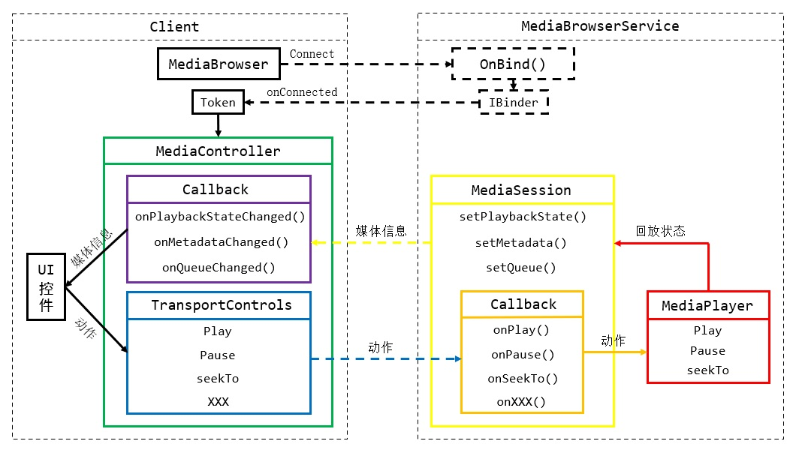

# 概述
MediaSession是一个系统级别的媒体信息管理与播放控制框架，自从Android 5.0开始提供。音视频应用程序可以将播放状态、播放列表等信息通告至MediaSession，使得系统组件和客户端能够获取这些信息，并发出播放控制指令。

MediaSession不是媒体应用的必备组件，但我们可以通过它实现系统级的媒体信息共享与控制，以及支持多种不同的客户端，例如蓝牙控制、锁屏音乐控制、熄屏显示等，开发者不必为每个组件单独适配一套接口。

MediaSession的体系结构如下图所示：

<div align="center">



</div>

MediaBrowserService本质上是一个绑定式服务，客户端通过MediaBrowser发起连接请求，绑定成功后可以获得MediaSession的配对令牌，然后通过令牌创建MediaController对象，开始进程间通信。

客户端通过MediaController向MediaSession发送指令，例如播放、暂停等，MediaSession服务则将命令传递给真正实现播放动作的组件（例如MediaPlayer）；当播放信息改变时，MediaSession将会触发客户端注册的Callback，以便客户端更新界面内容。

# 基本应用
MediaSession有两种实现，位于"android.media"包中的类不支持Android 5.0以下的系统，位于"android.support.v4"包中的类可以兼容较多的系统版本，类名后缀为"Compat"，例如：MediaBrowserCompat、MediaSessionCompat，这些类更为常用。MediaBrowserService也有两种实现，若需要兼容早期系统可以使用"androidx.media" 包中的MediaBrowserServiceCompat。

## 构建服务端
我们需要创建一个Service，并继承MediaBrowserService类，然后在 `onCreate()` 方法中创建MediaSession、设置媒体控制器回调并激活会话。

```java
public class MusicService extends MediaBrowserService {

    private final static String TAG = "myapp";
    private MediaSession mediaSession;

    @Override
    public void onCreate() {
        super.onCreate();
        Log.d(TAG, "OnCreate.");
        // 创建MediaSession实例，第二参数为媒体Tag，用于标识服务的身份。
        mediaSession = new MediaSession(this, "MusicService");
        // 设置MediaController的回调方法，处理媒体控制指令。
        mediaSession.setCallback(new MyControllerCallback());
        // 激活会话，表明当前服务已经就绪，可以接受控制。
        mediaSession.setActive(true);
        /*
         * 获取会话令牌，并将令牌绑定到此服务。
         *
         * 设置令牌后，客户端的ConnectionCallback将被调用，发送令牌给客户端。
         */
        MediaSession.Token token = mediaSession.getSessionToken();
        setSessionToken(token);

        // 设置初始的媒体信息与播放状态
        MediaMetadata metadata = new MediaMetadata.Builder()
                .putString(MediaMetadata.METADATA_KEY_TITLE, "[媒体标题]")
                .putString(MediaMetadata.METADATA_KEY_ALBUM, "[专辑名称]")
                .build();
        mediaSession.setMetadata(metadata);
        PlaybackState state = new PlaybackState.Builder()
                .setState(PlaybackState.STATE_PLAYING, 1000L, 1.0F)
                .build();
        mediaSession.setPlaybackState(state);
    }

    @Override
    public void onDestroy() {
        super.onDestroy();
        Log.d(TAG, "OnDestroy.");
        // 服务销毁时释放资源
        if (mediaSession != null) {
            mediaSession.release();
        }
    }

    @Nullable
    @Override
    public BrowserRoot onGetRoot(@NonNull String clientPackageName, int clientUid, @Nullable Bundle rootHints) {
        // 暂不使用
        return new BrowserRoot("MEDIA_ROOT", null);
    }

    @Override
    public void onLoadChildren(@NonNull String parentId, @NonNull Result<List<MediaBrowser.MediaItem>> result) {
        // 暂不使用
    }

    // MediaController的回调类，处理客户端发送的指令。
    class MyControllerCallback extends MediaSession.Callback {

        // 播放指令
        @Override
        public void onPlay() {
            // 向实际控制播放的组件发出指令，此处省略相关代码。
        }

        // 暂停指令
        @Override
        public void onPause() {
            // 向实际控制播放的组件发出指令，此处省略相关代码。
        }

        @Override
        public void onSkipToNext() {
            // 向实际控制播放的组件发出指令，此处省略相关代码。
        }
    }
}
```

逻辑代码编写完毕后，接着我们还要在Manifest文件中注册本服务，并设置Intent过滤器。

```xml
<service android:name=".MusicService">
    <intent-filter>
        <action android:name="android.media.browse.MediaBrowserService" />
    </intent-filter>
</service>
```

此时一个最小化的服务端已经构建完毕，一旦服务端使用 `setSessionToken()` 设置令牌，客户端就可以建立连接，使用令牌获取控制器并发起指令，各种播放指令会反馈到MediaSessionCompat.Callback中的对应回调方法。为了防止服务端界面退出后服务被系统终止，我们还需要将服务与前台通知绑定，此处省略相关代码。

## 构建客户端
客户端可以是一个Activity，通过MediaBrowser连接至MediaBrowserService，一旦连接成功，就会触发连接回调中的 `onConnected()` 方法，此时可以获取令牌，并创建MediaController，通过Controller的TransportControls向服务端发出播放指令。MediaController的回调方法可以收到媒体数据与回放状态变更的消息，可以在此处读取数据并更新UI。

```java
public class MainActivity extends AppCompatActivity {

    private final static String SERVICE_PKG = "net.bi4vmr.study.media.common.mediasession.server";
    private final static String SERVICE_NAME = "net.bi4vmr.study.demo01.MusicService";

    private MediaBrowserCompat mediaBrowser;
    private MediaControllerCompat mediaController;

    @Override
    protected void onCreate(Bundle savedInstanceState) {
        super.onCreate(savedInstanceState);

        // 创建MediaBrowser实例，连接服务端。
        mediaBrowser = new MediaBrowser(this,
                new ComponentName(SERVICE_PKG, SERVICE_NAME),
                new MyConnectionCallback(),
                null);

        // 注册播放按钮的点击事件
        Button btnPlay = findViewById(R.id.btnPlay);
        btnPlay.setOnClickListener(v -> {
            int stateIndex = mediaController.getPlaybackState().getState();
            // 如果当前是播放状态，则发出暂停指令；反之亦然。
            if (stateIndex == PlaybackState.STATE_PLAYING) {
                mediaController.getTransportControls().pause();
            } else if (stateIndex == PlaybackState.STATE_PAUSED) {
                mediaController.getTransportControls().play();
            }
        });
    }

    @Override
    protected void onStart() {
        super.onStart();
        // 连接音乐播放服务
        mediaBrowser.connect();
    }

    @Override
    protected void onStop() {
        super.onStop();
        // 界面不可见时，断开连接。
        if (mediaBrowser != null) {
            mediaBrowser.disconnect();
        }
    }

    // 将Session中的媒体信息更新至UI
    @SuppressLint("SetTextI18n")
    private void updateMediaInfoUI(MediaMetadata metadata) {
        // 如果媒体信息为空则清空当前显示。
        if (metadata == null) {
            tvInfo.setText(null);
            return;
        }

        // 取出“标题”属性
        String title = metadata.getString(MediaMetadata.METADATA_KEY_TITLE);
        // 取出“专辑”属性
        String album = metadata.getString(MediaMetadata.METADATA_KEY_ALBUM);
        // 更新界面
        Log.d(TAG, "标题：" + title + "\n专辑：" + album);
    }

    // 将Session中的播放状态更新至UI
    @SuppressLint("SetTextI18n")
    private void updatePlayStateUI(PlaybackState state) {
        // 如果播放状态为空则清空当前显示。
        if (state == null) {
            tvState.setText(null);
            return;
        }

        // 更新界面
        Log.d(TAG, "播放状态: " + state.getState());
    }

    // 音频服务连接回调
    class MyConnectionCallback extends MediaBrowserCompat.ConnectionCallback {

        @Override
        public void onConnected() {
            Log.d(TAG, "MediaBrowserCallback-OnConnected.");
            // 获取配对令牌
            MediaSession.Token token = mediaBrowser.getSessionToken();
            // 通过令牌创建媒体控制器
            mediaController = new MediaController(getApplicationContext(), token);

            // 服务连接完毕后，主动获取媒体信息与播放状态，同步UI显示。
            updateMediaInfoUI(mediaController.getMetadata());
            updatePlayStateUI(mediaController.getPlaybackState());
            // 注册媒体控制器回调，处理后续媒体信息与播放状态变更事件。
            mediaController.registerCallback(new MyMediaControllerCallback());
        }

        @Override
        public void onConnectionFailed() {
            Log.d(TAG, "MediaBrowserCallback-OnConnectionFailed.");
            tvInfo.setText("服务连接失败！");
        }
    }

    // 媒体控制器的回调接口实现类
    class MyMediaControllerCallback extends MediaController.Callback {

        // 媒体元数据改变回调
        @Override
        public void onMetadataChanged(@Nullable MediaMetadata metadata) {
            // 媒体元数据发生变更（标题，艺术家等），将其更新到界面上。
            updateMediaInfoUI(metadata);
        }

        // 回放状态改变回调
        @Override
        public void onPlaybackStateChanged(@Nullable PlaybackState state) {
            // 播放状态发生变更，将其更新到界面上。
            updatePlayStateUI(state);
        }
    }
}
```

我们通过MediaController的 `getTransportControls()` 获取控制器对象后，可以对媒体播放进行控制，其中的方法与服务端的MediaSession.Callback是对应的，例如客户端调用一次 `play()` 方法，则服务端Callback的 `onPlay()` 回调方法将被触发一次。

# 播放状态
PlaybackState用于描述媒体的回放状态，当服务端收到指令后，不仅要使播放组件执行相应动作，还需要构造PlaybackState实例，通过MediaSession的 `setPlaybackState()` 方法将播放状态通告给客户端，所有客户端控制器Callback中的`onPlaybackStateChanged()` 方法被调用，使得它们能够更新界面。

```java
// 构造PlaybackState实例
PlaybackStateCompat playbackState = new PlaybackStateCompat.Builder()
/*
 * 设置播放状态
 *
 * state    : 回放状态
 * position : 回放进度，单位为毫秒。
 * speed    : 回放速度，1倍表示原速，负数表示倒放。
 */
.setState(PlaybackStateCompat.STATE_PLAYING, 0, 1.0F)
.build();
// 将播放状态反馈给客户端
mediaSession.setPlaybackState(playbackState);
```

具有三个参数的 `setState()` 方法分别接收播放状态、进度与速度参数，其中播放状态可以设为PlaybackState类中的"STATE_X"系列常量：

|         STATE         |      含义      |
| :-------------------: | :------------: |
|      STATE_NONE       | 无曲目可供播放 |
|     STATE_PLAYING     |    正在播放    |
|     STATE_PAUSED      |     已暂停     |
|     STATE_STOPPED     |   已播放完毕   |
| STATE_FAST_FORWARDING |    快进播放    |
|    STATE_REWINDING    |    快退播放    |
|    STATE_BUFFERING    |    正在缓冲    |
|      STATE_ERROR      |    播放错误    |

"STATE_NONE"一般用于初始化状态，用户未选择任何媒体资源。"STATE_BUFFERING"表示播放远程资源时，加载速度低于回放速度，缓冲完毕后应当恢复播放。"STATE_ERROR"表示播放错误，通告此状态时应当同时调用构造器的 `setErrorMessage()` 方法，设置具体的错误信息。

具有四个参数的 `setState()` 方法，最后一个参数表示状态更新时间，客户端可以根据此时间计算出媒体的播放进度。具有三个参数的 `setState()` 方法实际上会调用四个参数的 `setState()` 方法，并将状态更新时间设置为“系统启动至今经过的时刻”。

假设开机120秒后，服务端收到播放指令，从10秒位置开始以正常速度播放一首歌曲，再经过10秒时间，有一个客户端需要查询播放进度，它可以使用以下代码进行计算：

```java
PlaybackState state = mediaController.getPlaybackState();
// 一倍速播放的进度
long normalOffset = SystemClock.elapsedRealtime() - state.getLastPositionUpdateTime();
// 真实倍率播放的进度
long realOffset = normalTime * state.getPlaybackSpeed();
// 起始位置
long startPosition = state.getPosition();
// 当前进度
long currentPosition = startPosition + realOffset;
```

客户端首先获取当前“系统启动至今经过的时刻”，值为130秒，并减去服务端开始播放时“系统启动至今经过的时刻”，得到了以一倍速播放的进度（10秒）；然后将数值与播放速率相乘，得到真实的播放进度；最后将开始播放的位置加上真实进度，得到当前所在进度。

# 媒体信息
MediaMetadata用于描述媒体的元数据，服务端切换到新的媒体后，应当根据媒体信息构造此类的实例，并通过MediaSession的 `setMetadata()` 方法通告客户端，所有客户端控制器Callback中的 `onMetadataChanged()` 方法被调用，使得它们能够更新界面所显示的媒体信息。

```java
// 构造MediaMetadata实例
MediaMetadataCompat metadata = new MediaMetadataCompat.Builder()
        // 设置标题
        .putString(MediaMetadataCompat.METADATA_KEY_TITLE, "Title")
        // 设置艺术家
        .putString(MediaMetadataCompat.METADATA_KEY_ARTIST, "Artist")
        // 设置封面
        .putBitmap(MediaMetadataCompat.METADATA_KEY_ART, Bitmap)
        .build();
// 将媒体元数据反馈给客户端
mediaSession.setMetadata(metadata);
```

MediaMetadata的配置项通过"put()"系列方法进行设置，第一个参数为MediaMetadata类中的"METADATA_KEY"系列常量，表示项目的含义；第二个参数为实际数据，其类型要与所选方法相匹配，支持String、Long、Bitmap。

常用的配置项可参考下表：

|      METADATA_KEY      |  含义   |
| :--------------------: | :-----: |
|   METADATA_KEY_TITLE   |  标题   |
|  METADATA_KEY_ARTIST   | 艺术家  |
|   METADATA_KEY_ALBUM   |  专辑   |
| METADATA_KEY_DURATION  |  时长   |
|    METADATA_KEY_ART    |  图片   |
|  METADATA_KEY_ART_URI  | 图片URI |
| METADATA_KEY_MEDIA_URI | 媒体URI |

设置"METADATA_KEY_ART"属性时应传入图片的Bitmap对象，如果图片体积较大，也可以使用"METADATA_KEY_ART_URI"属性，传入图片URI字符串，让客户端自行获取并显示图片。

# 权限控制
MediaBrowserService中的 `onGetRoot()` 方法用于对客户端进行鉴权，此方法内不应执行耗时操作，完成鉴权之后应当快速返回结果。

```java
/**
 * Name        : onGetRoot()
 *
 * Description : 本方法用于对客户端进行鉴权，鉴权完毕后应当快速返回，不能进行耗时操作。
 *
 * @param clientPackageName 客户端包名
 * @param clientUid         客户端的UID
 * @param rootHints         初始化信息
 * @return BrowserRoot对象，如果为Null则客户端连接失败。
 */
@Nullable
@Override
public BrowserRoot onGetRoot(@NonNull String clientPackageName, int clientUid, @Nullable Bundle rootHints) {
    // 根据客户端包名和UID鉴权
    if (clientPackageName.equals("com.example.deny")) {
        // 禁止包名为"com.example.deny"的客户端连接。
        return null;
    } else if (clientPackageName.equals("com.example.denylist")) {
        // 禁止包名为"com.example.denylist"的客户端浏览媒体列表。
        // 返回BrowserRoot对象，"EMPTY_ROOT"表示禁止浏览媒体列表。
        return new BrowserRoot("EMPTY_ROOT", null);
    } else {
        // 返回BrowserRoot对象，"MEDIA_ROOT"表示允许浏览媒体列表。
        return new BrowserRoot("MEDIA_ROOT", null);
    }
}
```

此方法如果返回Null，客户端连接回调的 `onConnectionFailed()` 方法将被调用，可以实现完全拒绝连接的效果，客户端既不能获取媒体信息，又不能发出控制指令。

MediaSession可以对客户端通告媒体列表，如果不希望某些客户端查看列表，可以在创建BrowserRoot对象时，传入一个与正常状态不同的"RootID"。此时客户端能够正常连接到服务端，并获取在播媒体信息、发出控制指令，但不能浏览媒体列表，具体实现参见下文。

# 媒体信息库
MediaSession可以通告一个具有树状结构的媒体信息库，以供客户端查询所有可播放的媒体信息。

MediaBrowserService中的 `onLoadChildren()` 方法用于向客户端返回媒体列表，虽然此方法是抽象方法，必须被子类覆盖，但是这个功能在媒体应用中是可选的，外部控制端通常只会实现上一曲、下一曲等功能，不会指定歌曲进行播放，因此我们通常不需要通告所有的可用媒体列表。

```java
/**
 * Name        : onLoadChildren()
 *
 * Description : 客户端浏览媒体列表时调用此方法，结果通过"result"反馈给客户端。
 * 参数一 : parentId 客户端查询的节点ID
 * 参数二 : result   结果列表，调用"sendResult()"将数据反馈给查询者。
 */
@Override
public void onLoadChildren(@NonNull String parentId, @NonNull Result<List<MediaBrowser.MediaItem>> result) {
    // 设置新结果前，将"result"变量从当前线程分离，否则会出错。
    result.detach();
    
    // 如果客户端查询的MediaID是"EMPTY_ROOT"，则返回空值。
    if (parentId.equals("EMPTY_ROOT")) {
        result.sendResult(null);
    } else if (parentId.equals("MEDIA_ROOT")) {
        // 构建MediaDescription
        MediaDescription discription = new MediaDescription.Builder()
                .setMediaId("Media-01")
                .setTitle("媒体01")
                .build();
        // 构建MediaItem
        int flagPlayable = MediaBrowser.MediaItem.FLAG_PLAYABLE;
        MediaBrowser.MediaItem mediaItem = new MediaBrowser.MediaItem(discription, flagPlayable);

        // 构建结果列表并将结果发送给客户端
        List<MediaBrowser.MediaItem> datas = new ArrayList<>();
        datas.add(mediaItem);
        result.sendResult(datas);
    }
}
```

当客户端发起查询操作时，服务端的 `onLoadChildren()` 方法被调用，参数"parentId"是客户端查询的节点MediaID，参数"result"是返回给客户端的数据集，发送媒体列表前，需要先调用 `result.detach()` 方法分离结果集，再调用 `result.sendResult()` 方法，否则会出现错误。

结果集中的项目用MediaBrowser.MediaItem类表示，创建MediaItem需要两个参数，第一个是MediaDescription对象，用于描述媒体信息，第二个是Item的类型，"FLAG_PLAYABLE"表示本Item是媒体节点，可以直接播放；"FLAG_BROWSABLE"表示本Item是目录节点，内部可能还有层级结构。

客户端建立连接成功后，可以执行 `mediaBrowser.getRoot()` 方法获取根MediaID，此ID就是服务端的 `onGetRoot()` 方法所返回的值，然后我们可以通过此ID进一步查询媒体信息。

```java
// 必须在成功连接状态下获取ID
if (mediaBrowser.isConnected()){
    return;
}

// 获取根媒体ID
String rootID = mediaBrowser.getRoot();
// 取消订阅媒体信息库
mediaBrowser.unsubscribe(rootID);
// 订阅媒体信息库，并设置回调。
mediaBrowser.subscribe(rootID, new MediaBrowser.SubscriptionCallback() {
    @Override
    public void onChildrenLoaded(@NonNull String parentId, @NonNull List<MediaBrowser.MediaItem> children) {
        // 遍历所有子节点
        for (MediaBrowser.MediaItem item : children) {
            Log.d("TAG","item:" + item.getMediaId());
        }
    }
});
```

`subscribe()` 方法用于查询指定节点的信息，第一个参数为节点的ID，首次查询应当使用"RootID"；第二个参数为回调，因为服务端准备列表可能是耗时操作，因此结果将在回调方法中返回。

客户端执行 `subscribe()` 方法后，服务端的 `onLoadChildren()` 方法被调用，当服务端调用 `result.sendResult()` 方法时，客户端的回调方法 `onChildrenLoaded()` 就会被调用，此时可以读取媒体信息列表。

由于某些版本的系统中存在Bug，执行 `subscribe()` 方法前最好先执行一次 `unsubscribe()` 方法，否则可能会导致执行订阅操作后立刻触发回调方法。
