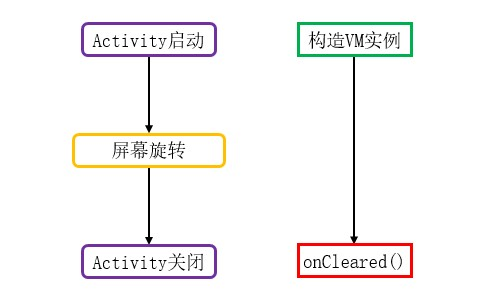
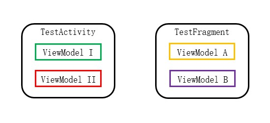

# 简介
ViewModel是Jetpack中提供的架构组件，可供开发者创建MVVM架构的应用程序。

在MVVM架构的应用程序中，Activity不再直接持有数据与回调注册，而是观察ViewModel中的可观察对象，当数据发生改变时，可观察对象将会通知Activity此时需要刷新界面了。

ViewModel的生命周期从我们调用创建方法的时刻开始（通常是Activity或Fragment创建的时刻），直到界面组件被销毁时结束。

<div align="center">



</div>

我们可以使用ViewModel代替 `onSaveInstanceState()` 机制，在屏幕旋转等时刻保存与恢复视图数据。界面组件与ViewModel在同一个进程中，因此不需要跨进程传输数据与类型转换，相比 `onSaveInstanceState()` 机制更加简单高效。

> ⚠️ 警告
>
> ViewModel只是数据管理工具，因此我们不能向其中传递任何Activity、Fragment或View对象，否则界面关闭后可能会导致内存泄漏。

# 基本应用
我们首先编写一个MyViewModel类，在它的构造方法中获取一个随机数作为实例标记：

MyViewModel.java:

```java
public class MyViewModel extends ViewModel {

    private String name = null;

    public MyViewModel() {
        Log.i("myapp", "MyViewModel-VM created. Name:" + name);
        name = genRandomID();
    }

    @Override
    protected void onCleared() {
        super.onCleared();
        Log.i("myapp", "MyViewModel-OnCleared. Name:" + name);
    }

    public String getVMName() {
        return name;
    }

    // 获取随机ID
    private String genRandomID() {
        return UUID.randomUUID()
                .toString()
                .toUpperCase()
                .substring(0, 6);
    }
}
```

然后我们在测试Activity中获取该ViewModel的实例，并调用其中的方法获取数据。

DemoBaseUI.java:

```java
@Override
protected void onCreate(Bundle savedInstanceState) {
    super.onCreate(savedInstanceState);
    setContentView(R.layout.ui_demo_base);

    // 从当前Activity中获取VM实例
    MyViewModel vm = new ViewModelProvider(this).get(MyViewModel.class);
    Log.i("myapp", "DemoBaseUI-Get VM in Activity:" + vm.getVMName());

    // 初始化Fragment
    getSupportFragmentManager()
            .beginTransaction()
            .add(R.id.container, new TestFragment())
            .commit();
}
```

我们需要使用ViewModelProvider的 `get()` 方法获取ViewModel实例，构造ViewModelProvider时传入的参数是ViewModelStoreOwner接口实现类，这些类拥有存储ViewModel对象的能力； `get()` 方法的参数是我们指定的ViewModel类。此处我们获取了一个MyViewModel实例，存储在DemoBaseUI(Activity)中。

该Activity中包含一个Fragment，我们在Fragment内部也尝试获取Activity级别与Fragment级别的MyViewModel实例。

TestFragment.java:

```java
@Override
public void onCreate(@Nullable Bundle savedInstanceState) {
    super.onCreate(savedInstanceState);
    // 获取Activity对应的ViewModel实例
    MyViewModel activityVM = new ViewModelProvider(requireActivity()).get(MyViewModel.class);
    Log.i("myapp", "TestFragment-Get VM in Activity:" + activityVM.getVMName());

    // 获取Fragment对应的ViewModel实例
    MyViewModel vm = new ViewModelProvider(this).get(MyViewModel.class);
    Log.i("myapp", "TestFragment-Get VM in Fragment:" + vm.getVMName());
}
```

示例代码编写完毕后，我们运行示例程序，打开测试Activity，并查看控制台日志输出内容：

```text
2023-05-11 22:26:08.816 11268-11268/net.bi4vmr.study I/myapp: MyViewModel-VM created. Name:C96AC9
2023-05-11 22:26:08.816 11268-11268/net.bi4vmr.study I/myapp: DemoBaseUI-Get VM in Activity:C96AC9
2023-05-11 22:26:08.821 11268-11268/net.bi4vmr.study I/myapp: TestFragment-Get VM in Activity:C96AC9
2023-05-11 22:26:08.821 11268-11268/net.bi4vmr.study I/myapp: MyViewModel-VM created. Name:35355A
2023-05-11 22:26:08.821 11268-11268/net.bi4vmr.study I/myapp: TestFragment-Get VM in Fragment:35355A
```

我们可以观察到Activity首先获取到了自身的MyViewModel(C96AC9)实例，然后Fragment也获取了Activity的ViewModel实例，该操作并未创建新的实例；最后Fragment获取到了MyViewModel(35355A)实例。

接着我们将Fragment从Activity中移除，并查看日志输出内容：

```text
2023-05-11 22:26:18.291 11268-11268/net.bi4vmr.study I/myapp: MyViewModel-OnCleared. Name:35355A
2023-05-11 22:26:18.291 11268-11268/net.bi4vmr.study I/myapp: TestFragment-OnDestroy.
```

我们可以观察到Fragment被回收前，其中存储的MyViewModel(35355A)实例被系统回收了，它的 `onCleared()` 方法被系统回调。

# ViewModel实例的创建与复用
我们通常使用 `new ViewModelProvider(ViewModelStoreOwner owner).get(ViewModel.class)` 方式获取ViewModel实例，其中ViewModelStoreOwner是存放ViewModel对象的容器，SDK默认支持的容器有Activity和Fragment。

ViewModel实例在容器中以键值对的形式存储，键为ViewModel的Class文件。当我们调用 `get()` 方法获取ViewModel实例时，如果当前容器中没有该类型的实例，则会创建一个新实例并返回；如果当前容器中已有该类型的实例，则会直接返回现有实例。

<div align="center">



</div>

正如前文章节： [🧭 基本应用](#基本应用) 中的示例所示，我们在Fragment中可以获取到Activity的ViewModel实例，利用这种特性便可以实现数据的共享与事件传递。

# AndroidViewModel
普通的ViewModel不包含任何初始条件，有时我们需要通过Context初始化外部组件，此时就可以使用AndroidViewModel，该类的构造方法包含当前应用程序的Application对象，我们可以从中获取到应用级的Context。

我们可以将前文的MyViewModel稍加改造，使其继承AndroidViewModel，并重新编写构造方法，以获取Context对象。

MyViewModel.java:

```java
public class MyViewModel extends AndroidViewModel {

    public MyViewModel(@NonNull Application application) {
        super(application);
        // 获取应用级的Context对象
        Context context = application.getApplicationContext();
        Log.i("myapp", "MyViewModel-APPContext:" + context.toString());
    }
}
```
