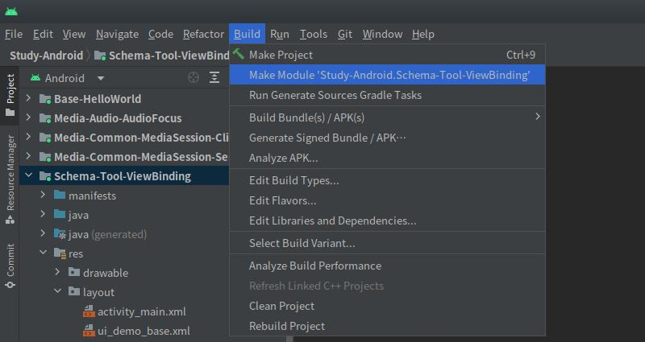

# 简介
LiveData是一种可被观察的数据容器，当数据发生改变时，将会通知所有观察者变更事件。

LiveData与普通的观察者模式工具相比，支持生命周期感知功能，它只会通告消息给当前状态为活跃的观察者，并且会自动注销非活跃观察者的回调方法，使用更加便捷。

# 基本应用
我们首先创建一个ViewModel类，用来承载LiveData。

MyViewModel.java:

```java
public class MyViewModel extends ViewModel {

    // 基本类型数值
    private int num = 0;

    // 可变LiveData，其中的数值可以被修改。
    private final MutableLiveData<Integer> numberData = new MutableLiveData<>();
    // 不可变LiveData，仅可被外部观察。
    public final LiveData<Integer> roNumberData = numberData;

    // 数值增加
    public void plus() {
        // 改变数值
        num += 10;
        // 通知观察者数值发生变化
        numberData.setValue(num);
    }

    // 数值减少
    public void minus() {
        // 改变数值
        num -= 10;
        // 通知观察者数值发生变化
        numberData.setValue(num);
    }
}
```

在ViewModel中，我们声明了一个基本数据类型的变量"num"，并提供对应的数值增加方法 `plus()` 和数值减少方法 `minus()` 用于修改变量的值。

我们还声明了两个LiveData变量以供外部观察普通变量"num"的数值变化，它们的泛型为Integer，对应普通变量"num"的类型。其中私有变量"numberData"的类型为MutableLiveData，它的值可以被改变；而公开变量"roNumberData"的类型为LiveData，它的值只能被外部观察但不能修改，我们在变量名前添加"Read Only"的缩写，以便与"numberData"作区分。每当"num"的数值被改变时，我们调用MutableLiveData的 `setValue()` 方法将最新数值通告给观察者。

我们在测试Activity中获取MyViewModel实例，并观察公开的LiveData变量"roNumberData"，当"num"的数值发生变化时，将最新数值刷新到界面上。

DemoBaseUI.java:

```java
protected void onCreate(Bundle savedInstanceState) {
    super.onCreate(savedInstanceState);
    setContentView(R.layout.ui_demo_base);

    /* 此处省略部分变量与方法... */

    // 获取当前Activity对应的ViewModel实例
    MyViewModel vm = new ViewModelProvider(this).get(MyViewModel.class);

    // 注册按钮监听器
    btnPlus.setOnClickListener(v -> vm.plus());
    btnMinus.setOnClickListener(v -> vm.minus());

    // 读取LiveData的初始值
    Log.i("myapp", "LiveData初始值：" + vm.roNumberData.getValue());

    // 调用LiveData的"observe()"方法，注册本Fragment为该LiveData的观察者。
    vm.roNumberData.observe(this, new Observer<Integer>() {
        @Override
        public void onChanged(Integer integer) {
            Log.i("myapp", "LiveData数值改变：" + integer);
            // 观察到数值改变时，将其更新到控件上。
            tvContent.setText("Num:" + integer);
        }
    });
}
```

此时运行测试Activity，并点击增减按钮改变"num"的数值，然后观察界面控件的变化。

<div align="center">

<!-- TODO

 -->

</div>

每当我们点击按钮触发ViewModel中的数值改变方法时，"numberData"就会向所有观察者发送通知，Activity初始化时将自身注册为"roNumberData"的观察者，因此能够收到通知并触发 `onChanged()` 回调方法，得到"num"的最新数值。

# 更新数据
LiveData类是不可变的，只能被外部观察，不提供改变数值的方法；而MutableLiveData扩展自LiveData类，提供了 `setValue()` 与 `postValue()` 方法，可以更新内部存储的值。

我们通常只在ViewModel中暴露不可变的LiveData变量，当外部组件需要更新MutableLiveData时，通常伴随着ViewModel中的其他逻辑操作，例如前文示例中的 `plus()` 和 `minus()` 方法，我们可以在此插入日志记录等动作，以便观察数值何时被更新。如果直接对外暴露MutableLiveData变量也是可行的，但这种设计并不被推荐，因为任何组件都可以修改变量的值，并且不会留下日志记录，不便于故障排除。

当我们更新MutableLiveData的内容时，如果在主线程，可以使用同步方法 `setValue()` 。在前文示例中，数值增加方法 `plus()` 是由Activity的按钮触发的，逻辑在主线程中执行，因此我们使用 `setValue()` 方法更新了"numberData"的值。如果更新操作不在主线程中执行，我们必须使用 `postValue()` 方法进行操作，否则会出现异常："IllegalStateException: Cannot invoke setValue on a background thread"。

LiveData的观察者必须在主线程中调用 `observe()` 等方法进行注册，当数据发生变更时，回调方法 `onChanged()` 也会在主线程执行，因此我们可以直接在此书写界面更新逻辑，而不必手动切换至主线程。

LiveData默认没有去重机制，这意味着它不比较新数据与当前数据是否一致，只要收到更新请求就会通知所有观察者。

# 共享数据
ViewModel与LiveData配合可以实现多组件间的数据共享，由ViewModel的前置知识可知，多个组件能够获取到相同的ViewModel实例，如果它们都观察某个LiveData，就能够实现数据的统一分发。

以前文示例为基础，我们在测试Activity中添加一个Fragment，并获取Activity的ViewModel实例，也观察"roNumberData"变量。

TestFragment.java:

```java
public View onCreateView(LayoutInflater inflater, ViewGroup container, Bundle savedInstanceState) {
    View view = inflater.inflate(R.layout.fragment_test, container, false);
    TextView tvContent = view.findViewById(R.id.tvContent);

    // 获取Activity对应的ViewModel实例
    MyViewModel activityVM = new ViewModelProvider(requireActivity()).get(MyViewModel.class);
    // 调用LiveData的"observe()"方法，注册本Fragment为该LiveData的观察者。
    activityVM.roNumberData.observe(getViewLifecycleOwner(), new Observer<Integer>() {
        @Override
        public void onChanged(Integer integer) {
            Log.i("myapp", "LiveData数值改变：" + integer);
            // 观察到数值改变时，将其更新到控件上。
            tvContent.setText("Num:" + integer);
        }
    });
    return view;
}
```

此处省略添加Fragment到Activity中的相关代码片段，我们运行示例应用后，点击增减数值按钮，并观察界面的变化。

<div align="center">

<!-- TODO

 -->

</div>

我们可以观察到每次操作都使Activity与Fragment中的控件同步更新，这表明共享数据是成功的。

# 生命周期感知
LiveData具有生命周期感知功能，只会将新数据发送给当前生命周期状态为活跃的观察者。这种特性提高了性能与安全性，当观察者所在的页面被关闭时，将会自行注销回调方法，避免数据更新时操作到已销毁的控件，导致空指针等异常。

当我们注册观察者时， `observe()` 方法的第一个参数LifecycleOwner指定了该回调需要绑定的生命周期，在Activity中，我们通常传入"this"，当Activity活跃时可以接受更新，而销毁时将会自动注销回调。

在Fragment中，我们可以传入Activity、Fragment或Fragment的LifecycleOwner三种对象，传入Activity则表明绑定Activity的生命周期；Fragment的 `getViewLifecycleOwner()` 方法对应Fragment中View的生命周期，Fragment与其View的生命周期有时并不一致。当我们使用新Fragment替换旧Fragment并开启回退栈时，旧Fragment只会销毁View，而不会销毁整个实例。

大部分情况下我们使用 `getViewLifecycleOwner()` 方法即可，因为LiveData通常都是用来更新界面的，应当将其与View绑定。

# 数据倒灌
前文示例中，当我们首次进入测试页面时，变量"num"初始值为"0"，但界面上并不会收到回调显示该数值。这是因为我们使用无参构造方法创建了LiveData对象，此时其中封装的Integer变量是空值，观察者注册时不会立刻收到回调。

LiveData的有参构造可以为其中封装的变量设置一个初始值，参数的类型与泛型一致：

MyViewModel.java:

```java
private int num = 0;

// 使用"num"的值作为初始值构造LiveData对象
private final MutableLiveData<Integer> numberData = new MutableLiveData<>(num);
```

此时我们运行示例程序，再进入一次测试页面，此时控件显示了LiveData的初始值。

每当我们注册观察者回调时，如果LiveData中封装的变量值不为空，就会立刻触发一次 `onChanged()` 回调方法，这种特性被称为“数据倒灌”。

有时我们不希望产生数据倒灌，因为当界面重新加载时可能收到较旧的数据。此时我们可以根据情况添加标志位，判断是否要接受现有数据；也可以使用不会发生倒灌的 [UnPeekLiveData](https://github.com/KunMinX/UnPeek-LiveData) 等工具替换LiveData。
