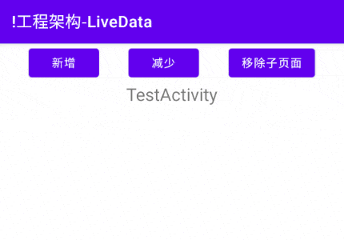
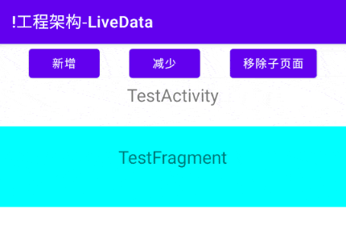

# 简介
LiveData是一种可被观察的数据容器，观察者可以注册回调，每当容器内的数据发生改变时，LiveData将会通知所有观察者数值变更。

LiveData与其他观察者模式工具相比，新增了生命周期感知功能，它只会通告消息给状态为活跃的观察者，并且会自动注销非活跃观察者的回调，使用起来更加便捷。

# 基本应用
我们首先创建一个ViewModel类，用来承载LiveData。

MyViewModel.java:

```java
public class MyViewModel extends ViewModel {

    // 基本类型数值
    private int num = 0;

    // 可变LiveData，其中的数值可以被修改。
    private final MutableLiveData<Integer> numberData = new MutableLiveData<>();
    // 不可变LiveData，仅可被外部观察。
    public final LiveData<Integer> roNumberData = numberData;

    // 数值增加
    public void plus() {
        // 改变数值
        num += 10;
        // 通知观察者数值发生变化
        numberData.setValue(num);
    }

    // 数值减少
    public void minus() {
        // 改变数值
        num -= 10;
        // 通知观察者数值发生变化
        numberData.setValue(num);
    }
}
```

在ViewModel中，我们声明了一个基本数据类型的变量"num"，并提供对应的数值增加方法 `plus()` 和数值减少方法 `minus()` 用于修改变量的值。

我们还声明了两个LiveData变量以供外部观察普通变量"num"的数值变化，它们的泛型为Integer，对应普通变量"num"的类型。其中私有变量"numberData"的类型为MutableLiveData，它的值可以被改变；而公开变量"roNumberData"的类型为LiveData，它的值只能被外部观察但不能修改，我们在变量名前添加"Read Only"的缩写，以便与"numberData"作区分。每当"num"的数值被改变时，我们调用MutableLiveData的 `setValue()` 方法将最新数值通告给观察者。

我们在测试Activity中获取MyViewModel实例，并观察公开的LiveData变量"roNumberData"，当"num"的数值发生变化时，将最新数值刷新到界面上。

DemoBaseUI.java:

```java
protected void onCreate(Bundle savedInstanceState) {
    super.onCreate(savedInstanceState);
    setContentView(R.layout.ui_demo_base);

    /* 此处省略部分变量与方法... */

    // 获取当前Activity对应的ViewModel实例
    MyViewModel vm = new ViewModelProvider(this).get(MyViewModel.class);

    // 注册按钮监听器
    btnPlus.setOnClickListener(v -> vm.plus());
    btnMinus.setOnClickListener(v -> vm.minus());

    // 读取LiveData的初始值
    Log.i("myapp", "LiveData初始值：" + vm.roNumberData.getValue());

    // 调用LiveData的"observe()"方法，注册本Fragment为该LiveData的观察者。
    vm.roNumberData.observe(this, new Observer<Integer>() {
        @Override
        public void onChanged(Integer integer) {
            Log.i("myapp", "LiveData数值改变：" + integer);
            // 观察到数值改变时，将其更新到控件上。
            tvContent.setText("Num:" + integer);
        }
    });
}
```

此时运行测试Activity，并点击增减按钮改变"num"的数值，然后观察界面控件的变化。

<div align="center">



</div>

每当我们点击按钮触发ViewModel中的数值改变方法时，"numberData"就会向所有观察者发送通知，Activity初始化时将自身注册为"roNumberData"的观察者，因此能够收到通知并触发 `onChanged()` 回调方法，得到"num"的最新数值。

# 更新数据
LiveData类是不可变的，只能被外部观察，不提供改变数值的方法；而MutableLiveData扩展自LiveData类，提供了 `setValue()` 与 `postValue()` 方法，可以更新内部存储的值。

我们通常只在ViewModel中暴露不可变的LiveData变量，当外部组件需要更新MutableLiveData时，通常伴随着ViewModel中的其他逻辑操作，例如前文示例中的 `plus()` 和 `minus()` 方法，我们可以在此插入日志记录等动作，以便观察数值何时被更新。如果直接对外暴露MutableLiveData变量也是可行的，但这种设计并不被推荐，因为任何组件都可以修改变量的值，并且不会留下日志记录，不便于故障排除。

当我们更新MutableLiveData的内容时，如果在主线程，可以使用同步方法 `setValue()` 。在前文示例中，数值增加方法 `plus()` 是由Activity的按钮触发的，逻辑在主线程中执行，因此我们使用 `setValue()` 方法更新了"numberData"的值。如果更新操作不在主线程中执行，我们必须使用 `postValue()` 方法进行操作，否则会出现异常："IllegalStateException: Cannot invoke setValue on a background thread"。

LiveData的观察者必须在主线程中调用 `observe()` 等方法进行注册，当数据发生变更时，回调方法 `onChanged()` 也会在主线程执行，因此我们可以直接在此书写界面更新逻辑，而不必手动切换至主线程。

LiveData默认没有去重机制，这意味着它不比较新数据与当前数据是否一致，只要收到更新请求就会通知所有观察者。

# 共享数据
ViewModel与LiveData配合可以实现多组件间的数据共享，由ViewModel的前置知识可知，多个组件能够获取到相同的ViewModel实例，如果它们都观察某个LiveData，就能够实现数据的统一分发。

以前文示例为基础，我们在测试Activity中添加一个Fragment，并获取Activity的ViewModel实例，也观察"roNumberData"变量。

TestFragment.java:

```java
public View onCreateView(LayoutInflater inflater, ViewGroup container, Bundle savedInstanceState) {
    View view = inflater.inflate(R.layout.fragment_test, container, false);
    TextView tvContent = view.findViewById(R.id.tvContent);

    // 获取Activity对应的ViewModel实例
    MyViewModel activityVM = new ViewModelProvider(requireActivity()).get(MyViewModel.class);
    // 调用LiveData的"observe()"方法，注册本Fragment为该LiveData的观察者。
    activityVM.roNumberData.observe(getViewLifecycleOwner(), new Observer<Integer>() {
        @Override
        public void onChanged(Integer integer) {
            Log.i("myapp", "LiveData数值改变：" + integer);
            // 观察到数值改变时，将其更新到控件上。
            tvContent.setText("Num:" + integer);
        }
    });
    return view;
}
```

此处省略添加Fragment到Activity中的相关代码片段，我们运行示例应用后，点击增减数值按钮，并观察界面的变化。

<div align="center">



</div>

我们可以观察到每次操作都使Activity与Fragment中的控件同步更新，这表明共享数据是成功的。

# 生命周期感知
LiveData具有生命周期感知功能，只会将新数据发送给当前生命周期状态为活跃的观察者。这种特性提高了性能与安全性，当观察者所在的页面被关闭时，将会自行注销回调方法，避免数据更新时操作到已销毁的控件，导致空指针等异常。

当我们注册观察者时， `observe()` 方法的第一个参数LifecycleOwner指定了该回调需要绑定的生命周期，在Activity中，我们通常传入"this"，当Activity活跃时可以接受更新，而销毁时将会自动注销回调。

在Fragment中，我们可以传入Activity、Fragment或Fragment的LifecycleOwner三种对象，传入Activity则表明绑定Activity的生命周期；Fragment的 `getViewLifecycleOwner()` 方法对应Fragment中View的生命周期，Fragment与其View的生命周期有时并不一致，例如：当我们使用新Fragment替换旧Fragment并启用回退栈时，旧Fragment只会销毁View，而不会销毁整个实例。

大部分情况下我们在Fragment中使用 `getViewLifecycleOwner()` 方法即可，因为LiveData通常都是用来更新界面的，应当将其与View绑定。

# 数据倒灌
前文示例中，当我们首次进入测试页面时，变量"num"初始值为"0"，但界面上并不会收到回调显示该数值。这是因为我们使用无参构造方法创建了LiveData对象，此时其中封装的Integer变量是空值，观察者注册时不会立刻收到回调。

LiveData的有参构造可以为其中封装的变量设置一个初始值，参数的类型与泛型一致：

MyViewModel.java:

```java
private int num = 0;

// 使用"num"的值作为初始值构造LiveData对象
private final MutableLiveData<Integer> numberData = new MutableLiveData<>(num);
```

此时我们运行示例程序，再进入一次测试页面，此时控件显示了LiveData的初始值。

上述结果表明，每当我们注册观察者时，如果LiveData中封装的变量值不为空，就会立刻触发一次 `onChanged()` 回调方法，这种特性被称为“数据倒灌”。有时我们并不希望产生数据倒灌，因为当界面重新加载时可能收到较旧的数据。此时我们可以根据情况添加标志位，判断是否要接受倒灌的数据；或者使用不会发生数据倒灌的 [UnPeekLiveData](https://github.com/KunMinX/UnPeek-LiveData) 等工具替换LiveData。

# 数据转换
## 映射LiveData
部分数据之间存在一定的关联，例如学生的“年龄”可以由“出生年份”与当前年份计算得出，Jetpack中的Transformations工具类提供了一些方法处理此类数据，便于我们将相关逻辑封装在ViewModel中，而不必写在界面组件中，进一步实现数据与界面的解耦。

我们在前文示例中新增一个LiveData变量"squaredData"，使用Transformations的 `map()` 方法与"numberData"联动，一旦"numberData"数值改变，就将其平方值更新到"squaredData"中。

```java
public class MyViewModel extends ViewModel {

    /* 此处省略部分变量与方法... */

    private int num = 0;
    public final MutableLiveData<Integer> numberData = new MutableLiveData<>(num);

    // 自"numberData"转换而来的LiveData，每当"numberData"改变时，它的值自动变为"numberData"的平方根。
    public final LiveData<Integer> squaredData = Transformations.map(numberData, new Function<Integer, Integer>() {
        @Override
        public Integer apply(Integer input) {
            // 计算平方根并返回结果
            return squared(input);
        }
    });

    // 计算平方值
    private int squared(int raw) {
        return raw * raw;
    }
}
```

`map()` 方法的第一参数是需要关联的原始LiveData变量；第二参数是数据映射规则。当原始LiveData的值发生改变时，回调方法 `apply()` 触发，原始LiveData的值通过"input"参数传入，经过处理后结果通过返回值设置给映射后的LiveData。

我们在测试Activity中分别设置两个LiveData的观察者，在 `onChanged()` 回调方法中打印日志并更新界面，此处省略相关内容，详见示例代码。

运行示例程序并点击“新增数值”按钮，观察日志输出。

```text
# 第一次点击新增按钮
2023-05-25 16:02:31.661 8287-8287/net.bi4vmr.study I/myapp: Number LiveData数值改变：10
2023-05-25 16:02:31.665 8287-8287/net.bi4vmr.study I/myapp: Squared LiveData数值改变：100

# 第二次点击新增按钮
2023-05-25 16:02:33.530 8287-8287/net.bi4vmr.study I/myapp: Number LiveData数值改变：20
2023-05-25 16:02:33.531 8287-8287/net.bi4vmr.study I/myapp: Squared LiveData数值改变：400
```

从上述日志可以观察到，当我们首次点击按钮时，"numberData"的值变为"10"，"squaredData"触发 `apply()` 回调方法，经过计算得到数值"100"并通知了观察者。

上述示例中的数据映射方法 `squared()` 返回基本类型数据，可以直接用于更新数据，此时我们使用 `map()` 方法即可。对于部分场景，数据映射方法返回LiveData类型数据，并且每次调用都是新的实例，无法被界面观察，此时需要使用Transformations提供的 `switchMap()` 方法；它的用法与 `map()` 方法类似，区别在于 `apply()` 回调方法返回值类型为LiveData，一旦建立关联后，每当源LiveData的值改变，Transformations生成的LiveData值也会改变，便于界面进行观察。

## 聚合LiveData
MediatorLiveData用于侦听多个LiveData的变化，当任意一个监听目标发生变化时，都会收到回调事件，我们可以进行数据处理，例如统计数据之和等。

我们在前文示例中新增一个"mediatorData"变量，每当原始数值或平方数值任意一个LiveData发生改变时，都将它们累加到"mediatorData"自身。

```java
public class MyViewModel extends ViewModel {

    /* 此处省略部分变量与方法... */

    // 聚合LiveData，当上文的两个LiveData其中之一数值改变时，都将他们的数值叠加到自身。
    public final MediatorLiveData<Integer> mediatorData = new MediatorLiveData<>();

    {
        // 设置初始值为0
        mediatorData.setValue(0);
        // 注册事件源，每当"numberData"的值改变时触发。
        mediatorData.addSource(numberData, new Observer<Integer>() {
            @Override
            public void onChanged(Integer integer) {
                // 此处为了演示方便已经初始化MediatorLiveData，实际使用时需要添加空值判断逻辑。
                assert mediatorData.getValue() != null;
                int current = mediatorData.getValue();
                // 当前数值加上"numberData"的数值。
                mediatorData.setValue(current + integer);
            }
        });

        // 注册事件源，每当"squaredData"的值改变时触发。
        mediatorData.addSource(squaredData, new Observer<Integer>() {
            @Override
            public void onChanged(Integer integer) {
                assert mediatorData.getValue() != null;
                int current = mediatorData.getValue();
                // 当前数值加上"squaredData"的数值。
                mediatorData.setValue(current + integer);
            }
        });
    }
}
```

我们在测试Activity中注册"mediatorData"的观察者后，运行示例程序并点击“增加数值”按钮，观察日志输出。

```text
# 第一次点击增加数值按钮
2023-05-25 16:33:59.909 8568-8568/net.bi4vmr.study I/myapp: Number LiveData数值改变：10
2023-05-25 16:33:59.909 8568-8568/net.bi4vmr.study I/myapp: Squared LiveData数值改变：100
2023-05-25 16:33:59.909 8568-8568/net.bi4vmr.study I/myapp: Mediator LiveData数值改变：100
2023-05-25 16:33:59.909 8568-8568/net.bi4vmr.study I/myapp: Mediator LiveData数值改变：110

# 第二次点击增加数值按钮
2023-05-25 16:34:03.077 8568-8568/net.bi4vmr.study I/myapp: Number LiveData数值改变：20
2023-05-25 16:34:03.078 8568-8568/net.bi4vmr.study I/myapp: Squared LiveData数值改变：400
2023-05-25 16:34:03.078 8568-8568/net.bi4vmr.study I/myapp: Mediator LiveData数值改变：510
2023-05-25 16:34:03.079 8568-8568/net.bi4vmr.study I/myapp: Mediator LiveData数值改变：530
```

从上述日志信息可以发现，首次点击增加数值按钮时，MediatorLiveData首先收到了平方数值改变事件，从"0"变为"100"；然后收到了原始数值改变事件，最终变为"110"。
