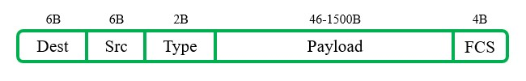
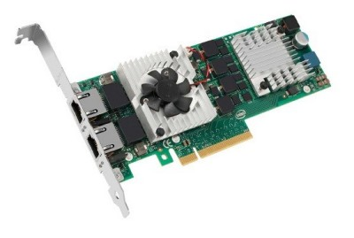
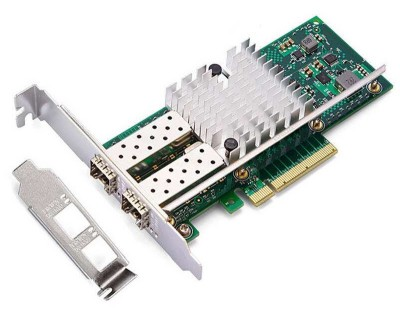

# 简介
以太网(Ethernet)最早由Xerox PARC与1975年研究成功，当时是一种基于CSMA/CD的基带总线网络，速率为2.94Mbps。由于初代以太网使用无源电缆传输数据帧，就以传播电磁波的物质“以太(Ether)”命名了。1980年，由DEC、Intel和Xerox联合标准化形成了DIX Ethernet I标准。到了1982年，标准化组织提出DIX Ethernet II标准，主要更改了DIX Ethernet I的电气特性和物理接口，在帧格式上并无变化。

以太网是被当今局域网广泛采用的通信协议标准，1983年IEEE将其略作修改后定义为IEEE 802.3标准。

# 术语
## MAC地址
媒体访问控制(Media Access Control, MAC)地址，也称为物理地址、硬件地址，用于在同一局域网中唯一标识每个接口。

MAC地址采用十六进制表示，共6字节(48bit)，其中前三字节由IEEE的注册管理机构RA负责分配给不同的厂家，称为编制上唯一的标识符(Organizationally Unique Identifier, OUI)，后三字节由各厂家自行指派给设备接口，称为扩展标识符。

OUI中左起第7位是Global/Local位，取值为"0"时表示全局地址，取值为"1"时表示本地地址，在以太网中全部使用全局地址。左起第8位是Individual/Group位，取值为"0"时表示节点地址，取值为"1"时则表示组播地址。

MAC地址有以下几种常见的书写格式：

```text
思科：XXXX.XXXX.XXXX

微软：XX-XX-XX-XX-XX-XX

其它：XX:XX:XX:XX:XX:XX
```

出厂内置在设备固件中的MAC地址通常无法更改，部分设备的驱动程序提供了修改MAC地址的功能，例如：有线网卡和虚拟网卡，当我们设置新的MAC地址后，设备就不再使用固件内置MAC地址进行通信了。

有些MAC地址具有特殊的用途，设备厂商不应当使用这些地址，我们自定义MAC地址时也不能填写这些值。

<div align="center">

|      MAC地址      |            用途            |
| :---------------: | :------------------------: |
| 01-00-0C-CC-CC-CC |       Cisco VTP协议        |
| 01-00-0C-CC-CC-CD | Cisco PVST/PVST+/RPVST协议 |
| 01-80-C2-00-00-00 |       标准生成树协议       |
| 01-80-C2-00-00-01 |        Pause流控帧         |
| 01-80-C2-00-00-02 |           LACP帧           |
| FF-FF-FF-FF-FF-FF |       链路层广播地址       |

</div>

## 冲突域
通信冲突产生时，冲突碎片影响到的设备与链路集合即为冲突域(Collision Domain)。

共享式以太网的冲突域为整个集线器；交换式以太网的冲突域为交换机的每个端口。

## 广播域
某台设备发送的广播消息可以被一组设备接收，该组设备的集合即广播域(Broadcast Domain)。

## 最大传输单元
最大传输单元(Maximum Transmission Unit, MTU)是指网络的某层次上所能通过的最大数据单元大小，通常以字节为单位。该数值越大，通信效率越高，传输延迟和出错概率也随之增大，所以要权衡通信效率和传输延迟选择合适的MTU值。

# 工作方式
## 半双工
同一时刻只能接收或发送数据，采用CSMA/CD控制方式，逻辑上有最大距离限制。

## 全双工
同一时刻可以接收和发送数据，无需CSMA/CD方式，逻辑上无最大距离限制。

## 自动协商
自动设置双工模式和速率，只适用于双绞线介质。

# 帧结构
Ethernet II的帧结构在RFC 894中定义，各部分的名称如下图所示：

<div align="center">



</div>

🔷 Dest

目的MAC地址。

🔷 Src

源MAC地址。

🔷 Type

上层协议类型，长度2字节。

表明该帧内部封装的上层协议类型，取值必定大于1536(0x0600)。

常见的上层协议与对应的值如下文表格所示：

<div align="center">

|  数值  |      协议       |
| :----: | :-------------: |
| 0x0800 |      IPv4       |
| 0x0805 |  X.25 Level 3   |
| 0x0806 |       ARP       |
| 0x0835 |      RARP       |
| 0x80F3 |  AppleTalk ARP  |
| 0x8137 |       IPX       |
| 0x86DD |      IPv6       |
| 0x8809 |      LACP       |
| 0x880B |       PPP       |
| 0x8847 |  MPLS Unicast   |
| 0x8848 | MPLS Multicast  |
| 0x8863 | PPPoE Discovery |
| 0x8864 |  PPPoE Session  |
| 0x88CC |      LLDP       |

</div>

🔷 Data

有效数据载荷。

通常是网络层的数据包，最小长度为46字节，最大长度通常为1500字节。

🔷 FCS

帧校验序列。

发送方使用CRC算法计算所有其他字段的校验码并填入FCS字段，接收方使用同样的方法进行CRC计算，将得到的结果与收到的FCS字段做对比，如果值不一致，就表示帧在传输过程中受到了干扰，需要丢弃。

<br />

除了以上内容，以太网帧前部还包含一些控制信息，首先是重复7次的"10101010"，称为前导字段(Preamble)，用于信号同步，传输时使用LSB方式；随后是"10101011"，称为帧起始定界符，表示一个帧的开始。

# 最小帧间隔
网络设备接收完一个数据帧之后，需要一段短暂的时间来恢复并为接收下一帧做准备。我们使用帧间隔(Interframe Gap, IFG)描述相邻两帧之间的间隔大小，以太网的最小帧间隔是12字节(96bit)。

# 以太网网卡
终端设备通过网络接口卡(Network Interface Card, NIC)接入网络中，网络接口卡简称网卡，包括控制器、缓存、收发电路、ROM等部分，它与终端设备的I/O通道相连，在计算机系统中作为一种输入/输出设备工作。

网卡根据具体的网络类型而设计，随着以太网的普及，目前应用最多的就是以太网网卡，很多计算机主板也集成了网卡组件，用户不需要额外购买即可使用。

以下图片展示的是一种使用双绞线电缆作为传输介质的以太网网卡：

<div align="center">



</div>

除了常见的铜缆网卡之外，对速率要求较高的场合也会使用光纤网卡。

<div align="center">



</div>
