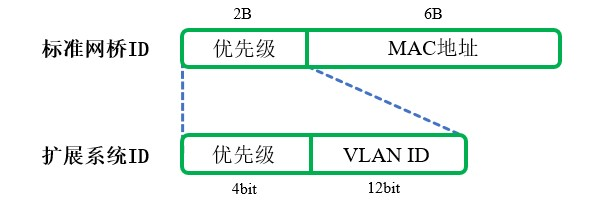

# 概述
为了保证链路时刻都能正常工作，就需要部署冗余链路，避免单点故障；但物理意义上的冗余链路会造成交换环路，引起广播风暴、重复帧、MAC地址表震荡等问题。

生成树协议(Spanning Tree Protocol, STP)通过交换机之间的报文交互，以某台交换机为根，生成一个树形拓扑，在逻辑上阻塞部分冗余端口，防止Trunk链路之间形成环路。同时也为网络提供了冗余链路切换功能，当拓扑发生变化时，STP将重新计算最佳路径，开放之前阻塞的端口，确保网络的连通性。

生成树协议经过长时间的发展，产生了许多不同的标准，它们分别是：

- IEEE 802.1D CST
- IEEE 802.1w RSTP
- IEEE 802.1s MSTP
- Cisco PVST/PVST+/Rapid PVST+

标准生成树(CST)在IEEE 802.1D标准中定义，它不识别VLAN信息，交换区域内的所有设备维护同一颗生成树，所有VLAN只能使用相同的路径转发数据帧。CST的这种策略必然使得部分链路被停用，仅当活动链路出现故障时，被停用的链路才会接替前者的职责，所以CST只实现了冗余备份，并不能实现负载均衡功能。

# 术语
## 根网桥
为了使网络中所有交换机达成一致的无环拓扑，必须有一个参考点作为树的根节点，这种参考点被称为根网桥(Root Bridge)。

## 网桥ID
网桥ID(Bridge ID)是一个长度8字节的值，每台交换机都有唯一的网桥ID，以便交换机之间相互识别并选举出根网桥。

网桥ID由优先级和MAC地址两个字段组成：

🔷 网桥优先级

交换机的权重，共2字节，取值范围为： `[0, 65535]` ，用户可以手动调整，通常交换机的默认优先级为32768(0x8000)。

🔷 MAC地址

可以来自背板MAC，也可来自交换引擎，该部分由厂商设置，管理员无法手动调整。

## 扩展系统ID
思科的PVST协议为每个VLAN各维护一棵生成树，需要区别不同VLAN的报文，所以引入了扩展系统ID：将优先级字段的低12位定义为VLAN ID。

这种设计使得工程师只能调整优先级的高4位，因此优先级必须是4096的倍数，大多其它厂商的系统也使用了同样的设计来兼容基于VLAN的生成树协议。

## 路径成本
交换机寻找最佳路径时使用“路径成本(Cost)”这一概念进行比较，链路的带宽越高，通过该链路传输数据的成本就越低。

链路带宽与Cost值的对应关系如下表所示：

| 链路带宽 | IEEE 802.1t | Cisco |
| :------: | :---------: | :---: |
|   10M    |   2000000   |  100  |
|   16M    |      -      |  62   |
|   45M    |      -      |  39   |
|   100M   |   200000    |  19   |
|   155M   |      -      |  14   |
|   622M   |      -      |   6   |
|    1G    |    20000    |   4   |
|   10G    |    2000     |   2   |

## 根端口
根端口是本地交换机去往根桥的最近端口。

非根桥交换机收到根桥的BPDU后，将报文中的路径开销加上本地端口开销计算出总开销，然后选取总开销最小的端口作为根端口(Root Port)。

## 指定端口
每个LAN区域到达根网桥只能有一个端口，否则将会产生环路，这个端口就是指定端口(Designated Port)，也是本网段到根网桥最近的端口，会向网段内通告Hello BPDU。

## 非指定端口
非根端口、非指定端口即为阻塞端口(Block Port)，也叫非指定端口(NonDesignated Port)，只侦听BPDU而不进行数据转发。

## 端口ID
端口ID用于选举根端口和指定端口，值越小优先级越高。
端口ID由优先级和端口编号两个字段组成：
    • 端口优先级
取值范围为0-255，默认值为128，用户可以手工修改，但必须是16的倍数。
    • 端口编号
物理端口的编号。

# BPDU帧结构
交换机间通过网桥协议数据单元(Bridge Protocol Data Unit,BPDU)进行协商，从而维护树状拓扑结构。BPDU采用IEEE 802.3格式进行封装，DSAP与SSAP均为0x42。

    • Protocol
表示生成树协议，取值恒为0。
    • Version
协议版本，CST取值为0，RSTP取值为2，MSTP取值为3。
    • Type
报文类型，配置(TC)BPDU取值为0x00，拓扑变更通告(TCN)BPDU取值为0x80，RSTP/MSTP BPDU取值为0x02。
    • Flags
标记，其中含有TC(拓扑变更)/TCA(拓扑变更确认)位。
    • Root ID
根网桥标识符，其中高16位为优先级，默认值为32768。
    • Cost of Path
到达某个网桥的路径成本。
    • Bridge ID
发送该BPDU的网桥标识符，其中高16位为优先级，默认值为32768。
    • Port ID
发送该BPDU的端口标识符，其中高8位为优先级，默认值为128。
    • Message Age
消息有效期，根网桥发送的BPDU数值为0，其它网桥将其+1后再转发，接收方用Max Age数值减去Message Age即可判断剩余有效期。
    • Max Age
最大消息有效期，由根桥下发。
    • Hello Time
Hello时间间隔，默认为2秒，由根桥下发。
    • Forward Delay
转发延迟，指端口开启后直到可以转发数据所需的时间，默认为15秒，由根桥下发。

# BPDU类型
                • 配置BPDU
根网桥向其它设备周期性发送配置(Topology Configuration,TC)BPDU，用于建立并维护生成树拓扑。
                • TCN BPDU
下游设备检测到拓扑变更后，向根桥发送拓扑变更通告(Topology Change Notification,TCN)BPDU，直到其收到根网桥发出的TCA位置位的配置BPDU。
                • 次优BPDU
如果短时间内收到多份BPDU，交换机将会按照下列顺序进行比较，并选出最优的（数值最小的）BPDU，其他BPDU则称为次优BPDU。
    • 根桥ID（RBID）
    • 根路径开销（RPC）
    • 发送方网桥ID（SBID）
    • 发送方端口ID（SPID）
    • 接收方端口ID（RPID，本地计算）

# 工作流程
                • 选举根网桥
交换机之间通过BPDU报文交互，选出网桥ID最小的交换机作为根网桥。
开始时每台交换机都假设自己是根桥，发送Hello BPDU的同时进行监听，一旦收到比自己更优的Hello BPDU，则可以得知自己不是根桥，随即停止发送自己的BPDU。
 
图 4-19 选举根网桥
三台交换机的优先级相同，但是交换机A的MAC地址最小，最终交换机A成为根桥。
根网桥的选举是一个持续的过程，当前根网桥可以被抢占，如果有网桥ID更小的交换机接入现网，根网桥就会发生改变。
                • 选举根端口
非根桥交换机寻找自身到根桥的最优路径，路径上自身这一侧的端口成为根端口。

图 4-20 选举根端口
交换机B到达根网桥可以走B-A(成本为4)，也可以走B-C-A(成本为8)，B-A成本更低，所以G0/1端口成为根端口。交换机C也进行同样的过程，其G0/1成为根端口。
                • 选举指定端口
每个网段选举出一个指定端口，向网段内发送最优BPDU，剩余的端口都将被阻塞。

图 4-21 选举指定端口
点到点直连的LAN区段中，根端口对端必然是指定端口。

# 生成树原则
    • 每个交换区域内只有一个根网桥，根网桥具有最小的网桥ID，并且所有端口均为指定端口。
    • 每个非根桥只能有一个根端口，根端口到达根网桥的代价最低（收到的BPDU的COP数值+本地开销结果最小的端口）。
    • 每个LAN区段只能有一个指定端口，点到点LAN区段根端口对端必然是指定端口。
    • 每个端口会保存自己发送或接收的最优BPDU并用于比较。指定端口会保存自己发送的BPDU，根端口和阻塞端口会保存接收到的BPDU。

# 端口状态机
                • 禁用(Disable)
管理员关闭了该端口。
                • 阻塞(Blocking)
不转发数据帧，接收但不转发BPDU报文。
                • 侦听(Listening)
不转发数据帧，接收并发送BPDU报文。
                • 学习(Learning)
不转发数据帧，接收并发送BPDU报文，并且进行MAC地址学习。
                • 转发(Forwarding)
转发数据帧，接收并发送BPDU报文，并且进行MAC地址学习。
默认设置下，阻塞到侦听需要20秒，侦听到学习需要15秒，学习到转发需要15秒。

# 拓扑变更与重收敛
收敛完成的拓扑中，只有根交换机会发送配置BPDU，非根桥不会发送配置BPDU。
当非根桥发现拓扑变更时，会从根端口发送TCN BPDU，上联的交换机收到该消息后然后继续向根桥方向发送TCN BPDU，并向下联设备回复TCA置位的普通BPDU；根桥收到TCN BPDU后将此消息泛洪给所有交换机，收到TCN BPDU的交换机会使用根桥配置BPDU中的Forward Delay字段给CAM表设置超时，防止错误的MAC地址信息造成无法通信。

# Cisco对生成树的优化
1.1  PVST/PVST+/RPVST
1.1.1  概述
在拥有多个VLAN的网络中，如果共享一棵生成树，冗余链路就成了备份链路，平时没有被使用，浪费了链路带宽。思科公司开发了一系列私有生成树协议用来实现链路负载均衡功能。
1.1.2  PVST
思科公司开发了PVST（每VLAN生成树）协议，从名称就可以看出，PVST不像标准STP那样只维护一棵生成树，而是为每个VLAN单独维护一棵生成树，这样不同的VLAN就可以使用不同的根桥，利用空闲的链路资源。
1.1.3  PVST+
PVST+(Per-VLAN Spanning Tree Plus)协议是PVST协议的增强版，允许CST区域的信息传给PVST区域，以便与其他厂商的设备进行互操作。
1.1.4  RPVST+
Rapid PVST+是基于PVST+，并且采用RSTP机制运行的生成树协议，其为每个VLAN维护一棵生成树并且拥有RSTP快速收敛的特性。

                • PortFast
若交换机连接终端设备，当STP收敛完成之后，将设备接入或移出现网，这种链路的变化肯定不会导致根端口改变。在标准的STP中，只要检测到链路状态发生变化，交换机就会向根桥发送TCN报文，根桥向全网泛洪TCN报文通知其它交换机使MAC地址表超时，经过侦听、学习各15秒后重新进入转发状态，所以每次终端接上网线要等30s才能上网。
PortFast特性表明一个端口是接入端口，不参与STP计算，开启了该特性的接口可以直接在阻塞和转发状态间切换，收敛时间减少到了1s以内。而且这种接口的状态迁移不会导致根交换机产生TCN报文，使全网MAC地址表超时。
交换机的端口开启了该特性后，如果收到BPDU报文将立刻变回普通端口。因为收到BPDU就意味着该端口连接到了其它交换机上，为了防止可能出现的环路，它的PortFast特性就应该被撤销。
    • 开启PortFast特性
Cisco(config-if)#spanning-tree portfast {Trunk}
Trunk：在有特殊用途的Trunk端口上开启PortFast特性。
    • 在所有Access接口上开启PortFast特性
Cisco(config)#spanning-tree portfast default
                • UplinkFast
接入交换机一般应用两条上行链路连接到分布层，一条作为主要链路，另一条作为冗余链路。STP收敛后备用链路的一端被阻塞，一旦主要链路故障，需要经过一段时间备份链路才能正常工作。
UplinkFast特性提供了非根桥交换机快速切换根端口的能力。交换机一旦发现主要链路故障，立刻把原先被阻塞的备份链路端口直接切换到转发状态，并且向新链路发送伪帧（包含自己MAC地址表项的空数据帧），以更新上联交换机的MAC地址表。
    • 开启UplinkFast特性
Cisco(config-if)#spanning-tree uplinkfast
    • 更改伪帧发送速率（默认150帧/秒）
Cisco(config-if)#spanning-tree uplinkfast max-update-rate [帧/秒]
                • BackboneFast
当一台交换机通过非指定端口接收到了次级BPDU，则交换机会通过根端口发送RLQ Request报文，询问根交换机是否失效。如果交换机通过根端口收到了次级BPDU，则交换机会判断自己是否拥有非指定端口；如果有，则通过所有非指定端口发送查询报文，如果没有非指定端口，则该交换机选举自己为根交换机，建议在所有交换机上启用。
    • 开启BackboneFast特性
Cisco(config)#spanning-tree backbonefast

<!-- TODO
1.1.9   相关配置
                • 基础配置
    • 设置生成树模式
Cisco(config)#spanning-tree mode pvst
Cisco设备仅支持PVST协议，不支持CST。
    • 设置交换机的优先级
Cisco(config)#spanning-tree vlan [VLAN ID] priority [优先级]
优先级：取值范围为[0,61440]，扩展系统ID开启时，必须是4096的倍数。
                • 参数调整
    • 设置端口的开销
Cisco(config-if)#spanning-tree vlan [VLAN ID] cost [开销]
    • 设置端口的优先级
Cisco(config-if)#spanning-tree vlan [VLAN ID] port-priority [优先级]
    • 设置Hello帧间隔
Cisco(config)#spanning-tree mst hello-time [Hello帧间隔/秒]
    • 设置BPDU最大跳数
Cisco(config)#spanning-tree mst max-hops [最大跳数]
    • 设置转发延迟
Cisco(config)#spanning-tree mst forward-time [转发延迟/秒]
                • 查询相关信息
    • 查看生成树概要信息
Cisco#show spanning-tree summary
    • 查看指定VLAN的生成树信息
Cisco#show spanning-tree vlan [VLAN ID]
-->
