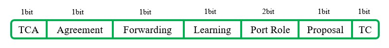

# 概述
IEEE 802.1w标准中提出了快速生成树协议(Rapid STP, RSTP)，它对IEEE 802.1D标准进行优化，实现了PortFast等实用特性，改善了生成树的收敛速度。

# 术语
## 根端口(Root Port)
根端口，同IEEE 802.1D。

## 指定端口(Designated Port)
指定端口，同IEEE 802.1D。

## 替代端口(Aternative Port)
替代端口，是指收到了次优BPDU的端口，可以在根端口失效时迅速接替其工作。

## 备份端口(Backup Port)
备份端口，是指收到了自己的BPDU但ID不是最小的端口，作为指定端口的备份。

## 边缘端口(Edge Port)
边缘接口，即交换机上的Access接口，用于接入终端设备，特性同PortFast，这种端口的状态迁移不需要参与生成树计算。

# BPDU帧结构
RSTP BPDU的版本号为2，扩展了原先的Flag字段，新增6个新的标签选项。运行IEEE 802.1D的交换机不能识别这种BPDU，会将其丢弃。

# BPDU类型
RSTP协议只使用配置BPDU，其对BPDU的处理方式和IEEE 802.1D不同，原先非根桥的RP收到根桥的BPDU后，会重新生成一份BPDU向下游交换机发送；RSTP中交换机不论是否从根桥收到BPDU，都会在Hello时间里生成BPDU并发送，若连续3个Hello时间内都没有收到任何BPDU，那么交换机会认为它失去了到达相邻交换机RP或DP的连接。这种快速老化的机制使得链路故障能够被及时发现。

# RSTP端口状态机
## Discarding

不转发数据帧，接收但不转发BPDU报文，包括CST中8的禁用、阻塞和监听。

## Learning

不转发数据帧，接收并发送BPDU报文，并且进行MAC地址学习。

## Forwarding

转发数据帧，接收并发送BPDU报文，并且进行MAC地址学习。

# 工作流程
## 选举根端口与指定端口
设备启动后，首先选举根端口与指定端口，此步骤操作与标准生成树的运作方式相同。

上述步骤完成后，剩余的端口将处于阻塞状态，RSTP将阻塞端口细分为替代端口(AP)和备份端口(BP)，需要进一步选举。

## 选举替代端口
能够收到次优BPDU的阻塞端口，将成为替代端口，一旦根端口失效，替代端口能够迅速地接替其工作。

交换机C收到交换机B发出的BPDU，其开销比交换机A直接发出的BPDU更大，所以判定其为次优BPDU，并将"G0/2"设为替代端口，作为"G0/1"的备份。

## 选举备份端口
如果一台交换机的多个端口接入到同一网段中，并且网段内存在指定端口，那么序号较大的端口将会收到序号较小的端口发出的BPDU，由于端口优先级较低，序号较大的端口将被标记为备份端口，一旦指定端口失效，备份端口将迅速接替其工作。

交换机B的"G0/2"成为了指定端口，其发出的BPDU被"G0/3"接收，因为"G0/3"优先级较低，所以被设为备份端口，作为"G0/2"的备份。

# 链路类型
RSTP定义了两种链路类型：点到点和共享类型，RSTP的大多数优化机制只适用于点到点类型网段，在共享类型的网段将会使用原始的CST操作方式。并且，RSTP交换机发送报文给邻居后如果迟迟收不到回应，将会以CST格式发送BPDU。

在现代局域网设计中，交换机之间的链路几乎都是点到点类型，而含有集线器或非网管交换机的LAN区段是共享类型。Catalyst系列交换机上，链路类型取决于接口的双工模式，当自动识别出现错误时，可以使用命令强制更改链路类型。

链路类型：

🔷 点到点类型

交换机直连其它交换机，接口处于全双工模式。

🔷 共享类型

交换机连接集线器或非网管交换机，接口处于半双工模式。

<!-- TODO
                • 基本配置
    • 更改生成树协议模式
Cisco(config)#spanning-tree mode rapid-pvst
Cisco设备仅支持RPVST，不支持标准的RSTP。
                • 参数调整
    • 设置边缘端口
Cisco(config-if)#spanning-tree portfast
    • 将所有Access端口设置为边缘端口
Cisco(config)#spanning-tree portfast default

                • 强制更改链路类型
Cisco(config)#spanning-tree link-type [point-to-point|shared]
-->
