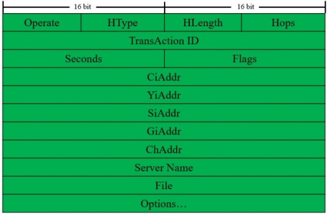
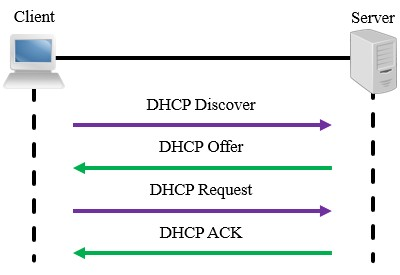
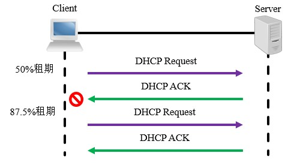
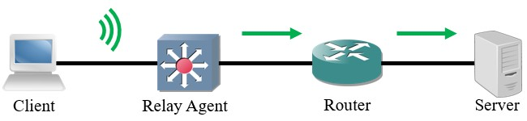

# 概述
动态主机配置协议(Dynamic Host Configuration Protocol, DHCP)被广泛应用于各种局域网、广域网环境中，其主要作用是集中管理与分配IP地址，使网络中的主机能动态获取IP地址、默认网关、DNS地址等信息，能够提升网络的可管理性，并防止IP地址冲突。

DHCP协议的前身是BOOTP协议，它也能够分配IP地址、子网掩码、默认网关、DNS地址、网络启动服务器等信息；但BOOTP协议是静态的，管理员需要知道客户端的MAC地址并提前配置对应的IP地址，使用较为繁琐，已经被DHCP所取代了。DHCP协议采用客户端/服务器模型，并且能够兼容BOOTP协议，在RFC 2131中有相关描述。

# 术语
## DHCP服务器
为接入的终端提供IP地址分配服务的设备即可称为DHCP服务器。

## DHCP客户端
终端设备可以从DHCP服务器请求地址，此时就是一个客户端。除此之外，我们也可以将网络设备的端口作为DHCP客户端，使其从DHCP服务器获取相关信息。

## 客户端标识符
DHCP服务器可以使用标识符来唯一标识每个客户端，有时也可以使用硬件地址标识客户端。

## 作用域
通常是一个网段，DHCP服务器根据作用域为相应的设备提供服务。

## 排除地址
作用域内的某些地址有特殊用途，这些地址不能被分配给终端设备。

## 地址池
除了排除地址，作用域内所有可分配地址的集合称为地址池。

## 租约时间
客户端通过动态分配方式获得的地址有最长使用时间限制，租约期过半时客户端将会尝试向服务器续订地址。

对于较小型、客户端连接断开频繁的环境，可以设置较短的时间，以便时回收地址资源；对于较大型、客户端相对固定的环境，可以设置较长的时间，减少DHCP报文交互对带宽资源的占用。

# 报文格式
DHCP报文封装在UDP协议中，服务器使用67端口，客户端使用68端口。

<div align="center">



</div>

🔷 Operate
<br />
操作类型，客户端请求值为1，服务器应答值为2。

🔷 HType
<br />
硬件类型，以太网值为1。

🔷 HLength
<br />
硬件地址长度，以太网使用MAC地址，值为6。

🔷 Hops
<br />
跳步计数，同网段内为0，需要中继时经过一个站点数值+1。

🔷 TransAction ID
<br />
事务ID，客户端随机产生，用来标识一个会话，服务器只需复制该数值该数值即可。

🔷 Seconds
<br />
客户端重新申请地址经过的时间。

🔷 Flags
<br />
最高位为1时表示服务器使用广播方式发送响应报文，其余位保留。

🔷 CiAddr
<br />
客户端请求续期租约时，原先获得的地址将会填入此处。

🔷 YiAddr
<br />
服务器会将分配给客户端的地址填入此处，DHCP Offer和ACK消息中将会携带。

🔷 SiAddr
<br />
若客户端需要使用网络启动，此处填写启动服务器的地址。

🔷 GiAddr
<br />
若需要跨网段进行DHCP中继，中继代理会将自己的地址填入此处。

🔷 ChAddr
<br />
长度16字节，客户端的硬件地址，不满16字节的部分填充"0"。

🔷 Server Name
<br />
长度8字节，服务器的名称字符串，以0x00结尾。

🔷 File
<br />
长度16字节，若客户端需要使用网络启动，此处填写启动程序的路径。

🔷 Options
<br />
不定长字段，可以向终端设备提供更多的设置信息，如掩码、默认网关、DNS服务器地址等。报文中可携带多个选项，选项为TLV格式，首字节为序号，次字节为该项的数据长度，最后为选项内容。

常用的DHCP选项见下表：

<div align="center">

| 代码  |              用途               |
| :---: | :-----------------------------: |
|   1   |            子网掩码             |
|   3   |            网关地址             |
|   6   |          DNS服务器地址          |
|  12   |           主机名信息            |
|  15   |            域名信息             |
|  51   |            租约时间             |
|  53   |          DHCP消息类型           |
|  54   |         DHCP服务器地址          |
|  55   | 客户端需向服务器请求的信息列表  |
|  58   |  续约时间I，一般为租期的50%。   |
|  59   | 续约时间II，一般为租期的87.5%。 |
|  60   |          设备厂商信息           |
|  61   |          客户端标识符           |
|  82   |          中继代理信息           |
|  255  |        选项区域结束标志         |

</div>

# 报文类型
## Discover
客户端接入网络时广播该消息，等待服务器响应。

## Offer
服务器通告给客户端其可以提供的配置信息。

## Request
客户端接受服务器推送的配置或需要续租地址时发送给服务器。

## Decline
客户端若发现服务器推送的地址已被占用，则用此报文告知服务器。

## ACK
服务器确认客户端接受了配置的消息，正式建立地址与客户端的映射关系。

## NAK
服务器用于告知客户端其请求的地址不正确或租期已超时。

## Inform
当客户端已有IP地址时，用该报文向服务器请求其它参数。

## Release
客户端释放已被分配的地址前，用该报文通知服务器。

# 工作流程
## 首次租用地址
客户端网卡启用后，首先向网段内广播DHCP Discover消息，以请求地址信息；服务器收到Discover消息后，将从地址池中选择一个可用地址，将其装入DHCP Offer消息并广播到相应网段。客户端收到Offer消息后广播DHCP Request消息，告知服务器确认使用Offer消息中分配的地址，服务器广播DHCP ACK消息，同时正式建立IP地址与客户端的映射关系。服务器回复消息是否为广播由Flag位决定，各厂商设置不同。

<div align="center">



</div>

当网络中存在多个DHCP服务器时，客户端将会选择其最先收到Offer消息的发送者。

## 续租地址
续约时间I到期时，客户端将会发送Request消息以请求续约，收到ACK消息后即可继续使用当前地址。如果没有成功，将会在续约时间II到期时再次尝试续约；最终租约时间到期后，客户端将会放弃当前地址，重新开始申请过程。

<div align="center">



</div>

# 配置方法
## 基础配置

🔷 开启/关闭DHCP服务

```text
Cisco(config)# {no} service dhcp
```

🔷 创建地址池并配置要分发的信息

```text
Cisco(config)# ip dhcp pool [地址池名称]
Cisco(dhcp-config)# network [网络ID] [子网掩码]
Cisco(dhcp-config)# default-router [默认网关地址]
Cisco(dhcp-config)# dns-server [DNS服务器地址]
```

## 参数调整
🔶 添加排除地址

```text
Cisco(config)# ip dhcp excluded-address [起始地址] {结束地址}
```

仅需排除单个地址时将其填入起始地址即可，结束地址不用填写。

🔶 设置租约时间

```text
Cisco(dhcp-config)# lease [天数] [小时] [分钟]
```

🔶 设置域名

```text
Cisco(dhcp-config)# domain-name [域名]
```
🔶 设置扩展选项

```text
Cisco(dhcp-config)# option [选项代码] [数据类型] [数据值]
```

🔶 清除DHCP绑定关系

```text
Cisco# clear ip dhcp binding *
```

# 客户端配置
网络设备的三层接口可以作为DHCP客户端，从服务器获取地址：
Cisco(config-if)#ip address dhcp
                • 查询相关信息
    • 查看地址池配置
Cisco#show ip dhcp pool
    • 查看客户端与地址映射关系
Cisco#show ip dhcp binding
    • 查看DHCP报文统计信息
Cisco#show ip dhcp server statistics

# DHCP静态绑定
## 简介
有时我们需要给某些客户端分配固定的地址，但又不想在客户端上配置静态地址，此时可以在服务器上手动建立客户端与IP地址的映射关系。

## 配置方法
1.为每个静态映射关系创建单独的地址池。
Cisco(config)#ip dhcp pool [静态地址池名称]
2.设置需要分配给客户端的IP地址。
Cisco(dhcp-config)#host [网络ID] /[前缀长度]
3.绑定客户端标识符或MAC地址。
Cisco(dhcp-config)#client-identifier [客户端标识符]
Cisco(dhcp-config)#hardware-address [MAC地址]
Cisco设备优先识别客户端标识符。

# DHCP中继代理
## 简介
DHCP依赖广播机制运作，DHCP客户端与服务器在同一物理网段时，可以正常工作；若不在同一网段，广播包无法传递给服务器，此时需要配置DHCP中继代理(Relay Agent)。
DHCP中继代理会将客户端的广播包改成单播包，这样客户端的消息就可以在IP网络中路由，直到抵达服务器。需要注意的是，各节点必须拥有到达服务器的路由信息，才能顺利转发数据包。

<div align="center">



</div>

中继节点收到客户端的报文后，会在其中插入Option 82选项，一般包含代理电路ID(Circuit ID)和代理远程ID(Remote ID)，分别标识了客户端信息与中继节点信息，这样服务器就能识别它们的身份了。当中继代理收到服务器的回复报文后，会先移除Option 82选项再将报文发送给客户端。

## 配置方法
DHCP中继代理功能应配置在客户端与服务器之间的第一个三层接口上，若客户端连接交换机，应在客户端VLAN的SVI上配置；若客户端连接路由器，应在路由器直连客户端的端口上配置。

```text
Cisco(config-if)#ip helper-address [DHCP服务器地址]
```

同一个端口上可以配置多条该命令，设备会为每个地址都生成一个相应的单播包。该命令不仅可以中继DHCP，也可以中继其它依赖于广播机制的协议。

# DHCP Snooping
DHCP协议不具备认证机制，因此安全性较差，可能遭到以下攻击：

🔷 假冒的DHCP服务器
<br />
攻击者在自己的设备上建立DHCP服务器，并将自身配置为网关，客户端从假冒的DHCP服务器上获取配置后，将数据发送给假的网关，攻击者就可以截获机密信息。

🔷 拒绝服务攻击
<br />
攻击者模拟出许多不同的终端，向服务器发送大量的DHCP Discover报文，使DHCP服务器地址资源耗尽。

为了防止这些攻击，我们可以部署DHCP Snooping功能。开启DHCP Snooping的设备会读取客户端与服务器的DHCP报文，记录IP地址、MAC地址、VLAN ID、端口ID和租约时间等信息，一旦检测到不符合记录的报文，则丢弃并发出警告。

除了检查报文与自身数据库是否匹配，DHCP Snooping还将VLAN内的端口分为非信任(Untrust)端口和信任(Trust)端口，默认所有端口均不被信任，只能转发Discovery和Request报文；信任端口则可以转发Offer和ACK报文。

## 配置方法
建议在接入交换机上部署DHCP Snooping。

<!-- TODO
1.全局开启DHCP Snooping功能。
Cisco(config)#ip dhcp snooping
2.配置要开启DHCP Snooping功能的VLAN。
Cisco(config)#ip dhcp snooping vlan [VLAN列表]
3.若DHCP服务器在VLAN内，需要将相应端口设为信任端口，使用中继则无需配置。
Cisco(config-if)#ip dhcp snooping trust
4.配置接口每分钟最多接收Discoery报文的数量。（可选）
Cisco(config-if)#ip dhcp snooping limit rate [数量/个] -->
